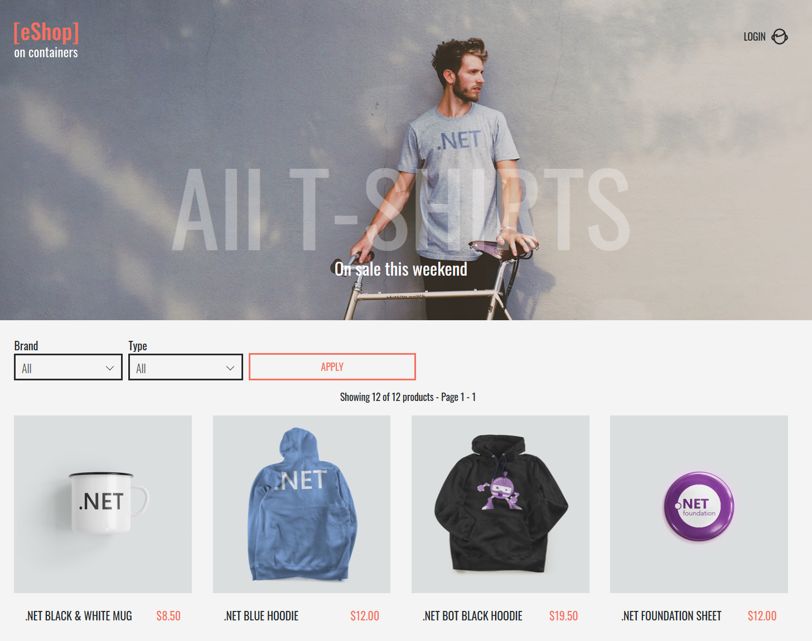

## Setup environment

Visit the [getting started guide]() to deploy or connect to a Radius environment.

{}
Kubernetes support for eShop is still in development. Check back soon for updates.
{}

## Deploy application

Using the [`rad deploy`]() command, deploy the eShop application to your environment:

```sh
$ rad deploy eshop.bicep --parameters adminLogin=admin adminLoginPassword=YOUR-PASSWORD
```

{}
Azure Redis cache can take up to 45 minutes to deploy. Feel free to go grab a cup of coffee and come back in a bit once your application is deployed.
{}

## Verify app health

Once deployed, verify eshop is up and running:

```sh
rad application show -a eshop
```

Then verify the health of the application resources:

```sh
rad resource list -a eshop
```

## Visit eShop

Now that eShop is deployed, you can visit the eShop application in your browser at the URL of your gateway:

```sh
rad resource show webmvc -a eshop
```

