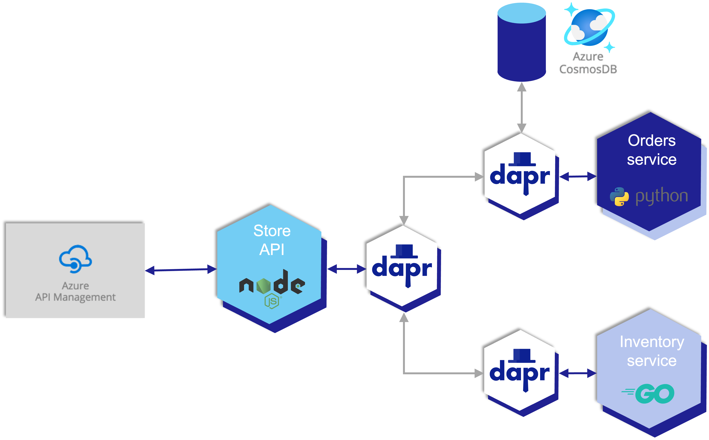

This is a sample microservice solution for demonstrating the Radius local dev experience based on the official [Azure Container Apps Tutorial](https://github.com/Azure-Samples/container-apps-store-api-microservice). It will create a store microservice which will need to call into an order service and an inventory service. Dapr is used to secure communication and calls between services and Radius is used to initialize the local instances of Kubernetes which will be hosting the services.

## Microservices

This Radius application will have three microservices:

- Store API (node-app)
The node-app is an express.js API that exposes three endpoints. / will return the primary index page, /order will return details on an order (retrieved from the order service), and /inventory will return details on an inventory item (retrieved from the inventory service).

- Order Service (python-app)
The python-app is a Python flask app that will retrieve and store the state of orders. It uses Dapr state management to store the state of the orders. When deployed in Container Apps, Dapr is configured to point to an Azure Cosmos DB to back the state.

- Inventory Service (go-app)
The go-app is a Go mux app that will retrieve and store the state of inventory. For this sample, the mux app just returns back a static value.

## Dapr

Dapr will be used to start microservices and enable APIs for things like service discovery, state management, and observability. The code for store-api service invokes other services at the localhost:daprport host address, and sets the dapr-app-id HTTP header to enable service discovery using an HTTP proxy feature.

## Docker

Docker will be hosting the local Kubernetes instances you create and can be ignored for the most part but can be used to check on health status of your local cluster in case anything goes wrong with the Radius Cli.

## Summary

In this tutorial, you will learn how Radius offers:

- A simplified local development enviroment workflow for Kubernetes.
- Relationships between microservices that are fully specified with protocols and other strongly-typed information

In addition to this high level information, the Radius model also uses typical details like:

- Container images
- Listening ports

Keep the diagram in mind as you proceed through the following steps. Your Radius deployment template will aim to match it.

 
