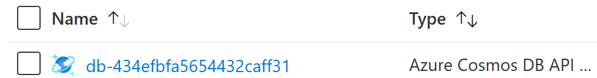
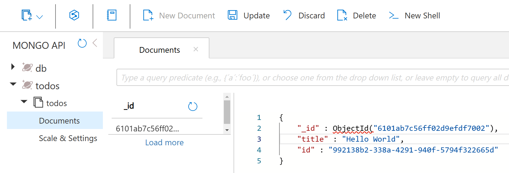

So far you have not yet configured a database, so the todo items you enter will be stored in memory inside the application. If the website restarts then all of your data will be lost!

In this step you will learn how to add a database and connect to it from the application.

We'll discuss template.bicep changes and then provide the full, updated file before deployment. 

## Add db resource

A `db` database resource is used to specify a few properties about the database: 

- **resource type:** `mongo.com.MongoDatabase` represents a MongoDB compatible database.
- **managed:** `true` tells Radius to manage the lifetime of the component for you.





{}
When deploying to an Azure environment, a managed [`mongo.com.MongoDatabase`]() Component will be bound to an Azure CosmosDB API for MongoDB. By declaring your dependency on a generic *MongoDB-compatible* database, your code is more portable.
{}

{}
When deploying to a Kubernetes environment, a managed [`mongo.com.MongoDatabase`]() will be bound to the [`mongo` Docker image](https://hub.docker.com/_/mongo/) running a lightweight developer configuration. 
{}



## Reference db from todoapp

Radius captures both logical relationships and related operational details. Examples of this include wiring up connection strings, granting permissions, or restarting components when a dependency changes.

Once the database is defined as a Component, you can connect to it by referencing the `db` component from within the `todoapp` Component via the [`connections`]() section. 

[`connections`]() is used to configure relationships between two components. The `db` is of kind `mongo.com.MongoDatabase`, which supports the `mongodb.com/Mongo` MongoDB protocol. Configuring a dependency on this protocol is the other part of specifying a relationship. This declares the *intention* from the `todoapp` component to communicate with the `db`.

Here's what the `todoapp` component will look like with the `connections` section added within its properties:

{{< rad file="snippets/app.bicep" embed=true marker="//CONTAINER" replace-key-ports="//PORTS" replace-value-ports="ports: {...}"  >}}

Now that you have created a connection called `itemstore`, Radius will inject additional settings into the `todoapp` container. The container reads the database connection string from an environment variable named `CONNECTION_ITEMSTORE_CONNECTIONSTRING`:


```js
if (process.env.CONNECTION_ITEMSTORE_CONNECTIONSTRING) {
  connectionString = process.env.CONNECTION_ITEMSTORE_CONNECTIONSTRING
  console.log("Retrieved DB connection string from environment variable")
}
```

`CONNECTION_ITEMSTORE_CONNECTIONSTRING` is a setting injected by Radius based on the name of the connection (`itemstroe`) and it's type. See the [`connections`]() section of the documentation for more information about these features.

## Update your template.bicep file 

Update your `template.bicep` file to match the full application definition:



## Deploy application with database

1. Now you are ready to re-deploy the application, including the Mongo database. Switch to the command-line and run: 

   ```sh
   rad deploy template.bicep
   ```

   This may take a few minutes because of the time required to create the database. On completion, you will see the following resources:

   ```sh
   Resources:
      Application          webapp
      Container   todoapp
      HttpRoute            route
      mongo.com.MongoDatabase db
   ```

   Just like before, a public endpoint will be available through the gateway in the `todoRoute` resource.

   ```sh
   Public Endpoints:
      HttpRoute            todo-route       SITE
   ```

1. To test your `webapp` application, navigate to the public endpoint that was printed at the end of the deployment. You should see a page like:

   

   If your page matches, then it means that the container is able to communicate with the database. Just like before, you can test the features of the todo app. Add a task or two. Now your data is being stored in an actual database.

### Validate data

After you have deployed the application, you can validate that the data is being stored in the database.



{}
1. Open the Azure resource group where your application is deployed. The URL was output during the `rad deploy` command.

1. Open the CosmosDB resource prefixed with `db-`

   

1. Open the Data Explorer to the `todos` collection. You can now see the entries you added in the todo app.

   
{}



## Cleanup

{} If you're done with testing, you can use the rad CLI to [delete an environment]() to prevent additional charges in your subscription. {}
