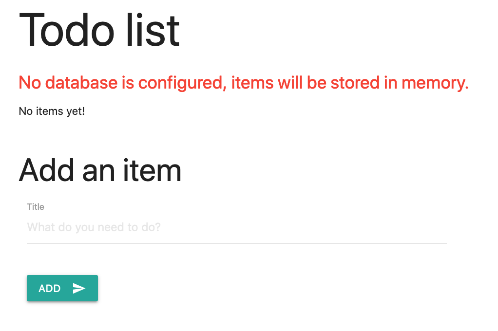

## Define a Radius app as a .bicep file

Radius uses the [Bicep language](https://docs.microsoft.com/en-us/azure/azure-resource-manager/templates/bicep-overview) as its file-format and structure. In this tutorial you will define an app named `webapp` that will contain the container and database resources, all described in Bicep.

Create a new file named `template.bicep` and paste the following:



## Add a container component

Next you'll add resources for the website's frontend.

Radius captures the relationships and intentions behind an application, which simplifies deployment and management. The `todoapp` and `todoRoute` resource in your template.bicep file will contain everything needed for the website frontend to run and expose a port to the internet.

Your `todoapp`, which is a Container resource, will specify:
- **container image:** `radiusteam/tutorial-todoapp`, a Docker image the container will run. This is where your website's front end code lives.
- **bindings:** `http`, a Radius binding that adds the ability to listen for HTTP traffic (on port 3000 here).[]

Your `todoRoute`, which is a HttpRoute resource, will specify:
- **hostname:** `*`, the hostname that the container will be exposed to the internet on. `*` means that all hostnames will be accepted.

Update your template.bicep file to match the full application definition:



## Deploy the application

Now you are ready to deploy the application for the first time.

1. Make sure you have an [Radius environment initialzed]().
   - For Azure environments run `az login` to make sure your token is refreshed.
   - For Kubernetes environments make sure your `kubectl`  context is set to your cluster.

2. Deploy to your Radius environment via the rad CLI:

   ```sh
   rad deploy template.bicep
   ```

   This will deploy the application into your environment and launch the container resource for the frontend website. You should see the following resources deployed at the end of `rad deploy`:

   ```sh
   Resources:
      Application          webapp
      Container   todoapp
      HttpRoute            todo-route
   ```

   Also, a public endpoint will be available to your application as we specified a gateway in the `todoRoute` resource.

   ```sh
   Public Endpoints:
      HttpRoute            todo-route        SITE
   ```

4. To test your `webapp` application, navigate to the public endpoint that was printed at the end of the deployment.

   

   If the page you see matches the screenshot, that means the container is running as expected.

   You can play around with the application's features features:
   - Add a todo item
   - Mark a todo item as complete
   - Delete a todo item

<br>
