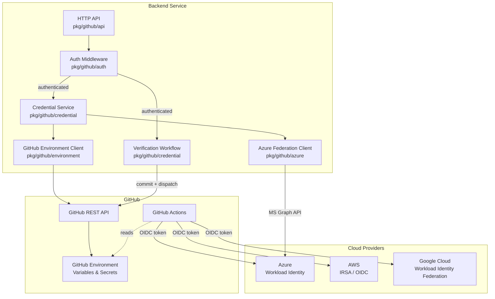

# GitHub OIDC Credential Backend for Radius

* **Author**: Shruthi Kumar (@sk593)

## Overview

The GitHub OIDC Credential Backend enables Radius deployments through GitHub Actions by managing cloud credentials (Azure, AWS, and Google Cloud) as GitHub Environment variables. Instead of storing credentials in Radius, the backend configures GitHub Environments with the information needed for GitHub Actions workflows to authenticate with cloud providers via OIDC (OpenID Connect) token exchange at deploy time.

This removes the need for long-lived secrets in most configurations and automates the `rad credential register` step.

## Terms and definitions

| Term | Definition |
|------|-----------|
| **OIDC** | OpenID Connect — an identity layer on top of OAuth 2.0 used for token-based authentication between GitHub Actions and cloud providers. |
| **Workload Identity (Azure)** | Azure AD federated identity credentials that trust GitHub's OIDC issuer, allowing GitHub Actions to obtain Azure tokens without a client secret. |
| **IRSA** | IAM Roles for Service Accounts — AWS mechanism for federating GitHub Actions OIDC tokens to an IAM role. |
| **Workload Identity Federation (GCP)** | Google Cloud mechanism that allows external identities (GitHub Actions) to impersonate a service account via OIDC. |
| **GitHub Environment** | A GitHub deployment target with protection rules and associated variables/secrets. |
| **Federated Identity Credential** | A trust relationship on an Azure AD application that accepts OIDC tokens from a specific issuer and subject. |

## Objectives

### Goals

- Automate Radius deployments through GitHub Actions so users never need to manually run `rad credential register`. The deploy workflow handles registration automatically using OIDC credentials.
- Support OIDC-based authentication for Azure (Workload Identity), AWS (IRSA), and Google Cloud (Workload Identity Federation).
- Store cloud credential configuration in GitHub Environments — Radius does not persist credentials.
- Provide a credential verification workflow that validates cloud access after setup.
- Support both automated federated credential creation (Azure) and manual OIDC trust setup.

### Non goals

- **Credential storage in Radius**: This backend does not store or manage credentials in Radius UCP or the Radius credential store. Credentials flow from GitHub Environment variables at deploy time.
- **Non-GitHub CI/CD systems**: This design is specific to GitHub Actions. Support for GitLab CI, Azure DevOps, etc. is out of scope.
- **UI implementation**: The backend exposes an HTTP API. A browser extension and web UI exist separately and are not part of this design.
- **Google Cloud implementation**: GCP support is designed but not yet implemented in this PR. It will follow the same pattern as Azure and AWS.

### User scenarios

#### User story 1: AWS OIDC setup

A developer wants to deploy a Radius application to AWS from a GitHub repository. They create an IAM role with an OIDC trust policy for GitHub Actions, then call the backend API to configure a GitHub Environment with the role ARN and region. A verification workflow confirms cloud access.

#### User story 2: Azure Workload Identity setup

A developer configures an Azure deployment environment. They provide a tenant ID, client ID, and subscription ID. The backend creates the GitHub Environment, stores the configuration as variables, and optionally creates the federated identity credential on the Azure AD application via the Microsoft Graph API.

#### User story 3: Google Cloud Workload Identity Federation setup (future)

A developer configures a GCP deployment environment by providing a Workload Identity Provider resource name and a service account email. The backend stores these as GitHub Environment variables. The deploy workflow uses `google-github-actions/auth` to exchange the GitHub OIDC token for GCP credentials.

## User Experience

The backend exposes REST endpoints for each cloud provider. Request and response types are defined in `pkg/github/api/types.go`.

| Endpoint | Required Fields |
|----------|----------------|
| `POST .../environments/aws` | `name`, `roleARN`, `region` |
| `POST .../environments/azure` | `name`, `tenantID`, `clientID`, `subscriptionID`, `authType` |
| `POST .../environments/gcp` (future) | `name`, `workloadIdentityProvider`, `serviceAccountEmail`, `projectID`, `region` |

Each endpoint returns an `EnvironmentResponse` indicating which GitHub Environment variables were set and whether credentials have been verified.

### Credential Verification

```
POST /api/repos/{owner}/{repo}/environments/{name}/verify
```

The backend commits a verification workflow to the repository and triggers it. The workflow authenticates with the cloud provider via OIDC and runs a simple access check:

| Provider | Verification Command |
|----------|---------------------|
| AWS | `aws sts get-caller-identity` |
| Azure | `az account show` |
| GCP (future) | `gcloud auth print-identity-token` |

## Design

### High Level Design

The credential backend acts as an orchestration layer between a UI / API consumer and the GitHub API. It does not interact with cloud provider APIs directly (except for Azure federated credential creation via Microsoft Graph).

```
┌──────────┐     ┌──────────────┐     ┌────────────────┐     ┌────────────────┐
│  UI /    │────▶│  Backend     │────▶│  GitHub API    │────▶│  GitHub        │
│  Client  │     │  HTTP API    │     │  (REST v3)     │     │  Environment   │
└──────────┘     └──────┬───────┘     └────────────────┘     │  Variables     │
                        │                                     └───────┬────────┘
                        │                                             │
                        ▼                                             ▼
                ┌──────────────┐                             ┌────────────────┐
                │  MS Graph    │                             │  GitHub Actions│
                │  (Azure      │                             │  Deploy/Verify │
                │  federation) │                             │  Workflow      │
                └──────────────┘                             └───────┬────────┘
                                                                     │
                                                              OIDC token exchange
                                                                     │
                                                    ┌────────────────┼────────────────┐
                                                    ▼                ▼                ▼
                                              ┌──────────┐   ┌──────────┐   ┌──────────┐
                                              │  Azure   │   │  AWS    │   │  GCP    │
                                              └──────────┘   └──────────┘   └──────────┘
```

### Architecture Diagram



### Detailed Design

#### OIDC Token Exchange Model

All three cloud providers follow the same fundamental pattern:

1. **Setup time**: A trust relationship is configured on the cloud provider's identity platform to accept OIDC tokens from GitHub's issuer (`https://token.actions.githubusercontent.com`) for a specific subject (e.g., `repo:owner/repo:environment:dev`).
2. **Deploy time**: The GitHub Actions runner requests an OIDC token from GitHub, then exchanges it with the cloud provider for short-lived credentials.
3. **No long-lived secrets**: The OIDC token is fresh each run and scoped to the specific workflow/environment.

#### Azure: Workload Identity

**GitHub Environment Variables Set:**
- `AZURE_TENANT_ID`
- `AZURE_CLIENT_ID`
- `AZURE_SUBSCRIPTION_ID`

**OIDC Trust Configuration:**
A federated identity credential is created on the Azure AD application via the Microsoft Graph API:

```json
{
  "name": "radius-{repo}-{environment}",
  "issuer": "https://token.actions.githubusercontent.com",
  "subject": "repo:{owner}/{repo}:environment:{environment}",
  "audiences": ["api://AzureADTokenExchange"]
}
```

The backend can create this automatically when an `azureAccessToken` (with `Application.ReadWrite.All` permission) is provided. Otherwise, the user creates it manually in the Azure portal.

**Deploy Workflow Step:**
```yaml
- name: Azure Login (OIDC)
  uses: azure/login@v2
  with:
    client-id: ${{ vars.AZURE_CLIENT_ID }}
    tenant-id: ${{ vars.AZURE_TENANT_ID }}
    subscription-id: ${{ vars.AZURE_SUBSCRIPTION_ID }}
```

**Fallback — Service Principal:**
When `authType` is `ServicePrincipal`, the client secret is stored as a GitHub Environment secret (`AZURE_CLIENT_SECRET`). This is the only case where a long-lived secret is stored.

#### AWS: IRSA / OIDC

**GitHub Environment Variables Set:**
- `AWS_IAM_ROLE_ARN`
- `AWS_REGION`

**OIDC Trust Configuration:**
The IAM role must have a trust policy that allows the GitHub OIDC provider. Radius provides a CloudFormation template (`deploy/aws/github-oidc-role.yaml`) that creates the OIDC Identity Provider and IAM role with the correct trust policy and permissions for Radius deployments. Users can deploy it via the AWS Console (CloudFormation quickcreate link): 

```json
{
  "Effect": "Allow",
  "Principal": {
    "Federated": "arn:aws:iam::{account}:oidc-provider/token.actions.githubusercontent.com"
  },
  "Action": "sts:AssumeRoleWithWebIdentity",
  "Condition": {
    "StringEquals": {
      "token.actions.githubusercontent.com:sub": "repo:{owner}/{repo}:environment:{environment}"
    }
  }
}
```

**Deploy Workflow Step:**
```yaml
- name: Configure AWS Credentials (OIDC)
  uses: aws-actions/configure-aws-credentials@v4
  with:
    role-to-assume: ${{ vars.AWS_IAM_ROLE_ARN }}
    aws-region: ${{ vars.AWS_REGION }}
```

#### Google Cloud: Workload Identity Federation (future)

**GitHub Environment Variables to Set:**
- `GCP_WORKLOAD_IDENTITY_PROVIDER` — full resource name of the Workload Identity Provider
- `GCP_SERVICE_ACCOUNT_EMAIL` — the GCP service account to impersonate
- `GCP_PROJECT_ID`
- `GCP_REGION`

**OIDC Trust Configuration:**
The user creates a Workload Identity Pool and Provider in GCP that trusts GitHub's OIDC issuer, then grants the `roles/iam.workloadIdentityUser` role on the service account to the pool principal:

```
principalSet://iam.googleapis.com/projects/{project-number}/locations/global/workloadIdentityPools/{pool}/attribute.repository/{owner}/{repo}
```

**Deploy Workflow Step:**
```yaml
- name: Authenticate to Google Cloud (OIDC)
  uses: google-github-actions/auth@v2
  with:
    workload_identity_provider: ${{ vars.GCP_WORKLOAD_IDENTITY_PROVIDER }}
    service_account: ${{ vars.GCP_SERVICE_ACCOUNT_EMAIL }}
```

#### Advantages

- **No long-lived secrets** for Azure WI, AWS IRSA, and GCP WIF — OIDC tokens are short-lived and scoped.
- **Credentials live in GitHub** — credential configuration stored as GitHub Environment variables. The deploy workflow reads them and calls `rad credential register` automatically on the ephemeral Radius installation.
- **Uniform pattern** across all three providers — same backend API shape, same GitHub Environment variable model.
- **Verification workflow** provides confidence that credentials work before deploying.

#### Disadvantages

- **Azure federation requires Graph API access** — the optional auto-creation of federated credentials needs an access token with `Application.ReadWrite.All`.
- **AWS/GCP trust setup is manual** — the backend cannot create IAM roles or Workload Identity Pools; users must do this themselves.
- **GitHub Environment variables are plaintext** — only secrets are encrypted. Role ARNs, tenant IDs, etc. are visible to anyone with repo read access.

#### Proposed Option

Use the OIDC-based approach for all three providers, with GitHub Environments as the credential configuration store. This is the approach implemented in this PR (Azure and AWS), with GCP to follow.

### API Design

See the route definitions in `pkg/github/api/routes.go`. Key endpoints:

| Method | Path | Description |
|--------|------|-------------|
| `POST` | `/api/repos/{owner}/{repo}/environments/aws` | Create AWS environment |
| `POST` | `/api/repos/{owner}/{repo}/environments/azure` | Create Azure environment |
| `POST` | `/api/repos/{owner}/{repo}/environments/gcp` | Create GCP environment (future) |
| `GET` | `/api/repos/{owner}/{repo}/environments/{name}` | Get environment status |
| `GET` | `/api/repos/{owner}/{repo}/environments` | List environments |
| `DELETE` | `/api/repos/{owner}/{repo}/environments/{name}` | Delete environment |
| `POST` | `/api/repos/{owner}/{repo}/environments/{name}/verify` | Trigger credential verification |
| `GET` | `/api/repos/{owner}/{repo}/environments/{name}/verify` | Get verification status |
| `POST` | `/api/repos/{owner}/{repo}/environments/{name}/dependencies` | Save environment dependencies |

### CLI Design

N/A — this backend is accessed via HTTP API, not the `rad` CLI.

### Implementation Details

#### Package Structure

| Package | Responsibility |
|---------|---------------|
| `cmd/github-app/` | Server entry point, configuration loading |
| `pkg/github/api/` | HTTP handlers, routing, request/response types |
| `pkg/github/auth/` | GitHub App JWT, OAuth flow, session middleware |
| `pkg/github/credential/` | Credential orchestration, verification workflow generation |
| `pkg/github/environment/` | GitHub Environment REST API client (variables, secrets, CRUD) |
| `pkg/github/azure/` | Azure AD federated identity credential management via MS Graph |

#### Credential Registration Flow

1. Client sends `POST /api/repos/{owner}/{repo}/environments/{provider}` with credential configuration.
2. Auth middleware validates session or API key.
3. `credential.Service` creates the GitHub Environment via `environment.Client`.
4. Service stores credential values as GitHub Environment variables.
5. (Azure WI only) If `azureAccessToken` is provided, `azure.FederationClient` creates the federated identity credential.
6. Service returns `EnvironmentResult` with the list of variables set.

#### Verification Flow

1. Client sends `POST /api/repos/{owner}/{repo}/environments/{name}/verify`.
2. `credential.Verifier` generates a verification workflow YAML tailored to the provider.
3. Verifier commits the workflow to `.github/workflows/radius-verify-credentials.yml`.
4. Verifier triggers the workflow via `workflow_dispatch`.
5. The workflow runs OIDC login and a provider-specific access check.
6. Client polls `GET .../verify` for status until `success` or `failure`.

### Error Handling

| Scenario | Handling |
|----------|---------|
| Invalid credentials format | 400 Bad Request with validation message |
| GitHub API rate limit | 429 forwarded from GitHub API |
| GitHub Environment creation fails | 500 with GitHub error details |
| Azure federation fails | 500; environment variables are still created, federation status returned as `false` |
| Verification workflow fails | Status returned as `"failure"` with workflow run URL for debugging |
| Unauthenticated request | 401 Unauthorized |

## Test plan

### Unit Tests

All packages in `pkg/github/` have unit tests covering:
- Request validation and serialization
- Credential registration logic with mocked GitHub client
- Verification workflow YAML generation
- Auth middleware (session validation, API key bypass)
- Azure federation client with mock HTTP server

Run: `go test -race ./pkg/github/...`

### Integration Tests

`pkg/github/environment/integration_test.go` exercises the real GitHub API:
- Create environment → set variables → read variables → delete environment
- Requires `GITHUB_TOKEN`, `TEST_GITHUB_OWNER`, `TEST_GITHUB_REPO`

### CI Workflow

`.github/workflows/test-github-oidc-integration.yaml` runs on PRs touching `pkg/github/` or `cmd/github-app/`:

| Job | Description |
|-----|-------------|
| Unit Tests | `go test` with race detector |
| Integration Test | Real GitHub API CRUD |
| Credential Flow Test | Build server binary, test health + auth middleware + workflow generation |

## Security

- **OIDC by default**: Workload Identity (Azure), IRSA (AWS), and Workload Identity Federation (GCP) eliminate long-lived secrets for most configurations.
- **GitHub Secrets encryption**: Service Principal client secrets are encrypted using NaCl sealed box before storage via the GitHub API.
- **OAuth CSRF protection**: State parameter generated and verified on the OAuth callback.
- **No credential logging**: Sensitive fields (client secrets, access tokens) are never logged.
- **Session management**: In-memory session store for development; should be replaced with a persistent store for production.
- **Scoped OIDC subjects**: Federated credentials are scoped to specific `repo:owner/repo:environment:name` subjects, preventing cross-repository token abuse.

## Compatibility

This feature is additive and does not modify existing Radius credential registration, UCP, or deployment flows. Existing `rad credential register` workflows continue to work unchanged.

## Monitoring and Logging

- Server logs requests at info level (method, path, status code, duration).
- Credential registration and verification operations log at info level with environment name and provider.
- Sensitive fields are excluded from all log output.
- GitHub API errors are logged with status code and rate limit information.

## Development plan

1. **PR 1 (this PR)**: Backend API for Azure and AWS OIDC credential setup, verification workflow, unit and integration tests.
2. **PR 2**: Google Cloud Workload Identity Federation support — add `POST .../environments/gcp` endpoint and GCP verification workflow.
3. **PR 3**: Browser extension UI for credential setup (separated from backend).

## Open Questions

1. **GCP auto-federation**: Should the backend support automatic Workload Identity Pool/Provider creation via the GCP IAM API (similar to Azure federation), or is manual setup sufficient?
2. **Production session store**: What persistent session store should replace the in-memory store for production deployments (Redis, database, signed cookies)?
3. **Multi-environment coordination**: Should the backend support linking multiple cloud providers to a single GitHub Environment (e.g., both AWS and Azure)?

## Alternatives considered

### Store credentials in Radius UCP

Credentials could be stored in the Radius credential store via manual `rad credential register` calls by the user. This was rejected because:
- It adds manual steps that can be automated by the deploy workflow.
- It requires users to have a running Radius control plane during initial setup.

### Use GitHub repository secrets instead of Environment variables

Repository-level secrets could store credentials. This was rejected because:
- Environment variables provide environment-scoped isolation (dev, staging, prod).
- GitHub Environment protection rules add approval workflows.
- Environment variables are readable (not write-only like secrets), enabling status checks.

## Design Review Notes

<!-- Update this section with the decisions made during the design review meeting. This should be updated before the design is merged. -->
