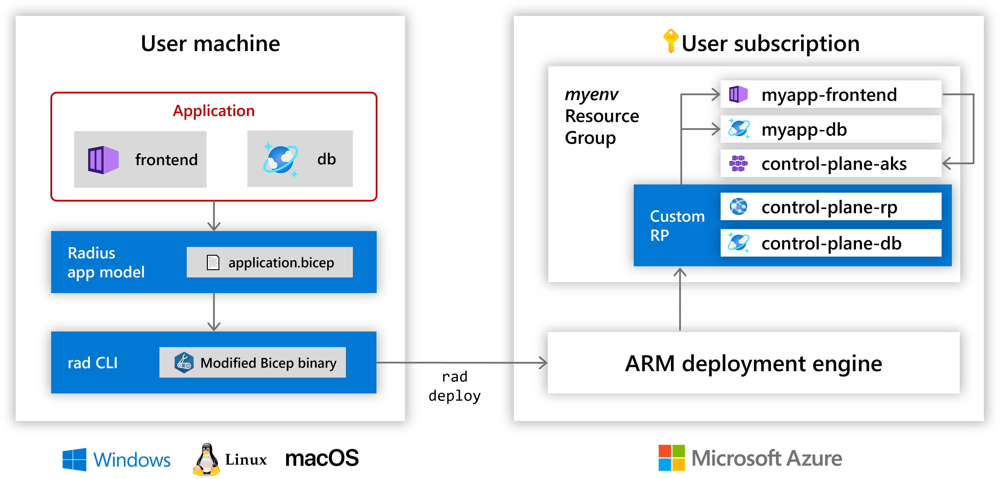

# Contributing to Project Radius

## Architecture

Project Radius can be best understood as the combination of the following components:

- The **`rad` CLI** for deploying and managing environments and applications
- The **application model** for describing applications as a set of components, groupings, and relationships
- The **Bicep** language and tools which includes the application model as a set of types
- The **ARM Deployment Engine** which process the output of the Bicep compiler
- The **Radius API** which interfaces with the ARM deployment engine and other actors to handle individual operations on the application model
- The **Radius Control Plane** that implements operations on the application model as a sequence of resource management operations on a hosting platform
- The **Hosting Platform** that provides the underlying capabilies used by the application model such as running containers and databases

The remainder of this document will explain these components and processes in detail. The intention is to provide enough detail to be useful to new contributors to the project as well as understanding for curious users that want to know about the inner workings of the system. As such, it is recommended that you read and understand the application model concepts before diving into architecture.

## Callouts

As Project Radius is still being developed, some of the information here is speculative, incomplete, or otherwise reflective of the *future state* of the project. 

Here are some examples of how this kind of information will be emphasized.

> 🚀 Future State 🚀 <br>
A description of how things will work in the future.

> 🚧 Under Construction 🚧 <br>
A description of a gap or limitation that we currently have.

>❓ Open Question ❓<br>
A description of something we don't quite know yet. 

## Current state

As an overview, here are some important details about the current state of Radius. At the time of writing we've finished the 0.1 release.

The 0.1 release is suitable for deploying our limited set of tutorial content on Azure. This document will refer to our current experience and architecture on Azure as the **user-mode PaaS**. **PaaS** because it offers a *platform-as-a-service* developer experience. **user-mode** because the resources needed to run Radius use publicly available extensibility and are created in the users' subscription. We do not manage anything centrally for users in 0.1.

We have the goal to target and support multiple *hosting platforms* in the future:

- Azure + AKS: this is the current state for Azure, we target Azure managed services and AKS for compute
- Azure + Serverless: this is the *future state* for Azure, we target Azure managed services and a TBD system for compute
- Kubernetes: will build this soon, no cloud provider required, just Kubernetes
- Local Dev: will build this after Kubernetes, using your dev box and likely Docker as a hosting platform

## Current status

- The only supported **hosting platform** is Azure, using a combination of Azure managed services and AKS to deploy applications
  - As we have not yet implemented a managed service, infrastructure like the AKS cluster running compute workloads is part of the users' subscription
- The **Radius control plane** is very primitive, and requires hand-coded support for every resource type we interact with
  - As we have not yet implemented a managed service, the control plane and its resources is part of the users' subscription
- The **Radius API** is only available in the form of an Azure Custom Resource Provider
- We require a custom build of **Bicep** which includes our types and some custom compiler support
- The **application model** has support for a very limited set of components and traits, we have not yet implemented support for scopes or for multiple deployment units within a single application
- The **rad** CLI can be used to create an Azure environment, which deploys all of the resources necessary for the hosting platform and control plane
- The **rad** CLI can be used to manage applications using ARM as the protocol by communicating with the Radius API
- The **rad** CLI can be used to perform diagnostic operations on applications by communicating with the AKS cluster 



## rad CLI

The `rad` CLI provides features in three major areas:

- Environment setup and management
- Application deployment and management (includes CRUD operations on Radius concepts)
- Application diagnostics and troubleshooting

It can be hard to draw a clear line between *management* and *troubleshooting*, but I think the distinction is useful even through it is sometimes ambiguous. In general the CLI needs to interact both the management plane of the hosting platform (ARM in Azure) as well as the data plane of the hosting platform (logs, port-forwards).

> 🚀 Future State 🚀 <br>
We currently implement all functionality in the CLI as a monolith (Kubernetes, Azure, etc.). In the future we may choose to adopt a decentralized plugin model to factor out extensions for cloud providers such as Azure and other proprietary tech.

### Environment setup

Environment setup is the process of binding an entry in a local config file to a context where applications can be deployed - and *optionally* performing some setup in that environment.

An environment can be:

- A resource group in Azure
- A namespace in Kubernetes
- A user's local Docker daemon

Conceptually, any hosting platform that Radius could target in the future is an environment. We track the context needed to connect to the hosting platform in the per-user configuration so that the user can easily swap between environments. 

#### Azure

> 🚧 Under Construction 🚧 <br>
Currently we only support Azure cloud as an environment.

Azure environments have some notable limitations for now to work as a **user-mode PaaS**. 

- Each resource group where the user wants to deploy Radius applications must have our hosting platform and control-plane running in them. This is performed by our environment setup.
- We support a very limited set of Azure regions based on the availability of resources we use.

Our environment setup is driven by an ARM template and a deployment script (used to initialize AKS). These operations are part of `rad init`. This is needed today because each environment is self-contained (single-tenant) and does not share resources with other subscriptions or other environments in the same subscription.

> 🚀 Future State 🚀 <br>
When we have built a fully-managed Azure service it will remove the need for environment setup to create resources in Azure. It will simply add configuration locally. The control-plane and hosting platform will be centrally-managed as multitenant services like other production Azure services.

A managed service will include the full suite of integrations that users expect.

- `az` CLI
- Azure Portal
- Azure SDKs

>❓ Open Question ❓<br>
There is an open question here about the branding of Radius in Azure in our future state as well as the level of consistency to aim for with other Azure tools like `az` CLI. 

Due to the open-source nature and goals of Radius we blur the lines between a 1st party offering and 3rd party offering. 

Management operations use the ARM protocol to communicate with the Radius API as an Azure resource provider. We have authored an OpenAPI spec for the Radius API and used autorest to generate client code to drive our CLI experiences. We rely on the `az` CLI for authentication and expect users to have it installed for interations with Azure.

Troubleshooting operations use ARM to retrieve credentials for the environment's AKS cluster and then communicate with it directly using the Kubernetes client libraries. 

> 🚀 Future State 🚀 <br>
In the future it's likely that we'll need to talk to some other data plane for troubleshooting in addition to AKS/Kubernetes. 

#### Kubernetes

> 🚀 Future State 🚀 <br>
Environment setup for Kubernetes will install required infrastructure via Helm charts to perform required setup on the cluster. Each cluster will need a one-time setup operation to install all of the Radius control-plane components. For example, we might install the Radius API (`radius-operator`) and Deployment Engine to the `radius-system` namespace.

Once Radius has been installed for the cluster, users then become free to treat each namespace as an environment. Each application must be defined in a single namespace including both the Radius resources (`Application`, `Component`) as well as the supporting output resources (Kubernetes types like `Deployment` and `Service`). Users are free to use namespaces as an organization and RBAC tool - multiple applications per-namespace are allowed. 

On the implementation side, we can use much of `kubectl`s functionality as libraries to enable interop with Kubernetes, for example we can use the full suite of `kubectl`s authentication libraries. Management operations and troubleshooting operations will use the Kubernetes client libraries to interact with Radius concepts and the Kubernetes data plane.

### Application Model & Bicep

The application model represents a set of core concepts for deploying and managing cloud-native applications. The application model has extensive coverage via its own [conceptual documentation](https://edge.radapp.dev/concepts/appmodel-concept/). This section will focus on the technical details of the representation.

We use Bicep because it's an expressive and productive language for describing infrastructure and deployments. Using Bicep for Azure allows a transparent abstraction over the rest of Azure - Radius can reference ARM types and vice-versa. In the future the same will be possible for Kubernetes, Bicep will support seamless interop between Kubernetes types and Radius types.

The application model is represented in Bicep as a set of ARM-like types. They are ARM-like because they don't follow ARM's conventions around naming of naming.

For example:

```sh
resource app 'radius.dev/Application@v1alpha3' = {
  ...
}
```

An ARM type would have a name/version like `Microsoft.Radius/application@2020-01-01`. 

> 🚀 Future State 🚀 <br>
We make sure of several ARM-isms today but it's likely we'll gain further distance as we embrace Kubernetes more.

For example our objects allow users to set all of the top-level ARM resource properties, and additionally wrap all of our data in a `properties` node. We'll remove this in the future to simplify the authoring experience and ensure that we're neither coupled to ARM or Kubernetes.

When we create a production resource provider as part of a service, it will likely reflect the Microsoft-branded nature of such a service (`Microsoft.Radius/application@2020-01-01`). Similarly in Kubernetes, our resources will be represented as CRDs that follow all of the related conventions.

This translation needs to occur at the Bicep compiler level. We need to build in a plugin that understands the Radius types and can convert them to the appropriate output type for the destination hosting platform. It is important that this happens in the Bicep compiler so that it interoperates successfully with the other primitives.

Example user-facing representation (Future):


```sh
resource app 'radius.dev/Application@v1alpha3' = {
  name: 'app'
  resource website 'Container' = {
    name: 'website'
    container: {
      image: 'radiusteam/mywebsite:latest'
    }
  }
}
```

Translated to ARM:

```json
{
  "resources": [
    {
      "type": "Microsoft.Radius/application",
      "apiVersion": "2020-01-01",
      "name": "app",
      "properties": {
      }
    },
    {
      "type": "Microsoft.Radius/application/Container",
      "apiVersion": "2020-01-01",
      "name": "website",
      "dependsOn": [
        "[resourceId(....)]"
      ],
      "properties": {
        "container": {
          "image": "radiusteam/mywebsite:latest"
        }
      }
    }
  ]
}
```

Translated to Kubernetes:

```json
{
  "resources": [
    {
      "kind": "Application",
      "apiVersion": "radius.dev/v1alpha3",
      "metadata": {
        "name": "app",
        "namespace": "mynamespace",
        "annotations": {
          "radius.dev/application": "app"
        }
      }
    },
    {
      "kind": "Container",
      "apiVersion": "radius.dev/v1alpha3",
      "metadata": {
        "name": "app-website",
        "namespace": "mynamespace",
        "annotations": {
          "radius.dev/application": "app",
          "radius.dev/resource": "website"
        }
      },
      "spec": {
        "container": {
          "image": "radiusteam/mywebsite:latest"
        }
      }
    }
  ]
}
```

Application model features (Components, Routes, Scopes, Traits) must be defined with JSON schemas so that consistent validation and parsing can be performed across all of the hosting platforms we support. 

Regardless of the hosting platform the bodies of our types (eg. everything inside `spec` in Kubernetes, everything inside `properties` in ARM will be consistent.) By using schemas to define the defintions we can easily support all of these targets in full fidelty because its just the wrappers that are different. This is important to achieve velocity because we will support a large number of these types and want to make authoring them easy.


> 🚧 Under Construction 🚧 <br>
We currently do a translation of types but not of structure in the Bicep compiler. We code-generate different ARM types for our output like `radius.dev/Application` -> `Microsoft.CustomProviders/provider/Application`.

We do not currently perform any translation of the structure of the output.

### Deployment Engine

The ARM deployment engine is responsible for translating an ARM JSON template into a set of operations on individual resources. If we have a dependency on Bicep then we have a dependency on the deployment engine since the output of Bicep is an ARM JSON template.

In Azure the ARM deployment engine is a centrally-hosted component that calls into other resource providers.

> 🚀 Future State 🚀 <br>
The ARM team plans to decouple the deployment engine and release it as a separate microservice with neutral branding. This is a key enabler for our Kubernetes strategy since we'll conceptually have the same components involved.

The ARM deployment engine handles the translation from a group of resources with order dependencies to individual operations on resources.

Example of an ARM JSON template:

```json
{
  "resources": [
    {
      "type": "Microsoft.Radius/applications",
      "apiVersion": "2020-01-01",
      ...
    },
    {
      "type": "Microsoft.Radius/applications/components",
      "apiVersion": "2020-01-01",
      ...
    }
  ]
}
```

Each resource object in the template represent an operation on an individual resource (ARM resource or Kubernetes resource). For an understanding of Radius, it's important to know that we only handle operations on individual resources, not the Bicep file or ARM JSON template as a whole. This is also how interop between Radius types and resources of the hosting platform work deployed in the same template works - the deployment engine manages this.

### Radius API

The Radius API implements the contract between the Radius control plane and the control plane of the hosting platform. You can think of the Radius API is an adapter sitting on top of the *Radius control plane*. The Radius API is a running microservice, whereas the *Radius control plane* is more like a library.

- Azure: Radius API is implemented as a resource provider to give full interop with ARM types and ARM-related tools 
- Kubernetes: Radius API is implemented as a controller to give full interop with Kubernetes types and Kubernetes-related tools

The Radius API will receive application data in the native format of the hosting platform:

- Azure: ARM resources in JSON format
- Kubernetes: Kubernetes CRDs

It is the job of the Radius API to translate the application model into its *core representation* and feed it into the *Radius control plane* for processing. 

The Radius API is responsible for data storage of status and tracked output resources:

- Azure: Radius API has its own database for storage of status and resources
- Kubernetes: Radius API stores status in the CRD status field

The Radius API is responsible for communicating changes in status and failures via the appropriate channel for the hosting platform:

- Azure: Radius API implements the ARM-RPC protocol in accordance with ARM's strong consistency semantics
- Kubernetes: Radius API implements validation using webhooks, communicates changes in status using events and the CRD status field

> 🚧 Under Construction 🚧 <br>
Currently in Azure we implement this with a Custom Resource Provider. This is a feature for public extensibility of the ARM control plane and comes with some limitiations.

Custom resource providers are per-resource-group, meaning that the RP has to be explicitly provisioned for each resource group where the user wants to deploy applications.

Custom resource providers have a simplified model for interactions between the RP and ARM and don't include all of the features like preflight validation or what-if. Custom resource provider objects are not visible in the Azure portal.

We are operating in this mode because building a production RP is a significant investment in upfront cost and ongoing maintenance. Opening up an RP as a preview service for public access  has a significant ongoing maintenance cost due to the long deprecation period.

> 🚀 Future State 🚀 <br>
In the future Radius will have a production multi-tenant RP using the RPaaS progamming model for the managed service.

In the future Radius will have Kubernetes controllers for its objects as part of the OSS Kubernetes offering.

#### Radius API in Azure

> 🚧 Under Construction 🚧 <br>
It is important to understand first of all that a resource provider is just a REST+JSON website that implements the [ARM-RPC Protocol](https://github.com/Azure/azure-resource-manager-rpc).

The current state in Azure reflects the *user-mode PaaS* stage of the project. We have made architecture decisions that optimize for simplicity, productivity, and cost that would not be acceptable tradeoffs in a production service.

A brief summary:

- The RP runs on Azure App Service
- We use CosmosDB Mongo as a database
- We authenticate incoming calls from ARM using a client-certificate (part of custom RP)
- We authenticate for outgoing calls to ARM using a managed identity
- We authenticate for outgoing calls to Kubernetes using credentials we fetch from ARM

Some of the tradeoffs here:

- We run a cheap SKU of App Service and CosmosDB to keep costs low
- We don't require a sophisticated authentication system for ARM because we're using custom RP
- We don't support traffic from any other caller than ARM
- We don't support multi-tenancy - each RP manages a single environment (resource group + AKS)
- We don't support many of the more complex ARM features (what-if, preflight) because custom RP doesn't support them
- We don't have any dataplane services (non-ARM services)

**Why App Service???** is a frequently asked question. Fundamentally an RP is a website that's publicly accessible and has a routable hostname. App Service comes with all of these features built-in and is trivial to manage.

> 🚀 Future State 🚀 <br>
For building a production RP [RPaaS](https://armwiki.azurewebsites.net/rpaas/overview.html) is the strongly required model.

The best way to think about RPaaS is that it is a simplified way to implement a resource provider. The actual contract for an RP is [very complex](https://github.com/Azure/azure-resource-manager-rpc). RPaaS moves the storage of the ARM resource data into a centralized system and requires the service to only handle changes to state instead of the whole process for CRUD operations.

When we move to build a production RP, we'll be able to delete a lot of our code for handling the ARM-RPC contract and storage of the actual resources - we'll be responsible for storing the state associated with the resources instead.

In this mode we could end up using the same combination of features to host our RPaaS (App Service + CosmosDB). The requirements are the same, an RPaaS is a REST+JSON website.

Some of the main differences:

- We would deploy App Service in multiple geos, each in an HA configuration
- Our RP would be multi-tenant (storing many users data)
- We would use an HA geo-replicated SKU of CosmosDB for storing our state
- Our authentication setup will be more complex and fine-grained
- We would use production quality logging and telemetry systems

#### Radius API in Kubernetes

> 🚀 Future State 🚀 <br>
We have not built this yet, but we have good clarity on how it will work.

The architecture for Kubernetes is simple because Kubernetes controllers provide everything we need in a simple model. In Kubernetes all that's needed is the controller(s) - no external storage or external-facing systems are required.

### Radius control plane

The Radius control plane is responsible for the *business logic* of deploying and managing applications. This is implemented as a set of libraries that can be incorporated into the Radius API (which has multiple flavors).

It's important to understand that the control plane layer is isolated from:

- The wire format used by the hosting platform (ARM JSON or Kubernetes objects)
- How data and status is stored (standalone database or Kubernetes status field)
- How the current state is tracked and queried (ARM resoures or Kubernetes objects cached by a controller)

These are concerns that are managed a layer above in the Radius API.

The concerns that are part of the control plane are pluggable due to the variety of different scenarios we target.

#### Principles

Our core principle in the control plane layer is the application of declarative desired state to the underlying system through a process of reconciliation. This is the same general process that has made Kubernetes a success. Systems that react to changes in the desired and underlying state are easier to reason about and have self-healing behaviors.

To summarize this core principle:

> Radius performs operations in terms of the delta between the desired state and actual statue of the underlying hosting platform

#### Computing desired state (rendering)

Since the desired state of the application is computed in terms of the underlying hosting platform it means that Radius needs to have multiple pluggable implementations of the *backend*.

Example:

- Azure + AKS: `radius.dev/Container` maps to a Kubernetes deployment
- Azure + Serverless: `radius.dev/Container` maps to an Azure managed service
- Kubernetes: `radius.dev/Container` maps to a Kubernetes deployment

> 🚧 Under Construction 🚧 <br>
The current implementation of the control plane only understands Azure + AKS as a hosting platform, the *backend* is not pluggable.

> 🚧 Under Construction 🚧 <br>
The current implementation of the control plane is quite naive and doesn't totally satisfy our requirements.

> 🚀 Future State 🚀 <br>

The results of desired state computation (rendering) are a set of objects per-component that reflect the desired state of the hosting platform as well as how to fetch the values of *bindings* (the logical connection points between the components). We call these objects *output resources*. 

Output resources each have an assigned logical name. These names are stable identifiers that represent the *role* of the output resource with respect to the component.

Output resources are parameterized objects that contain placeholders for values that can only be known when applying the state. These placeholders represent all of the concerns that cannot be reasoned about idempotently:

- Physical names: runtime-generated names for hosting platform resources
- Bindings: dependencies and connection-points between components

It is critical the the rendering process of a component has the following characteristics with result in valuable guarantees:

- Will result in the same output based on the same input
  - Guarantee: there are no infinite loops in the operations performed by Radius
- Output resource logical names are stable
  - Guarantee: orphaned output resources can be detected and deleted when comparing output resources against the actual state of the system
- Can complete without applying any state changes to the underlying hosting platform
  - Guarantee: rendering output can be diffed against current state because current state is not a moving target
- Can complete without knowing the outputs of other components
  - Guarantee: the per-operation work done by the control plane scales with complexity rather than application size

#### Gathering actual state

In order to apply the desired state we need to reconcile it with the actual state of the hosting platform. This is a pluggable concern that is part of the Radius API and specialized to the hosting environment.

> 🚧 Under Construction 🚧 <br>
We currently track the *expected* state of resources for Azure in our database. This is not the same as the *actual state* because it is based on our book-keeping and not the real source of truth (ARM).

Another way of saying this is that we have not implemented drift-detection. We do not provide any guarantees when a user changes or deletes a Radius-managed resource in Azure.

>❓ Open Question ❓<br>
We will need to learn from some others how to implement this for Azure. Some other teams that run app-model projects within their team have already implemented good approaches that we can learn from.

> 🚀 Future State 🚀 <br>
In Kubernetes this is very easy to accomplish, it is built-in to the controller framework.

#### Applying desired state

This stage deals with apply the output resources through a series of PUT and PATCH operations.

We need to communicate with potentially multiple systems in this layer. The set of systems that we need to communicate with is a function of the hosting platform:

- ARM: needed in Azure-based hosting platforms
- Kubernetes: needed in Kubernetes and Azure + AKS hosting platforms

Conceptually this is an open set. We could target any hosting platform's native resource format as long as it provides the right guarantees for idempotency.

> 🚧 Under Construction 🚧 <br>
We currently have a set of hand-coded *handlers* that deal with specified Azure resource types. Over time this will become the exception not the norm. We need to build the processing logic to handle ARM resources in a generic form - and only hand-code special cases when absolutely required.

> 🚧 Under Construction 🚧 <br>
We currrently build an ordering of all components and apply their desired state in dependency order of the components. This comes with the limitation that cycles in dependecies between output resources of components are not supported.

> 🚀 Future State 🚀 <br>
In the future we will use the output of the rendering phase to apply state in the dependency order of the output resources, not the dependency order of the components.

[This issue](https://github.com/project-radius/radius/issues/300) describes the future state.

### Hosting platform

The hosting platform is the thing that ultimately runs the infrastructure that makes up the user applications. Conceptually, the hosting platform could be anything ranging from public clouds to a developer's laptop, or IoT devices. 

We require the ability to run containers right now as we don't currently target other forms of compute, but that limitation is not fundamental.

#### Azure

> 🚧 Under Construction 🚧 <br>
Due the *user-mode PaaS* phase of the project that we're currently in we've made choices that optimize for simplicitly and velocity. We're using AKS as a compute runtime because it is easy to configure and extend and also allows us to make progress on both Azure ARC and pure Kubernetes hosting platforms.

This choice comes with some drawbacks, in a few ways it provides a different user-experience than our goal state:

- The AKS cluster is visible in the user's subscription
- AKS (at least in default config) is a very expensive way to host a small application
- Kubernetes leaks details that are visible to application code (DNS, environment variables)

> 🚀 Future State 🚀 <br>
The future state for Azure involves us managing serverless compute services directly rather than using AKS as the compute runtime. This will require more investment from us and more explicit management of concerns like networking that are not challenges for us on AKS

>❓ Open Question ❓<br>
The exact plans for the compute runtime on Azure are TBD. This has overlap with other product planning discussions and so the discussion about this topic won't take place on GitHub.

#### Kubernetes

> 🚀 Future State 🚀 <br>
We have not yet built a standalone Kubernetes hosting platform. However we know a lot about the shape because the options for Kubernetes are public OSS projects.

Since Kubernetes is already ideal for compute workloads, we only need to answer what will be done for non-compute workloads. The emphasis will be on extensibility and flexibility as Kubernetes itself doesn't provide the answers.

For example we'll likely provide a built-in solution for common types like *MongoDB* that runs as a container with a non-production level of service. We'll then allow extensibility via:

- Custom Kubernetes manifests (you provide the template)
- Helm Charts
- Cloud provider operators
- Open Service Broker

Compared to the Azure offering, it is expected that Kubernetes will require more configuration to deliver the same capabilities. This is reflective of the fact that there are more options and more choices on Kubernetes than on cloud providers with a suite of hosted services. For example we may not provide an on-by-default experience for log aggregation of Kubernetes, but provide the user with several good options to configure one.

The menu of extensibility and configurabiity is a key call-to-action to build an OSS community. Users are best served by an array of options, and those options are best maintained by those with an interest in those technologies.
