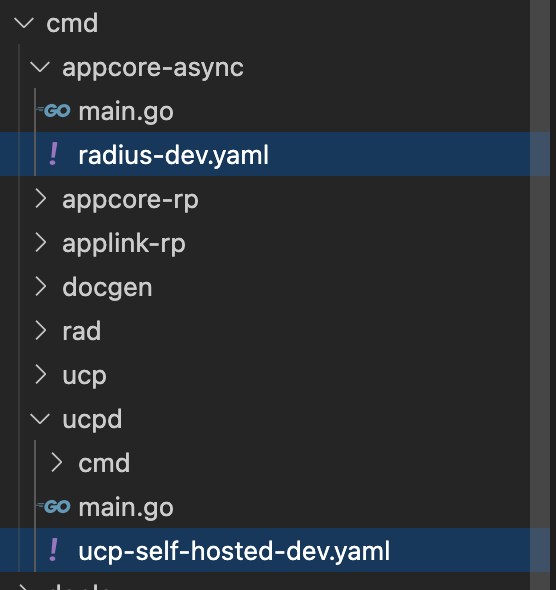
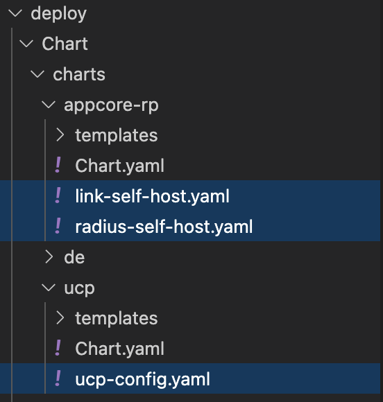

## Radius Control-plane configuration and settings

## Summary

Configuration schemas are used to define the service configuration for the resource provider's execution. The default configurations use the `Applications.Core RP` but configurations can also be set to run the `Applications.Link RP` for private preview and dev/test purposes. 

If you wanted to locally run Radius with specific configurations, `yaml` files can be created and stored in the `cmd` folder for the corresponding UCP or resource provider. 



If you wanted to run Radius on Kubernetes with specific configurations, `yaml` files can be created and stored in the `deploy/Chart/charts` folder for `Applications.Core RP`, `Applications.Link RP`, or `UCP`.




## Config File Schema

The following properties can be specified in configuration for all services: 
| Key | Description | Example | 
|-----|-------------|---------|
| environment | Environment name and its role location | [**See below**](#environment) |
| identity | AAD APP authentication for the resource provider | [**See below**](#identity) |
| storageProvider | Configuration options for the data storage provider | [**See below**](#storageprovider) |
| queueProvider | Configuration options for the provider to create and manage the queue client | [**See below**](#queueprovider) |
| secretProvider | Configuration options for the provider to manage credential | [**See below**](#secretprovider) |
| server | Configuration options for the HTTP server bootstrap | [**See below**](#server) |
| workerServer | Configuration options for the worker server | [**See below**](#workerserver) |
| metricsProvider | Configuration options of the providers for publishing metrics | [**See below**](#metricsProvider) |

-----

The following are properties that can be specified for the `Applications.Core RP` and the `Applications.Link RP`: 
| Key | Description | Example |
|-----|-------------|---------|
| ucp | Configuration options for connecting to UCP's API | [**See below**](#ucp)

----

The following are properties that can be specified for UCP: 
| Key | Description | Example |
|-----|-------------|---------|
| secretProvider | Configuration options for the secret provider | [**See below**](#secretprovider)
| plane | Configuration options for the UCP plane | [**See below**](#plane)
| identity | Configuration options for authenticating with external systems like Azure and AWS | [**See below**](#external system identity)
| ucp | Configuration options for connecting to UCP's API | [**See below**](#ucp)


### environment
| Key | Description | Example |
|-----|-------------|---------|
| name | The name of the environment | `Dev` | 
| location | The role location of the environment | `West US` |

### identity
| Key | Description | Example |
|-----|-------------|---------|
| clientId | Client ID of the Azure AAD App  | `your-client-ID` | 
| instance | The identity provider instance | `https://login.windows.net` |
| tenantId | Tenant ID of the Azure AAD App | `your-tenant-ID` |
| armEndpoint | ARM endpoint | `https://management.azure.com:443` |
| audience | The recipient of the certificate | `https://management.core.windows.net` |
| pemCertPath | Path to certificate file | `/var/certs/rp-aad-app.pem` |

### storageProvider
| Key | Description | Example |
|-----|-------------|---------|
| provider | The type of storage provider | `apiServer` | 
| apiServer | Object containing properties for Kubernetes APIServer store | [**See below**](#apiserver) | 
| cosmosdb | Object containing properties for CosmosDB | [**See below**](#cosmosdb) | 
| etcd | Object containing properties for ETCD store | [**See below**](#etcd)|

### queueProvider
| Key | Description | Example |
|-----|-------------|---------|
| provider | The type of queue provider | `apiServer` | 
| apiServer |  Object containing properties for Kubernetes APIServer store | [**See below**](#apiserver) |
| inMemoryQueue | Object containing properties for InMemory Queue client | |

### secretProvider
| Key | Description | Example |
|-----|-------------|---------|
| provider | The type of secret provider | `etcd` or `kubernetes` | 
| etcd | Object containing properties for ETCD secret store | [**See below**](#etcd) |  

### server
| Key | Description | Example | 
|-----|-------------|---------|
| host | Domain name of the server | `0.0.0.0` |
| port | HTTP port | `8080` |
| pathBase | HTTPRequest PathBase | `""` |
| authType | The environmnet authentification type (e.g. client ceritificate, etc) |`ClientCertificate` |
| armMetadataEndpoint | Endpoint that provides the client certification | `https://admin.api-dogfood.resources.windows-int.net/metadata/authentication?api-version=2015-01-01` |
| enableArmAuth | If set, the ARM client authentifictaion is performed (must be `true`/`false`) | `true` |

### workerServer
| Key | Description | Example |
|-----|-------------|---------|
| port | the localhost port which provides system-level info | `2222` |
| maxOperationConcurrency | The maximum concurrency to process async request operations | `3` |
| maxOperationRetryCount | The maximum retry count to process async request operation | `2` |

### metricsProvider
| Key | Description | Example |
|-----|-------------|---------|
| enabled | Specified whether to publish metrics (must be `true`/`false`) | `true` |
| port | The connection port | `/metrics` |
| path | The endpoint name where the metrics are posted | `9090` |

### ucp

This section configures the connection from either the `Applications.Core RP` or the `Applications.Link RP` to UCP's API. As the UCP service does not need to connect to itself, these settings do not apply in UCP's configuration files.

| Key | Description | Example |
|-----|-------------|---------|
| kind | Specifies how to connect and authenticate with UCP. Either `kubernetes` or `direct`. Kubernetes should always be used for production scenarios. Use `direct` for a local debugging configuration | `kubernetes` |
| direct | Settings that are applied when `kind==direct` | `{ }`|
| direct.endpoint | The URL endpoint used to connect to to UCP. | `http://localhost:9000` |

Example production use:

```yaml
ucp:
  kind: kubernetes
```

Example development use:

```yaml
ucp:
  kind: direct
  direct:
    endpoint: 'http://localhost:9000' # Tell RP that UCP is listening on port 9000 locally
```

### secretProvider
| Key | Description | Example |
|-----|-------------|---------|
| provider | The type of secret provider | `etcd` | 
| etcd | Object containing properties for ETCD secret store | [**See below**](#etcd) |  

### plane
| Key | Description | Example |
|-----|-------------|---------|
| id | The ID of the UCP plane | `/planes/radius/local` | 
| type | The type of UCP plane | `System.Planes/radius` |
| name | The name of the UCP plane | `ucp` |
| properties | The properties specified on the plane | [**See below**](#properties) |

## Available providers

### apiServer
| Key | Description | Example |
|-----|-------------|---------|
| context | The Kubernetes context name to use for the connection | `myContext` |
| namespace | The Kubernetes namespace used for data-storage | `radius-system` |

### etcd
| Key | Description | Example |
|-----|-------------|---------|
| inMemory | Configures the etcd store to run in-memory with the resource provider (must be `true`/`false`) | `true` |

### cosmosdb
| Key | Description | Example |
|-----|-------------|---------|
| url | URL of CosmosDB account | `https://radius-eastus-test.documents.azure.com:443/` |
| database | Name of the database in account | `applicationscore` |
| masterKey | All access key token for database resources | `your-master-key` |
| CollectionThroughput | Throughput of database | `400` |

## Plane properties

| Key | Description | Example |
|-----|-------------|---------|
| resourceProviders | Resource Providers for UCP Native Plane | `http://appcore-rp.radius-system:5443` |
| kind | The kind of plane | `Azure` |
| url | URL to forward requests to for non UCP Native Plane | `http://localhost:7443` |

## external system identity

| Key | Description | Example |
|-----|-------------|---------|
| authMethod | The method of authentication | `UCPCredential` using UCP Credential APIs, `Default` using environment variable |

## Example configuration files 

Below are completed examples of possible configurations: 

### Applications.Core and Applications.Link
```yaml
environment:
  name: self-hosted
  roleLocation: "global"
storageProvider:
  provider: "apiserver"
  apiserver:
    context: ""
    namespace: "radius-system"
queueProvider:
  provider: "apiserver"
  apiserver:
    context: ""
    namespace: "radius-system"
metricsProvider:
  prometheus:
    enabled: true
    path: "/metrics"
    port: 9090
server:
  host: "0.0.0.0"
  port: 5443
workerServer:
  maxOperationConcurrency: 3
  maxOperationRetryCount: 2
ucp:
  kind: kubernetes
```

### UCP 
```yaml
storageProvider:
  provider: "apiserver"
  apiserver:
    context: ""
    namespace: "radius-system"
secretProvider:
  provider: "kubernetes"
planes:
  - id: "/planes/radius/local"
    properties:
      resourceProviders:
        Applications.Core: "http://appcore-rp.radius-system:5443"
        Applications.Link: "http://appcore-rp.radius-system:5444"
      kind: "UCPNative"
  - id: "/planes/deployments/local"
    properties:
      resourceProviders:
        Microsoft.Resources: "http://de-api.radius-system:6443"
      kind: "UCPNative"
  - id: "/planes/aws/aws"
    properties:
      kind: "AWS"
metricsProvider:
  prometheus:
    enabled: true
    path: "/metrics"
    port: 9090
```

## Environment Variables

> 🚧🚧🚧 Under Construction 🚧🚧🚧
>
> This section documents legacy environment variables that we have not yet migrated to the configuration file.
>
> Long-term we plan to remove these environment variables and delete this section.

The Radius control-plane services support a number of different settings that will configure their behavior.

Unlike the `rad` CLI or other infrastructure, all of the supported settings for the Radius RP are environment variables.

Many of the optional settings are booleans, which apply the following logic:

- `true` enables the setting. This value is compared *case-insensitively*, so `True` would also be accepted.
- ANY other value disables the setting. 

Enum values are compared *case-insensitively*.

### All settings

| Environment variable           | Required / (default value) | Type    | Description                                                                                                                                  |
| ------------------------------ | -------------------------- | ------- | -------------------------------------------------------------------------------------------------------------------------------------------- |
| PORT                           | **yes**                    | int     | Configures the HTTP listening port of the RP. Must be a valid port number.                                                                   |
| SKIP_ARM                       | no (false)                 | boolean | Optionally skip connecting to ARM. This means that Azure resources will not be supported.                                                    |
| ARM_AUTH_METHOD                | no (auto)                  | string  | Configures explicitly which type of credentials the RP will use for ARM (UCPCredential,Managed,ServicePrincipal,Cli). By default the RP will autodetect the credential type |
| AZURE_CLIENT_ID                | no                         | string  | Configures the client id of a service principal for ARM authentication.                                                                      |
| AZURE_CLIENT_SECRET            | no                         | string  | Configures the client secret of a service principal for ARM authentication.                                                                  |
| AZURE_TENANT_ID                | no                         | string  | Configures the AAD tenant of a service principal for ARM authentication.                                                                     |
| MSI_ENDPOINT/IDENTITY_ENDPOINT | no                         | string  | Used to detect whether the RP should use managed identity for ARM authentication.                                                            |
| RADIUS_LOGGING_JSON                 | no (`development`)   | string  | Configures the log profile for Radius |
| RADIUS_LOGGING_LEVEL                   | *see Logging section*   | string  | Configures the log level for Radius |

### ARM authentication

Authentication with ARM can be disabled totally by setting `SKIP_ARM=true`. This will disable ARM features like creation and management of Azure resources.

The RP can connect to ARM using credentials from one of three different sources in order of priority:

- Service Principal
- Managed Identity (used when deployed)
- CLI authentication (used in local development)

Our detection logic mirrors what the newer Azure Go SDKs do. Since we require the use of the old-style SDKs we also perform the same logic. The environment variables we use to read these settings are the **standard set** used by all Azure tools. eg: `AZURE_CLIENT_ID` is the standard environment variable supported by all Azure tools. 

### Kubernetes

Authentication with Kubernetes can be disabled totally by setting `SKIP_K8S=true`. This will disable Kubernetes features like creation and management of containers/pods and ingresses.

The RP connects to Kubernetes using two different strategies to find the identity and credentials in order or priority:

- Using in-cluster credentials (if present)
- Using local Kubeconfig

### Logging

Radius Resource Provider uses the zap logger as the log sink and logr as the interface.

#### Configuring Radius Log Profile
Radius Log Profile can be set using the environment variable RADIUS_LOG_PROFILE. The allowed values are `production` and `development`. This setting controls the output log encoding format, default log level and other related zap logger settings.

#### Configuring Radius Log Level
Radius Log Level can be set using the environment variable RADIUS_LOG_LEVEL. The allowed values are `normal` or `verbose`. If this environment variable is not set, the default log level is determined by the log profile configured above.