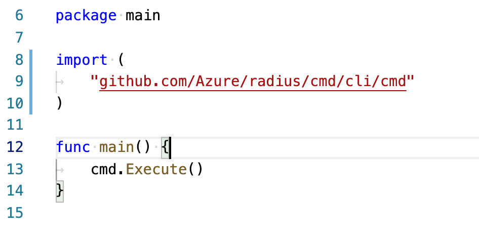
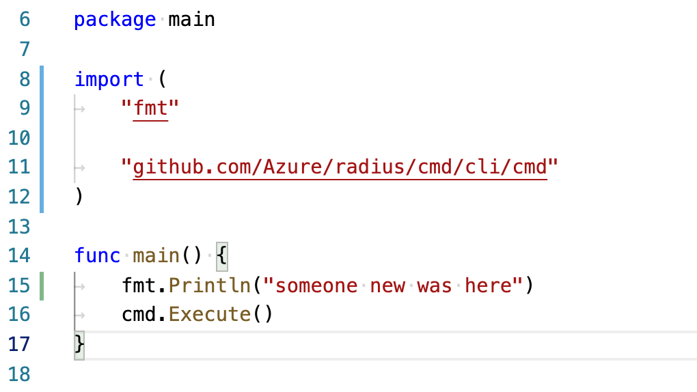

# Your first commit: Working on the CLI

## Making a change to the CLI

This step will walk you through making a cosmetic change to the `rad` CLI. This will ensure that you know some options for testing changes locally with the CLI.

### Opening the code

First, make sure you've clone the repo to your computer and can open it in your editor of choice.

If you're using VS Code, entring `code .` at the command line from the root directory of the repository will open everything you need.

Open the file `cmd/rad/main.go`. This is the entry point of the `rad` CLI.

> **VSCode tip** <br>
Using VS Code you can hit `Command+P` (or `Ctrl+P`) and get a search bar for files that does fuzzy searching. For instance typing `main` would let you pick the file from a short list. With practice this can make navigation very fast.

You should see code like the following:



### Making an edit

You can edit this code to show everyone that you were here. Place your cursor inside the `main()` function, and add the following on a blank line before `cmd.Execute()`

```go
fmt.Println("<yourname> was here")
```

Replace `<yourname>` with your name.

Save the file.

If you're using VS Code it will auto-add the import for `fmt` for you. Now it should look something like the following:



### Running the CLI

You could repeat the commands from the previous step (`make` followed by `./dist/darwin_amd64/release/rad`) to test your changes.

However, there is a faster way that you should learn. You can use `go run` to build and run in one step.

```sh
go run cmd/rad/main.go
```

You should see the basic help text of the CLI with your changes.

 At the time of this writing it looks like:

```txt
someone new was here
Project Radius CLI

Usage:
  rad [command]

Available Commands:
  application Manage applications
  bicep       Manage bicep compiler
  component   Manage components
  deploy      Deploy a Radius application
  deployment  Manage deployments
  env         Manage environments
  expose      Expose local port
  help        Help about any command

Flags:
      --config string   config file (default is $HOME/.rad/config.yaml)
  -h, --help            help for rad

Use "rad [command] --help" for more information about a command.
```

## Next step
- [Debug the CLI](../first-commit-04-debugging-cli/index.md)

## Related Links

- [Running the CLI from source](../../contributing-code-cli/running-rad-cli.md)
