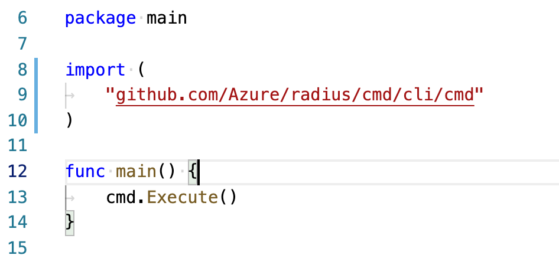
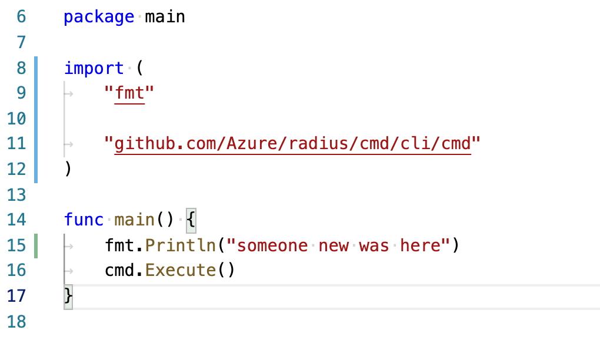

# Your first commit: Working on the CLI

This step walks you through a small change to the `rad` CLI so you learn how to test CLI changes locally. For the full CLI development reference — running from source, installing a local build, debugging, and CLI error-handling conventions — see the authoritative [Develop the Radius CLI](../../contributing-code-cli/README.md) guide.

## Open the code

Make sure you've cloned the repo and can open it in your editor. If you're using VS Code, run `code .` from the repository root.

Open `cmd/rad/main.go` — the entry point of the `rad` CLI.

> **VS Code tip:** Press `Command+P` (or `Ctrl+P`) to fuzzy-search for files. Typing `main` lets you pick the file from a short list.

You should see code like the following:



## Make an edit

Place your cursor inside the `main()` function and add the following on a blank line before `cmd.Execute()`:

```go
fmt.Println("<yourname> was here")
```

Replace `<yourname>` with your name, then save. VS Code auto-adds the `fmt` import for you, so it should look like:



## Run the CLI

You could rebuild with `make` and run the binary, but `go run` builds and runs in one step:

```sh
go run ./cmd/rad/main.go
```

You should see your message printed above the `rad` CLI help text.

## Next step

- [Debug the CLI](../first-commit-04-debugging-cli/index.md)

## Related links

- [Develop the Radius CLI](../../contributing-code-cli/README.md) — running, installing, and debugging `rad`.
