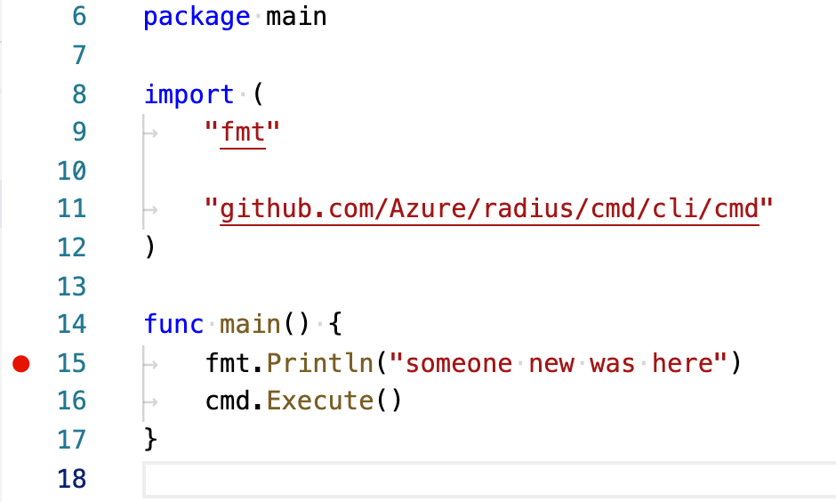
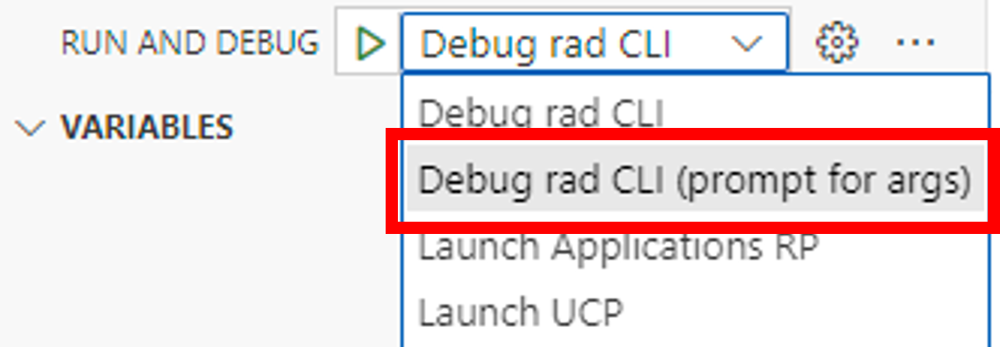
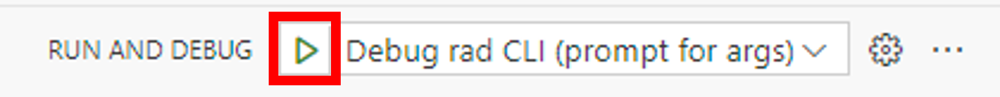
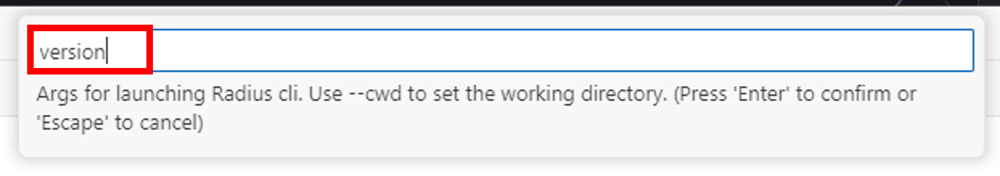
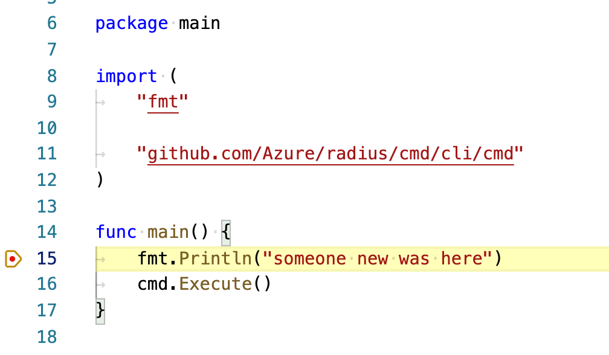

# Your first commit: Debugging the CLI

This step shows you how to debug the `rad` CLI in VS Code using the change you made in the previous step. For the full debugging reference, see the **Debug rad in VS Code** section of the authoritative [Develop the Radius CLI](../../contributing-code-cli/README.md#debug-rad-in-vs-code) guide. If you use another editor, you can skip this step.

> 📝 **Tip:** The first time you debug on **macOS** with a given version of Go, you'll be prompted for your password, and the prompt can take 1–2 minutes to appear. This is expected.

## Debug rad with the predefined configuration

The repository's `.vscode/launch.json` provides the **"Debug rad CLI (prompt for args)"** configuration, which launches `cmd/rad/main.go` and asks you which command-line arguments to run.

1. Set a breakpoint on the line you added in `main.go` — click in the *gutter* to the left of the line numbers.

   

2. Open the debug pane and select **"Debug rad CLI (prompt for args)"** from the drop-down.

   

3. Click the green triangle to start. The project builds first, which may take a moment.

   

4. When prompted, enter the arguments to run (for example `version`) and confirm.

   

Execution stops at your breakpoint, where you can step through the code:

When you're done, hit the red square *stop* icon to end the session.

## Next step

- [Run tests](../first-commit-05-running-tests/index.md)
