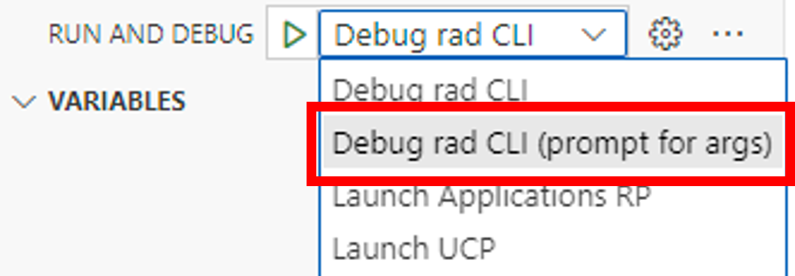
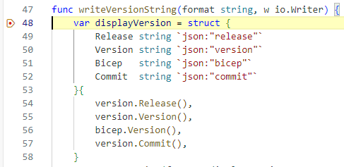

# Your first commit: Debugging the CLI

## Debugging your changes

The following sections describe the debugging in Visual Studio Code (VS Code). If you are using another editor you can skip the following sections.

>📝 **Tip** The first time you debug on **macOS** with a given version of Go you will be prompted to enter your password. It is normal for this to take 1-2 minutes for the prompt to appear the first time.

## Predefined debug configurations

You can debug your changes right from VS Code. The repository has a `.vscode` directory which contains several launch configurations containing debugging configurations. We describe the configurations in the following sections.

### Debugging rad CLI

This section describes the configuration named **"Debug rad CLI"**. This is a basic Go debugger configuration that is set up to launch the `rad` CLI. To try it out, set a breakpoint in `main.go`. Set the breakpoint by clicking in the *gutter* to the left of the line numbers in you editor. Place the breakpoint on the new line you added in `main.go`.

The debugger will stop the program prior to crossing over your breakpoint. Execute the following steps to launch the CLI in the debugger:

- Open the debug pane.

  

- Select the **"Debug rad CLI"** entry from the drop down list.

  

- Click the icon with the green triangle to launch the debugging session.

  

Before the debugging will start the project is build in the background. This might take some time. After the build is completed the program will start and the breakpoint should be hit.

You can play around with the various debugger features, like stepping into code. When you're done, hit the red square *stop* icon in the debugger tools to end the debugging session.

> 📝 **Tip** - You can create definitions for any set of debug settings you want to keep handy.

### Debug rad CLI - prompt for args

This section describes the configuration named **"Debug rad CLI (prompt for args)"**. In contrast to the previous generic one this one uses the specific `rad CLI` commands to kick of the debugger.  

Let us test this setup by checking debugging the `rad version` command. The file is located at `cmd/rad/cmd/version.go`. Set a breakpoint at the beginning of the function `writeVersionString`:

The debugger will stop the program prior to crossing over your breakpoint. Execute the following steps to launch the CLI command in the debugger:

- Open the debug pane.

  

- Select the **"Debug rad CLI (prompt for args)"** entry from the drop down list.

  

- Click the icon with the green triangle to launch the debugging session.

  

- The system will open up the command palette. Enter the command you want to debug i.e. `version` and confirm.  

  

Before the debugging will start the project is build in the background. This might take some time. After the build is completed the program will start and the breakpoint should be hit.

You can play around with the various debugger features, like stepping into code. When you're done, hit the red square *stop* icon in the debugger tools to end the debugging session.

## Next step

- [Run tests](../first-commit-05-running-tests/index.md)

## Related Links

- [Debugging Go with VS Code](../../debugging-go-with-vscode.md)
