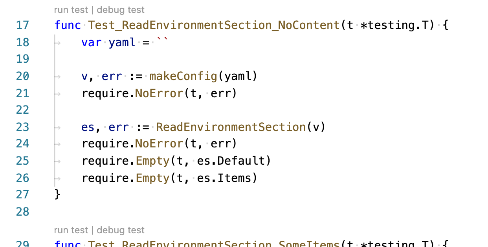

# Your first commit: Running tests

## Running tests

To run all the unit tests for the project from the command line:

```sh
make test
```

After tests run, you should see a big list of all of the project's packages:

```txt
go test ./pkg/...
ok  	github.com/radius-project/radius/pkg/cli	0.250s
?   	github.com/radius-project/radius/pkg/azure/azcli	[no test files]
?   	github.com/radius-project/radius/pkg/cli/azure	[no test files]
?   	github.com/radius-project/radius/pkg/cli/bicep	[no test files]
?   	github.com/radius-project/radius/pkg/cli/environments	[no test files]
?   	github.com/radius-project/radius/pkg/cli/logger	[no test files]
?   	github.com/radius-project/radius/pkg/cli/namegenerator	[no test files]
?   	github.com/radius-project/radius/pkg/cli/prompt	[no test files]
?   	github.com/radius-project/radius/pkg/cli/util	[no test files]
?   	github.com/radius-project/radius/pkg/azure/radclient	[no test files]
?   	github.com/radius-project/radius/pkg/renderers	[no test files]
ok  	github.com/radius-project/radius/pkg/renderers/containerv1alpha3
ok   	github.com/radius-project/radius/pkg/renderers/cosmosdbmongov1alpha3
ok   	github.com/radius-project/radius/pkg/renderers/dapr
ok   	github.com/radius-project/radius/pkg/renderers/daprpubsubv1alpha3
ok   	github.com/radius-project/radius/pkg/renderers/daprstatestorev1alpha3
ok   	github.com/radius-project/radius/pkg/renderers/servicebusqueuev1alpha3
```

The Go test tools do not make much fanfare when all the tests pass - it just says `ok` for every package that has tests.
In general it will be very obvious in the CLI output if something failed.

## Running/Debugging a single test

The best way to run a single test or group of tests is from VS Code.

Open `./pkg/rad/config_test.go` in the editor. Each test function has the options to run or debug the test right above it.

<br />

## Next step
-  [Create a PR](../first-commit-06-creating-a-pr/index.md)
