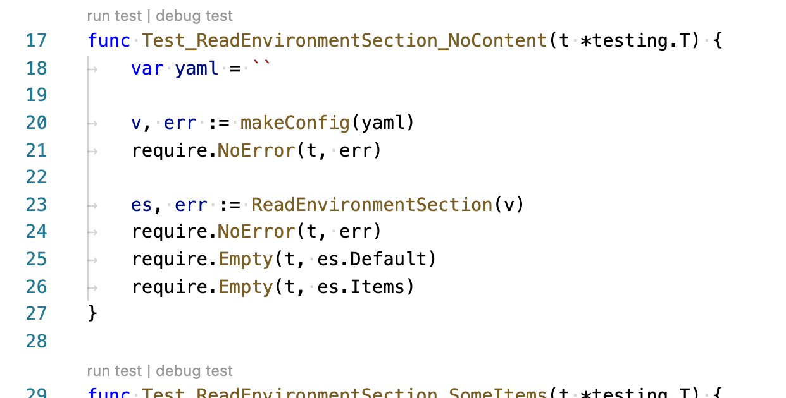

# Your first commit: Running tests

This walkthrough covers running the unit tests, which is all you need for your first commit. For every test tier — integration, functional, and the local-iteration loop — and when to run each, see the [test matrix overview](../../contributing-code-tests/README.md).

## Running tests

To run all the unit tests for the project from the command line:

```sh
make test
```

After tests run, `gotestsum` prints a result for each package and a summary. The exact package list changes as the repository evolves; successful packages report `ok`, and packages without tests report `[no test files]`.

```txt
ok  github.com/radius-project/radius/pkg/cli
ok  github.com/radius-project/radius/pkg/controller/reconciler
[no test files]  github.com/radius-project/radius/pkg/cli/azure
```

The command exits non-zero and identifies the failing package and test when anything fails.

## Running/Debugging a single test

The best way to run a single test or group of tests is from VS Code.

Open `./pkg/cli/config_test.go` in the editor. Each test function has the options to run or debug the test right above it.



## Next step

- [Create a PR](../first-commit-06-creating-a-pr/index.md)
