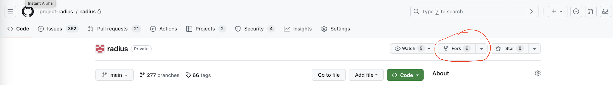
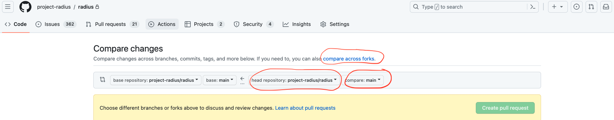

# Your first commit: Creating a forked repo

In order to limit the branches on the main repo, Radius enforces code contributions via forked repos.

## Creating a forked repo

In order to fork a repo, go to the main radius repo page in GitHub and select the "fork" option:



## Clone the forked repo

Now clone the forked repo and navigate there in your command shell.

```
git clone <forked repo url>
```

## Configuring remote repositories

Configure the remote repositories, referring to the forked repo as `origin` and the main repo as `upstream` (you may choose your own custom names if desired).

### Adding remote repositories

```
git remote add origin <url of the forked repo>
git remote add upstream <url of the radius main repo>
```

### Verify new remote

```
git remote -v
```

## Workflow to follow
1. Push your local code changes to the forked repo
    ```
    git push origin <local branch>
    ```

2. Go to the main radius repo and create a pull request using the _compare against forks_ option:

    

    Make sure you select the fields (shown in red) "head repository" as your fork (<username>/radius) and "compare" as your branch with the code changes.