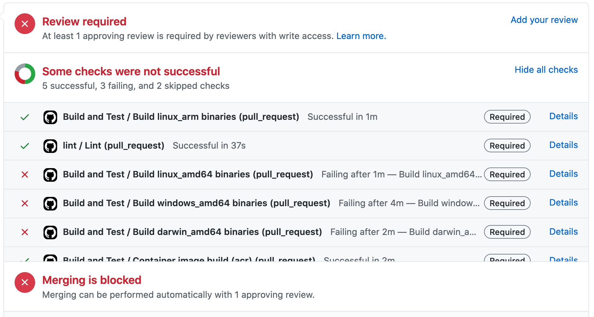

# Your first commit: Creating a pull request

## Your first pull request

At this point you've experienced the basic dev flow for the `rad` CLI. 

It's time to pick an issue to work on! You can find a query [here](https://github.com/project-radius/radius/issues?q=is%3Aopen+is%3Aissue+label%3A%22help+wanted%22).

## Etiquette for issues

If you find an issue you want to help with, then please comment on that issue and ask for one of the maintainers to assign it to you. If you have questions or anything you want to discuss, use the issue to communicate about it.

Now you've got something to work on. Once you've developed and tested your change resume this guide. 

## One last check

Before proceeding, make sure your changes pass all the unit tests as well as [golint](https://golangci-lint.run/usage/install/#local-installation).

```sh
make build lint test
```

It is best if you can resolve problems identified here before submitting.

## Writing a good commit message

To make it easier for us to track history, write a good commit message.

The format preferred for the project is formatted like:

```txt
<a one line summary of the fix or change>

Fixes: #<issue number>

<a more detailed description of the root cause and fix - may be long if necessary>
```

Here's an [example](https://github.com/project-radius/radius/commit/8e95d07a66e6aa91dfb40217318649ca43ec4bd7).

Include a level of detail that makese sense based on the complexity of problem and solution.

## Creating the pull request

At this point, you have reviewed the forked repo workflow.

Push your changes to your forked repo and then [open a pull request](https://github.com/project-radius/radius/compare).

If you formatted your commit message correctly then everything should be good to go.

Go ahead and create your PR.

## The PR process

At this point you should review the PR checks and make sure they pass. Failing PR checks will prevent your change from being merged.



If you have any failing checks try to investigate the details and solve them if possible. If you get stuck and need to know the reason for failure, ask a maintainer.

At this point one or more core team members will review your code changes. 

Reviewers will leave their feedback via comments. Discuss as needed and resolve the feedback when both you and the reviewers are happy.

Once you've resolved all the feedback, your reviewers will make the pull request as approved.

From this point on you don't need to do anything. The maintainers will merge your pull request.