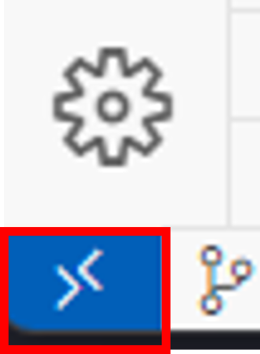
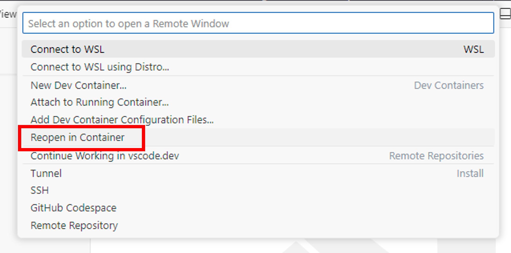
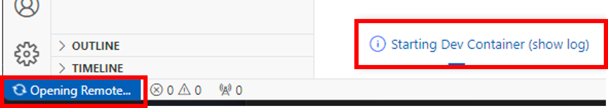

# Repository Prerequisites

This page lists the prerequisites for working with the repository. In general, you have three options to get your development setup up and running:

- Remotely using GitHub Codespaces
- Using Visual Studio Code and dev containers
- Locally by installing all prerequisites on your machine

We will walk you through the options in the following sections.

> 📝 **Tip** - We recommend the usage of GitHub Codespaces or dev containers in Visual Studio Code as they are the most convenient way to get started.

Depending on the task you need to perform, you may need to install more tools, but basic prerequisites should be sufficient for most contributors to get started.

## Operating system

We support developing on macOS, Linux and Windows with [WSL](https://docs.microsoft.com/windows/wsl/install).

## Asking for help

If you get stuck with any development setup option, please ask for help in our [forum](https://discordapp.com/channels/1113519723347456110/1115302284356767814).

## Development environment - setup options

The following sections describe the aforementioned alternatives of development setups in more detail. We recommend to use of *GitHub Codespaces* or *dev containers* in VS Code as they are the most convenient way to get started.

### GitHub Codespaces

The easiest way to get started is using our pre-built GitHub Codespace.

The steps to execute are:

1. Press this button 
  
    [](https://github.com/codespaces/new?hide_repo_select=true&ref=main&repo=340522752&skip_quickstart=true&machine=basicLinux32gb&devcontainer_path=.devcontainer%2Fcontributor%2Fdevcontainer.json&geo=UsWest)
1. There is no second step - you are ready to contribute 😎

> **Note** - When using GitHub Codespaces cost can occur on your side after you have used up the monthly included storage and core hours for your account. You find more details [here](https://docs.github.com/en/billing/managing-billing-for-github-codespaces/about-billing-for-github-codespaces).

### VS Code and Dev Container

To use the dev container you must have the following tools installed and running locally:

- [Visual Studio Code](https://code.visualstudio.com/)
- [Dev Container Extension](https://marketplace.visualstudio.com/items?itemName=ms-vscode-remote.remote-containers)
- [Docker](https://docs.docker.com/engine/install/)

> 📝 **Tip** - If you are new to *dev containers* you find more information about developing inside a container [here](https://code.visualstudio.com/docs/devcontainers/containers) and a comprehensive tutorial [here](https://code.visualstudio.com/docs/devcontainers/tutorial).

To get the dev container up and running

1. If not already done, clone your fork of the Project Radius repository to your local file system and open the folder with VS Code. The best way to do so is either to launch VS Code and open the folder via the *File* -> *Open Folder* menu or to start VS Code from the command shell with `code .`, which opens the current directory as a folder in VS Code.

1. Click the "X"-like button in VS Code to open a remote window

    

1. Select the option "Reopen in Container" in the command palette

    

The dev container will be started automatically.



When doing this the first time this might take a bit as all dependencies need to be downloaded and installed in your container - so grab a cup of ☕ and enjoy the work done by the container.

Once the container is up and running you can start with your contribution.

## Basic Prerequisites

Contributing to Radius requires several tools to get started. This section lists them grouped by their context

> 📝 **Tip** - If your are using [GitHub Codespaces](#github-codespaces) or [VS Code and Dev Container](#vs-code-and-dev-container), all these tools are already in place and available out-of-the-box.

<!--
    Note: some of this content is synchronized with the first-commit guide for simplicity. Keep these in sync!
-->

### Editors

You can choose whichever editor you are most comfortable for working on Go code. If you don't have a code editor set up for Go, we recommend VS Code. The experience with VS Code is high-quality and approachable for newcomers.

Alternatively, you can choose whichever editor you are most comfortable for working on Go code. Feel free to skip this section if you want to make another choice.

- [Visual Studio Code](https://code.visualstudio.com/)
- [Go extension](https://marketplace.visualstudio.com/items?itemName=golang.go)

Install both of these and then follow the steps in the *Quick Start* for the Go extension.

The extension will walk you through an automated install of some additional tools that match your installed version of Go.

### Local installation

This is the list of core dependencies to install for the most common tasks. In general we expect all contributors to have all of these tools present:

- [Git](https://git-scm.com/downloads)
- [Go](https://golang.org/doc/install)
- [Node.js](https://nodejs.org/en/)
- [Python](https://www.python.org/downloads/)
- [Golangci-lint](https://golangci-lint.run/usage/install/#local-installation)
- [jq](https://jqlang.github.io/jq/download/)  
- Make

For `make` we advice the following installation steps depending on you OS.
  
#### Linux

Install the `build-essential` package:

```bash
sudo apt-get install build-essential
```

#### Mac

Using Xcode:

```bash  
xcode-select --install
```

Using Homebrew:

```bash  
brew install make
```

To build our containers, you also need [Docker](https://docs.docker.com/engine/install/).  

### Additional tools

The following tools are required depending on the task at hand.

#### Kubernetes

The easiest way to run Radius is on Kubernetes. To do this you will need the ability to create a Kubernetes cluster as well as to install `kubectl` to control that cluster, you probably also want Helm to install things in your cluster. There are many ways to create a Kubernetes cluster that you can use for development and testing. If you don't have a preference we recommend `kind`.

- [Install kubectl](https://kubernetes.io/docs/tasks/tools/#kubectl)
- [Install Helm](https://helm.sh/docs/intro/install/)
- [Install Kind](https://kubernetes.io/docs/tasks/tools/#kind)

#### Troubleshooting kubernetes

You might want tools that can help debug Kubernetes problems and understand what's going on in the cluster. Here are some recommendations from the team:

- [Lens (UI for Kubernetes)](https://k8slens.dev/)
- [VS Code Kubernetes Tools](https://marketplace.visualstudio.com/items?itemName=ms-kubernetes-tools.vscode-kubernetes-tools)
- [Stern (console logging tool)](https://github.com/stern/stern#installation)

#### Dapr

Radius includes integration with [Dapr](https://docs.dapr.io/). To use work on these features, you'll need to install the Dapr CLI.

- [Dapr](https://docs.dapr.io/getting-started/install-dapr-cli/)

#### Test summaries

The default `go test` output can be hard to read when you have many tests. We recommend `gotestsum` as a tool to solve this. Our `make test` command will automatically use `gotestsum` if it is available.

- [gotestsum](https://github.com/gotestyourself/gotestsum#install)

## Testing required tools

Independent of the setup option you have chosen, you can now test your tooling. If not already done, navigate to the cloned project in your command shell and build the main outputs using `make`:

```bash
make build && make lint
```

Running these steps will run our build and lint steps and verify that the tools are installed correctly. If you get stuck or suspect something is not working in these instructions please [open an issue](https://github.com/radius-project/radius/issues/new/choose).

## Code generation

Our code generation targets are used to update generated OpenAPI specs and generated Go code based on those OpenAPI specs. Additionally, some Go code is generated mocks or Kubernetes API types.

If you were trying to run `make generate` and ran into an error, then one of the below is likely missing.

Enter the following commands to install all of the required tools.

```bash
cd typespec && npm ci
npm install -g autorest
npm install -g oav
go install sigs.k8s.io/controller-tools/cmd/controller-gen@v0.15.0
go install github.com/golang/mock/mockgen@v1.5.0
```
