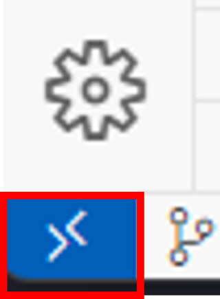
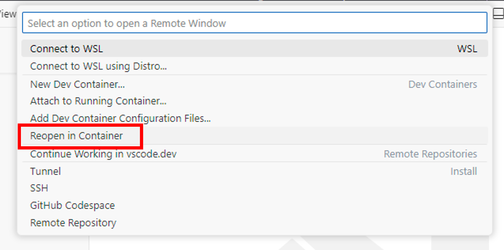
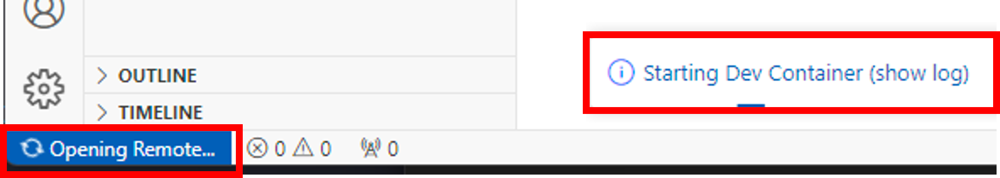

# Repository Prerequisites

## Purpose

This guide sets up a development environment for contributing to Radius. It is the single source of truth for prerequisites and dev-environment setup, for anyone — human or agent — making a code change to `radius-project/radius`. It covers the three supported setup paths (GitHub Codespaces, a VS Code dev container, or a local install), the tools each contributor needs, and how to confirm the setup works. The basic prerequisites are enough for most tasks; some tasks require the additional tools listed below.

> 📝 **Tip** — We recommend dev containers (GitHub Codespaces or VS Code) as the most convenient way to get started: every required tool is preinstalled.

## Prerequisites

- A supported operating system: macOS, Linux, or Windows with [WSL](https://docs.microsoft.com/windows/wsl/install).
- A GitHub account and a clone (or fork) of the repository.
- For either container-based option, a way to run Linux containers — [Docker](https://docs.docker.com/engine/install/) locally, or a Codespace in the cloud.

On macOS and Linux, a package manager makes installing and updating the local tools below much easier — for example [Homebrew](https://brew.sh/) on macOS, or your distribution's package manager on Linux.

## Steps

Choose one of the three setup options. GitHub Codespaces and the VS Code dev container preinstall every tool; a local install gives you full control over your machine.

### GitHub Codespaces

The fastest way to get started is a pre-built GitHub Codespace, which builds the [dev container](#vs-code-and-dev-container) in the cloud.

1. Press this button:

   [](https://github.com/codespaces/new?hide_repo_select=true&ref=main&repo=340522752&skip_quickstart=true&machine=basicLinux32gb&devcontainer_path=.devcontainer%2Fdevcontainer.json&geo=UsWest)

2. Wait for the Codespace to finish building. When it does, you have a fully configured environment and are ready to contribute. 😎

> 📝 **Note** — GitHub Codespaces can incur cost once you exceed the monthly included storage and core hours for your account. See [About billing for GitHub Codespaces](https://docs.github.com/en/billing/managing-billing-for-github-codespaces/about-billing-for-github-codespaces) for details.

### VS Code and Dev Container

To run the dev container locally you need the following tools installed and running:

- [Visual Studio Code](https://code.visualstudio.com/)
- [Dev Containers extension](https://marketplace.visualstudio.com/items?itemName=ms-vscode-remote.remote-containers)
- [Docker](https://docs.docker.com/engine/install/)

> 📝 **Tip** — New to dev containers? See the [Developing inside a Container](https://code.visualstudio.com/docs/devcontainers/containers) overview and the [tutorial](https://code.visualstudio.com/docs/devcontainers/tutorial).

To start the dev container:

1. If you have not already, clone your fork and open the folder in VS Code — either via `File` → `Open Folder`, or by running `code .` from the repository root.

1. Open a remote window by clicking the Remote ("><") button in the bottom-left corner of VS Code.

   

1. Select **Reopen in Container** from the command palette.

   

The dev container starts automatically.



The first build can take a while because all dependencies are downloaded and installed in the container — so grab a cup of ☕. Once it is running you can start contributing; skip ahead to [Verification](#verification).

### Local installation

If you prefer to install everything on your own machine, install the tools in this section.

> 📝 **Tip** — With either container option ([Codespaces](#github-codespaces) or the [VS Code dev container](#vs-code-and-dev-container)), all of these tools are already installed for you.

#### Editors

You can use whichever editor you are most comfortable with for Go. If you don't already have one set up for Go, we recommend VS Code — the experience is high-quality and approachable for newcomers.

- [Visual Studio Code](https://code.visualstudio.com/)
- [Go extension](https://marketplace.visualstudio.com/items?itemName=golang.go)

Install both, then follow the *Quick Start* for the Go extension. It walks you through an automated install of additional tools that match your installed version of Go.

#### Core dependencies

Install these for the most common tasks. We expect all contributors to have all of them:

- [Git](https://git-scm.com/downloads)
- [Go](https://golang.org/doc/install)
- [Node.js](https://nodejs.org/en/)
- [Python](https://www.python.org/downloads/)
- [golangci-lint](https://golangci-lint.run/welcome/install/#local-installation)
- [jq](https://jqlang.github.io/jq/download/)
- Make (see [Install Make](#install-make))
- [Docker](https://docs.docker.com/engine/install/) — required to build the containers

#### Install Make

Install `make` based on your OS.

**Linux** — install the `build-essential` package:

```bash
sudo apt-get install build-essential
```

**macOS** — using Xcode:

```bash
xcode-select --install
```

or using Homebrew:

```bash
brew install make
```

#### Additional tools

Install these only when your task needs them.

**Kubernetes.** The easiest way to run Radius is on Kubernetes. You need the ability to create a cluster, plus `kubectl` to control it and Helm to install into it. There are many ways to create a development cluster; if you don't have a preference, we recommend `kind`.

- [Install kubectl](https://kubernetes.io/docs/tasks/tools/#kubectl)
- [Install Helm](https://helm.sh/docs/intro/install/)
- [Install kind](https://kubernetes.io/docs/tasks/tools/#kind)

Optional tools the team recommends for debugging Kubernetes:

- [Lens (UI for Kubernetes)](https://k8slens.dev/)
- [VS Code Kubernetes Tools](https://marketplace.visualstudio.com/items?itemName=ms-kubernetes-tools.vscode-kubernetes-tools)
- [Stern (console logging tool)](https://github.com/stern/stern#installation)

**Dapr.** Radius integrates with [Dapr](https://docs.dapr.io/). To work on these features, install the [Dapr CLI](https://docs.dapr.io/getting-started/install-dapr-cli/).

**Test summaries.** The default `go test` output can be hard to read when you have many tests. `make test` automatically uses [gotestsum](https://github.com/gotestyourself/gotestsum#install) if it is installed.

#### Install code-generation tools

`make generate` updates the OpenAPI specs and the generated Go client/server code, along with generated mocks and Kubernetes API types. If `make generate` fails, you are probably missing the TypeSpec toolchain. Install it from the repository root:

```bash
pnpm -C typespec install
```

> 📝 **Note** — `mockgen` and `controller-gen` are managed as Go tool dependencies (the `tool` directives in [go.mod](../../../../go.mod)) and are invoked via `go tool mockgen` and `go tool controller-gen`, so they do not require a separate `go install`. `autorest` and `oav` are devDependencies in [typespec/package.json](../../../../typespec/package.json) and are invoked via `pnpm -C typespec exec`. No global installation is needed.

## Verification

Whichever option you chose, verify the toolchain by building and linting from the repository root:

```bash
make build && make lint
```

A successful run builds the binaries and reports no lint errors, confirming the core tools are installed correctly.

If you installed the code-generation toolchain, verify it as well:

```bash
make generate
```

This regenerates the API clients and server code with no errors.

## Troubleshooting

- **`make build` or `make lint` fails on a missing tool.** Re-check the [core dependencies](#core-dependencies) — a container-based setup installs them all for you.
- **`make generate` fails.** Install the TypeSpec toolchain with `pnpm -C typespec install` (see [Install code-generation tools](#install-code-generation-tools)).
- **The dev container won't build or open.** Confirm Docker is installed and running, then retry **Reopen in Container**. For background, see the [VS Code dev containers docs](https://code.visualstudio.com/docs/devcontainers/containers).
- **Still stuck?** Ask for help in our [forum](https://discordapp.com/channels/1113519723347456110/1115302284356767814), or [open an issue](https://github.com/radius-project/radius/issues/new/choose).

## Maintenance: updating the dev container lockfile

The repository includes a `devcontainer-lock.json` file alongside the `devcontainer.json` in the `.devcontainer/` directory. This lockfile pins each dev container feature to an exact version and records its SHA-256 integrity hash, similar to how `package-lock.json` works for npm. It ensures that every contributor gets the same feature versions when building the dev container, and detects if a published feature artifact has been tampered with after the hash was first recorded.

You must update the lockfile whenever you change the `features` section of `.devcontainer/devcontainer.json` (for example, adding, removing, or changing the version constraint of a feature). The lockfile should be committed alongside the `devcontainer.json` change.

### Prerequisites

Install the Dev Container CLI:

```bash
npm install -g @devcontainers/cli
```

### Checking for outdated features

To see which features have newer versions available, run from the repository root:

```bash
devcontainer outdated --workspace-folder .
```

This prints a table showing the current locked version, the latest version matching the version constraint in `devcontainer.json` ("Wanted"), and the overall latest version for each feature.

### Updating the lockfile

To update the lockfile, run from the repository root:

```bash
devcontainer upgrade --workspace-folder .
```

This resolves every feature in `devcontainer.json` to the latest version that satisfies its version constraint, downloads the feature artifacts, computes their SHA-256 hashes, and writes the result to `.devcontainer/devcontainer-lock.json`.

To preview the updated lockfile without writing it to disk, add the `--dry-run` flag:

```bash
devcontainer upgrade --workspace-folder . --dry-run
```

### Verifying the update

After running `devcontainer upgrade`, confirm the lockfile was updated:

```bash
git diff .devcontainer/devcontainer-lock.json
```

Review the diff to verify that only the expected features changed. Commit the updated lockfile together with any `devcontainer.json` changes.

Finally, run the formatter to ensure the JSON file is properly linted:

```bash
make format-write
```
