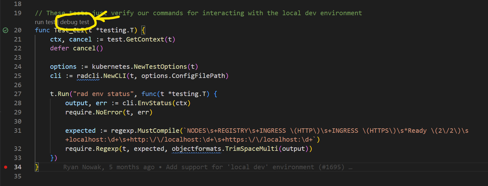

# Running Radius functional tests

You can find the functional tests under `./test/functional`. A functional test (in our terminology) is a test that interacts with real hosting enviroments (Kubernetes), deploys real applications and resources, and covers realistic or simulated user scenarios.

These tests verify whether:

- That Radius environment can be created successfully.
- That Bicep templates of sample applications ca be deployed to the Radius environment. 


## Running via GitHub workflow

These tests automatically run for every PR in the `functional-tests.yml` github workflow.

We do not run these tests for commits to `main` or tags since they might block the build if they fail.

### How this works 

For each PR we run the following set of steps:

- Build Radius and publish test assets
- For each group of tests:
  - Create a Kubernetes cluster and install the build
  - Run tests
  - Delete any cloud resources that were created

We have a separate scheduled job (`purge-test-resources.yaml`) that will delete cloud resources that are left behind. This can happen when the test run is cancelled or times out.

## Configuration

These tests use your local Kubernetes credentials, and Radius environment for testing. In a GitHub workflow, our automation makes the CI environment resemble a real user scenario. This way we test a setup that is close to what users will have in the real world.

As much as possible, the tests use product functionality such as the Radius CLI configuration and local KubeConfig to detect settings.

## Running the tests locally

### Prerequisites

1. Place `rad` on your path
2. Make sure `rad-bicep` is downloaded (`rad bicep download`)
3. Create a container registry (must be Azure Container Registry for now)
4. Log-in to the container registry `az acr login -n <registry-name>`
5. Publish Bicep test recipes by running `BICEP_RECIPE_REGISTRY=<registry-name>.azurecr.io make publish-test-bicep-recipes`
6. Publish Terraform test recipes by running `make publish-test-terraform-recipes`
7. Create a Radius environment with `rad init` and specify the default namespace

> ⚠️ The tests assume the Kubernetes namespace in use is `default`. If your environment is set up differently you will see
> test failures.

> ⚠️ If you set environment variables for functional tests you may need to restart VS Code or other editors for them to take effect.
 
### Run 

1. Run:

    ```sh
        .{workspace}/radius/test/executeFunctionalTest.sh
    ```

When you're running locally with this configuration, the tests will use your locally selected Radius environment and your local copy of `rad`. The executeFunctionalTest.sh scripts creates the azure resources and exports the values to be used in the functional test and runs:
 ```sh
    make test-functional-shared
    make test-functional-msgrp
    make test-functional-daprrp
    make test-functional-datastoresrp
 ```

You can also run/debug individual tests from VSCode.

### Tips

> 💡 If you make changes to recipes, make sure to re-run the *publish test recipe* step from prerequisites.

> 💡 If you make changes to the `rad` CLI make sure to copy it to your path. 

### Seeing log output

Some of these tests take a few minutes to run since they interact with cloud resources. You should configure VSCode to output verbose output so you can see the progress.

Open your VSCode `settings.json` with the command `Preferences: Open Settings (JSON)` and configure the following options:

```json
{
    ...
    "go.testTimeout": "60m",
    "go.testFlags": [
        "-v"
    ],
}
```

### Using Codelens (VSCode)

VSCode will start a child process when you execute a `'run test'/'debug test'` codelens action (see image for example). If you are using this to run functional tests, this process may not resolve `rad` correctly. You can specify environment variables for codelens using `settings.json`:

```json
{
    ...
    "go.testEnvVars": {
        "RAD_PATH": "${workspaceFolder}/dist/linux_amd64/release"
    },
}
```


