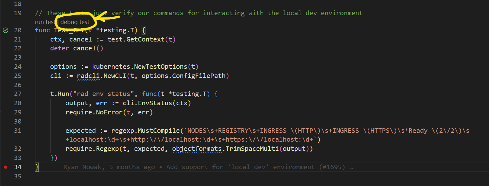

# Running Radius functional tests

## Purpose

Functional tests (also called end-to-end tests) interact with real hosting environments (Kubernetes), deploy real applications and resources, and cover realistic user scenarios. They verify, for example, that a Radius Environment can be created successfully and that the Bicep templates of sample applications can be deployed to it. This page is for contributors validating a change against a real cluster; for the full set of test tiers and when to run each, start at the [test matrix overview](./README.md).

The tests live under `./test/functional-portable`. They use product functionality — the Radius CLI configuration and your local KubeConfig — to detect settings, so the local setup resembles a real user scenario.

## Prerequisites

1. Place `rad` on your path.
2. Make sure `bicep` is downloaded (`rad bicep download`).
3. Make sure your [local dev environment is set up](../contributing-code-debugging/radius-os-processes-debugging.md).
4. Log into your GitHub account and [generate a PAT](https://docs.github.com/en/authentication/keeping-your-account-and-data-secure/managing-your-personal-access-tokens).
5. Log in to the container registry of your GitHub organization:

   ```sh
   export CR_PAT=<your_pat>
   echo $CR_PAT | docker login ghcr.io -u <your_username> --password-stdin
   ```

6. Publish the Bicep test recipes: `BICEP_RECIPE_REGISTRY=<registry-name> make publish-test-bicep-recipes`.
7. Publish the Terraform test recipes: `make publish-test-terraform-recipes`.
8. Change the visibility of the published packages to `public`.

> ⚠️ The tests assume the Kubernetes namespace in use is `default`. If your environment is set up differently you will see test failures.
>
> ⚠️ If you set environment variables for functional tests you may need to restart VS Code or other editors for them to take effect.

## Steps

### Run the tests locally

Run:

```sh
.{workspace}/radius/test/executeFunctionalTest.sh <resourcegroup_name>
```

When you run locally with this configuration, the tests use your locally selected Radius Environment and your local copy of `rad`. `executeFunctionalTest.sh` creates the Azure resources, exports the values used by the tests, and runs:

```sh
make test-functional-corerp
make test-functional-msgrp
make test-functional-daprrp
make test-functional-datastoresrp
```

To run a single group directly, call its `make` target — for example `make test-functional-corerp-noncloud` for the non-cloud Core RP tests, or `make test-functional-all-noncloud` for every non-cloud group. The full list of groups (`ucp`, `kubernetes`, `corerp`, `cli`, `msgrp`, `daprrp`, `datastoresrp`, `dynamicrp`, `samples`, `upgrade`) and their `-noncloud`/`-cloud` variants is defined in [`build/test.mk`](../../../../build/test.mk).

You can also run or debug individual tests from VS Code.

### Control test cleanup

Functional tests support two cleanup modes, selected with the `RADIUS_TEST_FAST_CLEANUP` environment variable:

- **Standard cleanup** (default for local development): waits for each resource to be fully deleted before proceeding, logs the deletion process, and shows retries for resources stuck in "Updating". Best for debugging cleanup issues.
- **Fast cleanup** (default for CI): initiates deletions in the background without waiting, which avoids deletion timeouts and dramatically reduces run time. It **skips post-delete verification**, so it is only safe for non-cloud tests where Kubernetes cluster cleanup handles orphaned resources. CI enables it with `RADIUS_TEST_FAST_CLEANUP=true`.

```bash
# Enable fast cleanup (useful for local testing with unique resource names)
export RADIUS_TEST_FAST_CLEANUP=true
go test ./test/functional-portable/corerp/noncloud/resources

# Disable fast cleanup for debugging (default for local development)
export RADIUS_TEST_FAST_CLEANUP=false
go test ./test/functional-portable/corerp/noncloud/resources
```

> ⚠️ **Important**: Fast cleanup is only safe for non-cloud tests. Cloud tests always use standard cleanup to ensure proper deletion of cloud resources that incur costs.

### See log output in VS Code

Some tests take a few minutes because they interact with cloud resources. Configure VS Code to show verbose output so you can follow progress. Open `settings.json` with **Preferences: Open Settings (JSON)** and set:

```json
{
    "go.testTimeout": "60m",
    "go.testFlags": [
        "-v"
    ]
}
```

### Use Codelens (VS Code)

VS Code starts a child process when you use a `run test`/`debug test` Codelens action. That process may not resolve `rad` correctly. Specify environment variables for Codelens in `settings.json`:

```json
{
    "go.testEnvVars": {
        "RAD_PATH": "${workspaceFolder}/dist/linux_amd64/release"
    }
}
```



### How the tests run in CI

These tests run automatically for every PR in the `functional-tests.yml` GitHub workflow. We do not run them for commits to `main` or for tags, since a failure could block the build. For each PR, CI:

- Builds Radius and publishes the test assets.
- For each group of tests: creates a Kubernetes cluster, installs the build, runs the tests, and deletes any cloud resources that were created.

A separate scheduled job (`purge-test-resources.yaml`) deletes cloud resources left behind when a run is cancelled or times out.

## Verification

- Each group prints `ok` (or the `gotestsum` summary) per package and `go test` exits non-zero on any failure.
- A successful run creates a Radius Environment, deploys the sample applications, asserts on their state, and then cleans up the resources it created.

## Troubleshooting

- **You changed a recipe.** Re-run the *publish test recipe* prerequisite step so the cluster uses your updated recipe.
- **Tests cannot pull a package.** Confirm the packages published to your organization have their visibility set to `public`.
- **You changed the `rad` CLI.** Copy the rebuilt `rad` to your path (or set `RAD_PATH` for Codelens) so the tests use your new binary.
- **Environment variables seem ignored.** Restart VS Code or your editor so newly set variables take effect.
- **Many tests fail immediately.** Confirm the Kubernetes namespace in use is `default`.
