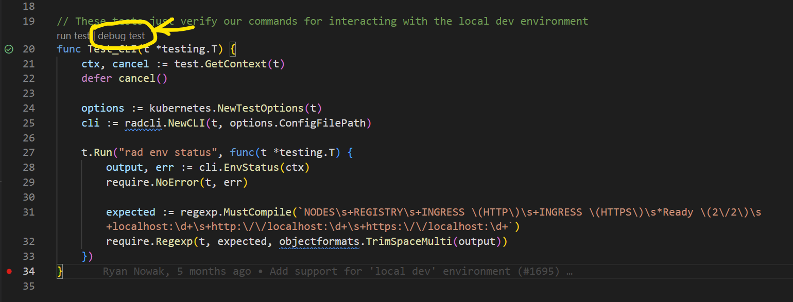

# Running Radius functional tests

## Purpose

Functional tests (also called end-to-end tests) interact with real hosting environments (Kubernetes), deploy real applications and resources, and cover realistic user scenarios. They verify, for example, that a Radius Environment can be created successfully and that the Bicep templates of sample applications can be deployed to it. This page is for contributors validating a change against a real cluster; for the full set of test tiers and when to run each, start at the [test matrix overview](./README.md).

The tests live under `./test/functional-portable`. They use product functionality - the Radius CLI configuration and your local KubeConfig - to detect settings, so the local setup resembles a real user scenario.

## Prerequisites

1. Place `rad` on your path.
2. Make sure `bicep` is downloaded (`rad bicep download`).
3. Make sure your [local dev environment is set up](../contributing-code-debugging/radius-os-processes-debugging.md).
4. Log into your GitHub account and [generate a PAT](https://docs.github.com/en/authentication/keeping-your-account-and-data-secure/managing-your-personal-access-tokens).
5. Log in to the container registry of your GitHub organization:

   ```sh
   export CR_PAT=<your_pat>
   echo $CR_PAT | docker login ghcr.io -u <your_username> --password-stdin
   ```

6. Publish the Bicep test recipes: `BICEP_RECIPE_REGISTRY=<registry-name> make publish-test-bicep-recipes`.
7. Publish the Terraform test recipes: `make publish-test-terraform-recipes`.
8. Change the visibility of the published packages to `public`.

> ⚠️ The tests assume the Kubernetes namespace in use is `default`. If your environment is set up differently you will see test failures.
>
> ⚠️ If you set environment variables for functional tests you may need to restart VS Code or other editors for them to take effect.

## Steps

### Run the tests locally

Run:

```sh
./test/executeFunctionalTest.sh <resourcegroup_name>
```

When you run locally with this configuration, the tests use your locally selected Radius Environment and your local copy of `rad`. `executeFunctionalTest.sh` creates the Azure resources, exports the values used by the tests, and runs:

```sh
make test-functional-corerp
make test-functional-msgrp
make test-functional-daprrp
make test-functional-datastoresrp
```

To run a single group directly, call its `make` target — for example `make test-functional-corerp-noncloud` for the non-cloud Core RP tests, or `make test-functional-all-noncloud` for the standard non-cloud groups. The groups (`ucp`, `kubernetes`, `corerp`, `cli`, `msgrp`, `daprrp`, `datastoresrp`, `dynamicrp`, `samples`, `upgrade`, `multicluster`, `database`, and `statestore`) and the variants each group supports are defined in [`build/test.mk`](../../../../build/test.mk).

You can also run or debug individual tests from VS Code.

`Test_ConfigurationStore_Manual`, `Test_ConfigurationStore_Recipe`, and `Test_DaprPubSubBroker_Manual` deploy their Redis dependencies first, then wait up to three minutes for `redis-cli PING` through the Redis Service to return `PONG` before deploying the Dapr-enabled consumer. The check runs in the Redis container using Kubernetes pod exec; the test identity needs permission to list pods and create `pods/exec` requests in the test namespace. The recipe test uses the application namespace `dcs-recipe`, not the environment namespace `default-dcs-recipe`.

### Run a special test group

The aggregate `make test-functional-all-noncloud` target intentionally excludes these isolated groups:

| Target                                       | Requirements and behavior                                                                                                                          |
|----------------------------------------------|----------------------------------------------------------------------------------------------------------------------------------------------------|
| `make test-functional-multicluster-noncloud` | Requires a second Kubernetes cluster, a target-cluster Secret mounted into Radius, and `RADIUS_TEST_EXTERNAL_KUBECONFIG` for the test process.     |
| `make test-functional-database-noncloud`     | Requires Radius installed with `--set database.enabled=true` (PostgreSQL-backed control plane) instead of the default Kubernetes API server store. |
| `make test-functional-statestore-noncloud`   | Destructive lifecycle test that installs, purges, and reinstalls Radius. Run it only on a dedicated cluster.                                       |
| `make test-functional-upgrade-noncloud`      | Exercises the Radius upgrade path and performs its own install/upgrade lifecycle.                                                                  |

The multicluster, database, and statestore groups run as isolated CI legs in `functional-test-noncloud.yaml`; do not run them against a shared development cluster.

For database tests, install Radius with the PostgreSQL-backed control plane first:

```bash
rad install kubernetes --set database.enabled=true
```

Running `make test-functional-database-noncloud` against a default (API server-backed) install fails, because the tests check that the PostgreSQL StatefulSet is present before asserting anything else.

Use a cluster that has never had a default install. The tests also assert that the API server store holds no objects, which is how they prove the resource providers actually switched to PostgreSQL rather than only running it alongside. Switching providers does not migrate or delete rows already written to the API server store, so a cluster that was previously installed without `database.enabled=true` keeps those objects and fails that assertion even when the PostgreSQL-backed control plane is healthy. CI creates a fresh cluster for every run.

For multicluster tests, create the namespace and Secret before installing Radius. The kubeconfig stored in the Secret must use an API-server address reachable from the Radius pods:

```bash
kubectl create namespace radius-system --dry-run=client -o yaml | kubectl apply -f -
kubectl create secret generic target-kubeconfig \
  --namespace radius-system \
  --from-file=kubeconfig=<pod-reachable-external-kubeconfig>
```

Install Radius with `global.targetCluster.enabled=true`, then set `RADIUS_TEST_EXTERNAL_KUBECONFIG` to the host-side kubeconfig that the test process uses to assert where resources were created.

### Configure test execution

The Make targets accept these environment variables:

| Variable                          | Purpose                                                                |
|-----------------------------------|------------------------------------------------------------------------|
| `TEST_TIMEOUT`                    | Overrides the Go test timeout. The default in `build/test.mk` is `1h`. |
| `RADIUS_TEST_EXTERNAL_KUBECONFIG` | Points multicluster tests at the external workload cluster.            |
| `TF_RECIPE_MODULE_SERVER_URL`     | Overrides the Terraform recipe module server URL.                      |
| `RADIUS_TEST_FAST_CLEANUP`        | Selects standard or fast cleanup as described below.                   |

### Control test cleanup

Functional tests support two cleanup modes, selected with the `RADIUS_TEST_FAST_CLEANUP` environment variable:

- **Standard cleanup** (default for local development): waits for each resource to be fully deleted before proceeding, logs the deletion process, and shows retries for resources stuck in "Updating". Best for debugging cleanup issues.
- **Fast cleanup** (default for CI, including the cloud suites): initiates deletions in the background without waiting, which avoids deletion timeouts and dramatically reduces run time. It **skips post-delete verification and ignores deletion errors**, and relies on the per-run cluster and Azure resource group being deleted afterward. CI enables it with `RADIUS_TEST_FAST_CLEANUP=true`.

```bash
# Enable fast cleanup (useful for local testing with unique resource names)
export RADIUS_TEST_FAST_CLEANUP=true
go test ./test/functional-portable/corerp/noncloud/resources

# Disable fast cleanup for debugging (default for local development)
export RADIUS_TEST_FAST_CLEANUP=false
go test ./test/functional-portable/corerp/noncloud/resources
```

> ⚠️ **Important**: Fast cleanup discards deletion errors, so a teardown bug stays invisible in any suite that runs with it enabled. The long-running test runs against a persistent cluster with standard cleanup, which is where such bugs surface.

### Resource deletion order

Tests declare the resources they expect in `RPResources`, and the framework deletes them in dependency order rather than declaration order: applications first, then application-scoped resources, then environments, and finally recipe packs. Declaration order is preserved within each of those groups.

This ordering matters because deleting an application cascades into the resources it owns, and a recipe-backed resource loads its environment configuration to run the recipe's delete. Removing the environment or recipe pack first makes that delete fail with an `Internal` error wrapping a `NotFound` on the environment.

### See log output in VS Code

Some tests take a few minutes because they interact with cloud resources. Configure VS Code to show verbose output so you can follow progress. Open `settings.json` with **Preferences: Open Settings (JSON)** and set:

```json
{
    "go.testTimeout": "60m",
    "go.testFlags": [
        "-v"
    ]
}
```

### Use Codelens (VS Code)

VS Code starts a child process when you use a `run test`/`debug test` Codelens action. That process may not resolve `rad` correctly. Specify environment variables for Codelens in `settings.json`:

```json
{
    "go.testEnvVars": {
        "RAD_PATH": "${workspaceFolder}/dist/linux_amd64/release"
    }
}
```



### How the tests run in CI

These tests run automatically for every PR via the `functional-test-noncloud.yaml` and `functional-test-cloud.yaml` GitHub workflows. We do not run them for commits to `main` or for tags, since a failure could block the build. For each PR, CI:

- Builds Radius and publishes the test assets.
- For each group of tests: creates a Kubernetes cluster, installs the build, runs the tests, and deletes any cloud resources that were created.

Separate scheduled jobs (`purge-azure-test-resources.yaml` and `purge-aws-test-resources.yaml`) delete cloud resources left behind when a run is cancelled or times out.

### Diagnose long-running Azure test failures

The scheduled `long-running-azure.yaml` workflow uses a published release for the CLI, control plane, and test source. Its diagnostics scripts run from the workflow checkout on `main`, so diagnostic improvements do not require a new Radius release.

Download the `all_container_logs` artifact from a successful or failed run. Alongside the released test harness's logs, it contains:

- `all-tests-pod-states.log`: final pod, node, and event descriptions.
- `all-diagnostics/window-start.txt`: the UTC start of the test command, used to filter the final container log sweep.
- `all-diagnostics/events-*.log`: timestamped event JSON and `radius-system` pod summaries sampled throughout the test command, with a 60-second delay between samples. These preserve events that may expire before the final snapshot.
- `all-diagnostics/radius-system/containers.tsv`: pod UIDs, restart counts, images, and separate current/previous container identities and start/finish timestamps, without pod environment values. Missing fields are `-`; a running container has no current finish time. The column order is recorded in `collection.log`.
- `all-diagnostics/radius-system/*.current.log` and `*.previous.log`: timestamped retained container logs from the test window. Previous logs are requested for containers reporting a restart.
- `all-diagnostics/collection.log` and `sampler.log`: requested windows, collection times, command outcomes, capture failures, and limit notices.

The sampler stops with the wrapped command, including on cancellation, without replacing its exit status. A 130-minute safety ceiling exceeds the workflow's existing 120-minute test-step timeout. Sampling is capped at 20 MiB. The final container log sweep has a 120-second budget, a 10 MiB cap per capture, and a 100 MiB combined cap; individual requests are bounded to 15 seconds plus a two-second termination grace period. Final diagnostic collection has a five-minute workflow timeout and runs before artifact upload and cluster cleanup.

Container logs cannot recover deleted pods or rotated history, and `--previous` covers at most one restart of a surviving container. An old OOM termination is not evidence of an OOM during this run; compare its timestamp with `window-start.txt`. A quiet log interval alone does not prove rotation or a stalled collector. `FAILED` entries, output caps, cancellation, or a collection timeout can leave incomplete captures. Use the cluster's existing Azure monitoring for historical CPU, memory, throttling, and logs no longer retained by Kubernetes. Treat downloaded logs as potentially sensitive.

To collect the same diagnostics locally, use Bash, `kubectl`, `jq`, and GNU coreutils (`timeout`) with your selected cluster. Use an absolute output path and a fresh directory for each run:

```bash
export RADIUS_CONTAINER_LOG_PATH="$PWD/dist/lrt-diagnostics-local"
export DIAGNOSTICS_NAME=all
bash .github/scripts/run-with-cluster-diagnostics.sh \
  make test-functional-corerp-noncloud
# Run this even if the test command fails.
DIAGNOSTICS_LOG_NAMESPACES=radius-system \
  bash .github/scripts/collect-cluster-diagnostics.sh
```

`DIAGNOSTICS_SAMPLE_INTERVAL` overrides the sampling delay in seconds. `DIAGNOSTICS_SINCE_TIME` overrides the saved window with a UTC timestamp such as `2026-09-17T10:00:00Z`; without either window, the collector records that container logs were skipped rather than fetching unbounded history. `DIAGNOSTICS_COLLECTION_SECONDS` overrides the container sweep's time budget. Other functional workflows retain their existing snapshot behavior unless they opt in with `DIAGNOSTICS_LOG_NAMESPACES`.

Run `make test-cluster-diagnostics` to exercise collection, limits, failures, command status preservation, and sampler cancellation with a stubbed `kubectl`; it does not access a cluster. This optional target requires `jq` and GNU coreutils (`timeout`). The Ubuntu unit-test CI job invokes it separately; it is not a prerequisite of `make test`, so the standard local unit-test command does not acquire these additional tool requirements.

### Cloud credentials in CI (federated identity)

The cloud CI workflows - `functional-test-cloud.yaml`, the long-running test `long-running-azure.yaml` ("LRT"), and the two scheduled purge jobs - authenticate to Azure and AWS with **federated identity only**. No static cloud secrets (service-principal passwords or AWS access keys) are stored in GitHub; every credential is a short-lived token minted from an OIDC trust. Two distinct trusts are in play:

- **Runner -> cloud.** The GitHub Actions runner gets tokens from GitHub's OIDC provider (`token.actions.githubusercontent.com`), and `azure/login` / `aws-actions/configure-aws-credentials` exchange them for short-lived credentials that the test and purge code use to verify and delete cloud resources. Every such job sets `permissions: id-token: write`.
- **Radius control plane -> cloud.** The Radius pods (service accounts `ucp`, `applications-rp`, and `dynamic-rp` in `radius-system`) assume a cloud identity through the *cluster's own* OIDC issuer - Azure Workload Identity on Azure, IRSA on AWS - using a projected service-account token (audience `sts.amazonaws.com` for AWS). Radius reads the target identity from the credential registered with `rad credential register azure wi` and `rad credential register aws irsa`; enabling it requires installing the chart with `--set global.azureWorkloadIdentity.enabled=true` and `--set global.aws.irsa.enabled=true` (the LRT does this in [`.github/scripts/manage-radius-installation.sh`](../../../../.github/scripts/manage-radius-installation.sh)).

The identities are carried in repository secrets rather than in the workflow files:

| Secret                                             | Assumed by                                                              | Trust                                                     |
|----------------------------------------------------|-------------------------------------------------------------------------|-----------------------------------------------------------|
| `AWS_GH_ACTIONS_ROLE`                              | the runner, via `configure-aws-credentials`                             | GitHub OIDC -> IAM role                                   |
| `FUNC_TEST_RAD_IRSA_ROLE`                          | the Radius pods, via IRSA                                               | cluster OIDC issuer -> IAM role                           |
| `AZURE_SP_TESTS_APPID` + `AZURE_SP_TESTS_TENANTID` | both the runner (`azure/login`) and the Radius pods (workload identity) | GitHub OIDC and AKS OIDC -> AAD app federated credentials |
| `FUNCTEST_AWS_ACCOUNT_ID`                          | the AWS account id passed to `rad env update` (not a credential)        | -                                                         |

#### Provision the AWS identities

The AWS identity resources are owned by the [`radius-project/wellknown`](https://github.com/radius-project/wellknown) Terraform layers. Do not create OIDC providers or edit role trust policies manually because a later Terraform apply will overwrite that drift.

Apply the layers in order whenever the LRT cluster is created or rotated:

1. `modules/20-functional-tests` publishes `workload_identity_issuers`, containing both the blob-hosted KinD issuer and the managed AKS issuer, plus the Radius service-account subjects.
2. [`modules/21-functional-tests-aws`](https://github.com/radius-project/wellknown/tree/main/modules/21-functional-tests-aws) creates or reuses an IAM OIDC provider for each issuer. It creates the IRSA role trusted by every issuer and the GitHub Actions role trusted by the Radius repository.
3. `modules/30-functional-tests-github` publishes the resulting role ARNs as `FUNC_TEST_RAD_IRSA_ROLE` and `AWS_GH_ACTIONS_ROLE`.

The GitHub Actions role allows 5400-second sessions, and the LRT workflow requests that duration to leave headroom over the 60-minute functional-test window. Its generated subject patterns include branch refs, so the scheduled `main` run uses `repo:radius-project/radius:ref:refs/heads/main` without a separate trust-policy edit.

## Verification

- Each group prints `ok` (or the `gotestsum` summary) per package and `go test` exits non-zero on any failure.
- A successful run creates a Radius Environment, deploys the sample applications, asserts on their state, and then cleans up the resources it created.

## Troubleshooting

- **You changed a recipe.** Re-run the *publish test recipe* prerequisite step so the cluster uses your updated recipe.
- **Tests cannot pull a package.** Confirm the packages published to your organization have their visibility set to `public`.
- **You changed the `rad` CLI.** Copy the rebuilt `rad` to your path (or set `RAD_PATH` for Codelens) so the tests use your new binary.
- **Environment variables seem ignored.** Restart VS Code or your editor so newly set variables take effect.
- **Many tests fail immediately.** Confirm the Kubernetes namespace in use is `default`.
- **A staged Dapr test fails waiting for Redis.** Read the readiness error's last observation and the Redis pod logs. A running pod alone does not prove Redis accepts connections. Check the Redis Service endpoints and pod-exec permissions; the consumer is intentionally not deployed if this prerequisite fails.
- **LRT AWS tests fail with `AccessDenied` on `AssumeRoleWithWebIdentity`.** Confirm the latest `modules/20-functional-tests`, `modules/21-functional-tests-aws`, and `modules/30-functional-tests-github` layers from `radius-project/wellknown` were applied in order. Verify the AKS issuer appears in the AWS layer's `oidc_issuers` output and the current `FUNC_TEST_RAD_IRSA_ROLE` secret matches its `irsa_role_arn` output.
- **A special test group is skipped or fails during setup.** Confirm that you met the isolated-cluster requirements in [Run a special test group](#run-a-special-test-group).
