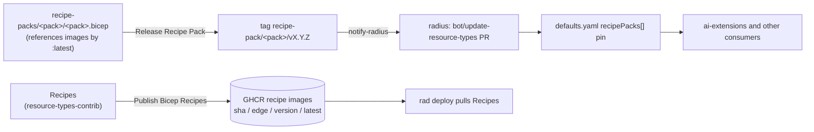

# Adding a Recipe Pack for a new platform

## Purpose

This document walks a maintainer through adding a **Recipe Pack** for a new platform (for example a new cloud, or a new compute runtime on an existing cloud) so that a Radius release ships with it and users can attach it to an Environment. It covers all four repositories involved (`resource-types-contrib`, `radius`, `ai-extensions`, and `docs`) and the order the changes must land in.

A Recipe Pack is a `Radius.Core/recipePacks` resource that maps each Resource Type to the Recipe that deploys it on one platform. Packs, their Recipes, and their release automation live in [`radius-project/resource-types-contrib`](https://github.com/radius-project/resource-types-contrib). Radius does not vendor packs. It records which pack revisions belong to a release under `recipePacks[]` in [`deploy/manifest/defaults.yaml`](../../deploy/manifest/defaults.yaml), and tools such as [`radius-project/ai-extensions`](https://github.com/radius-project/ai-extensions) read those pins and fetch the pack Bicep from `resource-types-contrib`.



## Prerequisites

- Write access to `radius-project/resource-types-contrib`, `radius-project/radius`, and `radius-project/ai-extensions`, and permission to run `workflow_dispatch` workflows in `resource-types-contrib`.
- If the pack needs new Recipe images: write access to the `radius-project` GHCR packages, plus [`oras`](https://oras.land/docs/installation) to tag them.
- A test account on the target platform, plus CI credentials for it if `resource-types-contrib` doesn't already validate that platform.
- To run `make update-recipe-packs` locally: Bash 4 or later (macOS ships Bash 3.2; install a newer one with `brew install bash`) and [`yq`](https://github.com/mikefarah/yq).

## Steps

### 1. Choose the pack name and scope

- Name the pack after the platform, and also the compute runtime when a platform has more than one, for example `kubernetes`, `azure-aks`, `azure-aci`. The name is the folder name, the release tag series (`recipe-pack/<pack>/vX.Y.Z`), and the `recipePacks[]` entry name, so pick it once. Renaming a pack later restarts its version series (see [Troubleshooting](#troubleshooting)).
- List the Resource Types the pack covers. An Environment can have only one Recipe per Resource Type across all its packs, so two packs that both provide, for example, `Radius.Compute/containers` can't be attached together. Note in the pack README which packs it can be combined with.
- List the Recipes the pack needs. A pack can only reference Recipes that are published as OCI images or available as public modules (for example Azure Verified Modules).

### 2. Author and test the Recipes

Write any new Recipes by following the [`resource-types-contrib` contributing guide](https://github.com/radius-project/resource-types-contrib/blob/main/docs/contributing/contributing-resource-types-recipes.md). If the platform is new to the repository, add a validation workflow for it modeled on `.github/workflows/validate-azure-recipes.yaml`, including its cloud credentials.

### 3. Publish new Recipe images

Skip this step if every Recipe the pack references is already published with a `latest` tag.

1. Add one step per new Recipe to `.github/workflows/publish-bicep-recipes.yaml`, using a platform-specific registry, for example `REGISTRY=ghcr.io/radius-project/azure-aci-recipes`. After it merges, the push to `main` publishes each image with a commit-SHA tag and `edge`.
2. Make sure each new GHCR package can be pulled anonymously. A `radius-project` organization admin must make private packages public.
3. Add a `latest` tag to each **new** image. The pack references `:latest`, which normally moves only during the final Radius release ([release Step 7](./contributing-releases/README.md#step-7-publish-docs-samples-and-recipes)). Packs are released earlier, during the RC, and **Release Recipe Pack** fails its Recipe source check if a `:latest` image is missing. Point `latest` at the commit-SHA tag from step 1, and skip images that already have one:

   ```bash
   IMAGE=ghcr.io/radius-project/<registry>/<recipe>
   oras manifest fetch --descriptor "$IMAGE:latest" || oras tag "$IMAGE:<commit-sha>" latest
   ```

Don't run **Publish Bicep Recipes** with an existing `release_version` to create these tags. It republishes every Recipe from `main`, which overwrites that version's released images and moves `latest` for every existing Recipe.

### 4. Add the pack to `resource-types-contrib`

Follow the checklist in [`recipe-packs/README.md`](https://github.com/radius-project/resource-types-contrib/blob/main/recipe-packs/README.md#how-to-create-a-new-recipe-pack): add `recipe-packs/<pack>/<pack>.bicep` and its README, list the pack in the packs table, and add it to the `recipe_pack` choices in `release-recipe-pack.yaml`. Also deploy the checked-in pack in the platform's validation workflow so CI catches broken pack files. For Azure, add a `.github/scripts/deploy-checked-in-azure-recipe-pack.sh recipe-packs/<pack>/<pack>.bicep <pack>` step to `validate-azure-recipes.yaml`.

### 5. Register the pack in Radius

Radius ignores release notifications for packs that aren't listed in `defaults.yaml`, so register the pack **before** its first release. In `radius`, add an entry under `recipePacks` in [`deploy/manifest/defaults.yaml`](../../deploy/manifest/defaults.yaml), pinned to the `resource-types-contrib` commit that adds the pack. Until the pack has a stable release, `tag` is empty (an edge pin):

```yaml
recipePacks:
  - name: <pack>
    repo: github.com/radius-project/resource-types-contrib
    ref: <full 40-character commit SHA on resource-types-contrib main>
    tag: ""
```

`make update-recipe-packs RECIPE_PACKS_NAME=<pack>` resolves the SHA for you. The **Verify resource type copies are in sync** check validates the entry: `ref` must be a full SHA and `recipe-packs/<pack>/` must exist at that ref.

### 6. Release the pack

Release the pack with the other packs in [Step 2 of the RC process](./contributing-releases/README.md#step-2-release-resource-type-namespaces-and-recipe-packs). Its first release is `v0.1.0`. The **Notify Radius** job then moves the `defaults.yaml` pin from the edge commit to the stable tag through the `bot/update-resource-types` PR.

### 7. Update consumers

`ai-extensions` reads the pack catalog from the `defaults.yaml` of the Radius release it pins, so a new pack is visible to it only after that pin moves to a stable Radius release that contains the pack:

- Bump `RADIUS_INSTALL_REF` and `RADIUS_INSTALL_COMMIT` in `.github/extension/actions/setup-control-plane/action.yml` and the matching `packages/adapter-shared/src/radius-release.json`. `build/scripts/update-radius-installer.sh` updates all three to the latest Radius release. The `load-contrib-catalog` action derives `catalog-ref` from `RADIUS_INSTALL_COMMIT`, so don't set `catalog-ref` directly.
- Reference the pack with `radius_contrib_recipe_pack_url <pack> <pack>.bicep` in the provider deploy workflow that should use it (for example `.github/extension/run-rad-commands-azure.yml`). `build/scripts/verify-contrib-consumers.sh` checks that every such reference resolves in the pinned catalog.

Also document the pack for users in [`radius-project/docs`](https://github.com/radius-project/docs).

## Verification

The pack is ready to ship when:

- `RECIPE_PACK=<pack> .github/scripts/release/verify-recipe-pack-sources.sh` in `resource-types-contrib` reports that every Recipe source resolves.
- The **Verify resource type copies are in sync** check passes on the `radius` PR that registers the pack.
- `recipe-pack/<pack>/vX.Y.Z` exists and the merged `defaults.yaml` entry has that `tag`.
- On a test cluster with the platform's provider configured, the pack deploys and attaches, and a test application deploys:

  ```bash
  rad deploy recipe-packs/<pack>/<pack>.bicep --environment <env>
  rad env update <env> --recipe-packs <pack> --preview
  rad deploy <Category>/<resourceType>/test/app.bicep --environment <env>
  ```

## Troubleshooting

- **Release Recipe Pack fails the Recipe source check.** A referenced image or tag can't be pulled anonymously. Make the GHCR package public, or add the missing `latest` tag as described in [step 3](#3-publish-new-recipe-images).
- **A pack release didn't update `defaults.yaml`.** The pack isn't listed under `recipePacks`; Radius skips names it doesn't know. Register it ([step 5](#5-register-the-pack-in-radius)); `make update-recipe-packs RECIPE_PACKS_NAME=<pack>` then pins the existing stable release.
- **`make update-recipe-packs` fails with `declare: -A: invalid option`.** The script needs Bash 4 or later. Run it with a newer Bash, or edit the entry by hand and rely on the CI check.
- **The sync check fails with "must pin a full commit SHA" or "uses edge ref …, but stable release … exists".** Use a 40-character SHA. Once a pack has a stable release, an edge pin can no longer be used for it; run `make update-recipe-packs RECIPE_PACKS_NAME=<pack>` to pin the latest stable release.
- **`rad env update --recipe-packs` fails with "Resource type '…' is defined in multiple recipe packs".** Two attached packs provide the same Resource Type. Attach only one of them, or split the overlapping types into a separate pack.
- **A renamed pack starts at `v0.1.0`.** Versions come from the git tags of each pack name, so a new name starts a new series. Treat the renamed pack as a new pack: register it, release it through **Release Recipe Pack**, and accept the new version series. Don't create `recipe-pack/<pack>/vX.Y.Z` tags by hand. The release tooling treats every tag as a stable release, so a hand-made tag skips the bundle, provenance attestation, GitHub Release, and **Notify Radius** event, and becomes the baseline that can make later releases report no changes.
