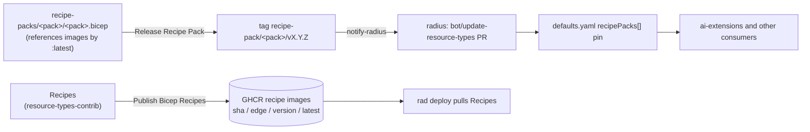

# Adding a Recipe Pack for a new platform

## Purpose

This document walks a maintainer through adding a **Recipe Pack** for a new platform (for example a new cloud, or a new compute runtime on an existing cloud) so that a Radius release ships with it and users can attach it to an Environment. It covers all three repositories involved and the order the changes must land in.

A Recipe Pack is a `Radius.Core/recipePacks` resource that maps each Resource Type to the Recipe that deploys it on one platform. Packs, their Recipes, and their release automation live in [`radius-project/resource-types-contrib`](https://github.com/radius-project/resource-types-contrib). Radius does not vendor packs. It records which pack revisions belong to a release under `recipePacks[]` in [`deploy/manifest/defaults.yaml`](../../deploy/manifest/defaults.yaml), and tools such as [`radius-project/ai-extensions`](https://github.com/radius-project/ai-extensions) read those pins and fetch the pack Bicep from `resource-types-contrib`.



For authoring the Recipes themselves, see the [`resource-types-contrib` contributing guide](https://github.com/radius-project/resource-types-contrib/blob/main/docs/contributing/contributing-resource-types-recipes.md). For the short in-repo checklist, see [`recipe-packs/README.md`](https://github.com/radius-project/resource-types-contrib/blob/main/recipe-packs/README.md#how-to-create-a-new-recipe-pack).

## Prerequisites

- Write access to `radius-project/resource-types-contrib` and `radius-project/radius`, and permission to run their `workflow_dispatch` workflows.
- A test account on the target platform, plus CI credentials for it if `resource-types-contrib` doesn't already validate that platform.
- The Recipes the pack needs, or a plan to write them. A pack can only reference Recipes that are published as OCI images or available as public modules (for example Azure Verified Modules).
- To run `make update-recipe-packs` locally: Bash 4 or later (macOS ships Bash 3.2; install a newer one with `brew install bash`) and [`yq`](https://github.com/mikefarah/yq).

## Steps

### 1. Choose the pack name and scope

- Name the pack after the platform, and also the compute runtime when a platform has more than one, for example `kubernetes`, `azure-aks`, `azure-aci`. The name is the folder name, the release tag series (`recipe-pack/<pack>/vX.Y.Z`), and the `recipePacks[]` entry name, so pick it once. Renaming a pack later restarts its version series (see [Troubleshooting](#troubleshooting)).
- List the Resource Types the pack covers. An Environment can have only one Recipe per Resource Type across all its packs, so two packs that both provide, for example, `Radius.Compute/containers` can't be attached together. Note in the pack README which packs it can be combined with.

### 2. Author and test the Recipes in `resource-types-contrib`

Add any new Recipes under `<Category>/<resourceType>/recipes/<platform>/` and make sure each Resource Type's `test/app.bicep` deploys with them. If the platform is new to the repository, add a validation workflow for it modeled on `.github/workflows/validate-azure-recipes.yaml`, including its cloud credentials.

### 3. Publish the Recipes as OCI images

Add one step per Recipe to `.github/workflows/publish-bicep-recipes.yaml`, using a platform-specific registry path, for example:

```yaml
- name: Publish azure-aci containers
  run: REGISTRY=ghcr.io/radius-project/azure-aci-recipes ./.github/scripts/publish-bicep-recipe.sh containers Compute/containers/recipes/azure/bicep/azure-aci-containers.bicep
```

After the change merges, the push to `main` publishes each image with a commit-SHA tag and `edge`. Confirm that each new GHCR package can be pulled anonymously. If a package is private, a `radius-project` organization admin must make it public. Release automation and users pull these images without credentials.

### 4. Add the pack to `resource-types-contrib`

1. Create `recipe-packs/<pack>/<pack>.bicep` declaring a single `Radius.Core/recipePacks` resource named `<pack>`, with one `recipes` entry per Resource Type. Reference in-repo Recipes by `ghcr.io/radius-project/<registry>/<recipe>:latest`. `make validate-recipe-packs` enforces the single-resource rule.
2. Add `recipe-packs/<pack>/README.md` listing the Recipes, parameters, and how to deploy and attach the pack.
3. Add the pack to the table in `recipe-packs/README.md`.
4. Add `<pack>` to the `recipe_pack` choice list in `.github/workflows/release-recipe-pack.yaml`.
5. Deploy the checked-in pack in the platform's validation workflow so CI catches broken pack files. For Azure, this is a `.github/scripts/deploy-checked-in-azure-recipe-pack.sh recipe-packs/<pack>/<pack>.bicep <pack>` step in `validate-azure-recipes.yaml`.

### 5. Create the `latest` image tags

The pack references `:latest`, but a push to `main` only moves `edge`. `latest` moves only when **Publish Bicep Recipes** runs with a stable `release_version`, which the [release process](./contributing-releases/README.md#step-7-publish-docs-samples-and-recipes) does on each final Radius release. If the pack must work before the next Radius release, run that workflow from `main` with `release_version` set to the current Radius version.

### 6. Register the pack in Radius

Radius ignores release notifications for packs that aren't listed in `defaults.yaml`, so register the pack **before** its first release. In `radius`, add an entry under `recipePacks` in [`deploy/manifest/defaults.yaml`](../../deploy/manifest/defaults.yaml), pinned to the `resource-types-contrib` commit that adds the pack. Until the pack has a stable release, `tag` is empty (an edge pin):

```yaml
recipePacks:
  - name: <pack>
    repo: github.com/radius-project/resource-types-contrib
    ref: <full 40-character commit SHA on resource-types-contrib main>
    tag: ""
```

Get the SHA with `git ls-remote https://github.com/radius-project/resource-types-contrib refs/heads/main`, or let the tooling resolve it:

```bash
make update-recipe-packs RECIPE_PACKS_NAME=<pack>
```

The **Verify resource type copies are in sync** check (`verify-resource-types-manifest.yaml`) validates the entry: `ref` must be a full SHA and `recipe-packs/<pack>/` must exist at that ref. Open the PR with a conventional-commit title (for example `chore: add <pack> recipe pack`).

### 7. Release the pack

Release packs as part of a Radius release, in [Step 2 of the RC process](./contributing-releases/README.md#step-2-release-resource-type-namespaces-and-recipe-packs):

1. In `resource-types-contrib`, run **Release Recipe Pack** from `main` with the new pack and `dry_run` enabled. Check the computed version (`minor` on a pack with no releases gives `v0.1.0`) and that the run passes the Recipe source check.
2. Run it again with `dry_run` disabled and `prerelease_label` empty. The workflow creates `recipe-pack/<pack>/vX.Y.Z`, and **Notify Radius** updates the `bot/update-resource-types` PR in `radius`, which moves the pin from the edge commit to the stable tag.
3. Review and merge that PR before the release branch is cut.

### 8. Update consumers

Tools that select a pack by name need to learn the new one. In `ai-extensions`:

- `radius_contrib_recipe_pack_url <pack> <pack>.bicep` in the provider deploy workflows (for example `.github/extension/run-rad-commands-azure.yml`) builds the pack URL at a pinned `catalog-ref`. `build/scripts/verify-contrib-consumers.sh` checks every such reference.
- The `radius-app-bicep` skill reads `recipePacks[]` from the installed Radius release's `defaults.yaml` (`extensions/radius/skills/radius-app-bicep/scripts/radius-recipe-pack.mjs`).

Also document the pack for users in [`radius-project/docs`](https://github.com/radius-project/docs).

## Verification

The pack is ready to ship when:

- `RECIPE_PACK=<pack> .github/scripts/release/verify-recipe-pack-sources.sh` in `resource-types-contrib` reports that every Recipe source resolves.
- The **Verify resource type copies are in sync** check passes on the `radius` PR that registers the pack.
- `recipe-pack/<pack>/vX.Y.Z` exists and the merged `defaults.yaml` entry has that `tag`.
- On a test cluster with the platform's provider configured, the pack deploys and attaches, and a test application deploys:

  ```bash
  rad deploy recipe-packs/<pack>/<pack>.bicep --environment <env>
  rad env update <env> --recipe-packs <pack> --preview
  rad deploy <Category>/<resourceType>/test/app.bicep --environment <env>
  ```

## Troubleshooting

- **Release Recipe Pack fails the Recipe source check.** A referenced image or tag can't be pulled anonymously. Make the GHCR package public, or create `latest` as described in [step 5](#5-create-the-latest-image-tags).
- **A pack release didn't update `defaults.yaml`.** The pack isn't listed under `recipePacks`; Radius skips names it doesn't know. Register it ([step 6](#6-register-the-pack-in-radius)); `make update-recipe-packs RECIPE_PACKS_NAME=<pack>` then pins the existing stable release.
- **`make update-recipe-packs` fails with `declare: -A: invalid option`.** The script needs Bash 4 or later. Run it with a newer Bash, or edit the entry by hand and rely on the CI check.
- **The sync check fails with "must pin a full commit SHA" or "uses edge ref …, but stable release … exists".** Use a 40-character SHA. Once a pack has a stable release, an edge pin can no longer be used for it; run `make update-recipe-packs RECIPE_PACKS_NAME=<pack>` to pin the latest stable release.
- **`rad env update --recipe-packs` fails with "Resource type '…' is defined in multiple recipe packs".** Two attached packs provide the same Resource Type. Attach only one of them, or split the overlapping types into a separate pack.
- **A renamed pack starts at `v0.1.0`.** Versions come from the git tags of each pack name, so a new name starts a new series. To continue the old numbering, a maintainer can create the first `recipe-pack/<new-name>/vX.Y.Z` tag manually on the rename commit.
