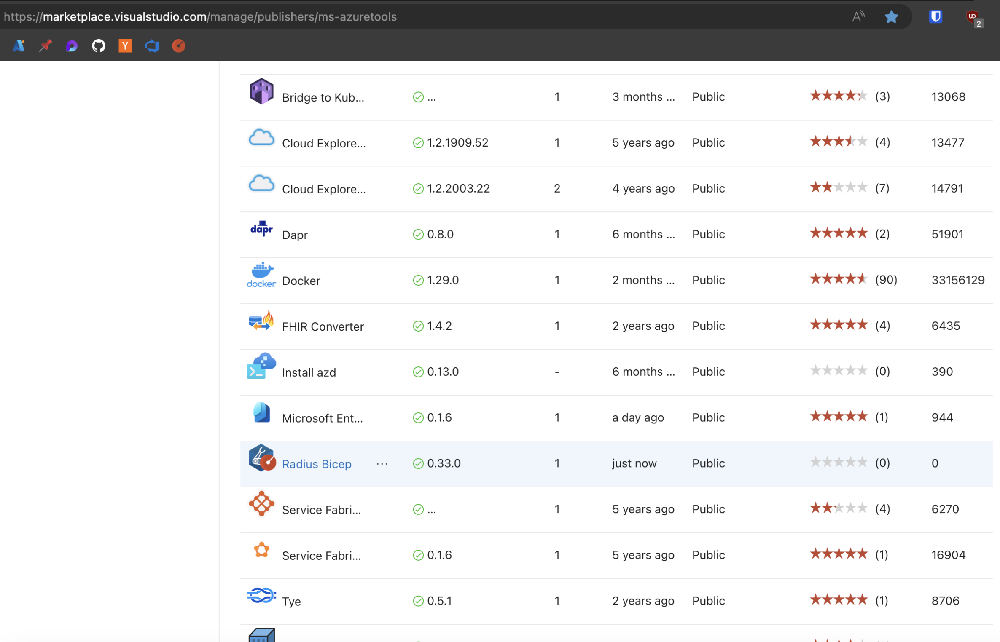

# How to create and publish a Radius release

## Prerequisites

- Determine the release version number. This is in the form `<major>.<minor>.<patch>`

## Terminology

- **RC Release**: A release candidate that we can test internally before releasing to the public which we can run validation on. If we find issues in validation, we can create additional RC releases until we feel confident in the release. Example: `v0.21.0-rc1` or `v0.21.0-rc2`
- **Final Release**: A release that is ready to be published to the public. Example: `v0.21.0`
- **Patch Release**: A release that contains bug fixes and patches for an already-created release. Example: `v0.21.1`
- **Release Branch**: A branch in the `radius-project/radius` repo that contains the release version. Example: `release/0.21`

## How releases work

Each release belongs to a *channel* named `<major>.<minor>`. Releases will only interact with assets from their channel. For example, the `0.1` `rad` CLI will:

- Download `rad-bicep` from the `0.1` channel
- Create an environment using the `0.1` version of the RP and environment setup script

> ⚠️ Compatibility ⚠️
At this time we do not guarantee compatibility across releases or provide a migration path. For example, the behavior of a `0.1` `rad` CLI talking to a `0.2` control plane is unspecifed. We expect the project to change too frequently to provide compatibility guarantees at this time.

Conceptually we scope channels to a major+minor pair because this allows us to freely patch assets as needed without needing to change the intermediate pieces. For example pushing a `v0.1.1` tag will update the assets in the `v0.1` channel. This works as long as it is a *true* patch release and maintains compatibility.

## Cadence

We follow a monthly release cadence. Any contributions that have been merged through the pull-request process will be present in the next scheduled release.


## Release Process

For the entire release process, directly clone repositories under the radius-project organization and create branches off of them. Do not create branches in your personal forks when creating pull requests. This is due to an error accessing the GitHub token when forks are used. 

### Creating an RC release

When starting the release process, we first kick it off by creating an RC release. If we find issues in validation, we can create additional RC releases until we feel confident in the release.

Follow the steps below to create an RC release.

1. Clone the [radius-project/radius](https://github.com/radius-project/radius) repo locally, or use your existing local copy.
   ```
   git clone git@github.com:radius-project/radius.git
   ```

1. Create a new branch from `main`.
   ```
   git checkout main
   git checkout -b <USERNAME>/<BRANCHNAME>
   ```

1. In your local branch, update the `versions.yaml` file to to reflect the new release candidate version that we would like to release. The `versions.yaml` file is a declarative version tracking file that the Radius community maintains ([Example](https://github.com/radius-project/radius/pull/6077/files)).

1. Push these changes to a remote branch and create a pull request against `main`.
   ```
   git push origin <USERNAME>/<BRANCHNAME>
   ```

1. After maintainer approval, merge the pull request to `main`.

1. You may need to wait around ~20 minutes for the release assets to be built and published.

1. There should be a GitHub workflow run in progress [here](https://github.com/radius-project/radius/actions/workflows/build.yaml) that was triggered by the `vx.y.z-rc1` tag. Monitor this workflow to ensure that it completes successfully. If it does, then the release candidate has been created.

1. Verify that an RC release was created on Github Releases for the current version ([Example](https://github.com/radius-project/radius/releases)).

1. In the `radius-project/radius` repo, run the [Release verification](https://github.com/radius-project/radius/actions/workflows/release-verification.yaml) workflow. Run the workflow from the release branch (format: `release/x.y`) and use the Radius RC release version number being released.

1. In the `radius-project/samples` repo, run the [Test Samples](https://github.com/radius-project/samples/actions/workflows/test.yaml) workflow. Run the workflow from the `edge` branch and using the Radius RC release version number being released.

   > The `edge` branch needs to be upmerged with the previous release branch before this happens. To upmerge the `edge` branch, create a new branch off of the `edge` branch and run `git merge origin/v<previous-release-number>`. For example, if the current release is `v0.34`, the command would be `git merge origin/v0.33`. Then, push these changes to the new branch and create a PR against `edge`. Run the `Test Samples` workflow once the upmerge PR has been merged to `edge`. 
      
   > If this workflow run fails, then there should be further investigation. Try checking the logs to see what failed and why, and checking if there is already an issue open for this failure in the samples repo. Sometimes, the workflow run will fail because of flaky tests. Try re-running, and if the failure is persistent, then file an issue in the samples repo and raise it with the maintainers.

1. If these workflows pass, then the release candidate has been successfully created and validated. We can now proceed to creating the final release. If the workflows fail, then we need to fix the issues and create a new RC release.

### Creating the final release

Once an RC release has been created and validated, we can proceed to creating the final release.

Follow the steps below to create a final release.

1. Clone the [radius-project/bicep](https://github.com/radius-project/bicep) repo locally, or use your existing local copy.
   ```
   git clone git@github.com:radius-project/bicep.git
   ```

1. Create a new branch from `bicep-extensibility`.
   ```
   git checkout bicep-extensibility
   git checkout -b <USERNAME>/<BRANCHNAME>
   ```

1. In your local branch, update the `version.json` file.
Update it to reflect the new release version that we would like to release ([Example](https://github.com/radius-project/bicep/pull/703/files)).

1. Push these changes to a remote branch and create a pull request against `bicep-extensibility`.
   ```
   git push origin <USERNAME>/<BRANCHNAME>
   ```

1. After maintainer approval, merge the pull request to `bicep-extensiblity`.

1. Create a new branch from the release branch we want to release. The release branch should already exist in the repo. Release branches are in the format `release/x.y`.
   ```
   git checkout release/0.<VERSION>
   git checkout -b <USERNAME>/<BRANCHNAME>
   ```

1. Cherry-pick the `version.json` changes from the previous steps in this PR. This will ensure that the version changes are included in the release branch ([Example](https://github.com/radius-project/bicep/pull/704/files)). You can get the commit hash by running `git log --oneline` in the bicep-extensibility branch. PLEASE USE `-x` HERE TO ENSURE VERSION HISTORY IS PRESERVED.
   ```
   git cherry-pick -x <COMMIT HASH>
   ```

1. Create a PR to merge into the release branch in the bicep repo.

1. After maintainer approval, merge the pull request to the release branch.

1. Move to your local copy of the `radius-project/radius` repo.

1. Create a new branch from `main`.

1. In your local branch, update the `versions.yaml` file to to reflect the new release version that we would like to release ([Example](https://github.com/radius-project/radius/pull/6992/files#diff-1c4cd801df522f4a92edbfb0fea95364ed074a391ea47c284ddc078f512f7b6a)).

1. Push these changes to a remote branch and create a pull request against `main`.

1. In this PR, there will be an automatically-generated release notes comment. Create a new release note document in the [release-notes](../../release-notes/) directory using this automatically generated release notes comment. Follow the directory's `README.md` for instructions on how to create a new release note document. Include this file in the release version pull request ([Example](https://github.com/radius-project/radius/pull/6092/files)).

1. After maintainer approval, merge the pull request to `main`.

1. Create a PR to merge into the release branch (format: `release/x.y`) in the radius repo. Cherry-pick the commit containing the `versions.yaml` changes and the release notes from the previous steps in this PR. You can get the commit hash by running `git log --oneline` in the main branch. This will ensure that the version changes and release notes are included in the release branch ([Example](https://github.com/radius-project/radius/pull/6114/files)). PLEASE USE `-x` HERE TO ENSURE VERSION HISTORY IS PRESERVED.
   ```bash
   git cherry-pick -x <COMMIT HASH>
   ```

1. After maintainer approval, merge the pull request into the release branch.

1. There should be a GitHub workflow run in progress [here](https://github.com/radius-project/radius/actions/workflows/build.yaml) that was triggered by the `vx.y.z` tag. Monitor this workflow to ensure that it completes successfully.

1. You may need to wait around ~20 minutes for the release assets to be published.

1. Verify that a release was created on Github Releases for the current version ([Example](https://github.com/radius-project/radius/releases)).

1. In the project-radius/docs repository, run the [Release docs](https://github.com/radius-project/docs/actions/workflows/release.yaml) workflow.

1. In the project-radius/samples repository, run the [Release samples](https://github.com/radius-project/samples/actions/workflows/release.yaml) workflow.

1. In the `radius-project/radius` repo, run the [Release verification](https://github.com/radius-project/radius/actions/workflows/release-verification.yaml) workflow. Run the workflow from the release branch (format: `release/x.y`) and use the Radius release version number being released.

1. In the `radius-project/samples` repo, run the [Test Samples](https://github.com/radius-project/samples/actions/workflows/test.yaml) workflow. Run the workflow from the `edge` branch and using the Radius release version number being released.

   > If this workflow run fails, then there should be further investigation. Try checking the logs to see what failed and why, and checking if there is already an issue open for this failure in the samples repo. Sometimes, the workflow run will fail because of flaky tests. Try re-running, and if the failure is persistent, then file an issue in the samples repo and raise it with the maintainers.

1. If these workflows pass, then the release has been successfully created and validated. If the workflows fail, then we need to fix the issues and create a new release.

1. Download the Radius Bicep .vsix file from here: https://github.com/radius-project/bicep/releases. Scroll down to the most recent release and download the .vsix file.

1. Upload the Radius Bicep .vsix to the [VS marketplace](https://marketplace.visualstudio.com/manage). You may need access permissions, if so, ask a maintainer. Click on the ... for Radius Bicep, then Update, then upload the .vsix file. The site will verify it then the version number should be updated to the right one.

## Patching

Let's say we have a bug in a release that needs to be patched for an already-created release.

1. Merge the bug fix into the `main` branch of the repo that needs to be fixed.

1. Once these changes are merged into `main`, create a new branch from `main` in the repo that needs to be patched. Update `versions.yaml` to reflect the new patch version that we would like to release.

1. Push these changes to a remote branch and create a pull request against `main`.

1. After maintainer approval, merge the pull request to `main`.

1. Create a new branch from the release branch we want to patch. The release branch should already exist in the repo. Release branches are in the format `release/x.y`.
   ```
   git checkout release/0.<VERSION>
   git checkout -b <USERNAME>/<BRANCHNAME>
   ```

1. Cherry-pick the bug fix as well as the `versions.yaml` changes from the previous steps in this PR. This will ensure that the version changes are included in the release branch. You can get the commit hash by running `git log --oneline` in the main branch. PLEASE USE `-x` HERE TO ENSURE VERSION HISTORY IS PRESERVED.
   ```
   git cherry-pick -x <BUGFIX_COMMIT HASH>
   git cherry-pick -x <VERSIONFILE_COMMIT HASH>
   ```

1. Create a PR to merge into the release branch in the repo that needs to be patched.

1. After maintainer approval, merge the pull request into the release branch.

1. There should be a GitHub workflow run in progress [here](https://github.com/radius-project/radius/actions/workflows/build.yaml) that was triggered by the `vx.y.z` tag. Monitor this workflow to ensure that it completes successfully.

1. You may need to wait around ~20 minutes for the release assets to be published.

1. Verify that a release was created on Github Releases for the current version ([Example](https://github.com/radius-project/radius/releases)).

1. If breaking changes have been made to our Bicep fork, update the file `radius/.github/workflows/validate-bicep.yaml` to use the release version (eg. `v0.21`) instead of `edge` for validating the `.bicep` files in the docs and samples repositories. Also, modify the version from `env.REL_CHANNEL` to `<major>.<minor>` (eg. `0.21`) for downloading the `rad-bicep-corerp`.

1. In the `radius-project/radius` repo, run the [Release verification](https://github.com/radius-project/radius/actions/workflows/release-verification.yaml) workflow. Run the workflow from the release branch (format: `release/x.y`) and use the Radius release version number being released.

1. In the `radius-project/samples` repo, run the [Test Samples](https://github.com/radius-project/samples/actions/workflows/test.yaml) workflow. Run the workflow from the `edge` branch and using the Radius release version number being released.

   > If this workflow run fails, then there should be further investigation. Try checking the logs to see what failed and why, and checking if there is already an issue open for this failure in the samples repo. Sometimes, the workflow run will fail because of flaky tests. Try re-running, and if the failure is persistent, then file an issue in the samples repo and raise it with the maintainers.

1. If these workflows pass, then the release has been successfully created and validated. If the workflows fail, then we need to fix the issues and create a new release.

1. Download the Radius Bicep .vsix file from here: https://github.com/radius-project/bicep/releases. Scroll down to the most recent release and download the .vsix file.

1. Upload the Radius Bicep .vsix to the [VS marketplace](https://marketplace.visualstudio.com/manage). You may need access permissions, if so, ask a maintainer. Click on the ... for Radius Bicep, then Update, then upload the .vsix file. The site will verify it then the version number should be updated to the right one.

