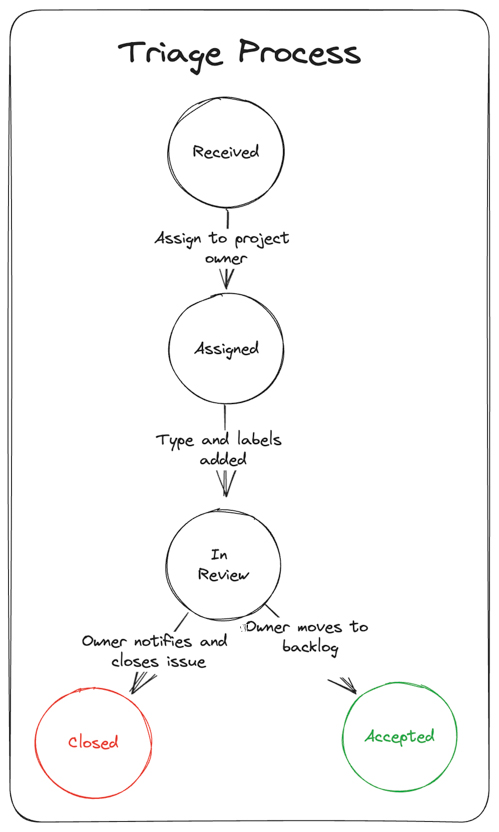

# Triage Process

## About the triage process

The interaction between users and maintainers is at the heart of open source software. That interaction plays out through issue tracking. See the [documentation on contributing issues](https://github.com/radius-project/radius/blob/main/docs/contributing/contributing-issues/README.md).  These issues offer a lot of value to the project but not every issues is actionable or useful. That's where triage comes in. Triage is a multi-step process that is performed by the issue tracker and the sub-project/feature owners. The goal of triage is to provide a clear understanding of what will happen to issues that are opened. For example, after a feature request is triaged, it will be clear whether the issue will be picked up or closed. After an issue is received and triaged, it will either be assigned to the backlog, a specific milestone or closed.

## Goals

The goals for triage are:

* Make triage decisions easier by defining rules and processes
* Easily prioritize work for each milestone
* Set expectations with the community regarding how issues are handled

## About the triage team

A triage team is a group of people who review issues, such as bugs and feature requests, as they come in. The team is responsible for assessing the priority of the issues being reviewed and identifying the rough size of the effort required to fix them based on the complexity of the bug and functionality. The team is composed of a product manager, a software engineering manager or lead, a test lead, if appropriate, and, in the case of Radius, project maintainers. Other members may also be invited to give their opinions and perspectives regarding certain issues. As a triage team member, your primary goal is to ensure that the project's issue tracker is well-organized and that reported problems receive the attention they deserve.

The triage team also plays an important role in the long-term health of the project and supporting maintainers. It is the the first point of contact for issues and bug reports and help make the communication between the development team and the contributors seamless. Its work makes for faster issue resolution, better resource allocation, and knowledge sharing. It’s important to note that not all contributors have the technical expertise to contribute directly with the code. Triage creates an opportunity for non-developers to make meaningful contributions. A positive user experience often starts with the triage team. We welcome any contributor or community member to participate in the triage process. Learn how, [below](#getting-started-as-a-triage-team-member).

## Roles

### Responsibilities of triage team

The purpose of the triage team is to review issues as they come in. The team is responsible for ensuring issues follow best practices and are relevant to the project. The team members have strong subject matter expertise and understands deliverable schedules and have the power to make prioritization decisions.

As a member of the triage team you are responsible for keeping the issue repository up to date with only actionable items. This includes:

* **Issue Triage**: categorizing and prioritizing issues based on their severity, impact and relevance to the project.  
  
  At least once a month, a deep triage session will occur where you will review all issues older than 6 months to determine if they are still relevant, have the needed information to make progress and/or should be reprioritized based on new information. You will review existing labels and update them where appropriate. Any issue without a clear justification for being kept in the queue will be closed with notes in the issue as to why the decision was made. During a normal triage session, you will review all issues that are not assigned to a feature team and/or in the backlog.

* **Issue Verification**: reproducing reported bugs to determine if the issue is valid and how soon it must be fixed  

   If a bug cannot be reproduced, we will either close it with an explanation of the steps attempted to reproduce or tag it with `needs more info` to get more detail on repro steps and kept in the triage queue. If a bug can be reproduced but we decide the fix is too risky, we will update the description to include details that impacted the decision and the issue will be closed.

* **Issue Management**: assigning labels and tags to issues, verifying issue priority, determining feature team assignment and appropriate target milestone or backlog  
  
  Each new issue will be categorized and tagged. If the issue has the level of detail required to make a triage decision, we will either deny and close or approve and assign to the appropriate feature team and move it to the backlog. If more information is needed, we will tag it with `needs more info` and keep it in the triage queue.
* **Communication and collaboration**: engaging with users, contributors, and maintainers, you act as a bridge between them and the development team to resolve issues.  
  
  You respond to the user with comments on their issue, asking clarifying questions to understand the issue. You collaborate with other members and users of Radius to find solutions. You gather feedback from users, identify common challenges and discuss potential improvements with the development team. Doing this effectively bridges the gap between users and developers leading to a better experience for all users.

### Responsibilities of user

As an issue creator, you are responsible for creating an issue using the [appropriate template](https://github.com/radius-project/radius/issues/new/choose) and completing all sections with appropriate level of detail. For bug reports, clear steps to reproduce the issue must be included so we can verify the product behavior. You will also respond to requests for more information within 7 days. If you do not respond within that timeline, the issue will be closed. You are free to reopen the issue when the additional information has been added and we will triage it again.

## When Do We Triage?

Triage schedule will vary depending on a few factors: incoming rate of issues; availability of triage team; planning and release timelines. At a minimum, the triage team meets weekly to review all incoming issues. Once a month during those meetings, a deep triage occurs where we look at all issues older than 6 months. If the rate of incoming issues grows such that we cannot review all new issues in the weekly meeting, we will add triage sessions as required to fully review the items in the queue in a timely fashion. We will make every effort to have all issues triaged before our sprint planning sessions. As we get close to a major release, we will meet daily to assess all new issues and their impact on the release schedule.  

## Triage Flow

Below is the basic flow that an issue goes through. At any step in the flow the issue may be closed.

## Closing Issues

Issues are closed for the following reasons:

| **Reason** | **Label**|
----------------|----------
| Issue is obsolete or fixed | |
| Needed information not received within 7 days| `needs more info` |
| It's a duplicate of another issue| `duplicate` |
| Behavior is as designed| `by-design` |
| Issue is a question &#185; | `question` |
| Issue is not related to the goals of the project so is unactionable | `off-topic` ||
| Issue cannot be reproduced based on information given | `not-reproducible` |
| Feature request is out of scope | `out-of-scope` |

&#185; All questions will be redirected to our [Discord server](https://discord.gg/SRG3ePMKNy)

## Requesting Information

If an issue is missing information that we need to understand the issue, a `needs more info` label will be assigned. If the information is not received in 7 days the issue will be closed.

## Categorizing Issues

Each issue will be assigned a **type** label.

|**Type**| **Description**|
:-| :--------
| `needs more info` | issue is missing information so type label cannot be assigned |
| `bug` | the implementation of a feature is not correct |
| `feature-request` | request for a new feature |
| `under-discussion` | not decided whether issue is bug or feature |
| `tech-debt` | improve the implementation/architecture |
| `engineering` | issues related to engineering system or processes |

## Assigning Feature Areas

Each issue will be assigned to a specific **feature area** during the triage process.

## Assigning a Milestone

We plan and execute milestones in 2 week sprints which are incremented numerically. Any item not in the current sprint will be put in the **backlog** milestone. Sprint planning is completed on the first day of the sprint and pulls all items from the backlog. During backlog grooming we review new issues that have been put in the backlog by the triage process to determine when the issue can be worked on.

## Important Issues

We assign the `important` label to issues that:

* result in data loss
* break basic functionality
* are critical security/performance issues
* are UI issue that makes feature unusable

## Managing Feature Requests

Feature requests are used as a means of communication between the members of the community. Thus, in principle, they could be kept open no matter what will happen to the feature they describe. Unfortunately, this makes it hard to understand what has realistic chances to ever make it into the repository. Therefore, feature requests that cannot be addressed are closed with the `out-of-scope` label. If the feature request meets the goals of the project and could be implemented by the community, the `community` label is assigned.

If you are the author of a feature request you might not like that we close or don't plan to address your request. It might even feel like a slap in your face. We understand that. All of us have been there—in this project or others we have contributed to. So, be assured, we love all of your input. Don't take personal offense when we close it. If you feel your feature request deserves to stay open, improve your use case and ping us or gather more support within the community.

This is our decision making tree.

## Won't Fix Bugs

Bugs will be closed as `wont-fix` if there is a negative cost-benefit to the fix. For example, if the fix is so complex that despite all the tests there is a risk of regression for many users, fixing is not a reasonable choice. When the bug is closed as `wont-fix` there will be a clear explanation as to why the decision was made.

## Getting Started as a Triage Team Member

If you want to grow in your open source journey, you might find that a good milestone is becoming a part of a triage team for an open source project. Here are some tips to follow that path:

* Ensure you are willing to commit to for an extended period.

* Check out the Radius Project's [documentation](https://github.com/radius-project/docs/), [repositories](https://github.com/radius-project/), and [issue tracker](https://github.com/radius-project/radius/issues) to understand its goals and contribution processes.

* Join the [communication channels](https://discord.gg/SRG3ePMKNy), introduce yourself, and let us know that you’re interested in becoming part of the triage team. Ask for help from experienced members.

Even if you’re not a part of the team, that doesn’t mean that you can’t help. You can still offer contributors suggestions or direct them to answers if you’re able to. The key is to only do so if you know the answer. For example, maybe someone raised an issue that was already responded to. You can direct them to the previous answer.
