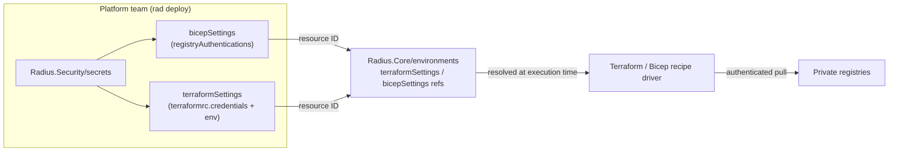

# E2E Demo: Private Registries & Repositories with Terraform and Bicep settings resource types

This demo validates the work delivered in
[radius-project/radius#11798 - *Private registries and repositories support for
compute extensibility*](https://github.com/radius-project/radius/issues/11798),
updated for
[radius-project/radius#12303](https://github.com/radius-project/radius/pull/12303),
which renamed these resource types to match the feature spec and added support
for `Radius.Security/secrets` as the credential store.

With compute extensibility, Radius introduced the `Radius.Core/environments`
resource. Private recipe registry authentication - which used to live inline on
`Applications.Core/environments` under `recipeConfig` - is now expressed as
**standalone, reusable resources**:

| Resource | Purpose |
| --- | --- |
| `Radius.Core/terraformSettings` | Private Terraform registry credentials, provider installation (mirror/direct), and Terraform env vars. Radius renders a `.terraformrc` from it at recipe-execution time. |
| `Radius.Core/bicepSettings` | Private Bicep (OCI) registry authentication, keyed by registry hostname. |

Registry credentials are supplied through a secret resource that these settings
reference by ID. As of #12303 the secret can be a **`Radius.Security/secrets`**
(recommended) or an `Applications.Core/secretStores`. This demo uses
`Radius.Security/secrets`.

A `Radius.Core/environments` resource references these settings by resource ID, so
a platform team can define registry authentication **once** and reuse it across
many environments.

This walkthrough proves the feature works end-to-end against **real private
registries in the cloud**, across three scenarios:

1. **Private Bicep recipe registry** (OCI, e.g. Azure Container Registry) - `Radius.Core/bicepSettings` with `BasicAuth`.
2. **Private Terraform module registry/repository** - `Radius.Core/terraformSettings` with a `credentials` token.
3. **Combined** - a single environment that references *both* settings resources.

> Design references:
> [Terraform & Bicep settings feature spec - User Story 8 (Private Bicep Recipes)](https://github.com/radius-project/design-notes/blob/main/features/2025-08-14-terraform-bicep-settings.md#user-story-8--private-bicep-recipes),
> [Available Terraform settings](https://github.com/radius-project/design-notes/blob/main/features/2025-08-14-terraform-bicep-settings.md#available-terraform-settings),
> [Reusable Terraform and Bicep settings architecture doc](../../architecture/terraform-bicep-settings.md).
>
> Product docs for the equivalent (legacy) feature, for additional context:
> [Private Terraform registry](https://docs.radapp.io/guides/recipes/terraform/howto-private-registry/),
> [Private Bicep registry](https://docs.radapp.io/guides/recipes/howto-private-bicep-registry/).

---

## Cross-platform note (Linux / macOS / Windows)

Every `rad`, `kubectl`, and `git` command in this guide is **identical on all
platforms**. Only the way you set shell variables differs. Where a step needs a
variable, both forms are shown. The PowerShell form uses
[`pwsh`](https://learn.microsoft.com/powershell/scripting/install/installing-powershell)
(PowerShell 7+), which runs the same on Windows, Linux, and macOS:

- **Linux / macOS (bash / zsh):**
  ```bash
  export REGISTRY="myregistry.azurecr.io"
  ```
- **PowerShell (pwsh, cross-platform):**
  ```powershell
  $env:REGISTRY = "myregistry.azurecr.io"
  ```

In commands below, `$REGISTRY` (bash) and `$env:REGISTRY` (PowerShell) refer to
the same value. Substitute your own values throughout.

> The generated `.terraformrc` is written **inside the Radius control plane** and
> selected via `TF_CLI_CONFIG_FILE`, so Terraform behavior is identical
> regardless of the OS you run `rad` from. You do **not** need a local
> `.terraformrc` / `terraform.rc`.

---

## Prerequisites

1. A Kubernetes cluster and `kubectl` configured to talk to it.
2. The [`rad` CLI](https://docs.radapp.io/installation/) installed.
3. Radius installed on the cluster with the `Radius.Core` resource types
   available (`rad install kubernetes`).
4. At least one **private** registry you control:
   - For Scenario 1: a private **OCI** registry that can host Bicep artifacts
     (e.g. Azure Container Registry, GitHub Container Registry, Amazon ECR).
   - For Scenario 2: a private **Terraform** module registry or repository that
     authenticates with a token (e.g. Terraform Cloud `app.terraform.io`, or a
     self-hosted private module registry).
   - **Don't have one yet?** See [PREREQUISITES.md](./PREREQUISITES.md) for
     high-level steps to set up a private Bicep (OCI) and Terraform registry for
     demoing.
5. The Bicep tooling for `rad bicep publish` (bundled with `rad`).

Verify your setup:

```bash
rad version
kubectl get nodes
rad group create demo-private-registries
rad group switch demo-private-registries
```

Create the namespaces the environments deploy into (the `Radius.Core/environments`
resource requires the target namespace to already exist). Each scenario uses a
dedicated **secrets** namespace for the environment that provisions its
`Radius.Security/secrets` resources - Radius rejects two environments that share a
namespace, so the secrets environment must be separate from the application one:

```bash
kubectl create namespace private-bicep-demo
kubectl create namespace private-bicep-demo-secrets
kubectl create namespace private-tf-demo
kubectl create namespace private-tf-demo-secrets
kubectl create namespace private-combined-demo
kubectl create namespace private-combined-demo-secrets
```

All Bicep templates referenced below live in [`./bicep`](./bicep) and the sample
recipe in [`./recipes`](./recipes). Run the commands from this demo directory.

> **Prefer to automate it?** The [`./scripts`](./scripts) folder contains an
> end-to-end runner that performs every step below (group + namespace setup,
> recipe publish, deploy, and verify) for a chosen scenario. See
> [Automated E2E runner](#automated-e2e-runner). The manual steps that follow
> document exactly what those scripts do.

---

## Scenario 1 - Private Bicep recipe registry (OCI)

**Goal:** publish a Bicep recipe to a *private* OCI registry and have Radius pull
it using credentials supplied through a `Radius.Core/bicepSettings` resource.

### 1.1 Publish the sample recipe to your private registry

Set your registry details.

- **Linux / macOS:**
  ```bash
  export BICEP_REGISTRY="myregistry.azurecr.io"
  export BICEP_RECIPE="${BICEP_REGISTRY}/recipes/redis:latest"
  ```
- **PowerShell (pwsh, cross-platform):**
  ```powershell
  $env:BICEP_REGISTRY = "myregistry.azurecr.io"
  $env:BICEP_RECIPE   = "$($env:BICEP_REGISTRY)/recipes/redis:latest"
  ```

Authenticate your local tooling to the registry once so you can push the
artifact (example for Azure Container Registry - use the equivalent for your
provider):

```bash
az acr login --name myregistry
```

Publish the recipe:

- **Linux / macOS:**
  ```bash
  rad bicep publish --file ./recipes/redis-recipe.bicep --target "br:${BICEP_RECIPE}"
  ```
- **PowerShell (pwsh, cross-platform):**
  ```powershell
  rad bicep publish --file ./recipes/redis-recipe.bicep --target "br:$($env:BICEP_RECIPE)"
  ```

### 1.2 Create registry credentials

For `BasicAuth`, you need a username and password the cluster can use to pull
from the registry. For ACR this can be an
[ACR token](https://learn.microsoft.com/azure/container-registry/container-registry-repository-scoped-permissions)
or a service principal. Capture them:

- **Linux / macOS:**
  ```bash
  export BICEP_REGISTRY_USERNAME="<token-name-or-app-id>"
  export BICEP_REGISTRY_PASSWORD="<token-password-or-secret>"
  ```
- **PowerShell (pwsh, cross-platform):**
  ```powershell
  $env:BICEP_REGISTRY_USERNAME = "<token-name-or-app-id>"
  $env:BICEP_REGISTRY_PASSWORD = "<token-password-or-secret>"
  ```

### 1.3 Deploy the environment + app

The template [`bicep/bicep-private-registry.bicep`](./bicep/bicep-private-registry.bicep)
creates a `Radius.Security/secrets` (holding the registry username/password),
the `Radius.Core/bicepSettings` that references it, a `Radius.Core/recipePacks`
pointing at the private recipe, the `Radius.Core/environments` that references the
bicepSettings, and an app that runs the recipe. It also creates a small **secrets
environment** whose default recipe pack materializes the backing Kubernetes Secret
that the Bicep driver reads at recipe-execution time.

> **Self-hosted insecure registries.** This demo targets HTTPS registries. If your
> private OCI registry only serves plain HTTP (for example a locally hosted dev
> registry), set `plainHttp: true` on the recipe entry in the `recipePacks`
> resource so Radius pulls over HTTP instead of HTTPS.

- **Linux / macOS:**
  ```bash
  rad deploy ./bicep/bicep-private-registry.bicep \
    --parameters registryHostname="$BICEP_REGISTRY" \
    --parameters recipeLocation="$BICEP_RECIPE" \
    --parameters registryUsername="$BICEP_REGISTRY_USERNAME" \
    --parameters registryPassword="$BICEP_REGISTRY_PASSWORD"
  ```
- **PowerShell (pwsh, cross-platform):**
  ```powershell
  rad deploy ./bicep/bicep-private-registry.bicep `
    --parameters registryHostname="$env:BICEP_REGISTRY" `
    --parameters recipeLocation="$env:BICEP_RECIPE" `
    --parameters registryUsername="$env:BICEP_REGISTRY_USERNAME" `
    --parameters registryPassword="$env:BICEP_REGISTRY_PASSWORD"
  ```

### 1.4 Verify

```bash
rad resource list Applications.Core/extenders
kubectl get pods -n private-bicep-demo
```

A successful deployment means Radius authenticated to your **private** OCI
registry, pulled the Bicep recipe, and executed it - the Redis pod should be
`Running` in `private-bicep-demo`.

---

## Scenario 2 - Private Terraform module registry / repository

**Goal:** authenticate to a *private* Terraform module source via a token carried
by a `Radius.Core/terraformSettings` resource. Radius renders a `.terraformrc`
`credentials` block for that registry at execution time.

### 2.1 Gather registry details and token

- **Linux / macOS:**
  ```bash
  export TF_REGISTRY_HOST="app.terraform.io"
  export TF_RECIPE_LOCATION="app.terraform.io/my-org/redis/kubernetes"
  export TF_REGISTRY_TOKEN="<your-terraform-registry-token>"
  ```
- **PowerShell (pwsh, cross-platform):**
  ```powershell
  $env:TF_REGISTRY_HOST     = "app.terraform.io"
  $env:TF_RECIPE_LOCATION   = "app.terraform.io/my-org/redis/kubernetes"
  $env:TF_REGISTRY_TOKEN    = "<your-terraform-registry-token>"
  ```

> `TF_RECIPE_LOCATION` is whatever module source your private recipe lives at -
> a private registry module address or an HTTP module archive URL.

### 2.2 Deploy the environment + app

The template [`bicep/terraform-private-registry.bicep`](./bicep/terraform-private-registry.bicep)
creates a `Radius.Security/secrets` (with a `token` key), a `Radius.Core/terraformSettings`
that references it under `terraformrc.credentials` (and raises `TF_LOG`), a recipe
pack pointing at the private module, the environment, and an app. A separate
**secrets environment** provisions the secret so its backing Kubernetes Secret
exists before the Terraform driver resolves it.

- **Linux / macOS:**
  ```bash
  rad deploy ./bicep/terraform-private-registry.bicep \
    --parameters terraformRegistryHostname="$TF_REGISTRY_HOST" \
    --parameters recipeLocation="$TF_RECIPE_LOCATION" \
    --parameters terraformRegistryToken="$TF_REGISTRY_TOKEN"
  ```
- **PowerShell (pwsh, cross-platform):**
  ```powershell
  rad deploy ./bicep/terraform-private-registry.bicep `
    --parameters terraformRegistryHostname="$env:TF_REGISTRY_HOST" `
    --parameters recipeLocation="$env:TF_RECIPE_LOCATION" `
    --parameters terraformRegistryToken="$env:TF_REGISTRY_TOKEN"
  ```

### 2.3 Verify

```bash
rad resource list Applications.Core/extenders
kubectl get pods -n private-tf-demo
```

A successful deployment means Radius rendered a `.terraformrc` with your token,
authenticated to the **private** Terraform registry, downloaded the module, and
ran `terraform apply`.

> **Tip - confirm the credentials were applied.** Because the terraformSettings sets
> `TF_LOG: INFO`, the recipe execution logs include the Terraform run. Tail the
> recipe engine logs to observe the module download from your private host. The
> recipe runs in the resource provider that handles the environment - for
> `Radius.Core` environments this is typically `dynamic-rp`, while legacy
> `Applications.Core` paths run in `applications-rp`. Pick whichever pod is
> executing your recipe:
> ```bash
> # Radius.Core (this demo)
> kubectl logs -n radius-system deploy/dynamic-rp -f
> # Legacy Applications.Core path
> kubectl logs -n radius-system deploy/applications-rp -f
> ```

---

## Scenario 3 - Combined (one environment, both private registries)

**Goal:** demonstrate the reusability goal of #11798 - a single
`Radius.Core/environments` that references **both** a `terraformSettings` and a
`bicepSettings` resource.

The template [`bicep/combined.bicep`](./bicep/combined.bicep) wires both settings
into one environment.

- **Linux / macOS:**
  ```bash
  rad deploy ./bicep/combined.bicep \
    --parameters terraformRegistryHostname="$TF_REGISTRY_HOST" \
    --parameters terraformRecipeLocation="$TF_RECIPE_LOCATION" \
    --parameters terraformRegistryToken="$TF_REGISTRY_TOKEN" \
    --parameters bicepRegistryHostname="$BICEP_REGISTRY" \
    --parameters bicepRegistryUsername="$BICEP_REGISTRY_USERNAME" \
    --parameters bicepRegistryPassword="$BICEP_REGISTRY_PASSWORD"
  ```
- **PowerShell (pwsh, cross-platform):**
  ```powershell
  rad deploy ./bicep/combined.bicep `
    --parameters terraformRegistryHostname="$env:TF_REGISTRY_HOST" `
    --parameters terraformRecipeLocation="$env:TF_RECIPE_LOCATION" `
    --parameters terraformRegistryToken="$env:TF_REGISTRY_TOKEN" `
    --parameters bicepRegistryHostname="$env:BICEP_REGISTRY" `
    --parameters bicepRegistryUsername="$env:BICEP_REGISTRY_USERNAME" `
    --parameters bicepRegistryPassword="$env:BICEP_REGISTRY_PASSWORD"
  ```

Inspect the environment to confirm both settings references resolved:

```bash
rad resource show Radius.Core/environments combined-env
rad resource list Radius.Core/terraformSettings
rad resource list Radius.Core/bicepSettings
```

---

## How it maps to the new resource types



- **PUT-time validation:** the environment controller validates the referenced
  `terraformSettings` / `bicepSettings` IDs exist and returns `400 Bad Request` if not.
- **Execution-time resolution:** the config loader fetches the referenced settings
  and bridges them into the shared `RecipeConfig` the existing drivers already
  consume, so legacy `Applications.Core/environments` users are unaffected.
- **Secrets are never persisted** in the settings resources; the driver resolves the
  referenced secret at execution time. For `Radius.Security/secrets`, whose sensitive
  `data` is redacted from the database once provisioned, the loader reads the plaintext
  from the backing Kubernetes Secret the secret's recipe materialized.

### Property mapping (legacy → new)

| Legacy `Applications.Core/environments.recipeConfig` | New resource |
| --- | --- |
| `terraform.authentication` (registry token) | `Radius.Core/terraformSettings` → `terraformrc.credentials` |
| `terraform.providers` provider config | `Radius.Core/terraformSettings` → `terraformrc.providerInstallation` |
| `env` (Terraform env vars) | `Radius.Core/terraformSettings` → `env` |
| `bicep.authentication.<registry>.secret` | `Radius.Core/bicepSettings` → `registryAuthentications.<host>` |

---

## Known limitations (as of this demo)

These are intentional follow-ups tracked in the
[architecture doc](../../architecture/terraform-bicep-settings.md#status-and-known-limitations);
the demo focuses on the paths that are wired end-to-end:

- **Bicep auth method:** only `BasicAuth` (`basicAuthSecretId`) is threaded into
  the driver today. `AzureWI` and `AwsIrsa` are accepted by the API and validated,
  but are no-ops at execution time until the corresponding driver work lands.
- **Terraform `credentials`** is for HTTP-based Terraform CLI registry auth
  (rendered as native `credentials "host" {}` blocks with a `token`). Git module
  source PAT auth from `Radius.Core/environments` is a separate follow-up; for
  Git PAT auth today, use the legacy `Applications.Core/environments`
  `recipeConfig` path.
- **Delete protection / `referencedBy`** are not yet enforced/populated for these
  settings resources.

---

## Automated E2E runner

The [`./scripts`](./scripts) folder provides a cross-platform runner that
executes the whole walkthrough non-interactively - ideal for E2E validation:

| Platform | Script |
| --- | --- |
| Linux / macOS (bash) | [`scripts/run-e2e.sh`](./scripts/run-e2e.sh) |
| Any OS (PowerShell 7+ / pwsh) | [`scripts/run-e2e.ps1`](./scripts/run-e2e.ps1) |

> The PowerShell runner requires [`pwsh`](https://learn.microsoft.com/powershell/scripting/install/installing-powershell)
> (PowerShell 7+) and runs identically on Windows, Linux, and macOS.

Both scripts read the **same environment variables** documented in the scenarios
above, create the Radius group and namespaces, publish the sample Bicep recipe
(for the Bicep/combined scenarios), deploy the selected scenario, and verify it.

Set the variables for the scenario(s) you want, then run:

- **Linux / macOS:**
  ```bash
  export BICEP_REGISTRY="myregistry.azurecr.io"
  export BICEP_RECIPE="${BICEP_REGISTRY}/recipes/redis:latest"
  export BICEP_REGISTRY_USERNAME="<token-name-or-app-id>"
  export BICEP_REGISTRY_PASSWORD="<token-password-or-secret>"
  export TF_REGISTRY_HOST="app.terraform.io"
  export TF_RECIPE_LOCATION="app.terraform.io/my-org/redis/kubernetes"
  export TF_REGISTRY_TOKEN="<your-terraform-registry-token>"

  ./scripts/run-e2e.sh --scenario bicep      # or terraform | combined | all
  ./scripts/run-e2e.sh --cleanup             # tear everything down
  ```
- **PowerShell (pwsh, cross-platform):**
  ```powershell
  $env:BICEP_REGISTRY          = "myregistry.azurecr.io"
  $env:BICEP_RECIPE            = "$($env:BICEP_REGISTRY)/recipes/redis:latest"
  $env:BICEP_REGISTRY_USERNAME = "<token-name-or-app-id>"
  $env:BICEP_REGISTRY_PASSWORD = "<token-password-or-secret>"
  $env:TF_REGISTRY_HOST        = "app.terraform.io"
  $env:TF_RECIPE_LOCATION      = "app.terraform.io/my-org/redis/kubernetes"
  $env:TF_REGISTRY_TOKEN       = "<your-terraform-registry-token>"

  pwsh ./scripts/run-e2e.ps1 -Scenario bicep   # or terraform | combined | all
  pwsh ./scripts/run-e2e.ps1 -Cleanup          # tear everything down
  ```

Useful flags: `--scenario` / `-Scenario` selects `bicep`, `terraform`,
`combined`, or `all`; `--skip-publish` / `-SkipPublish` reuses an already-pushed
recipe; `--cleanup` / `-Cleanup` deletes all demo resources. Pass `--help` (bash)
or `Get-Help ./scripts/run-e2e.ps1` (pwsh) for full details.

---

## Cleanup

```bash
rad app delete private-bicep-demo --yes
rad app delete private-tf-demo --yes
rad app delete private-combined-demo --yes

rad group switch default
rad group delete demo-private-registries --yes

kubectl delete namespace \
  private-bicep-demo private-bicep-demo-secrets \
  private-tf-demo private-tf-demo-secrets \
  private-combined-demo private-combined-demo-secrets
```

---

## Files in this demo

| Path | Description |
| --- | --- |
| [`PREREQUISITES.md`](./PREREQUISITES.md) | High-level steps to set up the private Bicep (OCI) and Terraform registries the demo needs. |
| [`bicep/bicep-private-registry.bicep`](./bicep/bicep-private-registry.bicep) | Scenario 1 - private Bicep (OCI) registry via `bicepSettings` (BasicAuth) + `Radius.Security/secrets`. |
| [`bicep/terraform-private-registry.bicep`](./bicep/terraform-private-registry.bicep) | Scenario 2 - private Terraform registry via `terraformSettings` (credentials token) + `Radius.Security/secrets`. |
| [`bicep/combined.bicep`](./bicep/combined.bicep) | Scenario 3 - one environment referencing both settings. |
| [`recipes/redis-recipe.bicep`](./recipes/redis-recipe.bicep) | Sample Bicep recipe to publish to your private OCI registry for Scenario 1. |
| [`scripts/run-e2e.sh`](./scripts/run-e2e.sh) | Linux / macOS E2E runner that automates the full walkthrough. |
| [`scripts/run-e2e.ps1`](./scripts/run-e2e.ps1) | Cross-platform PowerShell (pwsh 7+) E2E runner that automates the full walkthrough. |
