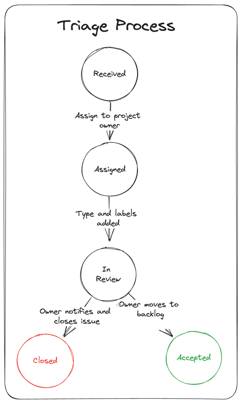
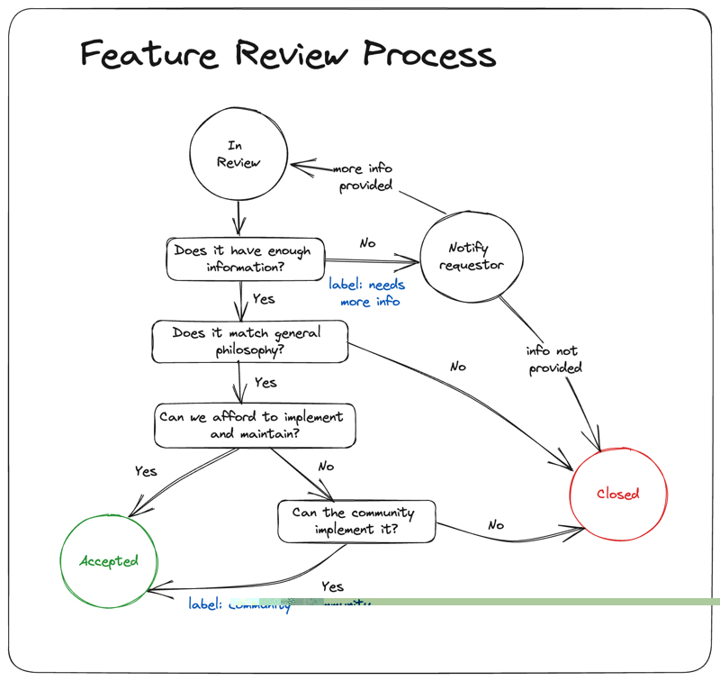

# Triage Process

The interaction between users and maintainers is at the heart of open source software. That interaction plays out through issue tracking. These issues offer a lot of value to the project but not every issues is actionable or useful. That's where triage comes in. Triaging is a multi-step process that is performed by the issue tracker and the sub-project/feature owners. The goal of triaging is to provide a clear understanding of what will happen to issues that are opened. For example, after a feature request is triaged, it will be clear whether the issue will be picked up or closed. After an issue is received and triaged, it will either be assigned to the backlog, a specific milestone or closed.

## Goals

The goals for triage are:

* Make triaging decisions easier by defining rules and processes
* Easily prioritize work for each milestone
* Set expectations with the community regarding how issues are handled

## Radius Team Responsibilities

The Radius triage team is responsible for keeping the issue repository up to date with only actionable items.
This involves:

* Labeling and adding tags to issues
* Responding to and following up on new issues or comments
* Verifying bug reports by attempting to reproduce them
* Requesting more information when issues do not have enough detail
* Improving the issue description for clarity
* Closing stale, resolved and invalid issues
* Bringing attention to common problems

During a triage session, all issues older than 6 months will be reviewed and closed if they are stale or no longer relevant. We will review existing labels and update them where appropriate. Once this initial review is completed, we will review all issues that are not assigned to a feature team and/or in the backlog. These include all new issues, ongoing attempts to reproduce a bug and all issues requesting more information. Each new issue will be categorized and tagged. If the issue has the level of detail required to make a triage decision, we will either deny and close or approve and assign to the appropriate feature team and move it to the backlog. If more information is needed, we will tag it with `needs more info` and keep it in the triage queue. If a bug cannot be reproduced, we will either close it with an explanation of the steps attempted to reproduce or tag it with `needs more info` to get more detail on repro steps and kept in the triage queue. If a bug can be reproduced but we decide the fix is too risky, we will update the description to include details that impacted the decision and the issue will be closed.

## User Responsibility

As an issue creator, you are responsible for creating an issue using the appropriate template and completing all sections with appropriate level of detail. For bug reports, clear steps to reproduce the issue must be included so we can verify the product behavior. You should also respond to requests for more information within 7 days. If you do not respond within that timeline, the issue will be closed. You are free to reopen the issue when the additional information has been added and we will triage it again.

## Triaging Flow

Below is the basic flow that an issue goes through. At any step in the flow the issue may be closed.

## Closing Issues

Issues are closed for the following reasons:

| **Reason** | **Label**|
----------------|----------
| Issue is obsolete or fixed | |
| Needed information not received within 7 days| `needs more info` |
| It's a duplicate of another issue| `duplicate` |
| Behavior is as designed| `by-design` |
| Issue ia a question 1 | `question` |
| Issue is not related to the goals of the project so is unactionable | `off-topic` |
| Issue cannot be reproduced based on information given | `not-reproducible` |
| Feature request is out of scope | `out-of-scope` |

1 All questions will be redirected to our [Discord server](https://discord.gg/SRG3ePMKNy)

## Requesting Information

If an issue is missing information that we need to understand the issue, a `needs more info` label will be assigned. If the information is not received in 7 days the issue will be closed.

## Categorizing Issues

Each issue will be assigned a **type** label.

|**Type**| **Description**|
:-| :--------
| `needs more info` | issue is missing information so type label cannot be assigned |
| `bug` | the implementation of a feature is not correct |
| `feature-request` | request for a new feature |
| `under-discussion` | not decided whether issue is bug or feature |
| `tech-debt` | improve the implementation/architecture |
| `engineering` | issues related to engineering system or processes |

## Assigning Feature Areas

Each issue will be assigned to a specific **feature area** during the triage process.

## Assigning a Milestone

We plan and execute milestones in 2 week sprints which are incremented numerically. Any item not in the current sprint will be put in the **backlog** milestone. Sprint planning is completed on the first day of the sprint and pulls all items from the backlog. During backlog grooming we review new issues that have been put in the backlog by the triage process to determine when the issue can be worked on.

## Important Issues

We assign the `important` label to issues that:

* result in data loss
* break basic functionality
* are critical security/performance issues
* are UI issue that makes feature unusable

## Managing Feature Requests

Feature requests are used as a means of communication between the members of the community. Thus, in principle, they could be kept open no matter what will happen to the feature they describe. Unfortunately, this makes it hard to understand what has realistic chances to ever make it into the repository. Therefore, feature requests that cannot be addressed are closed with the `out-of-scope` label. If the feature request meets the goals of the project and could be implemented by the community, the `community` label is assigned.

If you are the author of a feature request you might not like that we close or don't plan to address your request. It might even feel like a slap in your face. We understand that. All of us have been there—in this project or others we have contributed to. So, be assured, we love all of your input. Don't take personal offense when we close it. If you feel your feature request deserves to stay open, improve your use case and ping us or gather more support within the community.

This is our decision making tree.

## Won't Fix Bugs

Bugs will be closed as `wont-fix` if there is a negative cost-benefit to the fix. For example, if the fix is so complex that despite all the tests there is a risk of regression for many users, fixing is not a reasonable choice. When the bug is closed as `wont-fix` there will be a clear explanation as to why the decision was made.
