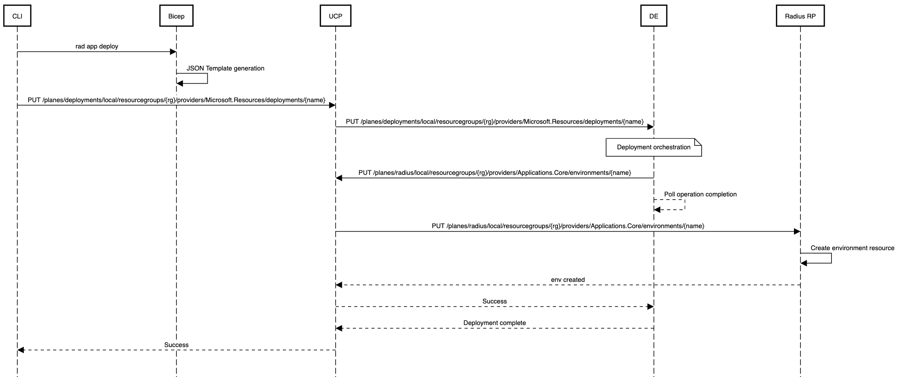
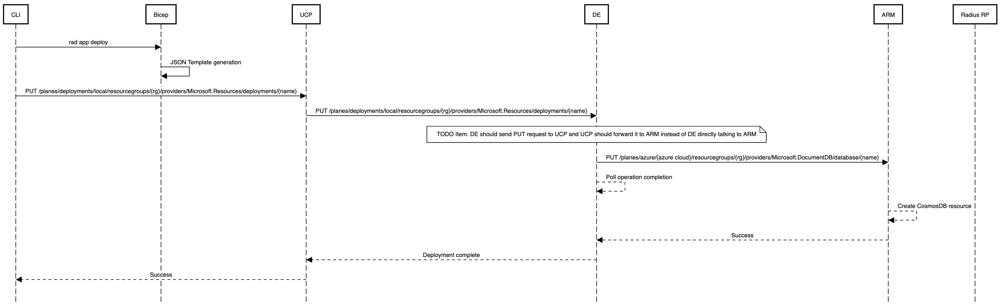
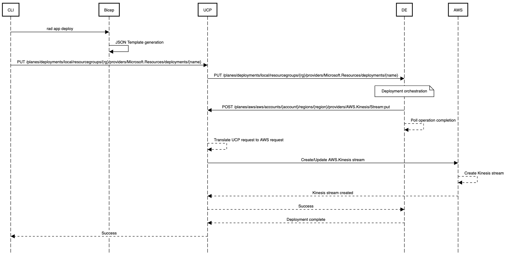

## Deploying Radius resource

* In this example, CLI issues a deploy command to deploy a Radius environment
* Bicep converts the bicep file into a JSON template
* CLI sends a PUT deployment request to UCP with the JSON template in the request body. Note that the request uses UCP addressing
* UCP checks the plane ID in the request and proxies the request to the Deployment Engine
* Deployment Engine reads the deployment template, orders the resources and orchestrates the deployment. It sends a series of PUT requests to deploy the different resources. In this example, we are deploying a Radius environment resource and it therefore sends a PUT resource request to UCP with the UCP resource ID of the environment in the request.
* Deployment Engine starts monitoring the completion of the PUT operation
* UCP again checks the plane ID in the incoming request and proxies the request to the Radius RP.
* Radius RP creates the environment resource and sends a success message to UCP
* UCP informs Deployment Engine about the successful completion of the PUT request
* Deployment engine, which is tracking the operation completion, marks the deployment as complete and returns success to UCP for the PUT deployment operation.
* UCP informs CLI that the deployment is complete

  

## Deploying Azure Resource

Note that in this call flow, Deployment Engine sends requests to Azure directly instead of forwarding them to UCP. In the future, we will fix this so that only UCP is used to route calls to different resource management systems.

* In this example, CLI issues a deploy command to deploy an Azure CosmosDB database.
* Bicep converts the bicep file into a JSON template
* CLI sends a PUT deployment request to UCP with the JSON template in the request body. Note that the request uses UCP addressing
* UCP checks the plane ID in the request and proxies the request to the Deployment Engine
* Deployment Engine reads the deployment template, orders the resources and orchestrates the deployment. It sends a series of PUT requests to deploy the different resources. In this example, we are deploying an Azure CosmosDB database. Deployment Engine is configured with Azure credentials and sends a PUT request to Azure.
* Deployment Engine starts monitoring the completion of the PUT operation
* Azure deploys the CosmosDB database and returns a PUT response
* Deployment engine, which is tracking the operation completion, marks the deployment as complete and returns success to UCP for the PUT deployment operation.
* UCP informs CLI that the deployment is complete

  

## Deploying AWS Resource

* In this example, CLI issues a deploy command to deploy an AWS Kinesis Stream resource
* Bicep converts the bicep file into a JSON template
* CLI sends a PUT deployment request to UCP with the JSON template in the request body. Note that the request uses UCP addressing
* UCP checks the plane ID in the request and proxies the request to the Deployment Engine
* Deployment Engine reads the deployment template, orders the resources and orchestrates the deployment. It sends a series of PUT requests to deploy the different resources. In this example, we are deploying an AWS Kinesis Stream resource and it therefore sends a POST request to UCP with the UCP resource ID of the AWS resource in the request. For details on the use of POST v/s PUT, please refer [Extension of ARM-RPC protocol in UCP](aws.md).
* Deployment Engine starts monitoring the completion of the PUT operation
* UCP again checks the plane ID in the incoming request and proxies the request to AWS. Unlike the Azure case, UCP cannot simply proxy the request but needs to perform some translations. For example, UCP needs to determine if the incoming operation is a Create or Update and accordingly translate the incoming request following ARM-RPC protocol to an AWS Cloud control request.
* AWS deploys the Kinesis stream and sends a success message to UCP
* UCP translates the AWS async response into ARM protocol of setting the Azure-Asyncoperation and Location headers.
* UCP informs Deployment Engine about the successful completion of the POST request
* Deployment engine, which is tracking the operation completion, marks the deployment as complete and returns success to UCP for the PUT deployment operation.
* UCP informs CLI that the deployment is complete