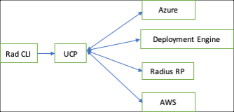

# UCP Overview

## What is UCP?

Universal Control Plane (UCP) is a control-plane system that can interface with many different kinds of cloud resource management systems (control-planes). UCP is based on ARM’s design principles and existing protocol. For control-planes that follow ARM’s conventions such as Azure and Radius, UCP can act as a pass-through by reverse-proxying requests. For non-ARM control-planes such as Kubernetes or AWS, UCP can act as an adapter that translates ARM-RPC request to the resource management system specific request.

In theory any type or instance of a control-plane can be mapped into UCP by creating a compatible adapter. UCP provides universal-addressing via a set of extensions to ARM’s resource ID concept.

  

## Why is UCP needed?

For application deployments to work end-to-end, requests need to be routed between various entities such as Deployment Engine, Radius RP, Azure, AWS and this could be a growing list. We need a common entity for the clients (such as CLI) to talk to and to be able to route requests between components without creating a full mesh.

Universal Control Plane aka UCP provides this mechanism where the different components and the clients are configured to talk to UCP. The clients/components send all inter-component requests to UCP, without having to know about other components. UCP then acts as a reverse proxy/adapter to route the request to the correct entity.

  

## Where does UCP fit into the Radius solution?
  

  

UCP proxies/adapts requests from these different components to the appropriate entity that will ultimately process the request.

For developers using Radius, UCP is an implementation detail of the system that they will not be aware of it. From their point of view, they are interacting with Radius through the application model (Bicep) and rad CLI. 
