# Topic: GitHub App Graph Visualization Feature Spec

* **Author**: Will Tsai (@willtsai)

## Topic Summary

This feature brings Radius Application Graph visualization directly into the GitHub developer workflow. When a developer opens a pull request that modifies the source code and/or app definitions of a Radius application, a visualization of the application graph is rendered directly in the PR with a before/after diff visualization highlighting which resources and connections were added, removed, or changed. On every merge to `main`, the updated app graph is rendered in the repository README, ensuring the architecture diagram in the repo root is always up to date and serves as a living architecture reference. Finally, dedicated pages for the application graph visualization are available for deeper exploration of the application topology and navigation to relevant code and infrastructure.

## User profile and challenges

### User persona(s)

- **Primary: Application Developer** — A developer who defines and modifies Radius applications. They work in a team, submit pull requests for code review, and want to understand how their application code and infrastructure changes affect the overall application topology.
- **Secondary: Platform Engineer / PR Reviewer** — An engineer who reviews pull requests and needs to quickly assess the scope and impact of application changes.
- **Tertiary: Team Lead / New Team Member** — Someone who looks at the repository README to understand the current application architecture at a glance.

### Challenge(s) faced by the user

1. **Reviews for code and infrastructure changes lack high level visual views**: When a developer modifies the application code or definitions, reviewers see raw code diffs but have no visual representation of how the application topology changed. Reviewers don't get a snapshot view of the overall application graph with the changes highlighted to quickly understand the blast radius of the changes.
1. **Stale architecture diagrams**: Teams often maintain architecture diagrams manually (e.g., in draw.io, Lucidchart, or static images). These diagrams drift out of date as the codebase evolves, leading to confusion and onboarding friction.
1. **Context switching**: To see the application graph today, a developer must deploy the application to a cluster and run `rad app graph` from the CLI. This requires a running environment, which is not always available during code review.
1. **No centralized, interactive visualization**: There is no single source of truth for the application architecture that is easily accessible and interactive for developers and reviewers. Existing diagrams are often static and disconnected from the code. Visual views of the infrastructure topology for the application are nonexistent.

### Positive user outcome

Developers and reviewers can see a clear, auto-generated visual diff of the application graph directly in the GitHub pull request, enabling faster and more confident code reviews. The repository README always contains an accurate, up-to-date architecture diagram, reducing onboarding time and eliminating stale documentation. Views of the modeled, planned, and deployed application graph are easily accessible for developers to explore the application topology and navigate to relevant code and infrastructure resources.

## Key scenarios

### Scenario 1: PR diff visualization with change highlighting

A developer modifies the app code and definition to add a new Redis cache and connect it to an existing container. When they open a pull request, the changes are visualized directly in the PR as an application graph with added resources/connections highlighted in green, removed ones in red, and unchanged ones in their default style.

### Scenario 2: README architecture diagram auto-update on merge

When a pull request that modifies the app code and/or definition is merged to `main`, the application graph diagram in the README is automatically regenerated to reflect the latest architecture. The README always shows the current state of the application, eliminating stale diagrams.

### Scenario 3: Dedicated pages for modeled, planned, and deployed app graph visualization

When a user clicks on the link to the application graph in the repository root, they are taken to a dedicated page that shows the modeled application graph based on the app definition file. From this page, they can also point the app graph to an available Environment to see a view of the planned application graph that depicts the expected (but not yet deployed) infrastructure based on the Environment configurations (e.g. settings, Recipes, etc.). Finally, once the user has successfully deployed the application, they can view the deployed application graph(s) that reflect the actual state of the deployed infrastructure. Each graph visualization is interactive and allows navigation to relevant code and infrastructure resources where applicable.

## Current state

Radius has an existing Application Graph feature that operates at runtime:

- **CLI**: `rad app graph` command (`pkg/cli/cmd/app/graph/`) renders a text-based application graph showing resources, connections, and output resources.
- **API**: The `getGraph` action on `Applications.Core/applications` returns an `ApplicationGraphResponse` containing resources, connections (inbound/outbound), and output resources. Defined in `typespec/Applications.Core/applications.tsp`.
- **Backend**: Graph computation in `pkg/corerp/frontend/controller/applications/graph_util.go` uses breadth-first traversal over live API data to build a bidirectional adjacency map of application resources and their connections.
- **Dashboard**: The Radius Dashboard (separate repository) provides an interactive, zoomable graph visualization.
- **Bicep tooling**: The `bicep-tools/` directory contains a Bicep manifest parser and converter that may serve as a foundation for static Bicep analysis.

There is currently no static analysis capability for generating the application graph from Bicep source files, and no GitHub integration for graph visualization in PRs or README auto-update. There are also no dedicated pages in GitHub for exploring the modeled, planned, and deployed application graph visualizations.

## Detailed user experience

### GitHub pull request workflow

#### Code changes and PR creation (for reference only, out of scope for this feature spec)

> Note that the features in this section are to illustrate the user experience for code changes and pull request creation so that the full user story is clear. We use a Copilot-assisted scenario that will leverage some Radius AI Agent tooling (Skill, MCP Server, Platform Constitution) that are outside of the scope of this feature spec. **The scope of work for this feature spec will begin from the point where the pull request has already been created and focuses on the experience of the app graph visualization in the PR and GitHub UIs.**

The user navigates to Copilot chat, points the context to their application repo, and prompts Copilot to make changes to their application. Leveraging the Radius app assembly tools (Skill, MCP Server, Platform Constitution), Copilot plans to implement the app code to use Radius features like Connections and also knows to update the app definition. It proposes a plan for the changes and asks user to confirm the implementation:

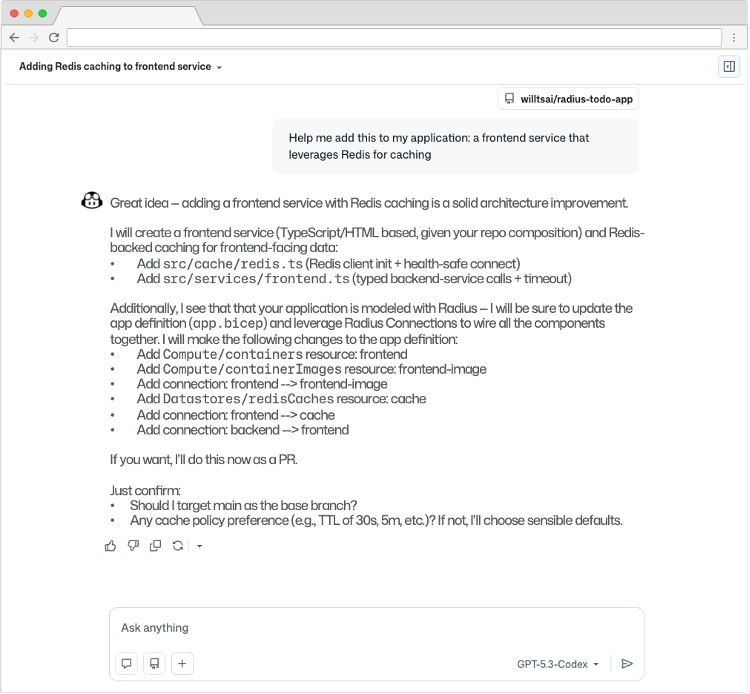

The user accepts the proposed plan and changes from Copilot and prompts it to proceed:

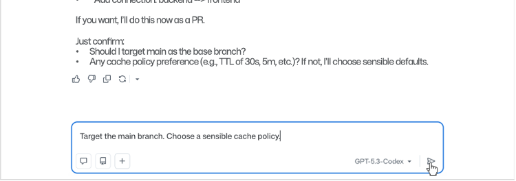

Copilot proceeds to make the code changes and creates a PR in the app repo:

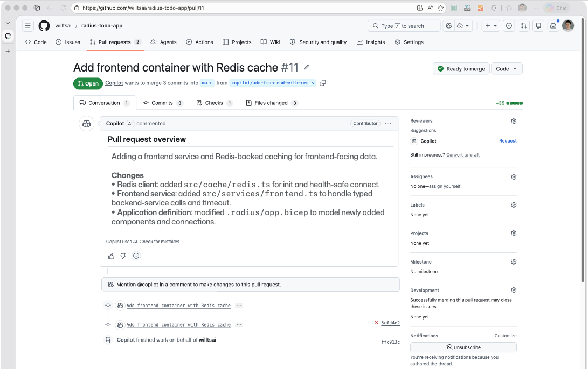

#### Radius auto-generates app graph visualizations

In the PR view, the Radius UI component (e.g. browser extension) detects that the PR includes updates to the app.bicep file and begins to auto generate an app graph for visualization:
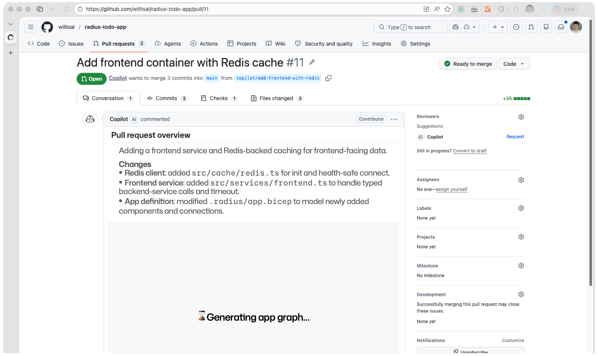

Radius renders the app graph visualization that shows the diff of added (green), modified (yellow), and removed (red) components. The visualization is inserted into the body of the PR description directly below the PR description text:
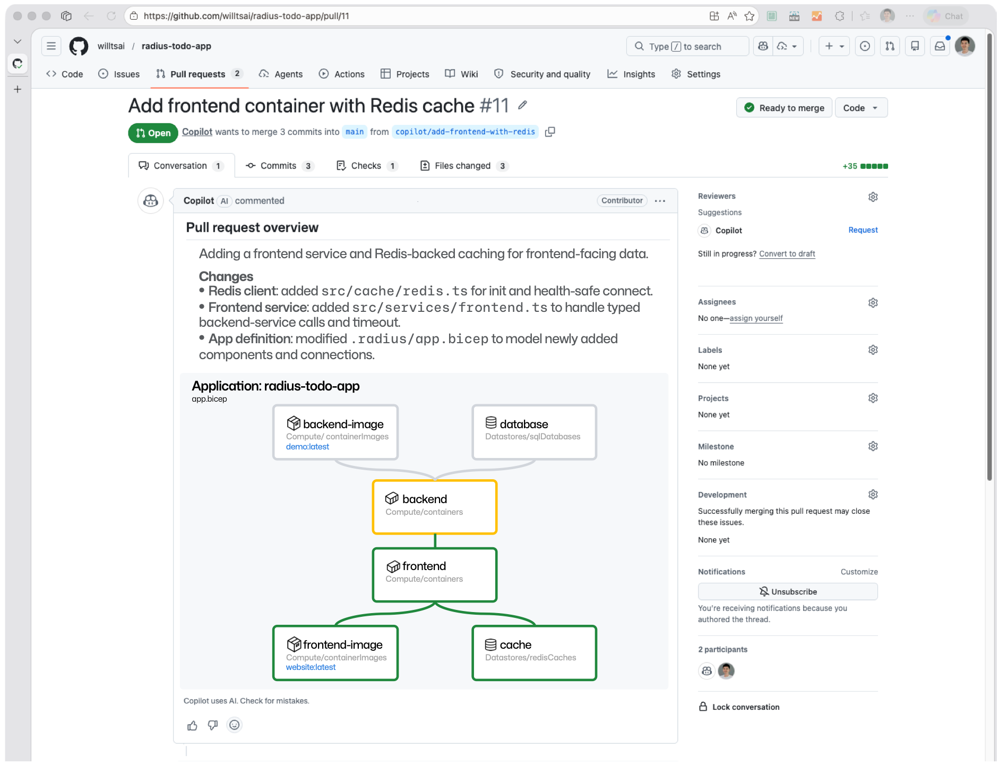

#### Interactions with diff views and app graph visualizations

The app graph visualization is an interactive UI component that the user may click to navigate to relevant parts of the repo for each component. Since this is the abstract app graph as-modeled (i.e. not yet deployed), clicking into each component (e.g. “cache”) gives the user options to navigate to relevant parts of either (1) the app source code or (2) the app definition file:

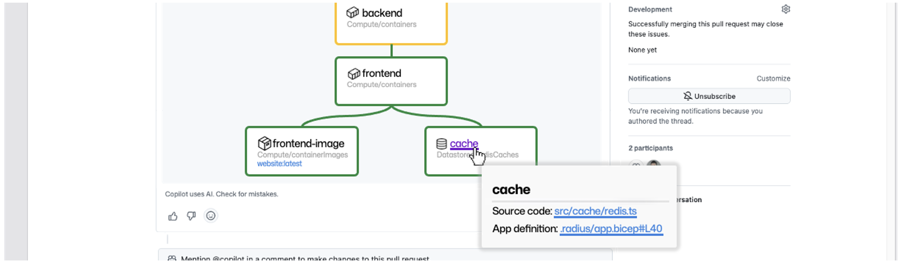

**NOTE:** The pointer to the source code file for each resource will be provided by the author (either human or AI) of the app definition in the `app.bicep` file. This means that a new optional property called `codeReference` (or equivalent) will need to be added to each resource schema. If the `codeReference` property is not provided by the author, the app graph visualization will still render but without the option to navigate to the source code for that component.

The `codeReference` property is a string with the following format requirements:

- It **must** be a repository-root-relative file path using forward slashes (`/`), for example `src/cache/redis.ts`.
- It **may** include a GitHub-style single-line anchor appended as a fragment in the form `#L<number>`, for example `src/cache/redis.ts#L10`.
- It **must not** include a URL scheme or host (for example `https://...`), query string parameters (for example `?plain=1`), or an absolute path.
- It **must** point to a file, not a directory.
- It **must not** contain path traversal segments such as `.` or `..`.
- Consumers should treat values that do not match this format as invalid and omit the source-code navigation link rather than attempting to interpret them heuristically.

For example:

```bicep
resource redisCache 'Applications.Datastores/redisCaches@2023-10-01-preview' = {
  name: 'redisCache'
  properties: {
    application: radiustodoapp.id
    environment: environment
    // New property indicating source code location for this resource.
    // Format: repo-relative file path with optional '#L<number>' line anchor.
    codeReference: 'src/cache/redis.ts#L10'
  }
}
```

**NOTE:** The pointer to the line number in the app definition file for each resource is tracked by Radius itself based on the compilation of the `app.bicep` file into the serialized application graph. This means that the app graph visualization can provide a link to the relevant line number in the `app.bicep` file for each component without requiring the author to provide this information.

When the user clicks on the source code hyperlink for a _modified_ component (e.g. “cache”), they are taken to the diff view in the PR for the _modified_ source code:

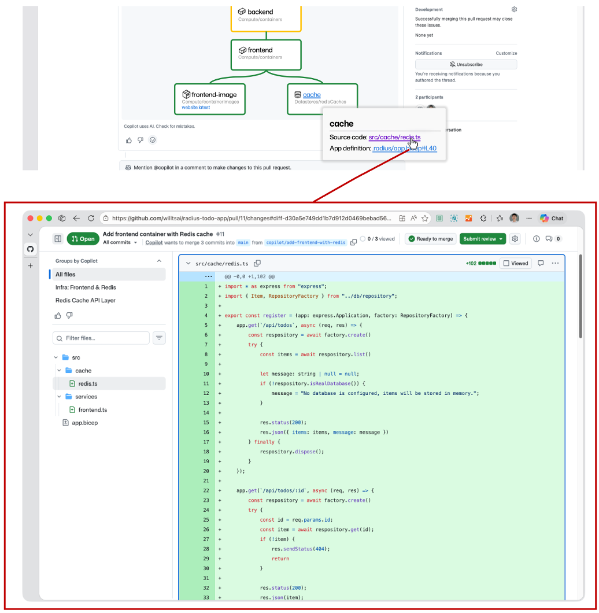

When the user clicks on the app definition hyperlink for a _modified_ component (e.g. “cache”), they are taken to the diff view in the PR for the relevant line of the _modified_ app definition (e.g. line #71):

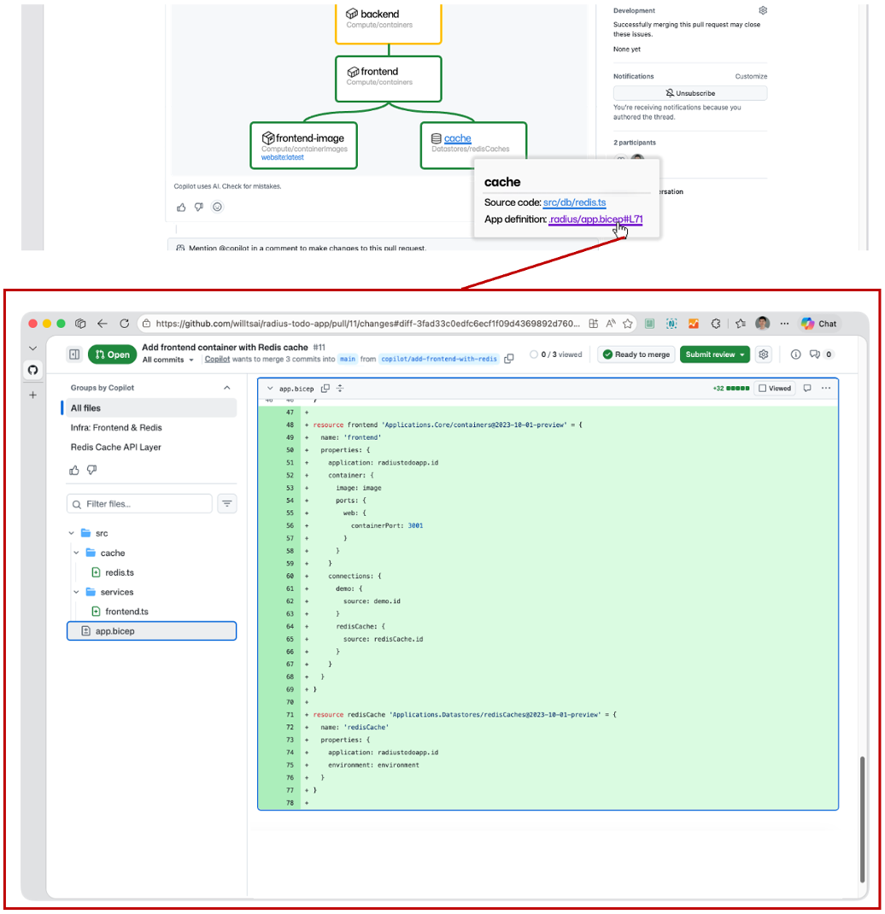

Clicking into an _unchanged_ component (e.g. “database”) also gives the user options to navigate to relevant parts of either (1) the app source code or (2) the app definition file:

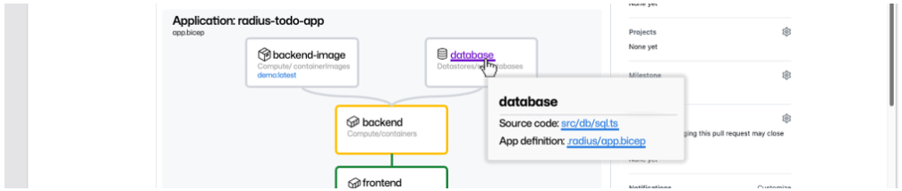

When the user clicks on the source code hyperlink for an _unchanged_ component (e.g. “database”), they are taken to the GitHub page for the relevant source code:

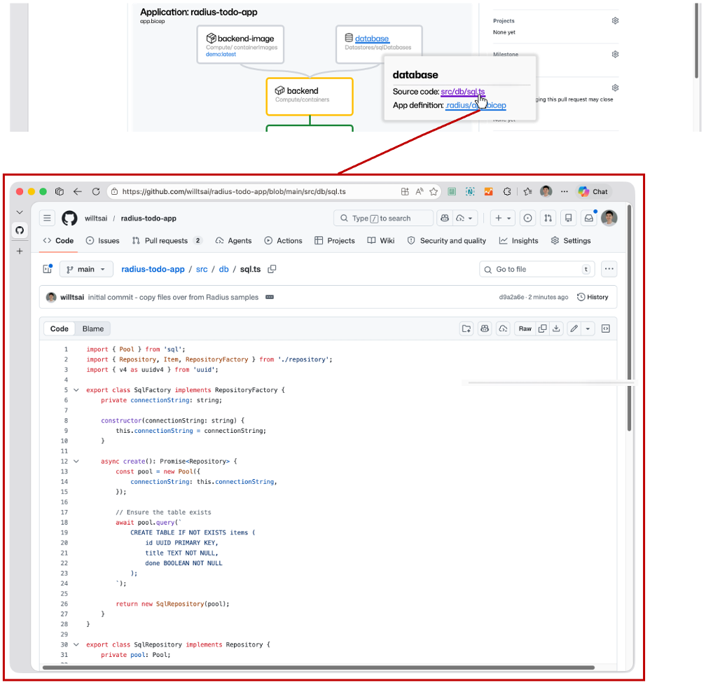

#### Merge the PR into `main` branch

The user navigates to the the repo root UI on the `main` branch and notices that the diagram in the "Application graph" tab previously generated by Radius does not yet reflect the changes from their not-yet-merged PR:

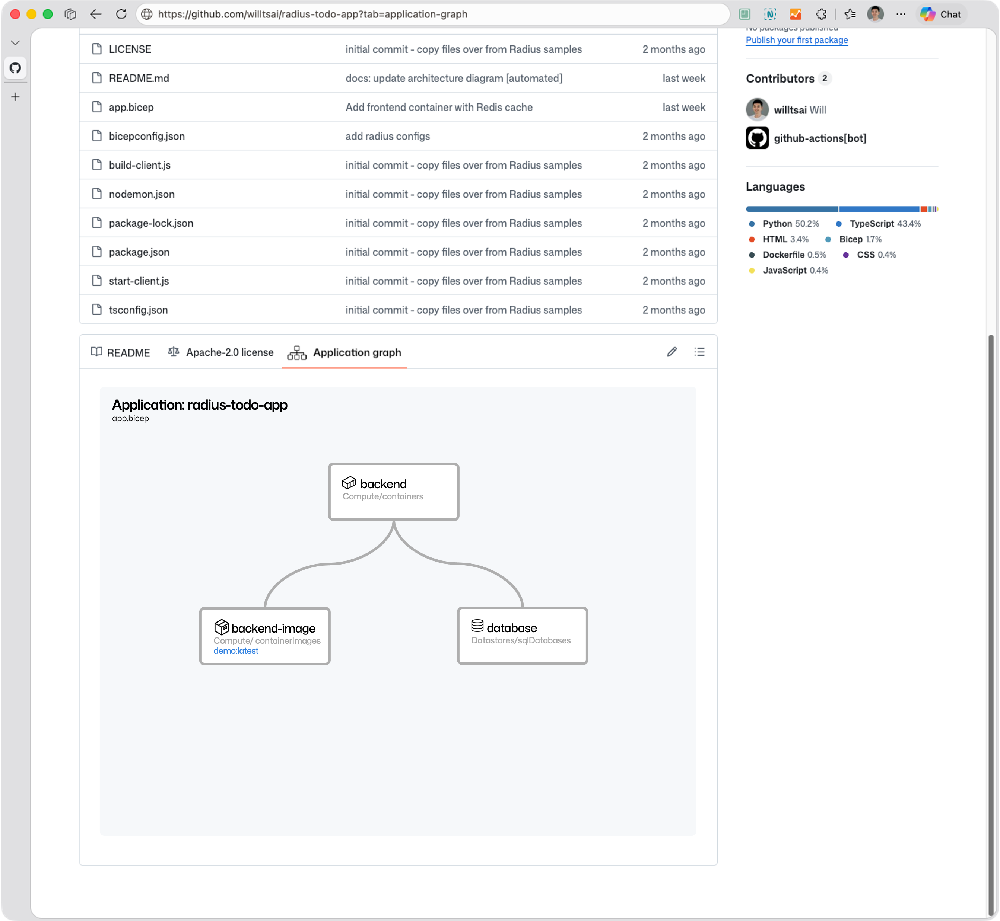

> Note that the "Application graph" tab and diagram are generated and rendered on the client side and are only visible to users with the Radius UI component installed (e.g. browser extension).

The user navigates back to their PR and clicks on “Merge pull request” and “Confirm merge” in the PR to merge in the code changes:

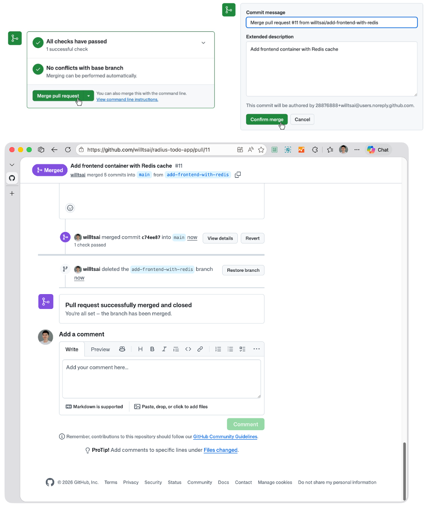

#### Radius-generated app graph diagram is updated in the "Application graph" tab

The merge into the `main` branch triggers the Radius UI component to generate an updated app graph diagram under the “Application graph” tab in the repository root UI to reflect the recently merged application code changes. Note that the app graph visualization no longer includes the red, yellow, green coloring from the PR view:

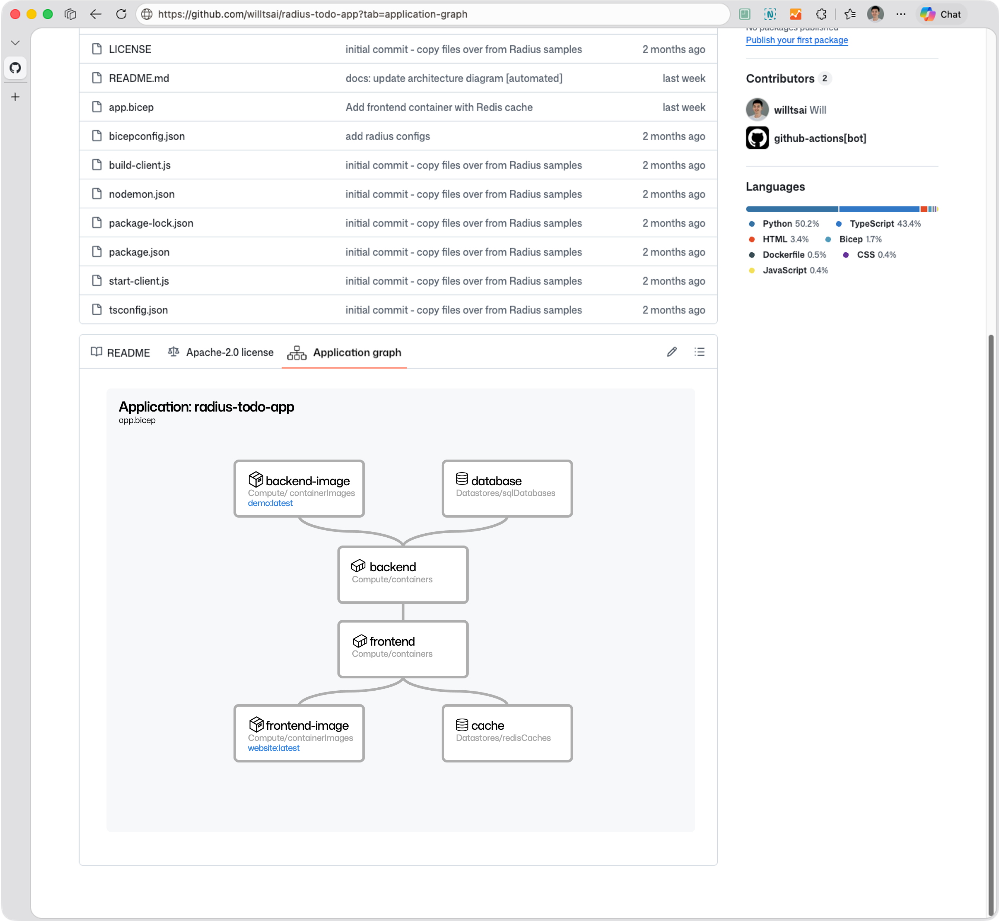

Just like in the PR views, the app graph visualization is an interactive UI component that the user may click to navigate into the relevant parts of the code in the repo on GitHub:

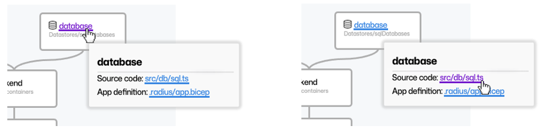

### Dedicated pages for application graph visualization

#### _Modeled_ app graph (P0)

Once an application definition is added to the repository (e.g. `.radius/app.bicep`), a link to the application is rendered in the repository root page in GitHub. The user clicks on the link:

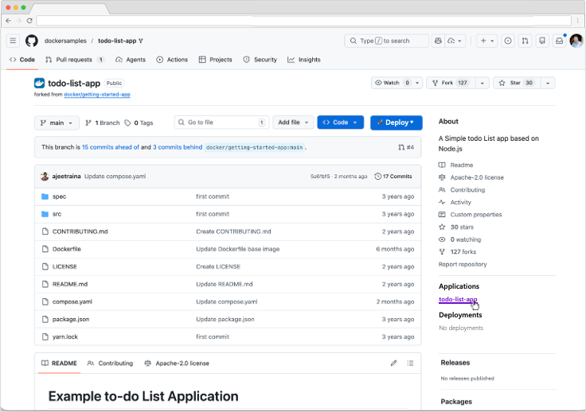

This takes the user to a dedicated page for the application that includes an app graph visualization of the application as-modeled based on the app definition file. It shows the abstract representation of the application's components and their relationships but not the actual resources following deployment:

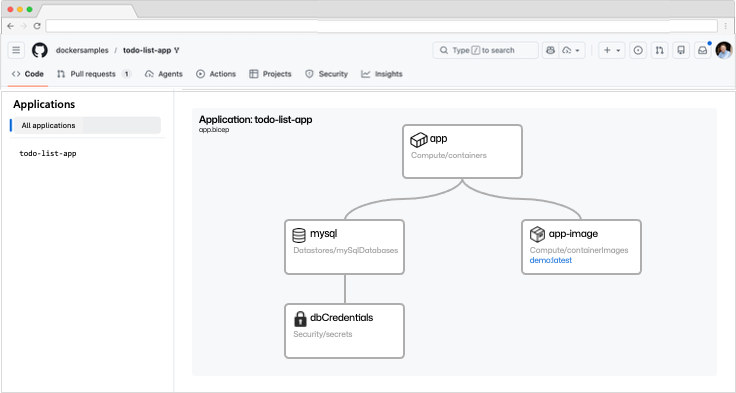

The user can interact with the app graph visualization to navigate to relevant parts of the code in the repo:

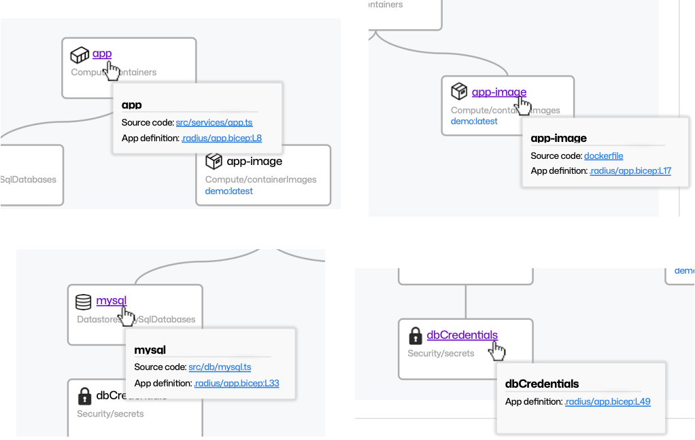

#### _Deployed_ app graph (P1)

After the user begins a deployment, a link is available in the repository root page in GitHub that the user may click to view the deployed application graph:

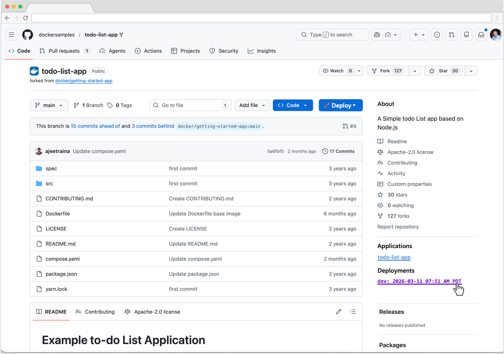

This takes the user to a dedicated page for the deployments of the application that includes an app graph visualization of the application as-deployed based on the live state of the deployed infrastructure resources. The modeled application resources are depicted in blue. Actual infrastructure resources for each modeled resource are depicted in grey (queued for deployment) and yellow (deployment in progress):

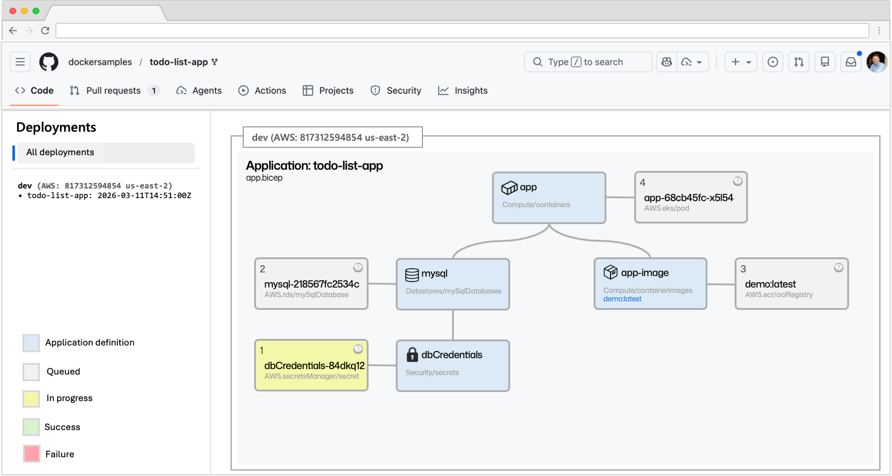

Successfully deployed resources are depicted in green, while failed resources are depicted in red:

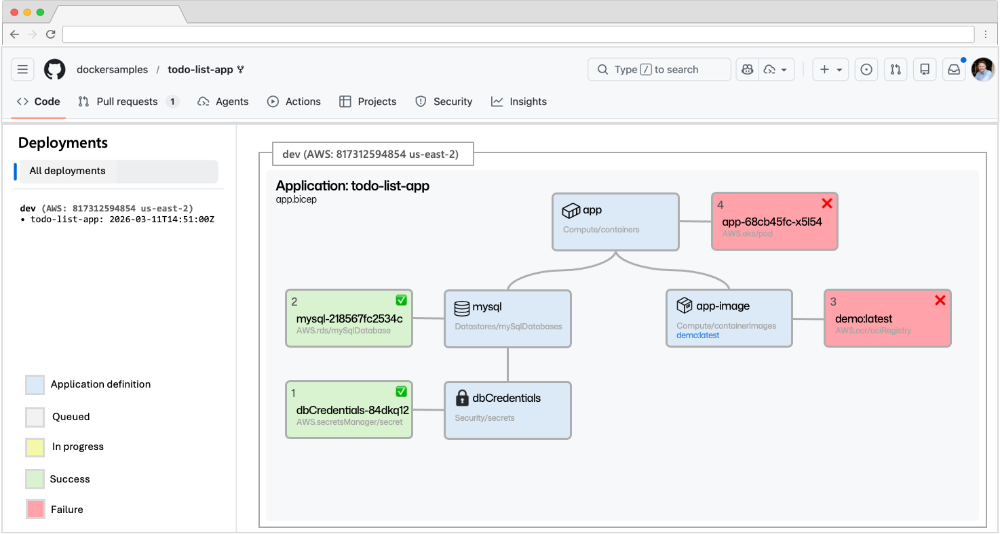

> The status of each resource (e.g. queued, in progress, successful, failed) is determined by Radius based on the live state of the deployment (perhaps emitted by the runners executing the Radius deployments) and not by polling the cloud provider APIs.

When the user clicks on a successfully deployed resource (e.g. the `mysql-218567fc2534c` instance of AWS RDS MySQL), they are taken to the relevant page in the cloud provider portal (e.g. AWS Console) for that resource:

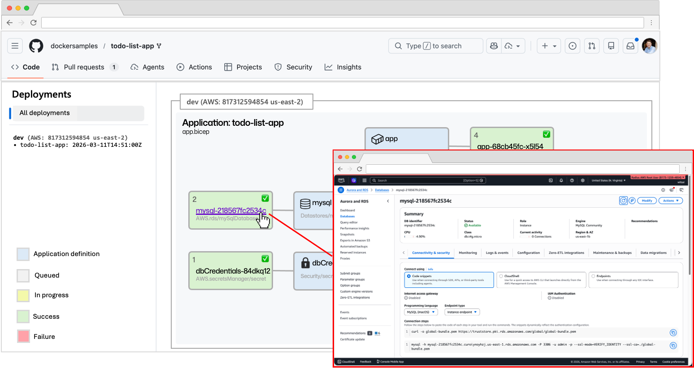

When the user clicks on a failed resource (e.g. the `demo:latest` container image in ECR), the Radius deployment error message for that resource is rendered in a pop-up modal to provide more context on the failure:

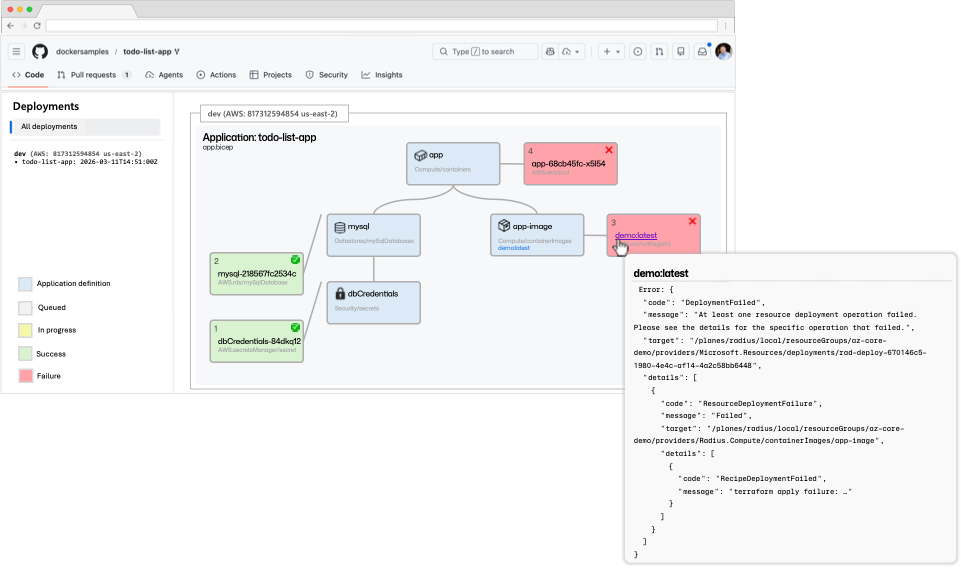

#### _Planned_ app graph (P2)

TBD
