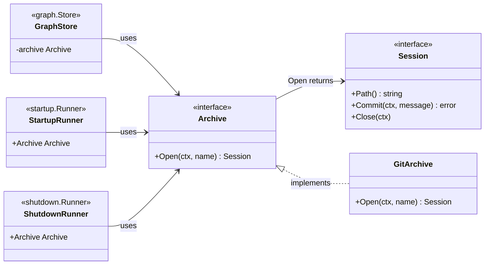
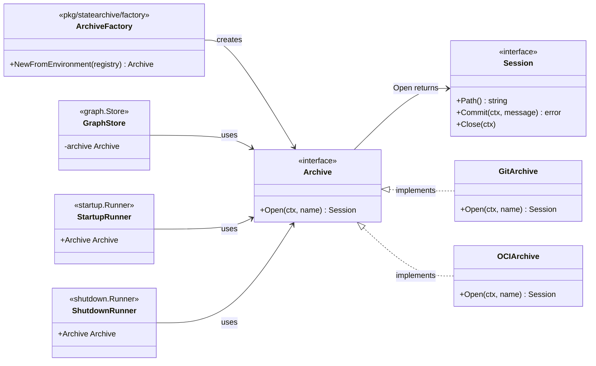
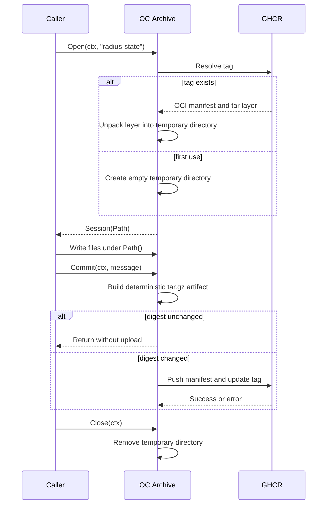

# OCI / GHCR backend for the state archive

- **Author**: Brooke Hamilton (@brooke-hamilton)
- **Related design note**: [Repo Radius — State Storage](../2026-06-repo-radius-state-storage.md)
- **Builds on**: [PR #12333](https://github.com/radius-project/radius/pull/12333)

## Overview

Radius saves control-plane database dumps, Terraform state, and modeled application graphs outside an ephemeral cluster. Today those files go to git orphan branches. This design adds an OCI backend that stores the same files in GitHub Container Registry (GHCR).

The existing `statearchive.Archive` interface already lets the state commands and graph store use different storage implementations. This change adds an OCI implementation and configuration that chooses it. The local `rad app graph` path is unchanged: outside GitHub Actions it still writes `./app-graph.json` in the current directory.

## Objectives

### Goals

- Add an OCI/GHCR implementation of `statearchive.Archive`.
- Let `rad startup`, `rad shutdown`, and the GitHub Actions graph path select OCI without changing how they save files.
- Keep git as the default until OCI is explicitly configured.

### Non goals

- Encrypting archive contents before upload.
- Removing the git backend.
- Providing a lock that coordinates separate processes or workflow runs.
- Changing local modeled-graph output.

## Design

### Current and proposed structure

The old picture was a top-down flowchart used as a component diagram. It was hard to read because it mixed Go type relationships with backend selection. These class diagrams show the Go types first; configuration is described separately below.

#### Current structure

There is one implementation: `GitArchive`. `graph.Store`, `startup.Runner`, and `shutdown.Runner` use the `Archive` interface, but each defaults to `GitArchive`.



#### Proposed structure

The `Archive` and `Session` interfaces do not change. `OCIArchive` is added beside `GitArchive`. A small factory chooses which implementation to give each caller.



The existing interface stays unchanged:

```go
type Archive interface {
    Open(ctx context.Context, name string) (Session, error)
}

type Session interface {
    Path() string
    Commit(ctx context.Context, message string) error
    Close(ctx context.Context)
}
```

`Path()` is a local temporary directory. `Open` makes the last committed files available there. Callers write ordinary files into that directory and call `Commit` to save them.

### OCI archive

Add `pkg/statearchive/oci`. `OCIArchive` and its session type implement the existing interfaces.

- State and graphs use separate OCI repositories because they have separate save and restore lifecycles. State can contain secrets and needs stricter access and retention rules.
- Each repository uses the archive name as its tag: `radius-state` for the state repository and `radius-graph` for the graph repository.
- Each committed archive is one OCI manifest with one gzipped tar layer containing the complete session directory.
- An OCI digest is a fingerprint of the exact uploaded bytes. A normal tar.gz can include the current time, file timestamps, and an arbitrary file order, so identical files could get a different fingerprint on every save. The OCI backend uses a fixed file order and fixed metadata so unchanged files get the same fingerprint and do not upload again.
- The backend streams the tar.gz layer through a temporary file-backed ORAS store. Memory use stays bounded as database dumps grow, and the temporary artifact is removed after the commit attempt.
- `Commit` ignores its `message` argument. Git uses that message for its commit history; OCI has no equivalent that can be stored without changing an otherwise identical artifact.



`Open` treats a missing tag as a new, empty archive. Any other pull or authentication failure is returned as an error. `Commit` returns an error if the upload fails; callers must not continue as though state was saved.

### Configuration and wiring

Add `pkg/statearchive/factory`. It selects the git or OCI archive from the environment.

```go
// NewFromEnvironment returns git by default. RADIUS_STATE_BACKEND=git wins.
// Otherwise, it returns OCI when RADIUS_STATE_BACKEND=oci or registry is set.
func NewFromEnvironment(registry string) statearchive.Archive
```

Configuration errors are returned by `Open`. This keeps the existing `NewRunner` signatures unchanged and preserves test injection through `Runner.Archive`.

| Variable                    | Purpose                                                                                                   |
|-----------------------------|-----------------------------------------------------------------------------------------------------------|
| `RADIUS_STATE_BACKEND`      | Optional `git` or `oci` override for both archive types.                                                  |
| `RADIUS_STATE_REGISTRY`     | OCI repository for `rad startup` and `rad shutdown`, for example `ghcr.io/<owner>/<repo>-state`.          |
| `RADIUS_GRAPH_REGISTRY`     | OCI repository for modeled graphs created in GitHub Actions, for example `ghcr.io/<owner>/<repo>-graphs`. |
| `RADIUS_ARCHIVE_PLAIN_HTTP` | `true` only for a local HTTP test registry.                                                               |

GitHub Actions automatically sets `GITHUB_REPOSITORY` to the source repository name, such as `radius-project/radius`. Radius does not use that value to guess an OCI repository. If it did, every existing GitHub Actions run would switch from the current git-orphan-branch behavior to OCI without an intentional workflow change or the required GHCR permissions and login.

OCI is selected when the relevant `RADIUS_*_REGISTRY` variable is set, or when `RADIUS_STATE_BACKEND=oci` is explicitly set. When OCI is selected, the matching registry variable is required: `rad startup` and `rad shutdown` require `RADIUS_STATE_REGISTRY`; GitHub Actions graph output requires `RADIUS_GRAPH_REGISTRY`. If it is missing, `Archive.Open` returns a configuration error that names the required variable. Radius must not fall back to git after OCI was explicitly selected.

`cmd/rad/cmd/root.go` calls the factory with `RADIUS_GRAPH_REGISTRY` and passes its result in `git.Options{Archive: archive}` when it creates the graph store. `startup.NewRunner` and `shutdown.NewRunner` call the same factory with `RADIUS_STATE_REGISTRY` for their default `Runner.Archive`. Existing tests already replace those archive fields with mocks.

For example, `rad shutdown` saves to `ghcr.io/my-org/radius-state:radius-state`; GitHub Actions graph generation saves to `ghcr.io/my-org/radius-graphs:radius-graph`. They do not overwrite each other.

The state commands and graph output must also use storage-neutral language:

- Rename `persistToOrphanBranch` to `persistToArchive` and replace graph messages that say "branch" with "archive".
- Update the `rad startup` and `rad shutdown` help text to say "state archive", not "git orphan branch".
- Add `StateArchiveName` and `RADIUS_STATE_ARCHIVE`. It checks `RADIUS_STATE_ARCHIVE`, then the deprecated `RADIUS_STATE_BRANCH`, then uses `radius-state`. Keep `StateBranchName` as a deprecated wrapper so current git users and tests continue to work.
- Add `ArchiveName` to graph-store options. Keep `Branch` as a deprecated alias for compatibility. If both are set differently, `NewStore` returns an error. Otherwise both map to the archive name, which is a git branch for `GitArchive` and an OCI tag for `OCIArchive`.

### Authentication and concurrency

Reuse the ORAS setup in `pkg/cli/cmd/bicep/publish/publish.go`: `credentials.NewStoreFromDocker` and an ORAS `auth.Client`. Workflows that use OCI must run `docker/login-action` before Radius runs. The existing build and functional-test workflows already show that pattern.

The OCI session uses an in-process lock per archive name, just as `GitArchive` uses one lock per branch. Before upload, it checks whether the tag changed after `Open` and returns an error if it did. This is only a best-effort safety check: another writer can still update the tag after that check. A true cross-process lock is future work.

### Error handling

- A missing tag starts a new empty archive. OCI registries use the same `404` response for a missing tag and, in some cases, a missing repository, so this behavior matches the current git backend's first-run behavior.
- A pull error for an existing tag stops `Open`; it must not restore from an empty directory.
- An upload error stops `Commit`; it must not report a successful backup.
- Emptying an existing archive (for example deleting its last file) is persisted as an empty archive, matching the git backend's empty-tree commit. `Commit` only short-circuits without an upload when the directory is empty *and* no archive exists yet, so deletions are never silently dropped.
- Registry `401` and `403` errors get the same clear login and permission guidance used by Bicep publishing.

## Test plan

- **Unit:** Test `OCIArchive` with ORAS's local OCI content store in `t.TempDir()`. It needs no network, container, Docker daemon, or credentials, so it runs as a normal `make test` unit test. Verify that a first open is empty; files saved by `Commit` are present after the next `Open`; an unchanged session does not upload again; emptying an archive persists the deletion (an empty directory survives a reopen); committing a brand-new empty archive uploads nothing; and the temporary file-backed artifact is cleaned up. Use an injected fake registry target only to test that pull and upload failures return errors.
- **Unit:** Save and load a modeled graph through `graph.Store` using `OCIArchive` and the local OCI content store. This covers the graph caller without a registry container.
- **Unit:** Test backend selection: git remains the default; each configured OCI repository selects OCI; explicitly selecting OCI without its repository returns a configuration error. Update the existing graph and state-command tests for the new archive-neutral names and messages.
- **Functional:** Extend `test/functional-portable/statestore/noncloud`, the dedicated state lifecycle test. It starts a local `registry:2` container, then runs `rad shutdown` and `rad startup` with OCI selected, `RADIUS_STATE_REGISTRY=localhost:<port>/radius-state`, and `RADIUS_ARCHIVE_PLAIN_HTTP=true`. The existing uninstall, reinstall, restore, and Terraform update flow proves that state was saved to and restored from the OCI registry. Cleanup removes the registry container.

## Security

The archive can contain secrets from database rows and Terraform state. A private GHCR repository can have access rules separate from source-repository read access, which is an improvement over a git branch. The OCI repository must remain private until client-side encryption is added.

## Alternatives considered

- **Git only:** keep the current implementation. Simple, but keeps state in repository history and gives repository readers access to it.
- **One OCI layer per file:** improves deduplication but adds complexity for small archives. One tar layer is simpler.
- **Encryption now:** valuable but separate from OCI storage. Defer it to keep this change small.
