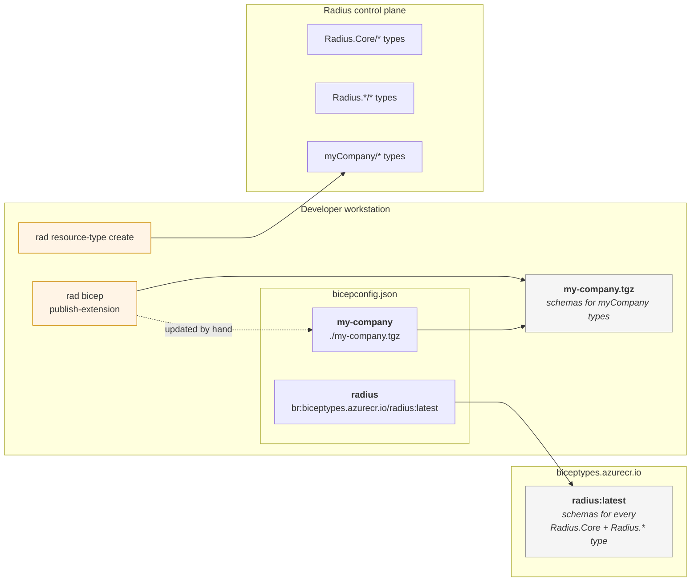
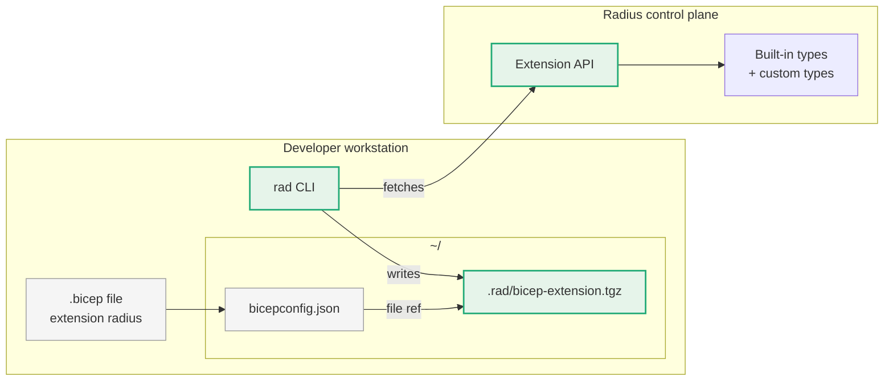

# Feature Spec: Dynamic Bicep Extensions Served by the Radius Control Plane

* **Author**: zachcasper

## Topic Summary

Radius developers describe applications in Bicep. To make a resource type usable from Bicep, the Bicep compiler needs a *Bicep extension* — a gzipped tar containing the schemas of those types, supplied either as a local `.tgz` file or as an OCI artifact in a registry — referenced by alias in `bicepconfig.json`. Today, two parallel pipelines keep extensions in existence: the Radius project rebuilds and publishes a fixed set of `radius*` extensions to `biceptypes.azurecr.io` on each release, and platform engineers manually run `rad bicep publish-extension` and edit every developer's `bicepconfig.json` whenever they add or change a user-defined resource type. The set of types the control plane has registered and the set of types Bicep can type-check against are kept in sync by hand.

This feature makes the Radius control plane the single source of truth for Bicep extensions. A new `rad resource-type sync` command (also invoked implicitly by `rad init`, `rad deploy`, and `rad run`) fetches the control plane's currently-registered types, packages them into a Bicep extension, and writes it to `~/.rad/bicep-extension.tgz`. `rad init` becomes kubecontext-aware: if no Radius control plane is detected in the current kubecontext, it installs Radius (today's behavior); if one is already installed, it skips the install step. In both cases it creates or merges `~/bicepconfig.json` with a single `radius` extension entry pointing at that file. Bicep's existing parent-directory resolution then picks the configuration up for any `.bicep` file under the home directory that does not have a closer `bicepconfig.json` of its own — no per-repository setup, no external OCI registry, and no separate publish step is required. Repositories that already ship their own `bicepconfig.json` are unaffected by the home-directory file (see edge cases below); the expected migration is for those repos to add the same `radius` entry or remove their local config.

### Top level goals

* Eliminate the manual `rad bicep publish-extension` + registry + `bicepconfig.json` distribution loop for user-defined resource types.
* Make the control plane the single source of truth for what types exist *and* what their schemas look like to Bicep.
* Reduce a developer's per-workstation setup for Radius Bicep authoring to one command (`rad init`).
* Remove the platform engineer's obligation to operate a Bicep types OCI registry, Ingress, DNS, or TLS for this feature.
* Make resource-type changes (add / modify / remove) visible to developers in one sync round-trip, not a multi-step release.

### Non-goals (out of scope)

* Automatic configuration for `.bicep` source files that live outside `$HOME`. Advanced users place a `bicepconfig.json` manually in such source trees.
* Versioned / snapshotted access to a specific historical type set on a control plane. The control plane returns the current type set; out-of-band snapshotting is not in scope for this feature.
* Replacing or modifying the upstream Bicep CLI or Bicep VS Code extension. This feature uses only Bicep's existing local-file extension references and existing parent-directory `bicepconfig.json` resolution.
* Removing the third-party `aws` Bicep extension (`br:biceptypes.azurecr.io/aws:latest`). It is not generated by Radius; `rad init`'s merge preserves any user-authored entries unrelated to the four `radius*` aliases.
* Non-Kubernetes Radius hosting.

## User profile and challenges

### User persona(s)

* **Application developer.** Writes Bicep files describing applications against the resource types their organization's Radius installation exposes. Wants their editor to type-check and complete every type the control plane has, with zero per-repository ceremony.
* **Platform engineer.** Operates a Radius installation for N developers, including registering user-defined resource types specific to the organization. Wants to register a type once and have every developer's editor see it, without operating a parallel publishing pipeline.

### Challenge(s) faced by the user

The set of types registered in the control plane and the set of types Bicep can validate against are coupled only by manual process:

* Each user-defined resource type the platform engineer registers requires a separate `rad bicep publish-extension` invocation, a push to an OCI registry (or distribution of a `.tgz`), a tag/version bump, an edit to every developer's `bicepconfig.json`, and a "please re-pull" message.
* Drift is the default state. Developers see spurious type errors against types that exist server-side, or compile cleanly against schemas that have already changed server-side and only fail at deployment.
* Per-installation customization requires per-installation infrastructure — an OCI registry the platform engineer operates and secures, or `.tgz` files staged on a shared drive.
* `bicepconfig.json` becomes a per-control-plane configuration that has to be version-controlled alongside, but separately from, the control plane it describes.

### Positive user outcome

* The developer runs `rad init` once per workstation and gets full Bicep type-checking and IntelliSense for every type their control plane currently exposes, in any `.bicep` file under `$HOME`, with no per-repository setup.
* The platform engineer registers a new resource type once with `rad resource-type create` and has nothing else to do — developers' next `rad deploy` (or explicit `rad resource-type sync`) closes the gap.
* The Radius project no longer maintains four separate release-time published extensions (`radius`, `radiusCompute`, `radiusData`, `radiusSecurity`); the control plane it ships is the single source of those schemas.

## Current state

The Bicep CLI consumes a *Bicep extension* — an OCI artifact (a gzipped tar containing `index.json` plus one or more `types.json` files) that tells the Bicep compiler the shape of each resource type. A developer enables a set of types in a `.bicep` source file by declaring `extension <alias>` and mapping that alias to a source in `bicepconfig.json`:

```json
{
  "extensions": {
    "radius": "br:biceptypes.azurecr.io/radius:latest",
    "radiusCompute": "br:biceptypes.azurecr.io/radiuscompute:latest",
    "radiusData": "br:biceptypes.azurecr.io/radiusdata:latest",
    "radiusSecurity": "br:biceptypes.azurecr.io/radiussecurity:latest"
  }
}
```

The Bicep CLI only resolves two kinds of sources: a local `.tgz` path, or an OCI registry reference (`br:<host>/<repo>:<tag>`). It has no native concept of "the Radius control plane".

There are two classes of types today, with very different lifecycles:

1. **Core Radius types** (e.g. `Radius.Core/environments`, `Radius.Core/applications`, `Applications.Core/containers`). Defined inside `radius-project/radius` as TypeSpec, converted to Bicep extension form by an in-tree generator, and published to `biceptypes.azurecr.io` on every release. Version-locked to the control plane.
2. **User-defined / contributed resource types** (e.g. anything from `radius-project/resource-types-contrib`, or platform-engineer-authored types). Registered into a specific control plane via `rad resource-type create`. To make those types usable from Bicep, the platform engineer must today author or obtain the manifest, run `rad bicep publish-extension` to produce an OCI artifact, push it to an OCI registry (or distribute a `.tgz`), tell every developer to add an entry to their `bicepconfig.json` pointing at that registry path and tag, then re-do the build/push/tag/notify cycle each time the type changes.

### Architecture today



The Bicep extensions on the developer's workstation and the resource-type registrations in the control plane describe the same things, but they live in separate stores and are kept in sync by hand. The `radius:latest` artifact in `biceptypes.azurecr.io` is rebuilt and pushed by the Radius project on each release and covers only the built-in `Radius.Core/*` and `Radius.*/*` types. The `my-company.tgz` artifact is rebuilt each time the platform engineer runs `rad bicep publish-extension` against a manifest for the `myCompany/*` types, and the alias in every developer's `bicepconfig.json` is updated by hand to point at the new file. `rad resource-type create` registers types into the control plane but does not touch either artifact. Any divergence between what the control plane has registered and what the extensions describe shows up as either spurious type errors in the editor or — worse — successful compilation against a stale schema that fails at `rad deploy` time.

## Details of user problem

> When I add a new resource type to my company's Radius installation, registering it in the control plane is one command. But to make my developers' Bicep editors actually see it, I have to build an extension artifact with `rad bicep publish-extension`, push it to an OCI registry I have to operate, decide on a tag and bump it, and then chase down every developer to update their `bicepconfig.json`. Whenever I change the schema of that type, I do all of it again. Most of the time my developers are looking at a stale schema in their editor, and the first sign of drift is a 4xx error at `rad deploy` time. My organization is on Radius because it's supposed to be the platform; instead it's the thing I'm operating a side-channel publishing pipeline for.

> As a developer, the type set I'm allowed to use is whatever my platform engineer told me to put in my `bicepconfig.json` — and I have no way to confirm it matches what the control plane will actually accept until I try to deploy. Onboarding to a new Radius installation is a docs-following exercise: install `rad`, then log into some company-specific OCI registry, then paste a snippet into `bicepconfig.json` for each of half a dozen aliases. When the platform team changes a type, nobody tells me, and my editor stops being a reliable source of truth.

## Desired user experience outcome

> As a developer, I run `rad init` once on my workstation and my Bicep editor immediately type-checks every resource type my Radius installation has — built-in and user-defined — in every `.bicep` file anywhere under my home directory. I never edit `bicepconfig.json` myself. I never log into a Bicep types registry. When my platform engineer registers a new type, my next `rad deploy` quietly picks it up, or I can run `rad resource-type sync` to refresh on demand. There is no per-repository setup; opening a new project is the same as opening an existing one.

> As a platform engineer, I register a new resource type with `rad resource-type create` and I am done. There is no `rad bicep publish-extension` step, no registry to push to, no tag to bump, no `bicepconfig.json` to distribute. I do not operate an OCI registry, Ingress, DNS record, or TLS certificate for Bicep types. I do not maintain four separately-released Radius Bicep extensions on `biceptypes.azurecr.io`.

After `rad init`, the developer's home directory looks like this:

```
~/
├── bicepconfig.json              ← created or merged by rad; references the artifact below
└── .rad/
    └── bicep-extension.tgz       ← the Bicep extension; rewritten by rad resource-type sync
```

`~/bicepconfig.json`:

```json
{
  "extensions": {
    "radius": ".rad/bicep-extension.tgz"
  }
}
```

### Architecture after this feature



Green nodes are the new path. The single file at `~/.rad/bicep-extension.tgz` replaces every ACR-published `radius*` extension and every custom-types `.tgz`. Pre-existing ACR artifacts remain readable for users on older `rad` versions, but no new artifacts are published and the `rad bicep publish-extension` command is removed.

### Detailed user experience

`rad init` is kubecontext-aware. Both personas run the same command; it inspects the current kubecontext for an existing Radius control plane:

* If **no** Radius control plane is detected → install Radius (today's behavior), then fetch the extension artifact and merge `~/bicepconfig.json`. Platform-engineer flow.
* If a Radius control plane **is** detected → skip the install step, then fetch the extension artifact and merge `~/bicepconfig.json`. Developer flow.

In both cases, `rad init` (a) writes `~/.rad/bicep-extension.tgz` from the control plane, and (b) creates or merges `~/bicepconfig.json` with a single `extensions.radius` entry pointing at `.rad/bicep-extension.tgz`. Any legacy `radiusCompute` / `radiusData` / `radiusSecurity` entries in an existing `~/bicepconfig.json` are removed; all other entries are preserved untouched.

Platform engineer (initial Radius installation):

1. Install the `rad` CLI.
2. Run `rad init` against the target Kubernetes cluster. Radius is not yet installed in this kubecontext, so the control plane is installed and the built-in resource types are registered. The newly-installed control plane is immediately able to serve a Bicep extension covering those built-in types — no separate publish step, OCI registry, Ingress, DNS, or TLS provisioning is required to make Bicep authoring work for developers.
3. (Optional) Run `rad resource-type create` for each user-defined resource type the organization needs. Each registration makes the type immediately available through the same extension API.

Developer (first-time on a workstation):

1. Install the `rad` CLI.
2. Ensure `kubectl` is pointed at the cluster where the platform engineer installed Radius, then run `rad init`. Radius is already installed, so `rad init` skips the install step and just writes `~/.rad/bicep-extension.tgz` and merges `~/bicepconfig.json`.
3. Open any `.bicep` file under `$HOME` in VS Code with the Bicep extension installed. Type-checking and property completion work immediately.

Developer (steady state, type set changes server-side):

1. Run `rad resource-type sync` to refresh now, or just run the next `rad deploy` / `rad run`, which refresh `~/.rad/bicep-extension.tgz` as a side effect.
2. The Bicep language server picks up the new schema via its existing file-watch behavior.

Platform engineer (registering a new user-defined resource type after install):

1. Run `rad resource-type create` (unchanged).
2. Done. No publish step, no registry push, no tag bump, no edit to anyone's `bicepconfig.json`.

## Key scenarios

### Scenario 1: Developer authors Bicep in VS Code with one-time workstation setup (P1)

On a fresh workstation, after `rad init`, the developer opens any `.bicep` file under `$HOME`, declares `extension radius`, and gets full type-checking and property completion for every type the control plane currently exposes — built-in and user-defined — with no per-repository configuration and no contact with any external OCI registry.

### Scenario 2: Platform engineer adds a new resource type, developers pick it up with one command (P1)

The platform engineer registers `MyCorp.Apps/featureFlags` with `rad resource-type create`. Developers either run `rad resource-type sync` once or rely on their next `rad deploy` / `rad run` to refresh `~/.rad/bicep-extension.tgz` implicitly. Bicep validates the new type immediately afterward, with no edits to any `bicepconfig.json` and no publish step.

### Scenario 3: Platform engineer onboards a developer to a new installation in one step (P2)

A new developer's setup is: install the `rad` CLI, then `rad init`. They never receive `.tgz` files, never log into a Bicep types registry, and never edit `bicepconfig.json`. The single `radius` alias suffices for both built-in and user-defined types.

## Key dependencies and risks

* **Dependency – Bicep CLI local-file extension references and parent-directory `bicepconfig.json` resolution.** The integration point is Bicep's existing support for a local-file `extensions` entry plus its existing parent-walk to find `bicepconfig.json`. Bicep's walk reaches `$HOME` for any `.bicep` source under `$HOME`, but does not search `~/.bicep/` or XDG paths. No change to the upstream Bicep CLI or Bicep VS Code extension is required. Risk: if Bicep changes its parent-walk semantics, every workstation breaks. Mitigation: this is documented Bicep behavior; pin Bicep version testing in CI.
* **Dependency – Bicep language server file-watch behavior for local extensions.** The Bicep VS Code extension picks up changes to a referenced local `.tgz` without editor restart. This is documented behavior today but is not a Radius-controlled contract. Risk: platform-specific failure to detect rewrites. Mitigation: document the (existing) Bicep restart/reload behavior; do not depend on undocumented language-server behavior.
* **Dependency – `rad` is installed on every workstation authoring Bicep against Radius.** Effectively already true (no `rad`-less deploy flow today), but becomes a hard prerequisite under this feature.
* **Dependency – Authentication path `rad` already uses for control-plane calls.** The new extension API reuses the same auth. The Bicep CLI itself never authenticates to the control plane (it only sees the local file).
* **Risk – Stale `~/.rad/bicep-extension.tgz` on a workstation that has not run `rad` since the control plane changed.** Mitigated by routine `rad` commands (`deploy`, `run`) refreshing as a side-effect and by `rad resource-type sync` being a single command.
* **Risk – `.bicep` files outside `$HOME` are not covered automatically.** Mitigated by documentation; advanced users place a `bicepconfig.json` somewhere in their source tree by hand.
* **Risk – Devcontainer / Codespaces / remote-SSH workspaces have a different `$HOME`.** `rad init` must be re-run inside the container; the artifact is per-environment. Documented limitation.
* **Limitation – Single active control plane per workstation.** `~/.rad/bicep-extension.tgz` is a single workstation-global file. A developer who switches `rad` between multiple control planes (e.g. dev cluster ↔ staging cluster) sees a last-writer-wins artifact: the most recent `rad resource-type sync`, `rad deploy`, or `rad run` determines the type set the editor sees. This mirrors `kubectl`'s one-active-context model and keeps `~/bicepconfig.json` static across workspaces. Per-workspace extension files are out of scope for v1 and may be revisited as a v2 enhancement.
* **Risk – Legacy `radiusCompute` / `radiusData` / `radiusSecurity` aliases in an existing `~/bicepconfig.json` and `.bicep` files referencing them.** `rad init` removes the legacy aliases (intentional forcing function); `.bicep` files using them will fail to compile until they are migrated to `extension radius`. Mitigation: documentation, and surface a hint in `rad bicep` output when a legacy alias is encountered.
* **Risk – Per-type generation failures could break sync.** Mitigated by partial-success semantics: the artifact covers all healthy types, the affected type is identified in the sync output, and sync exits non-zero so CI can detect it.
* **Risk – Control plane unreachable during sync.** Mitigated by distinguishing "control plane unreachable" from "control plane reachable but generation failed" in exit code and message; and by never deleting/truncating a previously-good `~/.rad/bicep-extension.tgz` on failure.
* **Risk – Tampering with the on-disk artifact.** The Bicep compiler and language server trust whatever `.tgz` they find on disk. v1 does not sign the artifact in-band or record a digest; the trust boundary is the user's home directory (the same boundary that protects `~/.kube/config`, `~/.rad/config.yaml`, and shell startup files). Integrity end-to-end therefore relies on (a) the TLS / auth path `rad` already uses to reach the control plane and (b) filesystem permissions on `~/.rad/`. Any process that could rewrite `~/.rad/bicep-extension.tgz` can already do strictly worse damage through other home-directory files; adding signing in v1 would not move the practical trust anchor. Cryptographic signing of the artifact is a candidate v2 enhancement.

### Additional edge cases

* `~/.rad/bicep-extension.tgz` corrupted or hand-edited → `rad resource-type sync` overwrites idempotently.
* `~/bicepconfig.json` already exists (developer who also writes Azure Bicep) → merge only the `radius` entry; remove the four legacy `radius*` entries; preserve all other entries and their values semantically. The file may be reformatted (whitespace, key order, comment loss) as a side effect of the structured JSON edit — byte-level preservation is not guaranteed.
* Control plane has zero user-defined types → sync still produces a valid, non-empty artifact for built-in types.
* A repository contains its own `bicepconfig.json` → Bicep's normal parent-walk picks the closest match; `rad` does not modify per-repo files.
* CI without a developer present → CI runs `rad resource-type sync` before `bicep build`; the command is non-interactive and returns non-zero on failure.

## Key assumptions to validate

The following assumptions underpin the design and should be confirmed during planning or prototyping:

* Bicep's existing local-file extension reference is sufficient for the editor experience (type-checking, IntelliSense, file-watch reload). This path is already used in CI today (`validate-bicep.yaml`) but has not been exercised in editor flows at the scale developers will see.
* Bicep's parent-directory walk reliably reaches `$HOME` on every supported OS (macOS, Linux, Windows) and inside common containerized dev environments. Documented behavior, but worth confirming on Windows with `%USERPROFILE%` paths and inside WSL.
* Generating an extension from the live registered type set is fast enough that `rad resource-type sync` completes in under five seconds against an on-network control plane (see SC-002). Per-type generation cost is the variable to measure.
* A single `radius` alias suffices to cover every type on a plane — i.e. it is acceptable to externally expose one logical extension rather than per-namespace extensions. Whether the implementation packages all types into a single `types.json` or composes the artifact from multiple per-namespace `types.json` files is an implementation choice for the planning phase.
* Resource-type schemas registered in the control plane are not treated as secrets; existing control-plane authn is sufficient. Fetching the extension reuses the same `rad` → control-plane auth path used for every other control-plane call; no new RBAC verb and no anonymous read are introduced.
* The user's home directory is a sufficient trust boundary for `~/.rad/bicep-extension.tgz`. The artifact is not signed in-band; integrity relies on the existing `rad` → control-plane TLS/auth path and on filesystem permissions, consistent with how `~/.kube/config` and `~/.rad/config.yaml` are protected today.
* All targeted Radius installations run on Kubernetes for the first release.

## Design options considered

Five delivery models were evaluated. The trade-offs are recorded here because the rest of the spec only makes sense in the context of a particular model.

| # | Option | How it works | Pros | Cons | Verdict |
|---|---|---|---|---|---|
| 1 | **`rad resource-type sync` writes a workstation-global `.tgz`** (selected) | Control plane generates the extension artifact on demand. `rad resource-type sync` (and `rad init`, and other `rad` commands as a side-effect) fetch it and write it to `~/.rad/bicep-extension.tgz`. `rad init` also writes or merges `~/bicepconfig.json` with a single `radius` entry pointing at that file. Bicep's parent-directory resolution then covers every `.bicep` file under the home directory automatically. | No long-running process. Works in any editor that supports Bicep, including offline after the first update. No platform-engineer-provided infrastructure beyond Radius itself. Same code path used by `bicep build` and the language server. Authentication is whatever `rad` already does — Bicep never authenticates to anything. One-time setup per workstation, not per repository. | A refresh step is required when control-plane types change. Stale state is possible if a developer edits without ever running `rad`. CI must run an update step before `bicep build`. Code outside `$HOME` requires manual `bicepconfig.json` placement (advanced users only). | **Selected.** Best fit for the editor-authoring use case; minimal new surface area; preserves a clear forward path to option 2 or 3 later without breaking `bicepconfig.json`. The verb is `sync` (catalog pull → local cache) rather than `update`; in a CRUDL resource-type surface, `update` is reserved for the future server-side mutation `rad resource-type update <name> -f manifest.yaml` and must not be squatted on by a client-side cache-refresh command. |
| 2 | **Long-running `rad bicep proxy` daemon** | `rad` runs a local OCI registry on `localhost`, authenticates upstream to the control plane on the developer's behalf, and Bicep treats it as an anonymous registry. `bicepconfig.json` is `br:localhost:<port>/<workspace>/radius/types:latest`. | Live updates; no manual refresh; no stale state. Single `bicepconfig.json` string works on every workstation and every installation. | Daemon must be running for the Bicep language server to resolve types — opening VS Code on a fresh boot with no daemon yields type-resolution errors. Mitigations (launchd/systemd, IDE companion extension) all add per-workstation install burden. CI also needs the daemon. | Rejected for v1 because of the VS-Code-on-fresh-boot failure mode. Reconsider as a v2 enhancement once the file-based v1 has shipped. |
| 3 | **Kubernetes Ingress with an anonymous OCI endpoint** | The control plane exposes an OCI Distribution Spec endpoint behind an Ingress chosen by the platform engineer. `bicepconfig.json` points at that hostname. | Live updates; no daemon; no local file. Standard cloud-native exposure pattern. | The platform engineer must provision Ingress, DNS, and TLS for every installation, and developers' `bicepconfig.json` strings differ per installation (drift returns in a different form). Off-cluster reachability is the platform engineer's problem. | Rejected for v1 because it reintroduces per-installation platform-engineer burden. Viable as a v2 alternative for installations that want a fully serverless developer flow. |
| 4 | **Kubernetes aggregation layer (`APIService`)** | The control plane registers a `bicep_extensions` API resource. `bicepconfig.json` points through the API server's aggregation path. | Reuses existing Radius aggregation-layer plumbing; inherits Kubernetes auth/audit. | The Bicep CLI cannot speak Kubernetes-style auth (kubeconfig tokens, mTLS via kubeconfig); it only knows Docker-config registry credentials. Off-cluster developers cannot authenticate. Even on-cluster, the OCI-over-aggregation-layer surface mismatch is awkward. | Rejected. Auth model is fundamentally incompatible with the Bicep CLI. |
| 5 | **Control plane pushes to a platform-engineer-provided OCI registry on every change** | When types change, the control plane pushes a new artifact to an external registry (a customer-operated registry or ACR). `bicepconfig.json` points at that registry. | Live updates; reuses today's `bicepconfig.json` shape exactly; familiar to anyone who knows the current publish flow. | Platform engineer still operates an OCI registry, secrets, and credentials for it. The tag/version churn problem is moved server-side but not eliminated — developer workstations still have to invalidate caches when tags move. | Rejected. Does not eliminate the per-installation OCI-registry dependency that motivated the feature. |

## Key investments

### Feature 1: Control plane Bicep extension API

A new API on the Radius control plane that returns a valid Bicep extension artifact describing every resource type currently registered, computed on demand from the resource-type registry. Reuses `rad`'s existing authentication path — no new Ingress, aggregation-layer registration, or external OCI registry. Tolerates per-type generation failure: returns extensions for healthy types while individually identifying failing types in the response and in standard operational surfaces. Returns a valid, non-empty artifact immediately post-install when only built-in types exist.

To keep the `.tgz` bytes consumable by anything that speaks HTTP (the `rad` CLI today, a future Bicep extension resolver, `curl` for diagnostics) while still surfacing per-type failure detail, the API is split into two sibling endpoints rather than encoding metadata into the artifact or relying on response headers:

* `GET …/bicepExtension/artifact` — response body is the `.tgz` bytes (`Content-Type: application/vnd.radius.bicep-extension+gzip`). Status `200` whenever a valid artifact is produced, including the partial-success case where some types failed to generate.
* `GET …/bicepExtension/status` — response body is a JSON document listing every resource type considered during the most recent generation, with per-type `state` (`included` / `failed`) and, for failures, a human-readable `reason`. Same JSON is what `rad resource-type sync` renders to the user and what shows up in control-plane operational surfaces.

This split keeps the artifact endpoint a plain binary download (no envelope, no multipart parsing in the Bicep toolchain) and lets the status endpoint evolve independently. The exact path prefix and resource shape (e.g. plane- vs. workspace-scoped) is a planning-phase decision.

### Feature 2: `rad resource-type sync` and kubecontext-aware `rad init`

A new CLI command, `rad resource-type sync`, that fetches the artifact described in Feature 1 from the currently-configured control plane and writes it to `~/.rad/bicep-extension.tgz` (Unix) or `%USERPROFILE%\.rad\bicep-extension.tgz` (Windows). The verb is `sync` because the command is a client-side catalog pull into a local cache; `update` is intentionally reserved for the future server-side mutation in the CRUDL surface (`rad resource-type update <name> -f manifest.yaml`), so the two operations never compete for the same slot. The `~/bicepconfig.json` (Unix) / `%USERPROFILE%\bicepconfig.json` (Windows) file carries the same literal extension-entry string on every supported OS: `"radius": ".rad/bicep-extension.tgz"` — a relative path with forward slashes, resolved by Bicep against the directory holding the `bicepconfig.json` (which is `$HOME` / `%USERPROFILE%` in both cases). Forward slashes are used uniformly because Bicep accepts them on Windows and because keeping the JSON value identical across operating systems simplifies merge logic and documentation. No absolute path and no `%USERPROFILE%`-style environment-variable substitution is written to `bicepconfig.json`. Non-interactive, returns non-zero on failure, never deletes a previously-good artifact on failure. `rad init` becomes kubecontext-aware: if Radius is already installed in the current kubecontext, it skips the install step; otherwise it installs Radius as it does today. In both branches it then performs the update and creates or merges `~/bicepconfig.json` with a single `extensions.radius` entry pointing at `.rad/bicep-extension.tgz`. Existing unrelated entries are preserved; legacy `radiusCompute` / `radiusData` / `radiusSecurity` entries are removed. Routine control-plane-touching `rad` commands (`rad deploy`, `rad run`) refresh the artifact as a side-effect so drift is closed in the normal authoring → deploy loop. When the artifact is missing or unreadable, `rad bicep` output surfaces a corrective hint pointing the user at `rad init` or `rad resource-type sync`.

### Feature 3: Out-of-the-box platform engineer experience

`rad install kubernetes` produces a control plane that immediately responds to an update request with a valid extension for the built-in type set — no separate publish step, no external OCI registry, no Ingress, no DNS record, no TLS certificate is required to make this feature work. Registering a new type with `rad resource-type create` is sufficient on its own to make that type appear in the next update; no separate "publish to extension" step is permitted in the supported workflow. Per-type generation failures are individually identifiable through existing Radius operational surfaces (logs, status, `rad` diagnostic commands).

### Feature 4: Compatibility and migration

Pre-published Bicep extensions on `biceptypes.azurecr.io` continue to resolve for users on older `rad` versions who have not yet migrated, but the Radius project stops publishing new versions of them and the `rad bicep publish-extension` command is removed from the CLI. The feature does not require any change to the upstream Bicep CLI or Bicep VS Code extension; it uses only Bicep's existing local-file extension references and parent-directory `bicepconfig.json` resolution. Once `rad init` is run, the four split `radius*` aliases are consolidated into a single `radius` alias served by the control plane — `.bicep` files still using `extension radiusCompute` / `radiusData` / `radiusSecurity` are expected to be migrated to `extension radius` (intentional forcing function; the single extension covers every type the split aliases covered).

## Success criteria

* **SC-001**: A new developer goes from "I have access to a Radius installation" to "I can author and type-check Bicep against every type that installation supports in VS Code from any repository under `$HOME`" in exactly one command (`rad init`) and zero hand-edits of any configuration file. They never edit `~/.docker/config.json` for a Bicep types registry, never pull from `biceptypes.azurecr.io`, and never receive a `.tgz` file from their platform engineer.
* **SC-002**: When a platform engineer registers a new resource type, the maximum time before a developer (already initialized against that control plane) can successfully type-check that new type in VS Code is bounded by one `rad resource-type sync` invocation, which completes in under five seconds against a control plane on the same network.
* **SC-003**: When a platform engineer modifies the schema of an existing resource type, the developer-visible behavior is deterministic: until the next update, the editor continues to type-check against the previous schema with no silent loss of fidelity; after the next update (or after `rad deploy` / `rad run` runs against the plane), the new schema is in effect without an editor restart.
* **SC-004**: The number of platform-engineer-authored artifacts that must be maintained out-of-band to keep a Radius installation's developer experience working is zero. Specifically, for an installation using only this feature, there is no human-maintained OCI registry, no human-bumped tag, no Ingress / DNS / TLS provisioning specifically for Bicep extensions, and no human-distributed `bicepconfig.json` fragment whose contents depend on the set of currently-registered types.
* **SC-005**: No developer's `bicepconfig.json` needs to be edited when resource types are added, modified, or removed on a control plane. The number of `bicepconfig.json` edits required across all developers per resource-type lifecycle event is zero.
* **SC-006**: A developer who already has a `~/bicepconfig.json` (for unrelated reasons such as Azure work) and runs `rad init` ends up with every unrelated entry and value semantically preserved — only the `extensions.radius` entry is added or updated, and the legacy `radiusCompute` / `radiusData` / `radiusSecurity` entries are removed (by design). Reformatting of the file (whitespace, key order, loss of comments) is acceptable; byte-level preservation is not promised.
* **SC-007**: The control plane returns extension contributions for healthy resource types even when one or more registered types have generation failures; the affected types are individually identifiable in the update command's output and in control plane diagnostics within five minutes of the failure occurring.
* **SC-008**: `rad deploy` and `rad run` close the staleness window automatically — running either against a control plane whose types have changed since the last update results in `~/.rad/bicep-extension.tgz` being current by the time the command completes.
