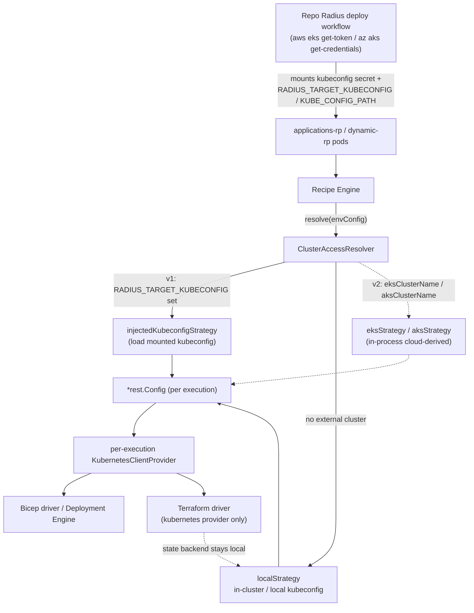

# Multi-Cluster Deployment: Technical Design

* **Author**: Sylvain Niles (@sylvainsf)

## Overview

Today a single Radius installation can only deploy application workloads to the
Kubernetes cluster on which Radius itself runs. The control plane and the
workload plane are the same cluster. This technical design describes how Radius
will redirect *recipe execution* at an external Kubernetes cluster, while the
Radius control plane continues to run wherever it is installed.

The product framing — user personas, scenarios, and the proposed
`aws.eksClusterName` / `azure.aksClusterName` data model — comes from the
[Deploy to External AKS and EKS Clusters feature specification](2026-05-external-kubernetes.md),
which was authored from a product perspective. This technical design **aligns to
the prototype** that actually exercises the end-to-end flow today: the Repo
Radius `verify` and `deploy` GitHub Actions workflows generated by the
[`github-extension`](https://github.com/radius-project/github-extension) repo
(`src/shared/github-client.ts`, `VERIFY_WORKFLOW` / `DEPLOY_WORKFLOW`). The
`github-extension` repo is a separate consumer of Radius — it never merges into
Radius — so **Radius owns the integration contract** these workflows rely on
(the `RADIUS_TARGET_KUBECONFIG` / `KUBE_CONFIG_PATH` env-var seam). The prototype
demonstrates the shape that works end-to-end; this design adopts and formalizes
that shape as a contract Radius commits to. Where this design diverges from the
feature spec, [Divergence from the feature
spec](#divergence-from-the-feature-spec) explains why and how.

The central design choice is unchanged: introduce a single seam — a
**cluster access resolver** — that decides, per recipe execution, *which*
Kubernetes cluster to deploy to and *how* to authenticate, returning an
in-memory `*rest.Config`. Every recipe engine consumes that `*rest.Config`
instead of assuming the in-cluster config. What changes after reviewing the
prototype is the **order of strategies** behind that seam. The prototype does not
put cluster identity in the environment resource and does not have Radius derive
cluster credentials from a cloud provider. Instead the **workflow** builds a
kubeconfig on the runner (via `aws eks get-token` / `az aks get-credentials`),
stores it as a Kubernetes secret, and injects it into the Radius RP pods via
environment variables (`RADIUS_TARGET_KUBECONFIG`, and `KUBE_CONFIG_PATH` for the
Terraform kubernetes provider). So the **v1 seam is a mounted/injected
kubeconfig**, and the cloud-derived `eksClusterName` / `aksClusterName` strategies
become a **v2 simplification** that lets the workflow drop its manual
kubeconfig plumbing later.

## Divergence from the feature spec

The [feature spec](2026-05-external-kubernetes.md) was written by a product
person to capture the user-facing goal. Implementing against the working
prototype surfaced three places where the technical design must diverge from the
spec's *mechanism* (while still serving the spec's *intent*):

1. **Cluster identity is not (yet) in the environment resource.** The feature
   spec proposes `providers.aws.eksClusterName` and
   `providers.azure.aksClusterName`. The prototype does **not** set these; `rad
   env create` only sets `--namespace`, and `rad env update` sets the cloud
   *scope* (`--aws-region` / `--aws-account-id`, `--azure-subscription-id` /
   `--azure-resource-group`). The target cluster is identified entirely outside
   Radius, in the GitHub Environment variable `RADIUS_K8S_CLUSTER`, and reaches
   Radius as an injected kubeconfig. **v1 honors the injected kubeconfig**; the
   `eksClusterName` / `aksClusterName` fields are deferred to v2.

2. **Radius does not derive cluster credentials from the cloud provider in v1.**
   The feature spec (and our earlier draft) had Radius call `eks:DescribeCluster`
   + STS presign / AKS `ListClusterUserCredentials` in-process. The prototype
   does this **in the workflow** using the cloud CLIs already present on the
   runner, then mounts the resulting kubeconfig. v1 consumes that kubeconfig; the
   in-process cloud-derived strategies are a v2 enhancement that removes the
   workflow's CLI steps.

3. **The "generic / mounted-kubeconfig" model the spec listed as a deferred
   future direction is actually v1.** The spec's `kubernetes.secretName` /
   `apiServerUrl` future shape is the closest match to what the prototype does
   today. So the ordering inverts relative to the spec: the generic
   kubeconfig-injection strategy ships first, and the cloud-managed-cluster
   strategies follow.

The resolver seam absorbs all three: the same interface serves the v1 injected
kubeconfig and the v2 cloud-derived strategies, so aligning to the prototype now
does not foreclose the spec's eventual `eksClusterName` / `aksClusterName` UX.

## Terms and definitions

| Term | Definition |
|------|------------|
| **Control-plane cluster** | The Kubernetes cluster where Radius (UCP, Applications RP, Dynamic RP, Deployment Engine) is installed and runs. |
| **Workload cluster** / **external cluster** | The cluster an environment targets for recipe-created Kubernetes resources. May be the same as the control-plane cluster (today's behavior) or a different AKS/EKS cluster. |
| **Cluster access resolver** | New component introduced by this design. Decides, per recipe execution, which cluster to deploy to and how to authenticate, returning an in-memory `*rest.Config`. |
| **In-cluster config** | The `*rest.Config` produced by `rest.InClusterConfig()` when a process runs inside Kubernetes, pointing at the cluster it runs on. |
| **`KubernetesClientProvider`** | Existing type at `pkg/components/kubernetesclient/kubernetesclientprovider` that wraps a single `*rest.Config` and hands out client-go, dynamic, discovery, and controller-runtime clients. |
| **Injected kubeconfig (v1 seam)** | A kubeconfig the Repo Radius workflow builds on the runner and mounts into the RP pods, surfaced to Radius via `RADIUS_TARGET_KUBECONFIG` (and `KUBE_CONFIG_PATH` for the Terraform kubernetes provider). |
| **`RADIUS_TARGET_KUBECONFIG`** | Env var (path to a kubeconfig) the workflow sets on `applications-rp`/`dynamic-rp` to point Radius recipe execution at the external cluster. Honoring it is the v1 deliverable. |
| **EKS access entry** | The AWS-native mechanism (successor to the `aws-auth` ConfigMap) that maps an IAM principal to a Kubernetes RBAC identity on an EKS cluster. The workflow creates one for the OIDC role. |
| **Repo Radius** | Delivery model ([PR #12078](https://github.com/radius-project/radius/pull/12078)) where Radius runs ephemerally inside GitHub Actions on a k3d control-plane cluster and deploys to an external workload cluster. The `verify`/`deploy` workflows ([`github-extension`](https://github.com/radius-project/github-extension)) are the concrete consumer this design aligns to. |

## Objectives

> **Issue Reference:** [radius-project/radius#6934 — Manage applications in multiple environments on separate Kubernetes clusters](https://github.com/radius-project/radius/issues/6934)

The product goals, non-goals, personas, and scenarios are defined in the
[feature specification](2026-05-external-kubernetes.md#objectives) and are not
repeated here. This section restates only the *engineering* objectives that
shape the technical design.

### Goals

- Redirect Bicep and Terraform recipe execution at an external Kubernetes
  cluster, with identical user-visible behavior across the two recipe engines.
- **v1: honor an injected kubeconfig** (`RADIUS_TARGET_KUBECONFIG` /
  `KUBE_CONFIG_PATH`) so the Repo Radius `verify`/`deploy` workflows work against
  Radius `main` without carrying Radius-specific shims.
- Preserve today's behavior byte-for-byte when no external cluster is configured.
- Introduce exactly one new abstraction seam (the cluster access resolver) so the
  v2 cloud-derived (`eksClusterName` / `aksClusterName`) strategies slot in later
  without re-plumbing the recipe engines.
- Keep the design forward-compatible with the feature spec's eventual
  environment-resource UX.

### Non-goals

Inherited from the feature spec where noted; see
[feature spec non-goals](2026-05-external-kubernetes.md#non-goals-out-of-scope):

- **v1:** Radius deriving cluster credentials from the cloud provider in-process
  (`eks:DescribeCluster` + STS presign, AKS `ListClusterUserCredentials`). The
  workflow does this on the runner in v1; the in-process strategies are v2.
- **v1:** the `aws.eksClusterName` / `azure.aksClusterName` environment fields.
  Deferred to v2.
- Redirecting direct (non-recipe) resource management. `Applications.Core/*`
  resource providers continue to target the control-plane cluster.
- Auto-creating namespaces on the external cluster (the workflow does this).
- A `kubernetes` credential type or `rad credential register kubernetes`.
- Multiple registered credentials per cloud, or cross-region/cross-account
  within one environment.

### User scenarios

See [feature spec key scenarios](2026-05-external-kubernetes.md#key-scenarios).
v1 of this design implements deploying to an external cluster via an injected
kubeconfig (the Repo Radius `deploy` workflow path) plus the unchanged
single-cluster behavior. The feature spec's named-cluster UX
(`eksClusterName` / `aksClusterName`) is delivered in v2 behind the same seam.

## User Experience

The user-facing CLI/Bicep surface for the *named-cluster* experience is specified
in the [feature spec](2026-05-external-kubernetes.md#detailed-user-experience)
and is a **v2** deliverable. In **v1**, the user experience is driven entirely by
the Repo Radius `verify`/`deploy` workflows; a developer does not edit the
environment resource to name a cluster. Instead the workflow:

- builds a kubeconfig for the target cluster on the runner (`aws eks get-token`
  / `az aks get-credentials`),
- stores it as the `target-kubeconfig` secret in `radius-system` and mounts it
  into `applications-rp` / `dynamic-rp`,
- sets `RADIUS_TARGET_KUBECONFIG` (and `KUBE_CONFIG_PATH` for the Terraform
  kubernetes provider) so recipe execution targets the external cluster,
- runs `rad env create --namespace <ns>` and `rad env update` with cloud scope
  only (no cluster name).

Radius's v1 job is to **honor `RADIUS_TARGET_KUBECONFIG`** so this works without
workflow-side shims. The eventual environment-resource shape (for reference, v2)
is:

```bicep
// v2 target shape (feature spec). v1 does NOT use these fields.
resource env 'Radius.Core/environments@2025-08-01-preview' = {
  name: 'my-radius-env'
  properties: {
    providers: {
      aws: {
        accountId: '<AWS_ACCOUNT_ID>'
        region: '<AWS_REGION>'
        eksClusterName: '<EKS_CLUSTER_NAME>'  // v2
      }
      kubernetes: {
        namespace: '<KUBERNETES_NAMESPACE>'
      }
    }
  }
}
```

## Design

### High Level Design

Recipe execution today resolves Kubernetes access implicitly: every recipe
driver receives a `kubernetesclientprovider.KubernetesClientProvider` that wraps
a single `*rest.Config`, which is the in-cluster config (when running in
Kubernetes) or the local kubeconfig (when running out-of-cluster). The Terraform
Kubernetes provider config builder
([`pkg/recipes/terraform/config/providers/kubernetes.go`](../../../pkg/recipes/terraform/config/providers/kubernetes.go))
and the Kubernetes backend builder
([`pkg/recipes/terraform/config/backends/kubernetes.go`](../../../pkg/recipes/terraform/config/backends/kubernetes.go))
both call `rest.InClusterConfig()` directly. There is no point at which an
environment can say "deploy somewhere else."

This design inserts a **cluster access resolver** between the environment
configuration and the recipe engines. The data flow becomes:

1. The recipe engine loads the environment configuration (already carries
   `datamodel.Providers`; this design adds the external-cluster fields).
2. Before executing a recipe, the engine asks the resolver for Kubernetes access
   for that environment.
3. The resolver selects a strategy:
   - **`RADIUS_TARGET_KUBECONFIG` set (v1, injected kubeconfig)** → loads the
     mounted kubeconfig and returns its `*rest.Config`. This is what the Repo
     Radius `deploy` workflow drives today.
   - **No external cluster configured** → returns the existing in-cluster /
     local-kubeconfig `*rest.Config` (today's behavior, unchanged).
   - **`aws.eksClusterName` / `azure.aksClusterName` set (v2, cloud-derived)** →
     uses the registered cloud credential to derive a `*rest.Config` in-process
     (EKS `DescribeCluster` + STS presign; AKS `ListClusterUserCredentials` +
     Entra token). Not shipped in v1.
4. The engine wraps the returned `*rest.Config` in a per-execution
   `KubernetesClientProvider` and passes it to the Bicep and Terraform drivers.
   The drivers and Terraform provider/backend builders consume that config
   instead of calling `rest.InClusterConfig()` themselves.

For the Terraform kubernetes provider, the prototype already works by setting
`KUBE_CONFIG_PATH` on `dynamic-rp`, which the provider reads natively. The v1
resolver formalizes the equivalent for the Bicep/applications-rp path via
`RADIUS_TARGET_KUBECONFIG`. The Terraform state backend continues to use the
**control-plane** cluster (the Kubernetes secret backend stays local); only the
Terraform Kubernetes *provider* targets the external cluster.

### Architecture Diagram



### Detailed Design

The design is presented as changes aligned with the product's layers. v1 changes
are the ones required for the Repo Radius `deploy` workflow to work against
Radius `main`; v2 changes deliver the feature spec's named-cluster UX behind the
same seam.

#### Change 1 (v1) — Honor an injected kubeconfig

Make recipe execution honor `RADIUS_TARGET_KUBECONFIG`, a path to a kubeconfig
the Repo Radius workflow mounts into `applications-rp` (and that `dynamic-rp`
already consumes for Terraform via `KUBE_CONFIG_PATH`). When set, recipe
execution targets the cluster in that kubeconfig; when unset, behavior is
unchanged.

This is the v1 seam. It requires no environment-resource API change and no cloud
credential handling inside Radius — the workflow has already produced the
kubeconfig. The resolver's `injectedKubeconfigStrategy` (Change 3) implements it.

> **Why an env var, not the env resource, in v1:** the prototype identifies the
> target cluster outside Radius (GitHub `RADIUS_K8S_CLUSTER`) and delivers it as a
> mounted kubeconfig. Honoring the env var is the smallest change that makes the
> merged workflow work, and it is consistent with the feature spec's deferred
> `kubernetes.secretName` direction.

#### Change 2 (v2) — Data model and API surface for named clusters

Deliver the feature spec's environment-resource UX. Extend the
`2025-08-01-preview` environment API and datamodel; the structured provider
blocks already exist in
[`pkg/corerp/api/v20250801preview/zz_generated_models.go`](../../../pkg/corerp/api/v20250801preview/zz_generated_models.go):
`ProvidersAws{AccountID, Region}`, `ProvidersAzure{SubscriptionID, ResourceGroupName, Identity}`,
and `ProvidersKubernetes{Namespace}`.

- TypeSpec: add optional `eksClusterName` to the AWS provider model and optional
  `aksClusterName` to the Azure provider model under the environments TypeSpec,
  then regenerate the Go models.
- Datamodel: add the two fields to the datamodel provider structs and update the
  version converter for `2025-08-01-preview`.

Naming decision: the cluster name lives with the cloud that owns the cluster
(`aws.eksClusterName`, `azure.aksClusterName`), per the feature spec. The
`kubernetes` provider block stays focused on `namespace`.

> **Note on the datamodel split:** the older `2023-10-01-preview`
> `datamodel.Providers` uses a `Scope`-string shape
> ([`pkg/corerp/datamodel/environment.go`](../../../pkg/corerp/datamodel/environment.go));
> the structured shape lives in the `2025-08-01-preview` models. The cluster
> fields are added only to the structured (`2025-08-01-preview`) shape.

#### Change 2b (v2) — Validation

At environment create/update, in the conversion/validation path, reject:

- `aws.eksClusterName` set without `aws.region` or `aws.accountId`.
- `azure.aksClusterName` set without `azure.subscriptionId` or
  `azure.resourceGroupName`.
- Both `providers.aws` and `providers.azure` present on the same environment
  (an environment is scoped to a single cloud).

Each rejection names the missing or conflicting field.

#### Change 3 (v1) — Cluster access resolver (the new seam)

Introduce a new package, proposed `pkg/recipes/kubernetes/clusteraccess` (name
open), exposing one interface:

```go
// ClusterAccessResolver returns an in-memory *rest.Config for the Kubernetes
// cluster a recipe execution targets. The returned config and any embedded
// credentials are scoped to a single recipe execution and must not be persisted.
type ClusterAccessResolver interface {
    // Resolve returns a *rest.Config for the cluster targeted by this execution.
    // When nothing names an external cluster, it returns the control-plane
    // (in-cluster / local kubeconfig) config.
    Resolve(ctx context.Context, envConfig *recipes.Configuration) (*rest.Config, error)
}
```

Internally the resolver dispatches to a small `clusterStrategy` per target type:

```go
type clusterStrategy interface {
    // appliesTo reports whether this strategy handles the current execution.
    appliesTo(envConfig *recipes.Configuration) bool
    // restConfig builds an in-memory *rest.Config for the target cluster.
    restConfig(ctx context.Context, envConfig *recipes.Configuration) (*rest.Config, error)
}
```

Strategy precedence (first match wins):

- **`injectedKubeconfigStrategy` (v1)** — selected when `RADIUS_TARGET_KUBECONFIG`
  is set. Loads the mounted kubeconfig and returns its `*rest.Config`. This is the
  strategy the Repo Radius `deploy` workflow exercises. It does no cloud calls and
  holds no long-lived credential — the kubeconfig is supplied (and refreshed)
  by the workflow.
- **`localStrategy` (v1)** — the default. Wraps today's logic:
  `rest.InClusterConfig()`, falling back to the local kubeconfig when not
  in-cluster. Selected when nothing names an external cluster. This is a refactor
  of the logic currently duplicated in the Terraform provider/backend builders
  into one place.
- **`eksStrategy` / `aksStrategy` (v2)** — selected when `aws.eksClusterName` /
  `azure.aksClusterName` is set. Obtains the registered cloud credential from UCP
  (`pkg/ucp/credentials`) and derives a `*rest.Config` in-process:
  - **EKS:** `eks:DescribeCluster` for the endpoint/CA, plus an STS-presigned
    `GetCallerIdentity` bearer token built by reusing the AWS SDK
    (`aws-sdk-go-v2/service/sts` `PresignClient.PresignGetCallerIdentity` with the
    `x-k8s-aws-id` header) — no `aws` CLI dependency. Adds
    `aws-sdk-go-v2/service/eks`; `service/sts` is already a dependency.
  - **AKS:** `ListClusterUserCredentials` + Entra ID token, working with local
    accounts disabled.

  These strategies let the workflow drop its `aws eks get-token` /
  `az aks get-credentials` + secret-mount + RP-patch steps. They inherit the EKS
  token lifetime constraint; see
  [EKS token lifetime decision](#eks-token-lifetime-decision).
- **`aksStrategy`** — selected when `azure.aksClusterName` is set. Obtains the
  registered Azure credential, calls AKS `ListClusterUserCredentials` for the
  cluster in the configured subscription/resource group, and exchanges for an
  These strategies let the workflow drop its `aws eks get-token` /
  `az aks get-credentials` + secret-mount + RP-patch steps. They inherit the EKS
  token lifetime constraint; see
  [EKS token lifetime decision](#eks-token-lifetime-decision).

The resolver depends only on: the execution's env/runtime config
(`RADIUS_TARGET_KUBECONFIG`, provider config), the UCP credential provider (v2
strategies only), and (for `localStrategy`) the existing control-plane config. It
returns a fully-formed `*rest.Config`; it does not construct clients itself.

#### Change 4 (v1) — Recipe engine integration

Both engines must consume the resolver output rather than assuming in-cluster
config.

- **Terraform** — `NewTerraformDriver`
  ([`pkg/recipes/driver/terraform/terraform.go`](../../../pkg/recipes/driver/terraform/terraform.go))
  receives a `KubernetesClientProvider` today. Change the execution path so that,
  per recipe execution, the engine calls the resolver and builds a
  per-execution `KubernetesClientProvider` from the returned `*rest.Config`. The
  Kubernetes *provider* config builder
  ([`config/providers/kubernetes.go`](../../../pkg/recipes/terraform/config/providers/kubernetes.go))
  stops calling `rest.InClusterConfig()` and instead emits provider config
  derived from the resolved `*rest.Config`. Note the prototype already drives this
  path today by setting `KUBE_CONFIG_PATH` on `dynamic-rp`, which the Terraform
  kubernetes provider reads natively; the resolver makes that behavior explicit
  and unifies it with the Bicep path. The Kubernetes *backend* builder
  ([`config/backends/kubernetes.go`](../../../pkg/recipes/terraform/config/backends/kubernetes.go))
  is **unchanged** — state stays on the control-plane cluster.
- **Bicep** — the Bicep recipe is executed by the Deployment Engine, which uses
  the Bicep `extension kubernetes` provider with a `kubeConfig` parameter (empty
  string today, meaning in-cluster). The engine renders a kubeconfig from the
  resolved `*rest.Config` and passes it through the recipe context so the Bicep
  Kubernetes extension targets the external cluster. The Deployment Engine itself
  is **not** modified to consult the resolver; its own cluster-admin
  ServiceAccount continues to serve in-cluster recipes, and external targeting is
  expressed entirely through the rendered `kubeConfig` the engine supplies. In
  v1 the rendered kubeconfig carries the token from the injected kubeconfig (the
  workflow refreshes it before deploy); in v2 it carries the in-process
  EKS/AKS token. Either way the DE image needs no `aws`/`kubelogin` binary.

#### Change 5 — Direct resource management stays local

No change to `Applications.Core/*` resource providers. They continue to use the
control-plane `KubernetesClientProvider`. Only the recipe execution path consults
the resolver. This keeps the blast radius of the change to the recipe engines.

#### Forward compatibility: v2 cloud-derived strategies and generic clusters

The single `ClusterAccessResolver` seam is what makes the later directions
additive rather than breaking:

- **v2 cloud-derived strategies:** adding `eksStrategy` / `aksStrategy` behind the
  resolver delivers the feature spec's `eksClusterName` / `aksClusterName` UX and
  lets the Repo Radius workflow delete its kubeconfig-plumbing steps. No change
  to the v1 injected-kubeconfig path or the engine wiring.
- **Generic clusters** (further future): a `genericStrategy` for the feature
  spec's `kubernetes.apiServerUrl` / `kubernetes.secretName` shape reads a
  referenced Secret and assembles a `*rest.Config`. The v1
  `injectedKubeconfigStrategy` is effectively a minimal form of this already.
- **Repo Radius** ([PR #12078](https://github.com/radius-project/radius/pull/12078),
  Investment 1 = "deployment to external Kubernetes cluster"): the `verify` /
  `deploy` workflows are the concrete consumer. v1 honors exactly the contract
  they use today (injected kubeconfig); v2 simplifies them. The resolver depends
  on the injected-kubeconfig contract and (for v2) the UCP credential
  abstraction, not on any Repo-Radius-specific code.

#### Advantages

- v1 matches the merged workflow's contract exactly, so Repo Radius works against
  Radius `main` with no workflow-side Radius shims.
- One seam, many strategies: injected kubeconfig now, cloud-derived later, with
  no re-plumbing of the recipe engines.
- Recipe engines stop hard-coding `rest.InClusterConfig()`; the duplicated
  in-cluster logic in the Terraform provider and backend builders collapses into
  `localStrategy`.
- Zero behavior change when no external cluster is configured.

#### Disadvantages

- v1 leaves cluster identity and credential acquisition outside Radius (in the
  workflow), so the polished feature-spec UX waits for v2.
- The Bicep path requires rendering and passing a kubeconfig through the
  Deployment Engine via the recipe context. This avoids modifying the DE's
  cluster-admin ServiceAccount model, but couples external targeting to whatever
  the DE forwards into the `extension kubernetes` provider.
- v2 adds a per-execution cloud credential acquisition (EKS `DescribeCluster` +
  STS presign; AKS `ListClusterUserCredentials` + Entra token) on the hot path;
  the feature spec flags measuring this latency as an assumption to test.

#### Proposed Option

Ship **v1** (Changes 1, 3, 4, 5): honor `RADIUS_TARGET_KUBECONFIG` via the
resolver's `injectedKubeconfigStrategy`, refactor the duplicated in-cluster logic
into `localStrategy`, and route both recipe engines through the resolver.
`localStrategy` lands first as a pure refactor (no behavior change, fully unit
testable). Then deliver **v2** (Changes 2, 2b, plus `eksStrategy` / `aksStrategy`)
for the feature spec's named-cluster UX.

### API design

- **v1:** no public REST/CLI API change. The seam is the `RADIUS_TARGET_KUBECONFIG`
  env-var contract plus the new Go interfaces `ClusterAccessResolver` and
  `clusterStrategy` (Change 3).
- **v2:** two new datamodel fields, `ProvidersAWS.EKSClusterName` and
  `ProvidersAzure.AKSClusterName`, surfaced on `2025-08-01-preview` (Change 2).

### CLI Design

- **v1:** none. The Repo Radius workflow uses existing `rad env create
  --namespace` and `rad env update` cloud-scope flags only.
- **v2:** `--aws-eks-cluster-name` / `--azure-aks-cluster-name` on `rad env
  create/update`, defined in the feature spec, mapping to the v2 datamodel fields.

### Implementation Details

#### UCP

v1: no UCP changes. v2: reuse `pkg/ucp/credentials` to fetch the registered AWS
and Azure credentials from within the `eksStrategy` / `aksStrategy`.

#### Bicep / Deployment Engine

Render a kubeconfig from the resolved `*rest.Config` and pass it via the recipe
context to the Bicep `extension kubernetes` provider for recipe execution against
the external cluster. In v1 the token comes from the injected kubeconfig (the
workflow refreshes it before deploy); in v2 it is the in-process EKS/AKS token.
The DE's own ServiceAccount and in-cluster behavior are unchanged. Scope: recipe
execution only.

#### Core RP

Unchanged — direct resource management stays on the control-plane cluster.

#### Portable Resources / Recipes RP

- New `clusteraccess` package (resolver + strategies).
- Recipe engine calls the resolver and builds a per-execution
  `KubernetesClientProvider`.
- Terraform Kubernetes provider config builder consumes the resolved config;
  backend builder unchanged.

### Error Handling

Per [feature spec acceptance/edge cases](2026-05-external-kubernetes.md#detailed-user-experience):

- **v1:** injected kubeconfig missing/unreadable at `RADIUS_TARGET_KUBECONFIG`
  → clear error naming the path; recipe execution fails rather than silently
  falling back to the control-plane cluster.
- **v2:** validation failures (missing region/accountId/subscription/resourceGroup,
  or both clouds set) → rejected at create/update with the offending field named.
- **v2:** credential acquisition failure (missing cloud RBAC, cluster not found,
  network unreachable) → recipe execution fails with an actionable error
  identifying the root cause (which cloud call failed and why).
- External cluster unreachable → distinct connectivity error, not a generic
  failure.
- Target namespace missing → clear error; no auto-creation (the workflow creates
  the namespace).
- Bearer token expiry mid-deployment → accepted limitation for EKS; see
  [EKS token lifetime decision](#eks-token-lifetime-decision).

#### EKS token lifetime decision

**Decision: ship with the ~15-minute EKS token limit (no in-flight renewal in
Radius).**

EKS bearer tokens are presigned STS `GetCallerIdentity` requests with a fixed
~15-minute validity (an AWS-side constraint). In **v1**, the token lives in the
injected kubeconfig that the Repo Radius workflow mounts; the workflow already
**refreshes the token and restarts the RP pods immediately before `rad
deploy`**, so the ~15-minute window starts at deploy time rather than at
environment setup. In **v2**, the `eksStrategy` acquires the token in-process per
execution. Either way the token is not renewed *in-flight*.

Because a Radius deployment is a dependency graph, a Kubernetes recipe can run
*after* a long upstream dependency — for example a global DynamoDB table that can
take well over 15 minutes to provision — at which point the token may already be
expired and the Kubernetes step fails to authenticate. The workflow's pre-deploy
refresh shrinks but does not eliminate this window. AKS is not materially
affected: Entra ID tokens default to roughly a one-hour lifetime.

We evaluated three options:

- **Ship with the limit (chosen).** Rely on the workflow's pre-deploy refresh
  (v1) / per-execution acquisition (v2), document the EKS ~15-minute ceiling, and
  surface a clear authentication error (naming token expiry as the cause) if a
  deployment crosses it. Unblocks the external-cluster / Repo Radius scenarios
  now with no new binary dependency.
- **AWS-native exec plugin (rejected).** Emit kubeconfig/provider `exec` blocks
  invoking `aws eks get-token` / `kubelogin`. Renews transparently but requires
  shipping those binaries in the Terraform exec environment **and** the
  Deployment Engine image — the external-binary dependency this design avoids.
- **Radius-owned exec-credential helper (deferred fast-follow).** Expose the
  in-process EKS/AKS credential logic behind a hidden CLI entrypoint that speaks
  the Kubernetes `ExecCredential` protocol, and generate `exec` blocks pointing
  at it. This renews tokens on demand **without** changing the Deployment
  Engine's execution model (the DE invokes it as a standard exec plugin) and
  without a third-party binary. It is the preferred long-term fix but is **not**
  built in this design.

Rationale for shipping with the limit: in-flight renewal cannot be retrofitted
onto a static embedded token (Terraform and the .NET Deployment Engine are
separate processes that read the token once and do not hold Radius's live
`*rest.Config`), and a proper fix is the exec-credential helper above. Major
changes to the Deployment Engine's execution model are out of scope, so the
helper is the right vehicle but belongs in a follow-up. The ~15-minute ceiling is
acceptable for v1: it only affects external **EKS** deployments whose graph
places a slow (>15 min) upstream cloud dependency ahead of a Kubernetes step. The
limitation must be called out in the external-cluster quickstart and release
notes so the (non-deterministic) failure mode is diagnosable in the field.

## Test plan

- **Unit:** resolver strategy selection (injected-kubeconfig / local / v2
  EKS / AKS), validation rules, and `*rest.Config` assembly with mocked clients.
  `localStrategy` and `injectedKubeconfigStrategy` are fully unit testable;
  `localStrategy` refactor is covered by existing recipe-engine unit tests plus
  new table tests.
- **Integration:** Terraform provider config generation from a resolved
  `*rest.Config` (including the injected-kubeconfig path); backend config remains
  pointed at the control-plane cluster.
- **End-to-end (the verify/deploy workflows themselves):** the primary v1
  validation is the Repo Radius `verify` and `deploy` workflows from
  [`github-extension`](https://github.com/radius-project/github-extension)
  running green against a build of this branch. They spin up an ephemeral k3d
  control-plane cluster, authenticate to AWS/Azure via OIDC, build and inject the
  target-cluster kubeconfig, and run `rad deploy` to a real EKS and a real AKS
  cluster for both Bicep and Terraform recipes. Success is verified with
  `kubectl` against each external cluster. This is exactly the path Radius v1
  must honor, so keeping these workflows green is the acceptance gate.
- **Regression:** with `RADIUS_TARGET_KUBECONFIG` unset and no external cluster
  configured, deployment is identical to today.

Testing challenges: the workflows need reachable EKS and AKS clusters and an RBAC
mapping for the test principal on each. Provisioning of those workload clusters
and the federated permissions for the test principal is provided by the OIDC
workflow work (owned by Shruthi); this design consumes them rather than
provisioning them. The control-plane cluster is ephemeral (k3d on the runner) and
only the workload clusters are external/pre-provisioned.

## Security

- **v1 credential handling:** Radius does not acquire or store external-cluster
  credentials. The Repo Radius workflow builds the kubeconfig and mounts it as a
  Kubernetes secret in `radius-system`; Radius reads it via
  `RADIUS_TARGET_KUBECONFIG` and holds it only in memory for the execution. The
  secret's lifecycle (creation, refresh, RBAC) is the workflow's responsibility.
- **v2 credential handling:** external-cluster credentials are acquired on demand
  from the already-registered UCP cloud credential, held only in memory for one
  recipe execution, and never written to disk or persisted in the data store.
- **No new credential type:** reuses the existing AWS/Azure UCP credential model;
  introduces no new secret storage.
- **RBAC dependency:** the principal (the OIDC role in v1, the registered cloud
  principal in v2) must hold a Kubernetes RBAC role on the target cluster. In v1
  the workflow creates the EKS access entry / associates the cluster-admin
  policy; Radius does not grant these.
- **Token lifetime:** EKS tokens (~15 min) are not renewed in-flight; a recipe
  exceeding that window is a documented limitation.

## Compatibility

- **v1** adds no public API; the only new surface is the
  `RADIUS_TARGET_KUBECONFIG` env-var contract. Unset → behavior unchanged.
- **v2** adds additive API fields on `2025-08-01-preview`; older clients that do
  not set them are unaffected.
- Environments with no external cluster configured are byte-for-byte unchanged.
- The Terraform state backend location does not change, so existing state is not
  migrated or relocated.

## Monitoring and Logging

- Log (at debug) the selected strategy and target cluster identity (cluster name,
  region/subscription) per recipe execution — never the resolved token or
  kubeconfig contents.
- Emit a metric / span around credential acquisition latency (EKS
  `DescribeCluster` + STS presign; AKS `ListClusterUserCredentials` + Entra
  token) to validate the feature-spec latency assumption in production.
- On failure, log the failing cloud API call and reason to support the
  actionable-error requirement.

## Development plan

### v1 (delivered together on this branch; required for the Repo Radius verify/deploy workflows)

1. **Resolver seam + `localStrategy` (Change 3, refactor):** introduce the
   `ClusterAccessResolver` / `clusterStrategy` interfaces, move the duplicated
   in-cluster logic into `localStrategy`, route both recipe engines through the
   resolver. No behavior change; covered by existing + new unit tests.
2. **`injectedKubeconfigStrategy` (Changes 1, 4):** honor
   `RADIUS_TARGET_KUBECONFIG` on the applications-rp/Bicep path and unify the
   Terraform `KUBE_CONFIG_PATH` path through the resolver.
3. **Keep the `verify`/`deploy` workflows green** against this branch as the
   acceptance gate. Depends on the OIDC workflow work (owned by Shruthi) for the
   EKS/AKS workload clusters and federated permissions.

### v2 (feature-spec named-cluster UX)

4. **Data model + validation (Changes 2, 2b):** TypeSpec fields, regenerate
   models, datamodel fields, converter, validation rules + unit tests.
5. **`eksStrategy` + `aksStrategy` (shipped together):** implement both cloud
   strategies behind the resolver, plus unit tests with mocked cloud clients.
   Lets the Repo Radius workflow drop its kubeconfig-plumbing steps.
6. **Docs/quickstart** for the named-cluster experience.

## Open Questions

The major design decisions raised during review have been resolved and folded
into the design above:

- **Alignment to the prototype (resolved):** v1 honors the injected kubeconfig
  (`RADIUS_TARGET_KUBECONFIG`) that the Repo Radius `verify`/`deploy` workflows
  use; the cloud-derived `eksClusterName` / `aksClusterName` strategies are v2.
  See [Divergence from the feature spec](#divergence-from-the-feature-spec).
- **Bicep external targeting (resolved):** the engine renders a kubeconfig and
  passes it via recipe context to the `extension kubernetes` provider; the
  Deployment Engine is not modified to consult the resolver. See
  [Change 4](#change-4-v1--recipe-engine-integration).
- **EKS token (resolved):** v1 relies on the workflow's pre-deploy refresh; v2
  builds the token in-process via STS presign with no exec-plugin binary
  dependency. See [Change 3](#change-3-v1--cluster-access-resolver-the-new-seam).
- **Strategy selection (resolved):** precedence is injected-kubeconfig (v1) →
  local → cloud-derived (v2); first match wins, no separate opt-in flag.
- **OIDC / short-lived credentials (resolved):** per-execution acquisition; no
  in-flight renewal. For EKS the ~15-minute token ceiling is an accepted
  limitation. See [EKS token lifetime decision](#eks-token-lifetime-decision).

There are no remaining blocking open questions. The implementation-time items
previously listed have been resolved:

- **Per-execution client provider placement (resolved):** the resolver is called
  in the recipe driver's per-execution entrypoint, where the environment
  configuration is already in scope — the Terraform driver's `Execute`
  ([`pkg/recipes/driver/terraform/terraform.go`](../../../pkg/recipes/driver/terraform/terraform.go))
  / executor `Deploy`
  ([`pkg/recipes/terraform/execute.go`](../../../pkg/recipes/terraform/execute.go))
  both receive `opts.Configuration` (`EnvConfig`). Today the executor holds a
  `KubernetesClientProvider` as a construction-time field; this design moves
  Kubernetes-access resolution to per-execution: `Execute`/`Deploy` calls the
  resolver with the env config and builds a per-execution
  `KubernetesClientProvider` from the returned `*rest.Config`, discarded when the
  execution completes. The construction-time field is replaced by an injected
  `ClusterAccessResolver`.
- **In-process EKS presign shape (resolved):** reuse the AWS SDK rather than
  reimplement. `github.com/aws/aws-sdk-go-v2` and
  `github.com/aws/aws-sdk-go-v2/service/sts` are already direct dependencies; the
  STS `PresignClient.PresignGetCallerIdentity` produces the presigned request
  that becomes the EKS bearer token, with the `x-k8s-aws-id` cluster header. The
  `eksStrategy` wraps that primitive plus the cluster endpoint/CA from
  `eks:DescribeCluster`. This adds one new direct dependency,
  `github.com/aws/aws-sdk-go-v2/service/eks` (for `DescribeCluster`); `service/sts`
  is already present.
- **Test workload cluster ownership (resolved):** provisioning of the EKS/AKS
  workload clusters and the RBAC/permissions for the test principal is covered by
  the OIDC workflow work (owned by Shruthi). The integration-test workflow
  consumes the clusters and federated permissions that work makes available; this
  design does not own cluster provisioning.

## Alternatives considered

- **`target` / `clusterType` / `clusterName` triplet on `providers.kubernetes`**
  — the earlier shape from [PR #11644](https://github.com/radius-project/radius/pull/11644).
  Rejected in design review in favor of placing cluster identity with the owning
  cloud; this design follows that outcome and keeps the `kubernetes` block free
  for the future generic-cluster fields.
- **Storing a kubeconfig / SA token as a Radius credential now** — rejected;
  out of scope per feature spec and would introduce a new secret store before the
  generic-cluster shape is designed. (Note: v1 consumes a workflow-mounted
  kubeconfig secret it does not own, which is different from Radius persisting a
  credential.)
- **Putting external-cluster resolution inside each recipe driver** — rejected;
  duplicates logic, makes the Bicep and Terraform paths diverge, and offers no
  seam for the v2 cloud-derived strategies.
- **Cloud-derived strategies as v1 (rejected for ordering)** — would diverge from
  the merged Repo Radius workflow, which uses an injected kubeconfig. Radius would
  carry an unused path while the workflow kept its plumbing. Inverting to
  injected-kubeconfig-first matches what ships today; cloud-derived follows in v2.
- **Storing Terraform state on the external cluster** — rejected per feature spec
  risk mitigation; distributes state and requires external credentials for the
  backend.

## Design Review Notes

- **Aligned to the prototype (decided):** the technical design follows the Repo
  Radius `verify`/`deploy` workflows
  ([`github-extension`](https://github.com/radius-project/github-extension)) that
  exercise the end-to-end flow today. `github-extension` is a separate consumer
  repo that never merges into Radius, so **Radius owns the
  `RADIUS_TARGET_KUBECONFIG` / `KUBE_CONFIG_PATH` contract**; the prototype
  demonstrates the shape and this design commits Radius to it. v1 honors the
  injected kubeconfig; the feature spec's `eksClusterName` / `aksClusterName`
  named-cluster UX and in-process cloud-derived credential acquisition are v2
  behind the same resolver seam. The feature spec was authored from a product
  perspective; see
  [Divergence from the feature spec](#divergence-from-the-feature-spec) for the
  three specific divergences and why.
- **EKS token lifetime (decided):** ship with the ~15-minute EKS token limit and
  no in-flight renewal. v1 relies on the workflow's pre-deploy token refresh; v2
  acquires per execution. A Radius-owned exec-credential helper (Option C in the
  prior analysis) is the preferred fast-follow to lift the ceiling without an
  external binary dependency or changes to the Deployment Engine execution model,
  but it is out of scope for this design. The limitation only affects external
  **EKS** deployments whose dependency graph places a slow (>15 min) upstream
  cloud resource ahead of a Kubernetes step; it must be documented in the
  quickstart and release notes. See
  [EKS token lifetime decision](#eks-token-lifetime-decision).
