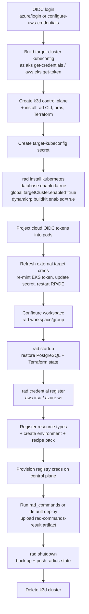

# Repo Radius — Deploy Workflow (Technical Design)

- **Authors**: Shruthi Kannan (@sk593), Sylvain Niles (@sylvainsf)
- **Status**: Draft
- **Feature spec**: Repo Radius (Zach Casper) — [PR #12078](https://github.com/radius-project/radius/pull/12078)
- **Issue**: [#12118 Add Repo Radius verify/deploy workflows to the repo](https://github.com/radius-project/radius/issues/12118)
- **Depends on**: [#12106 Multi-cluster deployment v1](https://github.com/radius-project/radius/pull/12106) (merged), [#12214 Repo Radius state storage (`rad startup` / `rad shutdown`)](https://github.com/radius-project/radius/pull/12214) (merged)

## Scope

This document covers **Investment 3 of the Repo Radius feature spec: the Repo Radius workflow with standardized inputs and outputs** — the `deploy` workflow that runs Radius on demand inside a GitHub Actions runner — together with **Investment 4: cloud credential integration**.

The workflow ships as a **unified dispatcher plus two thin provider workflows and shared composite actions**:

- [`run-rad-commands.yml`](../../../.github/extension/run-rad-commands.yml) — the dispatcher and the only file that is dispatched. It owns the dispatch contract and, via a `detect` job bound to the GitHub Environment, routes to the matching provider workflow (`workflow_call`, `secrets: inherit`).
- [`run-rad-commands-azure.yml`](../../../.github/extension/run-rad-commands-azure.yml) and [`run-rad-commands-aws.yml`](../../../.github/extension/run-rad-commands-aws.yml) — reusable workflows carrying only the cloud-specific steps (OIDC login, cluster connection, token projection, credential registration, and recipe pack).
- [`.github/extension/actions/`](../../../.github/extension/actions/) — composite actions for the provider-agnostic phases (`setup-control-plane`, `restore-state`, `register-resource-types`, `run-rad-commands`, `teardown`), referenced from `radius-project/radius` at a pinned ref.

A frontend (the Copilot app, the CLI, etc.) writes the dispatcher and both provider workflows into a user's repository under `.github/workflows/` and dispatches `run-rad-commands.yml`. The provider workflows are not dispatched directly, and the composite actions are never copied into the user repo — they stay at [`.github/extension/`](../../../.github/extension/) so the shared logic has a canonical, reviewed home.

The workflow was originally a single file that branched on which provider variables were present. It was first split into two self-contained per-provider files, which duplicated the ~80% of provider-agnostic steps between them; the current shape keeps the two provider surfaces separate while hoisting the shared steps into composite actions behind one dispatcher, so each duplicated phase is defined once.

Explicitly **out of scope**:

- **Cloud-side OIDC / permission provisioning** — creating the AWS IAM role + trust policy or the Entra app registration + federated credential. The workflow *consumes* an environment that is already federated; standing that up is tracked separately.
- **The state-storage mechanism** (`rad startup` / `rad shutdown`, the `radius-state` git orphan branch) — owned by the [state-storage design](../2026-06-repo-radius-state-storage.md).
- **The multi-cluster seam internals** (`global.targetCluster`, the cluster access resolver) — owned by the [multi-cluster design](2026-06-multi-cluster.md). This document only describes how the workflow *drives* that seam.
- **Mid-run cloud-token refresh** beyond the single pre-deploy EKS refresh — a long Azure run may outlive the one-time token exchange; refreshing it mid-run is a deferred fast follow.

## Background

Repo Radius runs the Radius control plane on an **ephemeral k3d cluster** inside a GitHub Actions runner. The cluster is created at the start of a run and destroyed at the end; application workloads deploy to the developer's **external** AKS/EKS cluster, not the runner cluster. Each provider-specific workflow composes three independently landed building blocks:

| Piece            | Provides                                                                                  | Owner                                                         |
|------------------|-------------------------------------------------------------------------------------------|---------------------------------------------------------------|
| Multi-cluster v1 | `RADIUS_TARGET_KUBECONFIG` seam (chart `global.targetCluster.enabled`)                    | [#12106](https://github.com/radius-project/radius/pull/12106) |
| State storage    | `rad startup` / `rad shutdown` + `database.enabled=true` chart wiring                     | [#12214](https://github.com/radius-project/radius/pull/12214) |
| Workflow (this)  | The orchestration that installs Radius, restores state, runs commands, and persists state | this design                                                   |

An earlier proof of concept validated the end-to-end flow but kept the workflow as a generated string outside Radius, where the contract it depends on had no reviewed home. Bringing the workflow in-tree gives that contract a canonical home and removes any reliance on an external project.

## The dispatch contract (stable; frontends depend on it)

The frontend drives Repo Radius through the GitHub API. The contract is the `workflow_dispatch` input set plus the GitHub Environment the run binds to.

### Inputs

| Input          | Required | Description                                                                                                                                                                                                                                                                                                                                                                                                                          |
|----------------|----------|--------------------------------------------------------------------------------------------------------------------------------------------------------------------------------------------------------------------------------------------------------------------------------------------------------------------------------------------------------------------------------------------------------------------------------------|
| `environment`  | Yes      | The GitHub Environment name. Used as the Radius environment name and to bind the job (`environment: ${{ inputs.environment }}`) so its variables and OIDC subject apply.                                                                                                                                                                                                                                                             |
| `image`        | No       | Container image for the application, passed to the default deploy as the `image` parameter. Defaults to the commit SHA.                                                                                                                                                                                                                                                                                                              |
| `rad_commands` | No      | A single `rad` CLI command string, **or** a JSON-encoded array of command strings run in order, with the `rad` prefix omitted (e.g. `deploy .radius/app.bicep --environment dev` or `["deploy .radius/app.bicep --environment dev", "app graph my-app -o json"]`). Falls back to the `RADIUS_RAD_COMMANDS` variable when the input is empty. Each command is validated against the allowed-command set before any command runs. When both are empty, the workflow runs its default `rad deploy` of `.radius/app.bicep`. |

`rad_commands` is the dispatch contract: it lets a frontend drive `rad` commands through the documented seam rather than being limited to a single deploy. Commands run in order and the run **stops on the first failure**, then still persists state (below). Because commands run verbatim, the caller owns each command's flags — notably `--environment <name>` for `deploy` (there is no workspace default set) and any `--parameters` (image, password, etc.) the app expects. `image` is retained as a convenience for the common single-deploy case and so the workflow remains usable without constructing a command string.

#### Allowed-command set

Each command's leading verb is validated against an allow-list before any command runs, so commands that do not fit the ephemeral, per-run model — managing or upgrading a control plane, switching workspaces, or changing install state — cannot run, and the contract stays narrow and reviewable. A disallowed command fails fast (overall `outcome: disallowed_command`, exit 2) without deploying anything. The allowed leading verbs are `deploy`, `app`, `resource`, `env`, `recipe`, `group`, `credential`, `resource-type`, `version`, and `bicep`; this set is part of the stable contract and may grow in backward-compatible releases.

### Outputs

The run produces a single `rad-commands-result` artifact: a JSON document with a top-level `outcome` (`succeeded`, `command_failed`, or `disallowed_command`) and `exitCode`, plus a `commands` array with one entry per command, in input order, each carrying the command string, its `exitCode`, `outcome`, and captured `output`. The artifact name is stable and known in advance, so the frontend downloads one file to get the full result of the run and reads the run conclusion from the matching exit code. The artifact is written even when a command fails (a trap finalizes it on exit), so a failed or disallowed run still yields a complete result; entries for commands that did not run are absent. On failure, additional control-plane and application logs upload as the `radius-logs` artifact.

A single combined artifact is preferred over per-command artifacts (`rad-command-0`, `rad-command-1`, …): the name is fixed rather than varying with the number of commands, ordering is explicit via the array, and one download yields the whole run. The trade-off is that the frontend cannot poll a single command's output mid-run; that is acceptable because the GitHub artifacts API does not expose an artifact until its upload completes anyway, so per-command artifacts would not stream either.

### GitHub Environment variables

The workflow reads Actions **variables** (`vars`) for cloud configuration; the provider steps run only when the identifying variable (`AZURE_CLIENT_ID` or `AWS_ROLE_ARN`) is non-empty.

| Provider | Variables                                                                                                          |
|----------|--------------------------------------------------------------------------------------------------------------------|
| Azure    | `AZURE_CLIENT_ID`, `AZURE_TENANT_ID`, `AZURE_SUBSCRIPTION_ID`, `AZURE_RESOURCE_GROUP`, `AZURE_AKS_CLUSTER_NAME`     |
| AWS      | `AWS_ROLE_ARN`, `AWS_REGION`, `AWS_ACCOUNT_ID`, `AWS_EKS_CLUSTER_NAME`, `RADIUS_VPC_ID`, `RADIUS_SUBNET_IDS`        |
| Common   | `KUBERNETES_NAMESPACE` (target namespace, defaults to `default`), `RADIUS_BUILD_REGISTRY` (image-build push target), `RADIUS_RAD_COMMANDS` (fallback for the `rad_commands` input) |

Secrets used: the built-in `GITHUB_TOKEN` (with `github.actor`) for image-build registry auth, and `RADIUS_DEPLOY_PARAMS` — a JSON object of application parameters expanded into `--parameters name=value` pairs on the default deploy.

### Auto-trigger

The `workflow_dispatch` and `workflow_run` triggers live on the **dispatcher** (`run-rad-commands.yml`); the provider workflows are `workflow_call`-only. Besides an explicit dispatch, the dispatcher has a `workflow_run` trigger on the `Radius - Verify Credentials` workflow completing. The `detect` job gates on `github.event.workflow_run.conclusion == 'success'`, so a successful credential check auto-triggers a deploy; on an explicit dispatch it runs unconditionally.

### Composition (dispatcher, provider workflows, composite actions)

The provider paths share ~80% of their steps, so the workflow is factored to define each shared phase once while keeping the two cloud surfaces separate and reviewable:

- The **dispatcher** owns the trigger surface and the routing. A reusable-workflow caller job (`uses:`) cannot itself bind an `environment:`, so it cannot read environment-scoped variables to pick a provider. The dispatcher works around this with a `detect` job that *does* bind `environment: ${{ inputs.environment }}`, reads `AZURE_CLIENT_ID` / `AWS_ROLE_ARN`, and emits `provider`; two downstream `uses:` jobs (`azure`, `aws`) gate on that output and pass inputs through with `secrets: inherit`.
- The **provider workflows** are reusable (`workflow_call`) and hold only the cloud-specific steps. They bind the environment themselves, so environment variables and the OIDC subject apply inside them.
- The **composite actions** (`setup-control-plane`, `restore-state`, `register-resource-types`, `run-rad-commands`, `teardown`) hold the provider-agnostic phases and are referenced from `radius-project/radius` at a pinned ref. `run-rad-commands` and `teardown` are deliberately separate: the provider workflow invokes `run-rad-commands` on success but `teardown` with `if: always()`, so `rad shutdown`, log collection, and the k3d delete still run when an earlier step fails without the deploy itself running after a failed prerequisite. Because composite-action steps cannot read the `vars`/`secrets` contexts or the caller's `env:` block, every value they need (namespace, resource-types repo/ref, app file, image, rad-commands, deploy params, registry credentials) is passed explicitly as an action input; the target-cluster kubeconfig path is the exception, shared via `RADIUS_TARGET_KUBECONFIG` exported to `$GITHUB_ENV`.

### Permissions

`id-token: write` (OIDC), `contents: write` (so `rad shutdown` can push the `radius-state` branch), and `packages: write` (so container-image recipes can push to GHCR). Declared on the dispatcher and, because reusable workflows run with the caller's grants, inherited by the provider workflows.

## Workflow stages

### Why the order matters

- **`rad startup` runs after install but before any command**, so the first deploy plans against restored state rather than an empty backend.
- **`rad shutdown` runs after the commands with `if: always()`**, so a partially-applied Terraform run is not lost.
- **Cloud OIDC tokens are projected into the RP/DE pods right after install**, and the external target credentials are refreshed (EKS token re-mint, Secret rewrite, RP/DE restart) before `rad startup`, so the restored control plane comes up already able to reach the cloud and the target cluster.
- **`rad credential register` runs after `rad startup` and before the environment/recipe-pack deploy** that consumes the credential, so the registered credential lands in the restored control-plane state.

## The integration contract (owned by Radius)

### Target cluster — `RADIUS_TARGET_KUBECONFIG`

The workflow builds a kubeconfig for the external workload cluster on the runner and stores it as the `target-kubeconfig` Secret in `radius-system`. Installing the chart with `--set global.targetCluster.enabled=true` mounts that Secret into `applications-rp`, `dynamic-rp`, and `bicep-de` and sets `RADIUS_TARGET_KUBECONFIG`. Radius then directs recipe execution **and** directly-rendered output resources at that cluster; the Terraform kubernetes provider follows the same kubeconfig through the cluster access resolver. The Terraform **state** backend deliberately stays on the control-plane cluster. The Secret's lifecycle (creation, EKS-token refresh) is the workflow's responsibility, not the chart's.

### Cloud credentials — UCP credential + projected OIDC token

Credentials use each provider's native OIDC model, and the cloud identity is registered with Radius's UCP credential model so it is visible to `rad credential show`, rotatable, and usable by both the Bicep and Terraform code paths:

- **AWS (IRSA)** — `rad credential register aws irsa --iam-role <arn>` records the role ARN. The workflow mints the GitHub Actions OIDC JWT (audience `sts.amazonaws.com`) and projects it into the UCP AWS proxy and the Terraform AWS provider pods at the IRSA token path `/var/run/secrets/eks.amazonaws.com/serviceaccount/token`.
- **Azure (Workload Identity)** — `rad credential register azure wi --client-id --tenant-id` records the identity. The workflow mints the GitHub Actions OIDC JWT (audience `api://AzureADTokenExchange`) and projects it at `/var/run/secrets/azure/tokens/azure-identity-token`, the path the Go `WorkloadIdentityCredential`, the .NET Bicep DE, and the Terraform `azurerm` provider read (with `AZURE_FEDERATED_TOKEN_FILE` set for the armauth fallback).

Radius stores only the identity selector; the short-lived token is read at runtime from the projected file. This intentionally diverges from feature-spec note SN29 ("no need for `rad credential` commands") because the IRSA/WI token-file model genuinely needs the registered credential to perform the federated token exchange.

#### Credential lifetime

- **Azure** — the GitHub Actions OIDC JWT is short-lived, but the Azure SDKs exchange it once for an ~1-hour AAD token. The workflow mints it once and does not refresh it; a run whose Azure work outlives that window may fail. Refreshing mid-run is a deferred fast follow.
- **AWS** — the EKS bearer token used to *reach* the target cluster is ~15 minutes and is used directly on every API call, so the workflow re-mints it and rewrites the `target-kubeconfig` Secret in its refresh step (after install, before `rad startup`), then restarts the RP/DE deployments to pick it up.

### Cluster credential model — injected kubeconfig (v1) versus cloud-derived (v2)

This design ships on the **v1 injected-kubeconfig** seam described above: the workflow builds a kubeconfig on the runner and mounts it via `global.targetCluster.enabled`. This is the mechanism that is merged and working today, and it keeps the cluster-access logic in the workflow where it can be iterated quickly.

The target state is the **v2 cloud-derived** model from the [multi-cluster design](2026-06-multi-cluster.md) and the [external-kubernetes feature](2026-05-external-kubernetes.md): the environment names the cluster on its cloud-provider block (`aws.eksClusterName` / `azure.aksClusterName`) and Radius acquires Kubernetes API access **in-process** from the cloud credential it already holds (EKS `DescribeCluster` + STS presign; AKS `ListClusterUserCredentials`). The Repo Radius feature spec's Investment 1 points here, and it is the better long-term backend for this workflow specifically because it **deletes the most fragile part of v1**: minting the 15-minute EKS bearer token, rewriting the `target-kubeconfig` Secret before every deploy, and restarting the RP/DE pods to pick it up (see [Credential lifetime](#credential-lifetime) above). In-process acquisition refreshes the short-lived cluster credential where it is used, with no Secret remount and no pod restart.

The action contract hides which model is in use: the dispatch inputs and the result artifact are identical either way, so moving from v1 to v2 is a backend change behind the same stable contract and does not require frontends or committed workflows to change. v2 is gated only on the in-process acquisition being implemented for both providers; until then v1 is the sanctioned interim.

### State persistence — `rad startup` / `rad shutdown`

`rad startup` and `rad shutdown` are kind-agnostic CLI commands that back up and restore all durable Radius state (control-plane PostgreSQL + Terraform recipe-state Secrets) to a `radius-state` git orphan branch pushed to the repo's `origin`. They do not manage cluster lifecycle — the workflow owns creating and destroying the ephemeral control plane around them. The mechanism is the plan of record; see the [state-storage design](../2026-06-repo-radius-state-storage.md).

### Recipe pack and environment

The workflow generates a Bicep file defining a `Radius.Core/recipePacks` resource that bundles the Kubernetes compute/data recipes (`containers`, `containerImages`, `persistentVolumes`, `routes`, `postgreSqlDatabases`, `secrets`) plus a provider-gated `mySqlDatabases` recipe (AWS RDS or Azure Flexible Server), and a `Radius.Core/environments` resource that references the pack and carries the cloud provider scope. The `containerImages` recipe builds the application image with the in-pod BuildKit (`dynamicrp.buildkit.enabled=true`) and pushes it to the configured registry, authenticated by a Kubernetes Secret created in the app's runtime namespace.

### Control plane startup (Investment 5)

Because the control plane is created and torn down on every operation, startup time is on the critical path for every user-facing action and is the primary determinant of perceived responsiveness. Two backend decisions follow from that, both owned by this technical design rather than the feature spec:

- **Package the engine as a composite action, not a Docker action.** A Docker action adds an image-pull on the critical path of every run; a composite action of shell steps adds none. The engine is a sequence of CLI invocations (`k3d`, `rad`, `kubectl`), which composites express directly.
- **Pre-bake the control-plane image.** The dominant startup cost is not action packaging but `k3d cluster create` plus `rad install` pulling the Radius images. The mitigation is a pre-built k3d node image with the Radius control-plane images already loaded, so install becomes a local image reference rather than a registry pull. This is the highest-leverage startup optimization and is tracked as the concrete deliverable for Investment 5.

## Testing

The `test/functional-portable/statestore` lifecycle test (its own isolated `statestore-noncloud` CI leg) exercises the state path this workflow protects: install → deploy a Terraform-backed resource → `rad shutdown` → teardown → reinstall → `rad startup` → deploy an update. It drives `rad install` / `rad startup` / `rad shutdown` directly with the build under test, hardened against the install/uninstall flakes seen in the upgrade test (poll for control-plane readiness treating 503 as retryable; poll discovery until `api.ucp.dev/v1alpha3` deregisters before reinstalling).

## Alternatives considered

- **Keep the workflow outside Radius.** Rejected: the contract Radius owns (`RADIUS_TARGET_KUBECONFIG`, `rad startup`/`rad shutdown`, the dispatch inputs) would live only in a generated string in a separate project, with no review or stability guarantee for the frontends that depend on it.
- **One self-contained file per provider (no shared actions).** Rejected: it duplicates the ~80% provider-agnostic steps (including the ~200-line command runner) across both files, so every fix has to be made twice and the two can drift. The dispatcher + composite-action shape keeps the provider surfaces separate while defining each shared phase once.
- **A single reusable workflow parameterized by a `provider` input (branch internally with `if:`).** Rejected: it re-introduces the provider `if:` branching the split was meant to remove, interleaving both clouds' steps in one file. Separate provider workflows over shared composite actions keep each cloud path readable on its own.
- **Commit the shared composite actions into the user's repo.** Rejected: it multiplies the generated files and forks the shared logic per repo. Referencing them from `radius-project/radius` at a pinned ref keeps one reviewed copy; the trade-off is that committed templates pin a Radius ref.
- **Deploy-only `image` input (no `rad_commands`).** Rejected as the sole contract: it cannot express `app graph` or multi-command flows the spec requires. `image` is retained as a convenience alongside `rad_commands`.
- **Per-command result artifacts (`rad-command-<index>`) instead of one combined artifact.** Rejected: the artifact set would vary with the number and order of commands, forcing the frontend to discover names dynamically, and the GitHub artifacts API does not expose an artifact until its upload completes, so per-command artifacts would not stream mid-run anyway. One `rad-commands-result` artifact with an ordered `commands` array has a stable known name and is downloaded once.
- **Inject AWS/Azure credentials as plain env vars instead of registering them.** Rejected: the merged code paths read the federated token from a fixed file and resolve the identity through the UCP credential, so the registered credential plus projected token file is the supported model.
- **Refresh the Azure federated token mid-run.** Deferred; the one-time exchange covers ~1 hour, sufficient for current deploys.
- **Stay on the injected-kubeconfig model permanently.** Rejected as the target state: the cloud-derived model removes the EKS token-refresh dance entirely. The injected-kubeconfig seam is retained only as the v1 interim behind the same action contract (see [Cluster credential model](#cluster-credential-model--injected-kubeconfig-v1-versus-cloud-derived-v2)).
- **Package the engine as a Docker action.** Rejected: the image-pull latency lands on the per-run critical path that Investment 5 works to minimize; a composite action avoids it (see [Control plane startup](#control-plane-startup-investment-5)).
