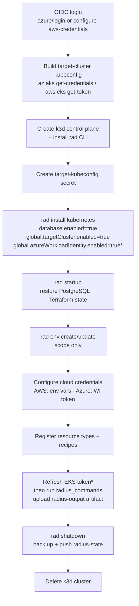

# Repo Radius — Deploy Workflow (Technical Design)

- **Author**: Sylvain Niles (@sylvainsf)
- **Status**: Draft
- **Feature spec**: Repo Radius (Zach Casper) — [PR #12078](https://github.com/radius-project/radius/pull/12078)
- **Issue**: [#12118 Add Repo Radius verify/deploy workflows to the repo](https://github.com/radius-project/radius/issues/12118)
- **Depends on**: [#12106 Multi-cluster deployment v1](https://github.com/radius-project/radius/pull/12106) (merged), [#12214 Repo Radius state storage (`rad startup` / `rad shutdown`)](https://github.com/radius-project/radius/pull/12214), [#12170 Repo Radius verify workflow](https://github.com/radius-project/radius/pull/12170)

## Scope

This document covers **Investment 3 of the Repo Radius feature spec: the Repo Radius workflow
with standardized inputs and outputs** — specifically the `deploy` workflow that runs Radius on
demand inside a GitHub Actions runner. It also documents the companion `verify` workflow (from
[#12170](https://github.com/radius-project/radius/pull/12170)) because the two share a contract
and a home.

The workflows are **templates**: a frontend (the Copilot app, the CLI, etc.) writes a copy into a
user's repository under `.github/workflows/` and dispatches it there. They are not run from the
`radius-project/radius` repository directly. They live at
[`.github/extension/`](../../../.github/extension/) so the contract has a canonical, reviewed home.

Explicitly **out of scope** for this document:

- **Cloud-side OIDC / permission provisioning** — creating the AWS IAM role + trust policy or the
  Entra app registration + federated credential. The workflows *consume* an environment that is
  already federated; standing that up is tracked separately.
- **The state-storage mechanism** (`rad startup` / `rad shutdown`, the `radius-state` git orphan
  branch) — owned by the [state-storage design](../2026-06-repo-radius-state-storage.md).
- **The multi-cluster seam internals** (`global.targetCluster`, the cluster access resolver) —
  owned by the [multi-cluster design](2026-06-multi-cluster.md). This document only describes how
  the workflow *drives* that seam.
- **Mid-run cloud-token refresh** — a known limitation (see [Credential lifetime](#credential-lifetime)),
  deferred to a fast follow.

## Background

Repo Radius runs the Radius control plane on an **ephemeral k3d cluster** inside a GitHub Actions
runner. The cluster is created at the start of a run and destroyed at the end; application
workloads deploy to the developer's **external** AKS/EKS cluster, not the runner cluster. For this
to work, three independent pieces — each landing as its own PR — must be composed by a single
workflow:

| Piece            | Provides                                                                                  | Owner                                                         |
|------------------|-------------------------------------------------------------------------------------------|---------------------------------------------------------------|
| Multi-cluster v1 | `RADIUS_TARGET_KUBECONFIG` seam (chart `global.targetCluster.enabled`)                    | [#12106](https://github.com/radius-project/radius/pull/12106) |
| State storage    | `rad startup` / `rad shutdown` + `database.enabled=true` chart wiring                     | [#12214](https://github.com/radius-project/radius/pull/12214) |
| Workflow (this)  | The orchestration that installs Radius, restores state, runs commands, and persists state | this design                                                   |

An earlier proof of concept validated this end-to-end flow but kept the workflow
as a generated string outside Radius, where the contract it depends on had no
reviewed home and no stability guarantee. Bringing the workflow in-tree gives that
contract a canonical, reviewed home and removes any reliance on an external
project. This design lands the workflow here and adapts it to the merged building
blocks above.

## The dispatch contract (stable; frontends depend on it)

The frontend drives Repo Radius entirely through the GitHub API. The contract is the
`workflow_dispatch` input set plus the GitHub Environment the run binds to.

### Inputs

| Input             | Required | Description                                                                                                                                                                                                     |
|-------------------|----------|-----------------------------------------------------------------------------------------------------------------------------------------------------------------------------------------------------------------|
| `environment`     | Yes      | The GitHub Environment name. Used as the Radius environment name and to bind the job (`environment: ${{ inputs.environment }}`) so its variables and OIDC subject apply.                                        |
| `radius_commands` | Yes      | A single `rad` CLI command string, **or** a JSON-encoded array of command strings run in order. The `rad` prefix is omitted from each command (e.g. `deploy app.bicep` or `["deploy app.bicep", "app graph"]`). |

This matches the feature spec's Step 3 exactly. The single workflow runs arbitrary `rad`
commands; it is **not** deploy-specific. Commands run in order and the run **stops on the first
failure**, then still persists state (below).

### Outputs

Each command's combined stdout/stderr is captured and uploaded as the `radius-output` artifact
(one numbered file per command). Per the feature spec's Step 5, artifacts are readable via the
GitHub API as soon as each upload completes, so the frontend can poll for results incrementally
while the run is still in progress.

### GitHub Environment variables

The workflows read only Actions **variables** (`vars`), never secrets, for cloud configuration. A
provider's branch runs only when its identifying variable (`AZURE_CLIENT_ID` or
`AWS_IAM_ROLE_ARN`) is non-empty; configuring both on one environment is rejected.

| Provider | Variables                                                                                                      |
|----------|----------------------------------------------------------------------------------------------------------------|
| Azure    | `AZURE_CLIENT_ID`, `AZURE_TENANT_ID`, `AZURE_SUBSCRIPTION_ID`, `AZURE_RESOURCE_GROUP`, `RADIUS_K8S_CLUSTER`    |
| AWS      | `AWS_IAM_ROLE_ARN`, `AWS_REGION`, `AWS_ACCOUNT_ID`, `RADIUS_K8S_CLUSTER`, `RADIUS_VPC_ID`, `RADIUS_SUBNET_IDS` |
| Common   | `RADIUS_K8S_NAMESPACE` (target namespace, defaults to `default`)                                               |

### Permissions

`id-token: write` (OIDC), `contents: write` (so `rad shutdown` can push the `radius-state`
branch), and `packages: write` (so container-image recipes can push to GHCR).

## Deploy workflow stages

\* Azure-only / AWS-only steps are skipped when the other provider is configured.

### Why the order matters

- **`rad startup` runs after `rad install` but before any command.** It waits for the
  control-plane PostgreSQL to be ready, then restores both the control-plane databases and the
  Terraform recipe-state Secrets from the previous run, so the first `rad deploy` plans against
  prior state rather than an empty backend.
- **`rad shutdown` runs after the commands, with `if: always()`.** State is persisted even when a
  command fails, so a partially-applied Terraform run is not lost.
- **Credentials are configured after `rad env create`** because the Azure path registers a Radius
  credential against the environment and both paths patch the RP/DE deployments.

## The integration contract (owned by Radius)

### Target cluster — `RADIUS_TARGET_KUBECONFIG`

The workflow builds a kubeconfig for the external workload cluster on the runner and stores it as
the `target-kubeconfig` Secret in `radius-system`. Installing the chart with
`--set global.targetCluster.enabled=true` mounts that Secret into `applications-rp`,
`dynamic-rp`, and `bicep-de` and sets `RADIUS_TARGET_KUBECONFIG` to the mounted path. Radius then
directs recipe execution **and** directly-rendered output resources at that cluster; the Terraform
kubernetes provider follows the same kubeconfig through the cluster access resolver. The Secret's
lifecycle (creation, EKS-token refresh, RBAC) is the workflow's responsibility, not the chart's.
This is the multi-cluster v1 seam; the separate `KUBE_CONFIG_PATH` variable used by
the earlier proof of concept is no longer needed —
the single env var now drives both Bicep and Terraform.

### Cloud credentials — provider-native

Repo Radius stores no long-lived cloud secrets. The two providers use different, provider-native
models:

- **AWS** follows Terraform's model. The workflow does **not** run `rad credential register`.
  The runner's OIDC session credentials are injected into the `applications-rp`, `dynamic-rp`, and
  `bicep-de` pods as environment variables (`AWS_ACCESS_KEY_ID`, `AWS_SECRET_ACCESS_KEY`,
  `AWS_SESSION_TOKEN`, `AWS_REGION`); the AWS SDKs and the Terraform AWS provider read them
  directly.
- **Azure** uses **Workload Identity** — the only path the merged code supports. The chart is
  installed with `global.azureWorkloadIdentity.enabled=true` (which labels the RP/DE pods), the
  client/tenant IDs are registered with `rad credential register azure wi` (the Terraform
  `azurerm` provider fetches them from UCP, and authenticates with `use_oidc=true` and the
  hard-coded token path `/var/run/secrets/azure/tokens/azure-identity-token`), and the workflow
  projects the federated token into that path (below).

In both cases `rad env update` records only the deployment **scope** (AWS region/account, Azure
subscription/resource group), never credentials.

#### Azure Workload Identity on an ephemeral cluster

Normal AKS Workload Identity federates the *cluster's* OIDC issuer and relies on the WI admission
webhook to project an auto-refreshed ServiceAccount token. Neither exists on the runner's k3d
cluster, so the workflow substitutes both:

1. The Entra app registration's federated credential trusts **GitHub's** OIDC issuer
   (`token.actions.githubusercontent.com`), subject `repo:<owner>/<repo>:environment:<name>`,
   audience `api://AzureADTokenExchange`. This is what "set workload identity on the GitHub
   Environment" means.
2. The workflow mints the GitHub Actions OIDC JWT for that audience and writes it to a Secret,
   mounted as a **volume** at `/var/run/secrets/azure/tokens/azure-identity-token` on
   `applications-rp`, `dynamic-rp`, and `bicep-de`, alongside the `AZURE_CLIENT_ID`,
   `AZURE_TENANT_ID`, `AZURE_FEDERATED_TOKEN_FILE`, and `AZURE_AUTHORITY_HOST` env vars the Azure
   SDKs read.

Mounting the token as a Secret volume means the kubelet keeps the file in sync across all three
pods — including the Deployment Engine — with no pod restart, which is why the Azure path needs no
`rollout restart` (unlike the AWS/EKS refresh, below).

#### Credential lifetime

- **Azure** — the GitHub Actions OIDC JWT is short-lived, but the Azure SDKs exchange it **once**
  with Entra for an AAD access token valid ~1 hour, cached in memory. A normal run is unaffected;
  the federated token file is only re-read after the cached AAD token expires. The workflow mints
  the token **once** and does not refresh it: a run whose Azure work outlives that window may fail.
  Refreshing the federated token mid-run is an accepted, deferred fast follow.
- **AWS** — the EKS bearer token is valid ~15 minutes and is used **directly** on every Kubernetes
  API call (no exchange, no caching). The workflow therefore re-mints it and rewrites the
  `target-kubeconfig` Secret immediately before running the commands, then restarts the RP/DE
  deployments to pick it up.

### State persistence — `rad startup` / `rad shutdown`

`rad startup` and `rad shutdown` are kind-agnostic CLI commands that back up and restore all
durable Radius state (control-plane PostgreSQL + Terraform recipe-state Secrets) to a
`radius-state` git orphan branch. They do not manage cluster lifecycle — the workflow owns
creating and destroying the ephemeral control plane around them. The mechanism is the plan of
record; see the [state-storage design](../2026-06-repo-radius-state-storage.md) for details.

## The verify workflow

[`radius-verify-credentials.yml`](../../../.github/extension/radius-verify-credentials.yml)
([#12170](https://github.com/radius-project/radius/pull/12170)) is a separate, lighter
`workflow_dispatch` workflow that confirms a GitHub Environment is wired correctly **before any
deploy**. It authenticates via OIDC, verifies access (`az account show` / `aws sts
get-caller-identity` with the AWS account ID masked), and discovers cloud resources (resource
groups / AKS clusters / locations for Azure; EKS clusters / VPCs / subnets for AWS), uploading them
as the `radius-discovery` artifact for the caller to read back into the environment's variables. It
shares the OIDC-trust prerequisites and the `vars`-only convention with the deploy workflow, which
is why both live under `.github/extension/`. Porting it here lets the contract be exercised without
a full deploy.

## Testing

The gated end-to-end lifecycle test `test/functional-portable/statestore` (behind
`RADIUS_STATE_E2E`) exercises install → deploy a Terraform-backed resource → `rad shutdown` →
teardown → reinstall → `rad startup` → deploy an update. Today it drives install/uninstall itself;
once this workflow lands it should be re-pointed at the workflow's cluster-create + deploy stages
rather than duplicating them.

## Alternatives considered

- **Keep the workflow outside Radius.** Rejected: the contract Radius owns
  (`RADIUS_TARGET_KUBECONFIG`, `rad startup`/`rad shutdown`, the dispatch inputs) would live only
  in a generated string in a separate project, with no review or stability guarantee for the
  frontends that depend on it.
- **Register AWS credentials with `rad credential register`.** Replaced by
  environment-variable injection per the feature spec (aligning AWS with
  Terraform's model); it removes a control-plane round-trip and keeps credentials out of Radius
  state.
- **Inject Azure credentials as env vars like AWS.** Not possible: the merged Azure code paths
  (control-plane `azidentity` and the Terraform `azurerm` provider) only support Workload Identity,
  which requires a projected federated-token file plus a registered WI credential.
- **Refresh the Azure federated token mid-run.** Deferred. The one-time exchange covers ~1 hour,
  which is sufficient for current demo deploys; long-running deploys are an accepted limitation.
