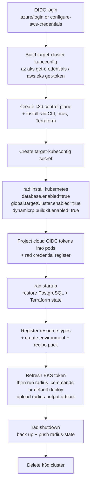

# Repo Radius — Deploy Workflow (Technical Design)

- **Authors**: Shruthi Kannan (@sk593), Sylvain Niles (@sylvainsf)
- **Status**: Draft
- **Feature spec**: Repo Radius (Zach Casper) — [PR #12078](https://github.com/radius-project/radius/pull/12078)
- **Issue**: [#12118 Add Repo Radius verify/deploy workflows to the repo](https://github.com/radius-project/radius/issues/12118)
- **Depends on**: [#12106 Multi-cluster deployment v1](https://github.com/radius-project/radius/pull/12106) (merged), [#12214 Repo Radius state storage (`rad startup` / `rad shutdown`)](https://github.com/radius-project/radius/pull/12214) (merged)

## Scope

This document covers **Investment 3 of the Repo Radius feature spec: the Repo
Radius workflow with standardized inputs and outputs** — the `deploy` workflow
that runs Radius on demand inside a GitHub Actions runner — together with
**Investment 4: cloud credential integration**.

The workflow is a **template**: a frontend (the Copilot app, the CLI, etc.) writes
a copy into a user's repository under `.github/workflows/` and dispatches it
there. It is not run from `radius-project/radius` directly. It lives at
[`.github/extension/`](../../../.github/extension/) so the contract has a
canonical, reviewed home.

Explicitly **out of scope**:

- **Cloud-side OIDC / permission provisioning** — creating the AWS IAM role + trust
  policy or the Entra app registration + federated credential. The workflow
  *consumes* an environment that is already federated; standing that up is tracked
  separately.
- **The state-storage mechanism** (`rad startup` / `rad shutdown`, the
  `radius-state` git orphan branch) — owned by the
  [state-storage design](../2026-06-repo-radius-state-storage.md).
- **The multi-cluster seam internals** (`global.targetCluster`, the cluster access
  resolver) — owned by the [multi-cluster design](2026-06-multi-cluster.md). This
  document only describes how the workflow *drives* that seam.
- **Mid-run cloud-token refresh** beyond the single pre-deploy EKS refresh — a long
  Azure run may outlive the one-time token exchange; refreshing it mid-run is a
  deferred fast follow.

## Background

Repo Radius runs the Radius control plane on an **ephemeral k3d cluster** inside a
GitHub Actions runner. The cluster is created at the start of a run and destroyed
at the end; application workloads deploy to the developer's **external** AKS/EKS
cluster, not the runner cluster. A single workflow composes three independently
landed building blocks:

| Piece            | Provides                                                                                  | Owner                                                         |
|------------------|-------------------------------------------------------------------------------------------|---------------------------------------------------------------|
| Multi-cluster v1 | `RADIUS_TARGET_KUBECONFIG` seam (chart `global.targetCluster.enabled`)                    | [#12106](https://github.com/radius-project/radius/pull/12106) |
| State storage    | `rad startup` / `rad shutdown` + `database.enabled=true` chart wiring                     | [#12214](https://github.com/radius-project/radius/pull/12214) |
| Workflow (this)  | The orchestration that installs Radius, restores state, runs commands, and persists state | this design                                                   |

An earlier proof of concept validated the end-to-end flow but kept the workflow as
a generated string outside Radius, where the contract it depends on had no reviewed
home. Bringing the workflow in-tree gives that contract a canonical home and
removes any reliance on an external project.

## The dispatch contract (stable; frontends depend on it)

The frontend drives Repo Radius through the GitHub API. The contract is the
`workflow_dispatch` input set plus the GitHub Environment the run binds to.

### Inputs

| Input             | Required | Description                                                                                                                                                                                                                                                                                    |
|-------------------|----------|------------------------------------------------------------------------------------------------------------------------------------------------------------------------------------------------------------------------------------------------------------------------------------------------|
| `environment`     | Yes      | The GitHub Environment name. Used as the Radius environment name and to bind the job (`environment: ${{ inputs.environment }}`) so its variables and OIDC subject apply.                                                                                                                       |
| `image`           | No       | Container image for the application, passed to the default deploy as the `image` parameter. Defaults to the commit SHA.                                                                                                                                                                        |
| `radius_commands` | No       | A single `rad` CLI command string, **or** a JSON-encoded array of command strings run in order, with the `rad` prefix omitted (e.g. `deploy .radius/app.bicep` or `["deploy .radius/app.bicep", "app graph"]`). When empty, the workflow runs its default `rad deploy` of `.radius/app.bicep`. |

`radius_commands` is the Investment 3 dispatch contract: it lets a frontend drive
arbitrary `rad` commands through the documented seam rather than being limited to a
single deploy. Commands run in order and the run **stops on the first failure**,
then still persists state (below). `image` is retained as a convenience for the
common single-deploy case and so the workflow remains usable without constructing a
command string.

### Outputs

Each command's combined stdout/stderr is captured and uploaded as the
`radius-output` artifact (one numbered file per command; the default deploy writes a
single file). Per the feature spec's Step 5, artifacts are readable via the GitHub
API as soon as each upload completes, so the frontend can poll for results
incrementally while the run is still in progress. On failure, additional
control-plane and application logs upload as the `radius-logs` artifact.

### GitHub Environment variables

The workflow reads Actions **variables** (`vars`) for cloud configuration; a
provider's branch runs only when its identifying variable (`AZURE_CLIENT_ID` or
`AWS_IAM_ROLE_ARN`) is non-empty.

| Provider | Variables                                                                                                                     |
|----------|-------------------------------------------------------------------------------------------------------------------------------|
| Azure    | `AZURE_CLIENT_ID`, `AZURE_TENANT_ID`, `AZURE_SUBSCRIPTION_ID`, `AZURE_RESOURCE_GROUP`, `AZURE_LOCATION`, `RADIUS_K8S_CLUSTER` |
| AWS      | `AWS_IAM_ROLE_ARN`, `AWS_REGION`, `AWS_ACCOUNT_ID`, `RADIUS_K8S_CLUSTER`, `RADIUS_VPC_ID`, `RADIUS_SUBNET_IDS`                |
| Common   | `RADIUS_K8S_NAMESPACE` (target namespace, defaults to `default`), `RADIUS_BUILD_REGISTRY` (image-build push target)           |

Secrets used: `GHCR_PAT` (or `GITHUB_TOKEN`) for image-build registry auth, and
`RADIUS_DB_PASSWORD` for the optional `password` deploy parameter.

### Permissions

`id-token: write` (OIDC), `contents: write` (so `rad shutdown` can push the
`radius-state` branch), and `packages: write` (so container-image recipes can push
to GHCR).

## Workflow stages

### Why the order matters

- **`rad startup` runs after install but before any command**, so the first deploy
  plans against restored state rather than an empty backend.
- **`rad shutdown` runs after the commands with `if: always()`**, so a
  partially-applied Terraform run is not lost.
- **Credentials are configured after install and before `rad startup`** because both
  the credential registration and the OIDC token projection target the running RP/DE
  pods.

## The integration contract (owned by Radius)

### Target cluster — `RADIUS_TARGET_KUBECONFIG`

The workflow builds a kubeconfig for the external workload cluster on the runner and
stores it as the `target-kubeconfig` Secret in `radius-system`. Installing the chart
with `--set global.targetCluster.enabled=true` mounts that Secret into
`applications-rp`, `dynamic-rp`, and `bicep-de` and sets `RADIUS_TARGET_KUBECONFIG`.
Radius then directs recipe execution **and** directly-rendered output resources at
that cluster; the Terraform kubernetes provider follows the same kubeconfig through
the cluster access resolver. The Terraform **state** backend deliberately stays on
the control-plane cluster. The Secret's lifecycle (creation, EKS-token refresh) is
the workflow's responsibility, not the chart's.

### Cloud credentials — UCP credential + projected OIDC token

Credentials use each provider's native OIDC model, and the cloud identity is
registered with Radius's UCP credential model so it is visible to
`rad credential show`, rotatable, and usable by both the Bicep and Terraform code
paths:

- **AWS (IRSA)** — `rad credential register aws irsa --iam-role <arn>` records the
  role ARN. The workflow mints the GitHub Actions OIDC JWT (audience
  `sts.amazonaws.com`) and projects it into the UCP AWS proxy and the Terraform AWS
  provider pods at the IRSA token path
  `/var/run/secrets/eks.amazonaws.com/serviceaccount/token`.
- **Azure (Workload Identity)** — `rad credential register azure wi --client-id
  --tenant-id` records the identity. The workflow mints the GitHub Actions OIDC JWT
  (audience `api://AzureADTokenExchange`) and projects it at
  `/var/run/secrets/azure/tokens/azure-identity-token`, the path the Go
  `WorkloadIdentityCredential`, the .NET Bicep DE, and the Terraform `azurerm`
  provider read (with `AZURE_FEDERATED_TOKEN_FILE` set for the armauth fallback).

Radius stores only the identity selector; the short-lived token is read at runtime
from the projected file. This intentionally diverges from feature-spec note SN29
("no need for `rad credential` commands") because the IRSA/WI token-file model
genuinely needs the registered credential to perform the federated token exchange.

#### Credential lifetime

- **Azure** — the GitHub Actions OIDC JWT is short-lived, but the Azure SDKs exchange
  it once for an ~1-hour AAD token. The workflow mints it once and does not refresh
  it; a run whose Azure work outlives that window may fail. Refreshing mid-run is a
  deferred fast follow.
- **AWS** — the EKS bearer token used to *reach* the target cluster is ~15 minutes
  and is used directly on every API call, so the workflow re-mints it and rewrites
  the `target-kubeconfig` Secret immediately before running commands, then restarts
  the RP/DE deployments to pick it up.

### State persistence — `rad startup` / `rad shutdown`

`rad startup` and `rad shutdown` are kind-agnostic CLI commands that back up and
restore all durable Radius state (control-plane PostgreSQL + Terraform recipe-state
Secrets) to a `radius-state` git orphan branch pushed to the repo's `origin`. They do
not manage cluster lifecycle — the workflow owns creating and destroying the
ephemeral control plane around them. The mechanism is the plan of record; see the
[state-storage design](../2026-06-repo-radius-state-storage.md).

### Recipe pack and environment

The workflow generates a Bicep file defining a `Radius.Core/recipePacks` resource
that bundles the Kubernetes compute/data recipes (`containers`, `containerImages`,
`persistentVolumes`, `routes`, `postgreSqlDatabases`, `secrets`) plus a
provider-gated `mySqlDatabases` recipe (AWS RDS or Azure Flexible Server), and a
`Radius.Core/environments` resource that references the pack and carries the cloud
provider scope. The `containerImages` recipe builds the application image with the
in-pod BuildKit (`dynamicrp.buildkit.enabled=true`) and pushes it to the configured
registry, authenticated by a Kubernetes Secret created in the app's runtime
namespace.

## Testing

The `test/functional-portable/statestore` lifecycle test (its own isolated
`statestore-noncloud` CI leg) exercises the state path this workflow protects:
install → deploy a Terraform-backed resource → `rad shutdown` → teardown →
reinstall → `rad startup` → deploy an update. It drives `rad install` /
`rad startup` / `rad shutdown` directly with the build under test, hardened against
the install/uninstall flakes seen in the upgrade test (poll for control-plane
readiness treating 503 as retryable; poll discovery until `api.ucp.dev/v1alpha3`
deregisters before reinstalling).

## Alternatives considered

- **Keep the workflow outside Radius.** Rejected: the contract Radius owns
  (`RADIUS_TARGET_KUBECONFIG`, `rad startup`/`rad shutdown`, the dispatch inputs)
  would live only in a generated string in a separate project, with no review or
  stability guarantee for the frontends that depend on it.
- **Deploy-only `image` input (no `radius_commands`).** Rejected as the sole
  contract: it cannot express `app graph` or multi-command flows the spec requires.
  `image` is retained as a convenience alongside `radius_commands`.
- **Inject AWS/Azure credentials as plain env vars instead of registering them.**
  Rejected: the merged code paths read the federated token from a fixed file and
  resolve the identity through the UCP credential, so the registered credential plus
  projected token file is the supported model.
- **Refresh the Azure federated token mid-run.** Deferred; the one-time exchange
  covers ~1 hour, sufficient for current deploys.
