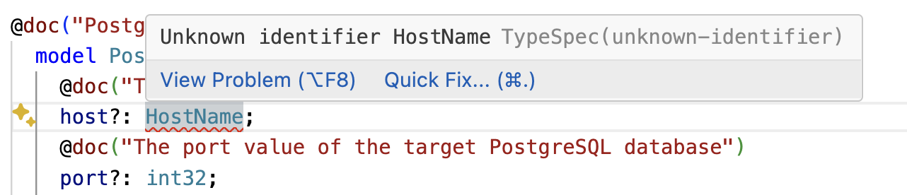
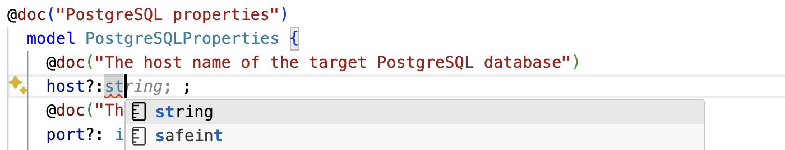

# Resource Extensibility (User Defined Resource Types)

* **Author**: Reshma Abdul Rahim (@reshrahim)

## Summary

Radius is a core component of the internal developer platform for enterprises building cloud native applications. Many enterprises use a wide range of technologies together for achieving their cloud-native strategy. For any technology that’s a newcomer and helps solve a problem in the cloud native landscape, users look for an easy and seamless way to integrate their existing tools and technologies and incrementally adopt the new technology to their strategy. For Radius, we have heard requests from our users/community to support technologies that their applications are tightly coupled with e.g. an internal messaging service or a technology they absolutely love e.g. PostgreSQL/Kafka. Today, Radius provides [`Applications.Core/extenders`](https://docs.radapp.io/guides/author-apps/custom/overview/) to model any kind of service in an untyped way, but they pose limitations for sophisticated enterprises in terms of guardrails and validation that platform engineers want to impose on their developer platform. 

Additionally, we need to enable the open-source community to build and experiment with imperfect things in Radius. This will help us to meet the community where they are and enable them to experiment and leverage their work as open-source contributions. One of the high value extensibility points in Radius is Recipes. Today you can author and contribute Recipes only for a limited set of portable resource types. We need to provide an extensibility model that supports “Bring your own technology”, deploy using Recipes and unblock your scenario with Radius. This feature specification document details on the requirements and the user experience for defining and deploying a custom user defined resource type in Radius.

### Vision 

Our vision for user defined resource types is to enable users to define and deploy any resource type beyond the built-in resource types in Radius. User defined types will provide the following:

- Platform engineers can easily define and deploy their services as user-defined resource types in Radius, adhering to organizational policies within their developer platforms.
- Platform engineers, IT operators, and developers can seamlessly collaborate and maintain the new resource types within user platforms.
- Open-source community contributors have more opportunities to contribute to Radius, enabling them to add new resource types and Recipes, and making these assets available for the community.
- Community contributed assets - new resource type definitions and Recipes are easily discoverable and ready for consumption across the community. This will accelerate the adoption of Radius across the cloud native community.

These new user defined resource types can be :

- Commonly used application components but not yet built into Radius E.g.: PostgreSQL, Kafka etc.
- Enterprise specific services that are tightly coupled with the applications e.g.: on-prem messaging services, internal databases etc.
- Other microservices abstraction that are not yet built into Radius E.g: Networking scopes, service meshes etc

We did the Jobs to be done analysis to gather granular requirements and user needs for the user defined types. More details in the appendix section [below](#user-jobs-to-be-done)

### Top level goals

The top-level goals for the user defined resource types are:

1. Enable Platform engineers to author and register a user defined resource type without having to write Go code to integrate with Radius components and deploy their application seamlessly.
2. Enable Platform engineers and IT operators to build, test, deploy, collaborate and maintain the custom resource types.
3. Enable IT operators and Application developers to automatically leverage Radius features such as Recipes, Connections, App graph, rad CLI for custom resource types.
4. Enable Open-source contributors to contribute and open-source the custom resource types and recipes to the community. 
5. Enable Radius project to leverage the user defined types solution to refactor its already built in resource types.

### Non-goals (out of scope)

We will not cover the design and user experience for "Recipes for any resource" in this document to keep the scope of the work simple.

## User profile and challenges

**Enterprises**: Platform engineering or operations in enterprise focus on streamlining the developer-experience for their organization by defining a set of recommended practices for application teams and provide self-service capabilities for application teams/developers to use. Radius aids the platform engineering efforts with the help of Recipes where the platform engineers or operators define the infrastructure-as-code templates to create resources on demand when application is deployed. One of the major challenges that exists with the Recipes today is the limited number of resources supported. Radius doesn’t provide an extensibility model for users to bring their custom resources, define Recipes and deploy them.

**Open-source community**: Building a sustainable open-source community is crucial to the success of any open-source project, including Radius. We need to cultivate an ecosystem for the open-source community to thrive, innovate and produce high quality work. Users from the community are motivated to contribute for different reasons:
    - They want to use the project at their work and need a feature, 
    - The project triggered their interests in the cloud native landscape and want to use the technology.
    - They want to code in a particular language E.g. :Go
    - They want to integrate their existing tools and technologies with the project

Today Radius enables users to get started on contributing to Radius with good-first-issues but doesn’t have a model to promote contributions further. Since the beginning of its open-source launch, [Dapr](www.dapr.io) created the components repository and invited users to build their own components to unblock their scenarios and in turn folks contributed to the project. Learning from Dapr, Radius needs to have the extensibility points defined for contributors to interact with the project so that they can build out the things that they need to enable their scenarios and in turn the community gets benefitted with those contributions.

### User persona(s)
<!-- Who is the target user? Include size/org-structure/decision makers where applicable. -->

- Platform engineers: Platform engineers are responsible for building internal developer platforms (IDP) for streamlining the developer-experience for their organization by defining a set of recommended practices for application teams and provide self-service capabilities for application teams/developers to use. 

- IT Operators: IT operators are responsible for managing the infrastructure and ensuring that the applications are running smoothly. They are responsible for maintaining the infrastructure and providing support for the infrastructure. They are the primary users of Radius Recipes as they are responsible for defining the infrastructure-as-code templates for the applications.

- System Reliability Engineers (SREs) : SREs are responsible for ensuring the reliability of the applications and services that are deployed in the cloud. They are responsible for maintaining the infrastructure and ensuring that the applications are running smoothly. They are the maintainers of Radius Recipes and provide support for the applications that are deployed. 

- System integrators/Service Providers : System integrators/Service Providers are partners who help enterprises integrate proprietary services with cloud native applications. They are responsible for designing and building cloud native applications on behalf of their customers with the services they provide. They are looking to expand the adoption and support of their services via Radius.

- Developers : Developers are responsible for building the cloud native applications. They are responsible for writing the code, designing and maintaining the applications.

- Open-source contributors : Cloud native open-source contributors can be any of the above personas who are interested in contributing to the cloud native projects. 

### Positive user outcomes

- Author and deploy: I can bring my own applications with custom resources/services and integrate with Radius seamlessly. I don’t have to write Go code to integrate with Radius components and can use simple resource specification to generate the resource definition and integrate with Radius 

- Recipes for user defined types: I can create Recipes for the custom resource types and deploy via Radius 

- OSS contributions: I can create custom resource types and Recipes and open-source it for the community to discover and use.

## Key scenarios

### Scenario 1: Deb integrates the Budgets app with Radius

Deb, a platform engineer at a Financial Services company who is responsible for building the custom internal developer platform. He has started the journey to enable radification one of their Budgets app. The Budgets app relies on an internal messaging service called Plaid. Deb wants to use Plaid as a resource type in Radius to deploy the application seamlessly and leverage all the features of Radius, such as Recipes, Connections, and the rad CLI, with ease and flexibility.

### Scenario 2: Amy contributes and open-sources PostgreSQL support to Radius

Amy is a system integrator who helps customers build cloud native applications on AWS. Amy heard about Radius and starts integrating their customer workloads in Radius. She sees a lot of her scenarios involve PostgreSQL and finds Radius doesn’t support that yet. She wants to contribute the PostgreSQL support to Radius and open source it so anyone can use it

### Scenario 3: Raj publishes Recipes for proprietary services

Raj is a service provider who works at Oracle Database and helps enterprises integrate oracle database to their applications. Raj hears about Radius and wants to write Recipes to create an Oracle Database with a standard set of best practices and policies integrated. He wants to provide these Recipes to his customers for easy entry and integration with Radius.

To keep the scope of the document simple, we will focus on the first scenario in this document. The other scenarios will be covered in the child documents.

## Key dependencies and risks
<!-- What dependencies must we take in order to enable this scenario? -->

<!-- What other risks are you aware of that need to be mitigated. If you have a mitigation in mind, summarize here. -->
<!-- **Dependency Name** – summary of dependency.  Issues/concerns/risks with this dependency -->
<!-- **Risk Name** – summary of risk.  Mitigation plan if known. If it is not yet known, no problem. --> 

- Risk: Adoption and community engagement
    - There is a risk that users may not fully embrace the extensibility feature because it's too complex or not powerful enough.
    - Mitigation: Design with the guiding principle of making it simple and easy to use ; Actively engage with users early-on, provide clear documentation, tutorials and resources.

- Risk: Compatibility and maintainability
    - As more custom resource types are added to Radius, there is a risk of compatibility issues and increased maintenance overhead.
    - Mitigation: Implement thorough testing and versioning strategies to ensure compatibility and establish clear guidelines for maintenance and ownership of the custom resource types.

- Risk: Security and trust
    - Allowing users to contribute custom resource types introduces potential security risks and the need to establish trust in the community-contributed code.
    - Mitigation: Implement strict security measures with handling secrets, functional tests and establish a transparent review process for community contributions.

## Key assumptions to test and questions to answer
<!-- If you are making assumptions that, if incorrect, would cause us to significantly alter our approach to this scenario, make them explicit here.  Also call out how / when you plan to validate key assumptions. -->
<!-- What big questions must we answer in order to clarify our plan for this scenario.  When and how do you plan to answer those questions (prototype feature x, user research, competitive research, etc) -->

- Assumption: Users will find value in the extensibility feature and actively contribute to the community.
- Assumption: Users will use extensibility in lieu of existing extenders because they want to take advantage of things like strong typing and validation in Radius
- Assumption: Service providers of proprietary services will find value in creating and publishing Recipes for their services hoping to increase the adoption of their services.

## Current state 
<!-- If we already have some ongoing investment in this area, summarize the current state and point to any relevant documents. -->

### Current state in Radius

[Radius Extenders](https://docs.radapp.io/guides/author-apps/custom/overview/#extenders) enables users to author custom resource types. They allow you to pass in any property or secret and for cases where the developer/operator need to extend and reference a simple resource type definition. Extenders are for untyped/ weakly typed resources and do not provide a lot of customization for users wanting to have guardrails in their platforms with strongly typed resource definitions following a strict set of rules and restrictions. 

Below is an example extender implementation for PostgreSQL

``` bicep
extension radius

resource extender 'Applications.Core/extenders@2023-10-01-preview' = {
  name: 'postgresql'
  properties: {
    name : 'postgresql'
    sku : 'standard'
  }
}
```
The properties in the extender resource are free form key value pairs. The user can pass in any text as SKU as there are no validation. In a mature enterprise, platform engineers or IT operators want to control the SKU a developer can pass in and provision. They would allow a set of SKUs preventing developers from choosing expensive instances. User defined types will enable the platform engineer to define the resource type definition in a strong typed way with guardrails and validation rules adhering to their organizational policies. 

## User requirements

As a platform engineer, I want to build a custom platform for application development with the following requirements 

- I want to author the resource schema for a set of key technologies for the enterprise applications. The current extenders in Radius do not provide a way to define custom resource types with strongly typed schema and guardrails.
- I want to iterate, test, deploy and ship the custom application platform to my IT operators and developers.
- I want to enable my IT operators to collaborate and maintain the custom resource types within the platform.
- I want my developers to leverage all the features of Radius such as Recipes, Connections, App graph, rad CLI for custom resource types.

## Proposed solution

## Authoring, Registering and Deploying the user-defined types in Radius

Define a schema for the user-defined type that my application uses in Radius. The schema defines the structure and properties of the custom resource type. The resource schema authoring tool provides guidance on auto-completion to help the user author the schema. 

### Schema authoring format

| Schema Format | Why chose? | Why not to choose? | 
|---------------|------------|-------------------|
| OpenAPI YAML/JSON | More common and standard format across the open-source communities ; K8s CRDs follow the structure of Open API  | Managing versions and ensuring backward compatibility is challenging |
| Typespec | Developer friendly; Maintenance and upgrades are easier; Errors and guidance violations at development time | Microsoft developed language; May not be widely adopted by the cloud-native communities ; Yet another language to adopt |

First, we will create a custom YAML format that requires basic user inputs to define the schema for the user defined type in Radius for users to start using the feature. Following that, based on the user feedback we may implement the Typespec authoring experience to provide users with more guidance and validation when authoring the schema.

### User experience

#### Terminologies and concepts

| Terminology | Description | Example |
|-------------|-------------|---------|
|Resource type | A service or technology that can be modeled as a resource | PostgreSQL or AWS S3 or Internal messaging service |
|Resource provider | Resource provider refers to a group of resource types under a common namespace. Resource providers are also entities that implement the group of resource types | Mycompany.Messaging or Applications.Core |

**Note: The user experience detailed below is an illustrative example of how the user interacts with the feature. The actual user experience may vary based on the implementation and will be covered in the child feature spec documents**

1. Deb is a platform engineer at Financial services company and wants to author a custom resource Plaid in Radius

    1. Deb uses the rad CLI to scaffold a `yaml` template definition

        ```bash
        rad resource-provider init Mycompany.Messaging --template-kind yaml
        ```
        A sample `yaml` file is created in the application folder. 

    1. Deb authors the schema for the Plaid resource type 

        ```yaml
        namespace: 'Mycompany.Messaging'
        resourceTypes:
            'Mycompany.Messaging/plaidResource':
                name: 'Name of the resource'
                    description: 'Plaid Messaging service' 
                    properties: 
                    required: ['host', 'port']
                    host:
                        type: 'string'
                        description: 'Hostname'
                    
                    port:
                        type: 'string'
                        description: 'Port''
            ...
        ```
        Radius automatically generates the boilerplate code for the CRUDL operations for the custom resource type Plaid.

    1. Deb chooses a version for the schema

        ```yaml
        namespace: 'Mycompany.Messaging'
        apiVersion: '2024-09-01-preview'
        resourceTypes:
            'Mycompany.Messaging/plaidResource':
                name: 'Name of the resource'
                    description: 'Plaid Messaging service' 
                    properties: 
                    required: ['host', 'port']
                    host:
                        type: 'string'
                        description: 'Hostname'
                    
                    port:
                        type: 'string'
                        description: 'Port''
            ...
        ```

    1. Deb registers the schema in Radius
        
        ```bash
        rad resource-provider register Mycompany.Messaging 
        ```
        Radius complies the schema and registers all the custom resource type including Plaid in UCP

    1. Deb lists the resource types he has in his environment

        ```bash
        rad resource-provider list 
        ```
        Radius lists the resource providers that Deb has registered in his environment

     1. Deb publishes the bicep types to a registry

        ```bash
        rad publish-bicep-types Mycompany.Messaging --registry myregistry
        ```

        The `plaid.yaml` is complied into open API specs; the `index.json` and `types.json` files are generated and published to the registry for the custom resource type Plaid and the new resource provider is added to `bicepconfig.json`

        ```json
        {
            "experimentalFeaturesEnabled": {
                "extensibility": true,
                "extensionRegistry": true,
                "dynamicTypeLoading": true
            },
            "extensions": {
                "radius": "br:biceptypes.azurecr.io/radius:latest",
                "aws": "br:biceptypes.azurecr.io/aws:latest"
                "Mycompany": "br:biceptypes.azurecr.io/mycompany:latest"
            }
        }
        ```
    1. Create a recipe for the custom resource type Plaid

        ```bash
        rad recipe register plaid-dev –resource-type “Mycompany.Messaging/Plaid" --template-kind bicep --template-path "<myregistry>/plaid:latest"
        ```
    1. Create a app.bicep with plaid resource type
        ```bicep
        param plaidName string
        param plaidDescription string
        param plaidQueue string
        resource plaid 'Mycompany.Messaging/Plaid@2024-08-09-preview' = {
            name: plaidName
            properties: {
            recipe:{
                name: 'plaid-dev'
            }
            }
        }
        ```
    1. Deb uses the rad CLI to deploy the application with the custom resource type Plaid
        
        ```bash
        rad deploy app.bicep 
        ```
    The application is deployed with the custom resource type Plaid in Radius. Deb can iterate on the changes, compile and test the application with the custom resource type.

 **Note - This is an illustrative example of how the experience would be with typespec which may be implemented in future based on feedback**
1. Amy is a system integrator who wants to author a custom resource PostgreSQL in Radius

    **Pre-requisites**: User has typespec compiler/CLI installed

    1. Amy uses the rad CLI to scaffold a `typespec` template definition

        ```bash
        rad resource-provider init Application.Datastores --template-kind typespec
        ```
        Radius scaffolds a typespec project for the resource provider `Application.Datastores` with individual typespec files for the resource types. 

    1. Amy authors a typespec schema for the PostgreSQL resource type in typespec format
            
        ```typespec
            import Radius;

            using Radius;
            
            namespace Applications.Datastores;
                    
            @doc("PostgreSQL database")
            model PostgreSQLResource {
            @doc("The name of the database")
            name: string;
            }
            @doc("PostgreSQL properties")
            model PostgreSQLProperties {
                @doc("The host name of the target PostgreSQL database")
                host?: string;
                @doc("The port value of the target PostgreSQL database")
                port?: int32;
                @doc("The username for the PostgreSQL database")
                username?: string;
            }
        ```

    1. VSCode Type spec extension warns Amy on the errors and warnings as he types
        
        

    1. Amy uses auto-completion for the schema and properties

        

    1. Amy chooses a version for the schema

        ```typespec
            import Radius;

            using Radius;
            
            namespace Applications.Datastores;
                    
            @doc("PostgreSQL database")
            model PostgreSQLResource {
            @doc("The name of the database")
            name: string;
            }
            @doc("PostgreSQL properties")
            model PostgreSQLProperties {
                @doc("The host name of the target PostgreSQL database")
                host?: string;
                @doc("The port value of the target PostgreSQL database")
                port?: int32;
                @doc("The username for the PostgreSQL database")
                username?: string;
            }
            enum versions {
                @doc("2024-09-01-preview")
                v2024_09_01_preview: "2024-09-01-preview"
            }
        ```

    1. Amy compiles the typespec schema 
        
        ```bash
        tsp compile
        ```
        The typespec schema is compiled and validated for any errors and warnings

    1. Amy registers the PostgreSQL schema to an existing provider in Radius
    
        ```bash
        rad resource-type create Applications.Datastore/postgreSQL --template-kind yaml -e myenv 
        ```
        The schema is registered to existing namespace `Application.Datastores` in Radius. We will cover the open-sourcing experience, maturity model of the community repository creation for user defined types in a separate design document.

    1. Amy lists the resource types she has in her environment

        ```bash
        rad resource-provider list 
        ```
        Radius lists the resource providers that Amy has registered in her environment

## High level feature Areas

### Authoring user defined types

This feature area covers the authoring experience for the user defined types. The goal is to scaffold a simple schema template for the user with minimal user inputs required to create a user defined type and deploy it in Radius. There will be a deep dive on the authoring experience for the user defined types in the child feature specification document.

### Registration and Deployment of the user defined types

This feature area covers the registration of the user defined types in Radius. This feature would cover defining APIs for the user defined types, updating UCP routing logic, implementing the dynamic resource provider for the user defined types, Bicep support for the generated typespec, deployment engine support for the user defined types, testing and validation of the user defined types. 

### Validation of Radius features for user defined types

Once UDT is enabled end-end in Radius, the Radius features such as Recipes, Connections, App graph, rad CLI are expected to work automatically. This feature area covers the testing and validation of the Radius features for the user defined types.

### Documentation

 End-end-documentation for the custom resource types - Radius provides documentation to the users on how to author, test and deploy the custom resource types in Radius.

1. Schema samples and documentation - Provide samples and documentation for the users to author the schema for the custom resource types in Radius
1. Guidance on API versioning - Provide guidance on how to version the custom resource types in Radius
1. Documentation for generating Radius-Bicep types - Reuse existing pipelines and GitHub workflows used in Radius to generate Radius types in Bicep as an example and provide documentation to the users on how to build and publish the custom resource types in Radius.

## Appendix

### User Jobs to be done

As a platform engineer trying to build a custom platform for application development, I have the following jobs to be done and requirements to meet:

#### Main job : Build a custom platform for application development

|  Related jobs | Functional aspects | Emotional aspects | 
| ------------- | ------------------ | ----------------- | 
| Define the set of key technologies for the enterprise applications | Set of technologies that organizations intend to use for their applications based on the nature of technology, open-source support, documentation support, existing vendor relations, expertise in the team | Easy to use, troubleshoot, sense of service ownership |
| Specify the contract for the key services in the application platform | Author a schema for the custom resources easily with auto guidance tools | Simple tools that enable the schema authoring, uniformity and consistency |
| Iterating and testing the application platform | Productive inner loop for development and testing the application platform | Simple and easy way to iterate on changes, test and deploy them |
| Ship the custom platform | Registering the APIs to the platform, providing documentation, onboarding and support | intuitive, seamless, collaborative |
| Maintain the custom platform | Versioning and maintaining the APIs | Ease of support, sense of ownership (decision-making) | 
| Support for compliance and security | Compatibility and security policies | Trust the platform |

As an IT operator managing the custom platform, I have the following jobs to be done and requirements to meet:

#### Main job : Manage the custom application platform

|  Related jobs | Functional aspects | Emotional aspects | 
| ------------- | ------------------ | ----------------- |
| Manage and deploy the custom resources in the application platform | Create a IaC template for the custom resource type with compliance and other policies | Easy to author, test and deploy |
| Maintain the application over time | Versioning of the custom resources and enabling automatic upgrades | Less overhead to maintain |

As a developer trying to build and maintain the application, I have the following jobs to be done and requirements to meet:

#### Main job : Use the custom platform to build and maintain the application

|  Related jobs | Functional aspects | Emotional aspects | 
| ------------- | ------------------ | ----------------- | 
| Use the custom app platform to build my application  | Learn, define and consume the APIs | Easy to use, adopt, low concept count | 
| Deploy the custom resources in the application platform| Deploy the custom resource type with compliance and other policies as part of the application | Easy to author, test and deploy |  
| Troubleshoot the custom application platform | Tools or experiences in Dashboard that enables users to troubleshoot and manage the custom resources | Immediate access to key data for troubleshooting, simple and intuitive |

#### Main job : Open-source custom resources and contribute to the community

|  Related jobs | Functional aspects | Emotional aspects | 
| ------------- | ------------------ | ----------------- |
| Open sourcing templates | Repository and pipeline to validate, testing the infrastructure and publishing  | Desire to contribute, easy to use, low overhead /dependency to publish |
| Maintenance and support of open-source templates | Ownership and maintenance model of the open-source templates | Sense of ownership, contribution to the community |

### Phasing of the feature specification documents

| Topic | Description |
|-------|-------------|
| Resource extensibility feature spec | This document covers the high-level requirements and user experience for defining and deploying a custom user defined resource type in Radius. |
| Resource schema authoring | The document will cover the user experience for authoring the schema in `yaml` and `typespec format`, API versioning, auto-completion, error validation, testing and validation of the schema |
| Contribution and open-sourcing of the custom resource types | The document will cover the maturity model and end-end experience of the community repository creation for user defined types, pipeline validation, testing, publishing and discovery of the custom resource types to the community |
