# GitHub Radius Feature Specification

GitHub Radius is a prototype version of Radius directly integrated into GitHub repositories and GitHub Copilot. It is built using:

- Open-source Radius with optimizations for running in GitHub Actions

- Agents, skills, and/or MCP servers for integration with GitHub Copilot

- Mock-up integration with the GitHub GUI

GitHub Radius enables GitHub users to define applications and environments within their GitHub repository, and to deploy applications directly from the GitHub GUI to AWS and Azure.

The GUI is built using a mock-up of the GitHub GUI. In the fullness of time, the GUI UX will also be implemented in the Radius Dashboard and Headlamp.

## User Journeys

There are several top-level user journeys in scope for this prototype:

1. As an open-source developer, I want to deploy an application stored in a public GitHub repository to my cloud environment. I expect GitHub Radius to build and deploy the application:
    1. Using AWS
    1. Using Azure

1. As a developer, I want to define multiple environments in my GitHub repository and deploy to each environment.

1. As a developer, I expect GitHub Radius to visually highlight where my code changes were made and the impact of the change in pull request and diffs.

The following user journeys are out of scope for the initial prototype, but will be in scope in the future:

- As an open-source developer, I want to deploy an application stored in a public GitHub repository to my cloud environment. I expect GitHub Radius to build and deploy the application using <u>Google Cloud</u>.

- As a developer, I want to use GitHub Copilot to build a new application from scratch. I expect Copilot to create a GitHub
    repository then deploy and test the application in my cloud environment.

- As a developer, I want to transition from using GitHub Radius, to a self-hosted, Kubernetes version of Radius.

## User Journey 1.1: Deploy an open-source application to AWS

### Step 1: Discovery

1. The user visits a public repository on GitHub and decides to deploy it to their AWS account. They see a Deploy button, and Applications, Environments, and Deployments in the sidebar.

    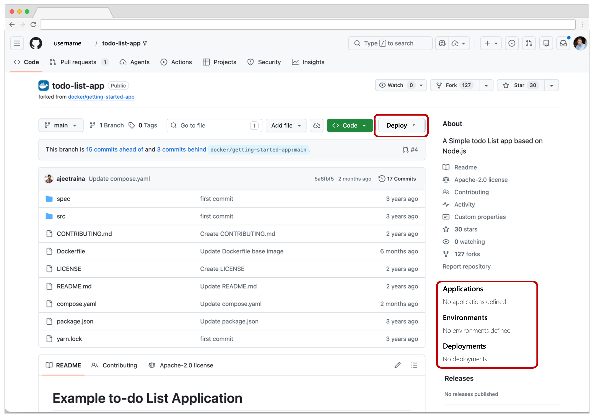

1. The user clicks on the **Deploy** button to discover what this Deploy feature could be.

    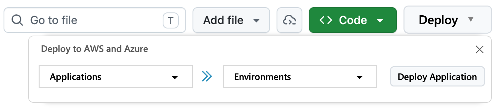

###  Step 2: Defining an application

1. The user clicks **Define an application**.

    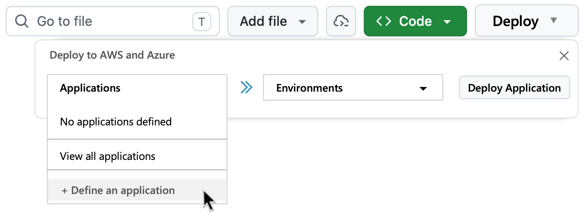

1. In the background, Copilot reads the Radius platform constitution. This is a markdown file which instructs Copilot on how to model cloud-native applications. The Radius platform constitution is maintained by the Radius team and cannot be customized for now. The constitution has the following sections:

    - **Application architecture patterns**. A set of pre-defined architectural patterns. The purpose of these patterns is to prevent arbitrary architectures and ensure applications are composable using existing resource types. This will likely include:
      - Stateless web/API service
          - Stateful/database-backed application
      - Event-driven application
          - Batch job
          - Streaming/real-time processing application
    - **Resource types**. The set of resource types to use when constructing an application. The purpose is to standardize resource abstractions across cloud platforms. In the Radius constitution, this will likely be a link to a manifest of pre-defined Radius Resource Types.
    - **Resource composition rules**. For each Resource Type, a set of rules that define how resources can be combined. For example, a web service can connect to a database, but not the reverse.
    - **Resource dependencies**. For each Resource Type, a set of rules that define required dependencies. For example, a Container requires there to be a container image, an OCI registry, and a Kubernetes cluster. A MySQL database requires there to be a virtual network.
    - **Naming conventions**. Guidance for naming the Bicep symbolic name and the actual resource name.
    - **Secrets**. Defines how to properly handle secrets and how to generate secret values.
    
    Radius then identifies the resources required by this application and outputs an `app.bicep` file in the  `.radius` directory.
    
1. The user is taken to the application definition.

    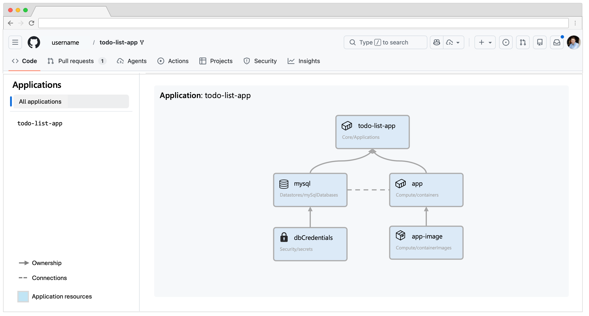

1. The user can click on each resource and drill into the source code and the application definition.

    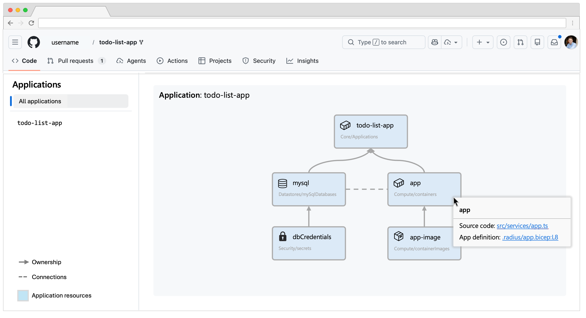

1. The user clicks back to the main repository page.
   
###  Step 3: Defining an AWS environment
1. The user clicks on Environments and sees options for creating AWS, Azure, or Google Cloud environments. The user clicks **Define an AWS environment**.

    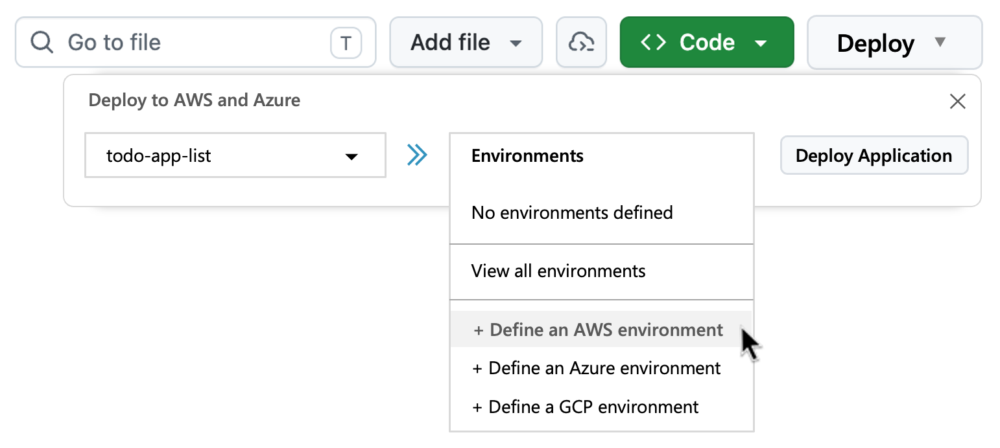

1. A new window opens for creating an AWS environment.

    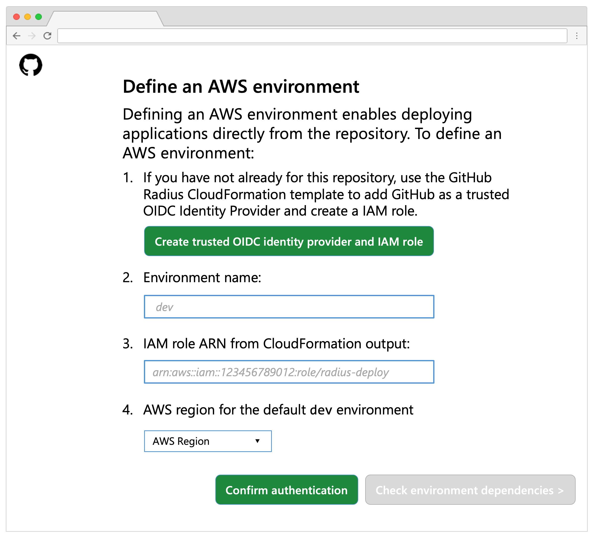

1. The user clicks **Create trusted OIDC identity provider and IAM  role**. The AWS console opens in a new window. The user is  prompted to login to their account.

    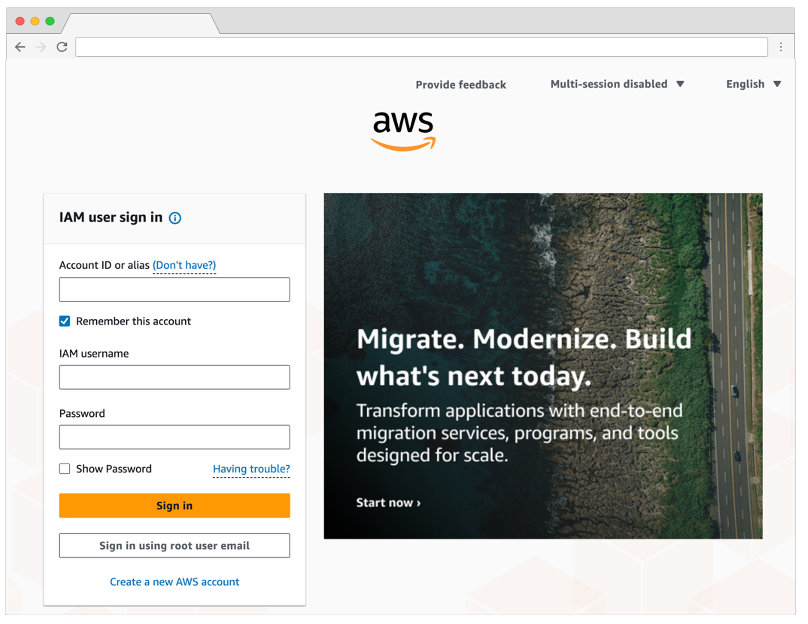

1. A CloudFormation stack is opened. The user reviews the stack then  clicks Create stack.

    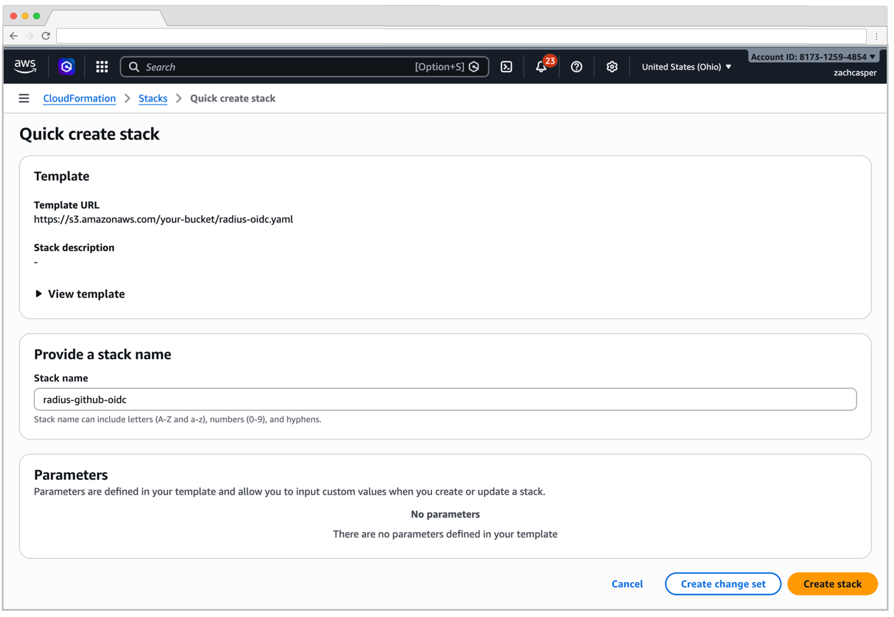

    This CloudFormation stack is stored in a Radius-maintained S3 bucket. It creates an IAM OIDC Identity Provider, similar to running this command:

    ```bash
    aws iam create-open-id-connect-provider \
      --url https://token.actions.githubusercontent.com \
      --client-id-list sts.amazonaws.com \
      --thumbprint-list 6938fd4d98bab03faadb97b34396831e3780aea1
    ```

    This registers GitHub Actions as a trusted identity provider. The CloudFormation stack also creates an IAM role similar to this
    command:

    ```bash
    aws iam create-role --role-name radius-{owner}-{repo} \
      --assume-role-policy-document <trust-policy>
    ```

    The trust policy is similar to:

    ```json
    {
      "Version": "2012-10-17",
      "Statement": [
        {
          "Effect": "Allow",
          "Principal": {
            "Federated": "arn:aws:iam::{account}:oidc-provider/token.actions.githubusercontent.com"
          },
          "Action": "sts:AssumeRoleWithWebIdentity",
          "Condition": {
            "StringEquals": {
              "token.actions.githubusercontent.com:aud": "sts.amazonaws.com"
            },
            "StringLike": {
              "token.actions.githubusercontent.com:sub": "repo:{owner}/{repo}:*"
            }
          }
        }
      ]
    }
    ```

1. The user returns to the *Create an AWS environment* page. They enter the environment name, IAM role ARN, select the region, then click **Confirm authentication**.

    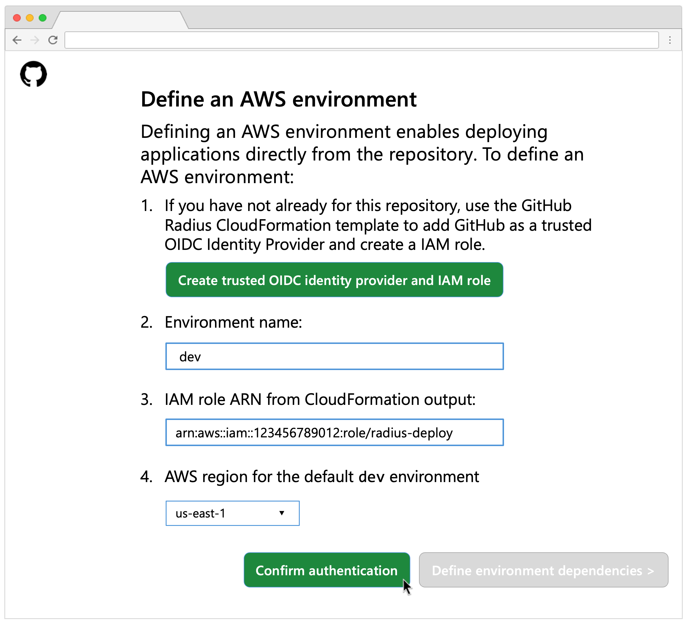

    When the user clicks Confirm authentication:

    - A GitHub environment is created in the repository
    - Metadata is added to the environment, possibly as an environment-level variable, including:
      - AWS Account ID
      - AWS Region
      - AWS IAM Role ARN
    - A workflow is dispatched which performs an AWS login test and confirms the adequate IAM permissions are available

1. While the workflow is running, there is a visual indication that it is running in the background. Once complete the *Define environment dependencies >* button is enabled. The User clicks **Define environment dependencies >** button.

###  Step 4: Defining environment dependencies

1. Radius prompts the user for common environment dependencies. These dependencies should cover the majority of cloud-native applications. However, in the future, this will need to be made more extensible. Today, these include:

    - Container platform: provide a dropdown box of EKS and ECS clusters in the account/region and prompt for the Kubernetes namespace
    - OCI registry: provide a dropdown box with (1) this repositories GHCR, and (2) the ECR registry for that account/region
    - VPC: a dropdown box with the VPC in that account/region
    - Subnets: a dropdown box with the subnets available for the selected VPC

    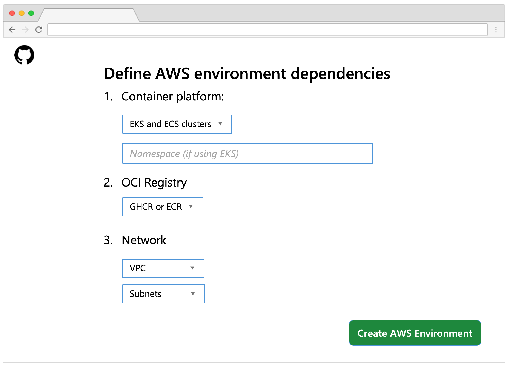

    Radius prepopulates the drop-down boxes with valid values by making API calls to list relevant resources from the user's AWS account. For example, the list of EKS clusters is prepopulated for the user to select from (however namespace is left blank since there is no AWS API call to list Kubernetes namespaces).

1. The user clicks **Create AWS Environment** then returns to the GitHub repository. In the background, a GitHub Environment is created with environment variables use to store the collected metadata.

1. The user is returned the main repository page.

###  Step 5: Deployment

1. The user clicks **Deploy** again and selects the todo-list-app application and dev environment then clicks **Deploy Application**.

    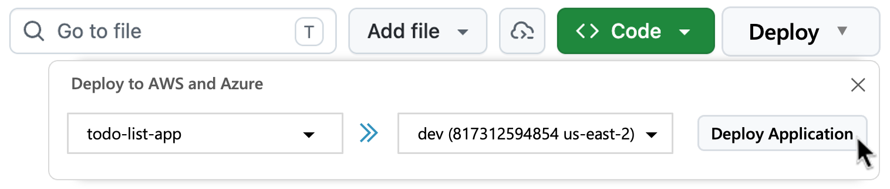

1. The user is taken to the deployment status page. Resources queued for deployment are marked in gray. Resources being deployed are yellow. Resources successfully deployed are green. Resources that failed to deploy are red.

    

1. Once a cloud resource has been deployed, they can click on it and see a deep link to the AWS console for that specific resource.

    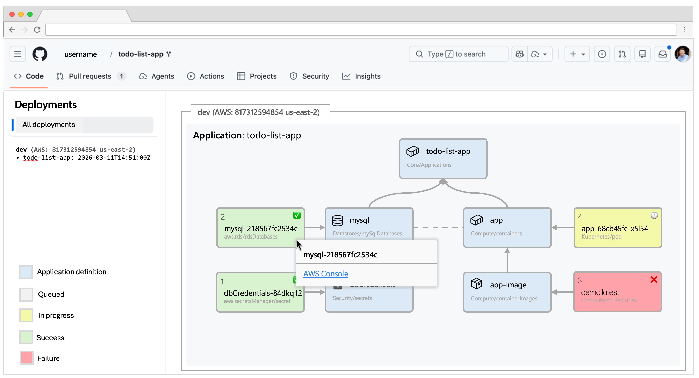

1. If there is an error, the user can click on the resource to see the deployment error.

    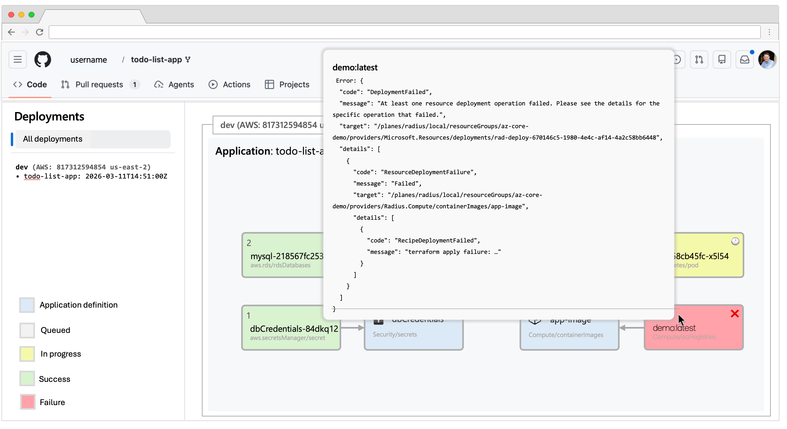

1. When the user returns to the main repository page, they now see an application and environment defined, and the deployment in the sidebar.

    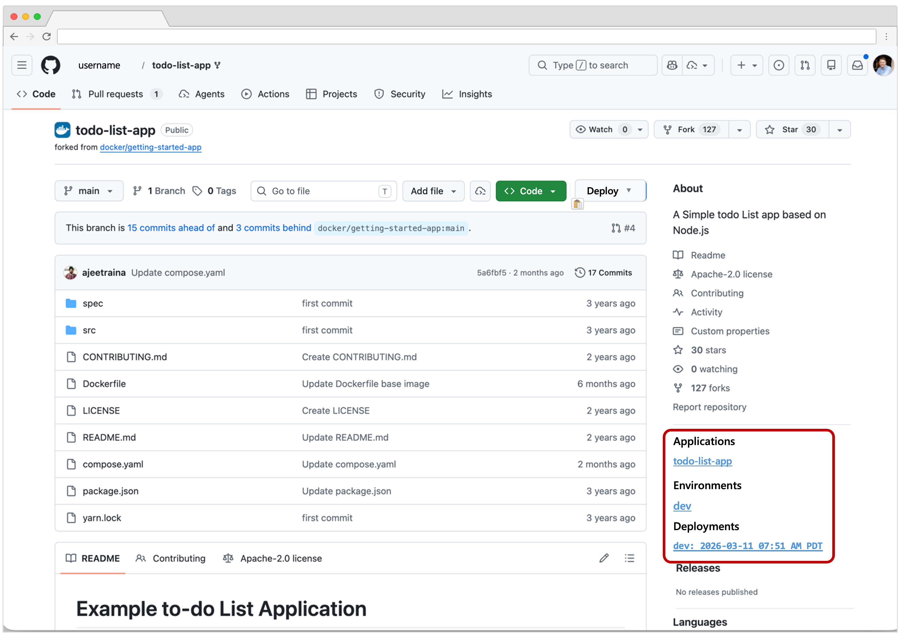


###  
