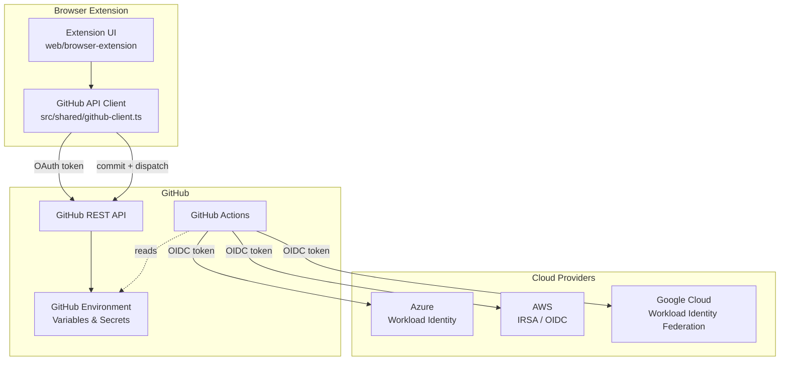

# GitHub OIDC Credential Configuration for Radius

* **Author**: Shruthi Kumar (@sk593)

## Overview

The GitHub OIDC Credential Backend enables Radius deployments through GitHub Actions by managing cloud credentials (Azure, AWS, and Google Cloud) as GitHub Environment variables. Instead of storing credentials in Radius, the browser extension configures GitHub Environments directly via the GitHub REST API with the information needed for GitHub Actions workflows to authenticate with cloud providers via OIDC (OpenID Connect) token exchange at deploy time. No separate server is required.

This removes the need for long-lived secrets in most configurations and automates the `rad credential register` step.

## Terms and definitions

| Term | Definition |
|------|-----------|
| **OIDC** | OpenID Connect — an identity layer on top of OAuth 2.0 used for token-based authentication between GitHub Actions and cloud providers. |
| **Workload Identity (Azure)** | Azure AD federated identity credentials that trust GitHub's OIDC issuer, allowing GitHub Actions to obtain Azure tokens without a client secret. |
| **IRSA** | IAM Roles for Service Accounts — AWS mechanism for federating GitHub Actions OIDC tokens to an IAM role. |
| **Workload Identity Federation (GCP)** | Google Cloud mechanism that allows external identities (GitHub Actions) to impersonate a service account via OIDC. |
| **GitHub Environment** | A GitHub deployment target with protection rules and associated variables/secrets. |
| **Federated Identity Credential** | A trust relationship on an Azure AD application that accepts OIDC tokens from a specific issuer and subject. |

## Objectives

### Goals

- Automate Radius deployments through GitHub Actions so users never need to manually run `rad credential register`. The deploy workflow handles registration automatically using OIDC credentials.
- Support OIDC-based authentication for Azure (Workload Identity), AWS (IRSA), and Google Cloud (Workload Identity Federation).
- Store cloud credential configuration in GitHub Environments — Radius does not persist credentials.
- Provide a credential verification workflow that validates cloud access after setup.
- Support both automated federated credential creation (Azure) and manual OIDC trust setup.

### Non goals

- **Credential storage in Radius**: This backend does not store or manage credentials in Radius UCP or the Radius credential store. Credentials flow from GitHub Environment variables at deploy time.
- **Non-GitHub CI/CD systems**: This design is specific to GitHub Actions. Support for GitLab CI, Azure DevOps, etc. is out of scope.
- **UI implementation**: The OIDC credential configuration is implemented in the browser extension. The design of the extension UI itself is out of scope for this document.
- **Google Cloud implementation**: GCP support is designed but not yet implemented in this PR. It will follow the same pattern as Azure and AWS.

### User scenarios

#### User story 1: AWS OIDC setup

A developer wants to deploy a Radius application to AWS from a GitHub repository. They create an IAM role with an OIDC trust policy for GitHub Actions, then use the browser extension to configure a GitHub Environment with the role ARN and region. A verification workflow confirms cloud access.

#### User story 2: Azure Workload Identity setup

A developer configures an Azure deployment environment. They provide a tenant ID, client ID, and subscription ID. The extension creates the GitHub Environment and stores the configuration as variables. The user creates the federated identity credential manually in the Azure portal.

#### User story 3: Google Cloud Workload Identity Federation setup (future)

A developer configures a GCP deployment environment by providing a Workload Identity Provider resource name and a service account email. The extension stores these as GitHub Environment variables. The deploy workflow uses `google-github-actions/auth` to exchange the GitHub OIDC token for GCP credentials.

## User Experience

The browser extension calls the GitHub REST API directly using the user's OAuth token. For each cloud provider, it creates a GitHub Environment and sets the required variables.

| Provider | Required Fields |
|----------|----------------|
| AWS | `name`, `roleARN`, `region` |
| Azure | `name`, `tenantID`, `clientID`, `subscriptionID`, `authType` |
| GCP (future) | `name`, `workloadIdentityProvider`, `serviceAccountEmail`, `projectID`, `region` |

Each operation returns an `EnvironmentResponse` indicating which GitHub Environment variables were set and whether credentials have been verified.

### Credential Verification

The browser extension commits a verification workflow to the repository and triggers it via `workflow_dispatch`. The workflow authenticates with the cloud provider via OIDC and runs a simple access check:

| Provider | Verification Command |
|----------|---------------------|
| AWS | `aws sts get-caller-identity` |
| Azure | `az account show` |
| GCP (future) | `gcloud auth print-identity-token` |

## Design

### High Level Design

The browser extension acts as the orchestration layer, calling the GitHub REST API directly using the user's OAuth token. No separate backend server is required.

```
┌─────────────────┐     ┌────────────────┐     ┌────────────────┐
│  Browser       │────▶│  GitHub API    │────▶│  GitHub        │
│  Extension     │     │  (REST v3)     │     │  Environment   │
└─────────────────┘     └────────────────┘     │  Variables     │
                                                  └────────┬───────┘
                                                           │
                                                           ▼
                                                  ┌────────────────┐
                                                  │  GitHub Actions│
                                                  │  Deploy/Verify │
                                                  │  Workflow      │
                                                  └───────┬────────┘
                                                          │
                                                   OIDC token exchange
                                                          │
                                     ┌────────────────┼────────────────┐
                                     ▼                ▼                ▼
                               ┌──────────┐   ┌──────────┐   ┌──────────┐
                               │  Azure   │   │  AWS    │   │  GCP    │
                               └──────────┘   └──────────┘   └──────────┘
```

### Architecture Diagram



### Detailed Design

#### OIDC Token Exchange Model

All three cloud providers follow the same fundamental pattern:

1. **Setup time**: A trust relationship is configured on the cloud provider's identity platform to accept OIDC tokens from GitHub's issuer (`https://token.actions.githubusercontent.com`) for a specific subject (e.g., `repo:owner/repo:environment:dev`).
2. **Deploy time**: The GitHub Actions runner requests an OIDC token from GitHub, then exchanges it with the cloud provider for short-lived credentials.
3. **No long-lived secrets**: The OIDC token is fresh each run and scoped to the specific workflow/environment.

#### Azure: Workload Identity

**GitHub Environment Variables Set:**
- `AZURE_TENANT_ID`
- `AZURE_CLIENT_ID`
- `AZURE_SUBSCRIPTION_ID`

**OIDC Trust Configuration:**
A federated identity credential is created on the Azure AD application via the Microsoft Graph API:

```json
{
  "name": "radius-{repo}-{environment}",
  "issuer": "https://token.actions.githubusercontent.com",
  "subject": "repo:{owner}/{repo}:environment:{environment}",
  "audiences": ["api://AzureADTokenExchange"]
}
```

The user creates the federated identity credential manually in the Azure portal, or it can be automated via a GitHub Actions workflow in a future PR.

**Deploy Workflow Step:**
```yaml
- name: Azure Login (OIDC)
  uses: azure/login@v2
  with:
    client-id: ${{ vars.AZURE_CLIENT_ID }}
    tenant-id: ${{ vars.AZURE_TENANT_ID }}
    subscription-id: ${{ vars.AZURE_SUBSCRIPTION_ID }}
```

**Fallback — Service Principal:**
When `authType` is `ServicePrincipal`, the client secret is stored as a GitHub Environment secret (`AZURE_CLIENT_SECRET`). This is the only case where a long-lived secret is stored.

#### AWS: IRSA / OIDC

**GitHub Environment Variables Set:**
- `AWS_IAM_ROLE_ARN`
- `AWS_REGION`

**OIDC Trust Configuration:**
The IAM role must have a trust policy that allows the GitHub OIDC provider. Radius provides a CloudFormation template (`deploy/aws/github-oidc-role.yaml`) that creates the OIDC Identity Provider and IAM role with the correct trust policy and permissions for Radius deployments. Users can deploy it via the AWS Console (CloudFormation quickcreate link): 

```json
{
  "Effect": "Allow",
  "Principal": {
    "Federated": "arn:aws:iam::{account}:oidc-provider/token.actions.githubusercontent.com"
  },
  "Action": "sts:AssumeRoleWithWebIdentity",
  "Condition": {
    "StringEquals": {
      "token.actions.githubusercontent.com:sub": "repo:{owner}/{repo}:environment:{environment}"
    }
  }
}
```

**Deploy Workflow Step:**
```yaml
- name: Configure AWS Credentials (OIDC)
  uses: aws-actions/configure-aws-credentials@v4
  with:
    role-to-assume: ${{ vars.AWS_IAM_ROLE_ARN }}
    aws-region: ${{ vars.AWS_REGION }}
```

#### Google Cloud: Workload Identity Federation (future)

**GitHub Environment Variables to Set:**
- `GCP_WORKLOAD_IDENTITY_PROVIDER` — full resource name of the Workload Identity Provider
- `GCP_SERVICE_ACCOUNT_EMAIL` — the GCP service account to impersonate
- `GCP_PROJECT_ID`
- `GCP_REGION`

**OIDC Trust Configuration:**
The user creates a Workload Identity Pool and Provider in GCP that trusts GitHub's OIDC issuer, then grants the `roles/iam.workloadIdentityUser` role on the service account to the pool principal:

```
principalSet://iam.googleapis.com/projects/{project-number}/locations/global/workloadIdentityPools/{pool}/attribute.repository/{owner}/{repo}
```

**Deploy Workflow Step:**
```yaml
- name: Authenticate to Google Cloud (OIDC)
  uses: google-github-actions/auth@v2
  with:
    workload_identity_provider: ${{ vars.GCP_WORKLOAD_IDENTITY_PROVIDER }}
    service_account: ${{ vars.GCP_SERVICE_ACCOUNT_EMAIL }}
```

#### Advantages

- **No long-lived secrets** for Azure WI, AWS IRSA, and GCP WIF — OIDC tokens are short-lived and scoped.
- **Credentials live in GitHub** — credential configuration stored as GitHub Environment variables. The deploy workflow reads them and calls `rad credential register` automatically on the ephemeral Radius installation.
- **Uniform pattern** across all three providers — same backend API shape, same GitHub Environment variable model.
- **Verification workflow** provides confidence that credentials work before deploying.

#### Disadvantages

- **Azure federation is manual** — the user must create the federated identity credential in the Azure portal. Automation via a GitHub Actions workflow is planned for a future PR.
- **AWS/GCP trust setup is manual** — the extension cannot create IAM roles or Workload Identity Pools; users must do this themselves (a CloudFormation template is provided for AWS).
- **GitHub Environment variables are plaintext** — only secrets are encrypted. Role ARNs, tenant IDs, etc. are visible to anyone with repo read access.

#### Proposed Option

Use the OIDC-based approach for all three providers, with GitHub Environments as the credential configuration store. This is the approach implemented in this PR (Azure and AWS), with GCP to follow.

### API Design

The browser extension calls the GitHub REST API directly. No custom backend API is required. Key GitHub API endpoints used:

| Method | GitHub API Path | Purpose |
|--------|----|---|
| `PUT` | `/repos/{owner}/{repo}/environments/{name}` | Create GitHub Environment |
| `POST` | `/repositories/{id}/environments/{name}/variables` | Set environment variable |
| `PUT` | `/repositories/{id}/environments/{name}/secrets/{name}` | Set encrypted secret |
| `PUT` | `/repos/{owner}/{repo}/contents/{path}` | Commit workflow files |
| `POST` | `/repos/{owner}/{repo}/actions/workflows/{id}/dispatches` | Trigger verification/deploy |
| `GET` | `/repos/{owner}/{repo}/actions/workflows/{id}/runs` | Poll workflow status |

### CLI Design

N/A — OIDC configuration is done via the browser extension, not the `rad` CLI.

### Implementation Details

#### Package Structure

| Package | Responsibility |
|---------|---------------|
| `web/browser-extension/src/shared/github-client.ts` | GitHub API client — environment CRUD, variables, secrets, workflow commit/dispatch |
| `web/browser-extension/src/shared/api.ts` | Token storage and client factory |
| `web/browser-extension/src/popup/` | Extension UI — credential setup wizard |
| `web/browser-extension/src/content/` | Content script — inject Deploy button on GitHub pages |
| `web/browser-extension/src/background/` | Service worker — message passing, caching |
| `deploy/aws/github-oidc-role.yaml` | CloudFormation template for AWS OIDC setup |

#### Credential Registration Flow

1. User enters credential configuration in the browser extension.
2. Extension calls the GitHub REST API to create the GitHub Environment.
3. Extension sets environment variables via the GitHub API.
4. (Azure SP only) Extension encrypts the client secret with NaCl sealed box and stores it as a GitHub Environment secret.
5. Extension commits provider-agnostic workflows (verify + deploy) if not already present.
6. Extension returns the result to the UI.

Workflows (verify + deploy) are committed once at app definition time via `Verifier.CommitAllWorkflows`. They are provider-agnostic — both Azure and AWS steps are included, gated by `if:` conditions that check which GitHub Environment variables are set. Subsequent calls are no-ops if the files already exist.

#### Verification Flow

1. User clicks "Verify Credentials" in the extension.
2. Extension checks if the verification workflow already exists. If not, it commits it.
3. Extension triggers the workflow via `workflow_dispatch`.
4. The workflow runs OIDC login and a provider-specific access check.
5. Extension polls the workflow run status until `success` or `failure`.

### Error Handling

| Scenario | Handling |
|----------|---------|
| Invalid credentials format | Validation in extension UI before API calls |
| GitHub API rate limit | Error displayed to user with retry option |
| GitHub Environment creation fails | Error displayed with GitHub API error details |
| Verification workflow fails | Status returned as `"failure"` with workflow run URL for debugging |
| No GitHub token configured | Extension prompts user to enter token |

## Test plan

### Manual Testing

- Load extension in Chrome, enter GitHub token, create AWS/Azure environments on a test repo
- Verify GitHub Environment and variables are created correctly
- Trigger credential verification workflow and confirm it passes
- Test with Service Principal auth type to verify secret encryption

### CI Workflow

`.github/workflows/test-github-oidc-integration.yaml` runs on PRs that change `web/browser-extension/`:

| Job | Description |
|-----|-------------|
| TypeScript Build | `npm run build` — verify extension compiles |
| Extension Lint | TypeScript strict mode checks |

## Security

- **OIDC by default**: Workload Identity (Azure), IRSA (AWS), and Workload Identity Federation (GCP) eliminate long-lived secrets for most configurations.
- **GitHub Secrets encryption**: Service Principal client secrets are encrypted using NaCl sealed box (via tweetnacl) before storage via the GitHub API.
- **No credential logging**: Sensitive fields (client secrets, access tokens) are never logged or persisted in extension storage.
- **Token stored in local storage**: The GitHub token is stored in `chrome.storage.local` and persists across browser restarts. GitHub App user tokens expire after 8 hours, and the extension automatically clears expired tokens on 401 responses.
- **Scoped OIDC subjects**: Federated credentials are scoped to specific `repo:owner/repo:environment:name` subjects, preventing cross-repository token abuse.
- **No backend server**: All API calls go directly from the extension to `api.github.com` over HTTPS, reducing the attack surface.

## Compatibility

This feature is additive and does not modify existing Radius credential registration, UCP, or deployment flows. Existing `rad credential register` workflows continue to work unchanged.

## Monitoring and Logging

- Extension logs errors to the browser console.
- Sensitive fields are excluded from all log output.
- GitHub API errors include status code and rate limit information.

## Development plan

1. **PR 1 (this PR)**: Browser extension with direct GitHub API calls for Azure and AWS OIDC credential setup, verification workflow, CloudFormation template.
2. **PR 2**: Google Cloud Workload Identity Federation support.
3. **PR 3**: Azure federated credential auto-creation via a GitHub Actions workflow (replaces MS Graph call from Go backend).

## Open Questions

1. **GCP auto-federation**: Should the extension support automatic Workload Identity Pool/Provider creation via a GitHub Actions workflow, or is manual setup sufficient?
2. **Azure federation automation**: The Go backend previously auto-created federated identity credentials via MS Graph. This should be moved to a GitHub Actions workflow that the extension can trigger.
3. **Multi-environment coordination**: Should the extension support linking multiple cloud providers to a single GitHub Environment (e.g., both AWS and Azure)?

## Alternatives considered

### Store credentials in Radius UCP

Credentials could be stored in the Radius credential store via manual `rad credential register` calls by the user. This was rejected because:
- It adds manual steps that can be automated by the deploy workflow.
- It requires users to have a running Radius control plane during initial setup.

### Use GitHub repository secrets instead of Environment variables

Repository-level secrets could store credentials. This was rejected because:
- Environment variables provide environment-scoped isolation (dev, staging, prod).
- GitHub Environment protection rules add approval workflows.
- Environment variables are readable (not write-only like secrets), enabling status checks.

## Design Review Notes

<!-- Update this section with the decisions made during the design review meeting. This should be updated before the design is merged. -->