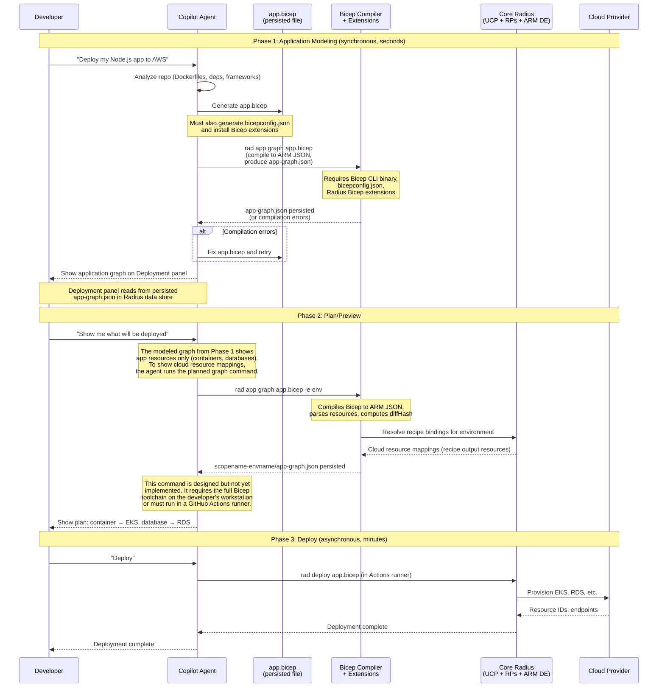
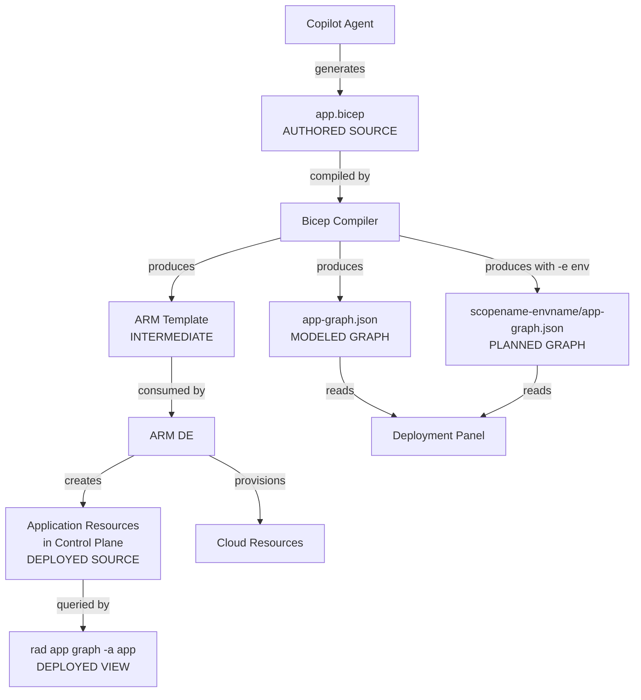
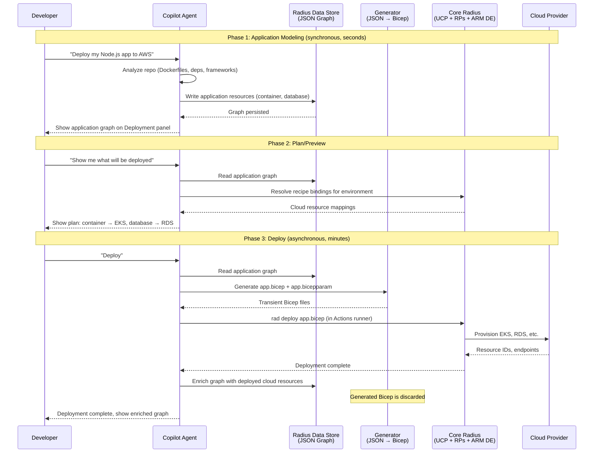
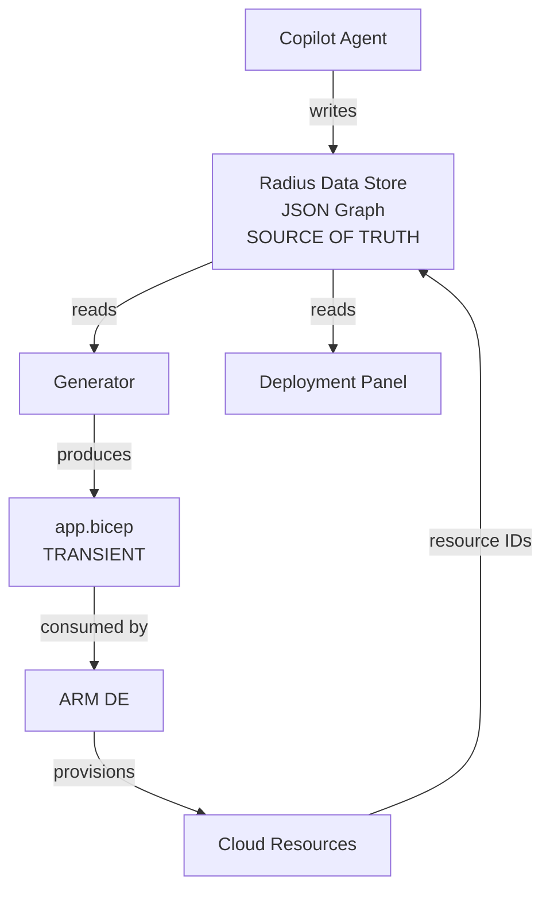
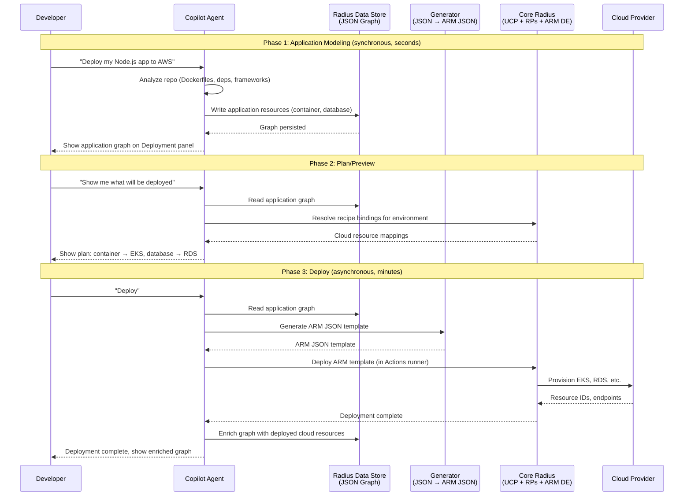
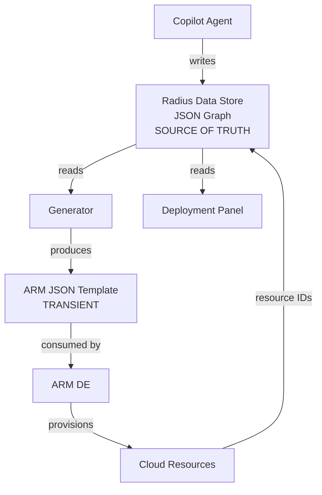

# Decision: Where Is the Application Definition Mastered?

**Status:** Draft  
**Date:** 2026-06-01  
**Authors:** zachcasper
**Related:** [GitHub Radius PRFAQ](2026-05-github-radius-prfaq.md) Q25, Q12, Q26; [Application Graph Design](../resources/2026-04-app-graph.md); [Architecture Notes](https://gist.github.com/sylvainsf/d52ff129d3087ffad7716611e7060a0a)

## Context

GitHub Radius introduces a new front door to Radius: the GitHub Copilot app. Instead of a developer authoring an `app.bicep` file and running `rad deploy`, an AI agent analyzes the developer's repository, builds an application model, and deploys it to the developer's cloud account through conversation.

This change raises a fundamental architectural question: **where is the application definition mastered?** Is it a Bicep file that the AI agent authors, or is it a JSON graph in the Radius data store that the AI agent writes to directly? And if the definition is mastered in JSON, does deployment still route through Bicep, or does the generator produce ARM JSON directly?

This document examines three options, establishes tenets to guide the decision, and presents the architectural consequences of each.

## Design tenets (in priority order)

These tenets are ordered. When two tenets conflict, the higher-priority tenet wins.

1. **The developer installs nothing beyond the Copilot app.** No CLI, no compiler, no extensions, no local Kubernetes cluster. The Copilot app is the only binary on the developer's workstation.

2. **There is exactly one source of truth for the application definition.** At any point in time, there is one authoritative representation of what the application is. Every other representation is derived from it. If two representations disagree, it is unambiguous which one is correct.

3. **Synchronous interactions complete in seconds; only deployment is asynchronous.** Application modeling, plan/preview, and graph inspection are synchronous operations that respond in seconds. Deployment provisions cloud infrastructure and may take minutes. Any architecture that forces the developer to wait minutes for an operation that should be synchronous is unacceptable.

4. **The application graph is inspectable before deployment.** The developer can see exactly what application resources exist and what cloud resources will be provisioned before any cloud API is called. This is the plan/preview capability described in the PRFAQ.

5. **There is a migration path between Kubernetes-based Radius and GitHub Radius.** A developer can move an application definition from one to the other. An application authored in Bicep for Kubernetes-based Radius can be imported into GitHub Radius, and an application defined in GitHub Radius can be exported to Bicep for use with `rad deploy`.

6. **Core Radius is reused, not forked.** UCP, the resource providers, the ARM deployment engine, and the recipe resolver are unchanged. GitHub Radius is a new front door, not a new backend.

7. **The application graph on the Deployment panel is the developer's view of the application.** The developer defines and modifies the application through conversation with Copilot and sees the result as an application graph on the Deployment panel. A `.bicep` file is not the method of defining or modifying an application.

## The source-of-truth problem in today's Radius

Before evaluating the three options, it is important to understand how the application definition flows through today's Kubernetes-based Radius, because the same dynamics apply to GitHub Radius.

It is natural to think of the `app.bicep` file as the single source of truth for the application in today's Radius. In practice, multiple representations coexist. When a developer runs `rad deploy app.bicep`, the following representations of the application exist simultaneously:

1. **The `app.bicep` file** on the developer's workstation. This is the developer's authored intent.
2. **The compiled ARM template** produced by the Bicep compiler. This is a transient intermediate representation.
3. **The application resources in the Radius control plane** (UCP + resource providers, stored in etcd). These are the resources created by the ARM deployment engine after processing the compiled template.
4. **The deployed cloud resources** in the developer's cloud account. These are the actual infrastructure provisioned by recipes.

After `rad deploy` completes, the developer can modify `app.bicep` without redeploying. At that point, representation (1) and representation (3) disagree. Which is the source of truth? There is no mechanism to detect or reconcile this disagreement until the developer runs `rad deploy` again. The divergence can also go the other direction: if the developer modifies the application via `rad resource create` or `rad resource delete`, representation (3) changes immediately while `app.bicep` remains unchanged, and the Bicep file is out of date without the developer knowing.

The divergence goes beyond timing. Representation (3) contains metadata that has no counterpart in (1). For example, when Radius deploys a recipe, the control plane records the specific infrastructure that was provisioned: an RDS instance ARN, resolved connection strings, provisioned capacity. If Radius later adds features such as cost attribution or per-resource health monitoring, that metadata would accumulate in the data store with no representation in the Bicep file at all.

The output of `rad app graph` returns representation (3), not (1). A developer who modifies `app.bicep` and then runs `rad app graph` will see the old application, not the new one.

**Today's Radius already has multiple sources of truth.** The question is not whether to introduce this problem, it is whether to make it worse or to solve it.

## Option A: Application definition mastered in Bicep

In this option, the Copilot agent generates an `app.bicep` file as the authoritative application definition. The Bicep file is compiled, and the compiled output drives deployment. The Bicep file is stored and versioned.

Work already underway for GitHub Radius reflects this architecture. The `rad app graph app.bicep` command compiles `app.bicep` to ARM JSON on the client side and produces a modeled graph containing application resources and their connections. The modeled graph does not include cloud infrastructure details, because those depend on the recipe bound to each resource type in the target environment. A separate planned graph command (`rad app graph app.bicep -e env`) would resolve recipes against an environment to show cloud resources, but this capability is not yet implemented.

A key constraint shapes this architecture: the Deployment panel is a persistent UI component that outlives the agent's conversation context. The agent's in-memory state can be compacted or lost at any time: the user can close the Copilot app, the session can end, or the LLM context window can be truncated. The Deployment panel needs a persistent, queryable data source. The [app graph design document](../resources/2026-04-app-graph.md) addresses this: `rad app graph app.bicep` compiles the Bicep, parses the resulting ARM JSON, and persists the graph as `app-graph.json` in the Radius data store. The planned graph variant writes to `scopename-envname/app-graph.json`. The Deployment panel reads from these persisted JSON files. This means that showing the graph on the Deployment panel requires the agent to run `rad app graph app.bicep` immediately after generating the Bicep file, which requires the full Bicep toolchain (compiler, `bicepconfig.json`, extensions) to be present on the developer's workstation. The toolchain requirement is not deferred to deployment; it is pulled forward to the very first interaction.

### Architecture



### Data flow: multiple representations



In this architecture, five representations of the application coexist: `app.bicep` (the authored source), `app-graph.json` (the modeled graph), the planned graph, the control plane's application resources, and the deployed graph view. Any of these can diverge from the others. If the agent modifies `app.bicep` without recompiling, the graph files are stale and the Deployment panel shows the old graph. If the agent recompiles but does not redeploy, the graph and the control plane disagree. Every edit to `app.bicep` must be followed by a compilation step to update the graph files, and every compilation step requires the Bicep toolchain.

### Bicep toolchain requirements

For the Copilot agent to author and compile Bicep, the following must be present in the execution environment:

**The Bicep compiler.** The Bicep CLI (`bicep`) is a standalone binary. In today's Radius, developers install it on their workstations. In GitHub Radius, the developer installs nothing beyond the Copilot app (Tenet 1). The compiler would run in one of two places:
- On the developer's workstation, downloaded transparently by a Copilot skill. The binary still executes on the developer's machine. In enterprise environments, endpoint protection policies, application allowlisting, and MDM controls may block an unmanaged binary from running. This satisfies Tenet 1 in letter but not in spirit.
- In a GitHub Actions runner, where compilation is available only when a workflow runs. Plan/preview depends on runner availability and takes minutes rather than seconds (Tenets 3 and 4).

**`bicepconfig.json`.** The Bicep compiler requires a configuration file that specifies which extensions to load and where to find their type definitions. The agent generates and maintains this file alongside `app.bicep`.

**Bicep extensions for Radius.** The Radius resource types (`Applications.Core/containers`, `Applications.Datastores/postgreSqlDatabases`, etc.) are defined as Bicep extensions. These extensions must be:
- Downloaded and cached before compilation can succeed.
- Versioned in lockstep with the Radius control plane to avoid type mismatches.
- Updated when Radius ships new resource types or modifies existing ones.

Managing these dependencies is part of the operational surface area of Option A.

### Pros

- **No new generator component and no generator risk.** The existing `rad deploy` pipeline is reused. No new code is needed to produce deployment artifacts. Options B and C require building and maintaining a generator that must correctly lower every resource type, dependency edge, and parameter binding into valid Bicep or ARM JSON. If the generator has bugs, deployments fail. Option A eliminates this entire risk category.
- **Bicep type enforcement at authoring time.** The Bicep compiler validates the application definition against the Radius type system before deployment. Type errors are caught before any cloud API is called. The compiler is a mature, well-tested tool that provides precise error messages.
- **Proven, battle-tested deployment path.** The Bicep → ARM deployment engine pipeline is the same path used by today's Radius and by Azure itself. No new deployment code paths need to be built, tested, or debugged.
- **Continuity with today's Radius.** The architecture is consistent with how Kubernetes-based Radius works today. The team's existing knowledge and tooling apply directly. The `rad app graph app.bicep` command is already being built for GitHub Radius; Option A extends work already underway.
- **The `app.bicep` file is human-readable and inspectable.** The application definition is in a language designed for human readability. If the developer wants to understand what the agent built, they can read the file directly.
- **Direct migration path to Kubernetes-based Radius.** The `app.bicep` file is committed to the repository. A developer who outgrows GitHub Radius can use the file directly with `rad deploy` on Kubernetes-based Radius. The migration path is the file itself, not a generated export.

### Cons

- **Multiple sources of truth.** Five representations coexist: `app.bicep`, the modeled graph, the planned graph, the control plane's application resources, and the deployed graph. Any of these can diverge from the others. Violates Tenet 2.
- **Requires tooling on the developer's workstation or introduces latency.** The Bicep compiler, `bicepconfig.json`, and extensions must either be installed locally (violating Tenet 1) or run in a remote runner (violating Tenets 3 and 4 for plan/preview). There is no path that satisfies all three tenets.
- **The AI agent must generate syntactically and semantically valid Bicep.** Bicep is a DSL with specific syntax rules, scoping rules, and expression semantics. Generating valid Bicep is harder than generating valid JSON. When the agent generates invalid Bicep, it enters a compile-fix-retry loop that adds latency and unpredictability.
- **Toolchain management burden.** The `bicepconfig.json`, extension downloads, and version pinning are problems that must be solved and maintained. Each is a potential failure point.
- **Plan/preview requires a runner.** Bicep compilation is a prerequisite for plan/preview, which means plan/preview depends on runner availability and takes minutes rather than seconds (Tenets 3 and 4).

## Option B: Application definition mastered in JSON, transient Bicep for deployment

In this option, Copilot writes application resources directly to the Radius data store as structured JSON using Radius skills. The data store is the single source of truth. When a deployment is requested, a generator produces a transient `app.bicep` from the data store. The Bicep compiler compiles it into an ARM JSON template, the ARM deployment engine consumes the compiled output, and the generated Bicep is discarded.

### Architecture



### Data flow: one source of truth



In this architecture, there is exactly one representation of the application that is authoritative at all times: the JSON graph in the Radius data store. Everything else is derived. The graph is progressively enriched through the three phases:

**After Phase 1 (modeled):** the graph contains the application resources the agent defined.

```
Radius.Core/applications: todo-list-app
├── Radius.Compute/containers: app
│   └── Radius.Compute/containerImages: app-image
└── Radius.Data/mySqlDatabases: mysql
```

**After Phase 2 (planned):** the graph is enriched with cloud resources that will be provisioned, with placeholder IDs.

```
Radius.Core/applications: todo-list-app
├── Radius.Compute/containers: app
│   ├── AWS.EKS/deployment: TBD
│   ├── AWS.EKS/service: TBD
│   └── Radius.Compute/containerImages: app-image
│       └── AWS.ECR/containerImages: TBD
└── Radius.Data/mySqlDatabases: mysql
    └── AWS.RDS/dbInstance: TBD
```

**After Phase 3 (deployed):** placeholder IDs are replaced with actual cloud provider resource IDs.

```
Radius.Core/applications: todo-list-app
├── Radius.Compute/containers: app
│   ├── AWS.EKS/deployment: arn:aws:eks:us-east-1:123456789:deployment/todo-app
│   ├── AWS.EKS/service: arn:aws:eks:us-east-1:123456789:service/todo-svc
│   └── Radius.Compute/containerImages: app-image
│       └── AWS.ECR/containerImages: arn:aws:ecr:us-east-1:123456789:repository/todo-app
└── Radius.Data/mySqlDatabases: mysql
    └── AWS.RDS/dbInstance: arn:aws:rds:us-east-1:123456789:db:todo-mysql
```

### Pros

- **Single source of truth.** The data store is authoritative. There is no second representation that can diverge.
- **No tooling on the developer's workstation.** No Bicep compiler, no Bicep extensions, no `bicepconfig.json`. Satisfies Tenet 1.
- **Plan/preview does not require Bicep compilation.** The application graph is already in the data store and can be read directly. Recipe resolution happens against core Radius in all options, but only Option A requires Bicep compilation as a prerequisite.
- **The agent writes structured data natively.** An AI agent generates JSON more reliably than it generates Bicep. JSON Schema validation at the write boundary provides type enforcement equivalent to what the Bicep compiler provides for human authors.
- **Bicep compiler as safety net.** The compiler validates the generated Bicep before the ARM deployment engine processes it. Generator bugs surface as compilation errors with clear diagnostics.
- **One generator, two uses.** The JSON-to-Bicep generator is a deterministic, pure function (JSON graph in, Bicep out) that is testable with fixtures. The same generator is reused for the export-to-Bicep migration path (PRFAQ Q21). The only difference is whether the output is discarded or kept.
- **History and diffing are straightforward.** JSON diffs are semantically meaningful.
- **Core Radius is reused unchanged.** The generator produces valid Bicep that `rad deploy` consumes exactly as it does today. UCP, the resource providers, and the ARM deployment engine do not know or care that the Bicep was generated rather than authored.

### Cons

- **A new generator component must be built and maintained.** The JSON-to-Bicep generator is new code that must correctly lower every resource type, dependency edge, and parameter binding into valid Bicep. It must be maintained in lockstep with Radius resource type changes. This is a non-trivial engineering effort.
- **The Bicep type system is not applied at authoring time.** Validation happens via JSON Schema at the write boundary, not via the Bicep compiler. The team must build and maintain the JSON Schema as a parallel validation artifact. However, the existing Radius resource type schemas in `resource-types-contrib` already define the types, properties, and constraints for every resource — the JSON Schema is derived from the same source.
- **Schema drift risk.** If the JSON Schema and the Bicep type definitions ever diverge, the generator could produce Bicep that the ARM deployment engine rejects. Mitigation: both artifacts are derived from the same source (`resource-types-contrib`), and the generator's test suite validates round-trip correctness.
- **Bicep compiler dependency in the runner.** The Bicep CLI must be installed and versioned in the Actions runner. This is not a developer-facing dependency, but it is infrastructure that must be maintained.

## Option C: Application definition mastered in JSON, no Bicep

In this option, Copilot writes application resources directly to the Radius data store as structured JSON using Radius skills, exactly as in Option B. The difference is in the deployment path: the generator produces an ARM JSON template directly, bypassing Bicep entirely. No Bicep is generated, compiled, or present anywhere in the GitHub Radius pipeline.

### Architecture



### Data flow: one source of truth, zero Bicep



### Pros

Option C shares all of Option B's advantages for application modeling and plan/preview: single source of truth, no developer-side tooling, no Bicep compilation for plan/preview, native structured data for the agent, and straightforward JSON diffing.

The additional advantage over Option B:

- **Zero Bicep in the entire pipeline.** The Bicep compiler is not present on the developer's workstation or in the Actions runner. No `bicepconfig.json`, no Bicep extensions, no Bicep CLI versioning. The deployment path has the fewest moving parts of any option.

### Cons

- **Two generators instead of one.** The deployment path (JSON → ARM JSON) and the export path (JSON → Bicep, PRFAQ Q21) are separate components that share logic (JSON graph schema, resource type traversal) but diverge in output format. Both must be maintained, tested independently, and kept in sync with resource type changes.
- **No compiler safety net.** Generator bugs are not caught by the Bicep compiler. Invalid ARM JSON goes directly to the ARM deployment engine, which produces less specific error messages.
- **ARM JSON is harder to debug.** ARM templates are verbose and have their own structural rules (nested `resources` arrays, `dependsOn` references by resource ID, specific casing conventions). Diagnosing deployment failures requires reading ARM JSON rather than Bicep.
- **The Bicep type system is not applied at authoring time.** Same as Option B: validation happens via JSON Schema at the write boundary.
- **Schema drift risk.** Same as Option B, but without the Bicep compiler as a second check, the risk of invalid templates reaching the ARM deployment engine is higher.
- **Core Radius integration changes.** Today, `rad deploy` accepts both Bicep files and ARM JSON templates. Option C can use `rad deploy` with a generated ARM JSON template, so no changes to the runner invocation are required. However, the generator must produce valid ARM JSON templates that conform to the ARM deployment engine's structural expectations, which is a more complex output format than Bicep.

## Comparison

| Criterion | Option A: Bicep | Option B: JSON + transient Bicep | Option C: JSON, no Bicep |
|-----------|----------------|----------------------------------|--------------------------|
| Sources of truth | 5 (Tenet 2 ❌) | 1 | 1 |
| Developer installs | Bicep toolchain (Tenet 1 ❌) or accepts latency (Tenets 3, 4 ❌) | Copilot app only | Copilot app only |
| Plan/preview | Requires Bicep compilation | Reads data store directly | Reads data store directly |
| Type enforcement | Bicep compiler at authoring time | JSON Schema at write boundary + Bicep compiler at deploy time | JSON Schema at write boundary only |
| New components | None | 1 generator (JSON → Bicep) | 2 generators (JSON → ARM JSON, JSON → Bicep for export) |
| Compiler safety net | Yes (authoring) | Yes (deployment) | No |

## Recommendation

**Option B: Master the application definition in the Radius data store, with a transient Bicep file for deployment.**

The recommendation rests on three arguments.

**First, the data store must hold the application definition before deployment.** The plan/preview capability (PRFAQ Q19, Q26) requires the developer to inspect the application graph before any cloud API is called. The Deployment panel is a persistent UI component that outlives the agent's conversation context. It needs a queryable, persistent data source. If the application definition is in the data store (Options B and C), the Deployment panel reads from it directly. If the application definition is in `app.bicep` (Option A), every read requires Bicep compilation, which requires the Bicep toolchain on the developer's workstation (violating Tenet 1) or in a runner (violating Tenets 3 and 4). Option A also introduces five representations that can diverge (violating Tenet 2). Once the data store holds the application definition as a first-class concept, it is the natural place to master it.

**Second, Bicep was the right choice for human authors; JSON is the right choice for AI agents.** Bicep provided type safety, autocomplete, and readable syntax for developers typing in an editor. In GitHub Radius, the consumer is an AI agent. The properties that matter for an AI agent are structured data, schema validation, and direct read/write without compilation. JSON Schema validation at the write boundary, derived from the same `resource-types-contrib` schemas that produce the Bicep type definitions, provides equivalent type enforcement. The Bicep investment is not abandoned: in Option B, Bicep continues as the generated deployment artifact and the export format for migration to Kubernetes-based Radius. Recipes in `resource-types-contrib` continue to be authored in Bicep and Terraform.

**Third, Option B requires one generator; Option C requires two.** Both options satisfy all seven tenets. The deciding factor is engineering cost and risk. Option B's JSON-to-Bicep generator serves both the deployment path and the export-to-Bicep migration path (PRFAQ Q21). The Bicep compiler validates the generator's output before the ARM deployment engine processes it, catching generator bugs with clear diagnostics. Option C eliminates the Bicep compiler from the runner but requires a separate JSON-to-ARM-JSON generator for deployment and a JSON-to-Bicep generator for export. Two generators that share schema logic but diverge in output format create a code duplication risk and remove the compiler's diagnostic value.

The generator required by Option B is new engineering work, but it is bounded: it is a deterministic, pure function from JSON to Bicep, testable with fixtures, and reusable for export.

Core Radius is reused unchanged. The `radius-runner` container receives a generated `app.bicep` and runs `rad deploy` exactly as it does today. The ARM deployment engine, UCP, the resource providers, and the recipe resolver do not know or care that the Bicep was generated from a JSON graph rather than authored by a human. The boundary between GitHub Radius and core Radius is a filesystem layout and a CLI invocation, not a change to the Radius data model.

## Appendix A: Excluded alternative — Core Radius reads and enriches the data store directly

An alternative pattern for plan/preview in Options B and C was considered: instead of the Copilot agent reading the JSON graph from the data store, calling Core Radius for recipe resolution, and writing enrichments back, Core Radius would read the data store directly, resolve recipes, and write placeholder cloud resources back itself.

This pattern was excluded because it violates Tenet 6 (Core Radius is reused, not forked). Core Radius today has no knowledge of the GitHub Radius data store. It operates on resource types and environments. If Core reads and writes the data store directly, it requires a new integration to the GitHub Radius data store (read/write access), knowledge of the JSON graph schema (parsing, traversal, enrichment), and a new API surface that couples Core to a GitHub Radius storage concept. That is a change to Core Radius, not reuse of it.

The current pattern keeps the boundary clean. The Copilot agent reads from the data store (which it already does for Phase 1), calls Core for recipe resolution (a narrow API: resource type + environment → cloud resource mappings), and writes enrichments back to the data store (the same read-enrich-write pattern used in Phase 3 after deployment). Code complexity is low because all three steps reuse existing capabilities. One pattern serves both plan/preview and post-deployment enrichment.
