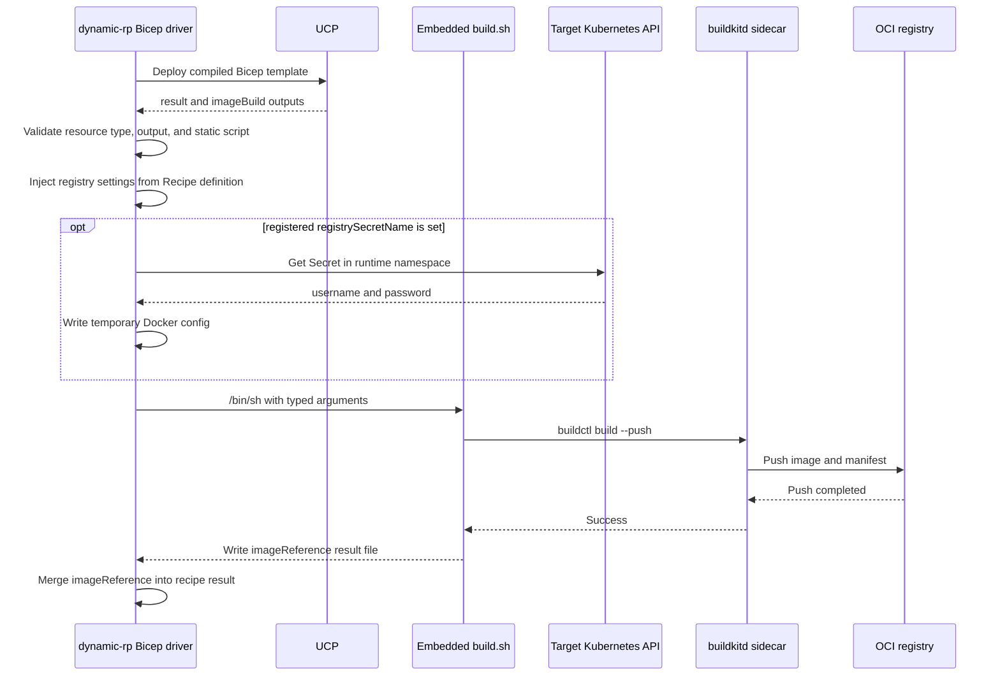

# Bicep recipe execution for `Radius.Compute/containerImages`

- **Author**: Mike Azure (@AzureMike)

## Overview

`Radius.Compute/containerImages` builds a container image from source, pushes it to a registry, and exposes the resulting `imageReference` for resources such as `Radius.Compute/containers` to use as their container image. The initial implementation uses a Terraform recipe because Terraform can run `buildctl` through `local-exec`, retain build state, and return the result after the push completes.

This design adds a Kubernetes Bicep recipe for the same resource type. The Bicep recipe can collect the image build settings, but it can't run `buildctl` or talk to the BuildKit sidecar by itself. After the normal Bicep deployment finishes, the Bicep driver runs an extra build step only for `Radius.Compute/containerImages`. `dynamic-rp` reads a private `imageBuild` output, loads a build script embedded in the published recipe, executes that script against the existing BuildKit sidecar, waits for the image push, and merges the reported `imageReference` into the recipe result.

This design extends the [`Radius.Compute/containerImages` resource type design](./2026-04-container-images-resource-type.md) by adding support for Kubernetes Bicep recipes. It keeps the same public schema and aims to match the existing Terraform recipe behavior rather than define different public behavior for Bicep.

## Terms and definitions

| Term                     | Definition                                                                                                                                                                          |
|--------------------------|-------------------------------------------------------------------------------------------------------------------------------------------------------------------------------------|
| `imageBuild`             | Internal Bicep output that tells the Radius Bicep driver what image to build. The driver injects registry settings from the registered Recipe definition.                           |
| Build script             | `build.sh` published by the platform engineer and embedded into the compiled Bicep template by `loadTextContent`.                                                                   |
| BuildKit                 | The image build engine running as an opt-in rootless sidecar in the `dynamic-rp` Pod.                                                                                               |
| `buildctl`               | BuildKit CLI staged into the `dynamic-rp` container and connected to the sidecar through `BUILDKIT_HOST`.                                                                           |
| Recipe runtime namespace | Kubernetes namespace from `context.runtime.kubernetes.namespace` where Radius creates recipe resources, including registry Secrets.                                                 |
| Generated tag            | Deterministic `sha256-<16 hex characters>` tag computed by the build script when `properties.tag` is omitted. It is content-addressed only when the source identifier is immutable. |

## Objectives

> **Issue Reference:** [resource-types-contrib#220](https://github.com/radius-project/resource-types-contrib/issues/220), [radius#12361](https://github.com/radius-project/radius/pull/12361), [resource-types-contrib#228](https://github.com/radius-project/resource-types-contrib/pull/228)

### Goals

- Add a publishable Kubernetes Bicep recipe for `Radius.Compute/containerImages`.
- Preserve the public contract and relevant build behavior implemented by the Terraform recipe.
- Use the BuildKit sidecar already provided by the Radius Helm chart.
- Wait for `buildctl --push` to complete before returning `properties.imageReference`.
- Preserve the existing public resource properties and recipe parameters: `registry`, `registrySecretName`, `tag`, and `build`.
- Run only the build script published by the platform engineer. Developer resource properties (source, Dockerfile, platforms, build arguments, tag) and operator recipe parameters resolved by the driver (registry, registry Secret name) are passed to that script as command-line arguments instead of being inserted into shell code.
- Support unauthenticated registries and username/password authentication from a Kubernetes Secret in the recipe runtime namespace.
- Run the extra build hook only for `Radius.Compute/containerImages`.
- Preserve the Terraform recipe and fix its omitted-tag validation error described by [resource-types-contrib#209](https://github.com/radius-project/resource-types-contrib/issues/209).

### Non goals

- Preserve Terraform's state-based build suppression. The Bicep recipe runs the build on every recipe execution.
- Add a general-purpose script or action feature to every Bicep recipe.
- Make `containerImages` a built-in resource provider.
- Redesign the Terraform recipe's validation, source translation, tag strategy, registry authentication, or output contract.
- Upload a developer's local workstation directory to `dynamic-rp`. Local paths must already exist in the `dynamic-rp` container filesystem.
- Add BuildKit to the Helm chart. The sidecar, `buildctl`, and `BUILDKIT_HOST` wiring already exist.
- Make Bicep and Terraform generated tags byte-for-byte identical.
- Add a new sandbox or permission boundary for this Bicep recipe. It uses the same recipe execution trust model as the Terraform recipe.
- Support registry credentials from anything other than a Kubernetes Secret with `username` and `password`.
- Create Kubernetes image pull Secrets for workloads that later pull the built image.
- Support Windows execution. The hook runs in the Linux `dynamic-rp` container; Windows files only preserve package cross-compilation.

### User scenarios (optional)

#### User story 1 — Multi-architecture image on a single-arch cluster

A developer working on an amd64-only AKS cluster needs both `linux/amd64` and `linux/arm64` images for downstream environments. They declare a `Radius.Compute/containerImages` resource and use the default platforms. Radius runs the Bicep recipe, builds both platforms through BuildKit, pushes a manifest list to the recipe-configured registry, and returns an `imageReference` that a `Radius.Compute/containers` resource can use.

#### User story 2 — Developer builds from a Git URL

A developer has already pushed their code to a Git repository and wants Radius to build directly from that source. They set `build.source` to a `git::https://...` URL with an optional ref and subdirectory. BuildKit clones the repository inside the cluster, builds the image, pushes it to the configured registry, and Radius exposes the pushed image through `properties.imageReference`.

#### User story 3 — Platform engineer uses a private registry

A platform engineer wants built images pushed to a private registry. They configure the recipe with `registry` and `registrySecretName`. Radius reads the named Kubernetes Secret from the recipe runtime namespace, writes a temporary Docker `config.json`, and passes it to `buildctl` through `DOCKER_CONFIG` for the push.

## User Experience (if applicable)

Developers keep using the same `Radius.Compute/containerImages` resource shape. After the Radius control plane includes the Bicep image-build hook, a platform engineer can switch the recipe registration from Terraform to Bicep without changing application code.

**Application input:**

```bicep
extension radius

param environment string

resource app 'Radius.Core/applications@2025-08-01-preview' = {
  name: 'orders'
  properties: {
    environment: environment
  }
}

resource image 'Radius.Compute/containerImages@2025-08-01-preview' = {
  name: 'orders-api'
  properties: {
    environment: environment
    application: app.id
    build: {
      source: 'git::https://github.com/example/orders.git//src?ref=4f53cda'
      dockerfile: 'Dockerfile'
      platforms: [
        'linux/amd64'
        'linux/arm64'
      ]
      args: {
        VERSION: '1.4.0'
      }
    }
  }
}
```

**Resource output after the image is built and pushed:**

```json
{
  "properties": {
    "imageReference": "ghcr.io/example/orders-api:sha256-b836fd6b4f35a8c1"
  }
}
```

**Internal recipe-to-driver contract:**

```bicep
@description('Radius recipe context. Carries resource properties, environment, and runtime info.')
param context object

@description('Registry prefix (e.g. `ghcr.io/myorg`) into which images are pushed. The recipe appends `/<resource-name>:<tag>`.')
#disable-next-line no-unused-params // Consumed by the Radius Bicep driver from the registered recipe definition.
param registry string

@description('Name of the Kubernetes Secret containing `username` and `password`. Leave empty for an unauthenticated registry.')
#disable-next-line no-unused-params // Consumed by the Radius Bicep driver from the registered recipe definition.
param registrySecretName string = ''

#disable-next-line no-unused-vars // Consumed by the Radius Bicep driver from the compiled template.
var radiusContainerImagesBuildScript = loadTextContent('build.sh')

var properties = context.resource.properties
var build = properties.build

output imageBuild object = {
  resourceName: context.resource.name
  tag: properties.?tag ?? ''
  tagProvided: properties.?tag != null
  source: build.source
  dockerfile: build.?dockerfile ?? 'Dockerfile'
  platforms: build.?platforms ?? [
    'linux/amd64'
    'linux/arm64'
  ]
  buildArgs: build.?args ?? {}
}

output result object = {
  resources: []
  values: {}
}
```

After `buildctl --push` succeeds, the embedded script writes the pushed image reference to the file named by `RADIUS_EXEC_OUTPUT`:

```json
{"imageReference":"ghcr.io/example/orders-api:sha256-b836fd6b4f35a8c1"}
```

## Design

### High Level Design

The Bicep recipe evaluates inputs, and Radius runs the image build:

1. `dynamic-rp` downloads the compiled Bicep recipe and adds the Radius recipe context.
2. UCP deploys the Bicep template and returns `result` plus the private `imageBuild` output.
3. The Bicep driver checks the resource type. Only `Radius.Compute/containerImages` uses this hook.
4. The driver validates `imageBuild`, injects `registry` and optional `registrySecretName` from the registered Recipe definition, and reads the embedded `radiusContainerImagesBuildScript`.
5. If the registered `registrySecretName` is set, the driver reads the Kubernetes Secret and writes a temporary Docker config.
6. The driver runs the script with typed arguments. The script validates inputs, computes a tag, calls `buildctl`, and writes `imageReference`.
7. After the script succeeds, the driver merges `imageReference` into the recipe output and continues normal cleanup and persistence.

The hook is optional. A `Radius.Compute/containerImages` recipe without `imageBuild` follows the normal Bicep driver path.

### Architecture Diagram



### Detailed Design

#### Design baseline and related decisions

This port follows existing recipe decisions:

| Design                                                                                        | Constraint on this change                                                                                                                                                              |
|-----------------------------------------------------------------------------------------------|----------------------------------------------------------------------------------------------------------------------------------------------------------------------------------------|
| [`Radius.Compute/containerImages` resource type](./2026-04-container-images-resource-type.md) | Defines the public API and original goals. This Bicep design follows the current implementation.                                                                                       |
| [Direct recipe modules](./2026-05-direct-recipe-modules.md)                                   | The Bicep recipe is registered like other direct recipe modules. It returns the normal public `result` output plus a private `imageBuild` output used only by the Radius Bicep driver. |
| [Recipe Packs](./2025-08-recipe-packs.md)                                                     | Operators can distribute the Bicep recipe through a Recipe Pack. Current Recipe Pack APIs don't expose the proposed `recipeDigest` field.                                              |
| [Private Bicep registries](./2024-06-private-bicep-registries.md)                             | Bicep registry settings authenticate the recipe pull. `registrySecretName` is separate and only authenticates the built image push.                                                    |
| [Rootless BuildKit sidecar](https://github.com/radius-project/radius/pull/11882)              | Reuses the existing opt-in `buildkitd` sidecar, staged `buildctl`, `BUILDKIT_HOST`, in-Pod BuildKit state, and PSA constraints.                                                        |
| [Multi-cluster environments](../environments/2026-06-multi-cluster.md)                        | Kubernetes access must use the shared target-cluster resolver and honor `RADIUS_TARGET_KUBECONFIG`. It must not fall back to the control-plane cluster.                                |
| [Bicep recipe garbage collection](./2023-08-garbage-collection.md)                            | The hook runs after output processing and before garbage collection. Both recipe kinds return no managed resources, so this ordering doesn't change `containerImages` behavior.        |
| [Sensitive resource data](../security/2025-11-secrets-redactdata.md)                          | `imageBuild` carries no registry Secret data. Registry credentials stay in the runtime-namespace Secret and aren't copied into recipe outputs or resource status.                      |
| [Applications RP threat model](../security/2024-08-applications-rp-component-threat-model.md) | Uses the same recipe-execution trust boundary as Terraform `local-exec`, which already runs `buildctl` from the `dynamic-rp` container.                                                |

#### Resource-type gate

`pkg/recipes/driver/bicep/bicep.go` calls `executeImageBuildHook` after UCP returns deployment outputs and before Bicep garbage collection. The hook checks whether `opts.Definition.ResourceType` is `Radius.Compute/containerImages`, ignoring case.

This limits the behavior change to one resource type. Other resource types keep normal Bicep output handling even if they define an `imageBuild` output. A `Radius.Compute/containerImages` recipe that omits `imageBuild` also keeps the normal Bicep response.

#### Private Bicep-to-driver contract

The `imageBuild` output must be an object with exactly 7 properties:

| Property             | Type         | Source                                                                |
|----------------------|--------------|-----------------------------------------------------------------------|
| `resourceName`       | string       | `context.resource.name`                                               |
| `tag`                | string       | Developer property, or empty string when absent                       |
| `tagProvided`        | boolean      | Whether `tag` is present and non-null in the evaluated context        |
| `source`             | string       | `properties.build.source`                                             |
| `dockerfile`         | string       | `properties.build.dockerfile`, default `Dockerfile`                   |
| `platforms`          | string array | `properties.build.platforms`, default `linux/amd64` and `linux/arm64` |
| `buildArgs`          | string map   | `properties.build.args`, default empty                                |

The driver rejects missing, null, unknown, mis-cased, or incorrectly typed fields. The driver sorts build argument keys before creating process arguments, and the committed `build.sh` additionally canonicalizes the received `--build-arg` pairs with a byte-wise `LC_ALL=C` sort before hashing and before building `buildctl` arguments. The script's sort runs last, so the generated tag doesn't depend on the caller's argument order. The two sort criteria differ for keys that are prefixes of other keys (the script compares whole `key=value` lines), which changes only the internal ordering, not determinism.

The executable script is stored in the compiled template variable `radiusContainerImagesBuildScript`. Bicep's `loadTextContent` embeds the file at compile or publish time as a hard-coded string, with a maximum size of 131,072 characters including line endings. The driver requires a non-empty literal string and rejects any compiled value beginning with `[`. That blocks ARM expressions, but it also rejects a literal script that starts with `[`, including Bicep's `[[` escape form. The published script starts with a shebang and isn't affected. Resource properties and recipe parameters can't replace the script.

#### Script execution contract

The driver creates a temporary working directory and runs:

```text
/bin/sh -c <embedded-script> radius-container-images-build <typed arguments>
```

Scalar values are passed as individual arguments. Platforms become repeated `--platform` arguments. Build arguments become repeated `--build-arg <key> <value>` arguments. The driver doesn't insert resource values into shell source.

The process inherits the `dynamic-rp` environment, including `BUILDKIT_HOST`. `imageBuildEnvironment` removes any inherited `DOCKER_CONFIG` and `RADIUS_EXEC_OUTPUT` entries and appends the controlled values, so each controlled key appears exactly once. Other inherited variables, including `RADIUS_TARGET_KUBECONFIG`, are passed through; filtering them would not remove access, because the script runs as the same user in the same container and can read the mounted files regardless. On Unix, the shell runs in its own process group and cancellation sends `SIGKILL` to the whole group, so child processes such as `buildctl` don't outlive the shell.

Stdout and stderr are written to the existing recipe logger with `imageBuild:` prefixes. On failure, the recipe error includes the last 4 KiB of stderr. Temporary script results and Docker credentials are removed after execution.

The result file must be a JSON object with exactly one non-empty string property: `imageReference`. Script success without that exact result is still a recipe deployment failure.

#### Build script behavior

`Compute/containerImages/recipes/kubernetes/bicep/build.sh` performs the following work:

1. Parses and validates every argument.
2. Lowercases the Radius resource name to form the image repository name.
3. Converts `git::https://host/repository.git//subdir?ref=<ref>` into the BuildKit `https://host/repository.git#<ref>:<subdir>` context form.
4. Uses an operator-managed local directory when `build.source` is a filesystem path. The default root is `/var/radius/build-contexts`, overridable for tests with `RADIUS_CONTAINER_IMAGES_LOCAL_CONTEXT_ROOT`.
5. Uses an explicit `properties.tag` when present.
6. Computes `sha256-<16 hex characters>` from the Git context or local file tree plus Dockerfile path, platform order, and build arguments when the tag is absent. The script sorts the received build-argument pairs itself, so the tag doesn't depend on caller ordering. Local file enumeration, sorting, and hashing are checked separately; a failure stops the build instead of producing a partial-tree tag.
7. Calls `buildctl build` with `dockerfile.v0`, requested platforms, build arguments, and `--output type=image,name=<reference>,push=true`.
8. Writes `imageReference` only after `buildctl` succeeds.

The script keeps the Terraform recipe's input categories and most validation rules. It rejects empty explicit tags, invalid registry paths, invalid platform strings, local filesystem sources or Dockerfile paths containing `..` (git URLs are constrained by a character allowlist instead, matching Terraform), malformed build argument names, and build argument values containing whitespace, quotes, backticks, dollar signs, or backslashes. Bicep local filesystem sources add stricter confinement: the root must exist, the root must not resolve to `/`, the source must resolve beneath the operator-managed root, the source and Dockerfile must not be symbolic links, and the build context must not contain symbolic links. Other shell punctuation such as `&`, `<`, and `>` is allowed because values are passed as process arguments instead of shell source.

#### Behavioral parity with the Terraform recipe

The Terraform recipe is the baseline. The Bicep port keeps the same public behavior except where the recipe engines work differently.

| Behavior                | Terraform recipe                                                                                   | Bicep recipe                                                 | Parity                                |
|-------------------------|----------------------------------------------------------------------------------------------------|--------------------------------------------------------------|---------------------------------------|
| Resource API            | `2025-08-01-preview` schema                                                                        | Same schema                                                  | Exact                                 |
| Recipe parameters       | `registry`, optional `registrySecretName`                                                          | Same parameters                                              | Exact                                 |
| Image repository        | Lowercased resource name                                                                           | Lowercased resource name                                     | Exact                                 |
| Defaults                | `Dockerfile`; `linux/amd64`, `linux/arm64`                                                         | Same defaults                                                | Exact                                 |
| Input validation        | Registry, tag, source, Dockerfile, platforms, and build arguments                                  | Same categories, with stricter local-source confinement      | Semantic                              |
| Git source              | Translate go-getter `git::https://...//subdir?ref=...` to a BuildKit Git context                   | Same translation                                             | Exact                                 |
| Absolute local source   | Read a directory already available inside `dynamic-rp`                                             | Must resolve beneath `/var/radius/build-contexts` by default | Engine difference                     |
| Relative local source   | Resolve from Terraform's transient execution directory                                             | Also confined to the operator-managed root after resolution  | Engine difference                     |
| Explicit tag            | Use the non-empty value as supplied                                                                | Same behavior                                                | Exact                                 |
| Generated tag inputs    | Source content or Git source string, Dockerfile, platform order, and build arguments               | Same categories; the script canonicalizes argument order     | Semantic                              |
| Generated tag bytes     | Terraform serialization and local-file digest                                                      | Shell serialization and `sha256sum` file-tree digest         | Engine difference                     |
| Registry authentication | Read `username` and `password` from the runtime-namespace Secret and write temporary Docker config | Same Secret contract and Docker config, with registry settings injected from the Recipe definition | Semantic |
| Cluster selection       | Shared recipe Kubernetes provider configuration                                                    | Shared target-cluster resolver                               | Exact                                 |
| Build execution         | Synchronous `buildctl build --push`                                                                | Same command semantics                                       | Exact                                 |
| Recipe result           | Empty resources and `imageReference` after a successful push                                       | Same public result                                           | Exact                                 |
| Unchanged execution     | Terraform state and `triggers_replace` can skip the build                                          | Rebuild on each recipe execution                             | Engine difference                     |

Generated tags are deterministic within each recipe kind when Bicep runs through the Radius driver, and both recipes hash the same input categories. Different serialization and local-file hashing can produce a one-time tag change when an operator switches from Terraform to Bicep without setting `tag`. The generated tag format and exact hash bytes aren't part of the resource API.

#### Registry authentication

When `registrySecretName` is empty, the driver removes any inherited `DOCKER_CONFIG` entry and sets it to an empty value. Docker-compatible clients can treat an empty value like an unset value and fall back to `$HOME/.docker/config.json`. The current `dynamic-rp` image doesn't create that file, and the Terraform recipe's `local-exec` uses the same empty-string convention, but setting `DOCKER_CONFIG` to a controlled empty temporary directory would be stronger.

Both recipes key the written credential on the first path segment of `registry`, with Docker Hub aliases normalized to `https://index.docker.io/v1/` for BuildKit compatibility.

For the Bicep recipe, `registry` and `registrySecretName` come from `opts.Definition.Parameters`, the registered Recipe definition. Developer resource parameters aren't used for registry settings. Terraform still follows the standard recipe-parameter merge behavior, where resource-level parameters can override environment-level parameters.

When the registered `registrySecretName` is set, the driver uses `pkg/recipes/kubernetes/clusteraccess` to resolve the cluster selected by the recipe configuration. It reads the Secret from `opts.Configuration.Runtime.Kubernetes.Namespace`, requires `username` and `password` data keys, and creates:

```json
{
  "auths": {
    "ghcr.io": {
      "auth": "<base64(username:password)>"
    }
  }
}
```

The Docker configuration directory is mode `0700`; `config.json` is mode `0600`. The registry auth key is the first path segment of the `registry` parameter, except Docker Hub aliases normalize to `https://index.docker.io/v1/`.

#### Reconciliation and generated tags

The Bicep recipe builds on every recipe execution because Bicep has no equivalent to Terraform `triggers_replace` state. Identical inputs generate the same image reference, but the image is still rebuilt and pushed.

Git generated tags hash the translated source URL, including the authored ref and subdirectory. They don't hash the resolved commit or source contents. A moving ref such as `main` therefore keeps the same generated tag when the remote commit changes. Bicep rebuilds on a later recipe execution and can replace content behind that tag. Terraform can skip the build entirely because its `triggers_replace` inputs are unchanged. Platform engineers should require immutable Git refs when they need stable content and predictable reconciliation.

Terraform and Bicep hash the same categories of inputs with different serialization and local-file hash algorithms. Switching recipe kinds can change a generated image reference once. An explicit tag avoids that migration difference.

#### Source inconsistencies and required follow-up

The reviewed sources have these mismatches:

- [resource-types-contrib#220](https://github.com/radius-project/resource-types-contrib/issues/220) asks for an idempotent Bicep recipe with `test/app.bicep` and `make test-recipe` coverage. The proposed Bicep recipe returns the same reference for unchanged inputs but still rebuilds and pushes every time. `Compute/containerImages/test/app.bicep` doesn't exist. [resource-types-contrib#154](https://github.com/radius-project/resource-types-contrib/issues/154) is closed, but the containerImages-specific test and required `registry` configuration are still absent.

#### Advantages

- Keeps the public `containerImages` schema and recipe parameters stable.
- Uses the existing in-Pod BuildKit endpoint and avoids another build service.
- Waits for a successful push before publishing `imageReference`.
- Keeps developer-controlled values out of shell source.
- Lets platform engineers customize build behavior by publishing a modified script with the recipe.
- Limits behavior changes for other Bicep recipes through a resource-type gate.

#### Disadvantages

- Adds a resource-type special case to the generic Bicep driver.
- Runs platform-engineer-authored shell code inside `dynamic-rp`, with that container's environment, filesystem, network access, and Kubernetes identity.
- Rebuilds and pushes on every Bicep recipe execution.
- Requires a Radius control plane with the `imageBuild` hook; recipe registration does not enforce that capability.
- Creates a private contract based on exact Bicep output and compiled-variable names.
- Requires the opt-in BuildKit sidecar and a namespace policy that permits its rootless BuildKit security profile.
- End-to-end Bicep recipe coverage is still missing.

#### Proposed Option

Adopt the Bicep driver hook and embedded recipe script shown in the PRs. Keep the AKS default recipe pack on Terraform until the hook ships in a Radius release and an end-to-end Bicep recipe test passes against that release.

### API design (if applicable)

There is no public REST API, CLI, or shared Go API change. `Compute/containerImages/containerImages.yaml` keeps the `2025-08-01-preview` schema and only updates descriptions for source and tag behavior.

The implementation introduces this private recipe-driver contract:

| Contract element                            | Name                               |
|---------------------------------------------|------------------------------------|
| Resource type gate                          | `Radius.Compute/containerImages`   |
| Compiled template variable                  | `radiusContainerImagesBuildScript` |
| Deployment output                           | `imageBuild`                       |
| Script result environment variable          | `RADIUS_EXEC_OUTPUT`               |
| Registry configuration environment variable | `DOCKER_CONFIG`                    |
| Script result property                      | `imageReference`                   |

These names are internal compatibility points between the published contrib recipe and the Radius Bicep driver. If a recipe changes them, the hook won't run successfully.

### CLI Design (if applicable)

N/A. Existing commands publish and register the recipe:

```sh
rad bicep publish \
  --file Compute/containerImages/recipes/kubernetes/bicep/kubernetes-containerimages.bicep \
  --target br:<registry>/<path>:<tag>
```

BuildKit remains an install-time opt-in:

```sh
rad install kubernetes --set dynamicrp.buildkit.enabled=true
```

### Implementation Details

#### UCP (if applicable)

UCP deployment APIs are unchanged. UCP evaluates the Bicep template and returns `result` and `imageBuild` as normal ARM deployment outputs.

#### Bicep (if applicable)

Add `Compute/containerImages/recipes/kubernetes/bicep/kubernetes-containerimages.bicep`, `build.sh`, and `build_test.sh` in `resource-types-contrib`. Add the module to `.github/workflows/publish-bicep-recipes.yaml` and run the shell test from `.github/workflows/validate-resource-types.yaml`.

The Bicep module contains no provider resources. Its outputs provide the standard empty recipe result plus the private build instruction consumed by `dynamic-rp`. `loadTextContent('build.sh')` embeds the UTF-8 script at publish time; publishing fails if the script exceeds Bicep's 131,072-character limit.

#### Deployment Engine (if applicable)

No Deployment Engine changes are required. The existing UCP deployment path evaluates the compiled Bicep template before returning to the Bicep recipe driver.

#### Core RP (if applicable)

No Core RP changes are required.

#### Portable Resources / Recipes RP (if applicable)

Add `containerimages.go` to the Bicep driver package and call the hook from `bicepDriver.Execute`. Initialize the existing Kubernetes cluster access resolver in `NewBicepDriver`. Add Unix process-group cancellation and a Windows compilation stub.

The contrib repository also updates:

- `Compute/containerImages/README.md` with Bicep registration, prerequisites, script customization, rebuild behavior, and migration differences.
- `Compute/containerImages/containerImages.yaml` descriptions for source and tag behavior.
- The Terraform tag validation error to use `jsonencode(local.user_tag)`, which allows an omitted tag.
- Terraform registry Secret documentation to use the recipe runtime namespace.
- The AKS recipe pack comment while retaining the Terraform registration.

### Error Handling

| Failure                                                                            | Behavior                                                                         |
|------------------------------------------------------------------------------------|----------------------------------------------------------------------------------|
| `imageBuild` has a missing, null, unknown, or incorrectly typed property           | Return `RecipeDeploymentFailed` with the invalid output detail.                  |
| Embedded script variable is absent, empty, or an ARM expression                    | Return `RecipeDeploymentFailed`; don't execute a script.                         |
| Kubernetes runtime namespace is absent while registry authentication is configured | Fail before reading registry credentials.                                        |
| Target cluster resolution fails                                                    | Return the resolver error and don't fall back to another cluster.                |
| Registry Secret is absent or lacks `username` or `password`                        | Return an error naming the namespace, Secret, and missing key.                   |
| Script can't start                                                                 | Return the `/bin/sh` startup error.                                              |
| Build input validation fails                                                       | Return script exit status and the last 4 KiB of stderr.                          |
| BuildKit is disabled or unavailable                                                | `buildctl` fails to start or connect; the recipe fails without `imageReference`. |
| Registry push fails                                                                | `buildctl` exits nonzero; the recipe fails without `imageReference`.             |
| Deployment is canceled or times out                                                | Kill the shell process group on Unix and return the cancellation or timeout.     |
| Script exits successfully without a valid result file                              | Fail the recipe because the script didn't return the required result.            |

## Test plan

The Radius PR adds unit coverage for:

- Resource-type gating.
- Strict 7-field `imageBuild` decoding.
- Static script extraction.
- Deterministic process arguments.
- Hook result merging.
- Registry and registry Secret injection from the Recipe definition, including `registrySecretName: null` as unauthenticated.
- Script failure and stderr propagation.
- Strict result-file parsing.
- Controlled environment construction: inherited `DOCKER_CONFIG` and `RADIUS_EXEC_OUTPUT` entries are removed and each controlled key appears exactly once. The unauthenticated test doesn't cover Docker's default-config fallback.
- Target-cluster Secret retrieval and Docker config permissions.
- Long output lines and process-group cancellation.

The contrib PR adds a shell smoke test for:

- Exact generated tag behavior for one Git input and one local-source input.
- Build-argument canonicalization: a shuffled argument order produces the same tag and sorted `buildctl` arguments.
- Rebuilding on a second execution.
- Local-source confinement to the operator-managed root, including symlink rejection.
- Explicit tags.
- BuildKit failure without a result.
- Newline, build argument, platform, tag, and registry validation.

Run the targeted tests with:

```sh
go test ./pkg/recipes/driver/bicep
sh Compute/containerImages/recipes/kubernetes/bicep/build_test.sh
```

End-to-end Bicep coverage is still missing. Existing `resource-types-verification` workflows exercise the Terraform recipe, not this hook. Before switching a default recipe pack to Bicep, add a test that installs the paired Radius build with BuildKit enabled, publishes the Bicep recipe, registers `registry`, deploys a `Radius.Compute/containerImages` test resource, pushes to a test registry, and verifies the persisted `imageReference`. Cover an unauthenticated in-cluster registry and an authenticated target-cluster Secret. The current PRs don't include this test.

## Security

The executable script comes from the recipe artifact selected by the platform engineer. Developer-controlled resource values can't replace the script and are passed as process arguments. The driver validates the private output type, and the script validates values before building `buildctl` arguments.

Registry credentials are read from a Kubernetes Secret in the selected target cluster and runtime namespace. They are written to a temporary `0700` directory in a `0600` Docker config, are not passed as script arguments, and are removed after execution. The implementation doesn't log the Secret values.

The Applications RP threat model already treats Terraform providers as code that can access the RP network, filesystem, environment, and process boundary. The Terraform containerImages recipe also runs `buildctl` through `local-exec` in the same container. The embedded Bicep script runs with the `dynamic-rp` identity and inherits its process environment. It can access the same files, network endpoints, environment variables, and Kubernetes permissions as `dynamic-rp`. Compromise of the recipe registry or publication pipeline can therefore become control-plane code execution.

The arbitrary shell is acceptable here because platform engineers author and publish the recipe code. Developer application input can only supply build data. Platform engineers already choose Terraform modules and providers that execute in the recipe driver boundary, including the existing `containerImages` Terraform recipe's `local-exec` build step. The Bicep hook keeps that same trust model while narrowing where the shell can enter: only `Radius.Compute/containerImages`, only from a static `loadTextContent` value embedded in the published recipe artifact, and only after the driver rejects dynamic script expressions. Developer-controlled fields are passed as typed process arguments and are validated before they become `buildctl` flags.

This port doesn't add a Bicep-only sandbox or environment allowlist because that would make Bicep behave differently from Terraform. Shared recipe hardening should cover both engines. Operators should use trusted registries, immutable references, artifact provenance, and access controls. Radius resolves a Bicep artifact tag to a registry digest for the current pull, but that doesn't pin a mutable tag across deployments. The Recipe Packs design proposes an explicit `recipeDigest`; current Recipe Pack APIs don't expose that field.

For an unauthenticated build, the hook overrides an inherited `DOCKER_CONFIG` value with an empty string, but Docker-compatible clients can still read `$HOME/.docker/config.json`. The current `dynamic-rp` image doesn't create or mount that file. Pointing `DOCKER_CONFIG` at a controlled empty temporary directory would make the no-ambient-credentials guarantee independent of the container image.

Script stdout and stderr enter control-plane logs, so custom scripts must not print credentials or other sensitive values.

The BuildKit sidecar remains opt-in and uses rootless BuildKit without host mounts or a Docker socket. Its required Unconfined seccomp and AppArmor profiles aren't allowed by PSA `baseline` or `restricted`; operators must use an unlabeled or PSA `privileged` `radius-system` namespace after evaluating that policy exception. The chart also uses `--oci-worker-no-process-sandbox`, which the [BuildKit rootless documentation](https://github.com/moby/buildkit/blob/master/docs/rootless.md) says is required by its Kubernetes example but discouraged because build steps share the daemon's PID namespace and can signal or potentially trace processes in the BuildKit container. This is an inherited sidecar constraint shared by both recipe kinds, not a new property of the Bicep hook.

## Compatibility (optional)

- Existing Terraform recipe registrations continue to work. PR #228 changes only Terraform's omitted-tag validation and Secret documentation.
- Existing Bicep recipes for other resource types are unaffected.
- Existing `Radius.Compute/containerImages` Bicep recipes without `imageBuild` skip the hook.
- The Bicep recipe requires a Radius control plane that contains the hook. Without the hook, UCP can deploy the template but the standard `result` contains no `imageReference`, so the resource won't produce the documented output.
- The AKS recipe pack stays on Terraform until a compatible Radius release is available.
- Switching from Terraform to Bicep can change a generated image tag once because the two recipes serialize hash inputs differently.
- The Bicep recipe rebuilds on every execution, while Terraform skips unchanged builds through state and `triggers_replace`.
- Bicep local paths must resolve beneath the operator-managed build-context root. Terraform retains its existing local-path behavior.
- A moving Git ref is rebuilt by Bicep on a later recipe execution but can be skipped by Terraform because neither the generated tag nor `triggers_replace` inputs include the resolved commit.

The known migration differences are generated-tag bytes, repeated execution, local-source confinement, relative local-path resolution, and moving-ref reconciliation. An explicit tag avoids only the generated-tag byte difference. It doesn't suppress Bicep rebuilds.

## Monitoring and Logging

The driver writes script stdout with the `imageBuild:` prefix and stderr with the `imageBuild(stderr):` prefix through the existing recipe logger. Failures include a bounded 4 KiB stderr tail in the recipe error. BuildKit sidecar logs remain available through Kubernetes container logs.

No dedicated build duration, push duration, cache, failure-reason, or image-size metrics are added. Existing recipe metrics still cover recipe download and the surrounding execution path, but they don't isolate the image build. Add hook duration and outcome attributes later if this path becomes a default recipe.

## Development plan

1. ~~Resolve the open defense-in-depth review comments or explicitly accept the current environment handling and driver-only argument sorting.~~ Done: the driver filters inherited controlled environment keys and `build.sh` canonicalizes build-argument order.
2. ~~Correct the contrib README and schema wording so optional `tag` means omitted, not explicit null.~~ Done in contrib head `8523f5a`.
3. Merge the Radius Bicep driver hook and unit tests.
4. Merge the contrib Bicep module, embedded script, smoke test, workflow entries, documentation, and Terraform omitted-tag fix.
5. Add the missing end-to-end `containerImages` Bicep deployment test with required recipe parameters and BuildKit enabled.
6. Release a Radius version containing the hook.
7. Update default recipe packs from Terraform to Bicep only after compatibility and end-to-end validation are complete.

## Open Questions

The public API and hook design are settled. The following merge and release decisions still require confirmation:

- Whether the driver should require a non-empty `imageReference` in the final recipe values for `Radius.Compute/containerImages`, so a recipe that omits or misnames `imageBuild` fails instead of reporting an empty success. Today a missing output silently skips the hook.
- Whether unauthenticated execution must set `DOCKER_CONFIG` to a controlled empty directory rather than an empty string to prevent default-path credential fallback. The Terraform recipe uses the same empty-string approach, so this is shared hardening, not a port gap.
- Whether the script extractor should accept Bicep-escaped literal strings beginning with `[[`; the current published shebang avoids the limitation.
- Which end-to-end environment will validate the Bicep path, and whether both unauthenticated and authenticated registry flows are release gates.
- Whether recipe registration should enforce or document a minimum compatible Radius version before the default recipe pack changes.
- Whether relative local source paths should be rejected explicitly; current documentation recommends operator-managed local sources because each engine uses a different transient working directory.

Persistent Bicep build receipts, user-supplied recipe digest enforcement, control-plane capability negotiation, and a general recipe action contract remain separate platform features. Any stronger process or environment isolation should apply consistently to Terraform and Bicep recipe execution.

## Alternatives considered

The resource-types-contrib PR considered 4 execution approaches before choosing the scoped `dynamic-rp` hook:

- **Kubernetes Job from Bicep**: rejected because Radius would finish after creating the Job, before knowing whether build and push succeeded. The Job also runs in a different Pod, so it can't use the existing Pod-local BuildKit sidecar.
- **Azure Deployment Script**: rejected because it depends on Azure Container Instances, creates Azure support resources, and can't reach the `dynamic-rp` BuildKit sidecar. It would make the recipe Azure-specific or require a separate image build service.
- **Bicep Local Deploy**: rejected because Radius recipes execute compiled JSON through UCP. Local Deploy needs source, parameters, a custom extension process, and a separate execution path for input and output plumbing.
- **Embedded script in `dynamic-rp`**: chosen because it can use the existing BuildKit sidecar, wait for `buildctl --push`, handle registry credentials, and return `imageReference` synchronously. The script is selected by the platform engineer through the recipe artifact.

| Alternative                                     | Advantages                                                                                                                   | Disadvantages                                                                                                                                                                                                                                                                                                                                                                                  | Decision                                                               |
|-------------------------------------------------|------------------------------------------------------------------------------------------------------------------------------|------------------------------------------------------------------------------------------------------------------------------------------------------------------------------------------------------------------------------------------------------------------------------------------------------------------------------------------------------------------------------------------------|------------------------------------------------------------------------|
| Keep Terraform only                             | Existing state, `local-exec`, credential handling, and tested behavior remain unchanged.                                     | Platform engineers standardizing on Bicep still depend on the Terraform driver.                                                                                                                                                                                                                                                                                                                | Rejected for this proposal. Terraform remains supported as a fallback. |
| Create a Kubernetes Job from Bicep              | Requires no Radius driver hook and uses a familiar Kubernetes primitive.                                                     | As documented in [resource-types-contrib#131](https://github.com/radius-project/resource-types-contrib/issues/131), the Kubernetes Bicep extension returns after the API object is accepted instead of waiting for workload completion. A separate Job also can't reach the Pod-local BuildKit sidecar or synchronously return its pushed image reference through the current recipe contract. | Rejected.                                                              |
| Use `Microsoft.Resources/deploymentScripts`     | Azure waits for script completion and supports outputs.                                                                      | Azure-only, creates supporting Azure resources, depends on regional ACI availability, and can't reach the Pod-local BuildKit sidecar.                                                                                                                                                                                                                                                          | Rejected.                                                              |
| Use Bicep Local Deploy and a custom extension   | Provides an extension point that can run code with typed inputs.                                                             | Radius recipes currently publish compiled JSON and execute through UCP. Local Deploy requires source, parameters, a separate execution path, and a shipped extension. The feature is still experimental.                                                                                                                                                                                       | Rejected for this scope.                                               |
| Add a generic action recipe driver              | Provides a reusable contract for recipes that need to run code.                                                              | Expands API, lifecycle, security, versioning, and test scope beyond one resource type.                                                                                                                                                                                                                                                                                                         | Deferred until another use case requires it.                           |
| Implement a built-in `containerImages` provider | Removes shell and Terraform state from the recipe path and can call BuildKit directly.                                       | Hard-codes behavior in Radius and removes the platform engineer's ability to customize build steps through recipes.                                                                                                                                                                                                                                                                            | Rejected to preserve recipe customization.                             |
| Run the embedded script in `dynamic-rp`         | Uses the existing BuildKit sidecar, waits for push completion, returns the runtime result, and keeps the change type-scoped. | Introduces trusted code execution in the control plane and repeated builds.                                                                                                                                                                                                                                                                                                                    | Proposed.                                                              |

## Design Review Notes

The current design has been checked against the Radius Bicep driver and the resource-types-contrib Bicep recipe. Local verification covered the focused Go build/test, the shell smoke test, ShellCheck, and Bicep compilation of the recipe to a 7-field `imageBuild` output. The fail-open behavior for a missing `imageBuild` output, the rebuild-on-every-execution difference, and the absence of committed end-to-end coverage remain open; see [Open Questions](#open-questions).
