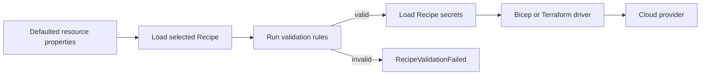

# Recipe Pack preflight validation

- **Author**: Mike Azure (@AzureMike)

## Problem

Radius resource schemas work across providers. Because of this, a Radius schema can allow a value that a specific provider rejects.

For example, the Azure Recipe Pack passes the PostgreSQL `database` property to an Azure child resource. Radius allows `database: 'postgres'`. Azure rejects it because every PostgreSQL Flexible Server already has a database named `postgres`.

Azure can create the PostgreSQL server before it rejects the database. The Radius resource then fails, but the Azure server still exists and can incur charges.

Radius needs to reject known provider-specific errors before it starts a Recipe.

## Proposal

Add optional validation rules to each Recipe definition. The Recipe Pack defines the rules because it chooses the provider and module.

Radius runs the rules:

1. After it selects the Recipe.
2. Before it loads Recipe secrets.
3. Before it starts the Bicep or Terraform driver.

The rules cover fixed restrictions that Radius can check without calling the provider. Examples include string length, format, and reserved names.

## Terms

| Term | Meaning |
| --- | --- |
| Portable resource | A Radius resource that uses a Recipe to choose its provider implementation. |
| Recipe Pack | A set of Recipe definitions, keyed by portable resource type. |
| Preflight validation | Validation that runs after Recipe selection and before the Recipe driver starts. |
| Provider-specific rule | A provider or module restriction that does not apply to every implementation of the portable resource. |
| Recipe driver | The Radius component that runs a Bicep or Terraform Recipe. |
| Authoring skill | Optional guidance for AI-assisted application authoring. It is not part of the Radius runtime. |

## Issue

[resource-types-contrib issue #299: Azure Recipe Pack accepts values that Azure rejects](https://github.com/radius-project/resource-types-contrib/issues/299)

## Goals

- Reject known provider-specific property errors before a Recipe can create provider resources.
- Keep portable resource schemas independent of any provider.
- Store provider rules in the Recipe Pack that owns them.
- Version the rules with that Recipe Pack.
- Use the same validation for Bicep and Terraform Recipes.
- Return a `RecipeValidationFailed` error that names the property but does not include its value.
- Keep current behavior for Recipe Packs without validation rules.

## Non-goals

- Predict region availability, quota, capacity, changing model availability, or temporary provider policy.
- Add Azure rules to shared `Radius.Data`, `Radius.Storage`, or `Radius.Messaging` schemas.
- Run custom validation code or make provider API calls during validation.
- Validate Recipe parameters set by platform operators. The first version validates only the defaulted developer properties in `ResourceMetadata.Properties`.
- Change delete behavior.
- Change simulated Environment behavior.
- Add validation to the authoring skill. The skill may include the same rules later, but runtime validation must work without it.
- Change CI configuration.

## User scenarios

### Invalid PostgreSQL database name

An application developer deploys a PostgreSQL resource with `database: 'postgres'` to an Environment that uses the Azure Recipe Pack.

Radius rejects `properties.database` before Azure creates a PostgreSQL server.

### Recipe Pack rules change with the provider

An Azure Recipe Pack maintainer records documented rules for names, lengths, formats, and reserved values with the affected Recipes.

If the pack changes its provider API or module version, the maintainer can update those rules without changing the portable resource type.

## User experience

The application resource stays provider-independent:

```bicep
resource database 'Radius.Data/postgreSqlDatabases@2025-08-01-preview' = {
  name: 'orders'
  properties: {
    environment: environment
    database: 'postgres'
    username: 'appadmin'
    password: password
  }
}
```

Radius fails the deployment before it starts the Recipe:

```text
RecipeValidationFailed: resource property "properties.database" is reserved by this Recipe's provider
```

The Recipe Pack contains the Azure rule:

```bicep
'Radius.Data/postgreSqlDatabases': {
  kind: 'bicep'
  source: 'mcr.microsoft.com/bicep/avm/res/db-for-postgre-sql/flexible-server:<version>'
  validation: {
    resourceProperties: {
      database: {
        minLength: 1
        maxLength: 63
        pattern: '^[A-Za-z_][A-Za-z0-9_-]{0,62}$'
        disallowedValues: [
          'postgres'
          'azure_maintenance'
          'azure_sys'
          'template0'
          'template1'
        ]
      }
    }
  }
}
```

## Design

### Runtime flow

The Core RP checks the validation rules when it stores a Recipe Pack.

For each deployment, the Recipe engine:

1. Loads the selected Recipe.
2. Checks the defaulted resource properties against the Recipe's rules.
3. Stops with `RecipeValidationFailed` if a property is invalid.
4. Loads Recipe secrets if the properties are valid.
5. Starts the Bicep or Terraform driver.



### Supported rules

The first version supports these string rules:

- Minimum length.
- Maximum length.
- A Go/RE2-compatible regular expression.
- Allowed values.
- Disallowed values.
- Case-insensitive comparison for allowed and disallowed values.

This design does not use JSON Schema. It does not allow executable validation code.

## Options considered

### Option 1: Radius checks rules from the Recipe Pack

This option adds a validation mechanism to Radius and adds provider rules to each Recipe Pack.

The Recipe Pack continues to point directly to the provider module:

```text
Recipe Pack -> Azure Verified Module -> Azure
```

The Recipe definition gains a `validation` field next to its existing `kind` and `source` fields. The field lists rules for the resource properties used by that Recipe.

For example, the Azure PostgreSQL Recipe defines rules for `database` in `resource-types-contrib`. Those rules can set a minimum length, maximum length, format, and reserved names.

When the Recipe Pack is installed, the Core RP stores the rules with the Recipe definition. When Radius later selects that Recipe for a deployment, the Recipe engine reads the rules and checks the defaulted resource properties.

The deployment flow is:

1. Radius selects the Recipe.
2. Radius reads the `validation` rules from the Recipe definition.
3. Radius checks the defaulted resource properties.
4. If a property is invalid, Radius returns `RecipeValidationFailed` and stops.
5. If the properties are valid, Radius loads Recipe secrets.
6. Radius starts the Bicep or Terraform driver.
7. The driver calls the provider module already named in `source`.

The work is split between the repositories:

- `radius-project/radius` defines the rule format, stores the rules in the Core RP, and runs one evaluator for Bicep and Terraform.
- `radius-project/resource-types-contrib` defines the Azure-specific rules in the Azure Recipe Pack.

No wrapper module is added. The Recipe Pack keeps its direct reference to the Azure Verified Module or Terraform module. Radius checks the values before either driver starts.

Advantages:

- Stops bad input before Bicep compilation.
- Stops bad input before Terraform installation or initialization.
- Stops bad input before Radius creates a provider deployment or cloud resource.
- Gives Bicep and Terraform the same behavior.
- Stores the rules with the pack and module version that need them.
- Keeps direct references to Azure Verified Modules and community Terraform modules.
- Covers deployments made through the API, CLI, GitOps, SDKs, and other clients.

Disadvantages:

- Requires a Core API change.
- Requires generated client changes.
- Requires config-loader and Recipe engine changes.
- Requires Radius support to ship before Recipe Packs can use the rules.
- Cannot check provider availability, quota, capacity, or other conditions that require a provider call.

### Option 2: Validate inside Bicep and Terraform wrappers

This option does not change Radius. The Recipe Pack points to a new wrapper module instead of pointing directly to the provider module.

For example, the Azure PostgreSQL Recipe currently points directly to the Azure Verified Module:

```text
Recipe Pack -> Azure Verified Module -> Azure
```

With Option 2, it points to a module owned by the Recipe Pack:

```text
Recipe Pack -> Recipe Pack-owned wrapper -> Azure Verified Module -> Azure
```

The wrapper accepts the same values that the Recipe currently passes to the provider module. It checks those values first. If they are valid, it passes them to the provider module unchanged. If they are invalid, the wrapper fails the deployment.

The Bicep and Terraform paths need separate wrappers:

- A Bicep wrapper uses Bicep parameter rules, assertions, or ARM validation. It then calls the original Bicep module.
- A Terraform wrapper uses variable validation or lifecycle preconditions. It then calls the original Terraform module.

Radius treats the wrapper like any other Recipe source. It loads secrets, starts the driver, and gives the inputs to the wrapper. Radius does not know that the wrapper contains validation.

This means validation runs inside the Bicep or Terraform execution:

1. Radius selects the Recipe.
2. Radius loads Recipe secrets.
3. Radius starts the Bicep or Terraform driver.
4. The driver loads and processes the wrapper.
5. The wrapper checks the input.
6. The wrapper either fails or calls the original provider module.

The wrapper code and its tests belong with the provider Recipe Pack in `radius-project/resource-types-contrib`. Each wrapper must be published as an artifact, and the Recipe Pack must point to that artifact instead of the original module.

Advantages:

- Requires no Radius API changes.
- Requires no Recipe engine changes.
- Keeps provider checks in provider-owned modules.
- Uses validation features that Bicep and Terraform module authors already know.

Disadvantages:

- Requires a wrapper for every direct Bicep and Terraform Recipe.
- Adds work to publish, pin, test, and update each wrapper.
- Implements the same rules twice.
- Can produce different errors and timing in Bicep and Terraform.
- Terraform must install and initialize before its validation runs.
- Terraform may defer some preconditions when values are unknown.
- Cannot guarantee that Radius has done no provider work before validation fails.
- Wrappers can get out of sync with the Recipe Pack or upstream module.

### Option 3: Put the rules only in the authoring skill

The Radius application-authoring skill records provider rules and tries to generate valid applications.

Advantages:

- Requires no Radius API changes.
- Requires no Recipe Pack API changes.
- Can catch mistakes while an application is being written.

Disadvantages:

- Does not cover hand-written Bicep.
- Does not cover existing applications.
- Does not cover API clients, SDKs, GitOps, or other tools that do not use the skill.
- Can become outdated when provider rules or module versions change.
- Depends on prompt context, token limits, model behavior, and the author following the advice.
- Cannot guarantee that Radius stops bad input before it creates provider resources.

## Decision

Use Option 1.

Radius adds an optional `validation` field to every Recipe definition. A Recipe Pack uses this field to list the fixed restrictions for the provider and module used by that Recipe.

For example, an Azure PostgreSQL Recipe currently has a `kind` and `source`:

```bicep
'Radius.Data/postgreSqlDatabases': {
  kind: 'bicep'
  source: 'mcr.microsoft.com/bicep/avm/res/db-for-postgre-sql/flexible-server:<version>'
}
```

With this change, the Recipe Pack adds `validation` next to `kind` and `source`:

```bicep
'Radius.Data/postgreSqlDatabases': {
  kind: 'bicep'
  source: 'mcr.microsoft.com/bicep/avm/res/db-for-postgre-sql/flexible-server:<version>'
  validation: {
    resourceProperties: {
      database: {
        minLength: 1
        maxLength: 63
        pattern: '^[A-Za-z_][A-Za-z0-9_-]{0,62}$'
        disallowedValues: [
          'postgres'
          'azure_maintenance'
          'azure_sys'
          'template0'
          'template1'
        ]
      }
    }
  }
}
```

Radius reads these rules from the selected Recipe and checks the resource properties before it loads secrets or starts Bicep or Terraform. Recipe definitions without `validation` keep their current behavior.

### Where each change goes

The work is split across two repositories:

| Repository | Changes |
| --- | --- |
| `radius-project/radius` | Add the `validation` API contract, validate rules when the Core RP stores a Recipe Pack, carry the rules through Recipe loading, and run them in the Recipe engine before secrets or drivers. Also update generated types and add runtime tests. |
| `radius-project/resource-types-contrib` | Add the Azure rules to the Azure Recipe Pack, attach those rules to the affected Recipe definitions, document each rule's Azure source, add boundary tests, and state the minimum Radius version required by the pack. |

The `radius` repository provides the validation mechanism. It does not contain Azure-specific names or limits.

The `resource-types-contrib` repository provides the Azure-specific rules. It does not implement validation or call Azure to check a value.

Portable resource schemas do not change. The Azure rules apply only when an Environment selects an Azure Recipe that contains them.

Option 2 can still be useful for modules called outside Radius or modules that already have their own validation. Option 3 can give earlier feedback while an application is written. Neither one replaces runtime validation in Radius.

## Recipe Pack contract

Add an optional `validation` field to `RecipeDefinition`:

```tsp
model RecipeDefinition {
  // Existing fields omitted.
  validation?: RecipeValidation;
}

model RecipeValidation {
  resourceProperties: Record<RecipePropertyValidation>;
}

model RecipePropertyValidation {
  minLength?: int32;
  maxLength?: int32;
  pattern?: string;
  allowedValues?: string[];
  disallowedValues?: string[];
  ignoreCase?: boolean;
}
```

Each `resourceProperties` key is the name of a top-level resource property.

The rules work as follows:

- A property without a rule is allowed.
- A missing or null optional property is ignored.
- A property with a rule must be a string when present.
- Length rules count Unicode characters.
- Patterns use Go's RE2-compatible regular-expression engine.
- `ignoreCase` affects only `allowedValues` and `disallowedValues`.

The Core RP rejects the Recipe Pack if:

- A property name is empty.
- A length is negative.
- `minLength` is greater than `maxLength`.
- A pattern does not compile.

A Recipe Pack without `validation` works as it does today.

## Recipe loading

The Recipe Pack API model, datamodel conversion, and Environment config loader must keep the validation rules with the selected Recipe.

Environment-level Recipe parameter reconciliation does not change the rules. The rules apply to resource properties, not Recipe parameters.

## Recipe engine

The Recipe engine runs validation after it loads the selected Recipe and resolves the driver kind. It runs validation before `getRecipeConfigSecrets` and `driver.Execute`.

Create and update use validation.

Delete does not. Users must still be able to delete an old or partly deployed resource after a Recipe Pack adds stricter rules.

Simulated Environments keep their current behavior and do not run Recipes.

## Azure Recipe Pack rules (`resource-types-contrib`)

The Azure Recipe Pack stores its rules in a checked-in data file. The pack's Bicep definition loads the file.

The pack documentation records:

- The affected property.
- The rule.
- The provider source for the rule.

The first set of fixed rules covers:

- PostgreSQL database and administrator restrictions.
- MySQL database and administrator restrictions.
- Azure SQL database names.
- Event Hub names used by the Kafka Recipe.
- Blob container names.

Do not add incomplete or changing rules to the offline rule set.

Cosmos DB Mongo rules need either complete published documentation or repeatable provider tests.

Azure AI model, version, SKU, region, capacity, and quota combinations remain provider checks because they can change.

## API design (`radius`)

Add `validation` to `Radius.Core/recipePacks` in the next preview API version approved by maintainers.

A Recipe Pack that uses validation must use the new API version. An older Core RP must reject the request instead of ignoring the new field.

The current preview API remains available for older packs without validation.

This change adds no CLI commands or arguments. Existing deployment commands report `RecipeValidationFailed` through the current resource status and error paths.

## CLI design

No CLI changes.

## Implementation by repository

### `radius-project/radius`

Generated Radius Bicep types include the validation fields.

The Recipe engine checks the rules before it loads secrets or starts a driver.

The same evaluator handles Bicep and Terraform Recipes.

Update the Core RP API, generated models, datamodel, converters, and Recipe Pack create and update controller to carry and validate the new field.

Do not change portable resource schemas.

Their processors continue to apply provider-independent schema validation and defaults before Recipe execution.

### `radius-project/resource-types-contrib`

Store the Azure rules in a checked-in JSON file.

Load that file from the Azure Recipe Pack's Bicep definition and assign the needed rules to each Recipe.

Add tests for the Azure limits and reserved values. Document the source of each rule and the minimum Radius version required by the pack.

## Errors

Invalid resource input returns `RecipeValidationFailed` with the current `RecipeSetupError` deployment status.

The error includes a path such as `properties.database` and describes the failed rule. It does not include the submitted value. A future pack may validate a sensitive property, and that value must not appear in resource status, logs, or API errors.

Invalid rule definitions fail the Recipe Pack create or update request with `BadRequest`. The error names the resource type and invalid rule.

The runtime also checks for invalid rules that were stored before the Core RP added storage-time validation.

## Test plan

- Round-trip the rules through the Recipe Pack API, datamodel, and Environment config loader.
- Test valid values.
- Test missing optional properties.
- Test Unicode length.
- Test patterns.
- Test allowed values.
- Test disallowed values.
- Test case-insensitive comparisons.
- Test properties with the wrong type.
- Test invalid rule definitions.
- Check that invalid input returns `RecipeValidationFailed` and `RecipeSetupError` before Radius calls the secrets loader or either mock driver.
- Check that valid input reaches both Bicep and Terraform drivers unchanged.
- Check that packs without validation keep their current behavior.
- Check that simulated Environments still skip Recipe execution.
- Check that delete still works.
- Add table-driven Azure tests for documented limits, reserved names, casing, and punctuation.
- Compile the checked-in Azure Recipe Pack against the generated Radius Bicep types.
- Use representative live provider tests when provider documentation is incomplete. Each test must isolate and delete its resources.

This design does not change CI workflows.

## Security

The rules are data. They cannot run code, load remote content, or call a provider.

Go regular expressions use linear-time matching. They do not allow denial of service through regular-expression backtracking.

Existing Recipe Pack write permissions control who can set the rules for an Environment.

Errors include the property path and failed rule. They do not include the property value.

This change does not affect authentication, authorization, credentials, or secret retrieval.

## Compatibility and release order

Existing Recipe Packs do not have a `validation` field, so they keep their current behavior.

Validation runs only for create and update. A new rule cannot block deletion of an existing resource.

Radius support must ship before a Recipe Pack uses validation. Older Core RP versions ignore unknown fields in the current Recipe Pack API. If a pack sent `validation` to that API, the Core RP could drop the field and run the Recipe without validation.

The new field must therefore use a new preview API version. Packs that use it can be published only after that Radius version is available. Pack documentation must state the minimum supported Radius version.

## Monitoring and logging

Validation failures use the current Recipe error and deployment status paths.

Recipe engine metrics record `RecipeValidationFailed` as the operation result.

Resource status and Core RP request logs include the property path and failed rule.

No new telemetry is needed.

## Development plan

1. Add the contract, rule validation, config-loader changes, Recipe engine check, generated types, and tests to Radius.
2. Release the new Core preview API and test it end to end.
3. Add verified provider rules, sources, and boundary tests to the Azure Recipe Pack.
4. Publish an immutable Azure Recipe Pack version that states its minimum Radius version.
5. Optionally add the same rules to the Radius authoring skill for earlier feedback. Do not make runtime correctness depend on the skill.

## Open questions

### Which Core API version adds validation?

Use the next preview version approved by maintainers. Do not assign a date until maintainers choose the version.

### Should `postgres` use Azure's existing database instead of failing?

No.

`Radius.Data/postgreSqlDatabases` creates and owns a database. Using an existing database would change ownership, deletion, security, and outputs. That behavior needs a separate design.

### How should the pack handle changing Azure AI restrictions?

Azure remains the source for region, quota, capacity, and model availability.

Add an offline allowlist only when the Recipe Pack owns and tests a stable model, version, and SKU combination.

## Other rejected ideas

The main rejected options are Bicep and Terraform wrappers without Core changes, and authoring-skill guidance without runtime checks. [Options considered](#options-considered) lists their tradeoffs.

Azure rules do not belong in portable resource schemas because those schemas also apply to other providers.

Using wrappers only for validation would remove direct Recipe module support and require another set of artifacts to publish and maintain.

## Design review notes

Pending design review.
