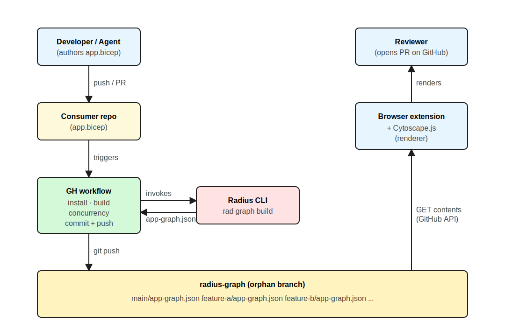

# Application Graph Visualization

* **Author**: Nithya Subramanian (@nithyatsu)

## Overview

Radius provides an **application resource** that lets teams define and deploy their entire application — including compute, relationships, and infrastructure — as a single unit. Developers express the resources that make up an application (containers, databases, message queues, etc.) along with the relationships between them. Together, these form the **Radius application graph**: a directed graph of resources and their connections.

The application graph serves two key purposes:

1. **Deployment and configuration** — Radius uses the graph to understand resource dependencies, enabling it to orchestrate deployment and inject configuration automatically.
2. **Visualization** — The graph gives users an intuitive, topology-based view of their application rather than a flat list of resources.

This design extends the application graph from a runtime-only, CLI-only tool to a **multi-modality visualization system** which can be embedded directly in the GitHub developer workflow. The key additions are:

* A **modeled/planned application graphs** built from Bicep definitions (no deployment required). This is the core Radius enhancement.
* A **CI/CD pipeline** that automatically builds graph artifacts on every push and PR.
* A **diff visualization** that highlights added, removed, and modified resources when reviewing pull requests and readme.md. 
* A **browser extension** that injects interactive graph visualizations into GitHub repository pages and pull requests. 

> **Feature Spec Reference:** [2026-04-github-app-graph-visualization-feature-spec](https://github.com/willtsai/radius/blob/app-graph-viz-gh-feature-spec/eng/design-notes/app-graph/2026-04-github-app-graph-visualization-feature-spec.md) by Will Tsai (@willtsai)

### What exists today

Radius currently supports a single type of application graph — the **deployment graph** — via the `rad app graph` CLI command. This command calls a Radius API that queries the control plane for all deployed resources, constructs edges based on the `connections` property of each resource, and returns the serialized graph. See [Radius App Graph](2023-10-app-graph.md) for details on how the API builds this graph. Because it reflects live infrastructure, this graph is only available after an application has been deployed.

### Proposed graph types

This design proposes extending Radius to support three kinds of application graph:

#### 1. Modeled application graph

A graph constructed from application definitions authored in Bicep files (or their compiled JSON output), **without** deploying the application. This is useful for:

* Visualizing application architecture from source code checked into a repository.
* Highlighting infrastructure changes introduced by a Pull Request.

**Limitation:** Because the concrete infrastructure resources depend on the recipe bound to each resource type — which in turn depends on the target Radius environment — the modeled graph cannot include infrastructure-level details.

#### 2. Planned deployment graph

A graph that shows what the concrete infrastructure resources and their dependencies **would be** if an application definition were deployed using a specific environment, without actually deploying it. 

#### 3. Deployed application graph (deployment graph)

The graph of a **live, deployed** application, as described above. This is the only graph type supported today.

## Terms and definitions

| Term | Definition |
|------|------------|
| **Application graph** | A directed graph of the resources that make up a Radius application and the connections between them. Used by Radius for dependency-aware deployment and configuration injection, and by users for topology visualization. |
| **Modeled graph** | Graph derived purely from a Bicep application definition (or its compiled ARM JSON), without contacting any Radius environment. Contains application-level resources and their connections, but no recipe-produced infrastructure. |
| **Planned graph** | Graph derived from a Bicep application definition resolved against a specific Radius environment and resource group, without actually deploying. Includes the `outputResources` that recipes would produce. |
| **Deployed graph** | Graph of a live, deployed application, returned by the existing `getGraph` custom action on `Applications.Core/applications`. Reflects the actual state stored in the Radius control plane. |
| **Recipe** | A Bicep or Terraform template bound to a Radius resource type in an environment that materializes the concrete infrastructure for a resource at deploy time. |
| **Radius environment** | A named scope (with a resource group) that binds resource types to recipes and supplies environment-specific configuration. Required to produce a planned or deployed graph; not required for a modeled graph. |
| **Browser extension** | Chrome / Edge extension (in the github-extension repo) that reads `app-graph.json` files (serialized `ApplicationGraphResponse`) from the `radius-graph` branch and renders them with Cytoscape on GitHub pages. Out of scope for this design. |

> **Issue Reference:** <!-- TODO: Link to tracking issue -->

### Goals

* Define a graph schema that is flexible and extensible enough to represent static, run-time, and simulated deployment graphs.
  * Review the server-side API (`getGraph` custom action on `Applications.Core/applications|Radius.Core/applications`) that returns the run-time application graph for a deployed application, based on schema decisions.
* Identify a persistence mechanism since the graph should be available irrespective of the ephemeral nature of Radius control plane. The graph construction is still an in-memory operation.
* Provide CLI commands that enables users to access these graphs

### Non-goals

* Graph display specifics
* Workflow specifics

While these are essential for repo-radius work, they are not part of core Radius. 

### User scenarios

All the  scenarios are UI-based. To enable these user experiences through visualizations, Radius will be enhanced to support commands that produce [the three graph command variations](#proposed-graph-types). However, the methods to invoke these commands, visualization libraries, and rendering effects are not part of core Radius.

#### Scenario 1: PR diff visualization with change highlighting

A developer modifies `app.bicep` to add a new Redis cache and connect it to an existing container. When they open a pull request, a color-coded diff graph appears below the PR description: added resources in **green**, removed resources in **red**, modified resources in **yellow**, and unchanged resources in **gray**. The reviewer can click any node to navigate to the source code or the `app.bicep` definition line.

#### Scenario 2: Repository root architecture diagram

When a developer navigates to the repository root on GitHub, an "Application graph" tab appears next to the README tab. Clicking it shows the current application topology for the `main` branch — always up to date because CI rebuilds it on every merge.

#### Scenario 3: Interactive navigation from graph to code

A developer clicks on a node in the graph (e.g., "cache") and sees a popup with links to: (1) the source code file referenced by the `codeReference` property, and (2) the `app.bicep` line where the resource is declared.

#### Scenario 4: Deployed graph

Once the user deploys an application, The repository should link to the deployed app graph, along with the details for each "concrete" resource.

## Design

### High Level Design for App Graph - Repo Radius

The system consists of four components that work together:

**Users/Agents**

Developer authors/modifies app.bicep. This could be through UI Buttons and/or Agents that create the PR on user's behalf.                
1. Developer/Agent pushes branch and opens PR   
2. Developer/Agent merges the new app deifintion to main

**Radius**

Supports required rad graph commands. The commands are context aware and can determine whether they are being run in repo-radius mode. If so, 
they commit the graph artifact to an orphan branch as app-graph.json. If not, they output to a local file.

**GH workflow**

1. Runs the appropriate rad graph command based on the event.
3. Handles concurrency. 

**Browser extension**

1. Reads the app-graph.json commited to orphan branches 
2. Parse and render using Cytoscape.

We will merge Workflows,  Browser extension and Graph-renderer cytoscape.js java scripts into the github-extension repository. Radius changes will be merged into the Radius repository.



> Source files: [2026-04-app-graph-components.svg](2026-04-app-graph-components.svg) (rendered above) and [2026-04-app-graph-components.excalidraw](2026-04-app-graph-components.excalidraw) (editable in the Excalidraw VS Code plugin).

### Detailed Design

#### User Experience

##### Accessing deployed graph 

Below command exist today in Radius to access the deployed application graph:

```
#Show graph for specified application. Default to default application
rad app graph [my-application]
```

We will enhance the above command to 
- persist the output to `radius-graph` orphan branch at `/deployments/groupname-envname/app-graph.json`, if [running for repo-radius](link to repo-radius doc). This is because groupname-envname uniquely identifies an environment, and we can have multiple live app deployments one per environment.

When a rad deploy is called as part of repo-radius, there could also be a call to rad app graph [app-name] and persist that to `radius-graph` branch 
at /deployments/groupname-envname/app-graph.json.

There will be no changes to output when rad deploy is called on a persistent control plane, like we do today.

##### Accessing modeled graph

We build on the existing `rad app graph command` to access other kinds of graphs.

```
#Show modeled graph for specified my-app.bicep. Default ./app.bicep
rad app graph [--bicep [/path/to/my-app.bicep]] [-o /path/to/output.json]

Compiling app.bicep → /tmp/app.json
Parsed 4 resources, 3 connections
Committed [source-branch-name]/app-graph.json to branch radius-graph
```

The command:
1. compiles `app.bicep` to ARM JSON.
2. Parses resources, connections, `dependsOn`, and `codeReference` from the JSON.
3. Detects source line mappings by scanning the Bicep file for `resource` declarations.
4. Computes a `diffHash` for each resource based on relevant properties.
5. Commits the resulting `ApplicationGraphResponse` JSON to `{source-branch}/app-graph.json` on the orphan `radius-graph` branch, if it is run in the context of a github runner (repo radius). Otherwise writes the JSON to `app-graph.json` in the current directory or specified location. At any point, there can be exactly one modeled graph per repo branch.

##### Accessing planned graph

The planned graph is richer than the modeled graph. It additionally includes the concrete output resources produced by each recipe, resolved against a specific environment.
The details of implementation are at a high level and require further research/experimentation.

```
#Show a dry-run of  app.bicep if deployed using recipes in environment env in group grp
rad app graph --bicep [app.bicep] -e env [-g grp]
```
The command 

1. Invokes `bicep build` to compile `app.bicep` to ARM JSON.
2. Parses resources, connections, `dependsOn`, and `codeReference` from the JSON.
3. Detects source line mappings by scanning the Bicep file for `resource` declarations.
4. Computes a `diffHash` for each resource based on relevant properties.
5. Resolves resources craeted by recipes.
6. Commits the resulting `ApplicationGraphResponse` JSON to `{source-branch}/scopename-envname/app-graph.json` on the orphan `radius-graph` branch, if it is run in the context of a github runner (repo radius). Otherwise writes the JSON to `app-graph.json` in the current directory.

There are 2 potential approaches to how the recipe resources command can be resolved:

*static inferences*

1. Invokes `bicep build` to compile `app.bicep` to ARM JSON.
2. Parses resources, connections, `dependsOn`, and `codeReference` from the JSON.
3. For each of the resources, resolves recipe that will be used based on provided environment information
4. Run `bicep build` on recipe or [`terraform graph`](https://developer.hashicorp.com/terraform/cli/commands/graph) on recipe to gather as much detail as possible statically
5. Integrate back to the `ApplicationGraphResponse` through the `outputResources` field. 
6. Commit to orphan branch

*simulated inferences [prefered]*

Radius currently supports a simulated environment. At a high level, this makes an entry in Radius datastore for each reasource, identical to what a `rad deploy` does. But the deployment status is used to indicate the resources have not been deployed yet. The simulated environment also does not do a dry-run on the recipes. 
We could choose to reuse this idea and enhance it so that we populate outputResources using dry-run abilities of bicep and terraform.
We prefer this approach, since it 


##### Implementation approach

#### Git dependency

While it is ideal for Radius to not take an additional dependencies, Radius already has a git dependency because of Gitea. Further, If we use workflows to own orphan branch + graph data handling, these functionalities will not be tested as part of core Radius. Therefore, we are handling git interactions 
through a new package in Radius (pkg/cli/gitstate/).  

#### Detecing repo-radius mode

GitHub Actions guarantees that the [`GITHUB_ACTIONS`](https://docs.github.com/en/actions/reference/workflows-and-actions/variables) environment variable is set to `true` for every step that runs inside a runner . `rad app graph` could check `os.Getenv("GITHUB_ACTIONS") == "true"` to detect repo-radius mode, and handle command outputs/ persistence accordingly. 

##### Schema

The persisted graph artifact is simply the existing `ApplicationGraphResponse` API type, serialized to JSON and committed as `app-graph.json`. The three new fields needed for code/static analysis (`diffHash`, `appDefinitionLine`, `codeReference`) are added as **optional** fields on `ApplicationGraphResponse`. Existing consumers/graph type ignore unknown fields, so this is backward compatible.
The graph **type** (modeled / planned / deployed) is derivable from the data itself.

  | Graph type | `provisioningState` | `outputResources` |
  |---|---|---|
  | Modeled  | `NotSpecified` on every resource | empty |
  | Planned  | `NotSpecified` on every resource | populated (from recipe dry-run) |
  | Deployed | `Succeeded`, `Failed`,... | populated |

Consumers (the browser extension, `rad`) can determine which graph they are looking at from these two fields without an explicit `kind` discriminator.

For both `Applications.Core/applications` and `Radius.Core/applications`, the corresponding `ApplicationGraphResponse` type (`corerpv20231001preview.ApplicationGraphResponse` / `corerpv20250801preview.ApplicationGraphResponse`) is the on-disk schema.

###### Complete artifact example for modeled graph

A modeled-graph example for an application with a frontend container connected to a Redis cache. We reuse `ApplicationGraphResponse`, with the three new optional fields populated:

```json
{
  "resources": [
    {
      "id": "/planes/radius/local/resourcegroups/default/providers/Applications.Core/containers/frontend",
      "name": "frontend",
      "type": "Applications.Core/containers",
      "provisioningState": "NotSpecified",
      "connections": [
        {
          "id": "/planes/radius/local/resourcegroups/default/providers/Applications.Datastores/redisCaches/cache",
          "direction": "Outbound"
        }
      ],
      "outputResources": [],
      "diffHash": "sha256:883755ad2f9e...",
      "appDefinitionLine": 23,
      "codeReference": "src/frontend/index.ts"
    },
    {
      "id": "/planes/radius/local/resourcegroups/default/providers/Applications.Datastores/redisCaches/cache",
      "name": "cache",
      "type": "Applications.Datastores/redisCaches",
      "provisioningState": "NotSpecified",
      "connections": [
        {
          "id": "/planes/radius/local/resourcegroups/default/providers/Applications.Core/containers/frontend",
          "direction": "Inbound"
        }
      ],
      "outputResources": [],
      "diffHash": "sha256:b4e91c3d7a01...",
      "appDefinitionLine": 45,
      "codeReference": "src/cache/redis.ts#L10"
    }
  ]
}
```

#### DiffHash computation

```go
func ComputeDiffHash(properties map[string]interface{}, dependsOn ...string) string {
    // 1. Remove non-authorable keys (application, environment)
    // 2. Canonicalize to sorted JSON
    // 3. Append sorted dependsOn
    // 4. Return "sha256:<hex>" of canonical form
}
```

The diffHash enables the browser extension(UI component) to classify resources as modified vs unchanged without comparing all properties.

#### Graph persistence

The graph is constructed in-memory but must be persisted so it remains accessible when the Radius control plane is not running (e.g., in GitHub Actions CI/CD where the cluster is torn down after each run). repo radius persists graphs to git. However, Radius should be able to configure persistence targets as needed in future. 

| Graph type | Persisted where | Written when |
|---|---|---|
| modeled graph | `{branch}/app-graph.json` on `radius-graph` orphan branch | CI runs `rad graph build` on push/PR |
| planned graph | `{branch}/scopename-envname/app-graph.json` on `radius-graph` orphan branch | TBD |
| deployed graph | `{branch}/deployments/scopename-envname/app-graph.json` on `radius-graph` orphan branch | `rad shutdown` serializes after deploy |

All three commands take an optional -o argument which can write to a specified file for the non repo-radius mode.

**Why orphan branches?**

- No interference with application code history.
- GitHub Contents API provides easy access without local checkout.
- Natural per-branch organization (`main/app.json`, `feature-branch/app.json`) and versioning.
- Zero additional infrastructure — git is already available with `actions/checkout` credentials.

**Run-time graph persistence via `rad shutdown`:**

The `rad shutdown` command backs up PostgreSQL state and tears down the k3d cluster. A natural extension is to call `getGraph` for each deployed application during shutdown and write the graph JSON to the `radius-graph` orphan branch as `deployments\scopename-envname\app-graph.json`. This would make run-time graphs available for visualization even after the cluster is destroyed, and will be updated everytiem there is a deployment — enabling the UI to show deployed infrastructure topology from the last known state.

#### Workflow 

The workflow will be responsible for installing rad cli, running the rad graph command on appropritate events (merge to main, PR against main from a fork). 

##### Concurrent PR handling

Multiple PRs can be open simultaneously, each writing to the same `radius-graph` orphan branch. Conflicts are avoided through:

**1. Directory-per-branch isolation.** Each PR writes to its own directory on the orphan branch. Since different PRs are from different source-branch, their artifacts never overwrite each other — they're in separate directories within the same branch.

**2. GitHub Actions concurrency group.** The reusable workflow uses a concurrency group scoped to the triggering ref:

```yaml
concurrency:
  group: build-app-graph-${{ github.ref }}
  cancel-in-progress: true
```

This means: if a new push arrives on the same PR branch while a previous graph build is still running, the in-progress build is cancelled and replaced. 

## Test plan

### Unit tests

| Component | Test file | Coverage |
|-----------|----------|----------|
| DiffHash computation | `pkg/cli/graph/diffhash_test.go` | Determinism, stability across map iteration, different properties produce different hashes, dependsOn affects hash, empty properties |
| Modeled graph build | `pkg/cli/graph/build_test.go` | Resource extraction, connection parsing, `resourceId()` expression resolution, source line mapping |
| Planned graph build | `pkg/cli/graph/planned_test.go` | Recipe resolution, `outputResources` population from dry-run, fallback when recipe unresolved |
| Orphan branch primitives | `pkg/cli/gitstate/gitstate_test.go` | Worktree create/remove, orphan branch init from empty-tree SHA, fetch+rebase+push retry |


### Functional tests

| Test | Description |
|------|-------------|
| End-to-end modeled graph | Compile a test `app.bicep`, run `rad app graph --bicep`, verify output JSON matches expected artifact |
| End-to-end planned graph | Run `rad app graph --bicep -e simulated-env`, verify `outputResources` are populated for resources backed by recipes |

## Security

| Concern | Mitigation |
|---------|-----------|
| GitHub token storage | Stored in `chrome.storage.local` (extension-only storage, not accessible to web pages). No tokens in graph artifacts. |
| Orphan branch permissions | Requires `contents: write` permission in CI. Graph artifacts contain no secrets — only resource names, types, and connections. |
| Extension permissions | Minimal permissions: `activeTab`, `storage`. Content scripts scoped to `github.com`. |
| Token in auth flow | Device flow uses short-lived user codes. PATs entered manually by user. No client secrets stored in extension. |
| Graph artifact content | Contains only application topology (resource names, types, connections). No credentials, secrets, or infrastructure details. |

## Compatibility

| Concern | Impact |
|---------|--------|
| Existing `rad app graph` | No breaking changes. The existing command continues to work unchanged. |
| `ApplicationGraphResponse` schema | New fields (`diffHash`, `appDefinitionLine`, `codeReference`) are optional. Existing consumers are unaffected. |
| Browser support | Extension uses Chrome Extension Manifest V3. Compatible with Chrome 88+ and Edge 88+. |
| GitHub API | Uses public REST API v3 (Contents API, Pull Requests API). No dependency on preview features. |

## Monitoring and Logging

| Component | Instrumentation |
|-----------|----------------|
| `rad app graph --bicep` | Logs: graph type (modeled/planned), resource count, connection count, compilation time, commit SHA. Errors: Bicep compilation failures, recipe resolution failures, git operations. |
| `pkg/cli/gitstate/` | Logs: branch fetch, worktree path, commit SHA, push retries. |
| CI workflow | Standard GitHub Actions logging. Step-level timing. |
| Browser extension | `console.debug` for page detection, artifact fetching, graph rendering. `console.error` for API failures. |

## Development plan

This plan covers only the Radius-side work. Browser extension, workflow authoring, and visualization rendering are tracked in the repo-radius project and are out of scope for this design.

**Tasks (Radius CLI)**

1. **Introduce `pkg/cli/gitstate/`** — encapsulate orphan-branch fetch / worktree / commit / push so callers do not deal with raw git commands. This is the foundation that every persistence task below depends on.
2. **Extend `ApplicationGraphResponse`** in both `corerpv20231001preview` (`Applications.Core/applications`) and `corerpv20250801preview` (`Radius.Core/applications`) with three optional fields — `diffHash`, `appDefinitionLine`, `codeReference` — and add the `diffHash` computation in `pkg/cli/graph/`. No new envelope type; the graph type is derived from `provisioningState` + `outputResources`.
3. **Add `rad app graph --bicep [path]`** for the modeled graph.
   - Compile Bicep → ARM JSON, parse resources/connections/`dependsOn`.
   - Identify a robust mechanism to map each resource back to its source line (candidates: scanning the `.bicep` file for `resource` declarations, or using Bicep sourcemap output if available) and emit `appDefinitionLine` + `codeReference` so the UI can deep-link from a node to source code.
   - Compute `diffHash` per resource.
   - Persist via the persistence abstraction (see task 6).
4. **Add `rad app graph --bicep -e env [-g grp]`** for the planned graph.
   - Reuse the modeled-graph pipeline, then resolve recipe outputs against the target environment to populate `outputResources`. Prototype both static inference (`bicep build` / `terraform graph` on the recipe) and the simulated-environment approach; pick one based on findings.
5. **Enhance `rad app graph [app-name]`** to persist the deployed graph artifact to `{branch}/deployments/groupname-envname/app-graph.json` on the `radius-graph` orphan branch when running in repo-radius context. No change to behavior outside that context.
6. **Make persistence pluggable** — introduce a small `GraphStore` interface in `pkg/cli/graph/` with a git-orphan-branch implementation backed by `pkg/cli/gitstate/` and a local-file implementation. All three commands above write through this interface so the persistence target is decoupled from graph construction and new targets (e.g., blob storage) can be added later.

**Testing**

- Unit tests for each package (`gitstate`, `graph`, diffHash, source-line mapping) as listed in [Test plan](#test-plan).
- Functional tests that exercise each graph command variant end-to-end 
- A repo-radius E2E that runs the reusable workflow on a sample app, has the browser extension consume the resulting artifact, and asserts the graph renders for the repo tab and the PR diff view. This validates the Radius CLI contract from the consumer side; the workflow and extension themselves are owned by repo-radius.

**Phasing**

| Phase | Scope | Priority |
|-------|-------|----------|
| **Phase 1: Foundations** | `pkg/cli/gitstate/`, `ApplicationGraphResponse` schema extensions (`diffHash` / `appDefinitionLine` / `codeReference`), `GraphStore` abstraction, diffHash computation | P0 |
| **Phase 2: Modeled graph** | `rad app graph --bicep` with source-line mapping and `codeReference` | P0 |
| **Phase 3: Deployed graph persistence** | `rad app graph [app-name]` writes to `radius-graph` orphan branch in repo-radius context | P0 |
| **Phase 4: Repo-radius E2E** | Wire the CLI into the repo-radius workflow + browser extension and validate end-to-end | P0 |
| **Phase 5: Planned graph detailed design+impl** | `rad app graph --bicep -e env [-g grp]`; recipe resolution to populate `outputResources` | P1 |

## Open Questions

2. Should we use a single orphan branch (radius-state) for both graph and state?

2. **Cross-control-plane deployment tracking:** When the same `app.bicep` is deployed potentially by multiple Radius control planes (e.g., an ephemeral CI plane and a persistent staging plane), each control plane maintains its own independent view of the application in its own database. In addition, users can use cloud provider cli/ portals to change the configuration to suit their needs. If an instance of control plane or an  user modifies the resources of the  application, then Radius's stored state and `getGraph` output become stale.

Note that the modeled graph (`rad app graph --bicep`) is unaffected — it always reads from the Bicep source in the repository and is independent of any control plane. It depicts the app graph as inferred from the code.

Only the deployed graph (from `getGraph`) is affected by this problem.

Possible approaches to drift:

**Approach 1: Single-writer enforcement.** Add a constraint that only one control plane can deploy a given application at a time — essentially an ownership claim. A second control plane attempting to deploy the same application would receive an error. This avoids the stale-data problem entirely by preventing it, but limits flexibility for multi-environment workflows. The detection mechanism can reuse the same metadata fields proposed in Approach 2 (`lastModifiedBy`) to identify whether another control plane currently owns the application. However, this leads to a poor user experience: an operator who wants to apply a minor tweak to a resource property via the AWS or Azure portal would be forced to use `rad deploy` instead.

**Approach 2: Application-level "last modified" metadata.** Add `lastModifiedAt` (UTC timestamp) and `lastModifiedBy` (control plane identifier, e.g., cluster name) as properties on the Application resource itself. When `getGraph` is called, the control plane compares its stored `lastModifiedAt` with the value on the Application resource to detect whether another instance has made changes since the last deployment. This does not prevent staleness but makes it detectable. However, it requires support for synchronizing/ refreshing state.

**Drift detection and refresh** Today, comparable products already maintain state and offer drift detection:
- **Pulumi** — [Drift Detection and Remediation](https://www.pulumi.com/blog/drift-detection/) via `pulumi refresh` (manual) or scheduled drift detection in Pulumi Cloud (automated).
  
- **Terraform** — [Health Assessments with Drift Detection](https://developer.hashicorp.com/terraform/cloud-docs/workspaces/health#drift-detection) in HCP Terraform, plus `terraform plan -refresh-only` in the open-source CLI.

Drawing from these approaches, Radius could offer `rad` commands to detect drift and apply a refresh. At a high level, this would involve:

1. Query the Application resource for its `lastModifiedAt` (UTC) and `lastModifiedBy`. If a newer timestamp from a different control plane is found, offer a `rad` command to refresh the local state. This addresses concurrent updates by multiple Radius instances, but doesn not detect drifts induced by users.

2. Query each resource of the application against its actual cloud provider state. If the deployed properties differ from what Radius has recorded, enable updating the stored state to match the actual deployment. This addresses changes made directly through cloud provider consoles or CLIs.

## Alternatives considered

### Static graph: Parse Bicep directly vs compile to ARM JSON

**Option considered:** Parse `.bicep` files directly in Go to extract resources and connections.

**Rejected because:**

- Requires a Bicep parser in Go (none exists; Bicep is C#/.NET).
- Must handle Bicep's full expression language (interpolation, conditionals, loops).
- Cannot handle Bicep modules without recursive resolution.
- Ongoing maintenance burden as Bicep syntax evolves.

**Chosen approach:** Compile to ARM JSON via `bicep build`, then parse the stable JSON format. See [Accessing modeled graph](#accessing-modeled-graph) for details.

### Graph persistence: File in repo vs orphan branch vs external storage

| Option | Pros | Cons |
|--------|------|------|
| File in repo (e.g., `.radius/graph.json`) | Simple, visible in PRs | Clutters commit history, merge conflicts |
| Orphan branch | Clean separation, no history interference | Requires git operations, less discoverable |
| External storage (S3, Azure Blob) | Scalable | Extra infrastructure, auth complexity |
| GitHub Actions cache | No extra infra | Unpredictable eviction (7-day TTL, LRU) |
| GitHub Actions artifacts | Cross-run accessible | Retention limits, complex download logic |

**Chosen approach:** Orphan branch. Clean separation from application code, natural per-branch organization, accessible via GitHub API. This is consistent with the `filesystem-state` branch's choice of orphan branches for PostgreSQL state persistence, validated by the same analysis (see [GitHub Actions Workspace](../2026-03-github-workspace-design.md) alternatives considered).

The implemnentation should be decoupled from the persistence target as part of an extensible design.

---
### Resource property selection

The graph JSON includes properties for each resource node. There are three approaches considered:

**Approach A: Include all properties (current behavior) [Preferred, current implementation]**

Dump every property from the resource's stored state into the graph node. All properties are read from the Radius control plane datastore.

| Pros | Cons |
|---|---|
| Simple — no schema changes needed | Graph JSON can be large |
| Consumers have full data | May include noisy or irrelevant fields |
| Forward-compatible | Harder to guarantee stable rendering contract |

**Approach B: Schema-driven property selection**

Extend the resource type YAML manifest with a `graphProperties` list declaring which properties to include.

| Pros | Cons |
|---|---|
| Compact graph JSON | Requires annotations on every resource type |
| Stable rendering contract | New properties hidden by default |

**Approach C: Hybrid — full dump with display hints**

Include all properties but add a `displayProperties` list for recommended rendering.

| Pros | Cons |
|---|---|
| Full data always available | Graph JSON size not reduced |
| Display hints guide UI | Two sources of truth |

## Design Review Notes

<!-- Update this section with the decisions made during the design review meeting. -->
