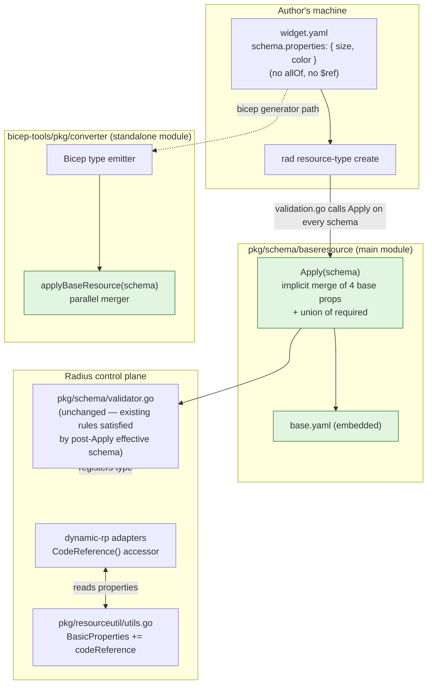

# Base Resource Manifest

* **Author**: @nithyatsu

## Overview

Today every Radius resource type a contributor authors must copy the same four "Radius-aware" schema properties — `application`, `environment`, `connections`, and (newly) `codeReference` — into its manifest YAML. This is rote duplication that authors get wrong and it leaks Radius framework concerns into every per-type schema.

This design introduces a single repo-owned **base resource manifest** that declares those four common properties once. The CLI validator (`rad resource-type create`) and the Bicep extension generator (`bicep-tools`) **implicitly merge** the base into every per-type schema before validation and Bicep-type emission, using per-type-wins precedence. The author writes only their type-specific properties — no opt-in keyword, no new vocabulary, no `$ref` to remember.

**The existing schema validator is unchanged.** The base manifest declares `environment` in its `required:` array, so after the merge every type has `environment` in its effective `required:` list. The existing "every schema must declare `environment`" rule continues to pass for every type automatically. This is a pure ergonomics win at authoring time and a no-op at the runtime layer.

`codeReference` is introduced as a new recognized common property in this feature. Its v1 wire shape is a single optional string treated as a URI (e.g. a Git URL with commit SHA and line range). A richer structured shape is an additive future change.

> **Note on direction.** An earlier iteration of this design proposed an author-visible opt-in via `allOf: [{ $ref: "radius:base" }]` ("Approach A"). After implementing that approach end-to-end and building a working alternative POC of implicit injection on branch [`poc/210-base-resource-manifest-implicit-injection`](https://github.com/radius-project/radius/tree/poc/210-base-resource-manifest-implicit-injection), the feature owner reversed the OQ-001 decision to favour implicit injection ("Approach B") **for now**. The full side-by-side comparison — including the trade-offs that make the explicit-keyword design worth keeping as a credible fallback — lives in [Alternatives considered](#alternatives-considered) below.

## Terms and definitions

| Term | Meaning |
|---|---|
| **Base resource manifest** | The single repo-owned YAML file that declares the four common Radius properties and their shapes. Shipped with Radius, embedded into binaries via `go:embed`. |
| **Common Radius property** | A property whose presence, name, and runtime semantics are defined by Radius itself rather than by the resource-type author. Today: `application`, `environment`, `connections`, `codeReference`. |
| **Type-specific property** | Anything else an author declares under `properties:` in their per-type YAML. |
| **Reserved property name** | A property name authors are forbidden to use (today: `status`, `recipe`). Unchanged by this feature. |
| **Implicit injection** | The mechanism by which the four base properties are merged into every per-type schema by the validator and the Bicep generator. There is no author-visible keyword — the merge happens unconditionally just before the schema is consumed downstream. |
| **Effective schema** | The schema that downstream consumers (validator, Bicep generator, runtime adapters) see after `Apply()` has implicitly merged the base into the author's schema. The on-disk YAML is the **author's schema**; the effective schema is its post-merge form. |
| **Approach A / Approach B** | Two design options considered for how the base is contributed. A: author-visible opt-in via `allOf: [{ $ref: "radius:base" }]` (alternative, see [Alternatives considered](#alternatives-considered)). B: implicit injection with no author-visible keyword (chosen, this design). |

## Objectives

> **Issue Reference:** specs/210-base-resource-manifest/spec.md

### Goals

- Let a resource-type author register a type whose YAML declares **none** of the four common properties and still get a fully-functional Radius type at deployment time.
- Preserve `environment` as a required property for every registered type by carrying it into the effective schema's `required:` array from the base.
- Keep the author's manifest YAML free of Radius framework boilerplate — no opt-in keyword, no new URI scheme, no JSON-Pointer rules. The author writes only what is type-specific.
- Introduce `codeReference` as a first-class recognized common property with a stable v1 wire format (optional string).
- Ship the base manifest as a single embedded resource — no extra CLI flags, no extra file paths, no network round-trips.
- Keep the change small, isolated, and non-breaking: one new package (`pkg/schema/baseresource/`), one new file in `bicep-tools/pkg/converter/`, three small call-site additions. **No change to the existing schema validator's rules.**

### Non goals

- **No change to the existing schema validator.** The today-rules (including "every schema must declare `environment`") stay exactly as they are. The base manifest works *with* them, not against them.
- **No polished per-type override workflow.** The mechanism that makes per-type declarations win (FR-004) is present, but command-time conflict diagnostics, override-shape validation, and supporting documentation for a "override one of the four" workflow are deferred to a follow-on feature.
- **No opt-out keyword.** Implicit injection applies to every per-type schema. A future need for a "raw" type that intentionally has none of the four properties would require a separate spec to introduce an opt-out mechanism.
- **No user-authored base manifests.** Implicit injection is wired to the single embedded `radius:base`. Letting authors register their own base manifests is out of scope.
- **Base manifest is frozen.** The set of properties in the base is locked at the four named in this design. Promoting any additional property to common status requires a separate spec — not silent evolution of this base.

### User scenarios

#### User story 1 — Author a new resource type without restating Radius boilerplate (P1)

A platform engineer publishes `MyOrg.Examples/widgets`. Today they have to copy `application`, `environment`, and `connections` into the type's YAML and remember to mark `environment` required. After this feature they write only widget-specific properties (`size`, `color`, `replicaCount`). `rad resource-type create` succeeds — the base is implicitly merged in, contributing the four common properties and marking `environment` required automatically. A consumer can then write a Bicep resource of type `MyOrg.Examples/widgets` and set `environment`, `application`, `connections`, and `codeReference` exactly as they would on any other Radius resource.

#### Deferred — per-type override workflow

An author overriding exactly one common property on a specific type (e.g. constraining `connections` to a closed set of named keys) is not a prototype goal. FR-004 keeps the underlying mechanism in place; the deferred work is the polished CLI diagnostics and docs around it.

## User Experience

**Sample input — per-type manifest YAML, post-feature:**

```yaml
namespace: MyOrg.Examples
types:
  widgets:
    apiVersions:
      "2026-06-01-preview":
        schema:
          type: object
          properties:                  # author writes type-specific properties only
            size:
              type: integer
            color:
              type: string
          required:
            - size
```

No `allOf`, no `$ref`, no Radius-specific URI scheme. The author lists only `size` and `color`. The four base properties are merged in by the validator before the type is registered.

**Sample input — `rad resource-type create`:**

```sh
rad resource-type create -f widget.yaml
```

No new flags. The base manifest is embedded in the CLI; the merge happens at registration time.

**Sample output — a Bicep author consuming the new type:**

```bicep
resource w 'MyOrg.Examples/widgets@2026-06-01-preview' = {
  name: 'my-widget'
  properties: {
    application: app.id
    environment: env.id
    connections: {
      db: { source: pg.id }
    }
    codeReference: 'https://github.com/myorg/repo/blob/<sha>/app.bicep#L42'
    size: 10
    color: 'red'
  }
}
```

`application`, `environment`, `connections`, and `codeReference` are all available even though the YAML never mentioned them — they came from the base, contributed by implicit injection.

## Design

### High Level Design

The design has three moving pieces:

1. **`pkg/schema/baseresource/base.yaml`** — the single source of truth. A small YAML file declaring the four common properties, their shapes, and a `required: [environment]` entry. Embedded into Go binaries with `go:embed`.
2. **`pkg/schema/baseresource.Apply(schema)`** — the canonical merger. For each of the four base property names, if the per-type schema does not already declare it, `Apply` copies the base shape in. It then unions the base's `required:` entries into the per-type `required:` list (deduplicated). There is **no `allOf` walk, no `$ref` parsing, no URI scheme**. The schema validator (`pkg/cli/manifest/validation.go`) calls `Apply` on every per-type schema before validation.
3. **`bicep-tools/pkg/converter/baseresource.go::applyBaseResource(schema)`** — a parallel merger in the standalone `bicep-tools` module. The `bicep-tools` module is intentionally independent of the main Go module, so the base properties are duplicated here as a small Go literal and a sync test asserts the two lists agree.

The existing schema validator in `pkg/schema/validator.go` is **unchanged**. Because `Apply()` runs before validation and inserts `environment` into every schema's `properties` map (and into `required:`), the existing "every schema must declare `environment`" rule continues to pass for every type — type authors no longer need to declare `environment` themselves, the merger does it for them.

Two small additions complete the wiring:

- `pkg/resourceutil/utils.go::BasicProperties` adds `codeReference` so the runtime's generic property extraction recognizes it as a common property (not as a type-specific property to be passed along verbatim).
- `pkg/dynamicrp/datamodel/dynamicresource.go` adds a `CodeReference()` accessor that mirrors `ApplicationID()` / `EnvironmentID()` so dynamic-rp callers can read the value out of the resource's `properties` map without re-implementing the key lookup.

### Architecture Diagram



### Detailed Design

#### Why implicit injection (Approach B)

Two approaches were considered:

- **Approach B (chosen)** — implicit injection. The validator and Bicep generator merge the four base properties into every per-type schema unconditionally. No author-visible keyword.
- **Approach A (alternative, [see below](#alternatives-considered))** — author-visible opt-in via `allOf: [{ $ref: "radius:base" }]`. The relationship between a type and the base is visible in the YAML.

##### Advantages of Approach B

- **Zero boilerplate for authors.** A new resource type ships with its type-specific schema only; nobody has to remember or look up an opt-in keyword.
- **No new vocabulary in the contributor docs.** No custom `radius:` URI scheme to teach, no JSON-Pointer-vs-whole-schema rule, no `allOf` placement guidance. The base manifest is a Radius implementation detail rather than a user-facing API.
- **No "forgot the opt-in" footgun.** It is impossible to author a type that meant to inherit the four properties but silently shipped without them.
- **Smaller framework surface in `bicep-tools`.** `manifest.Schema` does not need `AllOf` / `Ref` fields, keeping the standalone Go module's surface area lean.
- **No error path to design.** Approach A had to specify what happens when an author writes `radius:base/something` or `radius:other`; implicit injection has no such input to validate.
- **Uniform behavior at the runtime layer.** Every registered type has `environment` in its effective `required:` array — there is no "opt-in type" vs "non-opt-in type" branch in the rest of the system.

##### Disadvantages of Approach B

- **Inheritance is invisible in YAML.** A reader of a per-type manifest cannot tell, from the YAML alone, which properties are author-defined and which come from Radius. Reading the YAML in isolation produces a different mental model than running the validator.
- **No clean opt-out.** Implicit injection has no opt-out keyword in this design. A future need to author a "raw" type that intentionally has none of the four properties would require a separate spec to introduce an opt-out mechanism, which would defeat the simplicity argument that motivated B.
- **Couples Radius framework concerns into every schema invisibly.** A type author who has never heard of `codeReference` gets it injected anyway. Static-analysis tooling that consumes per-type manifests directly (IDE plugins, doc generators, third-party validators) will see one schema in the YAML and a different schema at runtime.
- **Validator drift risk.** The non-breaking property of this design relies on `base.yaml`'s `required: [environment]` line silently satisfying the validator's env-required rule for every type. If someone removes that line from `base.yaml` thinking it's documentation, the validator rule fails on every registered type at once.

##### Proposed option

**Approach B — implicit injection, for now.** OQ-001 in the spec was initially resolved to Approach A on 2026-06-19 and then reversed in favour of Approach B on 2026-06-23 after the explicit-keyword authoring experience and the implicit-injection POC were both available for direct comparison. Approach A is preserved as the documented alternative — the working code lives on branch [`210-base-resource-manifest`](https://github.com/radius-project/radius/tree/210-base-resource-manifest) and can be the starting point for a follow-on if any of the [revisit signals](#alternatives-considered) materialize.

#### The base manifest itself

```yaml
type: object
properties:
  application:    { type: string,  description: "Resource ID of the Applications.Core/applications this resource belongs to." }
  environment:    { type: string,  description: "Resource ID of the Applications.Core/environments this resource deploys into." }
  connections:    { type: object, additionalProperties: { type: object }, description: "Map of connection name to source resource ID." }
  codeReference:  { type: string,  description: "Optional URI pointing back to authoring source." }
required:
  - environment
```

Notes:

- The base lists `environment` in `required:`. After `Apply()` unions the base `required:` into the per-type schema's `required:`, every registered type has `environment` required automatically — matching today's contract without any validator change.
- `application`, `connections`, and `codeReference` are **not** in the base `required:` array; they remain optional unless a per-type `required:` adds them.
- The base does **not** include `status` or `recipe`. Those remain reserved-and-forbidden and the base manifest must not introduce a new collision class (FR-008).
- The set is **frozen**. Future Radius releases MUST NOT add, remove, rename, or retype a property in this file. Adding a new common property requires a separate spec.

#### The merger (canonical implementation in `pkg/schema/baseresource/loader.go`)

`Apply(schema *openapi3.Schema) error` does exactly the following:

1. If `schema` is nil: return nil (no-op).
2. Load the embedded base YAML on first call (cached via `sync.Once`).
3. For each of the four base property names, **if the schema does not already declare a property with that name, copy it in from the base.** This is per-type-wins precedence (FR-004): an explicit author declaration of e.g. `environment` keeps its own shape and any per-type `required:` status; only properties the author omitted are filled in.
4. **Union the base's `required:` entries into the per-type schema's `required:` list** (deduplicated). This is how `environment` stays mandatory for every type without changing the validator.

That is the whole algorithm. There is no `allOf` walk, no `$ref` parsing, no URI scheme to validate, no error path for unsupported `radius:` URIs. `Apply()` is idempotent (calling it twice produces the same result as calling it once) and safe to call on any schema, including ones already merged.

The merger is **purely lexical**. No network. No UCP round-trip. No file I/O at runtime (the YAML is embedded). Caching is a single `sync.Once`; per-call work is a small map merge.

#### The `bicep-tools` parallel implementation

`bicep-tools/pkg/converter/baseresource.go` implements `applyBaseResource(schema *manifest.Schema)` with the same semantics. It exists because `bicep-tools` is a standalone Go module (a deliberate split — it ships as the input to a Bicep extension and must not pull in the full Radius dependency tree).

A notable consequence of Approach B: **`bicep-tools/pkg/manifest/manifest.go` does not need new fields.** The `Schema` struct stays as it is today — no `AllOf` array, no `Ref` string. This is one of B's design wins over A, which had to extend the struct to carry the keyword through the parser.

To prevent drift, the base properties are duplicated as a Go literal in `baseresource.go`, and a synchronization test (`TestApplyBaseResource_PropertiesMatchCanonicalYAML`) loads `pkg/schema/baseresource/base.yaml` and asserts that the parallel list and the parallel `required:` list exactly match. The test fails loudly if the canonical YAML and the bicep-tools copy diverge — which is the only mechanism by which they could ever disagree, since both are frozen.

The Bicep emitter ([bicep-tools/pkg/converter/converter.go](bicep-tools/pkg/converter/converter.go)) calls `applyBaseResource` once per `(provider, type, apiVersion)` triple, just before building the `<Type>Properties` Bicep type. After the merge, the emitter sees a schema with all four properties present and produces a Bicep type definition where consumers can set them as ordinary fields.

#### The schema validator (unchanged)

[pkg/schema/validator.go](pkg/schema/validator.go) contains a hardcoded check that every schema's `properties` map declares `environment`. **This rule is intentionally left in place.** Because `Apply()` runs before validation and implicitly merges `environment` into every schema's `properties` map (and `required:` list), the rule passes automatically for every registered type. Authors no longer have to declare `environment` themselves — the merger does it for them.

This is the key property of the design: the feature is purely additive at the validator layer. No rule is changed, no test is inverted, and the existing env-required guarantee continues to be enforced for every registered type.

#### Property-bag changes (`pkg/resourceutil/utils.go`)

`BasicProperties` is the list of property names that Radius's generic property-extraction logic treats as "framework-owned" rather than passing through verbatim. Today: `application`, `environment`, `status`, `connections`. After this feature: same list plus `codeReference`. Without this change, `codeReference` would be silently dropped from a generic resource's surfaced properties because the runtime would not know to look for it.

#### Runtime accessor (`pkg/dynamicrp/datamodel/dynamicresource.go`)

Adds a `CodeReference() string` method on `dynamicResourceBasicPropertiesAdapter` that mirrors `ApplicationID()` / `EnvironmentID()`. It reads `properties["codeReference"]`, type-asserts to string, and returns the empty string for any failure path. Intentionally **not** part of the `v1.BasicResourcePropertiesAdapter` interface yet — static resource types (MongoDB, Redis, …) do not expose `codeReference`. Callers that want it must type-assert to the dynamic adapter explicitly. This keeps the interface stable for now; promoting `CodeReference()` to the interface is a follow-on once static types adopt the property.

### API design

No HTTP API changes. The contracts that change are:

- **The resource-type manifest YAML** is unchanged in shape — there is no new keyword. Authors who previously declared `application`, `environment`, `connections`, or `codeReference` in their per-type schema may delete those declarations; the merger fills them in.
- **The base manifest's wire shape** is documented in [`specs/210-base-resource-manifest/contracts/base-manifest.schema.yaml`](specs/210-base-resource-manifest/contracts/base-manifest.schema.yaml). This is the frozen contract Radius commits to.
- **The schema validator's contract is unchanged.** All existing rules (including "every schema must declare `environment`") continue to be enforced; every registered type satisfies them through the post-`Apply()` effective schema.

No Go-package public-API additions other than the new `pkg/schema/baseresource` package (`Apply`, `PropertyNames`).

### CLI Design

No new flags, no new commands. `rad resource-type create -f <file>.yaml` continues to be the only authoring command — the base manifest is embedded in the CLI binary.

### Implementation Details

| Component | What changes | File(s) |
|---|---|---|
| Schema base manifest (NEW) | New package `pkg/schema/baseresource` with embedded `base.yaml` (including `required: [environment]`), `Apply()` doing unconditional injection + required union, `PropertyNames()`. | [pkg/schema/baseresource/base.yaml](pkg/schema/baseresource/base.yaml), [pkg/schema/baseresource/loader.go](pkg/schema/baseresource/loader.go), [pkg/schema/baseresource/loader_test.go](pkg/schema/baseresource/loader_test.go) |
| Schema validator | **Unchanged.** All existing rules stay in place. | [pkg/schema/validator.go](pkg/schema/validator.go) |
| CLI manifest validator | Calls `baseresource.Apply()` on every per-type schema before per-schema validation. | [pkg/cli/manifest/validation.go](pkg/cli/manifest/validation.go), [pkg/cli/manifest/validation_test.go](pkg/cli/manifest/validation_test.go) |
| Generic property util | `BasicProperties` adds `codeReference`. | [pkg/resourceutil/utils.go](pkg/resourceutil/utils.go) |
| Dynamic-rp runtime adapter | New `CodeReference()` accessor. | [pkg/dynamicrp/datamodel/dynamicresource.go](pkg/dynamicrp/datamodel/dynamicresource.go), [pkg/dynamicrp/datamodel/dynamicresource_test.go](pkg/dynamicrp/datamodel/dynamicresource_test.go) |
| `bicep-tools` Schema struct | **Unchanged.** No new fields needed (this is a B-over-A win). | [bicep-tools/pkg/manifest/manifest.go](bicep-tools/pkg/manifest/manifest.go) |
| `bicep-tools` converter | Adds parallel `applyBaseResource()`; called from `addResourceTypeForAPIVersion` on every schema. | [bicep-tools/pkg/converter/baseresource.go](bicep-tools/pkg/converter/baseresource.go), [bicep-tools/pkg/converter/converter.go](bicep-tools/pkg/converter/converter.go) |
| Contributor doc (NEW) | How-to with worked example showing the bare-minimum manifest YAML. | [docs/contributing/contributing-code/contributing-code-base-resource-manifest/README.md](docs/contributing/contributing-code/contributing-code-base-resource-manifest/README.md) |

#### Core RP

No code changes. Existing core-RP types continue to declare the four common properties explicitly in their static datamodel — they do not go through the manifest-validator path. The validator's removed `environment` rule was never enforced against them at runtime.

#### Portable Resources / Recipes RP

Same as core-RP — unchanged. The change matters for dynamic-rp (which validates user-authored manifests at registration time) and the CLI (which validates manifests at `rad resource-type create` time).

#### UCP / Bicep / Deployment Engine

- **UCP**: unchanged.
- **Bicep**: the Bicep extension generator (`bicep-tools`) is updated as described.
- **Deployment Engine**: unchanged.

### Error Handling

| Failure | Where surfaced | Behavior |
|---|---|---|
| Per-type schema declares a common property with an incompatible primitive type (e.g. `environment: { type: integer }`) | The existing FR-007 check inside the validator | Falls through to existing validator behavior — the per-type declaration is what is checked. Per FR-004, per-type wins, so the validator simply rejects the bad shape on the per-type side. |
| Embedded `base.yaml` is malformed | `loadBaseSchema()` at first call | Returns an error wrapped with `baseresource: failed to parse embedded base.yaml`. This is a developer error in this package — production builds cannot hit it because the YAML is checked in. |
| `bicep-tools` parallel list drifts from canonical YAML | `TestApplyBaseResource_PropertiesMatchCanonicalYAML` | Test fails loudly in CI before anything ships. Covers both the properties map and the `required:` list. |

Note: Approach B has no error path for unsupported `radius:` URIs because there is no `$ref` to parse. This is one of the design's deliberate simplifications.

## Test plan

| Layer | Test | Asserts |
|---|---|---|
| Unit | `pkg/schema/baseresource/loader_test.go` | `Apply()` no-ops on nil; merges all four base properties into a schema that declares none of them; respects per-type-wins on conflicting property declarations; unions `required:` so `environment` ends up required after merge; is idempotent (calling twice equals calling once); preserves any per-type entries already in `required:`. |
| Unit | `pkg/schema/validator_test.go` (regression — unchanged) | Existing tests still pass without modification, including the "missing `environment` is rejected" cases. This is the assertion that the validator is unchanged. |
| Unit | `pkg/cli/manifest/validation_test.go` (updated) | A per-type schema that declares none of the four base properties validates end-to-end (validator sees the post-`Apply()` effective schema and accepts it); a per-type schema that declares its own `environment` with a custom shape keeps that shape (per-type-wins). |
| Unit | `pkg/dynamicrp/datamodel/dynamicresource_test.go` (updated) | `CodeReference()` returns the value, empty string when absent, empty string on type mismatch. |
| Unit | `bicep-tools/pkg/converter/baseresource_test.go` | `applyBaseResource()` behaves identically to the canonical merger across the same cases; parallel-list-matches-YAML sync test covers both properties and the `required:` list. |
| Unit | `bicep-tools/pkg/converter/converter_test.go` (existing, regression) | A per-type YAML that already declared the four properties produces an identical Bicep type to today (no behavior drift for types authored before this feature). |
| Functional | `test/functional-portable/dynamicrp/noncloud/baseresource_test.go` (NEW) | End-to-end: register a manifest whose per-type YAML declares none of the four base properties, deploy an instance, assert the four common properties resolve correctly at runtime. |

## Security

No new attack surface.

- The base manifest is embedded at build time via `go:embed`; it cannot be replaced by an attacker without rebuilding the binary.
- The merger does not fetch from any URL, does not consult the file system at runtime, and does not consult the UCP store. Implicit injection avoids the security questions a `$ref`-based design would raise around HTTP(S) URL fetches — there is no `$ref` at all in this design.
- No secret material flows through the base or the merger. The four common properties (`application`, `environment`, `connections`, `codeReference`) are all non-sensitive metadata.
- The `codeReference` value is a string the author chooses; tooling that renders it (graph, `rad resource show`) MAY treat it as a clickable link when it parses as HTTP(S), but the control plane does not act on it.

## Compatibility

**No breaking change.** The feature is purely additive at the validator and runtime layers.

- **In-tree providers**: unaffected. Every in-repo manifest already declares `environment` in its own `properties:` block; per-type-wins precedence means their declarations are preserved verbatim and the merger adds nothing they don't already have.
- **Out-of-tree providers**: unaffected at the runtime layer for already-registered types. New registrations benefit from implicit injection: an out-of-tree manifest that omits one or more of the four base properties from its per-type schema now succeeds where it previously would have failed the env-required rule.
- **Existing deployments**: unaffected. Nothing changes at the runtime layer for already-registered types.

Authoring-time behavior change worth flagging in release notes: a per-type manifest that previously had to declare `environment` explicitly may now omit it. This is purely permissive — nothing that worked before stops working.

Documentation deliverable:

- [`docs/contributing/contributing-code/contributing-code-base-resource-manifest/README.md`](docs/contributing/contributing-code/contributing-code-base-resource-manifest/README.md) — author how-to with the bare-minimum manifest YAML.

No other compatibility surfaces are touched.

## Monitoring and Logging

No new metrics or traces. Failures during `Apply()` propagate through the existing schema-validation error path; they appear in `rad resource-type create` output and in the standard CLI/server logs. The embedded base YAML and the resolver are deterministic and cache after first call, so there is nothing meaningful to instrument.

## Development plan

| Workstream | Deliverables | Notes |
|---|---|---|
| Schema package | `pkg/schema/baseresource/{base.yaml, loader.go, loader_test.go, doc.go}`; unit tests passing. | The chokepoint everything else depends on. Land first. |
| CLI integration | `pkg/cli/manifest/validation.go` calls `Apply()` on every schema; new validation tests. | One callsite. Existing validator tests must continue to pass unchanged. |
| Runtime wiring | `pkg/resourceutil/utils.go` BasicProperties update; `dynamic-rp` `CodeReference()` accessor + test. | Independent of the schema work. Can land in parallel. |
| Bicep-tools parallel merger | Add `applyBaseResource()` + sync test; wire into `addResourceTypeForAPIVersion`. **No changes to `bicep-tools/pkg/manifest/manifest.go`.** | Lives in a separate Go module; sequenced after the schema package so the sync test has the canonical YAML to compare against. |
| Documentation | New contributor doc with how-to, worked example, "How to test" section. | Ships with the merge. Smaller than the Approach A doc would have been because there is no keyword to teach. |
| Functional test | `test/functional-portable/dynamicrp/noncloud/baseresource_test.go`. | End-to-end gate. Land last so it covers all the surface area. |

Workstreams 1, 3, and 5 are mostly independent and can be parallelized. 2, 4, and 6 depend on 1.

## Open Questions

None open. OQ-001 (Approach A vs. Approach B) was initially resolved to **Approach A — user-facing `$ref`** on 2026-06-19 and then **reversed in favour of Approach B — implicit injection** on 2026-06-23 after both approaches had been implemented and were available for direct UX comparison. Approach A is preserved as the documented alternative in [Alternatives considered](#alternatives-considered) below — the working Approach A code lives on branch [`210-base-resource-manifest`](https://github.com/radius-project/radius/tree/210-base-resource-manifest) and can be the starting point for a follow-on if the [revisit signals](#alternatives-considered) materialize.

## Alternatives considered

**Approach A — author-visible opt-in via `allOf: [{ $ref: "radius:base" }]`.** The main alternative. The author writes an explicit `allOf` line whose `$ref` value is the reserved URI `radius:base`; the validator and Bicep generator resolve that reference against the embedded base manifest and merge the four base properties in. Considered seriously and implemented end-to-end on branch [`210-base-resource-manifest`](https://github.com/radius-project/radius/tree/210-base-resource-manifest). Rejected for v1 in favour of Approach B's lower boilerplate, but preserved as a credible fallback. The full side-by-side comparison \u2014 including the trade-offs that motivate keeping Approach A as a fallback \u2014 lives in [Reference: Approach A alternative](#reference-approach-a-alternative-explicit-ref-keyword) below.

Documented in [`specs/210-base-resource-manifest/research.md`](specs/210-base-resource-manifest/research.md) Decision 1.

**Sub-mechanism A.2 \u2014 `extends:` keyword.** A bespoke Radius-named keyword (e.g. `extends: radius:base`) instead of standard `allOf` + `$ref`. Rejected during Approach A's own design as inventing new schema vocabulary where standard JSON Schema already provides composition primitives; the question is moot under Approach B since there is no keyword at all. Documented in [`specs/210-base-resource-manifest/research.md`](specs/210-base-resource-manifest/research.md) Decision 2.

**Allowing user-authored base manifests.** Out of scope. Implicit injection is wired to the single embedded base. A future feature can introduce a separate, scoped mechanism for user-authored bases if the demand materializes \u2014 it would necessarily reintroduce some form of opt-in keyword to disambiguate which base applies, putting it closer to Approach A in spirit.

**Removing the validator's "environment required" rule** (the earlier draft of this design proposed this as a breaking change). Rejected on direction from the feature owner: keep `environment` mandatory for every registered type. The current design satisfies that requirement without touching the validator by carrying `environment` into every effective schema's `required:` array via the base manifest.

## Reference: Approach A alternative (explicit `$ref` keyword)

A working reference implementation of the explicit-keyword alternative lives on branch [`210-base-resource-manifest`](https://github.com/radius-project/radius/tree/210-base-resource-manifest). It was implemented end-to-end before the direction reversal on 2026-06-23. **This section does not change the current direction** \u2014 Approach B remains the chosen design per the revised OQ-001 \u2014 but the working code stays available as a credible fallback if any of the [revisit signals](#why-approach-b-was-chosen-and-when-to-revisit) materialize.

### What Approach A does differently

In Approach A the author writes an explicit opt-in line in every per-type schema that wants the four common properties:

```yaml
namespace: MyOrg.Examples
types:
  widgets:
    apiVersions:
      "2026-06-01-preview":
        schema:
          type: object
          allOf:
            - $ref: "radius:base"          # opts into the four common Radius properties
          properties:
            size:
              type: integer
            color:
              type: string
          required:
            - size
```

The validator and Bicep generator scan `allOf` for a `radius:`-scheme `$ref`, validate that the value is exactly `"radius:base"` (any other value is an actionable error), merge the four base properties into the schema's `properties` map using per-type-wins precedence, union the base's `required:` entries, and strip the matched entry from `allOf` so downstream code never sees an unresolved external reference. The effective schema seen by the rest of the system is identical to Approach B's; only the on-disk YAML the author has to write differs.

### Implementation outline

Approach A keeps the same three moving pieces as Approach B but adds an `allOf`/`$ref` walk to each merger and extends the `bicep-tools` `Schema` struct to carry the keyword through the parser:

| Concern | Approach A (alternative, `210-base-resource-manifest`) | Approach B (chosen, this design) |
|---|---|---|
| [`pkg/schema/baseresource/base.yaml`](pkg/schema/baseresource/base.yaml) | 4 properties + `required: [environment]` | Same 4 properties + `required: [environment]` |
| [`pkg/schema/baseresource/loader.go::Apply`](pkg/schema/baseresource/loader.go) | Walks `allOf`, finds `radius:`-scheme `$ref`, validates `radius:base`, merges, strips marker; rejects unknown `radius:` URIs | Unconditionally merges 4 props (per-type-wins); unions `required:`; no `allOf` walk, no URI-scheme constants, no `$ref` error path |
| [`pkg/cli/manifest/validation.go`](pkg/cli/manifest/validation.go) | Calls `baseresource.Apply` (no-op for schemas without the marker) | Calls `baseresource.Apply` (always merges) \u2014 same call site, same line |
| [`pkg/schema/validator.go`](pkg/schema/validator.go) \u2014 env-required rule | Unchanged \u2014 base's `required: [environment]` keeps the rule satisfied for opt-in types only | Unchanged \u2014 same mechanism, except now every type is implicitly an opt-in type |
| [`bicep-tools/pkg/manifest/manifest.go`](bicep-tools/pkg/manifest/manifest.go) \u2014 `Schema` struct | Gains `AllOf []Schema` and `Ref string` fields | No change \u2014 those fields are not needed |
| [`bicep-tools/pkg/converter/baseresource.go`](bicep-tools/pkg/converter/baseresource.go) | Parallel resolver with `$ref` parsing and error path | Simpler parallel merger (unconditional merge + required union) |
| [`pkg/resourceutil/utils.go`](pkg/resourceutil/utils.go) \u2014 `BasicProperties` | Adds `codeReference` | Identical \u2014 both approaches need this |
| [`pkg/dynamicrp/datamodel/dynamicresource.go`](pkg/dynamicrp/datamodel/dynamicresource.go) \u2014 `CodeReference()` | New accessor | Identical \u2014 both approaches need this |

Net surface saved by Approach B over Approach A: zero new fields on `bicep-tools`'s `Schema` struct, zero URI-scheme grammar to publish in the contributor doc, zero error path for unsupported `radius:` URIs, zero net-new vocabulary to teach.

The merger's behavior is summarized in pseudocode:

```text
Approach A \u2014 Apply(schema):
  if schema is nil or len(schema.allOf) == 0: return
  scan schema.allOf for an entry whose $ref starts with "radius:"
  if none: return  (this schema does not opt in; pass through unchanged)
  if found but $ref != "radius:base": return error  (future-proofs the URI namespace)
  for each base property name: if absent from schema.properties, copy from base
  union base.required into schema.required (deduped)
  drop the matched allOf entry

Approach B \u2014 Apply(schema):
  if schema is nil: return
  for each base property name: if absent from schema.properties, copy from base
  union base.required into schema.required (deduped)
```

Approach B's merger is roughly half the size of Approach A's. The `bicep-tools` twin shrinks proportionally.

### User experience differences

The two approaches produce identical **effective** schemas, identical validator outcomes, and identical Bicep emitter output. They differ only in what the author types and what a reader of the YAML can see at a glance.

| Author experience | Approach A | Approach B (chosen) |
|---|---|---|
| Lines of YAML for the smallest valid type | ~9 | ~7 (no `allOf:`, no `- $ref: "radius:base"`) |
| New vocabulary to learn | `allOf` (standard JSON Schema), `radius:` URI scheme, `radius:base` URI | None |
| Day-zero discoverability | Has to be taught in the contributor doc | Just works \u2014 author writes only what's specific to their type |
| Risk of "forgot the opt-in" footgun | Real \u2014 author can ship a type that meant to inherit but silently didn't | Impossible \u2014 every type inherits |
| Authoring a "raw" type with none of the four properties | Author omits the keyword | No clean way \u2014 would need a future opt-out keyword |

| Reader's experience | Approach A | Approach B (chosen) |
|---|---|---|
| "Does this type have `application` / `environment`?" \u2014 answerable from YAML alone | **Yes** \u2014 visible on the `allOf` line | **No** \u2014 has to consult Radius source / docs |
| "Which of these properties did the author write vs. inherit?" \u2014 answerable from YAML alone | **Yes** \u2014 anything not under `properties:` came from the base | **No** \u2014 every property under `properties:` could be author-defined or implicit |
| Diff legibility (e.g. reviewer looking at a manifest PR) | The opt-in line is visible review surface | Inheritance is invisible \u2014 reviewer must remember it exists |

| Authoring tooling and external surface | Approach A | Approach B (chosen) |
|---|---|---|
| IDE schema plugins / doc generators that consume the on-disk YAML directly | See the same schema the runtime sees (after resolving `$ref` \u2014 and most modern JSON Schema tooling supports that) | See **a different schema** than the runtime sees \u2014 they observe only the type-specific properties |
| Future composition (e.g. a second base like `radius:network-base`) | Natural \u2014 `allOf: [{ $ref: "radius:base" }, { $ref: "radius:network-base" }]` | Awkward \u2014 would need either a second implicit mechanism, or a hybrid where some bases are implicit and others explicit |
| Validator drift risk | Low \u2014 explicit marker keeps the relationship surfaced | Slightly higher \u2014 `required: [environment]` in `base.yaml` is load-bearing for the existing env-required rule; deleting that line by mistake breaks every type at once |

### Trade-off summary

**Where Approach B wins (drove the decision):**

- **Zero boilerplate per type.** SC-002 ("base-aware manifest at least 15 lines shorter than today") falls out trivially for every type.
- **No new vocabulary in the contributor docs.** No `radius:` URI scheme to teach, no JSON-Pointer-vs-whole-schema rule to explain, no `allOf` placement guidance to write.
- **No opt-in footgun.** Impossible to ship a type that meant to inherit but didn't.
- **Smaller code change.** No new fields on `bicep-tools`'s `Schema` struct; simpler merger; no error path for unsupported `radius:` URIs.

**Where Approach A wins (and what we are giving up):**

- **Self-documenting YAML.** A reader can tell from the manifest alone which types participate in the Radius app/env model. With B, the cause of "where did `codeReference` come from?" is invisible without reading Radius source.
- **Clean opt-out.** A "raw" type that intentionally has none of the four properties is the natural case of "omit the keyword." With B, supporting such a type later requires inventing an opt-out keyword.
- **Composable.** `allOf: [{ $ref: "radius:base" }, \u2026]` extends naturally to additional bases in the future. Implicit injection has no comparable extension point.
- **Cheaper to debug.** When a type behaves unexpectedly, `grep "radius:base"` in the manifest tells the author whether the base is in play. With B, the cause is in Radius source.
- **Lower drift risk.** Explicit opt-in surfaces the relationship to every reviewer who looks at a manifest PR. Implicit injection's load-bearing `required: [environment]` line in `base.yaml` is one careless cleanup away from quietly breaking the env-required rule.

### Why Approach B was chosen, and when to revisit

The 2026-06-23 reversal of OQ-001 came down to the day-zero authoring experience. After both approaches were in front of contributors as runnable code, the explicit-keyword form's recurring failure mode \u2014 authors looking at a clean, type-specific schema and *adding* the four common properties anyway because they forgot the opt-in existed \u2014 was judged a worse problem than the legibility cost of implicit injection. The contributor doc shrinks meaningfully (no keyword grammar to teach), the resulting manifests are shorter, and the bicep-tools surface stays smaller.

Approach A is preserved as the documented alternative for the same reason the POC of B was previously kept around: if the legibility cost of implicit injection turns out to be a real recurring complaint, the explicit-keyword design is a one-branch rebase away from being the active design again. Concretely, watch for these signals:

- Reviewers of resource-type PRs repeatedly ask \"where does `environment` / `codeReference` come from?\" because the YAML doesn't say.\n- Authors ship types whose mental model is \"I am NOT a Radius app/env-aware resource\" but get `application` / `environment` injected anyway.\n- IDE schema tooling or generated docs produce confusing output because the on-disk YAML and the runtime schema disagree.\n- A future feature needs to introduce a second base manifest, and there is no clean way to express \"opt this type into base 1 but not base 2\" under implicit injection.

If any of those signals materialize, Approach A's branch becomes the starting point for the follow-on. Until then, Approach B is the active design.

## Design Review Notes

_To be filled in during review._
