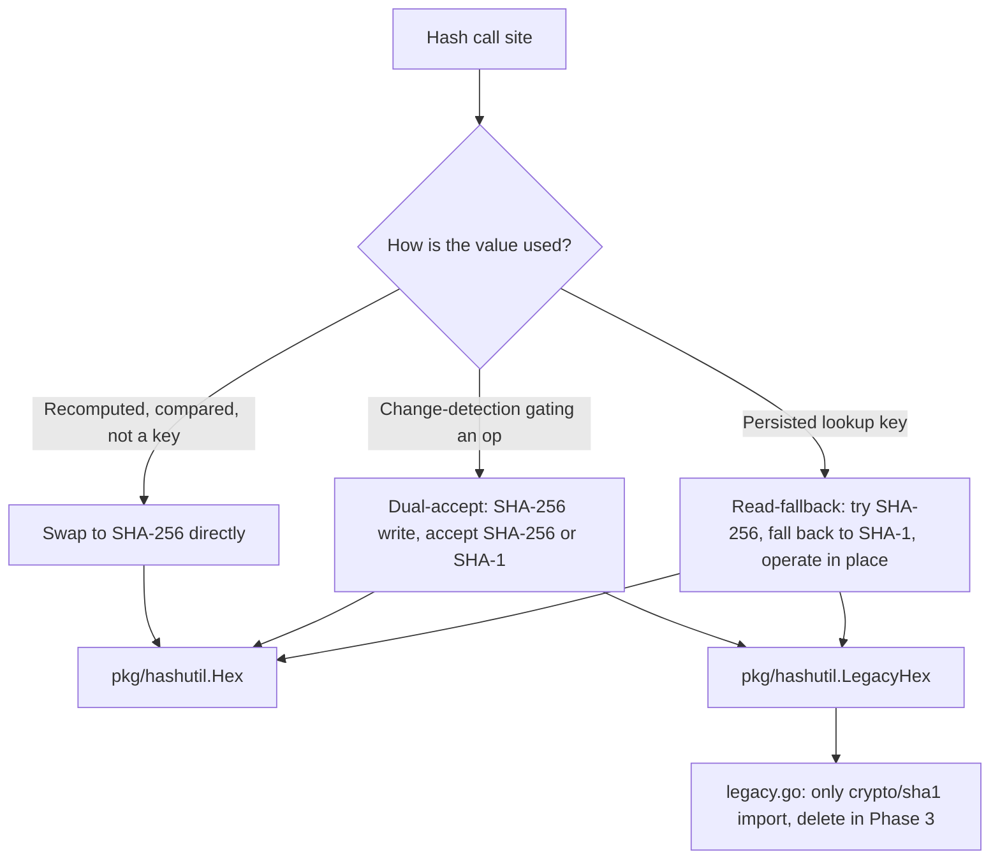

# SHA-1 to SHA-256 Internal Hashing Migration

- **Author**: GitHub Copilot (assisted), on behalf of the Radius maintainers

## Overview

Radius uses hashing in several places to generate deterministic, unique values: resource identifiers (Kubernetes object names, tracked-resource names), Terraform recipe state-secret suffixes, ETags, and change-detection tokens for the Kubernetes controllers. Historically these used **SHA-1**. SHA-1 is cryptographically broken and is flagged by CodeQL (`go/weak-cryptographic-algorithm`), even though Radius only uses it for **non-cryptographic** uniqueness and change detection - never for security (see the [UCP threat model](./2024-11-ucp-component-threat-model.md#use-of-cryptography)).

This document describes the staged migration from SHA-1 to **SHA-256**. The guiding constraint is that the migration must be **non-breaking and transparent to existing installations**: an upgrade must not lose data, must not trigger workload redeployment or pod restarts, and must require no customer action. The migration is delivered in three phases. Phases 1 and 2 (the backward-compatible compatibility layer) are complete; Phase 3 (removing SHA-1 entirely) is intentionally deferred to a future release after the compatibility layer has been broadly adopted.

## Terms and definitions

| Term                 | Definition                                                                                                                                                               |
|----------------------|--------------------------------------------------------------------------------------------------------------------------------------------------------------------------|
| Current hash         | SHA-256, used for all newly written values.                                                                                                                              |
| Legacy hash          | SHA-1, retained only to read values written by older versions of Radius.                                                                                                 |
| Dual-accept          | A compare path that treats a stored value as matching if it equals **either** the current (SHA-256) or legacy (SHA-1) hash. Used for change-detection hashes.            |
| Read-fallback        | A lookup path that tries the current (SHA-256) key, then falls back to the legacy (SHA-1) key. Used for persisted identifiers.                                           |
| Operate-in-place     | When an existing record is found under its legacy key, it is updated or deleted under that same legacy key rather than being re-keyed. New records use the current key.  |
| Persisted identifier | A hash used as a stable storage key (datastore object name, Terraform state-secret suffix, tracked-resource name). Changing it without a fallback orphans existing data. |

## Objectives

> **Issue Reference:** [radius-project/radius#8084](https://github.com/radius-project/radius/issues/8084); CodeQL code-scanning alerts 827 and 928-935.

### Goals

- Replace SHA-1 with SHA-256 for all non-cryptographic hashing in the control plane.
- Guarantee a **non-breaking, transparent upgrade**: no data loss, no redeployment or restart of workloads, no Terraform state recreation, no customer action.
- Isolate the remaining SHA-1 usage into a single, clearly documented location so the final removal is a one-file change and the CodeQL surface is minimal.
- Provide a clear path to **zero SHA-1** (Phase 3) and the prerequisites for it.

### Non goals

- Changing any public REST API, CLI command, or Bicep/Helm surface. The hashes involved are internal and opaque to users.
- Migrating SHA-1 usages that are **rendered into externally observable output** in this pass - specifically the Kubernetes secret-hash pod annotation and the ACI gateway DNS prefix. These require either a one-time workload rollout / endpoint change or deeper apply-layer work and are tracked as open decisions for Phase 3.
- Re-keying already-stored data to SHA-256 in Phases 1 and 2. Existing records are maintained in place under their legacy keys; bulk re-keying (if pursued) is Phase 3 work.

## Design

### High Level Design

A single foundation package, `pkg/hashutil`, centralizes hashing. `Hex(data) string` returns SHA-256 hex and is used for **all new values**. `LegacyHex(data) string` returns SHA-1 hex and lives in `pkg/hashutil/legacy.go`, which is the **only** file in the codebase that imports `crypto/sha1`. Deleting that file completes the migration (Phase 3).

Each SHA-1 call site is migrated using one of three patterns, chosen by how the hash is used:

- **Transient / recomputed hashes** swap directly to SHA-256. This is safe because the value is recomputed and compared, never persisted as a lookup key.
- **Change-detection hashes that gate an operation** use **dual-accept**: write SHA-256, but on compare accept SHA-256 **or** legacy SHA-1. This ensures an upgraded control plane recognizes existing state as up-to-date and does **not** trigger an operation.
- **Persisted identifiers** use **read-fallback with operate-in-place**: write and look up under SHA-256, fall back to the SHA-1 key on a miss, and keep existing records under their legacy key until they are deleted.

### Detailed Design

Migration status by site. All completed sites are validated by unit tests; the datastore and tracked resources are additionally validated by envtest and integration tests.

| Site                                                                                | Pattern                                                         | Status         |
|-------------------------------------------------------------------------------------|-----------------------------------------------------------------|----------------|
| `pkg/ucp/util/etag/etag.go` (ETags)                                                 | Direct swap (opaque token)                                      | Done           |
| `pkg/controller/reconciler/annotations.go` (config hash)                            | Dual-accept                                                     | Done           |
| `pkg/controller/reconciler/deploymenttemplate_reconciler.go` (spec hash)            | Dual-accept                                                     | Done           |
| `pkg/ucp/trackedresource/{name,update}.go` + `proxy.go` (tracking names)            | Read-fallback (`ResolveTrackingEntry`)                          | Done (e2e)     |
| `pkg/recipes/terraform/config/backends/kubernetes.go` (state-secret suffix)         | Read-fallback (`resolveSecretSuffix`)                           | Done           |
| `pkg/components/database/apiserverstore/apiserverclient.go` (datastore object name) | Read-fallback (`getResourceWithFallback`, `getResourceForSave`) | Done (envtest) |
| `pkg/kubernetes/secrets.go` (`HashSecretData` to pod annotation)                    | Deferred, still SHA-1                                           | Open decision  |
| `pkg/corerp/renderers/aci/gateway/render.go` (DNS prefix)                           | Deferred, still SHA-1                                           | Open decision  |

Notes on the two deferred sites:

- **`HashSecretData`** feeds the `radapp.io/secret-hash` annotation on the **pod template** via a stateless renderer ([`pkg/corerp/renderers/container/render.go`](../../../pkg/corerp/renderers/container/render.go)). Any algorithm change rewrites the annotation for otherwise-unchanged secrets, which forces a one-time rolling restart of every affected workload on upgrade. A no-rollout migration requires preserving the existing annotation when the secret is unchanged, which the stateless renderer cannot do without reading live cluster state. It is intentionally left on SHA-1 with an explanatory `NOTE` in `secrets.go`.
- **ACI gateway DNS prefix** becomes part of a public IP DNS label; changing it changes the endpoint. ACI support is experimental.

### Advantages

- **Non-breaking**: existing data is read via fallback, and no operations are triggered on upgrade.
- **Minimal SHA-1 surface**: a single `legacy.go` file, so the final removal is a one-file change.
- **Simple and reviewable**: operate-in-place avoids dual-write and cross-object optimistic-concurrency complexity.

### Disadvantages

- Existing records are **not** re-keyed automatically; they remain under SHA-1 keys until deleted. Reaching "zero SHA-1" therefore requires either accepting an isolated legacy read-path (and dismissing one CodeQL alert) or a dedicated bulk re-keying migration (Phase 3).
- The fallback is one-directional: during a rolling upgrade window, data newly written by a new pod in the SHA-256 format is briefly invisible to a still-running old pod that lacks the fallback.

### Proposed Option

Ship the compatibility layer (Phases 1 and 2) now; defer SHA-1 removal (Phase 3) to a later release. This maximizes safety and transparency for current installations while establishing the foundation and the data path needed to finish the migration.

## Phased rollout

### Phase 1: Foundation and safe swaps (DONE)

- Introduce `pkg/hashutil` (`Hex` plus isolated `LegacyHex`).
- Migrate transient hashes (ETags) and convert the two controller change-detection hashes to dual-accept, so an upgrade triggers no container PUT, no DeploymentTemplate re-deployment, and no pod rollout.
- Keep `HashSecretData` on SHA-1 (documented) to avoid a workload rollout.

### Phase 2: Persisted-identifier read-fallback (DONE)

- Tracked resources, the Terraform state-secret suffix, and the datastore object name each migrated to SHA-256 with a SHA-1 read-fallback and operate-in-place semantics.
- Validated with unit tests, the UCP `radius` integration tests, and the apiserverstore envtest suite, including a dedicated test that pre-creates a legacy-named object and confirms it is found, updated **in place** without duplication, and deleted via the fallback.

### Phase 3: Remove SHA-1 (FUTURE, after several releases)

Phase 3 is **not** done now and should land only after the Phase 1 and 2 compatibility layer has shipped and been adopted across several releases, so that SHA-256-aware code is broadly deployed in the field. There are two acceptable end-states.

Prerequisites (both paths):

1. Phases 1 and 2 released and adopted (allow a deprecation window of several minor releases).
1. Resolve the two deferred sites (`HashSecretData`, ACI DNS) by either accepting a one-time workload rollout / endpoint change, or implementing apply-time annotation preservation.

**Path 3a: Isolate and dismiss (lowest effort).**

- Keep `pkg/hashutil/legacy.go` as the single, documented, read-only SHA-1 path.
- Dismiss the corresponding CodeQL alert with the justification "non-cryptographic, backward compatibility for stored identifiers."
- No data migration and no customer action, ever. SHA-1 remains in the binary but is contained and audited.

**Path 3b: Bulk re-key, then delete `legacy.go` (true zero SHA-1).**

- Ship an **automatic, idempotent, resumable** data migration that re-keys stored data to SHA-256:
  - **Datastore** (`apiserverstore`): enumerate every `Resource` object, re-save each entry under its SHA-256 object name, and delete the legacy-named object. Idempotent (safe to re-run) and resumable (process in batches; a record already under the SHA-256 name is skipped).
  - **Terraform state**: copy or rename each `tfstate-default-<sha1>` secret to `tfstate-default-<sha256>`, or allow state to migrate naturally as recipes are re-executed, since `resolveSecretSuffix` writes new state under SHA-256 once the legacy secret is gone.
  - **Tracked resources**: re-key entries to SHA-256 names, or allow them to age out as resources are deleted and re-tracked.
- Run the migration as a pre-upgrade job or a one-shot controller reconcile, gated so the cluster is not serving mixed-version traffic during the re-key.
- After the migration has completed in a release, a **subsequent** release deletes `legacy.go` and all `LegacyHex` and fallback code paths.
- Customer guidance: upgrade **sequentially** through the migration release (do not skip it).

> Recommendation: start with **3a** unless a strict "zero SHA-1 in the binary" mandate exists, in which case schedule **3b**. The choice can be made independently of Phases 1 and 2.

## API design

N/A. No public REST API, CLI, or Bicep/Helm changes. All affected hashes are internal and opaque.

## CLI Design

N/A.

## Implementation Details

### UCP

- `pkg/ucp/util/etag/etag.go`: `New` uses `hashutil.Hex` (SHA-256). ETags are computed at save time, stored, and compared as opaque strings, so existing ETags remain valid until a record is rewritten.
- `pkg/ucp/trackedresource`: `NameFor` uses SHA-256 (truncated to 40 hex to preserve the 63-character ARM/UCP name budget); `LegacyNameFor` and `LegacyIDFor` are added; `ResolveTrackingEntry` performs the current-then-legacy lookup and is used by both `Updater.run` and the proxy enqueue path.
- `pkg/components/database/apiserverstore/apiserverclient.go`: `resourceName` uses SHA-256 truncated to 40 hex (to stay within the 253-character Kubernetes object-name limit); `legacyResourceName` is added; `getResourceWithFallback` (Get/Delete) and `getResourceForSave` (Save, operate-in-place) are added.

### Portable Resources / Recipes RP

- `pkg/recipes/terraform/config/backends/kubernetes.go`: `generateSecretSuffix` uses SHA-256, `generateLegacySecretSuffix` (SHA-1) is added, and `BuildBackend` resolves the suffix current-then-legacy via the existing `ValidateBackendExists` check (guarded for the nil-client tooling path). The resolved suffix flows through `generateConfig` to both `ValidateBackendExists` and the state-secret `Delete`, keeping apply and destroy consistent.

### Core RP / Controller

- `pkg/controller/reconciler/{annotations,deploymenttemplate_reconciler}.go`: `computeHash` uses `hashutil.Hex`; `IsUpToDate` and `isUpToDate` accept SHA-256 **or** legacy SHA-1.
- `pkg/kubernetes/secrets.go` (`HashSecretData`) and `pkg/corerp/renderers/aci/gateway/render.go` are intentionally unchanged (still SHA-1); see the open decisions above.

### Error Handling

Read-fallback helpers return a not-found error only when neither the current nor the legacy key exists, preserving the existing `ErrNotFound` and `ErrConcurrency` semantics of each store. A non not-found error from either lookup is propagated unchanged.

## Test plan

- **Unit tests**: `pkg/hashutil` (NIST SHA-256 and SHA-1 vectors); updated expected values in the reconciler, tracked-resource, Terraform-backend, and datastore name tests; new legacy-value tests for each `Legacy*` helper.
- **Behavioral tests**: dual-accept (a stored legacy hash is treated as up-to-date) and read-fallback (a pre-created legacy-keyed record is found, updated in place without duplication, and deleted).
- **Integration / envtest**: the UCP `radius` integration suite (PUT, track, list, delete) and the `apiserverstore` envtest suite both pass with the migration in place.
- **Phase 3 (future)**: the bulk re-key migration (path 3b) must add idempotency and resumable-migration tests, plus a mixed-data test (some records under SHA-1, some under SHA-256).

## Security

SHA-1 in Radius is used only for non-cryptographic uniqueness and change detection (per the [UCP threat model](./2024-11-ucp-component-threat-model.md#use-of-cryptography)). Moving to SHA-256 removes the weak-algorithm finding from the affected sites and concentrates the remaining SHA-1 usage in a single audited file (`pkg/hashutil/legacy.go`) pending Phase 3. No secrets, credentials, or authentication paths are affected.

## Compatibility

The upgrade is backward compatible and transparent: existing data is read via the SHA-1 fallback, no workloads are redeployed or restarted, and no Terraform state is recreated.

One nuance applies during the rolling-upgrade window. The fallback is one-directional (new code reads old data, but old code cannot read new-format data). All Radius control-plane components run `replicas: 1`, so this window is limited to the brief pod-replacement transition rather than a sustained mixed-version cluster, and Radius's operation retries cover transient overlaps. Operators who want zero risk can let in-flight deployments and recipe operations drain before upgrading.

## Monitoring and Logging

No new metrics are required for Phases 1 and 2. For Phase 3 path 3b, the bulk re-key migration should log progress (records scanned, re-keyed, skipped) and expose a completion signal so operators can confirm the migration finished before the subsequent SHA-1-removal release.
