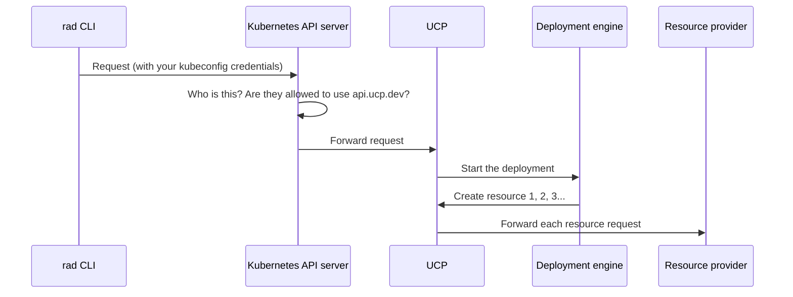
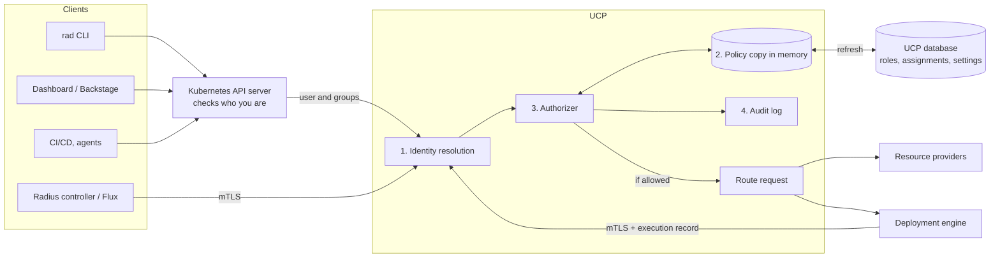

# Built-in Radius Role-Based Access Control

- **Author**: Shruthi Kumar (@sk593)

## Overview

**Role-based access control (RBAC)** is a way to decide who can do what. Instead of giving each person a custom list of allowed actions, you group actions into **roles** (for example "Reader" or "Application Developer") and give people roles. RBAC answers three questions for every request:

1. **Who** is making the request?
2. **What** are they trying to do?
3. **Where** are they trying to do it?

Radius has no RBAC of its own today. If you can reach the Radius API through Kubernetes, you can do everything: create or delete any environment, change any Recipe Pack, register cloud credentials, or deploy anywhere. That is fine for one developer on a laptop. It is not fine for a company where many teams share one Radius installation. A platform team wants to say things like:

- "Team A can manage its own applications and deploy them to the staging environment, but not to production."
- "The platform group can manage Recipe Packs but cannot touch cloud credentials."
- "Auditors can see who has access to what, but cannot change anything."

This document is the technical design for adding RBAC to Radius. The product requirements come from the [built-in RBAC feature specification](./2026-09-built-in-rbac-feature-spec.md). This design explains how to build it: how Radius identifies callers, how roles are stored, where checks happen, how deployments are checked, and how existing installations turn RBAC on safely.

This design has a companion: the [internal component authorization design](https://github.com/radius-project/radius/pull/13086), which we call the **internal design** in this document. The two designs split the work like this:

| This design (user-facing RBAC)                                                         | Internal design                                                                                                           |
|----------------------------------------------------------------------------------------|---------------------------------------------------------------------------------------------------------------------------|
| Decides whether a **user** may do something.                                           | Makes sure Radius's **own services** cannot skip or go beyond that decision.                                              |
| Roles, role assignments, `rad auth` commands, and the checks UCP runs on each request. | Service identities (mTLS), the execution record that carries an approval through a deployment, and the credential broker. |

A simple way to remember it: this design is the front door lock, and the internal design makes sure there is no back door.

The model is borrowed from Azure Resource Manager (ARM) RBAC. Radius's resource IDs and API already look like ARM's, so ARM's approach fits naturally and many users will already know it.

## How to read this document

If you are new to Radius or to RBAC, read these sections first:

1. [Key terms](#key-terms) for the vocabulary.
2. [How Radius handles a request today](#how-radius-handles-a-request-today) for the starting point.
3. [The big idea](#the-big-idea) and [A worked example](#a-worked-example) for the overall shape.

The [Detailed Design](#detailed-design) then covers each part one at a time. Each part starts with a short "In short" summary so you can skim.

## Key terms

| Term                   | Plain-language meaning                                                                                                                                                | Example                                                                                                  |
|------------------------|-----------------------------------------------------------------------------------------------------------------------------------------------------------------------|----------------------------------------------------------------------------------------------------------|
| Principal              | The "who". A user, a group of users, or a piece of automation (a "workload") that can be given access.                                                                | The user `alice@contoso.com`, the group `team-a-devs`, or the GitHub Actions workflow's service account. |
| Issuer                 | The system that vouches for a principal's identity. Two issuers can have different people with the same name, so we always store the issuer too.                      | The Kubernetes cluster that hosts Radius.                                                                |
| Subject                | The principal's ID as the issuer knows it.                                                                                                                            | `alice@contoso.com` or `system:serviceaccount:ci:deployer`.                                              |
| Permission             | The "what". One action on one kind of resource, written as a string.                                                                                                  | `Radius.Core/environments/write` means "create or update environments".                                  |
| Role (role definition) | A named list of permissions.                                                                                                                                          | "Environment Deployer" = read environments + deploy to environments.                                     |
| Built-in role          | A role that ships with Radius. You cannot change it.                                                                                                                  | `reader`, `application-developer`.                                                                       |
| Custom role            | A role an administrator creates.                                                                                                                                      | `application-operator` with exactly the permissions a team needs.                                        |
| Scope                  | The "where". The part of Radius a permission applies to.                                                                                                              | The whole installation, one resource group, or one environment.                                          |
| Role assignment        | Gives one role to one principal at one scope. This is how access is actually granted.                                                                                 | "Give `team-a-devs` the `application-developer` role on resource group `team-a`."                        |
| Inheritance            | An assignment at a scope also applies to everything inside that scope.                                                                                                | Access to resource group `team-a` includes every application in it.                                      |
| Implicit deny          | If no assignment allows something, it is denied. There is no "deny" rule to write.                                                                                    | A new user with no assignments can do nothing.                                                           |
| UCP                    | Universal Control Plane. The Radius service that receives every API request and routes it to the right place. This design makes it the place where access is checked. |                                                                                                          |
| Resource provider (RP) | A Radius service that actually creates and manages a kind of resource, such as Applications RP or Dynamic RP.                                                         |                                                                                                          |
| Deployment engine      | The Radius service that runs Bicep templates by creating each resource in order.                                                                                      | Runs `rad deploy app.bicep`.                                                                             |
| Execution record       | From the internal design. UCP's saved record of "this deployment was approved to do these things". Radius services check it later while the deployment runs.          |                                                                                                          |
| mTLS                   | Mutual TLS. An encrypted connection where **both** sides prove who they are with certificates. The internal design uses it between Radius services.                   |                                                                                                          |
| Enforcement mode       | A setting that controls whether RBAC is off, only logging what it would block (`Audit`), or actually blocking (`Enforce`).                                            |                                                                                                          |

## How Radius handles a request today

When you run `rad deploy`, this happens:



Things to notice:

- **Kubernetes checks who you are.** It uses your kubeconfig. Then it checks Kubernetes RBAC: are you allowed to use the `api.ucp.dev` API group at all? That is an all-or-nothing check.
- **Kubernetes tells UCP who you are, but UCP throws it away.** Kubernetes forwards your user name and groups in HTTP headers (`X-Remote-User`, `X-Remote-Group`). Today UCP deletes those headers (`pkg/ucp/proxy/kubernetes.go`) because it has no way to confirm they really came from Kubernetes and not from some other program pretending.
- **After that, everything is trusted.** UCP, the deployment engine, and resource providers all trust each other completely.

So today, Radius cannot tell Alice from Bob, and cannot limit what either of them does.

## Objectives

> **Issue Reference:** [radius-project/radius#13030](https://github.com/radius-project/radius/issues/13030), [radius-project/roadmap#27](https://github.com/radius-project/roadmap/issues/27)

The personas and user scenarios are in the [feature specification](./2026-09-built-in-rbac-feature-spec.md#key-scenarios). This table shows where each part of the specification is handled in this design.

| Feature specification investment                            | Where it is designed                                                                                                 |
|-------------------------------------------------------------|----------------------------------------------------------------------------------------------------------------------|
| Feature 1: Permission and scope model                       | [Scopes](#part-2-where-access-applies-scopes), [Permissions](#part-3-what-you-can-do-permissions)                    |
| Feature 2: Built-in and custom roles                        | [Roles](#part-4-roles)                                                                                               |
| Feature 3: Role assignments and effective-access inspection | [Role assignments](#part-5-role-assignments), [Checking access](#part-13-checking-your-access)                       |
| Feature 4: Cross-scope and transitive-use authorization     | [Checking a request](#part-7-how-ucp-checks-a-request), [Checking a deployment](#part-8-how-ucp-checks-a-deployment) |
| Feature 5: Consistent enforcement and client behavior       | [Identity](#part-1-who-is-calling-identity), [Clients](#part-12-clients-cli-dashboard-automation)                    |
| Feature 6: Auditability and safe administration             | [Safety rules](#part-9-safety-rules), [Monitoring and Logging](#monitoring-and-logging)                              |
| Feature 7: Migration and compatibility                      | [Turning RBAC on](#part-10-turning-rbac-on), [Compatibility](#compatibility-optional)                                |

### Goals

- **One place decides.** UCP checks every Radius API request, no matter which client sent it (CLI, dashboard, CI/CD, GitOps).
- **Roles are normal Radius resources.** You can manage them with the API, with `rad auth` commands, with Bicep and `rad deploy`, or with GitOps.
- **New resource types are safe by default.** When a new resource type is added, nobody gets access to it by accident.
- **Deployments are checked before they start.** If a deployment would be blocked partway through, it is blocked before it changes anything.
- **Safe to turn on.** Existing installations can preview what RBAC would block, and nobody can lock everyone out.

### Non goals

Everything in the feature specification's [non-goals](./2026-09-built-in-rbac-feature-spec.md#non-goals-out-of-scope) applies. This design also does **not**:

- Design how Radius services authenticate to each other, the execution record format, or the credential broker. Those are in the internal design.
- Add a way to sign in other than through Kubernetes. The design stores the issuer on every assignment so other sign-in systems can be added later.
- Provide an API to search audit history. The first release writes audit events to logs that you send to your own log system.
- Support wildcards (like `Radius.Core/*`) or "deny" rules in custom roles.

## User Experience (if applicable)

The full CLI, Bicep, and GitOps experiences are in the feature specification ([CLI](./2026-09-built-in-rbac-feature-spec.md#proposed-cli-experience), [Bicep](./2026-09-built-in-rbac-feature-spec.md#proposed-bicep-experience), [GitOps](./2026-09-built-in-rbac-feature-spec.md#proposed-gitops-experience)). This design keeps them and fills in the exact names. The commands are listed in [CLI Design](#cli-design-if-applicable).

**Sample Input:** A platform admin lets `team-a-devs` manage apps in their resource group and deploy to staging. A developer then tries to deploy to production.

```console
rad auth assignment create \
  --role application-developer \
  --principal group:team-a-devs \
  --scope /planes/radius/local/resourceGroups/team-a

rad auth assignment create \
  --role environment-deployer \
  --principal group:team-a-devs \
  --scope /planes/radius/local/resourceGroups/platform/providers/Radius.Core/environments/staging

rad deploy app.bicep --group team-a --environment /planes/radius/local/resourceGroups/platform/providers/Radius.Core/environments/production
```

**Sample Output:** The deployment is blocked before anything is created, and the error says exactly what is missing.

```console
Error: Authorization failed before the deployment started.

  Identity:  user alice@contoso.com (issuer: kubernetes)
  Action:    Radius.Core/environments/use/action
  Target:    /planes/radius/local/resourceGroups/platform/providers/Radius.Core/environments/production
  Denied by: Radius RBAC

No Radius resources were changed. Run 'rad auth access explain --action Radius.Core/environments/use/action --scope <target>' for details, or ask a Radius access administrator for the Environment Deployer role on this environment.
```

## Design

### The big idea

UCP already sees every request, so UCP becomes the place that checks access. We add four pieces to UCP:

1. **Identity resolution.** Figure out who is calling, using the user and group names Kubernetes forwards. We only trust them after confirming they really came from Kubernetes.
2. **Policy store.** Save roles, role assignments, and the enforcement setting in UCP's existing database. Keep a copy in memory on each UCP instance so checks are fast.
3. **Authorizer.** For each request, work out which permissions are needed on which resources, look them up, and allow or deny.
4. **Audit log.** Write a record of every decision and every change to roles or assignments.

Resource providers do **not** check roles. They trust that UCP already did. The internal design makes that trust safe: providers only accept requests that come from UCP over mTLS and that match an approved execution record.



### A worked example

Let's follow Alice, a member of `team-a-devs`, as she runs `rad deploy app.bicep` to the staging environment. Her template creates one application and one container.

1. **Kubernetes identifies Alice.** It reads her kubeconfig and forwards `X-Remote-User: alice@contoso.com` and `X-Remote-Group: team-a-devs` to UCP.
2. **UCP trusts those headers** because it verified the connection came from the Kubernetes API server (this check comes from the internal design).
3. **UCP checks the deployment request.** Starting a deployment needs `Microsoft.Resources/deployments/write` on resource group `team-a`. Alice's group has `application-developer` there, which includes it. Allowed.
4. **The deployment engine reads the template** and lists what it will create: an application and a container in `team-a`, both pointing at the staging environment.
5. **Preflight: UCP checks everything at once.** For each resource, UCP asks:
   - Can Alice write this kind of resource in `team-a`? Yes, through `application-developer`.
   - Can Alice deploy to the staging environment it points at? Yes, through `environment-deployer` on staging.
6. **All checks pass**, so UCP writes an execution record listing exactly what was approved.
7. **The deployment runs.** Each time the engine creates a resource, UCP confirms it is on the approved list, then forwards it to the resource provider.

If Alice had pointed at production instead, step 5 would fail and nothing would be created. That is the sample output above.

### Detailed Design

#### Part 1: Who is calling (identity)

> **In short:** Kubernetes already knows who you are. UCP will start trusting the user and group names Kubernetes sends, but only after checking the connection really came from Kubernetes.

**Using the names Kubernetes sends.** When Kubernetes forwards a request to UCP, it adds the caller's user name and groups as headers. This is a standard Kubernetes feature called the [authenticating proxy](https://kubernetes.io/docs/reference/access-authn-authz/authentication/#authenticating-proxy). The danger is that any program that can reach UCP could add those same headers and pretend to be someone else. That is why UCP deletes them today.

The internal design fixes this. Kubernetes presents a client certificate when it connects to UCP. UCP checks that certificate against the certificate authority and names listed in the cluster's `extension-apiserver-authentication` ConfigMap. Only if that check passes does UCP read the headers. On any other connection, identity headers are rejected.

UCP turns the headers into principals:

| Header value                                       | Principal                                                                                       |
|----------------------------------------------------|-------------------------------------------------------------------------------------------------|
| `X-Remote-User: system:serviceaccount:<ns>:<name>` | A workload: `{type: workload, issuer: <k8sIssuer>, subject: system:serviceaccount:<ns>:<name>}` |
| Any other `X-Remote-User` value                    | A user: `{type: user, issuer: <k8sIssuer>, subject: <value>}`                                   |
| Each `X-Remote-Group` value                        | A group: `{type: group, issuer: <k8sIssuer>, subject: <value>}`                                 |

UCP then checks the request against assignments for the user **and** every group they belong to. So if Alice has no assignment herself but `team-a-devs` does, she gets the group's access.

Two special groups are worth knowing:

- `system:authenticated` includes everyone who signed in. An admin can give this group `reader` to let everyone look but not touch.
- `system:unauthenticated` is never accepted. Anonymous requests get `InvalidAuthenticationInfo`.

**Why the issuer includes a cluster ID.** Two different clusters can both have a user named `alice` or a service account named `default/ci`. If we stored the issuer as just `kubernetes`, then copying Radius's policy to another cluster could give access to the wrong person. So the issuer is `kubernetes:<trust-domain>`:

- By default, `rad install` uses the ID (UID) of the cluster's `kube-system` namespace, which never changes for a cluster's lifetime.
- Installations whose control plane gets recreated, such as Repo Radius, set a fixed value with the Helm value `rbac.kubernetesIssuer`, for example `kubernetes:repo-radius/<owner>/<repo>`.
- The CLI fills in the issuer for you, so examples in this document just write `kubernetes`.

Storing the issuer on every assignment also means later releases can add other sign-in systems (for example, an OIDC provider for the dashboard) without changing existing data.

**Stable names matter.** For clusters that sign users in with OIDC, the Kubernetes user name comes from a claim in the token. If that claim is something that can change, like an email address, an assignment could stop matching. `rad auth whoami` shows exactly what Radius sees, and the docs recommend a stable claim such as `sub`.

**Display names** are just labels. UCP saves the user name as a display name. Kubernetes does not provide group display names, so admins can set `principal.displayName` on an assignment if they want one.

**Group changes.** Kubernetes looks up groups on every request, so Radius always sees current membership. If someone is removed from a group in the identity provider, the change takes effect once their Kubernetes login refreshes.

**Kubernetes RBAC becomes a simple "can you reach Radius" gate.** Kubernetes still checks whether you may use the `api.ucp.dev` API group before forwarding. The Helm chart adds a ClusterRole called `radius-api-user` that allows it. When Radius RBAC is on, admins bind this ClusterRole broadly (for example to `system:authenticated`) and let Radius make the real decision. When Radius RBAC is off, Kubernetes RBAC stays the only check, exactly as today.

**Radius's own services.** The internal design identifies Radius services with mTLS. Only two of them matter here:

- The **deployment engine** is never a principal. Its requests are checked as the user who started the deployment.
- The **Radius controller** acts for a Kubernetes namespace. See [Part 11](#part-11-controllers-and-gitops).

#### Part 2: Where access applies (scopes)

> **In short:** A scope is a Radius resource ID. Access given at a scope also applies to everything inside it, but never to anything beside it.

Radius resources are organized like folders:

```text
/                                              installation (everything)
└── /planes/radius/local                       a plane
    ├── resourceGroups/platform                a resource group
    │   ├── .../environments/staging           a resource
    │   ├── .../environments/production
    │   └── .../recipePacks/default
    └── resourceGroups/team-a
        └── .../applications/shop
```

| Scope level    | Resource ID                                                          | What is inside it                                                                             |
|----------------|----------------------------------------------------------------------|-----------------------------------------------------------------------------------------------|
| Installation   | `/`                                                                  | Everything. Used only for admin-type roles, `reader`, `auditor`, and the enforcement setting. |
| Plane          | `/planes/radius/local`, `/planes/azure/<name>`, `/planes/aws/<name>` | Its resource groups, resource type registrations, and cloud credentials.                      |
| Resource group | `/planes/radius/local/resourceGroups/<rg>`                           | All resources in the group.                                                                   |
| Resource       | A resource ID, such as an environment                                | The resource and any child resources.                                                         |

**Inheritance goes down, never sideways.** Like folder permissions:

- Access on `resourceGroups/team-a` covers every application in `team-a`.
- Access on `/planes/azure/prod` does **not** cover `/planes/azure/dev`.
- Access on an environment does **not** cover the Recipe Packs that environment uses. Pointing to something never gives you access to it.

**Which resources can be scopes in the first release?** Any resource group or plane, plus these individual resource types: `Radius.Core/environments`, `Radius.Core/recipePacks`, `Radius.Core/applications`, `Applications.Core/environments`, and `Applications.Core/applications`. These are the ones the specification's scenarios need. The checking code works for any resource ID, so more types can be added later without changing how data is stored.

#### Part 3: What you can do (permissions)

> **In short:** A permission is a string like `Radius.Core/environments/write`. Radius builds the full list of permissions automatically from its API definitions, so it never gets out of date.

**Permission format.** `<Namespace>/<type>/<operation>`. The operation is `read`, `write`, `delete`, or `<actionName>/action`.

UCP turns each HTTP request into a permission:

| Request                          | Permission needed            |
|----------------------------------|------------------------------|
| `GET` a resource or list         | `<type>/read`                |
| `PUT` or `PATCH`                 | `<type>/write`               |
| `DELETE`                         | `<type>/delete`              |
| `POST <resourceId>/<actionName>` | `<type>/<actionName>/action` |

For example, `POST .../applications/shop/getGraph` needs `Radius.Core/applications/getGraph/action`.

**Where the permission list comes from.** The full list is called the **permission catalog**. It is built from three sources so nobody has to maintain it by hand:

| Source                                  | Which types                                                                                     | How                                                                                                                                                  |
|-----------------------------------------|-------------------------------------------------------------------------------------------------|------------------------------------------------------------------------------------------------------------------------------------------------------|
| API definitions (at build time)         | `Radius.Core/*`, `Applications.*/*`, `Microsoft.Resources/deployments`                          | A generator reads the Swagger files in `swagger/` and creates read, write, delete, and every action (like `getGraph`, `listSecrets`, `getMetadata`). |
| UCP's own types (fixed list)            | Resource groups, planes, resource type registrations, cloud credentials, and the new RBAC types | Listed in code next to UCP's routes.                                                                                                                 |
| Registered resource types (at run time) | User-defined types such as `Radius.Data/mySqlDatabases`                                         | Created when the type is registered: read, write, and delete.                                                                                        |

`rad auth permission list` shows the catalog.

**"Use" permissions.** Some permissions are not about changing a resource but about **pointing to** it from another resource. For example, putting `environment: staging` in your container means "deploy into staging". That needs permission even though you are not changing staging itself.

| Use permission                                                              | Needed when                                                                                                                                                                                   |
|-----------------------------------------------------------------------------|-----------------------------------------------------------------------------------------------------------------------------------------------------------------------------------------------|
| `Radius.Core/environments/use/action` (and the `Applications.Core` version) | A resource's `environment` property points at the environment. In practice, this is "deploy to this environment".                                                                             |
| `Radius.Core/recipePacks/use/action`                                        | An environment's `recipePacks` list includes the Recipe Pack.                                                                                                                                 |
| `System.Azure/credentials/use/action`, `System.AWS/credentials/use/action`  | An environment's Azure or AWS provider settings are set or changed. Deployments to that environment will use the plane's cloud credential, so whoever sets this up must be allowed to use it. |
| `<type>/connect/action`                                                     | A resource adds a connection to a resource of that type.                                                                                                                                      |

**Why there is no `applications/deploy/action`.** The specification's example uses one, but deploying is not a separate API call in Radius. A deployment is just creating or updating the application's resources. So "deploy my app to staging" is two permissions: `applications/write` (manage the app) and `environments/use/action` on staging (deploy into it).

**New things never sneak into existing roles.** When Radius adds a new action or someone registers a new resource type, the new permission is added to the catalog but **not** to any existing custom role. Custom roles cannot use wildcards, so this is guaranteed. Built-in roles follow the rules in [Part 4](#part-4-roles).

#### Part 4: Roles

> **In short:** A role is a named list of permissions. Radius ships nine built-in roles that cannot be changed. Admins can create custom roles.

##### Role definitions

Roles are stored as `Radius.Core/roleDefinitions` resources. They use the `Radius.Core` name so Bicep looks like the specification. UCP stores and serves them directly (instead of passing them to a resource provider) because UCP owns all access data.

```json
{
  "id": "/planes/radius/local/resourceGroups/platform/providers/Radius.Core/roleDefinitions/application-operator",
  "type": "Radius.Core/roleDefinitions",
  "properties": {
    "displayName": "Application Operator",
    "description": "Operate applications without changing platform configuration.",
    "roleType": "Custom",
    "permissions": [
      "Radius.Core/applications/read",
      "Radius.Core/applications/write",
      "Radius.Core/environments/use/action"
    ],
    "assignableScopes": [
      "/planes/radius/local/resourceGroups/platform",
      "/planes/radius/local/resourceGroups/team-a"
    ]
  }
}
```

| Property           | Rules                                                                                                                                   |
|--------------------|-----------------------------------------------------------------------------------------------------------------------------------------|
| `permissions`      | Required. Every entry must be in the catalog, or the write fails with `UnknownPermission`. No wildcards.                                |
| `roleType`         | Set by Radius: `BuiltIn` or `Custom`.                                                                                                   |
| `assignableScopes` | Where this role can be assigned. Defaults to where the role is defined. You can only list scopes where you are allowed to create roles. |

Other rules:

- A custom role can be created at the installation, a plane, or a resource group. A custom role at `/` can be used anywhere.
- Built-in roles live at `/providers/Radius.Core/roleDefinitions/<name>`. UCP creates them at startup. Changing or deleting one fails with `BuiltInRoleImmutable`. Bicep files refer to them with the `existing` keyword.
- You cannot delete a custom role that is still assigned to someone (`RoleDefinitionInUse`). Remove the assignments first.
- Changing a custom role changes access for everyone who has it, within the [propagation time](#part-6-where-access-data-lives-and-how-fast-changes-apply). `rad auth role update` tells you how many assignments are affected before you confirm.

##### Built-in roles

These match the [specification's built-in roles](./2026-09-built-in-rbac-feature-spec.md#feature-2-built-in-and-custom-roles).

| Role                          | What it is for                    | Permissions (summary)                                                                                                                                                                                                             |
|-------------------------------|-----------------------------------|-----------------------------------------------------------------------------------------------------------------------------------------------------------------------------------------------------------------------------------|
| `radius-administrator`        | Full control.                     | Every permission in the catalog, including managing roles and the enforcement setting.                                                                                                                                            |
| `access-administrator`        | Manages who has access.           | Create, change, and delete roles and role assignments; read the permission catalog; check others' access; read resource groups (to pick scopes). Cannot change other resources directly.                                          |
| `platform-administrator`      | Runs the platform.                | Manage resource groups and environments (including deploying to them); read and use Recipe Packs; use cloud credentials in the planes where assigned. Cannot register or delete credentials or manage roles.                      |
| `application-developer`       | Builds apps.                      | Manage applications and application resources (see [the application resource set](#the-application-resource-set)); connect resources; run deployments. Does **not** include deploying to environments, which is a separate grant. |
| `environment-deployer`        | Deploys to specific environments. | Read environments and deploy to them. Assign it on one environment or on a resource group of environments.                                                                                                                        |
| `recipe-pack-administrator`   | Owns Recipe Packs.                | Manage and use Recipe Packs.                                                                                                                                                                                                      |
| `resource-type-administrator` | Owns resource type registrations. | Manage resource type registrations, including adding types to the application resource set. Only assignable at plane or installation, because registrations live at the plane.                                                    |
| `reader`                      | Looks but does not touch.         | Every `read` permission, plus `getGraph` and `getMetadata`. Excludes `listSecrets`, cloud credentials, and role data.                                                                                                             |
| `auditor`                     | Reviews access.                   | Read roles, role assignments, the enforcement setting, and the permission catalog; check and explain anyone's access. No access to resource contents.                                                                             |

Some notes:

- **Cloud credentials** (register, remove, read) are only in `radius-administrator`. To let someone else manage credentials, an admin creates a custom role and assigns it on the Azure or AWS plane.
- **Built-in roles are fixed per release.** Each one is an explicit list generated at build time and published in the release notes. A new Radius feature only gets added to a built-in role through a reviewed change in a Radius release, never automatically at run time. The one intentional exception is `radius-administrator`, which is the "superuser" and always has everything.
- `rad` uses the lowercase-with-dashes names shown above.

##### The application resource set

`application-developer` and `reader` need to cover user-defined resource types (for example a platform team's `Radius.Data/mySqlDatabases`). But the specification says adding a new type must not quietly give existing users access to it. Here is how both work together:

- A resource type registration gets an optional `permissionSets` list.
- A type is part of the built-in **application resource set** only if its registration lists `applicationResources`.
- Joining the set grants only `read`, `write`, `delete`, and `connect` on that type, never actions. So if the type later adds an action, existing assignments do not grow.
- Setting or changing `permissionSets` needs the permission `System.Resources/resourceProviders/resourceTypes/joinPermissionSet/action`, which only `resource-type-administrator` (and `radius-administrator`) has. So joining is a deliberate, logged decision.
- Types that ship with Radius (`Applications.*`, `Radius.Compute`, `Radius.Data`, `Radius.Security`) are in the set by default.

```yaml
namespace: Radius.Data
types:
  mySqlDatabases:
    permissionSets:
      - applicationResources
    apiVersions:
      "2025-08-01-preview":
        schema: { ... }
```

#### Part 5: Role assignments

> **In short:** A role assignment says "this principal has this role at this scope". It lives under the scope it applies to. Once created, its who, what, and where cannot change.

Role assignments are `Radius.Core/roleAssignments` resources. Each one is stored **under** the scope it applies to, which makes the scope easy to see from the ID:

```text
/providers/Radius.Core/roleAssignments/<name>                                     installation
/planes/radius/local/providers/Radius.Core/roleAssignments/<name>                 plane
/planes/radius/local/resourceGroups/team-a/providers/Radius.Core/roleAssignments/<name>   resource group
/planes/radius/local/resourceGroups/platform/providers/Radius.Core/environments/staging/providers/Radius.Core/roleAssignments/<name>   one environment
```

A resource stored under another resource like this is called an **extension resource**. UCP's resource ID parser already supports them: the scope is the ID with the last `providers/Radius.Core/roleAssignments/<name>` part removed.

```json
{
  "id": "/planes/radius/local/resourceGroups/team-a/providers/Radius.Core/roleAssignments/3f1c...",
  "type": "Radius.Core/roleAssignments",
  "properties": {
    "roleDefinitionId": "/providers/Radius.Core/roleDefinitions/application-developer",
    "principal": {
      "type": "group",
      "issuer": "kubernetes:6c1e9a8e-...",
      "subject": "team-a-devs",
      "displayName": "Team A developers"
    },
    "description": "Team A owns this resource group.",
    "scope": "/planes/radius/local/resourceGroups/team-a",
    "managedBy": {
      "kind": "GitOps",
      "source": "https://github.com/contoso/platform-config",
      "revision": "8d2f1e0",
      "path": "access/team-a.bicep",
      "principal": "workload:kubernetes:radius-controller/namespace:platform-config"
    },
    "createdBy": "user:kubernetes:alice@contoso.com"
  }
}
```

| Property                              | Rules                                                                                                                                                                                               |
|---------------------------------------|-----------------------------------------------------------------------------------------------------------------------------------------------------------------------------------------------------|
| `roleDefinitionId`                    | Required. Cannot change. The scope must be one of the role's `assignableScopes`.                                                                                                                    |
| `principal.type`, `issuer`, `subject` | Required. Cannot change. `type` is `user`, `group`, or `workload`.                                                                                                                                  |
| `principal.displayName`               | Optional label. Can change.                                                                                                                                                                         |
| `scope`                               | Set by Radius from the ID.                                                                                                                                                                          |
| `managedBy`                           | Set by Radius. Records how the assignment was created: `Imperative` (API or `rad auth`), `Deployment` (`rad deploy`), `GitOps` (with the Git source), or `Bootstrap` (created during installation). |
| `createdBy`                           | Set by Radius.                                                                                                                                                                                      |

**Why assignments cannot be edited.** If you could change the principal of an existing assignment, the audit log would show "assignment 3f1c changed" and you would have to dig to see that access moved from one person to another. Instead, you delete the old one and create a new one, so the history is obvious. A `PUT` that tries to change the role, principal, or scope fails with `RoleAssignmentImmutable`. A `PUT` with the same values does nothing, which is what makes running `rad deploy` or GitOps repeatedly safe.

**Assignment names.** `rad auth assignment create` makes the name with the same algorithm as Bicep's `guid()` function over `(scope, roleDefinitionId, type, issuer, subject)`. If templates use `guid(resourceGroup().id, role.id, 'group', issuer, subject)` with the same inputs in the same order, the CLI and Bicep produce the same name and do not create duplicates. Including `type` keeps a user and a group with the same name from colliding. The feature specification's Bicep example leaves out scope and type and should be updated to match.

**Who owns an assignment.** The specification asks teams to choose whether GitOps or manual commands manage each assignment, so two tools do not fight. Radius enforces this:

- If an assignment was created by GitOps, only that same GitOps source can change or delete it. Anyone else gets `ManagedByConflict`.
- An admin can override with `rad auth assignment delete --take-ownership` (API: `?takeOwnership=true`). This is logged.
- `Bootstrap` assignments can only be changed through [installation settings](#part-10-turning-rbac-on).

#### Part 6: Where access data lives and how fast changes apply

> **In short:** Roles and assignments are saved in UCP's existing database. Each UCP instance keeps a copy in memory and refreshes it every few seconds. Changes apply everywhere within 30 seconds.

**Storage.** Role definitions, role assignments, and the `authorizationSettings` resource are saved in UCP's existing database (`pkg/components/database`, which is either the Kubernetes API server or PostgreSQL), the same way UCP already saves resource groups. No new database is needed.

**In-memory copy.** Checking the database on every request would be slow, so each UCP instance keeps:

- Assignments looked up by `(scope, principal)`.
- Each role's permissions, already expanded into a set.
- A **generation number**, which goes up by one on every access change.

Every 5 seconds, and right after any access change it handles itself, a UCP instance compares its generation number with the database. If it is behind, it reloads.

**How fast changes apply.** A role or assignment change reaches every UCP instance within **30 seconds** (this includes retries if the database is briefly unavailable). If an instance cannot refresh within 30 seconds, it marks itself not ready and refuses requests with `AuthorizationUnavailable`. It never makes decisions using old data.

**Limits.** The first release supports up to 10,000 assignments and 1,000 custom roles per installation. These are enforced and can be raised after load testing.

#### Part 7: How UCP checks a request

> **In short:** For each request, UCP lists every permission it needs, checks each one, and allows the request only if all pass. If a request points to another resource (like an environment), that counts as a permission it needs too.

The check runs as a middleware in UCP's request pipeline (`pkg/ucp/frontend/api/server.go`). A middleware is code that runs on every request before it reaches its handler. It runs after UCP parses the request and before routing.

Here is the logic in pseudocode:

```text
requiredChecks(request):
  checks = [ (permissionFor(request), request.resourceID) ]
  if request is a PUT or PATCH:
    for each reference in the request body:
      checks += (reference.permission, reference.targetID)
  return checks

allowed(principals, permission, target):
  # Walk up from the target to "/", e.g. resource -> resource group -> plane -> "/"
  for scope in target and each of its parents:
    for assignment at scope for any of the caller's principals:
      if permission is in the assignment's role:
        return Allow
  return Deny
```

**References: checking what a request points to.** This is how Radius handles the specification's "cross-scope" rules. When you create or update a resource, UCP looks for properties that point to other resources and checks those too:

| Property in the request                                                                   | Extra check on the resource it points to                                                   |
|-------------------------------------------------------------------------------------------|--------------------------------------------------------------------------------------------|
| `properties.environment`                                                                  | `<envType>/use/action` (can you deploy here?)                                              |
| `properties.application`                                                                  | `<appType>/write`, so you cannot attach resources to another team's application            |
| `properties.recipePacks[]` on an environment                                              | `Radius.Core/recipePacks/use/action`                                                       |
| `properties.providers.azure` or `.aws` on an environment                                  | `System.Azure/credentials/use/action` or `System.AWS/credentials/use/action` on that plane |
| `properties.connections.*.source`                                                         | `<sourceType>/connect/action`                                                              |
| A property in a user-defined type marked with a new `x-radius-reference` schema extension | `<referencedType>/read`                                                                    |

These checks run on **every** reference in the request body, not just new ones. Comparing against what is currently saved would mean reading, then checking, then writing, and another request could change things in between. The side effect: if you lose permission to deploy to an environment, you also cannot update resources already in it. That matches the intent: deploying to an environment is a permission you need right now, not one you had once. Reads and deletes do not check references.

**Using an environment does not mean seeing what is inside it.** If you can deploy to staging, Radius will use staging's Recipe Packs, settings, and cloud credentials **for you** when it creates resources. You do not get permission to read or change those things yourself. The internal design makes sure Radius only uses them for the specific recipe and scope that was approved. Sensitive recipe outputs are hidden by existing [sensitive-field redaction](./2026-07-sensitive-fields-in-app-graph.md).

**Do not reveal what exists.** UCP checks access **before** looking up the resource. So if you do not have access, you get `403 AuthorizationFailed` whether the resource exists or not. Otherwise, someone could probe for resource names by watching for `404` vs `403`. If you do have read access, you get the normal `404` for missing resources.

**Lists.** To list resources (for example `GET .../applications`):

- If you have `read` on the parent scope, you get the full list.
- Otherwise, UCP removes items you cannot read and does not say how many it removed.
- Because filtering happens after the resource provider responds, a page may come back with fewer items than requested. Paging still works.

The resource group list and the "all resources in a group" list are filtered the same way.

**Application graphs.** `getGraph` needs `Radius.Core/applications/getGraph/action`. If your app connects to something you cannot read (say, a shared database in another team's group), that node shows up with no ID, name, or properties and is marked `hidden: true`. Its connections stay, so the graph's shape is still correct. The response sets `incomplete: true` so you know something is hidden.

**Operation status.** Long-running operations have status URLs (`operationStatuses`, `operationResults`). To read one, you need `read` on the resource the operation is for. The person who started the operation can always read its status.

#### Part 8: How UCP checks a deployment

> **In short:** Before a deployment changes anything, UCP checks every resource in it. If any check fails, nothing is created. After that, the deployment can only do what was approved.

**Why deployments need special handling.** `rad deploy` creates a deployment, and then the deployment engine creates each resource one by one. If UCP only checked each resource as it was created, a deployment could create four resources and then fail on the fifth. The specification says that must not happen when the problem could be found ahead of time.

**Steps:**

1. **Submit.** UCP checks `Microsoft.Resources/deployments/write` on the resource group.
2. **Expand.** The deployment engine works through the template's parameters, conditions, and loops and produces the list of resources it will create, with IDs and contents.
   - Some resources have names or references that depend on another resource's output, which is only known while the deployment runs. These are called **deferred** resources. For these, the engine sends what it does know: the resource type, the scope (almost always a fixed resource group), and any known references.
3. **Preflight.** The engine sends the list to a new internal UCP endpoint, `POST /internal/authorization/preflight`, over mTLS. UCP checks every resource as if it were its own request, for the user who started the deployment.
   - For a deferred resource, UCP checks the permission at the known scope. Thanks to inheritance, that covers any name inside it. UCP saves that scope as a **bound** (a limit).
   - If even the scope or an important reference is unknown, preflight fails with `AuthorizationIndeterminate` in `Enforce` mode (it only logs in `Audit` mode). Radius would rather refuse than approve something it cannot check.
4. **Decide.** If any check fails, UCP returns all failures at once. The engine fails the deployment before creating anything, and the CLI shows every missing permission. If all pass, UCP writes the execution record listing what was approved and returns its ID.
5. **Run.** Each resource request includes the record ID. UCP checks that the resource is on the approved list, or for a deferred resource, inside its bound. Anything else is rejected with `GrantScopeExceeded`, even if the user has since gained access. An accepted deployment can never grow.

**What if someone's access changes mid-deployment?** The specification says an accepted deployment keeps the decision it got at the start: it is not stopped when roles change, and it cannot gain anything new. So:

- Requests on the approved list keep working even if the user loses access during the deployment.
- To stop a deployment right away, an admin cancels it: `rad deployment cancel <name>`. This needs `Microsoft.Resources/deployments/cancel/action` (in `radius-administrator` and `application-developer`), and UCP closes the execution record.
- A retry or a new `rad deploy` is a new deployment and is checked against current access.
- The internal design's execution record has a hard expiry, so no deployment can run forever on old approval.

This requires a change to the internal design. Today it says UCP closes execution records when a user loses access. With this design, downstream checks look at the execution record's approved list, status, cancellation, and expiry, but not at the user's current roles. UCP closes records only on cancellation, expiry, or a security incident.

**Nested deployments** (Bicep modules) are expanded as part of the parent, so their resources are checked in the same preflight.

**Templates that contain roles or assignments** go through the same preflight. The [safety rules](#part-9-safety-rules) also run during preflight, so a template that would remove the last admin fails before anything changes.

#### Part 9: Safety rules

> **In short:** Radius stops you from locking everyone out, stops most users from giving themselves more access, and has an emergency recovery path for when things go wrong.

These rules run in UCP on every change to a role or assignment, from any client (CLI, API, Bicep, GitOps). They are in addition to the normal permission check.

| Rule                                    | What it does                                                                                                                                                                                                            |
|-----------------------------------------|-------------------------------------------------------------------------------------------------------------------------------------------------------------------------------------------------------------------------|
| Keep at least one admin                 | There must always be at least one `radius-administrator` assignment at `/` to a user or group (not counting temporary bootstrap ones). A change that would remove the last one fails with `LastAdministratorProtected`. |
| No giving out what you do not have      | To assign role R at scope S, you must already have every permission in R at S, **or** be an `access-administrator` or `radius-administrator` there. Otherwise: `PrivilegeEscalationDenied`.                             |
| No growing a role you do not fully have | Unless you are an Access or Radius Administrator, you can only add a permission to a custom role if you already have that permission everywhere the role can be assigned.                                               |
| Assign only where allowed               | An assignment's scope must be in the role's `assignableScopes`.                                                                                                                                                         |
| Respect ownership                       | See [who owns an assignment](#part-5-role-assignments).                                                                                                                                                                 |

**A note on Access Administrator.** An Access Administrator can give any role, including `radius-administrator`, to anyone. That means they could give it to a friend, to a service account they control, or to a group they later join. This is unavoidable: the whole job of the role is to hand out access. Azure's User Access Administrator works the same way. Instead of pretending to prevent it, Radius makes it visible:

- Giving out `radius-administrator` or `access-administrator`, or creating an assignment that includes yourself, asks for confirmation in the CLI.
- These are marked `highImpact: true` in the audit log and counted in a metric you can alert on.
- Treat `access-administrator` with the same care as `radius-administrator`.

The specification says Access Administrator does not "automatically" get app access. That is true: it gets nothing until its holder deliberately creates an assignment, and that is logged.

**Emergency recovery ("break-glass").** Suppose the admin group is accidentally deleted from the identity provider and nobody can sign in as an admin. A Kubernetes cluster administrator, who can already change Radius itself, creates this Secret:

```yaml
apiVersion: v1
kind: Secret
metadata:
  name: radius-rbac-recovery
  namespace: radius-system
stringData:
  principal: user:kubernetes:oncall@contoso.com
  expiresAt: "2026-10-02T18:00:00Z"
  reason: "INC-4211 admin group deleted"
```

How it works:

- UCP checks for this one Secret by name every 10 seconds using `GET`. Its Kubernetes permissions allow `get` on only this Secret name (`resourceNames: [radius-rbac-recovery]`), so it cannot read any other Secret.
- While the Secret exists and is valid, the named person has `radius-administrator` at `/`, until `expiresAt` or 4 hours after UCP first saw it, whichever is sooner.
- This access is held in memory only and never saved to the database. Delete the Secret and it is gone.
- Every request made with it is logged with `recovery: true`, and UCP raises a warning and a metric the whole time it is active.
- Only Kubernetes cluster admins can create the Secret, which keeps recovery separate from normal access, as the specification asks.

#### Part 10: Turning RBAC on

> **In short:** RBAC has three modes: `Disabled`, `Audit` (log what would be blocked), and `Enforce` (block). New installations start in `Enforce` with the installer as admin. Upgraded installations stay `Disabled` until an admin turns RBAC on.

##### Modes

The mode is stored in `authorizationSettings` at `/providers/Radius.Core/authorizationSettings/default`.

| Mode       | Checks run? | Blocks requests?          | When to use it                                                    |
|------------|-------------|---------------------------|-------------------------------------------------------------------|
| `Disabled` | No          | No                        | Today's behavior. Upgraded installations start here.              |
| `Audit`    | Yes         | No, everything is allowed | Trying RBAC out. Anything that would have been blocked is logged. |
| `Enforce`  | Yes         | Yes                       | Normal use.                                                       |

**How this relates to the internal design.** The internal design has its own on/off stages for service-to-service security (`Off`, dry run, `Enforce`). Those are installation settings applied through Helm, because they change listeners, certificates, and admission policies and need pods to restart. The user RBAC mode in this design is different: it is changed at run time through the API.

They are linked by one rule: **user RBAC can only be `Enforce` if service-to-service security is also `Enforce`.** Otherwise, someone could skip UCP's checks by calling a resource provider directly. UCP rejects the change with `ComponentProtocolNotEnforced` until every Radius service reports it is enforcing the internal protocol.

| User RBAC mode | Allowed service-to-service stages |
|----------------|-----------------------------------|
| `Disabled`     | Any                               |
| `Audit`        | Any                               |
| `Enforce`      | `Enforce` only                    |

Turning user RBAC from `Enforce` back to `Audit` does not change service-to-service security.

##### New installations

1. `rad install kubernetes` asks Kubernetes who is running the install (using the `SelfSubjectReview` API) and saves that identity in the Helm value `rbac.bootstrapAdministrators`.
2. Before UCP starts accepting requests, it creates a `radius-administrator` assignment at `/` for each listed identity, marked as `Bootstrap`, and sets the mode from `rbac.mode` (default `Enforce`).
3. UCP does not accept requests until both are done, so there is never a moment where RBAC is on but nobody is admin, or where RBAC is off when it should be on.

For a single developer, nothing changes: they installed Radius, so they are the admin. `rad install kubernetes --skip-rbac` (from the internal design) sets the mode to `Disabled`.

Helm only sets the mode on the first install. After that, `authorizationSettings` is the source of truth and `helm upgrade` does not overwrite it. If the Helm value disagrees with the saved mode, the pre-upgrade check fails and tells you to use `rad auth enforcement` instead.

##### Existing installations

Upgrading keeps the mode `Disabled` and creates no assignments. Nothing changes until an admin opts in:

1. **Preview.** `rad auth enforcement preview` switches to `Audit` and makes the person running it a bootstrap admin (there are no assignments yet, so someone has to be first). While the mode is `Disabled`, only people that Kubernetes RBAC allows to update `authorizationsettings` in `api.ucp.dev` can run this. Helm gives that only to cluster admins.
2. **Observe.** In `Audit`, UCP records who is using Radius and what they are doing.
3. **Review.** `rad auth enforcement report` lists who used Radius, what would have been blocked, and suggested assignments using the smallest built-in role at the resource-group level. These are suggestions only; the admin reviews and applies them with `rad auth assignment create` or a Bicep file.
4. **Enable.** `rad auth enforcement enable` switches to `Enforce`. It first checks that nothing would have been blocked in the last 24 hours, or asks you to accept the listed blocks with `--accept-denials`. It also refuses if there would be no admin.
5. **Roll back if needed.** For a period defined in each release's notes, a Radius Administrator can go back to `Audit` with `rad auth enforcement disable`. This is logged and raises an alert. Going all the way back to `Disabled` after `Enforce` requires the [recovery procedure](#part-9-safety-rules).

##### Repo Radius and short-lived installations

The workflow's identity becomes the bootstrap admin. When Repo Radius restores saved state into a new control plane, restored assignments are loaded, but `Bootstrap` assignments always come from the current installation's settings. Restored data cannot remove or replace them and cannot change the mode. This meets the specification's requirement that restored data cannot take over trusted bootstrap access.

#### Part 11: Controllers and GitOps

> **In short:** When the Radius controller deploys something from a Kubernetes namespace, it acts as that namespace. Admins give namespaces access with normal role assignments.

**Background.** The Radius controller watches `DeploymentTemplate` objects in Kubernetes, including ones Flux creates from a Git repository, and deploys them. There is no user request behind these deployments: the object is just there in a namespace. The internal design says the controller acts **for the namespace** the object is in, and an admin decides which resource groups and environments each namespace may target.

**This design: namespaces are principals.** For controller requests, UCP uses a principal called the **namespace principal**: `{type: workload, issuer: radius-controller, subject: <namespace>}`. UCP only accepts this principal when the request really comes from the controller (verified with mTLS). Admins give it roles like anyone else:

```console
rad auth assignment create --role application-developer \
  --principal workload:team-a --issuer radius-controller \
  --scope /planes/radius/local/resourceGroups/team-a
rad auth assignment create --role environment-deployer \
  --principal workload:team-a --issuer radius-controller \
  --scope /planes/radius/local/resourceGroups/platform/providers/Radius.Core/environments/staging
```

Why do it this way instead of a separate namespace mapping?

- A namespace with no assignments can do nothing, which is safe by default.
- The same tools work for GitOps as for people: `rad auth access list`, `explain`, and the audit log.
- There is only one kind of access data to manage.

Kubernetes RBAC still controls who can create `DeploymentTemplate` objects in each namespace.

**Managing roles through GitOps.** To let a Git repository manage role assignments, give its namespace principal `access-administrator` (or a custom role with `roleAssignments/write`) at the scopes the repository manages. The [safety rules](#part-9-safety-rules) still apply. For example, if Flux removes an assignment from Git and that would remove the last admin, reconciliation fails with that error instead of applying the change.

**Where a change came from.** The controller sends the Git repository URL, commit, and file path to UCP in request headers. UCP accepts those headers only from the controller's verified identity and saves them in `managedBy` on any assignment it creates.

#### Part 12: Clients (CLI, dashboard, automation)

> **In short:** Every client is checked by UCP the same way. The only tricky one is the dashboard, which today uses a single shared account.

| Client                          | Who Radius thinks is calling                                                               | Notes                                                                                                   |
|---------------------------------|--------------------------------------------------------------------------------------------|---------------------------------------------------------------------------------------------------------|
| `rad` CLI                       | Whoever is in your kubeconfig.                                                             | Sign-in is unchanged.                                                                                   |
| CI/CD, GitHub Actions           | The workflow's Kubernetes identity (a service account or federated identity).              | Give each pipeline its own identity.                                                                    |
| Agents and Copilot integrations | The identity in the kubeconfig the agent uses.                                             | Use a dedicated identity per agent. CLI errors make "access denied" clearly different from "try again". |
| Dashboard and Backstage plugin  | Without identity forwarding: the dashboard's service account. With it: the signed-in user. | See below.                                                                                              |
| Radius controller               | The namespace principal.                                                                   | See [Part 11](#part-11-controllers-and-gitops).                                                         |
| Deployment engine               | The user who started the deployment.                                                       | Never acts as itself.                                                                                   |

**The dashboard.** Today the dashboard uses one service account that can do everything on `api.ucp.dev`. Every dashboard user effectively shares it. Under RBAC, that service account is a normal principal **with no access by default**. If we gave it access, every dashboard user would see whatever it can see, and the audit log would show the service account instead of the real user. Both break the specification.

To show each user their own access, the dashboard can forward the signed-in user's identity using **Kubernetes impersonation**. The dashboard tells Kubernetes "act as Alice" (`Impersonate-User` and `Impersonate-Group` headers). Kubernetes checks the dashboard is allowed to do that, then forwards Alice's identity to UCP the normal way. This needs:

- The dashboard's sign-in to use the same identity provider as the cluster.
- The Kubernetes `impersonate` permission for the dashboard's service account, which is powerful.

It is turned on with the Helm value `dashboard.forwardUserIdentity`, and the docs explain the trade-off.

In `Enforce` mode without forwarding, the dashboard shows a message saying identity forwarding is required, instead of data. An admin who is fine with shared access can explicitly give the dashboard's service account a role (for example `reader` on a resource group). `rad auth assignment create` warns that every dashboard user will share that access and that the audit log will show the service account.

Managing roles in the dashboard stays out of scope, as the specification says.

**Things Radius RBAC does not cover.** `rad run` log streaming and port forwarding talk to pods directly through Kubernetes, not through the Radius API. Kubernetes RBAC controls those. The CLI says so in `rad run` help and when Kubernetes denies log access.

#### Part 13: Checking your access

> **In short:** You can ask Radius who it thinks you are, whether you can do something, and why. Admins can see everyone's access; regular users only see their own.

All of these are served by UCP and checked like any other request.

| Operation                                                                     | Who can call it                                                                       | What it returns                                                                                                                                                                                     |
|-------------------------------------------------------------------------------|---------------------------------------------------------------------------------------|-----------------------------------------------------------------------------------------------------------------------------------------------------------------------------------------------------|
| `GET /providers/Radius.Core/whoAmI`                                           | Anyone signed in                                                                      | Your principal, groups, issuer, the enforcement mode, and whether you are a Radius Administrator.                                                                                                   |
| `POST {scope}/providers/Radius.Core/checkAccess`                              | Anyone, for themselves. Checking someone else needs `Radius.Core/checkAccess/action`. | For each permission and target you ask about: allowed or denied.                                                                                                                                    |
| `POST {scope}/providers/Radius.Core/explainAccess`                            | Same as `checkAccess`                                                                 | Same, plus **why**: which assignment and role allowed it, or which roles would allow it if denied. Assignment details are only shown if you can read role assignments at that scope.                |
| `GET {scope}/providers/Radius.Core/effectiveAccess?principal=...`             | Needs `roleAssignments/read`                                                          | Every assignment (direct and inherited) for that principal and its groups, and the combined permissions. For a group, this shows the group's own assignments; Radius cannot list who is in a group. |
| `GET {scope}/providers/Radius.Core/roleAssignments?$filter=atScopeAndBelow()` | Needs `roleAssignments/read`                                                          | Assignments at and below the scope. `rad auth assignment list --include-inherited` also checks each parent scope.                                                                                   |

If you check your own access but cannot read role assignments, you get allowed or denied plus the names of built-in roles that would grant it, and nothing about other people. That is enough to know what to ask for, without seeing who else has access.

### API design (if applicable)

New resource types, defined in TypeSpec under `typespec/Radius.Core/` and generated like other `Radius.Core` types so the Bicep extension picks them up automatically. They use API version `2025-08-01-preview` to match `Radius.Core`.

| Resource type                       | Where it can live                               | Operations             | Served by |
|-------------------------------------|-------------------------------------------------|------------------------|-----------|
| `Radius.Core/roleDefinitions`       | `/`, plane, resource group                      | GET, LIST, PUT, DELETE | UCP       |
| `Radius.Core/roleAssignments`       | `/`, plane, resource group, supported resources | GET, LIST, PUT, DELETE | UCP       |
| `Radius.Core/authorizationSettings` | `/` only, one instance named `default`          | GET, PUT               | UCP       |
| `Radius.Core/permissions`           | `/`                                             | LIST                   | UCP       |

Actions: `whoAmI`, `checkAccess`, `explainAccess`, and `effectiveAccess` (see [Part 13](#part-13-checking-your-access)).

**Routing.** Today, UCP sends most `Radius.Core` requests to Applications RP through a catch-all route. The new types must be handled by UCP instead, so a request can never reach a resource provider that does not run the safety rules. Changes:

- Add explicit routes for the new types in `pkg/ucp/frontend/radius/routes.go`, before the catch-all, plus routes at the root path and in the Azure and AWS plane routers.
- For assignments under a resource (like `.../environments/staging/providers/Radius.Core/roleAssignments/<name>`), the resource-group proxy handler checks the last type in the parsed ID and handles it in UCP instead of forwarding.
- Remove these types from Applications RP's generated routes.

Other API changes:

- Resource type registrations (`System.Resources/resourceProviders/resourceTypes`) get the optional `permissionSets` property.
- `Microsoft.Resources/deployments` gets a `cancel` action if the deployment engine does not already provide one.
- A new internal operation, `POST /internal/authorization/preflight`, is available only on the internal mTLS endpoint from the internal design.

**Error format.** Errors use the existing ARM error shape (`pkg/armrpc/api/v1/errorcodes.go`). Authorization errors add one `details` entry per failed check, with `additionalInfo` of type `RadiusAuthorization` containing `principal`, `permission`, `target`, and `source: "Radius"`. So a deployment that fails preflight reports all of its problems at once.

### CLI Design (if applicable)

A new `rad auth` command group in `pkg/cli/cmd/auth/`. All commands use the Radius API through the current workspace. None read the database or Kubernetes directly, except `rad install` for bootstrap.

| Command                                                         | What it does                                                                                                                                                                                                                                                                                                   |
|-----------------------------------------------------------------|----------------------------------------------------------------------------------------------------------------------------------------------------------------------------------------------------------------------------------------------------------------------------------------------------------------|
| `rad auth whoami`                                               | Shows who Radius thinks you are.                                                                                                                                                                                                                                                                               |
| `rad auth status`                                               | Shows the mode, whether you are an admin, whether a recovery grant is active, and warnings (for example, if the only admins are bootstrap ones).                                                                                                                                                               |
| `rad auth permission list [--type <type>]`                      | Lists all permissions.                                                                                                                                                                                                                                                                                         |
| `rad auth role list\|show\|create\|update\|delete`              | Manages roles. `create` and `update` take repeated `--permission` and `--assignable-scope` flags, or `--from-file role.json`.                                                                                                                                                                                  |
| `rad auth assignment list\|show\|create\|delete`                | Manages assignments. Flags: `--principal <type>:<subject>`, `--issuer` (defaults to this installation's Kubernetes issuer), `--role <name or ID>`, `--scope <ID>` (defaults to the workspace's resource group). `list` supports `--include-inherited` and `--principal`. `delete` supports `--take-ownership`. |
| `rad auth access check\|explain\|list`                          | Checks, explains, or lists access. `--principal` checks someone else.                                                                                                                                                                                                                                          |
| `rad auth enforcement status\|preview\|report\|enable\|disable` | Manages the mode (see [Part 10](#part-10-turning-rbac-on)).                                                                                                                                                                                                                                                    |
| `rad deployment cancel <name> [--group <rg>]`                   | Cancels a running deployment (see [Part 8](#part-8-how-ucp-checks-a-deployment)).                                                                                                                                                                                                                              |

Behavior shared by all commands:

- **Role names** are looked up at the given scope, then its parents, then built-in roles. If a name matches more than one role, the command fails and lists the IDs. It never guesses.
- **Every change** shows the resolved principal, role ID, and scope before applying.
- **Risky changes ask for confirmation:** assigning `radius-administrator` or `access-administrator`, assignments that include yourself, deletions, and mode changes. `--yes` skips the question but never skips the checks.
- **Output:** all read commands support `--output json` and `--output table`.

Changes to `rad deploy`:

- Before submitting, the CLI looks through the compiled template (including modules) for role definitions and role assignments. If there are any, it shows a summary (role, principal, scope) and asks to confirm, defaulting to No. Values computed at run time are shown as written. This summary is just a helpful preview; the real checks happen in UCP.
- A new `--yes` flag skips the question. Without a terminal and without `--yes`, a deployment that contains roles or assignments fails with instructions. Deployments without them work exactly as today.
- Access errors list every missing permission, not just the first.

**Which system said no?** Every command tells you which of these blocked you:

- **Kubernetes RBAC** (you cannot reach `api.ucp.dev` at all). Shown as a Kubernetes `Status` error.
- **Radius RBAC** (`AuthorizationFailed` with `source: Radius`).
- **A cloud provider or registry** (an error from a recipe).

### Implementation Details

#### UCP (if applicable)

| Where                                                                                    | Change                                                                                                                                                                                       |
|------------------------------------------------------------------------------------------|----------------------------------------------------------------------------------------------------------------------------------------------------------------------------------------------|
| `pkg/ucp/frontend/api/server.go`                                                         | Add identity resolution and the authorizer middleware. When the mode is `Disabled`, they only log identity.                                                                                  |
| `pkg/ucp/proxy/kubernetes.go`                                                            | Keep removing identity headers before forwarding to resource providers, but read them first on verified connections.                                                                         |
| New package `pkg/ucp/authorization`                                                      | Principals, permission mapping, reference checks, the evaluator, the in-memory policy copy, the audit log, and the safety rules. Plain Go with no network calls, so it is easy to unit test. |
| New package `pkg/ucp/frontend/controller/authorization`                                  | Handlers for roles, assignments, settings, the permission catalog, and access checks.                                                                                                        |
| `pkg/ucp/frontend/radius/routes.go`, `azure/routes.go`, `aws/routes.go`, `api/routes.go` | Register the new routes, including at the root.                                                                                                                                              |
| `pkg/ucp/frontend/controller/radius/proxy.go`                                            | Check execution records against the approved list from preflight; filter list responses.                                                                                                     |
| UCP initializer                                                                          | Create built-in roles and bootstrap assignments, set the starting mode, and do not report ready until done.                                                                                  |
| Catalog generator (under `hack/` or `bicep-tools/`)                                      | Generate the permission table from Swagger as part of `make generate`.                                                                                                                       |

#### Bicep (if applicable)

The new `Radius.Core` types are added to TypeSpec and appear in the Radius Bicep extension through the existing code generation.

- **Resource-group assignments** (the common case) need no Bicep changes.
- **Assignments on a single resource** need Bicep's `scope:` property to point at a Radius resource. The Radius Bicep extension and the deployment engine must support that; see [Open Questions](#open-questions).
- **Plane and installation assignments** cannot be deployed with `rad deploy` today, as the specification notes. Use `rad auth` or the API for those.

#### Deployment Engine (if applicable)

- Expand the template and call preflight before creating the first resource. This reuses the engine's existing what-if logic.
- Send the execution record ID with each request (internal design).
- Report every failed check.
- Support cancellation, which closes the execution record.

#### Core RP (if applicable)

No access checks are added here. Applications RP stops serving the new `Radius.Core` RBAC types. The internal design makes sure it only accepts requests from UCP. `getGraph` returns resource IDs as it does today; UCP hides nodes the caller cannot see.

#### Portable Resources / Recipes RP (if applicable)

No changes beyond the internal design. Recipes run using the environment's settings under the execution record, as described in [Part 7](#part-7-how-ucp-checks-a-request).

#### Controller

- Send the namespace principal and Git source details on every request to UCP.
- Show `AuthorizationFailed`, `LastAdministratorProtected`, and `ManagedByConflict` as a failed `Ready` condition and a Kubernetes event on the `DeploymentTemplate`.
- Stop retrying on access errors that will not fix themselves, until the object or the access rules change.

#### Helm and installation

Add:

- Values: `rbac.mode`, `rbac.bootstrapAdministrators`, `rbac.kubernetesIssuer`, `dashboard.forwardUserIdentity`.
- The `radius-api-user` ClusterRole.
- Kubernetes RBAC so that, while the mode is `Disabled`, only cluster admins can update `authorizationsettings`.
- A Role that lets UCP `get` only the `radius-rbac-recovery` Secret (by `resourceNames`). A test confirms UCP cannot read any other Secret through it.

`rad install kubernetes` fills in the bootstrap admin using `SelfSubjectReview`.

### Error Handling

| Code                           | HTTP status | Meaning                                                                                                                           | What to do                                                          |
|--------------------------------|-------------|-----------------------------------------------------------------------------------------------------------------------------------|---------------------------------------------------------------------|
| `InvalidAuthenticationInfo`    | 401         | Radius could not confirm who you are. You are anonymous, or identity headers came from an unverified connection. (Existing code.) | Check your kubeconfig.                                              |
| `AuthorizationFailed`          | 403         | You are missing one or more permissions. `details` lists each one. (Existing code.)                                               | Run `rad auth access explain` and ask for the suggested role.       |
| `AuthorizationIndeterminate`   | 403         | Preflight could not tell where a deferred resource would go.                                                                      | Make the resource group or reference a fixed value in the template. |
| `GrantScopeExceeded`           | 403         | A deployment step tried to do something that was not approved. (From the internal design.)                                        | Rerun the deployment.                                               |
| `PrivilegeEscalationDenied`    | 403         | You tried to give out or add permissions you do not have.                                                                         | Ask an Access Administrator.                                        |
| `LastAdministratorProtected`   | 409         | The change would leave no admin.                                                                                                  | Add another admin first.                                            |
| `ManagedByConflict`            | 409         | The assignment is managed by GitOps or bootstrap.                                                                                 | Change it in Git, or use `--take-ownership`.                        |
| `RoleAssignmentImmutable`      | 409         | You tried to change an assignment's role, principal, or scope.                                                                    | Delete it and create a new one.                                     |
| `BuiltInRoleImmutable`         | 409         | You tried to change or delete a built-in role.                                                                                    | Create a custom role instead.                                       |
| `RoleDefinitionInUse`          | 409         | The custom role is still assigned.                                                                                                | Delete its assignments first.                                       |
| `ComponentProtocolNotEnforced` | 409         | You tried to enable `Enforce` before Radius services enforce the internal protocol.                                               | Finish the internal design's rollout first.                         |
| `UnknownPermission`            | 400         | A role lists a permission that does not exist.                                                                                    | Check `rad auth permission list`.                                   |
| `ScopeNotAssignable`           | 400         | The scope is not allowed for this role, or that resource type cannot be a scope.                                                  | Choose another scope.                                               |
| `AuthorizationUnavailable`     | 503         | UCP's copy of the access data is too old, or the database is down.                                                                | Retry later.                                                        |

**Fail closed.** In `Enforce` mode, if anything goes wrong while checking access, the request is denied with `AuthorizationUnavailable`. It is never allowed by mistake. In `Audit` mode, errors are logged and the request goes ahead, because `Audit` must not change behavior.

**Do not leak information.** Error messages show your own identity, the permission, and the target you asked for. They never show other people, assignments you cannot read, or whether a resource exists.

## Test plan

**Unit tests** in `pkg/ucp/authorization`, written as tables of cases:

- Inheritance at every level, and no inheritance between sibling planes or resource groups.
- Group-based access.
- `assignableScopes`.
- Reference checks for every built-in type and for `x-radius-reference`.
- Every safety rule.
- In-memory copy refresh and the "too old" case.
- Fuzz tests on the request-to-permission mapping with broken resource IDs, to make sure bad input is denied.

**Catalog tests:**

- CI fails if the generated permission table is out of date with the Swagger files.
- A test makes sure every UCP route maps to a permission, so a new route cannot ship unchecked.

**Functional tests** (`test/functional-portable`) on a cluster set up to verify Kubernetes's client certificate, with several test users and service accounts:

| Scenario                                                                 | Expected result                                                              |
|--------------------------------------------------------------------------|------------------------------------------------------------------------------|
| Developer deploys to an environment they can use                         | Succeeds.                                                                    |
| Same template points at a different environment                          | Fails in preflight with `AuthorizationFailed`; nothing is created.           |
| Template has some allowed and some denied resources                      | Fails in preflight listing every denied resource; nothing is created.        |
| Reader runs `getGraph` on an app connected to something in another group | That node is hidden, `incomplete: true`, no ID leaked.                       |
| User without access asks for an existing resource and a missing one      | Both get the same 403.                                                       |
| Non-admin tries to assign a role with permissions they lack              | `PrivilegeEscalationDenied`.                                                 |
| Access Administrator assigns `radius-administrator`                      | Succeeds, with confirmation and a `highImpact` audit event.                  |
| Remove the last admin using the CLI, Bicep, and Flux pruning             | `LastAdministratorProtected` in all three.                                   |
| A role is removed during a long deployment                               | Approved resources continue; `rad deployment cancel` stops it.               |
| A new resource type is registered                                        | No role gains access until `permissionSets` is set.                          |
| Upgrade an existing install, then preview, report, enable                | Nothing blocked before enable; report suggests assignments; enable succeeds. |
| Recovery Secret is created, then expires                                 | Admin access works only during that time, and is logged.                     |
| Dashboard without forwarding and without an assignment                   | Shows that identity forwarding is required; no data.                         |

**Performance tests:**

- Check time with 10,000 assignments.
- Deployment time with preflight for a 200-resource template, compared to `Disabled`.

## Security

| Threat                                                                 | How this design handles it                                                                                                               |
|------------------------------------------------------------------------|------------------------------------------------------------------------------------------------------------------------------------------|
| A pod that can reach UCP sends fake identity headers                   | Identity headers are only read on connections with Kubernetes's verified client certificate (internal design).                           |
| Someone skips UCP and calls a resource provider directly               | Internal design mTLS. `Enforce` cannot be turned on until every service enforces it.                                                     |
| A Radius service does more than the user's deployment was approved for | The execution record's approved list from preflight.                                                                                     |
| A user gives themselves more access                                    | The "no giving out what you do not have" rule, immutable assignments, and checks on every path including GitOps and Bicep.               |
| An Access Administrator grants admin to someone they control           | Expected for that role. Made visible with confirmation, `highImpact` audit events, and alerts.                                           |
| Everyone gets locked out                                               | "Keep at least one admin" rule, bootstrap admins, and the recovery Secret.                                                               |
| The recovery path is abused                                            | Needs Kubernetes cluster admin to create one named Secret; time-limited; memory only; logged with alerts.                                |
| Errors, lists, graphs, or access checks leak information               | Check before lookup, filter lists without counts, hide graph nodes, show policy details only to those who can read assignments.          |
| A removed user keeps access                                            | Changes apply within 30 seconds; an out-of-date UCP instance refuses requests.                                                           |
| A new type or action quietly grants access                             | No wildcards in custom roles; built-in roles change only in reviewed releases; types join the application set only by deliberate opt-in. |
| The dashboard's shared account leaks data                              | It has no access by default; per-user forwarding is the supported path.                                                                  |
| Assignments copied from another cluster match the wrong people         | The issuer includes a cluster-specific trust domain.                                                                                     |
| Restored data replaces bootstrap admins                                | Restored data cannot change `Bootstrap` assignments or the mode.                                                                         |

**What Radius must trust.** UCP, the Kubernetes API server, your identity provider, and your Kubernetes cluster admins. Anyone who can change Secrets, Deployments, or the database in the Radius namespace can get around Radius RBAC. Limit Kubernetes access to the Radius namespace and the database to the platform team. The docs will say this clearly.

## Compatibility (optional)

- **Upgrades do not change anything.** The mode stays `Disabled` until an admin turns RBAC on.
- **New installs are `Enforce` with the installer as admin.** One developer sees no difference. Scripts that use a different Kubernetes identity than the installer need to be given access. `--skip-rbac` keeps today's behavior.
- **Older `rad` CLIs** still work but show raw 403 errors without the helpful formatting.
- **The dashboard** shows no data in `Enforce` mode until identity forwarding is turned on or an admin gives its service account a role.
- **Templates** that attach resources to another team's application or connect to another team's resources need the matching `write` or `connect` permission.
- **`Enforce` needs the internal design's service-to-service security**, and therefore cert-manager, on the control-plane cluster.

## Monitoring and Logging

**Audit events.** UCP writes one event for every access decision (in `Audit` and `Enforce` modes) and one for every change to roles, assignments, or the mode. Events use a fixed JSON format on a dedicated `radius.audit` logger. They go to stdout by default and to an OpenTelemetry log exporter if one is configured, so you can send them to your own log system and keep them as long as you need.

| Field                                    | What it contains                                                                                  |
|------------------------------------------|---------------------------------------------------------------------------------------------------|
| `time`, `requestId`, `correlationId`     | When it happened, and IDs to match it with the internal design's logs.                            |
| `principal`, `groups`, `issuer`          | Who was checked. Group lists are cut off at 50 with a count.                                      |
| `viaComponent`, `executionRecordId`      | For requests the deployment engine or controller made for someone.                                |
| `permission`, `target`, `checks[]`       | Every check and its result.                                                                       |
| `result`, `mode`                         | `allow`, `deny`, or `wouldDeny` (in `Audit` mode).                                                |
| `grantingAssignment`, `roleDefinitionId` | Which assignment allowed it.                                                                      |
| `policyChange`                           | For changes to roles, assignments, or settings: before and after, and where the change came from. |
| `highImpact`                             | True for admin-level grants and self-assignments.                                                 |
| `recovery`                               | True for requests using the recovery Secret.                                                      |

Events never include request bodies, secrets, or credentials.

**Metrics:**

- `radius_authz_decisions_total{result,mode,permission_namespace}`: count of decisions.
- `radius_authz_evaluation_seconds`: how long checks take.
- `radius_authz_policy_generation_lag_seconds`: how far behind a UCP instance's copy is.
- `radius_authz_recovery_grant_active`: whether a recovery Secret is in use.
- `radius_authz_unavailable_total`: requests refused because access data was unavailable.
- `radius_authz_high_impact_changes_total`: admin-level grants.

**Recommended alerts:** any recovery grant, any high-impact change, `AuthorizationUnavailable` that keeps happening, and policy lag above 30 seconds.

## Development plan

The work is split into stages. Each stage ships with RBAC `Disabled` until stage 5, so nothing changes for users until the whole thing is ready.

| Stage                        | What gets built                                                                                                                                                    | Needs first                                                               |
|------------------------------|--------------------------------------------------------------------------------------------------------------------------------------------------------------------|---------------------------------------------------------------------------|
| 1. Model and catalog         | TypeSpec for the new types, the permission catalog generator, and the `pkg/ucp/authorization` checker with unit tests. No checks run yet.                          | Nothing                                                                   |
| 2. Identity and `Audit` mode | Verify Kubernetes's certificate, read identity, run checks in `Audit` mode, audit events and metrics, `rad auth whoami`, `status`, and `access check`.             | Internal design stage 1 (verify Kubernetes's certificate)                 |
| 3. Managing access           | UCP APIs for roles and assignments, safety rules, bootstrap, recovery, the rest of `rad auth role`, `assignment`, and `access`, and Bicep at resource-group scope. | Stage 1                                                                   |
| 4. Deployments and lists     | Preflight, approved list in the execution record, list filtering, hidden graph nodes, `rad deploy` summary and `--yes`, deployment cancel.                         | Internal design stage 2 (execution records)                               |
| 5. Enforcement and clients   | `Enforce` mode, the adoption commands, controller namespace principals, dashboard changes, and docs.                                                               | Internal design stage 3, and every service supports the internal protocol |

Functional tests for each scenario are added in the stage that builds it.

## Open Questions

**Q: The internal design needs to change how execution records are closed. Is that agreed?**

The internal design currently closes a deployment's execution record when the user loses access, which stops the deployment's next steps. The feature specification says an accepted deployment keeps its original decision and only stops if cancelled. This design follows the specification. The internal design needs to be updated so records close only on cancellation, expiry, or a security incident.

**Q: Should the controller's namespace mapping be role assignments to a namespace principal?**

This design proposes it so there is only one kind of access data. The internal design describes a separate mapping object. The two designs need to agree before stage 5.

**Q: Can Bicep and the deployment engine support role assignments on a single Radius resource?**

Resource-group assignments work today. Assignments on one resource need the Radius Bicep extension and the deployment engine to support extension resources scoped to a Radius resource. If that is not ready for the first release, single-resource assignments are managed only with `rad auth` and the API.

**Q: Should Radius store audit events and let the Auditor role search them?**

The first release writes events to logs. A searchable store would let `rad auth` show recent denials directly, but adds questions about retention, volume, and protecting the data. The permission name `Radius.Core/auditEvents/read` is reserved. Until then, the `auditor` role covers access configuration and access checks only, and reviewing activity relies on the exported logs in your own log system. This is narrower than the specification's Auditor and needs product sign-off.

**Q: Should `application-developer` include `listSecrets`?**

This design includes it, because developers own the secret stores in their own resource groups. Organizations that disagree can use a custom role. Product and security review should confirm.

**Q: How should the dashboard identify users long-term?**

Kubernetes impersonation works today but needs a powerful Kubernetes permission. An alternative: UCP accepts an "on behalf of" user only from the dashboard's mTLS identity and checks a token from an OIDC provider. That avoids impersonation but needs a second issuer. Decide this with the dashboard design.

**Q: Is 30 seconds fast enough for access changes?**

It could be lowered by watching for changes instead of polling, on the PostgreSQL store. Customers with strict requirements should confirm.

**Q: Is rejecting unbounded deferred resources too strict?**

This design limits deferred resources to their known scope and rejects ones where even the scope is unknown (`AuthorizationIndeterminate`). Data on how often real templates compute resource-group names or environment IDs at run time would show whether that is too strict.

## Alternatives considered

| Alternative                                            | Why we did not choose it                                                                                                                                                                                                                               |
|--------------------------------------------------------|--------------------------------------------------------------------------------------------------------------------------------------------------------------------------------------------------------------------------------------------------------|
| Use Kubernetes RBAC with SubjectAccessReview           | Kubernetes RBAC works on Kubernetes-style API groups, resources, and verbs. It cannot express Radius's planes, resource groups, and resources, the "pointing to" checks, or user-defined resource types.                                               |
| A policy engine like Open Policy Agent (OPA) or Cedar  | Flexible, but admins would write policy code instead of assigning roles, which the specification rules out for the first release. The checker's interface could use an engine internally later without changing the API.                               |
| A relationship-based system like OpenFGA or SpiceDB    | Good at relationships between resources, but adds a stateful service to every install and a second source of truth next to UCP's database. Radius's structure is a simple tree with a few kinds of references, which the ARM-style model handles well. |
| Check access in each resource provider                 | Every provider would repeat the same logic, and user-defined types would need a separate path. Results could differ between providers. UCP as the single checker is simpler and matches what the internal design expects.                              |
| Name the new types `System.Authorization/*`            | Matches other UCP-only types like `System.Resources`, but does not match the specification's Bicep examples. UCP serves the types either way, so this is a naming choice. Kept as a backup if `Radius.Core` routing gets complicated.                  |
| Allow wildcards in custom roles                        | Convenient, but new types and actions would quietly be included, which the specification forbids.                                                                                                                                                      |
| Check each deployment resource only when it is created | Simpler, but a deployment could fail after already changing some resources.                                                                                                                                                                            |

## Design Review Notes

Pending review.
