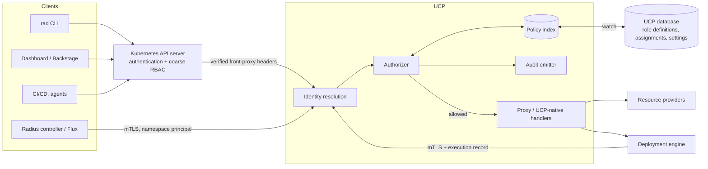
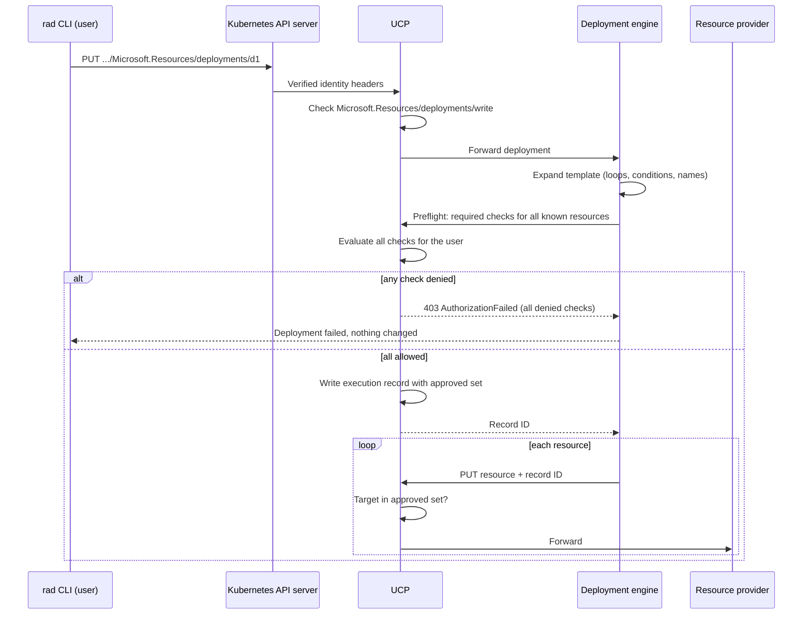

# Built-in Radius Role-Based Access Control

- **Author**: Shruthi Kumar (@sk593)

## Overview

Radius has no authorization model of its own. A caller who can reach the `api.ucp.dev` API group through the Kubernetes API server can perform every Radius operation, and once a request reaches UCP, every internal component trusts it. Organizations that run one Radius installation for many teams cannot express "this team may manage its applications and deploy them only to the staging environment" or "this group may manage Recipe Packs but not credentials."

This document is the technical design for the [built-in RBAC feature specification](./2026-09-built-in-rbac-feature-spec.md). It defines how Radius identifies callers, how roles and role assignments are modeled and stored, how UCP makes and enforces every authorization decision, how cross-scope operations such as deployments are authorized, and how installations adopt enforcement safely. It is the user-facing companion to the [internal component authorization design](https://github.com/radius-project/radius/pull/13086), which assumes UCP already produces an authorization decision for each user request and carries that decision safely through the deployment engine, resource providers, workers, and the credential broker. This design produces that decision; the internal design keeps it from being bypassed.

The model follows the Azure Resource Manager (ARM) RBAC model Radius's resource IDs and API already resemble: a role definition is a list of permissions, a role assignment binds one role to one principal at one scope, assignments inherit downward through the resource hierarchy, and all grants are additive with implicit deny.

## Terms and definitions

| Term             | Definition                                                                                                                                                                                      |
|------------------|-------------------------------------------------------------------------------------------------------------------------------------------------------------------------------------------------|
| Principal        | The user, group, or workload identity that receives a role assignment. Identified by `type`, `issuer`, and `subject`.                                                                           |
| Issuer           | The configured trusted identity source that established a principal and owns its identifier namespace. In the first release this is the Kubernetes API server of the cluster that hosts Radius. |
| Subject          | The stable identifier the issuer assigned to a principal, such as a Kubernetes user name, group name, or ServiceAccount user name.                                                              |
| Permission       | A string naming one operation on one resource type, such as `Radius.Core/environments/write` or `Radius.Core/applications/getGraph/action`.                                                     |
| Role definition  | A named, versioned set of permissions. Built-in role definitions ship with Radius and are immutable; custom role definitions are created by administrators.                                     |
| Role assignment  | A binding of one role definition to one principal at one scope.                                                                                                                                 |
| Scope            | The resource ID at which an assignment applies: the installation, a plane, a resource group, or an individual resource.                                                                         |
| Required check   | One `(permission, target)` pair that must be allowed for a request to proceed. A request can have several.                                                                                      |
| Decision point   | UCP, which evaluates every required check. Downstream components verify UCP's decision through the execution record defined in the internal design rather than re-evaluating policy.            |
| Enforcement mode | The installation-wide setting `Disabled`, `Audit`, or `Enforce` that controls whether decisions are computed, logged, and applied.                                                              |
| Execution record | UCP's server-side record of an approved deployment, defined in the [internal design](https://github.com/radius-project/radius/pull/13086). This design defines what the record approves.        |

## Objectives

> **Issue Reference:** [radius-project/radius#13030](https://github.com/radius-project/radius/issues/13030), [radius-project/roadmap#27](https://github.com/radius-project/roadmap/issues/27)

The objectives, personas, and scenarios are defined in the [feature specification](./2026-09-built-in-rbac-feature-spec.md#key-scenarios) and are not repeated here. The table maps each investment in the specification to the section of this design that implements it.

| Feature specification investment                            | Design section                                                                                              |
|-------------------------------------------------------------|-------------------------------------------------------------------------------------------------------------|
| Feature 1: Permission and scope model                       | [Scopes and inheritance](#scopes-and-inheritance), [Permission catalog](#permission-catalog)                |
| Feature 2: Built-in and custom roles                        | [Role definitions](#role-definitions), [Built-in roles](#built-in-roles)                                    |
| Feature 3: Role assignments and effective-access inspection | [Role assignments](#role-assignments), [Access inspection APIs](#access-inspection-apis)                    |
| Feature 4: Cross-scope and transitive-use authorization     | [Request authorization](#request-authorization), [Deployment authorization](#deployment-authorization)      |
| Feature 5: Consistent enforcement and client behavior       | [Identity](#identity), [Clients and intermediaries](#clients-and-intermediaries)                            |
| Feature 6: Auditability and safe administration             | [Safe administration](#safe-administration), [Monitoring and Logging](#monitoring-and-logging)              |
| Feature 7: Migration and compatibility                      | [Enforcement modes and adoption](#enforcement-modes-and-adoption), [Compatibility](#compatibility-optional) |

### Goals

- Make UCP the single decision point for every Radius API operation, regardless of client.
- Model role definitions and role assignments as Radius resources manageable through the API, `rad auth`, Bicep with `rad deploy`, and GitOps.
- Derive the permission catalog from registered resource types so that new built-in and user-defined types are authorized without hand-maintained lists, and never become accessible by accident.
- Authorize every resource a deployment touches, plus every platform capability it uses, before the deployment starts making changes wherever the template allows.
- Provide `Audit` mode, bootstrap, recovery, and final-administrator protection so existing installations can adopt enforcement without lockout.

### Non goals

The feature specification's [non-goals](./2026-09-built-in-rbac-feature-spec.md#non-goals-out-of-scope) apply. In addition, this design does not:

- Define component-to-component authentication, the execution record format, or the credential broker. These belong to the [internal design](https://github.com/radius-project/radius/pull/13086).
- Add an authentication path other than the Kubernetes API server. The [identity model](#identity) keeps `issuer` explicit so other issuers can be added later.
- Store or serve audit events through a Radius query API in the first release. Audit events are exported; see [Open Questions](#open-questions).
- Support wildcard permissions or explicit deny in custom roles.

## User Experience (if applicable)

The CLI, Bicep, and GitOps experiences are defined in the feature specification's [proposed CLI experience](./2026-09-built-in-rbac-feature-spec.md#proposed-cli-experience), [proposed Bicep experience](./2026-09-built-in-rbac-feature-spec.md#proposed-bicep-experience), and [proposed GitOps experience](./2026-09-built-in-rbac-feature-spec.md#proposed-gitops-experience). This design keeps those experiences and fixes the details left open there: exact permission names, resource IDs, API operations, and flags. The [CLI Design](#cli-design-if-applicable) section lists the concrete commands.

**Sample Input:**

```console
rad auth assignment create \
  --role application-developer \
  --principal group:team-a-devs \
  --scope /planes/radius/local/resourceGroups/team-a

rad auth assignment create \
  --role environment-deployer \
  --principal group:team-a-devs \
  --scope /planes/radius/local/resourceGroups/platform/providers/Radius.Core/environments/staging

rad deploy app.bicep --group team-a --environment /planes/radius/local/resourceGroups/platform/providers/Radius.Core/environments/production
```

**Sample Output:**

```console
Error: Authorization failed before the deployment started.

  Identity:  user alice@contoso.com (issuer: kubernetes)
  Action:    Radius.Core/environments/use/action
  Target:    /planes/radius/local/resourceGroups/platform/providers/Radius.Core/environments/production
  Denied by: Radius RBAC

No Radius resources were changed. Run 'rad auth access explain --action Radius.Core/environments/use/action --scope <target>' for details, or ask a Radius access administrator for the Environment Deployer role on this environment.
```

## Design

### High Level Design

UCP becomes the authorization decision point and the primary enforcement point. Every request already passes through UCP: users reach it through Kubernetes API aggregation, and the deployment engine, controller, and dashboard call it directly or through the same path. UCP gains four parts:

1. **Identity resolution** turns the verified Kubernetes front-proxy headers into a principal and its groups.
2. **The policy store** holds role definitions, role assignments, and the enforcement setting as UCP-owned resources in UCP's existing database, with an in-memory index on every UCP replica.
3. **The authorizer** maps each request to its required checks, evaluates them against the index, and returns allow or deny with the assignment that granted access.
4. **The audit emitter** writes one structured event per decision and per policy change.

Resource providers do not evaluate roles. Requests they receive have already been authorized by UCP, and the [internal design](https://github.com/radius-project/radius/pull/13086) ensures they can verify that through mTLS and the execution record.

### Architecture Diagram



A deployment adds a preflight step in which the deployment engine expands the template and UCP authorizes the expanded set before the deployment starts:



### Detailed Design

#### Identity

**Kubernetes front-proxy identity.** When a request arrives through API aggregation, the Kubernetes API server has already authenticated the caller and forwards the result in the `X-Remote-User`, `X-Remote-Group`, and `X-Remote-Extra-*` headers. UCP strips those headers today (`pkg/ucp/proxy/kubernetes.go`) because it cannot verify that the Kubernetes API server sent them. The internal design adds client-certificate verification for the aggregation endpoint using the `requestheader-client-ca-file` and `requestheader-allowed-names` from the `extension-apiserver-authentication` ConfigMap. This design depends on that change: UCP reads identity headers only on a connection whose client certificate is verified against that CA and name list, and rejects identity headers on any other connection.

UCP maps the verified headers to a principal:

| Header value                                       | Principal                                                                           |
|----------------------------------------------------|-------------------------------------------------------------------------------------|
| `X-Remote-User: system:serviceaccount:<ns>:<name>` | `{type: workload, issuer: <k8sIssuer>, subject: system:serviceaccount:<ns>:<name>}` |
| Any other `X-Remote-User` value                    | `{type: user, issuer: <k8sIssuer>, subject: <value>}`                               |
| Each `X-Remote-Group` value                        | `{type: group, issuer: <k8sIssuer>, subject: <value>}`                              |

The request is evaluated for the user or workload principal together with all its group principals. `system:authenticated` and `system:serviceaccounts` are valid group subjects, so an administrator can grant Reader to every authenticated caller. `system:unauthenticated` is never accepted; anonymous requests are rejected with `InvalidAuthenticationInfo`.

`<k8sIssuer>` identifies the Kubernetes trust domain that authenticated the caller. A bare `kubernetes` would not identify an identifier namespace: two clusters can both have a user `alice` or a ServiceAccount `default/ci`, and policy restored into another cluster would then grant access to unrelated principals. The issuer is therefore `kubernetes:<trust-domain>`, set by the Helm value `rbac.kubernetesIssuer`. When unset, `rad install` derives the trust domain from the UID of the cluster's `kube-system` namespace, which is stable for the life of a cluster. Installations whose control plane is recreated, such as Repo Radius, set an explicit stable value such as `kubernetes:repo-radius/<owner>/<repo>`. In the CLI, `--issuer` defaults to the installation's Kubernetes issuer, and examples in this document abbreviate it as `kubernetes`. The issuer is stored explicitly on every assignment so later releases can add issuers, such as an OIDC provider for the dashboard, without migrating data. Subject stability depends on the cluster's authentication configuration: for OIDC-backed clusters, the user name comes from the configured claim and prefix. The `rad auth whoami` output shows exactly which subject Radius sees, and the documentation recommends a stable claim such as `sub` with a prefix over a mutable claim such as `email`.

Display names are informational. UCP records the `X-Remote-User` value as the display name for users. Group display names are not available from Kubernetes and are left empty unless the administrator sets `principal.displayName` on the assignment.

**Group membership freshness.** Kubernetes resolves groups for every request, so Radius always sees current membership as reported by the authenticator. Group changes in the identity provider take effect when the caller's Kubernetes credential is refreshed, which is the documented period the specification requires.

**Kubernetes RBAC becomes a coarse gate.** Kubernetes still authorizes access to the `api.ucp.dev` API group before forwarding. The Helm chart adds a ClusterRole `radius-api-user` that allows all verbs on `api.ucp.dev`. With Radius RBAC in `Enforce` mode, administrators bind that ClusterRole broadly, for example to `system:authenticated`, and let Radius make the fine-grained decision. With RBAC `Disabled`, the existing Kubernetes RBAC remains the only gate, as today.

**Internal callers.** Requests from Radius components are identified by mTLS as defined in the internal design. Only two internal callers act as principals in this design:

- The **deployment engine** never acts as a principal. Its requests are evaluated as the user recorded in the execution record.
- The **Radius controller** acts for a namespace. See [Controllers and GitOps](#controllers-and-gitops).

#### Scopes and inheritance

Scopes are UCP resource IDs:

| Scope          | Resource ID                                                                  | Examples of resources it covers                                                                                                                                             |
|----------------|------------------------------------------------------------------------------|-----------------------------------------------------------------------------------------------------------------------------------------------------------------------------|
| Installation   | `/`                                                                          | Everything. Reserved for Radius Administrator, Access Administrator, Reader, Auditor, and the enforcement setting.                                                          |
| Plane          | `/planes/radius/local`, `/planes/azure/<name>`, `/planes/aws/<name>`         | Resource groups in the plane, resource type registrations (`System.Resources/resourceProviders`), cloud credentials (`System.Azure/credentials`, `System.AWS/credentials`). |
| Resource group | `/planes/radius/local/resourceGroups/<rg>`                                   | All resources in the group.                                                                                                                                                 |
| Resource       | Any tracked resource ID, such as an environment, Recipe Pack, or application | The resource and its child resources.                                                                                                                                       |

An assignment at a scope applies to that scope and every scope below it. Inheritance follows the ID prefix and never crosses to a sibling: an assignment at `/planes/azure/prod` does not apply to `/planes/azure/dev` or to the Radius plane, and an assignment on an environment does not apply to the Recipe Packs it references. A reference from one resource to another never transfers access.

Individual-resource scope is supported for `Radius.Core/environments`, `Radius.Core/recipePacks`, `Radius.Core/applications`, and `Applications.Core/environments` and `Applications.Core/applications` in the first release. These are the resources the specification's scenarios delegate individually. Other resource types can be added without a data-model change, because the evaluator handles any resource ID.

#### Permission catalog

A permission has the form `<Namespace>/<type>[/<childType>]/<operation>`, where `<operation>` is `read`, `write`, `delete`, or `<actionName>/action`. UCP maps each request to a permission mechanically:

| Request                           | Permission                   |
|-----------------------------------|------------------------------|
| `GET` on a resource or collection | `<type>/read`                |
| `PUT` or `PATCH`                  | `<type>/write`               |
| `DELETE`                          | `<type>/delete`              |
| `POST <resourceId>/<actionName>`  | `<type>/<actionName>/action` |

The catalog is assembled from three sources, so it never drifts from what Radius serves:

| Source                               | Types                                                                                                                                                                                                                                      | How permissions are produced                                                                                                                                                             |
|--------------------------------------|--------------------------------------------------------------------------------------------------------------------------------------------------------------------------------------------------------------------------------------------|------------------------------------------------------------------------------------------------------------------------------------------------------------------------------------------|
| TypeSpec-generated (build time)      | `Radius.Core/*`, `Applications.*/*`, `Microsoft.Resources/deployments`                                                                                                                                                                     | A generator reads the Swagger in `swagger/` and emits read, write, delete, and every `@action` (for example `getGraph`, `listSecrets`, `getMetadata`) into a Go table compiled into UCP. |
| UCP-native (static)                  | `System.Resources/resourceProviders` and its child types, `System.Azure/credentials`, `System.AWS/credentials`, resource groups, planes, `Radius.Core/roleDefinitions`, `Radius.Core/roleAssignments`, `Radius.Core/authorizationSettings` | Declared alongside the UCP routes.                                                                                                                                                       |
| Registered resource types (run time) | User-defined types, such as `Radius.Data/mySqlDatabases`                                                                                                                                                                                   | Generated from the type registration when it is created: read, write, and delete.                                                                                                        |

The catalog also contains **use permissions** that do not correspond to an HTTP method. They authorize referencing a resource from another resource; see [Request authorization](#request-authorization).

| Use permission                                                                          | Required when                                                                                                                                                                             |
|-----------------------------------------------------------------------------------------|-------------------------------------------------------------------------------------------------------------------------------------------------------------------------------------------|
| `Radius.Core/environments/use/action` (and `Applications.Core/environments/use/action`) | A resource's `environment` property points at the environment, which includes every application resource deployed to it.                                                                  |
| `Radius.Core/recipePacks/use/action`                                                    | An environment's `recipePacks` list references the Recipe Pack.                                                                                                                           |
| `System.Azure/credentials/use/action`, `System.AWS/credentials/use/action`              | An environment's `providers.azure` or `providers.aws` configuration is set or changed, because deployments to that environment will use the plane's registered credential for that scope. |
| `<type>/connect/action`                                                                 | A resource declares a connection to a resource of `<type>`.                                                                                                                               |

The specification's example uses `Radius.Core/applications/deploy/action`. Deploying an application is not a distinct API operation in Radius: it is a `Microsoft.Resources/deployments/write` that writes the application's resources. This design therefore separates "manage applications" (`applications/write`) from "deploy to an environment" (`environments/use/action`) and does not add a separate `applications/deploy/action`. Custom roles that need the specification's intent use those two permissions.

`GET .../providers/Radius.Core/permissions` returns the catalog, and `rad auth permission list` displays it. Each entry includes the permission, description, resource type, and the scopes at which it is meaningful.

**New types never broaden existing roles.** A permission that is added to the catalog, because Radius ships a new action or a resource type is registered, is not included in any existing custom role. Custom roles cannot contain wildcards, so this holds by construction. Built-in roles that cover application resources use the mechanism in [Built-in roles](#built-in-roles), which requires an explicit opt-in per type.

#### Role definitions

Role definitions are `Radius.Core/roleDefinitions` resources. The resource type is in the `Radius.Core` namespace so the Bicep experience matches the specification, but UCP serves it natively instead of proxying it to Applications RP, because UCP owns all authorization data.

```json
{
  "id": "/planes/radius/local/resourceGroups/platform/providers/Radius.Core/roleDefinitions/application-operator",
  "type": "Radius.Core/roleDefinitions",
  "properties": {
    "displayName": "Application Operator",
    "description": "Operate applications without changing platform configuration.",
    "roleType": "Custom",
    "permissions": [
      "Radius.Core/applications/read",
      "Radius.Core/applications/write",
      "Radius.Core/environments/use/action"
    ],
    "assignableScopes": [
      "/planes/radius/local/resourceGroups/platform",
      "/planes/radius/local/resourceGroups/team-a"
    ]
  }
}
```

| Property           | Rules                                                                                                                                                          |
|--------------------|----------------------------------------------------------------------------------------------------------------------------------------------------------------|
| `permissions`      | Required. Every entry must exist in the catalog at write time; unknown entries fail with `UnknownPermission`. No wildcards.                                    |
| `roleType`         | Read-only. `BuiltIn` or `Custom`.                                                                                                                              |
| `assignableScopes` | Optional. Defaults to the scope where the role is defined. Every entry must be at or below a scope where the caller holds `Radius.Core/roleDefinitions/write`. |

A role definition can be created at installation, plane, or resource-group scope. A custom role at `/` is visible and assignable everywhere. Built-in roles live at `/providers/Radius.Core/roleDefinitions/<name>`, are written by the UCP initializer at startup, and reject `PUT` and `DELETE` with `BuiltInRoleImmutable`. Bicep references them with `existing`.

Deleting a custom role that has assignments fails with `RoleDefinitionInUse` and lists the number of assignments the caller can see. Updating a custom role takes effect for all of its assignments within the [propagation period](#policy-store-and-propagation); `rad auth role update` shows the number of affected assignments before confirming.

#### Built-in roles

The roles below implement the [specification's built-in roles](./2026-09-built-in-rbac-feature-spec.md#feature-2-built-in-and-custom-roles). Each built-in role is an explicit, versioned list of permissions generated at build time and published in the release notes. A new action or resource type that ships with Radius enters a built-in role only through a reviewed change to that list in a Radius release; it is never added at run time. The one deliberate exception is `radius-administrator`, which is defined as the superuser role and always holds every permission in the catalog. Names in `rad` use the kebab-case form.

| Role                          | Permissions (summary)                                                                                                                                                                                                                                   |
|-------------------------------|---------------------------------------------------------------------------------------------------------------------------------------------------------------------------------------------------------------------------------------------------------|
| `radius-administrator`        | Every permission in the catalog, including access administration and `authorizationSettings/write`.                                                                                                                                                     |
| `access-administrator`        | `Radius.Core/roleDefinitions/*`, `Radius.Core/roleAssignments/*`, `Radius.Core/permissions/read`, `Radius.Core/checkAccess/action`, and read on resource groups (to target scopes). No resource-mutation permissions.                                   |
| `platform-administrator`      | Resource groups (read, write, delete), environments (all, including `use`), Recipe Packs (read, `use`), and the `use` permission on credentials in the planes where it is assigned. It cannot register or delete credentials or manage roles.           |
| `application-developer`       | Read, write, and delete on applications and on every resource type in the `applicationResources` set, plus the actions listed for that set in the role version, `connect`, and `Microsoft.Resources/deployments/*`. Excludes `environments/use/action`. |
| `environment-deployer`        | `environments/use/action` and `environments/read`, assigned on an environment or a resource group of environments.                                                                                                                                      |
| `recipe-pack-administrator`   | Read, write, delete, and `use` on Recipe Packs.                                                                                                                                                                                                         |
| `resource-type-administrator` | `System.Resources/resourceProviders/*` and its child types, including `resourceTypes/joinPermissionSet/action`. Assignable only at plane or installation scope, because type registrations are plane-scoped.                                            |
| `reader`                      | Every `read` permission and `getGraph`, `getMetadata`. Excludes `listSecrets`, credential reads, and role-definition and role-assignment reads.                                                                                                         |
| `auditor`                     | Read on role definitions, role assignments, authorization settings, and the permission catalog, plus `checkAccess` and `explainAccess` for any principal. No resource reads beyond metadata needed to resolve scopes.                                   |

Credential registration, unregistration, and read (`System.Azure/credentials/write|delete|read`, `System.AWS/credentials/*`) are in Radius Administrator only. Administrators who need to delegate credential management create a custom role assigned at the provider plane, as the specification requires.

**Application resource set.** Application Developer and Reader need to cover user-defined types, but the specification requires that adding a type does not silently expand access. A resource type registration gains an optional `permissionSets` list. A type is included in the built-in `applicationResources` set only when its registration lists `applicationResources`. Opting in grants only the type's `read`, `write`, `delete`, and `connect` permissions, never actions, so a type that later gains an action does not broaden existing assignments, and setting or changing that list requires `System.Resources/resourceProviders/resourceTypes/joinPermissionSet/action`. Resource Type Administrators hold it, so adding a type to the set is a deliberate, audited act. Built-in `Applications.*` and `Radius.Compute`, `Radius.Data`, `Radius.Security` types that ship with Radius are in the set by default. Reader's `read` coverage uses the same opt-in.

```yaml
namespace: Radius.Data
types:
  mySqlDatabases:
    permissionSets:
      - applicationResources
    apiVersions:
      "2025-08-01-preview":
        schema: { ... }
```

#### Role assignments

Role assignments are `Radius.Core/roleAssignments` extension resources on the scope they apply to, served natively by UCP:

```text
/providers/Radius.Core/roleAssignments/<name>
/planes/radius/local/providers/Radius.Core/roleAssignments/<name>
/planes/radius/local/resourceGroups/team-a/providers/Radius.Core/roleAssignments/<name>
/planes/radius/local/resourceGroups/platform/providers/Radius.Core/environments/staging/providers/Radius.Core/roleAssignments/<name>
```

UCP's resource ID parser already supports extension segments, so the scope is the ID with the final `providers/Radius.Core/roleAssignments/<name>` removed.

```json
{
  "id": "/planes/radius/local/resourceGroups/team-a/providers/Radius.Core/roleAssignments/3f1c...",
  "type": "Radius.Core/roleAssignments",
  "properties": {
    "roleDefinitionId": "/providers/Radius.Core/roleDefinitions/application-developer",
    "principal": {
      "type": "group",
      "issuer": "kubernetes:6c1e9a8e-...",
      "subject": "team-a-devs",
      "displayName": "Team A developers"
    },
    "description": "Team A owns this resource group.",
    "scope": "/planes/radius/local/resourceGroups/team-a",
    "managedBy": {
      "kind": "GitOps",
      "source": "https://github.com/contoso/platform-config",
      "revision": "8d2f1e0",
      "path": "access/team-a.bicep",
      "principal": "workload:kubernetes:radius-controller/namespace:platform-config"
    },
    "createdBy": "user:kubernetes:alice@contoso.com"
  }
}
```

| Property                              | Rules                                                                                                                                                                                                             |
|---------------------------------------|-------------------------------------------------------------------------------------------------------------------------------------------------------------------------------------------------------------------|
| `roleDefinitionId`                    | Required and immutable. The scope must be within the role's `assignableScopes`.                                                                                                                                   |
| `principal.type`, `issuer`, `subject` | Required and immutable. `type` is `user`, `group`, or `workload`; `issuer` must be a configured issuer.                                                                                                           |
| `principal.displayName`               | Optional, informational, mutable.                                                                                                                                                                                 |
| `scope`                               | Read-only, derived from the ID.                                                                                                                                                                                   |
| `managedBy`                           | Read-only. Set by UCP from the request path: `Imperative` (API or `rad auth`), `Deployment` (`rad deploy`, with the deployment ID), `GitOps` (controller, with source provenance), or `Bootstrap` (installation). |
| `createdBy`                           | Read-only.                                                                                                                                                                                                        |

A `PUT` that changes an immutable property fails with `RoleAssignmentImmutable`. A `PUT` with identical immutable properties is idempotent, which is what makes repeated `rad deploy` and GitOps reconciliation safe. `rad auth assignment create` generates the name with the same algorithm as Bicep's `guid()` over `(scope, roleDefinitionId, type, issuer, subject)`. Templates should use `guid(resourceGroup().id, role.id, 'group', issuer, subject)` with the same inputs in the same order so the CLI and Bicep converge on one resource. Including the principal type prevents a user and a group with the same subject from colliding. The feature specification's Bicep example omits scope and type and should be updated to match.

**Management ownership.** The specification requires teams to designate whether GitOps or imperative commands own an assignment. A write or delete of an assignment whose `managedBy.kind` is `GitOps` is rejected with `ManagedByConflict` unless it comes from the same GitOps principal and source, or the caller passes `?takeOwnership=true` (`rad auth assignment delete --take-ownership`) and holds `Radius.Core/roleAssignments/write` at the scope. Taking ownership is audited. `Bootstrap` assignments can be changed only through [bootstrap configuration](#enforcement-modes-and-adoption).

#### Policy store and propagation

Role definitions, role assignments, and the `authorizationSettings` singleton are stored in UCP's existing database (`pkg/components/database`, Kubernetes API server store or PostgreSQL), in the same way UCP stores resource groups and resource type registrations. No new backing service is introduced.

Every UCP replica keeps an in-memory index:

- Assignments indexed by `(scope, principalKey)`, where `principalKey` is `type:issuer:subject`.
- Role definitions expanded to permission sets, indexed by ID.
- A policy generation number stored on `authorizationSettings`, incremented in the same transaction-equivalent as every policy write.

A replica refreshes when its stored generation is behind, polling every 5 seconds and on every local write. The documented propagation bound for role and assignment changes is **30 seconds** across all replicas, which includes retries on transient store errors. A replica that cannot refresh within that bound reports not ready and fails decisions with `AuthorizationUnavailable` instead of using stale policy. The first release supports up to 10,000 assignments and 1,000 custom role definitions per installation; both limits are enforced at write time and can be raised after load testing.

#### Request authorization

The authorizer is a middleware in UCP's request pipeline (`pkg/ucp/frontend/api/server.go`), placed after request-context parsing and before routing to UCP-native handlers or the proxy. For each request it computes the list of required checks, evaluates every check, and allows the request only if all pass.

```text
requiredChecks(request):
  checks = [ (permissionFor(request.method, request.type, request.action), request.resourceID) ]
  if request is a PUT or PATCH:
    for each reference in extractReferences(request.type, request.body):
      checks += (reference.permission, reference.targetID)
  return checks

allowed(principalSet, permission, target):
  for scope in ancestorsInclusive(target):        # target, parent, ..., resource group, plane, "/"
    for assignment in index[scope] matching any principal in principalSet:
      if permission in role(assignment).permissions and scope in role.assignableScopes:
        return Allow(assignment)
  return Deny
```

**Reference extraction.** References are the source of cross-scope authorization. The extractor reads well-known properties for built-in types and schema annotations for user-defined types:

| Property                                                                                       | Required check on the referenced resource                                                          |
|------------------------------------------------------------------------------------------------|----------------------------------------------------------------------------------------------------|
| `properties.environment`                                                                       | `<envType>/use/action`                                                                             |
| `properties.application`                                                                       | `<appType>/write`, so a caller cannot attach resources to another team's application graph         |
| `properties.recipePacks[]` on an environment                                                   | `Radius.Core/recipePacks/use/action`                                                               |
| `properties.providers.azure` or `.aws` on an environment                                       | `System.Azure/credentials/use/action` or `System.AWS/credentials/use/action` at the provider plane |
| `properties.connections.*.source`                                                              | `<sourceType>/connect/action`                                                                      |
| Any schema property annotated with a new `x-radius-reference` extension in a user-defined type | `<referencedType>/read`                                                                            |

Reference checks apply to every reference present in a `PUT` body, and to every reference present in a `PATCH` body. UCP does not compare against stored state, because that would need a read-check-write sequence that races with concurrent writes through the proxy. As a result, a caller who loses `use` access to an environment can no longer update resources bound to it, which matches the intent that environment use is a live permission. Read and delete operations do not check references.

**Delegated use.** A caller allowed `environments/use/action` can deploy to the environment without any permission on its Recipe Packs, Recipes, provider configuration, or credentials. Radius uses those on the caller's behalf when it provisions resources, and the internal design limits that use to the recipe and scope approved in the execution record. The caller cannot read them through the API unless separately granted, and recipe outputs exposed to the caller are subject to existing [sensitive-field redaction](./2026-07-sensitive-fields-in-app-graph.md).

**Denial before lookup.** The authorizer runs before UCP looks up the resource, so `403 AuthorizationFailed` is returned whether or not the target exists. A caller without `read` on a resource cannot learn that it exists. When the caller has `read` on the target, normal `404` behavior applies.

**List operations.** `GET` on a collection requires `<type>/read` at the collection's parent scope, or at any scope below it. If the caller holds `read` at the parent scope, the collection is returned unfiltered. Otherwise UCP returns only the items whose IDs are at or below a scope where the caller has `read`, and does not report the number of items omitted. The plane-level resource-group list and `GET /planes/radius/local/resourceGroups/<rg>/resources` are filtered the same way. Filtering a proxied list happens in UCP after the resource provider responds; the provider's pagination tokens are passed through unchanged, so a filtered page can be shorter than requested.

**Application graphs.** `getGraph` requires `Radius.Core/applications/getGraph/action` on the application. Nodes for resources the caller cannot read, for example a shared database in another resource group, are replaced with a node that has no ID, name, or properties and is marked `hidden: true`. Edges to it are kept so the graph's shape stays correct, and the response sets `incomplete: true`. This follows the specification's requirement to label incomplete results without revealing hidden resources.

**Asynchronous operation status.** `operationStatuses` and `operationResults` resources require `read` on the resource the operation targets, which UCP reads from the stored operation status before responding. The caller who submitted the operation always has access to its status.

#### Deployment authorization

`rad deploy` creates a `Microsoft.Resources/deployments` resource. The deployment engine then writes each resource in the template through UCP. Without preflight, a deployment that fails authorization on its fifth resource would leave four resources changed, which the specification forbids for denials that can be determined in advance.

1. **Submit.** UCP checks `Microsoft.Resources/deployments/write` on the deployment's resource group.
2. **Expand.** The deployment engine evaluates the template's parameters, variables, conditions, and loops, and produces the list of resources it will write, with IDs and bodies. Resources whose name or authorization-relevant references depend on a runtime value, such as `reference()` of another resource's output, are listed as **deferred** with the parts that are known: the resource type and the scope prefix, which is almost always a literal resource group, plus any references that are known.
3. **Preflight.** The engine sends the expanded list to a new UCP-internal endpoint, `POST /internal/authorization/preflight`, over mTLS. UCP computes the required checks for every resource as if each were a direct request and evaluates them all for the user who submitted the deployment. For a deferred resource, UCP checks the permission at the known scope prefix, which by inheritance covers any name under it, and records that prefix as a bound. If a deferred resource's scope or an authorization-relevant reference cannot be bounded, preflight fails with `AuthorizationIndeterminate` in `Enforce` mode and logs it in `Audit` mode.
4. **Decide.** If any check is denied, UCP returns every denied check, the engine fails the deployment with `AuthorizationFailed` before writing any resource, and the CLI prints all denials in one message. If all are allowed, UCP writes the execution record with the approved set as its `actions` and `targets` (internal design) and returns the record ID.
5. **Execute.** Each child request cites the record. UCP verifies that the target and permission are in the approved set, or for a deferred resource, under its recorded bound. A request outside the approved set and bounds is rejected with `GrantScopeExceeded` (internal design) regardless of current policy, so an assignment added after submission never extends an accepted deployment.

**In-flight policy changes.** This is a required change to the internal design: downstream checks validate the execution record's approved set, status, cancellation, and expiry, not the user's current policy, and UCP does not revoke records on ordinary assignment changes. The specification requires an accepted operation to continue with its original decision when assignments change, and requires that a policy change never expand what the operation can do. Requests within the approved set are therefore allowed for the life of the execution record even if the user loses access afterward. An administrator who needs to stop a deployment immediately cancels it with `rad deployment cancel <id>`, which requires `Microsoft.Resources/deployments/cancel/action` on the deployment's resource group (included in Radius Administrator and Application Developer) and causes UCP to revoke the execution record. Retries and repeated deployments create a new deployment and a new record and are evaluated against current policy. The execution record's hard expiry from the internal design bounds how long an accepted deployment can continue.

**Nested deployments** are expanded by the engine as part of the parent. Their resources are added to the preflight list, so a nested module does not get a separate decision.

**Authorization resources in a template.** Role definitions and assignments in a template go through the same preflight. Their [safe-administration checks](#safe-administration) run during preflight as well, so a template that would remove the last administrator or escalate privilege fails before any resource is written.

#### Safe administration

These rules are evaluated by UCP for every write and delete of a role definition or role assignment, from any client. They are in addition to the ordinary permission check.

| Rule                             | Behavior                                                                                                                                                                                                                                            |
|----------------------------------|-----------------------------------------------------------------------------------------------------------------------------------------------------------------------------------------------------------------------------------------------------|
| Final recoverable administrator  | The installation must always have at least one `radius-administrator` assignment at `/` to a `user` or `group` principal, not counting `Bootstrap` assignments that expire. A change that would leave none fails with `LastAdministratorProtected`. |
| No escalation through assignment | A caller can create an assignment of role R at scope S only if the caller holds every permission in R at S, or holds `access-administrator` or `radius-administrator` at S. Violations fail with `PrivilegeEscalationDenied`.                       |
| No escalation through role edits | A caller who is not an Access Administrator or Radius Administrator can add a permission to a custom role only if the caller holds that permission at every assignable scope of the role.                                                           |
| Assignable scope                 | An assignment's scope must be within the role's `assignableScopes`.                                                                                                                                                                                 |
| Ownership                        | `GitOps` and `Bootstrap` ownership as described in [Role assignments](#role-assignments).                                                                                                                                                           |

**Access Administrator is a security-administration role.** An Access Administrator can grant any role, including `radius-administrator`, to any principal, and could therefore grant it to an accomplice, a ServiceAccount they control, or a group they later join. This matches the Azure User Access Administrator role and is inherent in delegating access administration. The design does not claim to prevent it. Instead, it makes it visible: assignments of `radius-administrator` or `access-administrator`, and assignments whose principal set includes the caller, require confirmation in the CLI, are marked `highImpact: true` in the audit event, and increment an alertable metric. Administrators should assign `access-administrator` with the same care as `radius-administrator`. The specification's phrase "without automatically receiving application access" holds: the role grants no resource permissions until its holder deliberately creates an assignment, which is audited.

**Break-glass recovery.** If no administrator can sign in, for example because the identity provider group was deleted, a Kubernetes cluster administrator, who is already trusted to change Radius itself, creates the `radius-rbac-recovery` Secret in the Radius namespace:

```yaml
apiVersion: v1
kind: Secret
metadata:
  name: radius-rbac-recovery
  namespace: radius-system
stringData:
  principal: user:kubernetes:oncall@contoso.com
  expiresAt: "2026-10-02T18:00:00Z"
  reason: "INC-4211 admin group deleted"
```

UCP polls for this one Secret with `GET` every 10 seconds, using a Role that grants only `get` on `secrets` with `resourceNames: [radius-rbac-recovery]`. It does not list or watch Secrets, so it needs no broader Secret access. When it is present and valid, UCP adds an in-memory `radius-administrator` grant at `/` for the named principal until `expiresAt`, capped at 4 hours from when UCP first observed it. The grant is not written to the database and disappears when the Secret is deleted or expires. Every request made under it is audited with `recovery: true`, and UCP emits a warning event and metric for its whole lifetime. Kubernetes RBAC on that Secret name is the control: only cluster administrators can create it. This keeps recovery separate from normal access, as the specification requires.

#### Enforcement modes and adoption

The `authorizationSettings` singleton at `/providers/Radius.Core/authorizationSettings/default` holds the mode:

| Mode       | Decisions computed | Decisions applied          | Use                                                                                    |
|------------|--------------------|----------------------------|----------------------------------------------------------------------------------------|
| `Disabled` | No                 | No                         | Upgrades of existing installations, until the administrator opts in. Today's behavior. |
| `Audit`    | Yes                | No; every request proceeds | Preview. Would-be denials are logged and counted.                                      |
| `Enforce`  | Yes                | Yes                        | Normal operation.                                                                      |

This setting controls user-facing policy only, and changes at run time through the API. It is separate from the internal design's component-protocol stage (`Off`, dry run, `Enforce`), which is installation configuration applied through Helm because it changes listeners, certificates, and admission policies and requires a rollout. The two are related by one rule: UCP rejects a change to `Enforce` with `ComponentProtocolNotEnforced` unless every component reports the internal protocol in `Enforce`, because otherwise a caller could bypass the decision point by calling a resource provider directly. `Audit` works in any component stage. Moving user policy from `Enforce` back to `Audit` does not change the component stage, and the internal design's downgrade rules for that stage are unchanged.

| User policy mode | Allowed component-protocol stages |
|------------------|-----------------------------------|
| `Disabled`       | Any                               |
| `Audit`          | Any                               |
| `Enforce`        | `Enforce` only                    |

**New installations.** `rad install kubernetes` resolves the installing identity with the Kubernetes `SelfSubjectReview` API and writes it to the Helm value `rbac.bootstrapAdministrators`. Before UCP reports ready, the UCP initializer writes a `radius-administrator` assignment at `/` with `managedBy.kind: Bootstrap` for each listed principal and sets the mode from `rbac.mode`, which defaults to `Enforce`. UCP does not serve requests before both are written, so there is no unprotected window. For a single developer, nothing changes: they are the installation's administrator. `rad install kubernetes --skip-rbac` (from the internal design) sets `rbac.mode=Disabled`.

Helm sets the mode only at first installation. After that, `authorizationSettings` is the source of truth and `helm upgrade` does not overwrite it; the pre-upgrade check fails if `rbac.mode` in the values conflicts with the stored mode, and tells the operator to use `rad auth enforcement`.

**Existing installations.** Upgrading leaves the mode `Disabled` and writes no assignments. The adoption flow is:

1. `rad auth enforcement preview` sets `Audit` and requires the caller to become a bootstrap administrator in the same step, because there are no assignments yet. While the mode is `Disabled`, the only principals allowed to run this are those that Kubernetes RBAC allows to update `authorizationsettings` in `api.ucp.dev`, which Helm grants only to cluster administrators.
2. While in `Audit`, UCP records each distinct principal and the permissions and scopes it used.
3. `rad auth enforcement report` lists the observed principals, the requests that would have been denied, and suggested assignments that would cover the observed use at the narrowest built-in role and resource-group scope. Suggestions are output only. The administrator applies them with `rad auth assignment create` or a Bicep file after review.
4. `rad auth enforcement enable` switches to `Enforce` after confirming that no would-be denials occurred in the last 24 hours, or with `--accept-denials` after showing them. It fails with `LastAdministratorProtected` if the final-administrator rule is not met.
5. During a migration period defined per release, a Radius Administrator can move from `Enforce` back to `Audit` with `rad auth enforcement disable`. This is audited and raises an alert. Moving to `Disabled` after `Enforce` requires the recovery procedure.

**Repo Radius and other ephemeral installations.** The workflow's identity is the bootstrap administrator. When Repo Radius restores state into a new control plane, restored assignments are imported, but `Bootstrap` assignments always come from the current installation's configuration and restored data cannot delete, replace, or disable them, and cannot change the mode. This satisfies the specification's requirement that restored policy cannot replace trusted bootstrap access.

#### Controllers and GitOps

The Radius controller reconciles `DeploymentTemplate` objects, including those Flux creates from a `GitRepository`. The internal design states that the controller acts for the namespace in which the object lives and calls UCP with its mTLS identity, and that an administrator maps each namespace to the resource groups and environments it may target.

This design expresses that mapping as ordinary role assignments. For controller requests, the principal is the **namespace principal** `{type: workload, issuer: radius-controller, subject: <namespace>}`. UCP accepts this principal only when the mTLS caller is the controller. An administrator grants it roles in the usual way:

```console
rad auth assignment create --role application-developer \
  --principal workload:team-a --issuer radius-controller \
  --scope /planes/radius/local/resourceGroups/team-a
rad auth assignment create --role environment-deployer \
  --principal workload:team-a --issuer radius-controller \
  --scope /planes/radius/local/resourceGroups/platform/providers/Radius.Core/environments/staging
```

A namespace with no assignments can do nothing. The controller's effective authority is exactly that namespace principal's effective access, so the namespace mapping, `rad auth access list`, `explain`, and audit all work the same way for GitOps as for people, and no separate mapping object is required. Kubernetes RBAC still controls who can create `DeploymentTemplate` objects in each namespace.

To manage role assignments through GitOps, the platform team grants the namespace principal `access-administrator` or a custom role with `roleAssignments/write` at the scopes the repository manages. The safe-administration rules apply to reconciliation and to Flux pruning, so a pruned assignment that would remove the last administrator or the GitOps principal's own access fails reconciliation with that error code rather than being applied. The controller passes the `GitRepository` URL, revision, and template path to UCP in request headers that UCP accepts only from the controller's mTLS identity, and UCP stores them in `managedBy`.

#### Clients and intermediaries

| Client                          | Identity Radius sees                                                                                    | Notes                                                                                                                   |
|---------------------------------|---------------------------------------------------------------------------------------------------------|-------------------------------------------------------------------------------------------------------------------------|
| `rad` CLI                       | The Kubernetes identity in the active kubeconfig.                                                       | No change to sign-in.                                                                                                   |
| CI/CD and GitHub Actions        | The workload's Kubernetes identity, such as a ServiceAccount or federated OIDC identity.                | Each pipeline should use its own identity.                                                                              |
| Agents and Copilot integrations | The identity in the kubeconfig the agent runs with.                                                     | Agents should use a dedicated workload identity; the CLI's errors make denials distinguishable from transient failures. |
| Dashboard and Backstage plugin  | First release: the dashboard ServiceAccount. With user identity forwarding enabled: the signed-in user. | See below.                                                                                                              |
| Radius controller               | The namespace principal.                                                                                | See [Controllers and GitOps](#controllers-and-gitops).                                                                  |
| Deployment engine               | The user recorded in the execution record.                                                              | Never a principal on its own.                                                                                           |

**Dashboard.** Today the dashboard uses its own ServiceAccount with a ClusterRole that allows every verb on `api.ucp.dev`. Under RBAC, that ServiceAccount is a normal workload principal with no assignments. Granting it a role by default would let every dashboard user see whatever the ServiceAccount can see and would attribute their requests to it, which contradicts the specification. To attribute actions to the signed-in user, the dashboard backend can forward the user's identity using Kubernetes impersonation (`Impersonate-User` and `Impersonate-Group`), so the Kubernetes API server authenticates the impersonation and UCP receives the user through the same verified front-proxy headers. This requires the dashboard's sign-in to use the same identity provider as the cluster, and requires granting the dashboard ServiceAccount the Kubernetes `impersonate` verb, which is powerful. It is enabled through the `dashboard.forwardUserIdentity` Helm value, and the documentation describes the trade-off. In `Enforce` mode without forwarding, the dashboard shows that user identity forwarding is required instead of data. An administrator who accepts shared access can explicitly assign the dashboard ServiceAccount a role, for example `reader` on a resource group, and `rad auth assignment create` warns that every dashboard user will share that access and that audit records will name the ServiceAccount. RBAC administration remains unavailable in the dashboard, as the specification requires.

**Kubernetes-direct paths.** `rad run` log streaming and port forwarding use the caller's Kubernetes access to pods directly and are not governed by Radius RBAC. The CLI states this in `rad run` help and when Kubernetes denies log access.

#### Access inspection APIs

These are UCP-native operations. Each is authorized like any other request.

| Operation                                                                     | Permission                                                                                                 | Returns                                                                                                                                                                                                                                                                 |
|-------------------------------------------------------------------------------|------------------------------------------------------------------------------------------------------------|-------------------------------------------------------------------------------------------------------------------------------------------------------------------------------------------------------------------------------------------------------------------------|
| `GET /providers/Radius.Core/whoAmI`                                           | None (any authenticated caller)                                                                            | The principal, groups, issuer, enforcement mode, and whether the caller holds `radius-administrator` at `/`.                                                                                                                                                            |
| `POST {scope}/providers/Radius.Core/checkAccess`                              | None for the caller's own access; `Radius.Core/checkAccess/action` at the scope to check another principal | For each requested `(permission, target)`, `allowed` or `denied`.                                                                                                                                                                                                       |
| `POST {scope}/providers/Radius.Core/explainAccess`                            | As for `checkAccess`                                                                                       | As for `checkAccess`, plus the granting assignment and role when allowed. When denied, the roles at that scope that contain the permission, so the caller knows what to request. Assignments are returned only if the caller has `roleAssignments/read` at their scope. |
| `GET {scope}/providers/Radius.Core/effectiveAccess?principal=...`             | `Radius.Core/roleAssignments/read` at the scope                                                            | Every assignment, direct and inherited, that applies to the principal and its groups at the scope, with the resulting permission set. For a group, the result covers the group's own assignments; Radius cannot enumerate group members.                                |
| `GET {scope}/providers/Radius.Core/roleAssignments?$filter=atScopeAndBelow()` | `Radius.Core/roleAssignments/read`                                                                         | Assignments at and below the scope. `rad auth assignment list --include-inherited` calls it for every ancestor scope.                                                                                                                                                   |

A caller who checks their own access but lacks `roleAssignments/read` gets allowed or denied with no policy details beyond the names of built-in roles that would grant the permission. This lets users find the right role to request without seeing who else has access.

### API design (if applicable)

New resource types, defined in TypeSpec under `typespec/Radius.Core/` and generated like other `Radius.Core` types so the Bicep extension includes them. API version `2025-08-01-preview` to match `Radius.Core`; a new preview version can be added if the API changes before release.

| Resource type                       | Scopes                                          | Operations             | Served by |
|-------------------------------------|-------------------------------------------------|------------------------|-----------|
| `Radius.Core/roleDefinitions`       | `/`, plane, resource group                      | GET, LIST, PUT, DELETE | UCP       |
| `Radius.Core/roleAssignments`       | `/`, plane, resource group, supported resources | GET, LIST, PUT, DELETE | UCP       |
| `Radius.Core/authorizationSettings` | `/` only, singleton `default`                   | GET, PUT               | UCP       |
| `Radius.Core/permissions`           | `/`                                             | LIST                   | UCP       |

Provider actions: `whoAmI`, `checkAccess`, `explainAccess`, and `effectiveAccess`, as described in [Access inspection APIs](#access-inspection-apis).

UCP registers explicit routes for these types ahead of the proxy catch-all in `pkg/ucp/frontend/radius/routes.go`, and adds routes at the root path and in the Azure and AWS plane routers. Extension-resource paths such as `.../environments/staging/providers/Radius.Core/roleAssignments/<name>` are matched in the resource-group proxy handler by inspecting the parsed resource ID's last type segment before proxying. These types are excluded from the generated Applications RP routes so that a request cannot reach a provider that does not enforce the safe-administration rules.

Other API changes:

- `System.Resources/resourceProviders/resourceTypes` gains the optional `permissionSets` property.
- `Microsoft.Resources/deployments` gains the `cancel` action if it is not already available through the deployment engine.
- The UCP-internal `POST /internal/authorization/preflight` operation is served only on the internal mTLS endpoint defined by the internal design.

Error format follows the existing ARM error shape (`pkg/armrpc/api/v1/errorcodes.go`). Authorization errors add `details` entries with `code`, `target`, and `additionalInfo` of type `RadiusAuthorization` containing `principal`, `permission`, `target`, and `source: "Radius"`. Each check's denial appears as a separate entry, so a preflight failure reports all denials at once.

### CLI Design (if applicable)

New `rad auth` command group, implemented under `pkg/cli/cmd/auth/`. All commands call the Radius API through the existing workspace connection; none read the Radius database or Kubernetes objects directly, except `rad install` bootstrap.

| Command                                                         | Description                                                                                                                                                                                                                                                             |
|-----------------------------------------------------------------|-------------------------------------------------------------------------------------------------------------------------------------------------------------------------------------------------------------------------------------------------------------------------|
| `rad auth whoami`                                               | Calls `whoAmI`.                                                                                                                                                                                                                                                         |
| `rad auth status`                                               | Mode, administrator status, active recovery grant, and warnings such as Bootstrap assignments being the only administrators.                                                                                                                                            |
| `rad auth permission list [--type <type>]`                      | Lists the permission catalog.                                                                                                                                                                                                                                           |
| `rad auth role list\|show\|create\|update\|delete`              | Manages role definitions. `create` and `update` accept repeated `--permission` and `--assignable-scope`, or `--from-file role.json`.                                                                                                                                    |
| `rad auth assignment list\|show\|create\|delete`                | Manages assignments. `--principal <type>:<subject>`, `--issuer` (default `kubernetes`), `--role <name or ID>`, `--scope <ID>` (default: the workspace's resource group). `list` supports `--include-inherited` and `--principal`. `delete` supports `--take-ownership`. |
| `rad auth access check\|explain\|list`                          | Calls `checkAccess`, `explainAccess`, and `effectiveAccess`. `--principal` checks another principal.                                                                                                                                                                    |
| `rad auth enforcement status\|preview\|report\|enable\|disable` | Manages the enforcement mode as described in [Enforcement modes and adoption](#enforcement-modes-and-adoption).                                                                                                                                                         |

Role names resolve first at the scope given by `--scope`, then at its ancestors, then built-in. If a name matches more than one role, the command fails and lists the IDs rather than choosing one, as the specification requires. Every write shows the resolved principal, role ID, and scope. Assignments of `radius-administrator` or `access-administrator`, assignments that include the caller, deletions, and enforcement changes prompt for confirmation; `--yes` skips the prompt only. All read commands support `--output json` and `--output table`.

`rad deploy` changes:

- Before submitting, the CLI scans the compiled ARM JSON, including nested deployments, for `Radius.Core/roleDefinitions` and `Radius.Core/roleAssignments`. If any are present, it prints a summary of each with the role, principal, and scope expressions as written, then prompts with a default of No. Values that depend on runtime expressions are shown as expressions. The summary is a usability aid; server-side preflight and safe-administration rules are authoritative.
- New `--yes` flag skips the prompt. A non-interactive session without `--yes` fails with guidance when the template contains authorization resources. Deployments without authorization resources are unchanged.
- Authorization failures print every denied check, not only the first.

New `rad deployment cancel <name> [--group <rg>]` command calls the deployment's `cancel` action, so administrators can stop an accepted deployment as described in [Deployment authorization](#deployment-authorization).

All commands that call Radius distinguish three kinds of 403: a Kubernetes RBAC denial on `api.ucp.dev` (a Kubernetes `Status` object), a Radius denial (`AuthorizationFailed` with `source: Radius`), and a cloud or registry denial surfaced by a recipe. Each prints which system denied the request.

### Implementation Details

#### UCP (if applicable)

| Area                                                                                     | Change                                                                                                                                                                                       |
|------------------------------------------------------------------------------------------|----------------------------------------------------------------------------------------------------------------------------------------------------------------------------------------------|
| `pkg/ucp/frontend/api/server.go`                                                         | Add identity resolution and the authorizer middleware. In `Disabled` mode both are no-ops apart from identity logging.                                                                       |
| `pkg/ucp/proxy/kubernetes.go`                                                            | Keep stripping identity headers before forwarding downstream. Read them first, only on verified front-proxy connections.                                                                     |
| New `pkg/ucp/authorization`                                                              | Principal model, permission mapping, reference extraction, evaluator, policy index, audit emitter, and safe-administration rules. Pure Go with no network dependency so it is unit-testable. |
| New `pkg/ucp/frontend/controller/authorization`                                          | Controllers for role definitions, role assignments, settings, permission catalog, and access inspection.                                                                                     |
| `pkg/ucp/frontend/radius/routes.go`, `azure/routes.go`, `aws/routes.go`, `api/routes.go` | Register the new routes, including root scope.                                                                                                                                               |
| `pkg/ucp/frontend/controller/radius/proxy.go`                                            | Execution record checks from the internal design use the approved set produced by preflight. Filter list responses.                                                                          |
| UCP initializer                                                                          | Write built-in roles and bootstrap assignments, set the initial mode, and refuse readiness until done.                                                                                       |
| Catalog generator under `hack/` or `bicep-tools/`                                        | Generate the static permission table from Swagger during `make generate`.                                                                                                                    |

#### Bicep (if applicable)

The new `Radius.Core` types are added to TypeSpec and flow into the Radius Bicep extension through the existing generation. Resource-scoped assignments require Bicep's `scope:` property on an extension resource whose scope is a Radius resource. The Radius extension and deployment engine must support extension resources with a resource scope; this is listed in [Open Questions](#open-questions). Resource-group-scoped assignments, the common case, need no Bicep change. Plane and installation scopes cannot be targeted by `rad deploy` today, as the specification notes, and are managed with `rad auth` or the API.

#### Deployment Engine (if applicable)

Add template expansion and the preflight call before the first resource write, attach the record ID to each request (internal design), report every denial, and support cancellation that revokes the record. Expansion reuses the engine's existing what-if logic.

#### Core RP (if applicable)

No authorization logic is added. Applications RP stops serving any route for the new `Radius.Core` authorization types, and the internal design's caller verification ensures it accepts requests only from UCP. `getGraph` returns resource IDs as today; UCP applies node hiding.

#### Portable Resources / Recipes RP (if applicable)

No change beyond the internal design. Recipe execution uses environment capabilities under the execution record, as described in [Delegated use](#request-authorization).

#### Controller

Pass the namespace principal and GitOps provenance on every UCP request, surface `AuthorizationFailed`, `LastAdministratorProtected`, and `ManagedByConflict` as a failed `Ready` condition and a Kubernetes event on the `DeploymentTemplate`, and stop retrying on permanent authorization failures until the object or policy changes.

#### Helm and installation

Add `rbac.mode`, `rbac.bootstrapAdministrators`, `rbac.kubernetesIssuer`, `dashboard.forwardUserIdentity`, the `radius-api-user` ClusterRole, Kubernetes RBAC that limits `authorizationsettings` updates in `Disabled` mode to cluster administrators, and a Role granting UCP only `get` on the `radius-rbac-recovery` Secret by `resourceNames`. A test asserts UCP's ServiceAccount cannot get or list any other Secret through this Role. `rad install kubernetes` populates the bootstrap administrator from `SelfSubjectReview`.

### Error Handling

| Code                           | HTTP status | Meaning                                                                                                                                           |
|--------------------------------|-------------|---------------------------------------------------------------------------------------------------------------------------------------------------|
| `InvalidAuthenticationInfo`    | 401         | No verified identity: anonymous caller, or identity headers on an unverified connection. Existing code.                                           |
| `AuthorizationFailed`          | 403         | One or more required checks were denied. `details` lists each. Existing code.                                                                     |
| `PrivilegeEscalationDenied`    | 403         | A role or assignment write would grant the caller, or a principal set that includes the caller, permissions it does not hold.                     |
| `LastAdministratorProtected`   | 409         | The change would leave no recoverable administrator.                                                                                              |
| `ManagedByConflict`            | 409         | The assignment is owned by GitOps or bootstrap.                                                                                                   |
| `RoleAssignmentImmutable`      | 409         | A `PUT` tried to change the principal, role, or scope of an assignment.                                                                           |
| `BuiltInRoleImmutable`         | 409         | A write or delete targeted a built-in role.                                                                                                       |
| `RoleDefinitionInUse`          | 409         | A custom role with assignments was deleted.                                                                                                       |
| `UnknownPermission`            | 400         | A role contains a permission that is not in the catalog.                                                                                          |
| `ScopeNotAssignable`           | 400         | The assignment scope is outside the role's `assignableScopes`, or the resource type does not support individual-resource assignments.             |
| `AuthorizationIndeterminate`   | 403         | Preflight could not bound a deferred resource's scope or an authorization-relevant reference.                                                     |
| `ComponentProtocolNotEnforced` | 409         | `Enforce` was requested before every component enforces the internal protocol.                                                                    |
| `GrantScopeExceeded`           | 403         | A deployment step is outside its approved set and bounds. Existing in the internal design.                                                        |
| `AuthorizationUnavailable`     | 503         | The policy index is stale beyond the propagation bound, or the store is unavailable. Existing in the internal design. Clients retry with backoff. |

UCP fails closed. In `Enforce` mode any error while evaluating a decision denies the request with `AuthorizationUnavailable`, never allows it. In `Audit` mode an evaluation error is logged and the request proceeds, because `Audit` must not change behavior.

Denial messages include the caller's own identity, the permission, and the target the caller supplied. They never include other principals, assignments the caller cannot read, or whether a target exists.

## Test plan

**Unit tests** in `pkg/ucp/authorization`: table-driven tests for the evaluator covering inheritance at every level, sibling non-inheritance across planes and resource groups, group-based grants, assignable scopes, reference extraction for every built-in type and for `x-radius-reference`, every safe-administration rule including self-assignment through a group, and policy index refresh and staleness. Fuzz the request-to-permission mapper with malformed resource IDs to confirm it fails closed.

**Catalog tests**: a generated-code check in CI fails if the static permission table is out of date with Swagger, and a test asserts that every route UCP registers maps to a catalog permission, so a new route cannot ship unauthorized.

**Functional tests** (`test/functional-portable`) with a cluster configured for front-proxy verification and several Kubernetes identities created with client certificates or ServiceAccounts:

| Scenario                                                                          | Expected result                                                                               |
|-----------------------------------------------------------------------------------|-----------------------------------------------------------------------------------------------|
| Application developer deploys to an environment with `use` permission             | Succeeds.                                                                                     |
| Same template targets another environment                                         | Fails in preflight with `AuthorizationFailed`; no resources created.                          |
| Template mixes allowed and denied resources                                       | Fails in preflight listing every denied resource; no resources created.                       |
| Reader runs `getGraph` on an application connected to a resource in another group | Hidden node, `incomplete: true`, no ID leaked.                                                |
| Caller without read requests an existing and a missing resource                   | Identical 403 responses.                                                                      |
| Access Administrator assigns `radius-administrator` to their own group            | `PrivilegeEscalationDenied`.                                                                  |
| Delete the last administrator assignment via CLI, Bicep, and Flux prune           | `LastAdministratorProtected` in all three.                                                    |
| Revoke a role during a long deployment                                            | Approved resources and bounded deferred resources continue; `rad deployment cancel` stops it. |
| Register a new resource type                                                      | Existing custom roles and built-in roles gain nothing until `permissionSets` is set.          |
| Upgrade an existing installation, run preview, report, enable                     | No denials before enable; report suggests assignments; enable succeeds.                       |
| Recovery Secret created and expired                                               | Grant works only during its lifetime and is audited.                                          |
| Dashboard without forwarding and without an assignment                            | Shows that identity forwarding is required; no data.                                          |

**Performance tests**: evaluator latency at the 10,000-assignment limit, and end-to-end deployment latency with preflight for a 200-resource template, compared against `Disabled`.

## Security

| Threat                                                                | Mitigation                                                                                                                                                                                        |
|-----------------------------------------------------------------------|---------------------------------------------------------------------------------------------------------------------------------------------------------------------------------------------------|
| Forged identity headers from a pod that can reach UCP                 | Identity headers are read only on connections whose client certificate matches the Kubernetes front-proxy CA and allowed names (internal design dependency).                                      |
| Bypassing UCP by calling a resource provider directly                 | Internal design mTLS; `Enforce` cannot be enabled until every component enforces it.                                                                                                              |
| A component acting beyond the user's approved deployment              | Execution record approved set from preflight.                                                                                                                                                     |
| Privilege escalation through assignments or role edits                | Subset rule for non-administrators, high-impact audit and alerts for Access Administrator grants, immutable assignments, server-side enforcement on every client path including GitOps and Bicep. |
| Lockout                                                               | Final-administrator rule, bootstrap assignments, recovery Secret.                                                                                                                                 |
| Recovery path abuse                                                   | Requires Kubernetes cluster administrator access to create one named Secret, is time-capped, in-memory only, and audited with alerts.                                                             |
| Information disclosure through denials, lists, graphs, and inspection | Authorize before lookup, filter lists without counts, hide graph nodes, restrict policy details to callers with `roleAssignments/read`.                                                           |
| Stale policy after revocation                                         | 30-second propagation bound; replicas that cannot refresh fail closed.                                                                                                                            |
| Silent expansion through new types or actions                         | No wildcards in custom roles; opt-in `permissionSets` for built-in roles.                                                                                                                         |
| Dashboard impersonation privilege                                     | Off by default; documented trade-off.                                                                                                                                                             |
| Restored state replacing bootstrap access                             | Restored data cannot change Bootstrap assignments or the mode.                                                                                                                                    |

The trusted computing base is UCP, the Kubernetes API server, the configured identity provider, and the Kubernetes cluster administrator. A user with Kubernetes access to the Radius namespace's Secrets, Deployments, or database can bypass Radius RBAC, so administrators must restrict Kubernetes access to the Radius namespace and the database to the platform team. The documentation states this boundary.

## Compatibility (optional)

- Upgrades are non-breaking: the mode stays `Disabled` and behavior matches today until an administrator opts in.
- New installations default to `Enforce` with the installer as administrator, so a single-user experience is unchanged, but scripts that used a different Kubernetes identity than the installer must be granted access. `--skip-rbac` keeps today's behavior.
- Older `rad` CLIs work with an `Enforce` installation; they show raw 403 errors without the formatted guidance.
- The dashboard shows no data in `Enforce` mode until user identity forwarding is enabled or an administrator explicitly assigns its ServiceAccount a role.
- Templates that attach resources to another team's application or connect to another team's resources need the corresponding `write` or `connect` permission.
- `Enforce` requires the internal design's component authentication, and therefore cert-manager, on the control-plane cluster.

## Monitoring and Logging

**Audit events.** UCP emits one structured event per decision in `Audit` and `Enforce` mode and one per policy change, on a dedicated `radius.audit` logger with a stable JSON schema. Events go to stdout by default and to an OpenTelemetry log exporter when configured, so organizations can route them to their retention system.

| Field                                    | Contents                                                                                  |
|------------------------------------------|-------------------------------------------------------------------------------------------|
| `time`, `requestId`, `correlationId`     | Correlates with the internal design's operation IDs.                                      |
| `principal`, `groups`, `issuer`          | The evaluated identity. Group lists are truncated to 50 entries with a count.             |
| `viaComponent`, `executionRecordId`      | For requests made by the deployment engine or controller on a principal's behalf.         |
| `permission`, `target`, `checks[]`       | Every required check and its result.                                                      |
| `result`, `mode`                         | `allow`, `deny`, or `wouldDeny` in `Audit` mode.                                          |
| `grantingAssignment`, `roleDefinitionId` | For allowed checks.                                                                       |
| `policyChange`                           | For role, assignment, and settings writes: before and after, with `managedBy` provenance. |
| `recovery`                               | True for requests under a recovery grant.                                                 |

Events never include request bodies, secret values, or credential material.

**Metrics.** `radius_authz_decisions_total{result,mode,permission_namespace}`, `radius_authz_evaluation_seconds`, `radius_authz_policy_generation_lag_seconds`, `radius_authz_recovery_grant_active`, and `radius_authz_unavailable_total`. Alert recommendations: any recovery grant, sustained `AuthorizationUnavailable`, and propagation lag above 30 seconds.

## Development plan

| Stage                      | Deliverable                                                                                                                                                                             | Depends on                                                            |
|----------------------------|-----------------------------------------------------------------------------------------------------------------------------------------------------------------------------------------|-----------------------------------------------------------------------|
| 1. Model and catalog       | TypeSpec for the new types, permission catalog generator, `pkg/ucp/authorization` evaluator with unit tests. No enforcement.                                                            | None                                                                  |
| 2. Identity and Audit mode | Front-proxy verification, identity resolution, authorizer middleware in `Audit` mode, audit events and metrics, `rad auth whoami`, `status`, and `access check`.                        | Internal design stage 1 (front-proxy verification)                    |
| 3. Administration          | UCP-native role and assignment APIs, safe-administration rules, bootstrap, recovery, `rad auth role`, `assignment`, `access explain` and `list`, Bicep support at resource-group scope. | Stage 1                                                               |
| 4. Deployments and lists   | Preflight, approved set in execution record, list filtering, graph hiding, `rad deploy` summary and `--yes`, deployment cancellation.                                                   | Internal design stage 2 (execution records)                           |
| 5. Enforcement and clients | `Enforce` mode, adoption commands, controller namespace principals, dashboard read-only and opt-in forwarding, documentation.                                                           | Internal design stage 3; all components support the internal protocol |

Each stage ships behind `Disabled` until stage 5. Functional tests for each scenario land with the stage that implements it.

## Open Questions

**Q: Should the internal design revoke execution records when a user loses permission?**

The internal design currently says UCP marks affected records revoked so new steps stop. The feature specification requires an accepted operation to continue with its original decision and to stop only on explicit cancellation. This design follows the specification. The internal design should be updated so that revocation happens on cancellation, record expiry, or component compromise, and not on ordinary policy changes.

**Q: Should the controller's namespace mapping be role assignments to a namespace principal?**

This design proposes it to avoid a second policy object. The internal design describes a separate mapping. Both designs need to agree before stage 5.

**Q: Can Bicep and the deployment engine support role assignments scoped to an individual Radius resource?**

Resource-group scope works today. Individual-resource scope needs extension-resource scoping in the Radius Bicep extension and the deployment engine. If that is not feasible for the first release, individual-resource assignments are managed with `rad auth` and the API only.

**Q: Should Radius store audit events and serve them through an API for the Auditor role?**

The first release exports events. A queryable store would let `rad auth` show recent denials directly, but adds retention, volume, and protection concerns. The `Radius.Core/auditEvents/read` permission name is reserved. Until a store exists, the built-in Auditor role covers authorization configuration and access inspection only, and reviewing authorization activity relies on access to the exported audit stream in the organization's log system. This narrows the specification's Auditor definition for the first release and needs product sign-off.

**Q: Should Application Developer include `listSecrets`?**

This design includes it, because developers own the secret stores in their resource groups. Organizations that disagree can use a custom role. Product and security review should confirm the default.

**Q: Which identity issuer should the dashboard use long-term?**

Kubernetes impersonation works with today's single issuer but requires a powerful Kubernetes permission. A Radius-native delegation, in which UCP accepts an on-behalf-of user only from the dashboard's mTLS identity and validates a token from a configured OIDC issuer, avoids impersonation but needs a second issuer. This should be decided with the dashboard design.

**Q: Is the 30-second propagation bound acceptable?**

It can be lowered with a watch-based refresh on the PostgreSQL store. Customers with stricter revocation requirements should validate it.

**Q: Is rejecting unbounded deferred resources too strict?**

This design bounds deferred resources by their known scope prefix and rejects unbounded ones with `AuthorizationIndeterminate`. Usage data on how often real templates compute resource-group names or environment IDs from runtime outputs would show whether that rejection is too strict.

## Alternatives considered

| Alternative                                                   | Assessment                                                                                                                                                                                                                                                                                                          |
|---------------------------------------------------------------|---------------------------------------------------------------------------------------------------------------------------------------------------------------------------------------------------------------------------------------------------------------------------------------------------------------------|
| Use Kubernetes RBAC on `api.ucp.dev` with SubjectAccessReview | Kubernetes RBAC authorizes by API group, resource, and verb on Kubernetes-shaped paths. It cannot express Radius's plane, resource group, and resource hierarchy, cross-scope references, or dynamic resource types, and aggregated requests to UCP's ARM-style paths do not map onto its resource model. Rejected. |
| Policy engine such as Open Policy Agent (OPA) or Cedar        | Flexible, but administrators would write policy code instead of assigning roles, which the specification rules out for the first release. The evaluator interface allows an engine to be used internally later without changing the API.                                                                            |
| Relationship-based authorization such as OpenFGA or SpiceDB   | Handles cross-scope relationships well, but adds a stateful service to every installation and a second source of truth beside UCP's store. Radius's hierarchy is a tree with a small set of reference types, which the ARM-style model handles. Rejected for now.                                                   |
| Authorization in each resource provider                       | Each provider would reimplement policy, and user-defined types served by Dynamic RP would need a separate path. Duplicates logic and allows inconsistency. Rejected in favor of UCP as the single decision point, which the internal design also assumes.                                                           |
| A separate `System.Authorization` namespace for the new types | Consistent with other UCP-native namespaces such as `System.Resources`, but diverges from the specification's Bicep experience. The types are served by UCP either way, so the name is a product choice. Kept as a fallback if the `Radius.Core` name causes routing complexity.                                    |
| Wildcard permissions in custom roles                          | Convenient but violates the specification's requirement that new types and actions do not silently expand access. Rejected.                                                                                                                                                                                         |
| Authorize each deployment resource only when written          | Simpler but lets a denial occur after earlier resources changed. Rejected.                                                                                                                                                                                                                                          |

## Design Review Notes

Pending review.
