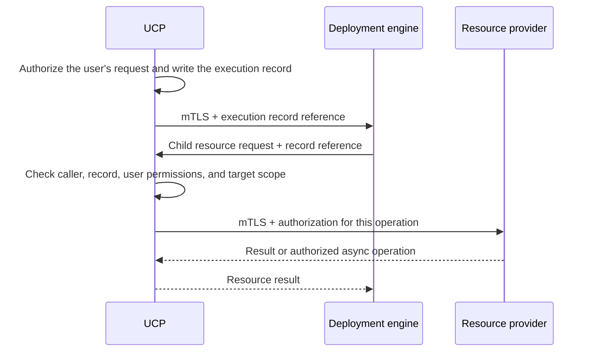

# Radius Internal Component Authorization and Secure Communication

- **Author**: [@sk593](https://github.com/sk593)

## Overview

This design describes authorization and secure communication *between Radius components*. Today Radius largely trusts its internal services: a request that appears to come from another Radius component is treated as legitimate. This design gives each component a verifiable identity, limits what each may do, and keeps a user's authorization intact as work moves between services during a deployment.

**RBAC (role-based access control)** answers three questions: who is making the request, what are they allowed to do, and where does that permission apply? This document applies those questions to internal callers — services, controllers, and background workers — rather than end users.

## Motivation

Radius runs several cooperating services, and a deployment fans out into many follow-on requests handled by different components. As Radius is used for production applications across multiple teams, this creates needs the current model does not meet.

- **Verifiable component identity and least privilege.** Internal services largely trust one another and can hold more platform and cluster authority than any single task requires. Components should prove their identity to each other and act with the minimum permissions their role needs, so a single compromised component has a limited blast radius.
- **Authorization that survives the whole request path.** A user's authorization is established at the front door, but deployments continue through callbacks, controllers, and background workers that run after the original request returns. That authorization needs to travel with the work and be re-checked when it executes, rather than being lost partway through.
- **Consistent enforcement beyond the HTTP API.** Components can reach shared storage, queues, and cloud credentials directly, so an API-layer permission check is not sufficient on its own. The same separation of responsibilities must be enforced on these lower-level paths.

## Terms and definitions

- **Authentication:** verify who is calling. For internal callers, use a verified component identity rather than a self-asserted header.
- **Principal:** the component, controller, or worker acting on a request.
- **Action:** an operation on a resource type, such as reading, writing, or deleting it, or a resource-specific action such as `listSecrets`.
- **Scope:** the plane, resource group, or individual resource where an operation applies.
- **Mutual TLS (mTLS):** encrypted communication that verifies both services' identities. It does not decide what they may do.
- **Hop:** one step where work passes from one component to another, such as the deployment engine calling UCP, UCP forwarding to a resource provider, a worker taking a message from the queue, or a provider calling the data-access service or credential broker. The receiving component checks the caller and the approval at every hop.
- **Execution grant:** UCP's approval of the operations and targets for one deployment. UCP stores it as an **execution record**, and follow-on requests carry only a reference to that record, so a component can confirm the work was authorized by checking the record.

## Objectives

Extend authorization to internal calls, controllers, and asynchronous work, so the authorization decided at the front door cannot be bypassed or exceeded further inside the system.

> **Issue Reference:** #8083

### Goals

- Authenticate internal services and limit each component's authority.
- Preserve authorization across deployment callbacks, controllers, queues, and backend access.
- Restrict direct database, credential, and Kubernetes access so it cannot bypass the API checks.
- Migrate existing installations without silently broadening access.

### Non goals

- The user-facing role model (role definitions and assignments). That is a separate design; this document assumes UCP already produces an authorization decision for a user's request and focuses on carrying and enforcing it internally.
- Human authentication beyond Kubernetes.
- Application-level authorization or replacing Kubernetes RBAC, Azure RBAC, or AWS IAM.
- Hard isolation from the host cluster administrator.

### User scenarios (optional)

#### User story 1

As a platform engineer, I want a compromised or buggy component to be unable to perform work no user authorized, even if it can open a network connection to another service.

#### User story 2

As a platform engineer, I want a deployment's follow-on work — child resources, recipes, controllers, and queued operations — to stay within exactly what the original request was allowed to do.

## User Experience (if applicable)

These changes are invisible to a developer using Radius: the same `rad deploy` and application templates continue to work when the caller is authorized. The exception is a template that creates cluster-wide Kubernetes objects directly; those objects must move into a recipe registered to the environment (see [Components that run recipes](#components-that-run-recipes)). The difference is internal — each service now proves its identity and every follow-on request carries the approval it was issued. Operators see new configuration for service certificates, controller namespace mappings, and the recipe identity's Kubernetes permissions, covered under Implementation Details.

## Design

### High Level Design

A user request enters through Kubernetes and UCP, which decides whether the user may perform the operation. This design begins where that decision ends: UCP records the decision as an **execution grant**, stored server-side as an execution record, and passes a reference to it inward. Every downstream component authenticates its caller and confirms that the requested work falls within the recorded approval before acting.

Two problems are addressed together:

- **Who is calling?** Services identify each other with mutual TLS instead of trusting caller-supplied identity headers.
- **Is this work approved?** Each follow-on request refers to an execution record that names the approved operations and targets, so a component never has to re-derive the user's permissions or take a service's word for it.

The external deployment engine must support this internal protocol before enforcement can be enabled.

### Architecture Diagram

UCP records a bounded execution grant, then checks every later resource request against that record:

### Detailed Design

#### Verify callers and restrict component permissions

**Today.** When a user deploys, the Kubernetes API server authenticates the user and forwards the request to UCP through API aggregation. UCP terminates TLS but does not request or verify a client certificate from the API server, so it cannot cryptographically confirm that the caller is the aggregation proxy. Rather than trusting forwarded identity headers, UCP strips the `x-remote-user`, `x-remote-group`, and `x-remote-extra-*` headers from incoming requests. Calls between Radius services are not mutually authenticated: a service treats a request that reaches it as coming from a trusted peer, and a resource provider does not verify which component called it or whether the work was approved for a specific user.

**Proposed.** UCP verifies the Kubernetes API server's client certificate before trusting the user and group names in the forwarded headers, so an application cannot impersonate the user; the trusted certificate authority and proxy names come from Kubernetes's aggregation configuration. This is new behavior — it replaces today's header-stripping with authenticated proxy identity — and requires configuring client-certificate verification on the UCP endpoint that serves aggregated requests.

Calls between Radius services use mutual TLS: each service has its own auto-renewing certificate, so UCP can tell the deployment engine from Dynamic RP, and no service can obtain another's certificate or service account. Each certificate carries DNS Subject Alternative Names (SANs) that all name the same service, such as `applications-rp`, `applications-rp.radius-system`, and `applications-rp.radius-system.svc`, so clients can reach it by any of its usual DNS names. The canonical form `<service>.<namespace>.svc`, for example `applications-rp.radius-system.svc`, is the component's identity wherever this design compares callers, including the record's `submitter` and each operation's `assignedComponent`. Services ignore other certificate fields, such as the subject common name, for authorization. Identifying a component is not enough — the receiving service still checks what that component may do. The deployment engine, for example, can submit operations for an approved deployment but cannot assign itself an administrator role.

UCP makes the user-facing decision, so resource providers need only verify that an authorized caller sent the request and that the work was approved — not the user's original headers or role logic. Identity can travel with the approval for logging, but identity alone is not permission.

Serve Kubernetes-forwarded and internal requests on separate UCP endpoints so each applies the right authentication.

##### Options for component identity

How a component proves who it is drives the rest of the design. Four realistic options:

All of these options except ServiceAccount tokens are mTLS-based and therefore require a certificate authority to issue and rotate the per-service certificates — cert-manager runs one, SPIRE acts as one, and a service mesh runs its own. Only the ServiceAccount token option avoids a certificate authority, because it reuses the Kubernetes API server's token signing as its trust root instead.

| Option                                        | How it works                                                                                                                                                                                  | Trade-offs                                                                                                                                                                                       |
|-----------------------------------------------|-----------------------------------------------------------------------------------------------------------------------------------------------------------------------------------------------|--------------------------------------------------------------------------------------------------------------------------------------------------------------------------------------------------|
| Projected ServiceAccount tokens + TokenReview | Each pod presents its short-lived, audience-bound Kubernetes ServiceAccount token; the receiver validates it through the Kubernetes `TokenReview` API.                                        | No new PKI and reuses identities Radius already has, but every validation depends on the API server being reachable and fast, and it only covers HTTP calls, not direct storage or queue access. |
| cert-manager-issued X.509 (mTLS)              | An in-cluster certificate authority (for example cert-manager) issues one certificate per service with the service identity in the certificate. Services present it on every mTLS connection. | Standard mTLS that verifies **offline** against the CA and also protects non-HTTP paths; Radius must run and rotate a CA.                                                                        |
| SPIFFE/SPIRE workload identity                | SPIRE attests each workload and issues a short-lived SPIFFE identity (X.509 or JWT).                                                                                                          | Purpose-built for workload identity and portable across clusters and clouds, but adds a component to operate.                                                                                    |
| Service-mesh mTLS (Istio, Linkerd)            | A sidecar mesh transparently establishes mTLS between pods.                                                                                                                                   | No application code change, but forces a mesh dependency on every Radius install and still needs an application-level authorization check on top.                                                |

**Recommendation:** issue one X.509 identity per service through an in-cluster CA (cert-manager) and require mTLS on all internal connections. It verifies offline, needs no per-call dependency on the Kubernetes API server, and — unlike a service mesh — does not impose a mesh on users. Name **SPIFFE/SPIRE** as the growth path if Radius's own components are hosted across multiple clusters or clouds and must attest each other's identity across that boundary — not merely deploying to remote targets. Do not mandate a service mesh.

##### Issuing and protecting service identities

Radius does not use cert-manager today: the Helm chart generates the UCP and controller webhook certificates itself (`genCA` and `genSignedCert`), each with its own CA, a 10-year lifetime, no rotation, and the key stored in a Kubernetes Secret. This design makes **cert-manager a new prerequisite** for Radius installations, so that every service gets its own certificate from one Radius CA and certificates rotate automatically. Whether Radius installs cert-manager or requires it on the cluster already is an [open question](#open-questions).

mTLS is only as strong as the rule that one service cannot obtain another's certificate. With cert-manager, anyone who can create a `Certificate` or `CertificateRequest` for the Radius issuer, or read the Secret that holds a service's private key, can act as that service. The design therefore requires:

| Concern                       | Requirement                                                                                                                                                                                                                                                                                                                                                                                                                           |
|-------------------------------|---------------------------------------------------------------------------------------------------------------------------------------------------------------------------------------------------------------------------------------------------------------------------------------------------------------------------------------------------------------------------------------------------------------------------------------|
| A dedicated issuer            | A Radius-only CA and `Issuer` in the Radius namespace, not a cluster-wide `ClusterIssuer` shared with other workloads. Receivers trust only this CA for internal calls.                                                                                                                                                                                                                                                               |
| Who can request a certificate | No Radius component has permission to create or update `Certificate`, `CertificateRequest`, or `Issuer` objects. The Helm chart creates one `Certificate` per service. A policy on certificate requests, such as cert-manager's approver-policy, approves only the expected DNS SANs for each service and denies all other requests to the Radius issuer.                                                                             |
| Where private keys live       | Keys are stored in Kubernetes Secrets by default. No Radius component may read Secrets in the Radius namespace other than those it needs, restricted by `resourceNames`, and none may read another service's key. The cert-manager CSI driver, which generates each key inside the pod so it is never stored in a Secret, is optional hardening that operators can enable; it is another component to install, so it is not required. |
| Which identities are valid    | A receiver accepts only certificates from the Radius CA whose DNS SANs all name the same Radius component from a fixed list, and maps them to that component's canonical `<service>.<namespace>.svc` name. A certificate with no SAN, a SAN outside the list, or SANs naming two different components is rejected, even if the chain is valid.                                                                                        |
| Rotating the CA               | Distribute trust through a bundle (for example trust-manager). Add the new CA to the bundle before issuing from it, reissue every service certificate, then remove the old CA.                                                                                                                                                                                                                                                        |
| CA compromise                 | Treat as a full incident: replace the CA as above, reissue all certificates, and revoke all active execution records, because a stolen CA key could have been used to act as any `submitter` or `assignedComponent`.                                                                                                                                                                                                                  |

#### Keep deployment authority limited

Checking the initial request is not enough: as the deployment engine creates the application's resources, its follow-on requests must stay within what the user was allowed to deploy. UCP records that approval as an **execution record** — a permission record for one deployment, not a new role. It names the user, application, target environment, the exact approved template and recipe versions, permitted operations and targets, the component allowed to submit follow-on requests, and a status.

The deployment proceeds as follows:

1. UCP authorizes the user's request, writes the execution record, and sends the deployment engine a reference to it with the deployment.
2. The engine asks UCP to create a resource and includes the record reference.
3. UCP verifies that the caller is the engine, that the record is open and covers this operation, and that the user still has permission for it. An attempt to target a different environment, such as production, is rejected.
4. UCP forwards the approved operation to the resource provider, which verifies that UCP is the caller before doing the work.

The engine cannot enlarge the grant; nested deployments, retries, and cleanup deletions all stay within the same limits. Recipes add one distinction: a user may request a database without permission to create cloud infrastructure directly. The platform team authorizes the recipe to provision it using the registered cloud credential and the recipe's Kubernetes identity, but only for that recipe's approved inputs and targets — the user cannot substitute an arbitrary template.

##### Options for the execution grant format

The grant must let a receiver confirm approval without trusting an editable header. Three realistic formats:

| Option                                   | How it works                                                                                                                                                                                                                                                                                         | Trade-offs                                                                                                                                                                                                                                                                                                                                                                                                                                                                                                                                        |
|------------------------------------------|------------------------------------------------------------------------------------------------------------------------------------------------------------------------------------------------------------------------------------------------------------------------------------------------------|---------------------------------------------------------------------------------------------------------------------------------------------------------------------------------------------------------------------------------------------------------------------------------------------------------------------------------------------------------------------------------------------------------------------------------------------------------------------------------------------------------------------------------------------------|
| Execution record referenced by ID        | UCP stores the approval as a server-side record and gives callers only its record ID. UCP checks the record for requests it routes, asynchronous workers read it from the store before each step, and the credential broker checks it before issuing a cloud token.                                  | One mechanism for synchronous and asynchronous work, and revocation takes effect on the next check. Approval checks depend on UCP and its store being available. The record is only as trustworthy as the store: a component that can write to the store can forge an approval, so this option requires store write isolation (the data-access service) to be complete. That write access is already an attack point today, so this option adds no new one. It also avoids the new risks of a signing key, bearer tokens, and delayed revocation. |
| Signed JWT (JWS) with a record for async | UCP signs a short-lived token naming the user, application, environment, allowed actions and targets, audience service, operation, expiry, and a unique ID (`jti`). Receivers verify it offline. Asynchronous work falls back to a server-side record keyed by the `jti`, because the token expires. | Receivers can check approval without UCP, but it needs two mechanisms, signing-key rotation, and rules to tell retries from replays. Revoking before expiry relies on short lifetimes.                                                                                                                                                                                                                                                                                                                                                            |
| Macaroons                                | A bearer token with caveats that any holder can **narrow** without contacting UCP, so the engine can derive a tighter grant for a child deployment itself.                                                                                                                                           | Delegation and attenuation are built in, but the format is less familiar, has fewer mature libraries, and lets holders other than UCP decide what a child grant allows.                                                                                                                                                                                                                                                                                                                                                                           |

**Recommendation:** make the **execution record** the only authority, referenced over mTLS by its record ID and the operation ID of the current unit of work. This choice fits how requests already move through Radius:

- **Radius resource requests** from the deployment engine already go through UCP, so UCP checks the record before forwarding with no extra network call. Resource providers only need to confirm through mTLS that UCP is the caller.
- **Asynchronous workers** already read and write operation state in the store on every step, so checking the record adds one read, not a call to UCP.
- **Cloud resources in a template** are created directly with the cloud provider rather than through UCP. For those calls, the credential broker checks the record before it issues a token, and the cloud provider enforces the registered credential's permissions on each call. A token already issued stays valid until it expires, so its lifetime sets how quickly a revocation reaches cloud calls.

> [!IMPORTANT]
> The execution record is only as trustworthy as the store that holds it. Any component that can write to that store could forge an approval, so only UCP may create, update, or close records. Store write isolation — the data-access service described under [Permissions outside the HTTP API](#permissions-outside-the-http-api) — is a required part of this design. Components already have this write access today, so the record does not add an attack point; store isolation closes it.

The record names the component allowed to submit requests under it (`submitter`, usually the deployment engine), and each operation names the component UCP routed it to (`assignedComponent`). Checks compare those names with the caller's mTLS certificate, so a record ID or operation ID that leaks is not usable by another component. For nested deployments, the engine asks UCP to record a narrower child approval rather than deriving one itself, so UCP stays the single authority on what each grant permits.

**Where checks happen and how quickly a revocation applies.** Only UCP decides whether the user still has permission for an operation, because only UCP holds the user's authorization. Other components check only the record and operation: that both are open, and that the caller is the component named on them. When a user loses permission, UCP marks the affected execution records as revoked. The maximum delay depends on the path:

| Path                                     | Where the check happens                                                                                    | Maximum revocation delay                                                                                                                            |
|------------------------------------------|------------------------------------------------------------------------------------------------------------|-----------------------------------------------------------------------------------------------------------------------------------------------------|
| Radius requests routed through UCP       | UCP checks the user's permissions and the record on every request.                                         | None. The next request is checked against the user's current permissions.                                                                           |
| Asynchronous worker steps                | The worker checks the record's status before each step.                                                    | The time UCP takes to mark affected records as revoked. The next step sees the revoked status.                                                      |
| Direct cloud calls with a brokered token | The broker checks the record before issuing a token, and the cloud provider checks the token on each call. | The token's lifetime at most: as short as 15 minutes on AWS, typically about an hour on Azure. This is the only path where a revocation is delayed. |

**Approval identity and operation identity.** The design uses two identifiers, and they are never interchangeable:

- The **record ID** identifies an approval: one per approved deployment, plus one for each narrower approval UCP records for a nested deployment. Only UCP writes the execution record. Its status moves from active to closed or revoked, and both are final. Each record also has a hard expiry (`expiresAt`) that UCP sets when it creates the record and never extends, so no record can stay active indefinitely. UCP normally closes the record when the deployment finishes; the hard expiry is a backstop if a deployment hangs or UCP fails to close it, and a deployment that runs past it must be resubmitted under a new record. Once the record expires the credential broker stops issuing cloud tokens: on AWS each token also ends by `expiresAt`, but on Azure, where Entra sets the token lifetime, a token issued shortly before expiry can outlive the record. Revocation or expiry stops new steps without undoing completed cloud changes, and cancellation and cleanup use narrowly limited permissions.
- The **operation ID** identifies one unit of work under a record, such as a resource operation or a queued step. Radius already assigns an operation ID to each asynchronous operation. Each operation belongs to exactly one record. Its status moves from queued to running to succeeded, failed, or cancelled, and the last three are final.

Three rules follow from this split:

1. **A retry is the same operation.** Retrying or redelivering a step reuses its operation ID, so it resolves to the same stored operation and its existing status. A retry never creates a new operation or a new record.
2. **A unique ID does not prevent duplicate execution; the claim does.** Before running a step, a worker claims the operation by changing its status to running with a conditional write, using the store's existing ETag-based concurrency control. If another worker already claimed it, the write fails and the worker stops. Handlers must still be idempotent, because a worker can crash after changing cloud state but before recording the result.
3. **Nothing is renewed or reopened.** Records and operations have no renewal. A closed or revoked record, and a succeeded, failed, or cancelled operation, never return to an active state. Work after a revocation or cancellation needs a new approval from UCP, which creates a new record ID. A worker may extend the lease on a queue message it is running, which the queue already supports, but that only prevents redelivery; it does not extend the approval or revive a finished operation.

For asynchronous work, the queue message carries the record ID, the operation ID, and a hash of the approved inputs. The worker checks both statuses before each step, which is how it separates a retry from a duplicate or a replay. The table below lists what the worker may find when it picks up a message and what it does in each case: only a first delivery or a genuine retry runs the step, a duplicate returns the stored result, and everything else is rejected.

| State found by the worker                                                                                         | Meaning                                                          | Worker action                                              |
|-------------------------------------------------------------------------------------------------------------------|------------------------------------------------------------------|------------------------------------------------------------|
| Record closed, revoked, or past `expiresAt`, operation cancelled, or queue-wait limit passed                      | The approval or the work is no longer valid.                     | Reject without running.                                    |
| Operation succeeded or failed                                                                                     | Duplicate delivery or a late resend.                             | Return the stored result without running the step again.   |
| Operation running and its lease still held                                                                        | Another worker is running this step.                             | Stop without running.                                      |
| Operation queued, or running with an expired lease                                                                | First delivery, or a previous attempt crashed or lost its lease. | Claim the operation with a conditional write, then run it. |
| Unknown record or operation ID, operation not under that record, wrong assigned component, or input hash mismatch | A forged, altered, or misdirected message.                       | Reject.                                                    |

#### Permissions per component

Each component gets two kinds of permission, and they are chosen differently:

- **Standing permissions** are fixed per component and describe which parts of the Radius control plane it may call: which UCP routes, resource types, operations, and backends. They do not change between deployments, so they form a short list that can be reviewed with each release.
- **Per-deployment permissions** come from the execution grant and describe what one deployment may create or change. They vary with every request and are never written into a component's standing list.

A request succeeds only when both allow it: the caller's standing permissions allow the call, and the grant covers the target.

| Component                                  | Standing permissions                                                                                                                                                            | Not permitted                                                                                   |
|--------------------------------------------|---------------------------------------------------------------------------------------------------------------------------------------------------------------------------------|-------------------------------------------------------------------------------------------------|
| UCP                                        | Authorize user requests, issue and validate grants, route operations to resource providers, and manage its own plane and resource-group records.                                | Do resource provider work itself or use cloud credentials directly.                             |
| Deployment engine                          | Submit resource operations to UCP that reference a grant, read their results, and apply Kubernetes resources under the identity for that step (application template or recipe). | Call resource providers directly, assign roles, or access state stores or credentials directly. |
| Applications RP                            | Handle operations on its own resource types when UCP forwards them, and read and write its own records.                                                                         | Handle other providers' resource types or issue grants.                                         |
| Dynamic RP and portable resource providers | Handle operations on the resource types registered to them, and run the approved recipe using a credential the broker issued.                                                   | Choose their own cloud credentials or create resources outside the grant's environment scope.   |
| Controller                                 | Reconcile Radius objects in its mapped namespaces by submitting operations to UCP.                                                                                              | Target resource groups or environments outside its namespace mapping.                           |
| Asynchronous workers                       | Run the queued operation types assigned to them after re-validating the execution record.                                                                                       | Run other operation types, or run a step whose execution record is missing or closed.           |
| UCP initializer                            | Write built-in resource definitions at startup under a dedicated administrative permission.                                                                                     | Run after startup or serve requests.                                                            |

##### Components that run recipes

Dynamic RP and the portable resource providers are the hard case. The platform team chooses each recipe template, and a template can create almost any cloud or Kubernetes resource. A per-provider list of allowed resource types would either be too broad to mean anything or would break legitimate recipes. So the design does not limit what a recipe creates with a per-component list. It uses three limits the platform team already controls:

1. **Which recipe runs.** The recipe pack registered to the environment decides which template fulfills a resource type. The grant fixes the approved recipe and inputs, so neither a user nor a compromised provider can swap in a different template.
2. **Where resources can be created.** The grant names the target environment, and the environment defines the cloud scope (for example, an Azure resource group or an AWS account and region) and the Kubernetes namespace. UCP rejects requests outside that scope.
3. **What the identity allows.** The credential broker issues short-lived tokens from the registered cloud credential, only for the environment's scope. The cloud RBAC or IAM permissions on that credential set the upper limit on which resource types can be created. On Kubernetes, the RBAC bound to the recipe identity sets the same limit. The platform team sets these limits when it registers the credential and binds the recipe identity, as it would for any automation identity.

The provider's standing permission is "run the approved recipe for a granted deployment with a credential the broker issued." What that recipe can create depends on the environment's scope, the registered credential's cloud permissions, and the recipe identity's Kubernetes RBAC. The platform team reviews those limits; Radius does not maintain a list for each service. Platform teams that want a tighter limit can restrict the credential's cloud role or the recipe identity's RBAC to specific resource types.

Most deployments touch only a single namespace, but some need cluster-wide Kubernetes objects such as custom resource definitions. Resources in a developer's application template, including those created through the Bicep Kubernetes extension, run under a Kubernetes identity limited to the target namespace. Cluster-wide objects come only from recipes registered to the environment, which run under a separate Kubernetes identity; the execution record's pinned recipe decides which identity a step uses. The platform team's RBAC binding for the recipe identity on the target cluster sets the limit on what recipes can create. It defaults to broad access so existing recipes keep working, and platform teams can narrow it to the kinds their recipes need.

#### Controllers and asynchronous work

The Radius controller acts on Kubernetes object changes, not the user's authenticated request, so without a restriction a user could create an object that tells the controller to change another team's resources. Today there is no such restriction: the controller takes the environment name from the `radapp.io/environment` annotation or the `Recipe` object's `spec.environment`, looks it up in `/planes/radius/local`, and creates the resource group `<environment>-<application>` (`pkg/controller/reconciler/util.go`), so any namespace can target any environment. This design adds a new namespace mapping: an administrator maps each namespace to the resource groups and environments it may target, and the controller enforces that mapping plus the source object's ID and ownership before acting — for example, a development namespace cannot select the production environment. Existing installations need these mappings before enforcement.

##### Controller authority

Controller objects (`Recipe`, `DeploymentTemplate`, and annotated Kubernetes `Deployment` objects in `pkg/controller/reconciler`) do not come from a request UCP approved, and objects created through GitOps are written by a tool's service account, not by the user. The controller also calls UCP today without credentials (`AnonymousCredential`). The design therefore bases controller authority on the namespace, not on the person who created the object:

- **Where authority comes from.** Kubernetes RBAC decides who may create Radius objects in a namespace. The administrator's namespace mapping decides what that namespace may target. Together they are the approval.
- **How it becomes a record.** The controller authenticates to UCP with its own mTLS identity. For each reconcile, UCP creates an execution record with the controller as `submitter`, the namespace as `subject` (for example `namespace:team-a`), and `actions` and `targets` limited to the intersection of the mapping and what the object asks for. The rest of the design then applies unchanged. An admission webhook may record the user who created or last changed the object for auditing, but that is not used for authorization.
- **When a mapping narrows or is removed.** UCP revokes active records for that namespace that fall outside the new mapping, and the controller stops starting new reconciles for objects outside it. Resources already deployed are not deleted automatically, because that would be destructive. The object gets a status condition showing that it is outside its scope, and the administrator decides what to clean up.
- **Deletion and finalizers.** Deleting an object gets a delete-only record limited to the resources UCP recorded as created by earlier records for the same object (matched by the object's UID), not the IDs in the object's status, which a user could edit. This applies even if the mapping has since narrowed, because cleaning up is narrower than creating. If UCP is unavailable, the finalizer stays and deletion waits (fail closed); an administrator can remove the finalizer manually.
- **Cross-scope references.** An object may reference environments, recipes, and resources only within its namespace's mapping. References outside it are rejected at reconcile, before any change starts.

#### Permissions outside the HTTP API

Checking UCP requests does not help if a service can make the same change by writing directly to the database. Storage, queues, cloud credentials, and Kubernetes permissions must enforce the same separation of responsibilities.

| Access path               | How it must be restricted                                                                                                                                                                                                                                                                                                                                                                                                                                         |
|---------------------------|-------------------------------------------------------------------------------------------------------------------------------------------------------------------------------------------------------------------------------------------------------------------------------------------------------------------------------------------------------------------------------------------------------------------------------------------------------------------|
| Resource state and queues | A provider may change only the resources of a deployment it is currently approved to work on, not every resource of the types it owns. Writes go through a data-access service that checks the execution record; providers lose direct write access to the store.                                                                                                                                                                                                 |
| Cloud credentials         | A component may use a credential for an approved deployment without being allowed to retrieve every stored credential. Short-lived tokens still need limited cloud permissions; a short lifetime alone is not enough.                                                                                                                                                                                                                                             |
| Kubernetes workloads      | Application deployments must not create pods using control-plane service accounts or read unrelated Secrets. Namespace-scoped RBAC is not enough for this, so admission controls enforce which service accounts, Secrets, and pod security settings application templates may use (see [Admission controls for application workloads](#admission-controls-for-application-workloads)). Installation and Kubernetes-managed pod replacement must continue to work. |
| Startup registration      | UCP's initializer writes built-in resource definitions directly to storage. Give this startup task specific administrative permission rather than leaving it outside the authorization model.                                                                                                                                                                                                                                                                     |

##### Options for storage and credential isolation

The table above states the requirement; two decisions need concrete mechanisms.

For **resource state and queues**:

| Option                          | How it works                                                                                                                                        | Trade-offs                                                                                                                                                                                                                                              |
|---------------------------------|-----------------------------------------------------------------------------------------------------------------------------------------------------|---------------------------------------------------------------------------------------------------------------------------------------------------------------------------------------------------------------------------------------------------------|
| Per-component store credentials | Each provider connects with its own database/queue credentials scoped to the records and queues it owns (separate schemas, tables, or namespaces).  | Enforced by the store itself with no extra hop, but it isolates providers, not deployments: a compromised provider can still change any deployment's resources of the types it owns. It also only works where the store can express per-caller scoping. |
| Shared data-access service      | Providers stop connecting to the store directly and go through one internal service that checks the caller and the execution record on every write. | Isolates deployments, not just providers, works even when the store cannot scope access, and keeps the rule in one place, but adds a service on the hot path.                                                                                           |

**Recommendation:** route all provider access to resource state through a **shared data-access service**, and remove providers' direct store credentials. Per-component credentials alone are not enough, because isolating providers is not the same as isolating deployments.

The data-access service allows a write only when all of the following hold:

1. The write names an operation, and the caller's certificate identity equals that operation's `assignedComponent`.
2. The operation's record is active and not past `expiresAt`.
3. The resource being written is the operation's `resourceId`, and the change matches its `action`.
4. The operation is open. For asynchronous work, the caller must also hold the operation's lease.

A compromised provider can therefore change only the resources of deployments that are currently active and assigned to it, and only while it is working on them. It cannot change another team's deployment, a finished deployment, or a resource outside the approved targets. UCP's own writes, including execution records, and the startup initializer use separate administrative permissions.

Reads are limited by component, not by deployment: a provider may read the resource types it owns and the resources its approved deployments connect to. Deployment-level read limits would break connections between applications, and user-facing reads already go through UCP's checks. Queues use per-component queues and credentials over authenticated, encrypted connections, because a worker validates every message against the execution record before running it.

For **cloud credentials**:

Users set up their cloud identity and its permissions before using Radius — an Azure service principal or workload identity with Azure RBAC role assignments, or an AWS IAM role or access key with IAM policies — and register it with `rad credential register`. Radius never creates or widens those permissions. Today every component that needs cloud access resolves the registered credential itself.

| Option                                       | How it works                                                                                                                                                             | Trade-offs                                                                                               |
|----------------------------------------------|--------------------------------------------------------------------------------------------------------------------------------------------------------------------------|----------------------------------------------------------------------------------------------------------|
| Credential broker issuing short-lived tokens | Only the broker uses the registered credential. For an approved deployment, it issues a short-lived token based on that credential. Components never see the credential. | A leaked token is short-lived and usable only for approved work, but Radius runs and secures the broker. |
| Components use the credential directly       | Each component that needs cloud access resolves the registered credential itself, as today.                                                                              | Simpler, but every such component holds the full credential, so a compromise of any one exposes it.      |

**Recommendation:** issue **short-lived tokens through a credential broker**. The broker issues a token only after it checks that the execution record and operation are open, that the caller is the operation's `assignedComponent`, and that the requested scope is inside the environment's scope. A token can never do more than the user's registered credential allows. On AWS, the broker can narrow it further to the deployment's approved targets with an STS session policy; on Azure, a token carries all of the registered identity's permissions, so the user's role assignments are the limit.

##### Admission controls for application workloads

Limiting application templates to one namespace does not limit what the pods they create can do. Anyone who can [create a pod](https://kubernetes.io/docs/concepts/security/rbac-good-practices/#workload-creation) in a namespace can mount any Secret there, run the pod as any service account there, and request privileged settings. Radius containers also accept user-supplied base manifests and pod patches that reach the pod spec (`pkg/corerp/renderers/container`). The Kubernetes API server must therefore enforce these rules at admission, independent of Radius:

| Control                 | Mechanism                                                                                                       | Rule for application templates                                                                                                                                                                                                                                                                                                                                                                                                                                                                               |
|-------------------------|-----------------------------------------------------------------------------------------------------------------|--------------------------------------------------------------------------------------------------------------------------------------------------------------------------------------------------------------------------------------------------------------------------------------------------------------------------------------------------------------------------------------------------------------------------------------------------------------------------------------------------------------|
| Pod security level      | [Pod Security Admission](https://kubernetes.io/docs/concepts/security/pod-security-admission/) namespace labels | Application namespaces enforce `baseline` by default, which blocks privileged containers, host namespaces, `hostPath` volumes, and added capabilities. Operators may raise this to `restricted`. Recipes that need privileged workloads deploy them into namespaces the platform team labels for that purpose.                                                                                                                                                                                               |
| Service accounts        | `ValidatingAdmissionPolicy`                                                                                     | A pod's `serviceAccountName` must be none, the service account Radius created for that container, or a service account defined by the same application, for example in its base manifest. The provider checks this before applying; the admission policy rejects service accounts outside the application's naming prefix as a backstop. Radius control-plane and other applications' service accounts are always rejected. Service account tokens are mounted only when the container's identity needs one. |
| Secret references       | `ValidatingAdmissionPolicy`, plus a provider check before applying                                              | Secret volumes, projected volumes, `envFrom`, and `secretKeyRef` may name only Secrets owned by the same application, including Secrets defined in its base manifest. The provider checks references against the operation's approved inputs; the admission policy rejects names outside the application's naming prefix as a backstop.                                                                                                                                                                      |
| Who can relax the rules | Kubernetes RBAC on the policies and namespace labels                                                            | The Radius Helm chart installs the policies and Pod Security labels. The application-template identity cannot edit admission policies or change Pod Security labels on namespaces, so it cannot turn the controls off. The recipe identity can do so only if the platform team's RBAC allows it, as the broad default does.                                                                                                                                                                                  |

The admission policies match requests from the application-template identity only, so they do not affect recipes or other workloads in the cluster. Recipes are platform-provided, so the recipe identity's RBAC limits them instead. Because an admission policy can compare names but not look up who owns a Secret or service account, Radius must not place control-plane Secrets or service accounts, or another application's, in an application namespace.

Until these direct access paths are restricted, a compromised provider may still make unauthorized changes even if all its HTTP connections use mTLS.

#### Advantages (of each option considered)

Letting UCP record an approval that other components check means providers confirm approved work rather than independently deciding what every user role means. Mutual TLS plus a per-deployment execution record contains a compromised component: it can act only as itself and only on operations assigned to it. Because the data-access service checks the same record, that limit also applies to resource state, so a compromised provider cannot change deployments it is not working on. Direct Kubernetes access is limited by identity (application template or recipe), not per deployment (see [Open Questions](#open-questions)). Using one record for synchronous and asynchronous work avoids token expiry problems and makes revocation take effect on the next check.

#### Disadvantages (of each option considered)

Radius must operate more security infrastructure: service certificates, the execution record store, the data-access service, the credential broker, and re-checks for background work. Every provider write gains a hop through the data-access service. Approval checks depend on UCP and its store being available, and failures in those systems can stop deployments, so recovery needs testing. Simpler alternatives reduce this operational work but leave requests between components insufficiently restricted.

#### Proposed Option

Give each service an X.509 identity from an in-cluster CA and require mTLS on all internal connections. Have UCP store each approved deployment as an execution record and pass only its record ID inward, with an operation ID for each unit of work. UCP checks the record for the requests it routes, asynchronous workers check it before each step, and the credential broker checks it before issuing a short-lived cloud token. Route provider writes to resource state through a data-access service that checks the same record, so a provider can change only deployments currently assigned to it and only UCP can write execution records — as part of the same effort, not a substitute for the API checks. Run application-template resources under a namespace-limited Kubernetes identity, and let only registered recipes create cluster-wide objects, under a recipe identity whose RBAC the platform team controls.

### API design (if applicable)

Internal service-to-service calls need to carry the authorization decision inward so downstream components do not re-derive it. Add an **execution record reference** to the internal request contract between components. Per the [Detailed Design](#options-for-the-execution-grant-format), the reference is a record ID plus the operation ID of the current unit of work, and the authority is the server-side execution record that UCP owns.

The execution record holds at least these fields, and a check rejects the request if any condition fails:

| Field                        | Purpose                                                                                                                                                                               | Check                                                                                                                                |
|------------------------------|---------------------------------------------------------------------------------------------------------------------------------------------------------------------------------------|--------------------------------------------------------------------------------------------------------------------------------------|
| `recordId`                   | Identifies the approval.                                                                                                                                                              | Must match an existing record.                                                                                                       |
| `subject`                    | The user the deployment acts for.                                                                                                                                                     | Recorded for logging, and used by UCP to re-check the user's permissions.                                                            |
| `application`, `environment` | The approved application and target environment.                                                                                                                                      | Must match the resource the request targets.                                                                                         |
| `actions`, `targets`         | The operations and resource scopes UCP approved.                                                                                                                                      | The requested operation must be listed; the target must be within scope.                                                             |
| `templateDigest`, `recipe`   | The exact template UCP approved, and the approved recipe as an immutable reference: an OCI digest for a Bicep recipe, or a pinned module version and checksum for a Terraform recipe. | The template and recipe that run must resolve to the same digest. A tag or version that now points to different content is rejected. |
| `submitter`                  | The component allowed to submit requests to UCP under this approval, usually the deployment engine.                                                                                   | Must equal the canonical DNS SAN in the caller's mTLS certificate when a request cites this record.                                  |
| `parentRecordId`             | For a nested deployment, the record it was narrowed from.                                                                                                                             | The child's `actions` and `targets` must be a subset of the parent's, and the parent must be active.                                 |
| `status`, `queueWaitLimit`   | Whether the approval is active, closed, or revoked, and how long queued work may wait.                                                                                                | Closed or revoked records are rejected. Both states are final.                                                                       |
| `expiresAt`                  | A hard cap on the record's total lifetime, set once at creation.                                                                                                                      | Never extended. Past this time the record is treated as closed, and the broker caps cloud tokens at it.                              |

Each operation under the record holds at least these fields:

| Field                  | Purpose                                                                                                                                                                                                    | Check                                                                                                                                                                    |
|------------------------|------------------------------------------------------------------------------------------------------------------------------------------------------------------------------------------------------------|--------------------------------------------------------------------------------------------------------------------------------------------------------------------------|
| `operationId`          | Identifies one unit of work. Retries reuse it.                                                                                                                                                             | Must match an existing operation under `recordId`.                                                                                                                       |
| `recordId`             | The approval this operation belongs to.                                                                                                                                                                    | Must match the record ID in the request or queue message.                                                                                                                |
| `resourceId`, `action` | The one resource and operation this unit of work covers, within the record's `targets` and `actions`.                                                                                                      | Must match the resource and operation the request, queue message, store write, or token request is for.                                                                  |
| `assignedComponent`    | The component UCP routed this operation to, for example `applications-rp.radius-system.svc`. Set by UCP from its routing table, never by the caller.                                                       | Must equal the canonical DNS SAN in the caller's mTLS certificate.                                                                                                       |
| `inputHash`            | A hash of the approved inputs for this operation: the canonical request body UCP authorized, plus the recipe reference and environment-supplied recipe parameters resolved when UCP created the operation. | Checked on both synchronous and queued paths. The request body or queued inputs must hash to the same value, so different parameters for the same resource are rejected. |
| `status`, lease        | Queued, running, succeeded, failed, or cancelled, and which worker holds the operation while it runs.                                                                                                      | Changed only by a conditional write. Succeeded, failed, and cancelled are final; completed operations return the stored result.                                          |

#### Checks at each hop

Every check follows the same rules:

- **Identity comes only from mTLS.** The caller is the component named by the DNS SANs in its verified certificate, in canonical `<service>.<namespace>.svc` form. Identity in headers or request bodies is never trusted.
- **Callers send only IDs.** A request or message carries a record ID and an operation ID. The checker reads the record and operation from UCP's store, so a caller cannot supply its own approval content.
- **Each hop has one named party.** The record names who may submit (`submitter`); each operation names who may run it (`assignedComponent`). UCP sets both; no component can reassign an operation to itself or another component.
- **Inputs are bound, not just targets.** Matching the operation and resource is not enough, because the same resource could be written with different parameters. UCP computes `inputHash` over a canonical form of the body it authorized (for example, JSON with sorted keys and no insignificant whitespace), and every hop that runs or forwards the work recomputes it. The hash lives in the protected record, so it needs no signature: only UCP can write it.
- **Fail closed.** A missing, closed, revoked, or expired record, a final operation, a mismatch, or an unreachable store rejects the work.

| Hop                                              | Checker             | Checks, all of which must pass                                                                                                                                                                                                                                                                                                                                                                     |
|--------------------------------------------------|---------------------|----------------------------------------------------------------------------------------------------------------------------------------------------------------------------------------------------------------------------------------------------------------------------------------------------------------------------------------------------------------------------------------------------|
| Deployment engine → UCP (child resource request) | UCP                 | Caller equals the record's `submitter`. Record is active and not past `expiresAt`. The request's resource and operation are within `targets` and `actions`, and match `application`, `environment`, and `recipe`. The user still has permission. UCP then creates the operation, setting `resourceId`, `action`, `inputHash`, and `assignedComponent` to the provider that owns the resource type. |
| Controller → UCP (reconcile)                     | UCP                 | Caller is the controller. The object's namespace is mapped, and the requested resources, environment, and recipe are within the mapping. UCP creates a record with the controller as `submitter` and the namespace as `subject`, then applies the same checks as a deployment engine request.                                                                                                      |
| UCP → resource provider                          | Resource provider   | Caller is UCP. The operation exists, its `assignedComponent` is this provider, its `resourceId` and `action` match the request, and the request body hashes to `inputHash`.                                                                                                                                                                                                                        |
| Queue → worker                                   | Worker              | The operation's `assignedComponent` is this component, the record is active and not past `expiresAt`, the operation is not final, and the queued inputs and recipe reference hash to `inputHash`. The worker then claims the operation with a conditional write.                                                                                                                                   |
| Provider → data-access service (write)           | Data-access service | The four write checks under [Options for storage and credential isolation](#options-for-storage-and-credential-isolation).                                                                                                                                                                                                                                                                         |
| Provider → credential broker                     | Credential broker   | Caller equals the operation's `assignedComponent`, the operation is running and the caller holds its lease, the record is active and not past `expiresAt`, and the requested scope is inside the environment and the operation's target.                                                                                                                                                           |
| Deployment engine → UCP (nested deployment)      | UCP                 | Caller equals the parent record's `submitter`, the parent is active, and the requested `actions` and `targets` are a subset of the parent's. UCP writes a child record with `parentRecordId`. Revoking or closing the parent also closes its children.                                                                                                                                             |

The follow-on-approval flow is explicit rather than open-ended:

- **UCP** writes the record after it authorizes the user's request, and is the only component allowed to create, update, or close it.
- The **deployment engine** passes the record ID on each child request. When it needs a *narrower* approval for a nested deployment, it asks UCP to record one; it never edits or widens a record itself.
- **Resource providers** (Core RP and the portable/dynamic providers) accept requests only when mTLS shows that UCP is the caller, because UCP has already checked the record — never trusting caller-supplied identity headers.
- **Asynchronous workers and the controller** store the record ID, operation ID, and input hash with the queued operation, check both statuses, and claim the operation before each step, since the original request has already returned.
- The **credential broker** checks the record before it issues a scoped cloud token.

The internal contract must distinguish "a user requested this deployment" from "the deployment engine is making this resource request on the user's behalf," and must never let a service assert another user's identity to gain that user's permissions. Exact field names and record retention are settled during implementation.

### CLI Design (if applicable)

No new user-facing CLI commands are introduced. The changes are internal to service-to-service communication. Operators configure certificates and controller namespace mappings through installation, described below, not through `rad`.

### Implementation Details

#### Enforcement entry points

The permissions described in this design are not in the code yet. Each check is added at an existing point in the request path, so every request passes through it:

| Entry point                                                                                                                          | Current role                                                                                              | Check to add                                                                                                                                                                                                                           |
|--------------------------------------------------------------------------------------------------------------------------------------|-----------------------------------------------------------------------------------------------------------|----------------------------------------------------------------------------------------------------------------------------------------------------------------------------------------------------------------------------------------|
| UCP server middleware chain (`pkg/ucp/frontend/api/server.go`)                                                                       | Wraps every UCP request with request context, logging, and path normalization.                            | Read the caller's identity from its verified certificate, then reject routes and operations outside that component's standing permissions.                                                                                             |
| UCP proxy controller (`pkg/ucp/frontend/controller/radius/proxy.go`)                                                                 | Forwards resource requests to the owning resource provider.                                               | Check the execution record before forwarding: it must be open, name the caller as its assigned component, and cover the operation and target.                                                                                          |
| ARM-RPC frontend server (`pkg/armrpc/frontend/server/server.go`)                                                                     | Builds the router for resource providers that use ARM-RPC, including an optional client-certificate hook. | Accept requests only from UCP's certificate, because UCP has already checked the execution record.                                                                                                                                     |
| Async operation message and worker (`pkg/armrpc/asyncoperation/controller/request.go`, `pkg/armrpc/asyncoperation/worker/worker.go`) | Carries the operation ID, type, and resource ID, then dequeues and runs the operation with a retry limit. | Add the record ID and approved-input hash to the message, which already carries the operation ID. Before each step, check the record and operation statuses, compare the input hash, and claim the operation with a conditional write. |
| Controller reconcilers (`pkg/controller/reconciler`)                                                                                 | Turn Kubernetes object changes into UCP requests.                                                         | Check the source namespace's mapping to resource groups and environments before submitting a request.                                                                                                                                  |
| Backend storage and queue clients (`pkg/components`)                                                                                 | Connect components to shared state and queues.                                                            | Replace direct store writes with calls to the data-access service, passing the record ID and operation ID, and give each component its own queue credentials.                                                                          |

Recipe output is not limited in Radius code. The permissions on the user's registered cloud credential set that limit, narrowed further on AWS by the broker's session policy, and the recipe identity's Kubernetes RBAC sets it on the cluster.

#### UCP (if applicable)

Add caller authentication and execution records in `pkg/ucp/frontend` and `pkg/ucp/proxy`: verify the calling service's identity, write an execution record when it forwards an authorized deployment, and check the record, caller, and target scope on every later resource request. Apply explicit permissions to startup registration as well.

#### Bicep (if applicable)

No Bicep language change is needed. Authorization information travels between services, not inside user-authored templates. The same application templates remain usable when the caller is authorized, except that cluster-wide Kubernetes objects must come from a recipe.

#### Deployment Engine (if applicable)

Update the external engine to retain UCP's approval and reference it whenever it requests a resource operation. This must work for nested deployments and retries, not only the first request. The engine also needs to run application-template resources and recipe resources under their separate Kubernetes identities.

#### Core RP (if applicable)

Add a common caller check to the shared ARM-RPC server and integrate it with `pkg/corerp`. The check runs before resource handlers change state and confirms that UCP is the caller for both legacy APIs and current `Radius.Core` resources.

#### Portable Resources / Recipes RP (if applicable)

Carry the approved deployment information through `pkg/dynamicrp`, portable providers, `pkg/recipes`, and their background workers. When selecting a recipe, verify that the selected version and parameters belong to the approved deployment.

#### Controller and shared backends

In `pkg/controller/reconciler`, check the administrator's namespace-to-Radius mapping before sending a request. In `pkg/components` and its storage implementations, prevent a component from reading or changing another component's protected data. Where the backend cannot make that distinction, route access through a service that can.

#### Clients and installation

Update SDK connections to send the required service credentials and deployment approval. Update Helm to configure certificates, service-account permissions (including the namespace-limited application-template identity and the recipe identity with its broad default binding), and network restrictions.

#### Remote target clusters

With [multi-cluster deployment](../environments/2026-06-multi-cluster.md) and [Repo Radius](../environments/2026-06-repo-radius-deploy-workflow.md), the Radius control plane runs on a different cluster from the workloads it deploys. Today a single kubeconfig for the target cluster, backed by one broadly privileged identity, is mounted into every component that deploys resources. The target cluster sees only that identity, so limits set on the control-plane cluster do not apply there. The design applies to remote targets as follows:

| Area                  | Change                                                                                                                                                                                                                                                                                            |
|-----------------------|---------------------------------------------------------------------------------------------------------------------------------------------------------------------------------------------------------------------------------------------------------------------------------------------------|
| Target identities     | Two identities on the target cluster: a namespace-limited identity for application templates and the recipe identity. On EKS these are two access entries; on AKS, two Microsoft Entra identities. The target cluster's RBAC for each sets its limit. No component impersonates another identity. |
| Access to the cluster | The credential broker issues a short-lived target-cluster token for the identity a step needs, after checking the execution record. This replaces the mounted kubeconfig and builds on the cloud-derived cluster access planned in the multi-cluster design.                                      |
| Admission controls    | The Pod Security labels and admission policies must be installed on the target cluster, matching the application-template identity, by the platform team or the deployment workflow.                                                                                                              |
| Repo Radius workflow  | Creates both target identities, installs the admission controls on the target cluster, and installs cert-manager on the temporary control-plane cluster. Execution records do not outlive a workflow run.                                                                                         |

A kubeconfig mounted into every component gives each component both identities, so a compromised component could use either. An installation that deploys to a remote cluster therefore stays in the Off stage until the broker issues target-cluster tokens.

> [!NOTE]
> Remote target support can be implemented as part of this work, but some of it depends on the cloud-derived cluster access planned as v2 in the [multi-cluster design](../environments/2026-06-multi-cluster.md). mTLS, execution records, the data-access service, and brokered cloud credentials do not depend on it and apply to remote-target installations as they do to single-cluster ones. Issuing target-cluster tokens through the broker builds on v2, so enforcement for remote targets waits until v2 is available.

### Error Handling

Error handling differs by trust boundary, because each boundary fails in a different way and has a different safe fallback. In all cases the rule is to fail closed: when Radius cannot confirm identity or authorization, it refuses the work rather than assuming it is allowed.

#### User edge (Kubernetes to UCP)

If UCP cannot verify the Kubernetes API server's client certificate, it must not trust the user and group names in the forwarded headers, because those headers are only meaningful once the proxy is authenticated. Reject the request rather than treating it as an anonymous or default-privileged user, and never read caller-supplied identity headers from an unverified connection.

#### Component to component (mTLS and grant)

An invalid TLS certificate can stop the connection before any HTTP response exists. Clients must never retry a failed authenticated connection using an unauthenticated endpoint.

If a caller is authenticated but the requested work is not covered by a valid grant, reject it rather than performing it. If Radius cannot read the user's permissions or the execution record needed to decide, return `503 Service Unavailable` rather than guessing that the request is allowed.

#### Asynchronous and in-flight work

For work already running, record the failed authorization step and stop starting new operations. Use the limited cleanup permission described earlier where needed; do not silently continue with an old or broader service permission. A worker that cannot re-validate a queued operation against its execution record — because the record is missing, closed, or its inputs no longer match the approved hash — must not run the step; distinguish a legitimate retry of the same approved work from a replayed or altered message and reject only the latter.

#### Backend state and credentials

If a component is denied direct access to a store, queue, or cloud credential it is not scoped for, that denial must be enforced at the backend and surfaced as a failure, not worked around through a broader shared identity. A failure to mint a scoped credential stops the dependent deployment rather than falling back to a standing, more privileged credential.

#### Certificate authority and rotation

If a service certificate cannot be rotated before it expires, fail closed rather than continuing on an unverifiable identity. Because certificates are issued with a lifetime longer than the rotation interval, a rotation failure first enters a grace window in which the current certificate is still valid: during that window, retry issuance with backoff and raise an operator alert, but let in-flight deployments continue and begin refusing new ones so a transient CA problem does not immediately halt the system. Once the certificate actually expires with no valid replacement, mTLS connections to and from that component must fail and its deployments stop; a component must never fall back to an unauthenticated path or accept an expired peer certificate to make progress. Recovery is operator-driven — repair the CA or issuance path, let rotation succeed, and resume — and interrupted deployments rely on the retry and re-validation behavior described for asynchronous work rather than on a weakened identity check.

### Performance

Most checks run on paths that already make network or storage calls, so the added latency per request is expected to be small:

- **mTLS** adds a handshake only when a connection is opened. Reused connections pay only encryption overhead.
- **Record checks** add one store read per routed request at UCP and per step at a worker. UCP owns the store and workers already read operation state, so neither adds a network hop.
- **The data-access service** adds one network hop and a record check to every provider write. This is the largest new cost and grows with the number of resources in a deployment.
- **The credential broker** adds one call when a component needs a cloud token, which can be reused for the rest of the operation.
- **Certificate issuance and rotation** happen in the background through cert-manager and are not on the request path.
- **Record storage** adds reads and writes to UCP's store. With the default Kubernetes API server store, that adds load on the API server.

## Test plan

Unit tests should cover verification of deployment approvals and grant-scope checks. Functional tests should exercise complete requests across services, using scenarios such as:

| Scenario                                                             | Expected result                                                |
|----------------------------------------------------------------------|----------------------------------------------------------------|
| An application sends a fake user header or calls a provider directly | It cannot impersonate a user or bypass UCP's approval.         |
| The engine uses development approval for a production resource       | UCP rejects the request.                                       |
| A controller object targets another team's resource group            | The controller rejects it before starting the change.          |
| A worker receives altered inputs or the same message twice           | It rejects the changed work and avoids duplicate effects.      |
| Permission is removed during deployment                              | New steps stop; any permitted cleanup stays within its limits. |
| A provider tries to access unrelated state or credentials            | The backend denies access, not just the HTTP API.              |

Use cluster integration tests for certificate renewal, protected service accounts, restarts, upgrades, and interrupted deployments. Include the external engine and both legacy and current resource APIs. Test recipes that create cluster-wide objects separately from namespace-limited application templates.

## Security

This design protects against an internal service requesting more work than the user was allowed to start. Verified service identities and limited deployment approvals address it.

Only UCP can create, update, or close execution records. A worker may change only the status of an operation assigned to it, through a conditional write, and cannot change the approval that operation belongs to. Other components get read access at most, through the data-access service, so checking a record never lets a component create or widen one. The data-access service checks every provider write against the record, so a compromised provider cannot change resources of deployments that are not assigned to it. Queue messages carry only the record ID, operation ID, and input hash, never user credentials. Rotate certificates without sharing private keys.

These protections depend on restricting direct infrastructure access too. An encrypted connection does not make a broadly privileged cloud token safe. Likewise, using different Radius plane names does not by itself isolate teams that share a database and credentials. The Kubernetes cluster administrator remains trusted because that administrator can change the services and their permissions. The recipe identity defaults to broad Kubernetes access, so least privilege for recipes on the cluster depends on the platform team narrowing its RBAC.

## Compatibility (optional)

The changes are internal, so a developer's workflow is unchanged, except that templates creating cluster-wide Kubernetes objects directly must move them into a recipe. However, older providers and deployment engines must be upgraded before they can participate in the new authenticated request flow; enabling checks before they are upgraded would break them. Agree on compatible versions and upgrade order. The operator must also complete the configuration this design requires, such as installing cert-manager, adding controller namespace mappings, and moving cluster-wide objects into recipes, before turning on enforcement.

Enforcement must not be bypassable by talking to an older component or an older endpoint. Rollout follows a one-way sequence per installation:

| Stage   | Behavior                                                                                                                                                                                                                                      | Exit condition                                                                                                                                        |
|---------|-----------------------------------------------------------------------------------------------------------------------------------------------------------------------------------------------------------------------------------------------|-------------------------------------------------------------------------------------------------------------------------------------------------------|
| Off     | Current behavior. The first release with this design ships here.                                                                                                                                                                              | All components, including the deployment engine, run a version that supports the protocol, and the operator has completed the required configuration. |
| Enforce | Every internal listener requires a verified client certificate. Plain HTTP and TLS-without-client-certificate listeners are removed from the configuration, not just left unused. Requests without a record ID and operation ID are rejected. | Terminal. A later release removes the legacy listeners and code paths entirely.                                                                       |

Rules that prevent a downgrade:

- **No per-connection fallback.** A component never retries without a certificate, or without a record ID, when a check fails. There is no negotiation that lets a peer choose the older behavior.
- **Enabling enforcement is gated.** UCP enables it only when every registered component reports protocol support.
- **Moving back is an audited administrator action.** Changing from Enforce to Off requires an administrator to change installation configuration, is logged, and raises an alert. Components cannot request it.
- **Version downgrades keep enforcement.** Once enforcement is on, installing a Radius version that does not support it is blocked by a pre-upgrade check in the Helm chart rather than silently turning checks off.

See [core API registration](../../pkg/corerp/setup/setup.go) and [extensibility](extensibility.md).

## Monitoring and Logging

An operator should be able to answer: "Which service attempted this step, under which grant, and why was it allowed or denied?" Each decision records the service, requested action, target resource, referenced execution record, and the result of the permission check.

Use the same deployment or operation ID in UCP, provider, and worker logs so the operator can follow the request between services. Track invalid approvals and expired certificates separately from unavailable permission or record storage. Never log credentials or the cloud tokens the broker issues.

## Development plan

Internal authentication must be available when user checks are enforced elsewhere; otherwise callers could avoid those checks by connecting directly to a provider.

| Stage                                  | Deliverable and exit condition                                                                                                                                                                                                                                 |
|----------------------------------------|----------------------------------------------------------------------------------------------------------------------------------------------------------------------------------------------------------------------------------------------------------------|
| 1. Identify and authenticate callers   | Document existing service calls and direct backend access. Add verified Kubernetes and component connections, including the external engine. Keep these checks off until every component supports them.                                                        |
| 2. Carry permissions through execution | Add execution grants for engine callbacks and queued work, component permission checks, and controller namespace mappings. Test retries and recovery before enforcing these checks.                                                                            |
| 3. Restrict remaining direct access    | Enforce database and credential separation, and run application templates under a namespace-limited Kubernetes identity and recipes under the separate recipe identity. Verify that a compromised provider cannot use these paths to avoid the earlier checks. |

This is a dependency plan, not a claim that each intermediate stage provides complete isolation. Approval for deployment steps and checks on background work must be ready before promising end-to-end authorization. Any unauthenticated local debugging option must be explicitly enabled and accept connections only from the local machine.

## Open Questions

The Detailed Design proposes a specific option for each major decision; what remains are the narrower details to settle during implementation.

**Q: Which CA issues service certificates, and how are they rotated?**

**A:** The design proposes an in-cluster CA (cert-manager) issuing one X.509 identity per service. cert-manager is a new dependency: Radius does not use it today. Remaining: whether Radius installs cert-manager as part of `rad install` or requires it on the cluster in advance (as with other prerequisites); which cert-manager versions are supported; whether to also require trust-manager for CA bundle distribution and approver-policy for certificate request approval, or implement those checks another way; how existing installations move from the Helm-generated certificates; whether cert-manager can be disabled for local development (for example k3d or kind clusters used by contributors), which the design recommends deferring to a follow-up rather than including in the initial design, because a mode without cert-manager would also run without mTLS and needs its own safeguards so it cannot be enabled in production; the rotation interval; and whether SPIFFE/SPIRE is adopted now or kept as the cross-cluster growth path.

**Q: What are the execution record's limits and retention?**

**A:** The design makes the server-side execution record the only authority. The hard expiry (`expiresAt`) will default to 24 hours for now, in line with existing component timeouts: Dynamic RP allows an asynchronous operation up to 24 hours, UCP allows 12 hours for background processing of tracked resources, and the portable resource providers allow up to 60 minutes. A shorter default could cut off a deployment that Radius would otherwise let finish. The expiry is a backstop, because UCP normally closes the record when the deployment finishes and revokes it when the user loses permission. Remaining: whether operators can lower the expiry, whether to later derive it per deployment from the timeouts of the operations it contains, the queue-wait limit, how long closed records are kept for auditing, and the credential broker's token lifetime (which sets how quickly a revocation reaches direct cloud calls).

**Q: How will the deployment engine and other providers adopt these checks?**

**A:** Agree on compatible versions and upgrade order. The engine still needs an explicit design for running application templates and recipes under separate Kubernetes identities.

**Q: Which storage and credential mechanism applies to each backend?**

**A:** The design routes all provider access to resource state through a data-access service that checks the execution record on writes, gives each component its own queue credentials, and uses a credential broker for short-lived cloud tokens. Remaining: where the data-access service runs (inside UCP or as a separate service), its latency budget, and who operates the broker. Radius registers one credential per cloud for the whole installation, so all environments share it; whether to support a separate credential per environment, so a deployment to one environment cannot use another's cloud permissions, is open. Direct Kubernetes access by providers such as Applications RP is still limited per component rather than per deployment; whether to route it through a similar check is open.

**Q: Does the execution record need explicit versioning?**

**A:** Not in the initial design. Callers pass only opaque record and operation IDs, so the wire contract with the deployment engine carries no approval content to version, and the nested-record API uses `api-version` like other UCP APIs. The stored record is read only by Radius components, but old and new versions read it during a rolling upgrade. Remaining: whether to add a `schemaVersion` to the record so that a checker rejects a record with restrictions it does not understand, or to rely on UCP adding new restrictive fields only after every checker is upgraded.

**Q: Which clusters can enforce the admission controls?**

**A:** `ValidatingAdmissionPolicy` is generally available from Kubernetes 1.30. Remaining: whether Radius supports older clusters, and if so whether it ships a validating webhook or relies on an existing policy engine such as Kyverno or Gatekeeper; and whether `restricted` should become the default Pod Security level.

**Q: Should recipe packs declare the resource types their recipes may create?**

**A:** Not in the initial design. The environment's cloud scope, the registered credential's cloud permissions, and the recipe identity's Kubernetes RBAC set the upper limit on what a recipe can create. A declared-types list on each recipe pack would let UCP reject a recipe whose planned output contains undeclared types. It depends on reliable plan or what-if output from both Bicep and Terraform, so this design keeps it as a possible later addition.

## Alternatives considered

| Option                                              | Assessment                                                                                                                                                                                                                                                                                                                                                                              |
|-----------------------------------------------------|-----------------------------------------------------------------------------------------------------------------------------------------------------------------------------------------------------------------------------------------------------------------------------------------------------------------------------------------------------------------------------------------|
| NetworkPolicy only                                  | Can block network connections, but cannot distinguish an allowed deployment request from a forbidden one sent by the same service.                                                                                                                                                                                                                                                      |
| Shared internal API key                             | Every service would possess the same secret and could impersonate the others. Use separate service identities instead.                                                                                                                                                                                                                                                                  |
| Trust the calling service without a grant           | A compromised component could then perform any work by claiming it was authorized. The grant lets a receiver verify approval independently of the caller.                                                                                                                                                                                                                               |
| Forward the user's original identity headers inward | Providers would each need to re-derive the user's permissions, and editable headers can be forged. A verifiable grant avoids both problems.                                                                                                                                                                                                                                             |
| Signed JWT grant with a record for async work       | Lets receivers check approval without UCP, but needs two mechanisms: a token for synchronous calls and a record for asynchronous work that outlives the token. It adds signing-key rotation and rules to tell retries from replays, and revocation waits for tokens to expire. In Radius, most checks already happen in UCP or next to a store read, so the offline check gains little. |
| Controller impersonation (Flux, Argo CD)            | The model this design is closest to. See the comparison below.                                                                                                                                                                                                                                                                                                                          |

### Comparison with Kubernetes controllers

Kubernetes delivery controllers such as Flux and Argo CD do not pass tokens along with the work. A durable object records who to act as, and each action is checked live:

|                                   | Flux / Argo CD                                                                           | This design                                                                                       |
|-----------------------------------|------------------------------------------------------------------------------------------|---------------------------------------------------------------------------------------------------|
| Durable record                    | The Kustomization or Application object, stored in etcd.                                 | The execution record, stored in UCP's store.                                                      |
| Who to act as                     | `spec.serviceAccountName` on the object, or Argo CD's administrator-owned namespace map. | The user, environment, approved recipe, and scope that UCP recorded when it approved the request. |
| Checked on each action            | The Kubernetes API server checks the impersonated service account's RBAC on every call.  | UCP, the worker, or the credential broker checks the record on every step.                        |
| What travels with the work        | Nothing. Each reconcile reads the object again.                                          | Only the record and operation IDs, over mTLS.                                                     |
| Synchronous and asynchronous work | The same path; asynchronous work is the next reconcile.                                  | The same record for both.                                                                         |
| Revocation                        | Delete the RoleBinding, and the next call fails.                                         | Close the record, and the next check fails.                                                       |

This design follows the same model and tightens two points where the controller model relies on trust:

- **Who writes the record.** In Flux, users write the Kustomization and choose a service account within their namespace, relying on namespace limits to stop them choosing a stronger one. Here only UCP writes the record, based on its own approval decision, so users cannot choose who it acts as.
- **How much the controller is trusted.** Flux's controller holds the `impersonate` permission, so a compromised controller can act as any account it is allowed to impersonate. Here no component gets impersonation rights. Each record names one assigned component, and mTLS confirms the caller is that component.

Cloud access follows the same pattern in both. Flux and Argo CD rely on a workload identity for each tenant or namespace, and the cloud provider enforces what it allows. This design adds a check of the execution record before the credential broker issues a scoped token.

## Design Review Notes

Pending maintainer review. The draft incorporates feedback about keeping permissions intact through deployment requests, retries, and direct backend access. The open questions above still require decisions.
