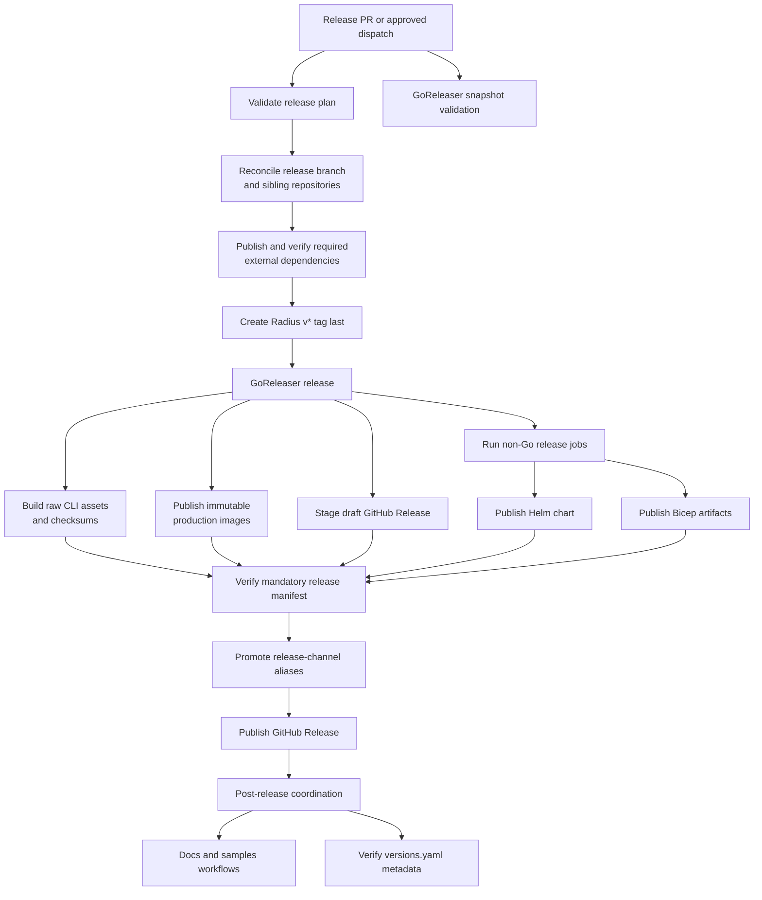

# GoReleaser Release Lifecycle

- **Author**: Dariusz Porowski

## Overview

Radius currently uses a custom release system spread across Make includes, shell steps, Python version parsing, multiple GitHub workflows, and a long manual process documented for release engineers. The result is a release lifecycle that is expensive to maintain, difficult to reason about, and slower to evolve than the product it serves.

This design proposes moving the Radius core build and publication path to GoReleaser as the single source of truth for Go binary compilation, release-asset naming, checksum generation, multi-architecture production container images, GitHub Release staging, and release-note publication. Release preparation remains an automated GitHub Actions concern because GoReleaser does not create Radius release branches, coordinate sibling repositories, publish Helm charts, or dispatch external repositories.

The target flow is a resumable release transaction rather than a chain of one-shot steps. Automation validates and reconciles the desired version across repositories, creates the Radius tag only after required dependencies are ready, uses GoReleaser to stage core artifacts in a draft GitHub Release, verifies every mandatory output, and publishes the release last. Transient operations retry automatically; reruns inspect existing state and continue safely; semantic conflicts stop for review instead of overwriting tags or artifacts.

Version selection and changelog authoring are a policy layer before GoReleaser. They can be driven by conventional commits, change fragments, pull request labels, or manual curation without changing the artifact build and publication path. This separation allows Radius to choose the process that best balances automation and release-note quality instead of making a commit convention a prerequisite for adopting GoReleaser.

### Value proposition

Measured against the current process documented in the [release runbook](../../../docs/contributing/contributing-releases/README.md), the design delivers value on five fronts:

- **Release-engineer time returned.** The current runbook spans 22 manual steps across the RC, final, and patch flows. A minimal clean cycle of one RC plus a final requires roughly fifteen to twenty hands-on interventions: two manual Deployment Engine tags, two `versions.yaml` pull requests, at least one cherry-pick pull request assembled from manually copied commit hashes, eight manual workflow dispatches across three repositories, two upmerge PR approvals, and continuous transcription of every action into a Teams thread, all interleaved with waiting on builds. The target process reduces the normal path to reviewing generated release PRs, approving the release environment, and watching one release summary; the only remaining manual prerequisite is the Deployment Engine tag until the upstream signing issue is resolved. Release-engineer effort shifts from performing git surgery and dispatching workflows to review and approval, and the release log writes itself through the automated summary and webhook updates.
- **Less custom code to maintain and troubleshoot.** The release path today spans roughly 1,600 lines of bespoke automation - two workflows (`release.yaml`, `build.yaml`), five release scripts in shell, Python, and JavaScript, and the production paths of `docker.mk` and `version.mk` - plus a 404-line manual runbook, each fragment with its own failure modes and no shared state model. The migration replaces the release-specific core of that with one declarative `.goreleaser.yaml` maintained by an upstream project and a thinner controller that only orchestrates and verifies. Fewer moving parts leave fewer places for version logic to disagree, and troubleshooting shifts from reverse-engineering job ordering to reading one summary that states expected state, observed state, and the exact resume action.
- **Fewer failed and half-published releases.** Today a mid-release failure is expensive: the tag may already exist so the version can no longer be selected, remote dispatches can be duplicated, and a GitHub Release can go public while images or the chart are still failing - each of which escalates to senior maintainers for ad-hoc recovery. The publication gate, idempotent reconciliation, and `Resume Release` workflow convert those events into a classified error plus a rerun that the release engineer can perform without escalation.
- **Release bugs surface at review time, not on release day.** Snapshot builds exercise the exact release configuration on every pull request, and the current waste of seven matrix jobs each running the broad `make build` to ship one binary apiece disappears because GoReleaser builds exactly what ships.
- **Lower bus factor and a foundation instead of a dead end.** GoReleaser is the de facto release standard for Go projects, so new maintainers read one well-documented configuration format instead of learning Radius-specific Make, shell, Python, and workflow plumbing, and institutional knowledge moves from the runbook and release veterans' memory into executable automation. Supply-chain capabilities that are increasingly table stakes - artifact and image signing, SBOMs, provenance attestations - become incremental configuration on a standard pipeline instead of bespoke integration projects.

## Terms and definitions

- **GoReleaser**: A release automation tool for Go projects that can build binaries, package archives, publish container images, create GitHub Releases, and either generate notes from git metadata or publish prepared release notes.
- **Release lifecycle**: The end-to-end process for producing and publishing Radius binaries, container images, GitHub Releases, release notes, and downstream coordination.
- **Release channel**: The major and minor stream for a Radius release, such as `0.56`, used to group compatible artifacts and release branches.
- **Version selection**: The process that chooses the next semantic version from release intent. GoReleaser consumes the resulting tag; it does not decide which version Radius should release.
- **Change fragment**: A small file committed with a pull request that records a user-facing change, its category, and optionally its semantic-version impact. A release tool later combines the fragments into a changelog section.
- **Changelog**: A portable, curated history of notable changes across versions, typically stored in `CHANGELOG.md`.
- **Release notes**: The description attached to one release, such as a GitHub Release body. Release notes can be rendered from the corresponding changelog section and augmented with installation or upgrade guidance.
- **Release plan**: The immutable version, source commit, release branch, channels, required repositories, and expected outputs approved for one release attempt.
- **Reconciliation**: An idempotent operation that reads current state, creates missing state, accepts matching state as success, and rejects conflicting state.
- **Release transaction**: The prepare, stage, verify, and publish sequence for one version. It is resumable but is not assumed to be atomic across GitHub and multiple registries.
- **Snapshot build**: A non-final build used for pull requests and branch validation, typically without publishing an official GitHub Release.
- **Post-release coordination**: Follow-on automation that does not determine whether the release is installable, such as publishing docs and samples, announcements, and metadata verification.
- **Non-Go artifact**: A release output not directly produced by the main Go module builds, such as the Bicep image, Helm chart, or externally published deployment-engine assets.

## Objectives

> **Issue Reference:** N/A

### Goals

- Make GoReleaser the single source of truth for producing and staging Radius releasable Go artifacts, independent of how the next version and release notes are selected.
- Replace the current hand-rolled Makefile, shell, and Python release logic with declarative release configuration where practical.
- Reduce the current workflow complexity, including the existing multi-step manual release procedure and the duplication between local build logic and CI/CD workflows.
- Preserve existing user-facing release outputs: raw platform-named CLI binaries, checksums, multi-arch server images, Helm charts, GitHub Releases, and release-channel semantics.
- Keep multi-repository coordination and non-Go outputs as thin workflows around the core GoReleaser release rather than embedding that logic into Make or ad hoc scripts.
- Prevent a release from becoming public while any mandatory binary, image, chart, or external publication is known to be missing or invalid.
- Make every release stage safe to rerun after a timeout, runner failure, or partial cross-repository success.
- Reduce normal release operation to reviewing an automation-created release plan and approving publication; retain an audited break-glass workflow for exceptional recovery.
- Establish a release foundation that can be extended with signing, SBOMs, attestations, richer changelog handling, and stronger version metadata without another round of custom automation.
- Define structured version and changelog inputs that support [Semantic Versioning 2.0.0](https://semver.org/spec/v2.0.0.html) and produce human-oriented output compatible with [Keep a Changelog](https://keepachangelog.com/en/1.1.0/).

### Non goals

- Rewriting every existing release-adjacent workflow in the first iteration. The scope is the core Radius build and release path.
- Moving all non-Go assets into GoReleaser immediately. The Helm chart, Bicep image, deployment-engine publication, and sibling repository dispatch remain separate where they are operationally distinct.
- Treating GoReleaser as a distributed transaction coordinator. Cross-repository state and downstream workflow completion remain the responsibility of GitHub Actions.
- Changing public Radius APIs or the end-user install experience as part of this design.
- Solving every supply-chain requirement in the first migration. This design enables later adoption of code signing, SBOMs, and attestations, but it does not require all of them on day one.
- Changing the release-branch model. The existing `release/x.y` branching approach remains in place.

### User scenarios (optional)

#### User story 1

As a Radius release engineer, I can create an RC or final release by approving a validated release plan, so that automation creates the correct tag and I no longer coordinate custom scripts, sibling repositories, and publication steps manually.

#### User story 2

As a Radius maintainer, I can review and modify release behavior in one declarative configuration file, so that release logic is easier to understand, test, and maintain.

#### User story 3

As a Radius contributor, I can validate the same release configuration locally or in CI using snapshot builds, so that release automation becomes easier to test before merging workflow changes.

#### User story 4

As a security-focused maintainer, I can add code signing, SBOM generation, or provenance-related steps to a standard release pipeline instead of expanding bespoke scripts, so that supply-chain improvements have a lower implementation cost.

## User Experience (if applicable)

The primary user experience change is for maintainers and release engineers rather than Radius end users. The release interaction model becomes approval-first and tag-driven instead of `versions.yaml`-triggered. A preparation workflow proposes or accepts the version, creates a reviewable release plan, verifies the source commit and release notes, and reconciles the release branch. After approval, the workflow creates the Radius tag with the existing release GitHub App identity; maintainers do not normally create Radius tags locally.

For contributors and reviewers, the main experience improvement is consistency: the same GoReleaser configuration drives local validation, pull request snapshot builds, branch builds, and official tagged releases. The selected changelog input process is also visible during pull request review, whether that input is a structured title, a change fragment, a label, or a manually curated entry. This removes the current split between custom local build logic and custom CI logic without requiring one specific commit convention.

**Sample Input:**

```text
Workflow: Prepare Radius Release
version: 0.56.0-rc.1
source ref: release/0.56
mode: prepare and publish after approval
```

**Sample Output:**

```text
GitHub Release: Radius v0.56.0-rc.1
Artifacts:
- raw rad binaries for supported operating systems and architectures
- per-asset SHA-256 checksums and a combined checksum manifest
- multi-architecture images for ucpd, applications-rp, dynamic-rp, controller, and pre-upgrade
- Helm chart and required external images verified before publication
- curated release notes rendered from the selected changelog input
- immutable OCI image tags; mutable release-channel aliases are promoted only for final and patch releases
```

**Sample Recipe Contract:**

N/A

## Design

### High Level Design

The proposed design shifts Radius to a tag-driven core release centered on `.goreleaser.yaml`, wrapped by a small release controller in GitHub Actions. GoReleaser defines how Go binaries are built, how raw release assets and checksums are named, how production server images are assembled, and how a draft GitHub Release is populated with generated or prepared notes.

The GitHub Actions layer becomes thinner but remains the lifecycle owner. It prepares credentials and release metadata, reconciles branches and tags, invokes GoReleaser, runs the Helm and external publishing jobs, verifies desired state, promotes mutable channel aliases, and publishes the staged GitHub Release. Each non-Go operation is independently resumable.

This preserves operational boundaries while collapsing the core release logic into a single, well-known release system. Radius keeps its release branches, keeps downstream coordination, and keeps non-Go publishing steps where needed, but stops maintaining custom infrastructure for tasks GoReleaser already solves well.

### Architecture Diagram



### Detailed Design

#### Current State and Problems

The current implementation is split between `release.yaml`, `build.yaml`, Make, shell, Python, external publisher workflows, and the maintainer runbook.

1. A maintainer edits `versions.yaml`. On the pull request, `release.yaml` selects the first supported version without a Radius tag, asks GitHub to generate notes, and requires `docs/release-notes/vX.Y.Z.md` for final and patch releases.
2. After merge, `release.yaml` checks out `radius`, `recipes`, `dashboard`, and `bicep-types-aws`. It creates release branches where absent and pushes the same tag to each repository sequentially using a GitHub App token. It then dispatches and monitors Deployment Engine image publication.
3. The Radius tag push starts `build.yaml`. Seven matrix jobs each call the broad `make build` target to produce the platform-specific `rad` asset. Another job calls Make and Buildx to publish eight images: five production Go images, two test images, and the externally downloaded Bicep image.
4. Separate jobs package and push the Helm chart, dispatch Bicep type publication, and create the GitHub Release. RC notes come from GitHub-generated notes; final and patch notes come from the checked-in release-note file.
5. Release engineers manually tag Deployment Engine, run release verification, coordinate docs and samples upmerge and releases, and manually resume failed downstream work.

The implementation has useful safeguards, including GitHub App identities, semantic-version validation, release-note checks, tag-existence checks, job timeouts, and remote workflow monitoring. It also has structural failure modes that the migration must remove:

- `versions.yaml`, Radius tags, `GITHUB_REF`, and release-note files each control a different part of the release, so there is no single immutable release plan.
- The Radius tag is created before sibling tagging and Deployment Engine publication finish. Its push can start artifact publication while prerequisites are still incomplete.
- Multi-repository mutation is not resumable. If the Radius tag succeeds and a later repository fails, the next run no longer selects that version because the Radius tag already exists.
- `release-create-tag-and-branch.sh` treats an existing matching tag as an error and uses `git push --tags`, rather than reconciling one explicit tag and verifying its target commit.
- The release job has a five-minute job timeout but its remote workflow monitor allows a ten-minute wait.
- Remote workflow discovery correlates only by workflow name and dispatch start time. Concurrent dispatches can select the wrong run because no release identifier is matched.
- GitHub Release publication depends on the CLI matrix but not on production images, Helm, Bicep publication, or Deployment Engine. A public release can therefore exist while mandatory outputs are failing.
- Current image publication writes mutable channel tags directly. A failed patch release can leave a channel containing a mixture of old and new component images.
- Most network and registry operations have no explicit retry policy. A runner rerun repeats whole jobs rather than continuing from verified state.
- Manual copying of generated notes, Deployment Engine tagging, cherry-picking, and workflow dispatch creates avoidable opportunities to select the wrong version, branch, or commit.

These issues are not isolated bugs. They are symptoms of a release system that performs a distributed operation as a linear script without a durable desired state or a publication gate.

#### Option 1: Keep the current custom release system

##### Advantages of Option 1

- No migration cost in the short term.
- No need to re-validate artifact names, image tags, or release job behavior.
- Existing release engineers already know the process.

##### Disadvantages of Option 1

- Complexity continues to grow in Make, shell, Python, and workflow YAML.
- Release improvements remain costly because every enhancement requires more bespoke plumbing.
- The current release procedure remains difficult to debug, review, and explain.
- Supply-chain enhancements such as signing, SBOMs, and attestations continue to require custom integration work.

#### Option 2: Use GoReleaser only for binaries and keep custom image and release logic

##### Advantages of Option 2

- Reduces some Make complexity without forcing a full migration.
- Lowers risk by limiting the blast radius of the initial change.
- Allows quick adoption for CLI artifact generation.

##### Disadvantages of Option 2

- Leaves the largest workflow complexity in place because image publication and GitHub Release creation remain custom.
- Splits the release source of truth between GoReleaser and GitHub workflow YAML.
- Delays many of the maintenance and supply-chain benefits that justify the migration.

#### Option 3: Use GoReleaser for core artifacts with a resumable release controller

##### Advantages of Option 3

- Produces the biggest simplification in procedures and maintenance.
- Moves the common release concerns into a single declarative tool that many Go projects already understand.
- Removes duplicated logic across Make, Python, shell scripts, and workflow jobs.
- Improves local testability because the same release configuration can be run in snapshot mode outside official tagged releases.
- Creates a natural path for adding signing, SBOM, attestation, and changelog improvements.
- Better aligns Radius with common release practices used by open-source Go projects and CNCF-adjacent tooling.

##### Disadvantages of Option 3

- Requires careful migration to preserve artifact naming, base-image behavior, and downstream workflow expectations.
- Some assets still remain outside GoReleaser, so the overall release system is simplified rather than fully centralized.
- The team must learn and review one new release configuration format.

#### Proposed Option

Option 3 is the recommended design.

Radius should adopt GoReleaser as the single source of truth for the core Go build and release lifecycle, while keeping non-Go outputs and cross-repository coordination in targeted GitHub workflows. This approach delivers the simplification benefits immediately without forcing unrelated assets into a tool that is not a natural fit for them.

The mechanism that proposes the next version and prepares the release notes remains separate from this core. GoReleaser normally derives the current version from the release tag and can either generate notes from git or GitHub metadata or consume a prepared Markdown file with `--release-notes`. Keeping this boundary explicit prevents the GoReleaser migration from being blocked on a team-wide decision about commit conventions.

The proposed design has the following main parts.

#### Core GoReleaser configuration

The repository adds a single `.goreleaser.yaml` file that defines:

- Six primary Go builds from the main module: `rad`, `ucpd`, `applications-rp`, `dynamic-rp`, `controller`, and `pre-upgrade`.
- Raw `rad` assets for the current Linux, Windows, and macOS architecture matrix, preserving names such as `rad_linux_amd64` and `rad_windows_amd64.exe`.
- Raw binary outputs for server binaries that are intended for container packaging.
- Combined and compatibility sidecar checksum generation using GoReleaser where supported, with a minimal post-hook only if required to preserve the existing `.sha256` asset contract.
- Draft GitHub Release creation with `use_existing_draft` and `replace_existing_artifacts` enabled so a failed run can resume without deleting verified assets.
- A commit-based changelog fallback and support for externally prepared release notes.
- Explicit bounded retries for GoReleaser-managed SCM API and Docker operations.

The configuration targets the GoReleaser OSS edition and pins a minimum version of v2.14: `use_existing_draft` requires v2.5, `dockers_v2` requires v2.12, and the top-level `retry` configuration requires v2.14. `dockers_v2` is provisional and is planned to replace `dockers` and `docker_manifests` in GoReleaser v3, so the pinned version must be revalidated before any major-version upgrade. The Pro-edition boundary and the OSS workaround for each intersecting Pro feature are covered in the next section.

`docgen` remains a local or developer build concern rather than a published artifact. Test binaries with separate Go modules remain outside the main configuration, either in independent configs or separate workflows.

#### GoReleaser Pro boundary and OSS workarounds

[GoReleaser Pro](https://goreleaser.com/pro/) is a paid edition with additional features. This design is implementable entirely on the OSS edition: no stage assumes a Pro license, and every Pro capability that would otherwise be attractive has a deliberate OSS substitute. Most substitutes fall out of the release controller, which must own cross-repository orchestration in either edition.

| Capability                                  | GoReleaser Pro feature                                                                   | OSS workaround in this design                                                                                                                                                        |
|---------------------------------------------|------------------------------------------------------------------------------------------|--------------------------------------------------------------------------------------------------------------------------------------------------------------------------------------|
| Staged publication with a gate              | Release phases: `goreleaser release --prepare`, then separate publish and announce steps | `release.draft: true` stages everything in a draft GitHub Release; the controller publishes the draft only after the publication gate passes                                         |
| Resuming a failed release                   | `goreleaser continue`                                                                    | Rerun GoReleaser against the same tag with `use_existing_draft` and `replace_existing_artifacts`; the `Resume Release` workflow reconciles all non-GoReleaser stages                 |
| Verifying published assets                  | Built-in verify that re-downloads assets and runs custom checks                          | The controller's verify stage compares `artifacts.json` and `metadata.json` against the release manifest, checks image digests and platforms, and runs the staged installation check |
| Previous-tag selection and version ordering | Smart SemVer tag sorting                                                                 | The release plan records the current and previous tags; the controller exports `GORELEASER_CURRENT_TAG` and `GORELEASER_PREVIOUS_TAG` so no tag-sorting heuristic is ever trusted    |
| Changelog preview, subgroups, path filters  | `goreleaser changelog` command and enhanced changelog options                            | The version-preparation workflow renders the notes into the reviewable release PR; prepared notes are passed with `--release-notes`, and OSS `changelog.groups` remains the fallback |
| Nightly and edge builds                     | Nightlies                                                                                | The separate main-branch edge workflow runs snapshot mode and publishes the mutable `edge` tags outside the release transaction                                                      |
| Faster multi-platform releases              | Split and merge builds across runners                                                    | One release runner with QEMU and Buildx emulation; revisit only if release duration becomes unacceptable, as a license decision rather than a design change                          |
| Dynamic Dockerfiles and copied files        | `templated_dockerfile` and `templated_extra_files` in `dockers_v2`                       | Static per-component `Dockerfile.goreleaser` files, plain `extra_files` for the UCP manifests, and `build_args` for values that vary per build                                       |
| Consuming binaries built elsewhere          | Prebuilt-binaries builder                                                                | Not used: GoReleaser builds all six binaries on the release runner itself, which is also why the single-runner model is the OSS baseline                                             |
| Config reuse and templating extras          | `include` keyword, custom template variables, templated files, monorepo support          | Not required: one product version, one `.goreleaser.yaml`, and all remaining templating stays within OSS template fields                                                             |

Pro features with no bearing on this design - macOS and Windows installers, notarization, NPM and Homebrew Cask publishing, DockerHub description sync, Cloudsmith and GemFury integrations, Podman builds, and OpenTelemetry trace export - are omitted from the table.

If a workaround ever becomes a measurable burden - release duration from emulated multi-platform builds is the most likely candidate - adopting Pro is a cost decision that changes no architecture in this document, because the configuration and the controller contract remain identical.

#### Container image publication

GoReleaser `dockers_v2` builds and publishes immutable full-version tags for the production multi-architecture server images:

- `ucpd`
- `applications-rp`
- `dynamic-rp`
- `controller`
- `pre-upgrade`

Each image retains its current base-image requirements. Separate `Dockerfile.goreleaser` files are used where necessary to align with GoReleaser's build context while preserving the current runtime characteristics. `extra_files` supplies the built-in UCP manifests without rebuilding the existing Make dist tree.

This removes most custom production Docker logic currently encoded in Make and CI while preserving important image differences such as distroless, Alpine, or Debian base images. The Bicep image remains a dedicated non-Go build because it downloads an external binary and generates `bicepconfig.json`. The `testrp` and `magpiego` images remain in test workflows because they use separate Go modules and are not user-facing release artifacts. Migration cannot remove their existing channel tags until repository consumers are inventoried.

GoReleaser publishes full-version tags such as `0.60.0` or `0.60.0-rc.1` first. The release controller promotes the mutable aliases - the release channel such as `0.60`, and `latest`, which always points at the most recent stable release - only after all mandatory outputs pass verification. RC releases advance no alias, so alias promotion applies to final and patch releases only. The mutable `edge` tag tracks the `main` branch and is owned by the separate edge workflow, never by the release transaction. The Helm chart for a final or patch release should reference immutable full-version image tags while the channel aliases remain available for backward compatibility.

Four properties of this model are constraints, not implementation details:

- GHCR does not enforce tag immutability. Full-version tags are immutable by policy, and the release controller enforces the policy through digest verification: a tag whose digest was locked by verification and later diverges is a non-retryable conflict, never something automation overwrites.
- Reruns do not assume reproducible image builds, and a rerun never rebuilds an image to compare its digest against an earlier build. Idempotency is stage-level: when GoReleaser pushes the full-version tags, the controller records the resulting digests in the release manifest, and the verify stage locks them. On rerun, if every expected tag matches its recorded digest and contains every expected platform, staging is accepted and skipped without rebuilding; otherwise the staging stage re-runs, re-stages the tags of this unpublished attempt, and records the new digests. Build non-reproducibility therefore never enters any comparison, and a rerun at the same commit cannot manufacture a conflict.
- `dockers_v2` couples building and pushing for multi-architecture manifests, so full-version image tags reach the registry during staging, before the publication gate. Re-staging before the gate is safe because nothing consumes a full-version tag until verification locks its digest into the release manifest. From that lock onward the tag is immutable by policy: divergence stops the release for review, and after publication the only correction is a new version - the only point where a version number is spent, by human decision, never by automatic recovery.
- `dockers_v2` defaults to `linux/amd64` and `linux/arm64`. The configuration must declare `linux/arm/v7` explicitly to preserve current platform coverage, and the parity manifest must treat a missing platform as a migration failure.

#### Tag-driven release model

The authoritative core build trigger becomes a pushed `v*` tag created by the approved version-preparation workflow. Manual Radius tag creation is a break-glass operation, not the normal path. The tag identifies the exact source commit and is never moved or recreated.

The controller validates every required repository before mutation, reconciles sibling branches and tags, verifies Deployment Engine readiness, and creates the Radius tag last. This replaces the current model where a `versions.yaml` change indirectly begins mutation before a complete plan exists. `versions.yaml` remains supported-version metadata but is no longer the release trigger.

#### Snapshot builds for pull requests and branch pushes

The same GoReleaser configuration is used in snapshot mode for pull requests and branch pushes. Snapshot mode validates the release configuration, builds the same artifacts, and can save outputs for GitHub Actions to upload when functional tests need them, without creating an official GitHub Release.

#### Versioning and changelog boundaries

The release design separates three concerns:

- **Version policy** defines how Radius applies SemVer to compatible changes, breaking changes, release channels, and prereleases.
- **Change input** records which merged changes are notable, how users should understand them, and what SemVer impact their authors or reviewers expect.
- **Release publication** builds from an approved tag and publishes artifacts and notes. GoReleaser owns this concern.

These concerns share one invariant: exactly one authoritative version record exists per phase. Before the tag exists, the approved release plan is authoritative. From tag creation onward, the tag and its source commit are authoritative. Every other representation - `versions.yaml`, the `CHANGELOG.md` heading, the chart version, channel aliases, and the release branch name - is derived from the authoritative record and validated against it. A derived value that disagrees fails validation and stops the release; no stage silently recomputes or repairs an authoritative value.

No tool can infer compatibility impact from code with complete accuracy. Every automated option moves the human decision to a different reviewable input: a commit type, a change-fragment bump, or a pull request label. Radius must also document how these signals map to its current `0.x` versions and RC prereleases because SemVer intentionally gives projects more latitude before `1.0.0`.

Radius historically tagged RCs as `-rc1`, `-rc2`, and SemVer compares those alphanumeric prerelease identifiers lexically, so `0.56.0-rc10` sorts before `0.56.0-rc2`. New releases use the dotted `-rc.N` form, whose numeric identifier orders correctly. Historical `-rcN` tags remain readable for previous-tag selection and upgrade compatibility; they are not rewritten. The Helm chart's prerelease detection matches any `rc` substring and is unaffected.

#### Common changelog output contract

Regardless of the selected input method, Radius should maintain a portable `CHANGELOG.md` and render the current release section into the GitHub Release notes. The output should follow Keep a Changelog conventions:

- Describe notable user-facing changes rather than dumping a git log.
- Keep an `Unreleased` section and list released versions in reverse chronological order with ISO 8601 dates.
- Group entries under applicable `Added`, `Changed`, `Deprecated`, `Removed`, `Fixed`, and `Security` headings.
- Link version headings to the corresponding tag or comparison range.
- Call out breaking changes, removals, deprecations, and upgrade actions explicitly.

Keep a Changelog defines the human-facing structure and quality bar; it does not select a version. SemVer defines version meaning; it does not prescribe where release intent is recorded. The following approaches can satisfy both standards with different workflow trade-offs.

#### Approach A: Conventional Commits with release automation

[Conventional Commits 1.0.0](https://www.conventionalcommits.org/en/v1.0.0/) records release intent in commit subjects and footers. In a squash-merge workflow, Radius can enforce the convention on the pull request title so individual contributor commits do not need to comply. A `fix:` maps to a patch proposal, `feat:` maps to a minor proposal, and `!` or a `BREAKING CHANGE` footer maps to a major proposal.

[Release Please](https://github.com/googleapis/release-please) is the safer fit for the existing controlled release cadence: it parses Conventional Commits and maintains a reviewable release pull request with the proposed version and `CHANGELOG.md`. In this design, `skip-github-release: true` keeps Release Please in release-PR-only mode; after that pull request merges, the release controller creates the approved tag and GoReleaser remains the sole GitHub Release publisher. [semantic-release](https://github.com/semantic-release/semantic-release) is a more automatic variant that computes and publishes a release directly from a release branch, but it overlaps more substantially with GoReleaser's release responsibilities.

This approach adds no per-change files and makes version calculation highly automatic. Its quality depends on consistently structured squash titles and sufficiently user-oriented descriptions. It also couples release behavior to commit grammar, needs explicit handling for reverts and `0.x` semantics, and can produce noisy notes unless maintainers curate the release pull request.

#### Approach B: Change fragments with Changie or Changesets

With the change-fragment model, each notable pull request adds a small file containing a user-facing summary, category, and SemVer bump intent. CI verifies that a fragment exists or that the pull request has an explicit skip marker. At release time, the highest requested impact determines the proposed version and the fragments are consumed into a versioned changelog section. The release pull request provides a final human approval point before the tag is created.

[Changie](https://changie.dev/) is language and framework agnostic and distributed as a Go binary. `changie new` creates fragments, while `changie batch auto` can calculate the next version from configured change kinds and `changie merge` updates the main changelog. Its formats can map directly to Keep a Changelog headings, and its generated version notes can be passed to GoReleaser. This is the most natural fragment tool for Radius if the team wants release metadata separate from commit history.

[Changesets](https://github.com/changesets/changesets) uses a similar Markdown-fragment model: each changeset contains a summary, affected package, and bump type; its version command consumes fragments, updates package versions, and writes changelogs. It is mature and especially useful for independently versioned JavaScript monorepos. Radius could use the model for a single product version, but the Node-based package and publish assumptions add concepts that Radius does not currently need, so Changie is the better-aligned implementation of this approach.

Fragments produce better user-facing notes because authors record context while the change is fresh, and review does not depend on final commit wording. The cost is one additional artifact for each notable pull request, CI rules for exemptions, and a release-preparation commit that consumes the fragments.

#### Approach C: Pull request labels and GitHub-generated notes

A lightweight workflow can require one version-impact label such as `semver:major`, `semver:minor`, `semver:patch`, or `release-note:none`, choose the highest impact since the previous tag, and propose a version. [GitHub-generated release notes](https://docs.github.com/en/repositories/releasing-projects-on-github/automatically-generated-release-notes) can group merged pull requests by labels, list contributors, and link the complete comparison.

This approach works with the repository's existing pull request review surface and avoids commit rules and fragment files. However, GitHub does not choose the next version from labels without additional workflow logic, pull request titles still need to be suitable for users, and the generated notes are not a portable `CHANGELOG.md` unless automation materializes and commits them. Missing or conflicting labels also need a blocking validation rule.

#### Approach D: Manual version and curated changelog

Maintainers can continue choosing an explicit version based on release scope, edit the `Unreleased` section or a release-note document, and create the tag through a helper workflow. GoReleaser then consumes that prepared Markdown file. This is fully compatible with Keep a Changelog and provides the strongest editorial and release-calendar control, including RC numbering and exceptions to a mechanically inferred bump.

The trade-off is ongoing release-engineer effort, possible merge conflicts in a shared `CHANGELOG.md`, and a greater risk that notable changes are discovered late. Manual version selection can also be combined with fragments or labels: automation prepares the notes and recommends a bump, while a maintainer approves or overrides the final version.

#### Comparison and recommendation

| Approach                                 | Version automation                                                               | Release-note source                                | Keep a Changelog fit                         | Main trade-off                                                                           |
|------------------------------------------|----------------------------------------------------------------------------------|----------------------------------------------------|----------------------------------------------|------------------------------------------------------------------------------------------|
| Conventional Commits with Release Please | Automatic from the highest commit signal, with a reviewable release pull request | Squash titles and commit bodies                    | Good after grouping and curation             | No fragment files, but release correctness depends on commit grammar                     |
| Changie fragments                        | Automatic proposal or explicit bump, approved in a release pull request          | Purpose-written per-PR fragments                   | Strong and directly configurable             | High-quality notes with one additional file for each notable change                      |
| Changesets fragments                     | Automatic from per-package bump declarations                                     | Purpose-written Markdown fragments                 | Good                                         | Mature monorepo workflow, but optimized for package ecosystems and requires Node tooling |
| Pull request labels                      | Automatic with a small custom workflow                                           | Pull request titles grouped by labels              | Partial unless generated notes are committed | Low contributor friction, but label discipline and custom version logic are required     |
| Manual curation                          | None, or advisory only                                                           | Maintainer-authored changelog or release-note file | Strong                                       | Maximum control with the highest recurring release effort                                |

**Decision**: the team selected Conventional Commits, enforced on squash-merge pull request titles, combined with a fixed version policy: while Radius is `0.x`, every scheduled full release bumps the minor version regardless of commit signals - including breaking changes - and patch releases bump the patch version. Commit types therefore drive changelog grouping and breaking-change callouts, never version selection. [git-cliff](https://git-cliff.org/) renders the canonical `CHANGELOG.md` and the release-note input for GoReleaser; Release Please was rejected because versioning-by-commit adds no value under the fixed policy and its release-PR model works against the RC and release-branch flow. Radius also adopts dotted `-rc.N` prerelease identifiers for correct SemVer ordering. Manual curation remains the override and recovery path.

#### Capability ownership

The migration should use GoReleaser directly where it has a native release primitive and keep lifecycle orchestration outside it. Hooks are not a substitute for a resumable controller because a failed hook has no durable cross-repository state.

| Capability                                             | Current owner                                                 | Target owner                                                     |
|--------------------------------------------------------|---------------------------------------------------------------|------------------------------------------------------------------|
| Version proposal and curated notes                     | `versions.yaml`, GitHub-generated notes, and maintainer edits | Selected versioning tool plus a reviewable release PR            |
| Release branch and cross-repository tags               | `release.yaml` and shell scripts                              | Idempotent GitHub Actions release controller                     |
| Go compilation and linker metadata                     | Make plus `get_release_version.py`                            | GoReleaser builds and templates                                  |
| Raw CLI assets and checksums                           | GitHub matrix jobs and shell loops                            | GoReleaser binary-format output and checksum pipe                |
| Production Go images and manifests                     | Make and Docker Buildx                                        | GoReleaser `dockers_v2`                                          |
| GitHub Release assets and notes                        | `gh release create`                                           | GoReleaser draft release and release-note input                  |
| Helm chart                                             | Helm commands in `build.yaml`                                 | Dedicated idempotent GitHub Actions job                          |
| Bicep image and Bicep types                            | Make plus external publisher dispatch                         | Dedicated local build and correlated external publisher workflow |
| Test images                                            | Make and Docker Buildx                                        | Test workflow until consumers and separate modules are migrated  |
| Deployment Engine and sibling repositories             | `release.yaml`, external workflows, and a manual tag          | Release controller plus external publisher workflows             |
| Verification, channel promotion, and final publication | Manual verification and independent jobs                      | Release controller publication gate                              |
| Docs and samples                                       | Manual workflow dispatch                                      | Post-release workflows with independent retries                  |

#### Target release transaction

Each release executes the following stages. Re-running the workflow always starts by reconciling all stages; it does not assume the previous run stopped where its logs ended.

1. **Prepare**: Create or update a release PR containing the selected version, release notes or changelog material, and the corresponding `versions.yaml` metadata. Record the exact source commit, release branch, full version, channel, chart version, required repositories, and expected outputs as the release plan. A later release run may not silently recompute these values from mutable branch heads.
2. **Validate**: Run `goreleaser check` and `goreleaser release --snapshot --clean` at the planned commit. Validate SemVer, RC sequencing, release-note requirements, full git history, repository permissions, registry authentication, expected Docker platforms, and the absence of conflicting tags or releases.
3. **Reconcile prerequisites**: Create a missing release branch from the approved commit, or verify that the approved commit is present on an existing branch. Reconcile matching tags in `recipes`, `dashboard`, and `bicep-types-aws`, and verify their downstream outputs. Verify the signed Deployment Engine tag and publish its image. Create the Radius tag last.
4. **Stage core artifacts**: Run GoReleaser once for the tag. It builds the raw CLI assets and production server binaries, generates checksums and metadata, pushes immutable full-version image tags, and creates or reuses a draft GitHub Release. The draft remains unpublished on failure.
5. **Stage non-Go artifacts**: Package and publish the Helm chart, build the Bicep image, and dispatch Bicep type publication with the release identifier. These jobs can run in parallel after the Radius tag exists, but each must verify its destination state.
6. **Verify**: Compare GoReleaser's artifact metadata and a generated release manifest against the expected asset names, checksums, image platforms and digests, Helm chart version, external images, release notes, and binary linker metadata. Run the installation verification with the staged local `rad` binary so validation does not require a public GitHub Release.
7. **Finalize**: Promote the mutable aliases - release-channel tags and `latest` - to the verified immutable digests and publish the draft GitHub Release. Finalization requires the release environment approval for final and patch releases. RC publication can follow the same gate without an additional approval if repository policy permits it.
8. **Coordinate**: Trigger docs and samples workflows, verify or synchronize `versions.yaml` metadata, and record links and conclusions. These tasks are independently retryable and do not mutate immutable release artifacts.

No stage deletes an existing tag or published release as part of automatic recovery. If a published immutable artifact is wrong, Radius publishes a corrected version rather than rewriting history.

#### Idempotency contract

The release controller reconciles one explicit resource at a time using these rules:

- A branch that is absent is created at the planned commit. An existing branch is accepted only when the planned commit is reachable from it.
- A tag that is absent is created and pushed explicitly. A tag at the planned commit is success. A tag at any other commit is a non-retryable conflict; automation never force-updates it.
- An existing draft release for the planned tag is reused. Matching assets are retained or replaced deterministically. An already published release is verified and treated as complete only when every expected digest matches.
- The expected digest for an immutable container tag is the digest recorded in the release manifest at push and locked by verification, never the output of a fresh rebuild - image builds are not assumed reproducible. Before the lock, a rerun of the staging stage may re-stage the tags of the same unpublished attempt and record new digests. After the lock, a matching tag is success and is skipped without rebuilding, and a diverging tag is a non-retryable conflict. Mutable aliases (release channels and `latest`) are changed only during finalization and are verified after promotion; `edge` belongs to the main-branch workflow and is never touched by the release.
- A remote publisher receives a stable release identifier such as `<version>-<source-sha>`. Its workflow run name and concurrency group include that identifier. The controller finds that exact run, waits for an active run, reruns a failed retryable run, or dispatches only when no matching run exists.
- Every stage verifies the destination, not merely the exit code of the command that attempted to create it.

#### Retry and fallback policy

GoReleaser's native retry configuration provides bounded exponential backoff for its Git provider API calls and Docker operations. The initial configuration should make the budget explicit rather than depend on defaults:

```yaml
retry:
  attempts: 5
  delay: 10s
  max_delay: 2m

release:
    draft: true
    use_existing_draft: true
    replace_existing_artifacts: true
    prerelease: auto
    mode: replace
```

The release controller applies the same policy only to operations outside GoReleaser:

- Retry timeouts, connection resets, rate limits, and service-side `5xx` responses with exponential backoff and jitter.
- Do not retry invalid input, missing required notes, authentication or authorization failures, conflicting tag targets, checksum mismatches, or unsupported platform configuration.
- Before retrying a dispatch, query the correlated remote run and destination artifact. Never create duplicate work merely because monitoring timed out.
- Size every job timeout above its complete retry and monitoring budget. A child monitor may not wait longer than its enclosing job.
- Use release concurrency keyed by version and source commit, with cancellation disabled. A second invocation queues or reconciles the same release instead of canceling publication in progress.

Fallbacks are automation entry points, not a second undocumented command sequence:

1. Automatic retries handle transient failures inside the current run.
2. A `Resume Release` workflow accepts the version and planned source commit, recomputes observed state, skips completed work, and retries incomplete stages. This controller-owned resume is the OSS substitute for GoReleaser Pro's `goreleaser continue` and split release phases.
3. A targeted downstream retry reruns the correlated external workflow and then resumes verification; it does not recreate tags or rebuild unrelated artifacts.
4. An approval-gated break-glass mode can waive an explicitly optional post-release task or supply repaired credentials. It cannot move a tag, replace a published immutable artifact, or bypass a mandatory release-manifest check.

If any mandatory stage fails before finalization, the GitHub Release stays draft and mutable channel aliases do not advance. The workflow summary identifies the failed resource, observed and expected state, retry classification, remote run URL, and exact `Resume Release` inputs.

#### Post-release coordination

Only work that does not determine whether the core release is installable waits for the published release event. This includes docs and samples publication, announcements, and metadata synchronization. Required sibling images and Deployment Engine publication move before the Radius tag; Bicep and Helm publication move before the publication gate.

For RC releases, coordination also covers the docs and samples upmerge workflows and the sample test workflow that installs the published RC. The controller dispatches and correlates them with the release identifier like any other remote work, and their results gate approval of the next release plan - the final release - rather than the RC's own publication. This replaces the manually dispatched upmerge and sample-test steps in the current runbook.

#### Hard external dependency: Deployment Engine tag signing

The one prerequisite this design cannot automate inside the Radius organization is the Deployment Engine tag. The `azure-octo` organization requires GPG-verified tags, signing is not configured in that repository's release workflow ([azure-octo/deployment-engine#456](https://github.com/azure-octo/deployment-engine/issues/456)), and a maintainer therefore signs and pushes the tag from a workstation. Until that issue is resolved, the approval-only release goal has exactly one manual prerequisite.

The design bounds the dependency instead of hiding it: release-plan validation checks for the expected Deployment Engine tag before any Radius mutation and fails fast with the exact tag name and signing instructions when it is missing. Resolving the upstream issue removes the last manual step without changing any other part of this design, and it should be tracked as a named migration risk with an owner rather than as optional cleanup.

#### Supply-chain and provenance readiness

A standard release tool makes artifact and container signing, SBOM generation, provenance attestations, and richer OCI labels and metadata incremental configuration instead of architectural work. None of these are required on day one; the Security section lists the post-baseline evaluation items.

#### Makefile reduction

The Makefile should stop being the source of truth for production Go release publishing. Release-specific binary and production-image paths should be removed only after GoReleaser parity is validated.

Make remains appropriate for developer convenience, testing, code generation, the Bicep image, and separate-module test images until those paths have an independently justified migration. It should not express the distributed release graph.

### API design (if applicable)

N/A. This design does not change public REST APIs or Radius resource schemas.

### CLI Design (if applicable)

N/A for Radius end users.

There is an internal workflow-experience change for maintainers: a helper workflow may create and validate a release tag, but this does not change the `rad` CLI surface area.

### Implementation Details

#### GitHub workflow changes

The current `build.yaml` should be split so ordinary validation and privileged release publication do not share one broad workflow:

- Pull request and merge queue: run `goreleaser check` and snapshot builds without registry or release permissions.
- Main branch push: run snapshot validation and a separate edge publication job that publishes mutable `edge` tags for CLI OCI artifacts, images, and edge Helm behavior. Edge publication is not part of the release transaction, and main-branch builds never touch `latest`, which always points at the most recent stable release.
- Release tag push: invoke the resumable release controller, which calls GoReleaser in release mode and holds the GitHub Release as a draft until all gates pass.
- Manual resume: invoke the same controller with the original version and source commit. Do not provide separate manual tag, image, or GitHub Release workflows that bypass reconciliation.

The GoReleaser job is responsible for environment preparation only:

- Checking out the repository with full git history.
- Setting up Go, QEMU, Buildx, and registry credentials.
- Computing release metadata.
- Loading prepared release notes when the selected versioning workflow provides them.
- Invoking GoReleaser.
- Uploading GoReleaser metadata and snapshot artifacts where later jobs need them.

The controller owns orchestration and verification but not build recipes. Its release-level concurrency never cancels an in-progress tagged release.

#### Version-preparation workflow

If Radius adopts automatic or advisory version selection, a separate workflow runs before the tagged release. Depending on the chosen approach, it parses commit metadata, batches change fragments, or evaluates pull request labels. It must produce a reviewable version, changelog proposal, and `versions.yaml` update, permit an explicit maintainer override, and bind the approved result to a source commit.

For first RCs, automation creates the release branch from the approved `main` commit. For later RCs, final releases, and patches, automation opens or updates a backport PR against the existing release branch instead of asking a release engineer to copy commit hashes and run `git cherry-pick`. The merge commit of that PR becomes the planned source commit.

The version-preparation workflow does not build release artifacts or create the GitHub Release. It hands the approved plan to the tag-driven boundary. This avoids coupling GoReleaser configuration to the selected input model and prevents two tools from racing to create or overwrite the same GitHub Release.

Automated tag creation must also preserve the workflow handoff. Events caused by the default GitHub Actions `GITHUB_TOKEN` do not start another workflow, so the implementation must either use a narrowly scoped GitHub App or fine-grained token that can trigger the tag workflow, or invoke the GoReleaser job directly in the same trusted workflow after tag creation.

#### GoReleaser configuration

The GoReleaser configuration becomes the main declarative specification for:

- Build matrix.
- Raw release-asset naming.
- Checksums.
- Production Docker image definitions, immutable tags, and manifest lists.
- Draft GitHub Release metadata and resumable artifact upload behavior.
- Changelog fallback grouping and externally prepared release-note input.
- Retry policy and generated artifact metadata.

Version metadata previously computed independently in Python and Make is calculated once from the approved tag and release plan, then injected through GoReleaser templates and environment variables.

#### Dockerfiles and runtime parity

Dedicated GoReleaser Dockerfiles should be created for components whose current Dockerfiles assume the existing Make dist layout. These Dockerfiles must preserve runtime parity with today's images, including:

- Base image family.
- Required packages such as CA certificates, git, or openssl.
- Non-root user behavior.
- Extra copied files, especially the built-in UCP manifests.

Preserving runtime parity is a migration requirement, not an optional cleanup item.

#### `versions.yaml`

`versions.yaml` remains in the repository as supported-version and channel metadata, but it is demoted from automation trigger to an output of release preparation. The preparation PR updates it and the release controller validates that the planned version is represented before creating the tag.

#### Release documentation

The existing release documentation in the main Radius repository should be updated after implementation to reflect the new process. The long manual checklist can be reduced to:

- review the generated release PR, source commit, version, and release notes,
- approve the release environment when required,
- monitor one release summary and use `Resume Release` when automation identifies a retryable failure,
- review automated verification and downstream coordination results,
- use the documented break-glass workflow only for exceptional recovery.

### Error Handling

The publication gate defines mandatory and optional work explicitly. Production Radius images, CLI assets and checksums, the Helm chart, dashboard, Deployment Engine, Bicep outputs, release notes, and install verification are mandatory. Docs, samples, announcements, and metadata synchronization after publication are retryable post-release work unless the release policy promotes one of them to a mandatory gate.

GoReleaser failure leaves the release draft reusable. An image or chart failure leaves immutable successful outputs in place and the next run verifies them before rebuilding. A downstream timeout does not imply failure or trigger an immediate duplicate dispatch; the controller locates the correlated run and destination first. Diagnostic log collection may use `continue-on-error`, but mandatory build, monitor, and verification steps may not.

If finalization fails after some channel aliases move, the release remains draft. Resume verifies every alias against the release manifest and completes promotion before publishing the GitHub Release. If failure occurs after the GitHub Release is public, automation does not delete it; it retries optional coordination, or maintainers issue a corrected release when an immutable mandatory artifact is wrong.

Every error summary includes the release identifier, planned source commit, stage, retryability, expected state, observed state, completed stages, and recovery action. This replaces instructions that require maintainers to infer recovery from job ordering.

## Test plan

The migration should be validated in phases.

- Compare current and proposed outputs for at least one RC-style build and one final release candidate in a dry-run or staging branch.
- Capture a parity manifest from the current workflow containing all raw CLI asset names, sidecar checksums, Go version fields, production and test image names, platforms and tags, Helm metadata, release-note behavior, and downstream outputs. Treat an unexplained difference as a migration failure.
- Replay a representative historical release through each shortlisted versioning approach and compare the proposed bump, included notable changes, category accuracy, and required manual corrections.
- Test patch, minor, breaking, no-release, revert, prerelease, and manual-override cases, including the documented mapping for Radius `0.x` releases.
- Verify that `CHANGELOG.md` retains an `Unreleased` section, expected Keep a Changelog categories, release dates, and comparison links, and that the same release section appears in the GitHub Release notes.
- Run `goreleaser check` and `goreleaser release --snapshot --clean` locally and in CI to validate configuration, raw asset layout, and image definitions.
- Verify that release metadata injected into binaries still reports the expected version, channel, commit, and chart version fields.
- Verify that published container images preserve runtime behavior, base-image assumptions, and required files.
- Validate that immutable image tags contain every expected platform, channel and `latest` aliases resolve to the recorded digests, `edge` tracks the `main` branch head, and final or patch Helm charts install immutable image versions.
- Validate that the GitHub Release contains the expected raw binaries, checksums, notes, and prerelease/final classification.
- Validate that main-branch snapshot flows still provide the artifacts required by functional tests and edge publication.
- Validate that the controller reconciles sibling tags, correlates required external publication, and verifies the prepared `versions.yaml` metadata before creating the Radius tag.
- Inject a failure after every transaction stage and rerun `Resume Release`; confirm completed state is accepted, missing state is repaired, conflicting state stops, and no duplicate remote dispatch or tag is created.
- Rerun the staging stage after a complete image push at the same commit and confirm the staged tags are verified against their recorded digests and skipped without rebuilding; interrupt a push mid-flight and confirm the rerun re-stages the incomplete attempt with new digests; retag one image externally after verification and confirm the rerun stops with a conflict instead of overwriting.
- Simulate `429`, `5xx`, network timeout, registry push interruption, and a remote workflow that starts after the first monitoring timeout; confirm bounded retries and exact release-ID correlation.
- Start two releases for the same version and source commit and confirm one queues or reconciles without cancellation. Start a conflicting version/source pair and confirm it is rejected.
- Confirm that a failure before finalization leaves the GitHub Release draft, leaves channel aliases unchanged, and provides actionable resume inputs.
- Confirm all monitor and retry budgets fit within their enclosing job timeouts.
- Run the existing release verification workflow against a migrated RC and final release before deprecating the old process.

## Security

This design improves security posture indirectly by reducing custom release code and centralizing common release operations in a well-understood tool. Fewer bespoke scripts and fewer duplicated code paths reduce the audit surface.

The workflow should continue to use least-privilege GitHub permissions. Release creation and package publication require elevated scopes, but downstream coordination should prefer GitHub App tokens or narrowly scoped automation identities.

GoReleaser adoption also creates a better foundation for future supply-chain controls. After the baseline migration, Radius should evaluate:

- artifact and container signing,
- SBOM generation,
- provenance attestations,
- stronger release metadata standards,
- removal or reduction of long-lived personal access tokens where possible.

No new end-user secrets, encryption models, or authentication flows are introduced by this design.

## Compatibility (optional)

The intended compatibility goal is no user-visible change to how Radius release artifacts are consumed, with one deliberate exception described below.

Compatibility requirements:

- Preserve existing raw binary names, executable suffixes, sidecar checksums, and operating-system coverage.
- Preserve current release channel behavior for tagged releases.
- Preserve production image names and channel tags while adding immutable full-version tags.
- Preserve Helm chart names and versions, and verify that a final or patch chart installs immutable image versions.
- Preserve RC versus final release semantics.

There are three intentional compatibility changes:

- Internal: release engineers no longer use `versions.yaml` edits as the release trigger, and documentation must be updated accordingly.
- User-visible: the Helm chart for final and patch releases switches from the mutable `major.minor` channel image tag to immutable full-version tags. Today a cluster can pick up patched component images through the moving channel alias on pod restart; after this change, patched images arrive only with the corresponding chart upgrade. This removes chart-and-image version skew and makes deployments reproducible, but it changes patch pickup behavior and must be called out in the release notes of the release that ships it.
- User-visible: `latest` OCI tags currently track the `main` branch; after the migration, `latest` always points at the most recent stable release and the new `edge` tag tracks `main`. Consumers of `:latest` who want main-branch builds must switch to `:edge`. The migration publishes `edge` alongside `latest` with a deprecation announcement before `latest` is repointed at cutover.

## Monitoring and Logging

The primary observability surface for this design is GitHub Actions.

Recommended instrumentation and diagnostics:

- A single release summary keyed by version and source commit with one row for every planned output.
- Explicit logging of planned and observed release metadata, tag targets, image digests, and channel aliases.
- GoReleaser `artifacts.json`, `metadata.json`, and the generated release manifest retained as workflow artifacts and attached to the draft release where appropriate.
- Exact remote workflow identifiers and URLs for sibling and downstream publication.
- Automated pre-publication installation verification plus the existing post-publication release verification during migration.
- Automated posting of stage transitions and the final release summary to the team's release channel through an incoming webhook, replacing the current requirement that a release engineer manually transcribe every action into a Teams thread.

For troubleshooting, maintainers should be able to answer these questions quickly:

- Was the tag valid and fetched correctly?
- Which release-plan source commit does every repository tag reference?
- Did GoReleaser build all expected artifacts?
- Do all immutable images and channel aliases resolve to the expected platform digests?
- Is the GitHub Release absent, draft, or published?
- Which mandatory or optional downstream stage is pending, running, failed, or complete?
- Is the failure retryable, and which `Resume Release` inputs should be used?

## Development plan

The work should be delivered in phases. A per-PR sequencing of these phases, including the decided Conventional Commits and version-policy details.

### Phase 1: Capture compatibility and add snapshot validation

- Generate a machine-readable parity manifest from a current RC and final release.
- Add `.goreleaser.yaml` for the six production Go binaries.
- Add raw asset naming, checksums, production `dockers_v2` images, changelog fallback, external release-note input, retry policy, and draft release configuration.
- Add GoReleaser-specific Dockerfiles where needed.
- Run GoReleaser only in check and snapshot mode and compare every output to the parity manifest.
- Define the Keep a Changelog output contract and compare the shortlisted version-selection approaches with historical release data.

### Phase 2: Stage core releases with GoReleaser

- Use GoReleaser for tagged Go builds, immutable production images, checksums, and a draft GitHub Release.
- Keep the current publisher as the production path during an RC shadow run and compare outputs and timings.
- Enable draft reuse, deterministic artifact replacement, and bounded retries; prove reruns after injected failures.
- Preserve artifact upload points needed by tests and edge publication.
- Keep main edge publication, Bicep, test-image, and Helm behavior separate until their parity checks pass.

### Phase 3: Add the resumable release controller

- Introduce the immutable release plan, release-level concurrency, preflight checks, and branch and tag reconciliation.
- Add stable release identifiers to external dispatch payloads and remote workflow run names.
- Reorder prerequisites so required sibling tags and Deployment Engine publication complete before the Radius tag.
- Add the `Resume Release` workflow and prove recovery from partial cross-repository state.
- Stop using `versions.yaml` changes as the trigger while retaining the file as prepared supported-version metadata.

### Phase 4: Add the publication gate

- Correlate and verify Helm, Bicep, dashboard, Deployment Engine, and sibling outputs.
- Generate and validate the release manifest, automate staged installation verification, and promote channel aliases from immutable digests.
- Publish the draft GitHub Release only after mandatory gates pass.
- Trigger and monitor docs and samples as independently retryable post-release work.

### Phase 5: Remove obsolete release logic and harden

- Remove superseded production Go build, image, checksum, and GitHub Release paths from Make, Python, shell, and `build.yaml`.
- Retain developer, Bicep, and separate-module test targets that still have owners and consumers.
- Replace the manual release checklist with approval, monitoring, resume, and break-glass procedures.
- Adopt and enforce the selected changelog input policy, including an explicit exemption for changes that do not need release notes.
- Add automatic version proposals only after the team validates the `0.x`, release-branch, RC, revert, and override behavior.
- Evaluate signing, SBOM, and attestation additions.
- Revisit any remaining non-Go publication steps for future simplification.

## Open Questions

All previously open questions are resolved. The change-input, version-policy, RC-identifier, and changelog-canonicality decisions are recorded in the comparison section above; the remaining decisions are:

- **SBOM generation**: added in a dedicated follow-up PR immediately after the GoReleaser cutover proves parity, using GoReleaser's native syft support. Not bundled into the cutover itself and not deferred to a later supply-chain initiative.
- **Publication gates**: the mandatory output set (production images, CLI assets and checksums, Helm chart, dashboard, Deployment Engine, Bicep outputs, release notes, install verification) is identical for every release type. Final and patch releases additionally require the release-environment approval; RCs publish automatically once the gate passes.
- **Test-module images**: `testrp` and `magpiego` move to test-specific immutable tags published from test workflows once the consumer inventory confirms nothing pulls their channel tags; release-channel tags for them stop at that point.
- **Helm chart**: remains a dedicated idempotent job under the publication gate permanently. Revisited only if GoReleaser gains native Helm support.
- **Bicep image**: remains a dedicated non-Go build permanently, under the same gate and digest-verification contract as the Helm job.
- **Deployment Engine tag signing**: adopt GitHub-App-created tags through the API, contingent on a validation spike confirming the result satisfies the `azure-octo` verified-tag requirement - GitHub's web-flow signing covers commits, not annotated tag objects, so this must be proven before the workstation step is removed. If validation fails, fall back to a bot GPG signing key stored in `azure-octo` org secrets and used by the Deployment Engine release workflow. Either path removes the maintainer-workstation step.
- **Runner topology**: a single GoReleaser runner with QEMU and Buildx. The production Dockerfiles are copy-only, so emulation cost is trivial and Go cross-compiles natively. The release summary records total duration each cycle; the GoReleaser Pro split-and-merge evaluation reopens only if duration exceeds the agreed budget.
- **Mutable tag semantics**: `edge` is the mutable tag published by the separate main-branch workflow for every merge to `main`, permanently outside the release transaction (consuming GoReleaser snapshot outputs after the final migration phase; GoReleaser Pro nightlies are not adopted). `latest` always points at the most recent stable release: the release controller promotes it during finalization of final and patch releases exactly like the release-channel aliases, and neither RCs nor main-branch builds ever advance it. Because `latest` carries main-branch content today, the migration first publishes `edge` alongside `latest` with a deprecation announcement, then repoints `latest` to the stable release at cutover.

## Alternatives considered

- Keeping the current custom release stack and using GoReleaser only for CLI binaries are analyzed and rejected as Option 1 and Option 2 in the Detailed Design.
- Move every release-related activity into GoReleaser hooks. Rejected because cross-repository tags, Helm, external workflows, and recovery need independently observable and resumable orchestration rather than one-shot hooks.

## References

- [Semantic Versioning](https://semver.org/)
- [Conventional Commits](https://www.conventionalcommits.org/)
- [Keep a Changelog](https://keepachangelog.com/)
- [GoReleaser](https://goreleaser.com/)
- [GoReleaser Pro](https://goreleaser.com/pro)
