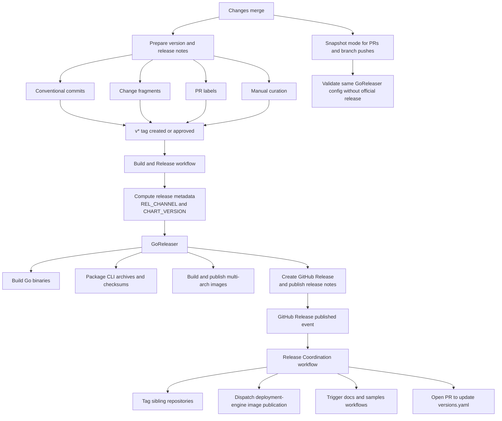

# GoReleaser Release Lifecycle

- **Author**: Dariusz Porowski

## Overview

Radius currently uses a custom release system spread across Make includes, shell steps, Python version parsing, multiple GitHub workflows, and a long manual process documented for release engineers. The result is a release lifecycle that is expensive to maintain, difficult to reason about, and slower to evolve than the product it serves.

This design proposes moving the Radius build and release lifecycle to GoReleaser as the single source of truth for Go binary compilation, archive creation, checksum generation, multi-architecture container image publication, GitHub Release creation, and release-note publication. The release flow becomes tag-driven: create a `v*` tag manually or through version automation, let GoReleaser build and publish the release, and then run lightweight post-release coordination for sibling repositories and non-Go artifacts.

Version selection and changelog authoring are a policy layer before GoReleaser. They can be driven by conventional commits, change fragments, pull request labels, or manual curation without changing the artifact build and publication path. This separation allows Radius to choose the process that best balances automation and release-note quality instead of making a commit convention a prerequisite for adopting GoReleaser.

This approach simplifies procedures, reduces maintenance cost, removes custom workflow complexity, and aligns Radius with a widely recognized release tool in the Go ecosystem and across CNCF-adjacent projects. It also creates a cleaner path for standardized supply-chain capabilities such as code signing, SBOM generation, provenance attestations, changelog automation, and more predictable version handling.

## Terms and definitions

- **GoReleaser**: A release automation tool for Go projects that can build binaries, package archives, publish container images, create GitHub Releases, and either generate notes from git metadata or publish prepared release notes.
- **Release lifecycle**: The end-to-end process for producing and publishing Radius binaries, container images, GitHub Releases, release notes, and downstream coordination.
- **Release channel**: The major and minor stream for a Radius release, such as `0.56`, used to group compatible artifacts and release branches.
- **Version selection**: The process that chooses the next semantic version from release intent. GoReleaser consumes the resulting tag; it does not decide which version Radius should release.
- **Change fragment**: A small file committed with a pull request that records a user-facing change, its category, and optionally its semantic-version impact. A release tool later combines the fragments into a changelog section.
- **Changelog**: A portable, curated history of notable changes across versions, typically stored in `CHANGELOG.md`.
- **Release notes**: The description attached to one release, such as a GitHub Release body. Release notes can be rendered from the corresponding changelog section and augmented with installation or upgrade guidance.
- **Snapshot build**: A non-final build used for pull requests and branch validation, typically without publishing an official GitHub Release.
- **Post-release coordination**: Follow-on automation that should remain outside the main GoReleaser configuration, such as tagging sibling repositories, dispatching external workflows, and updating documentation-only metadata.
- **Non-Go artifact**: A release output not directly produced by the main Go module builds, such as the Bicep image, Helm chart, or externally published deployment-engine assets.

## Objectives

> **Issue Reference:** N/A

### Goals

- Make GoReleaser the single source of truth for producing and publishing Radius releasable Go artifacts, independent of how the next version and release notes are selected.
- Replace the current hand-rolled Makefile, shell, and Python release logic with declarative release configuration where practical.
- Reduce the current workflow complexity, including the existing multi-step manual release procedure and the duplication between local build logic and CI/CD workflows.
- Preserve existing user-facing release outputs: CLI archives, checksums, multi-arch server images, GitHub Releases, and release-channel semantics.
- Keep multi-repository coordination and non-Go outputs as thin workflows around the core GoReleaser release rather than embedding that logic into Make or ad hoc scripts.
- Establish a release foundation that can be extended with signing, SBOMs, attestations, richer changelog handling, and stronger version metadata without another round of custom automation.
- Define structured version and changelog inputs that support [Semantic Versioning 2.0.0](https://semver.org/spec/v2.0.0.html) and produce human-oriented output compatible with [Keep a Changelog](https://keepachangelog.com/en/1.1.0/).

### Non goals

- Rewriting every existing release-adjacent workflow in the first iteration. The scope is the core Radius build and release path.
- Moving all non-Go assets into GoReleaser immediately. The Helm chart, Bicep image, deployment-engine publication, and sibling repository dispatch remain separate where they are operationally distinct.
- Changing public Radius APIs or the end-user install experience as part of this design.
- Solving every supply-chain requirement in the first migration. This design enables later adoption of code signing, SBOMs, and attestations, but it does not require all of them on day one.
- Changing the release-branch model. The existing `release/x.y` branching approach remains in place.

### User scenarios (optional)

#### User story 1

As a Radius release engineer, I can create an RC or final release by creating a single version tag, so that I no longer have to coordinate a large number of manual release steps across custom scripts and Make targets.

#### User story 2

As a Radius maintainer, I can review and modify release behavior in one declarative configuration file, so that release logic is easier to understand, test, and maintain.

#### User story 3

As a Radius contributor, I can validate the same release configuration locally or in CI using snapshot builds, so that release automation becomes easier to test before merging workflow changes.

#### User story 4

As a security-focused maintainer, I can add code signing, SBOM generation, or provenance-related steps to a standard release pipeline instead of expanding bespoke scripts, so that supply-chain improvements have a lower implementation cost.

## User Experience (if applicable)

The primary user experience change is for maintainers and release engineers rather than Radius end users. The release interaction model becomes tag-first instead of `versions.yaml`-first. A maintainer either pushes a release tag directly or approves automation that prepares the release notes, proposes the version, creates the tag, and ensures the release branch exists.

For contributors and reviewers, the main experience improvement is consistency: the same GoReleaser configuration drives local validation, pull request snapshot builds, branch builds, and official tagged releases. The selected changelog input process is also visible during pull request review, whether that input is a structured title, a change fragment, a label, or a manually curated entry. This removes the current split between custom local build logic and custom CI logic without requiring one specific commit convention.

**Sample Input:**

```bash
git tag v0.56.0-rc1
git push origin v0.56.0-rc1
```

Or, via a helper workflow:

```text
Workflow: Create Release Tag
version: 0.56.0-rc1
ref: release/0.56
```

**Sample Output:**

```text
GitHub Release: Radius v0.56.0-rc1
Artifacts:
- rad archives for supported operating systems and architectures
- checksums.txt
- multi-architecture images for ucpd, applications-rp, dynamic-rp, controller, and pre-upgrade
- curated release notes rendered from the selected changelog input
- published OCI image manifests for release tags
```

**Sample Recipe Contract:**

N/A

## Design

### High Level Design

The proposed design shifts Radius to a tag-driven release lifecycle centered on `.goreleaser.yaml`. The configuration defines how Go binaries are built, how archives and checksums are packaged, how server images are assembled and published, and how a GitHub Release is created with generated or prepared notes.

The GitHub Actions layer becomes thinner. Instead of encoding the release process across multiple custom jobs, it prepares credentials and release metadata, invokes GoReleaser for either snapshot or release mode, and then runs post-release coordination for assets or repositories that do not belong in the main GoReleaser configuration.

This preserves operational boundaries while collapsing the core release logic into a single, well-known release system. Radius keeps its release branches, keeps downstream coordination, and keeps non-Go publishing steps where needed, but stops maintaining custom infrastructure for tasks GoReleaser already solves well.

### Architecture Diagram



### Detailed Design

#### Current State and Problems

The current release path has several structural problems:

- Around 600 lines of Make includes are dedicated to concerns that are standard release-tool behavior: compilation, version propagation, archive layout, Docker image handling, and artifact management.
- Version computation relies on a custom Python parser and multiple shell helpers.
- `versions.yaml` currently acts as a release trigger, which adds indirection and turns a documentation file into an automation control plane.
- The release process is operationally complex, involving many manual steps, multi-repository coordination, and duplicated logic between CI and local development.
- Changelog generation is inconsistent between RC and final releases.
- The existing workflow structure uses multiple matrix and helper jobs where one release-oriented tool can express the same intent more directly.

These issues are not isolated bugs. They are symptoms of a release system whose complexity now exceeds the complexity of the product changes it is meant to ship.

#### Option 1: Keep the current custom release system

##### Advantages of Option 1

- No migration cost in the short term.
- No need to re-validate artifact names, image tags, or release job behavior.
- Existing release engineers already know the process.

##### Disadvantages of Option 1

- Complexity continues to grow in Make, shell, Python, and workflow YAML.
- Release improvements remain costly because every enhancement requires more bespoke plumbing.
- The current release procedure remains difficult to debug, review, and explain.
- Supply-chain enhancements such as signing, SBOMs, and attestations continue to require custom integration work.

#### Option 2: Use GoReleaser only for binaries and keep custom image and release logic

##### Advantages of Option 2

- Reduces some Make complexity without forcing a full migration.
- Lowers risk by limiting the blast radius of the initial change.
- Allows quick adoption for CLI artifact generation.

##### Disadvantages of Option 2

- Leaves the largest workflow complexity in place because image publication and GitHub Release creation remain custom.
- Splits the release source of truth between GoReleaser and GitHub workflow YAML.
- Delays many of the maintenance and supply-chain benefits that justify the migration.

#### Option 3: Use GoReleaser as the core release source of truth and keep only lightweight post-release workflows

##### Advantages of Option 3

- Produces the biggest simplification in procedures and maintenance.
- Moves the common release concerns into a single declarative tool that many Go projects already understand.
- Removes duplicated logic across Make, Python, shell scripts, and workflow jobs.
- Improves local testability because the same release configuration can be run in snapshot mode outside official tagged releases.
- Creates a natural path for adding signing, SBOM, attestation, and changelog improvements.
- Better aligns Radius with common release practices used by open-source Go projects and CNCF-adjacent tooling.

##### Disadvantages of Option 3

- Requires careful migration to preserve artifact naming, base-image behavior, and downstream workflow expectations.
- Some assets still remain outside GoReleaser, so the overall release system is simplified rather than fully centralized.
- The team must learn and review one new release configuration format.

#### Proposed Option

Option 3 is the recommended design.

Radius should adopt GoReleaser as the single source of truth for the core Go build and release lifecycle, while keeping non-Go outputs and cross-repository coordination in targeted GitHub workflows. This approach delivers the simplification benefits immediately without forcing unrelated assets into a tool that is not a natural fit for them.

The mechanism that proposes the next version and prepares the release notes remains separate from this core. GoReleaser normally derives the current version from the release tag and can either generate notes from git or GitHub metadata or consume a prepared Markdown file with `--release-notes`. Keeping this boundary explicit prevents the GoReleaser migration from being blocked on a team-wide decision about commit conventions.

The proposed design has the following main parts.

#### Core GoReleaser configuration

The repository adds a single `.goreleaser.yaml` file that defines:

- Six primary Go builds from the main module: `rad`, `ucpd`, `applications-rp`, `dynamic-rp`, `controller`, and `pre-upgrade`.
- CLI archive creation for `rad` with Windows ZIP output and tarballs for other operating systems.
- Raw binary outputs for server binaries that are intended for container packaging.
- Checksum generation.
- GitHub Release creation.
- A commit-based changelog fallback and support for externally prepared release notes.

`docgen` remains a local or developer build concern rather than a published artifact. Test binaries with separate Go modules remain outside the main configuration, either in independent configs or separate workflows.

#### Container image publication

GoReleaser builds and publishes the production multi-architecture server images for:

- `ucpd`
- `applications-rp`
- `dynamic-rp`
- `controller`
- `pre-upgrade`

Each image retains its current base-image requirements. Separate `Dockerfile.goreleaser` files are used where necessary to align with GoReleaser's build context while preserving the current runtime characteristics.

This removes most of the custom Docker logic currently encoded in Make and CI while preserving important image differences such as distroless, Alpine, or Debian base images and extra file inclusion for UCP manifests.

#### Tag-driven release model

The authoritative build and publication trigger becomes a pushed `v*` tag. The tag can be created explicitly by a maintainer or by an approved version-preparation workflow. The release workflow computes metadata such as `REL_CHANNEL` and `CHART_VERSION`, then invokes GoReleaser in release mode.

This replaces the current model where `versions.yaml` changes indirectly drive release automation. `versions.yaml` remains as documentation and release metadata for humans, but it is no longer the trigger for creating artifacts.

#### Snapshot builds for pull requests and branch pushes

The same GoReleaser configuration is used in snapshot mode for pull requests and branch pushes. Snapshot mode validates the release configuration, builds the same artifacts, and can optionally publish or save artifacts needed by functional tests without creating an official GitHub Release.

This is a substantial maintainability improvement because it makes the release behavior testable earlier and more often.

#### Versioning and changelog boundaries

The release design separates three concerns:

- **Version policy** defines how Radius applies SemVer to compatible changes, breaking changes, release channels, and prereleases.
- **Change input** records which merged changes are notable, how users should understand them, and what SemVer impact their authors or reviewers expect.
- **Release publication** builds from an approved tag and publishes artifacts and notes. GoReleaser owns this concern.

No tool can infer compatibility impact from code with complete accuracy. Every automated option moves the human decision to a different reviewable input: a commit type, a change-fragment bump, or a pull request label. Radius must also document how these signals map to its current `0.x` versions and `-rc.N` prereleases because SemVer intentionally gives projects more latitude before `1.0.0`.

#### Common changelog output contract

Regardless of the selected input method, Radius should maintain a portable `CHANGELOG.md` and render the current release section into the GitHub Release notes. The output should follow Keep a Changelog conventions:

- Describe notable user-facing changes rather than dumping a git log.
- Keep an `Unreleased` section and list released versions in reverse chronological order with ISO 8601 dates.
- Group entries under applicable `Added`, `Changed`, `Deprecated`, `Removed`, `Fixed`, and `Security` headings.
- Link version headings to the corresponding tag or comparison range.
- Call out breaking changes, removals, deprecations, and upgrade actions explicitly.

Keep a Changelog defines the human-facing structure and quality bar; it does not select a version. SemVer defines version meaning; it does not prescribe where release intent is recorded. The following approaches can satisfy both standards with different workflow trade-offs.

#### Approach A: Conventional Commits with release automation

[Conventional Commits 1.0.0](https://www.conventionalcommits.org/en/v1.0.0/) records release intent in commit subjects and footers. In a squash-merge workflow, Radius can enforce the convention on the pull request title so individual contributor commits do not need to comply. A `fix:` maps to a patch proposal, `feat:` maps to a minor proposal, and `!` or a `BREAKING CHANGE` footer maps to a major proposal.

[Release Please](https://github.com/googleapis/release-please) is the safer fit for the existing controlled release cadence: it parses Conventional Commits and maintains a reviewable release pull request with the proposed version and `CHANGELOG.md`. In this design, `skip-github-release: true` keeps Release Please in release-PR-only mode; after that pull request merges, the tag helper creates the approved tag and GoReleaser remains the sole GitHub Release publisher. [semantic-release](https://github.com/semantic-release/semantic-release) is a more automatic variant that computes and publishes a release directly from a release branch, but it overlaps more substantially with GoReleaser's release responsibilities.

This approach adds no per-change files and makes version calculation highly automatic. Its quality depends on consistently structured squash titles and sufficiently user-oriented descriptions. It also couples release behavior to commit grammar, needs explicit handling for reverts and `0.x` semantics, and can produce noisy notes unless maintainers curate the release pull request.

#### Approach B: Change fragments with Changie or Changesets

With the change-fragment model, each notable pull request adds a small file containing a user-facing summary, category, and SemVer bump intent. CI verifies that a fragment exists or that the pull request has an explicit skip marker. At release time, the highest requested impact determines the proposed version and the fragments are consumed into a versioned changelog section. The release pull request provides a final human approval point before the tag is created.

[Changie](https://changie.dev/) is language and framework agnostic and distributed as a Go binary. `changie new` creates fragments, while `changie batch auto` can calculate the next version from configured change kinds and `changie merge` updates the main changelog. Its formats can map directly to Keep a Changelog headings, and its generated version notes can be passed to GoReleaser. This is the most natural fragment tool for Radius if the team wants release metadata separate from commit history.

[Changesets](https://github.com/changesets/changesets) uses a similar Markdown-fragment model: each changeset contains a summary, affected package, and bump type; its version command consumes fragments, updates package versions, and writes changelogs. It is mature and especially useful for independently versioned JavaScript monorepos. Radius could use the model for a single product version, but the Node-based package and publish assumptions add concepts that Radius does not currently need, so Changie is the better-aligned implementation of this approach.

Fragments produce better user-facing notes because authors record context while the change is fresh, and review does not depend on final commit wording. The cost is one additional artifact for each notable pull request, CI rules for exemptions, and a release-preparation commit that consumes the fragments.

#### Approach C: Pull request labels and GitHub-generated notes

A lightweight workflow can require one version-impact label such as `semver:major`, `semver:minor`, `semver:patch`, or `release-note:none`, choose the highest impact since the previous tag, and propose a version. [GitHub-generated release notes](https://docs.github.com/en/repositories/releasing-projects-on-github/automatically-generated-release-notes) can group merged pull requests by labels, list contributors, and link the complete comparison.

This approach works with the repository's existing pull request review surface and avoids commit rules and fragment files. However, GitHub does not choose the next version from labels without additional workflow logic, pull request titles still need to be suitable for users, and the generated notes are not a portable `CHANGELOG.md` unless automation materializes and commits them. Missing or conflicting labels also need a blocking validation rule.

#### Approach D: Manual version and curated changelog

Maintainers can continue choosing an explicit version based on release scope, edit the `Unreleased` section or a release-note document, and create the tag through a helper workflow. GoReleaser then consumes that prepared Markdown file. This is fully compatible with Keep a Changelog and provides the strongest editorial and release-calendar control, including RC numbering and exceptions to a mechanically inferred bump.

The trade-off is ongoing release-engineer effort, possible merge conflicts in a shared `CHANGELOG.md`, and a greater risk that notable changes are discovered late. Manual version selection can also be combined with fragments or labels: automation prepares the notes and recommends a bump, while a maintainer approves or overrides the final version.

#### Comparison and recommendation

| Approach                                 | Version automation                                                               | Release-note source                                | Keep a Changelog fit                         | Main trade-off                                                                           |
|------------------------------------------|----------------------------------------------------------------------------------|----------------------------------------------------|----------------------------------------------|------------------------------------------------------------------------------------------|
| Conventional Commits with Release Please | Automatic from the highest commit signal, with a reviewable release pull request | Squash titles and commit bodies                    | Good after grouping and curation             | No fragment files, but release correctness depends on commit grammar                     |
| Changie fragments                        | Automatic proposal or explicit bump, approved in a release pull request          | Purpose-written per-PR fragments                   | Strong and directly configurable             | High-quality notes with one additional file for each notable change                      |
| Changesets fragments                     | Automatic from per-package bump declarations                                     | Purpose-written Markdown fragments                 | Good                                         | Mature monorepo workflow, but optimized for package ecosystems and requires Node tooling |
| Pull request labels                      | Automatic with a small custom workflow                                           | Pull request titles grouped by labels              | Partial unless generated notes are committed | Low contributor friction, but label discipline and custom version logic are required     |
| Manual curation                          | None, or advisory only                                                           | Maintainer-authored changelog or release-note file | Strong                                       | Maximum control with the highest recurring release effort                                |

Conventional Commits should not be a prerequisite for the GoReleaser migration. The initial migration should preserve explicit maintainer approval of the version and tag, establish the Keep a Changelog output contract, and configure GoReleaser to accept prepared release notes. Before automating version selection, the team should trial Changie fragments and Conventional Commits with Release Please against the same historical Radius release and compare missed changes, note quality, contributor overhead, and handling of release branches and RCs. Pull request labels are a lower-setup fallback, while manual curation remains a supported override and recovery path.

#### Lightweight post-release coordination

Some actions should remain outside GoReleaser because they are not native release outputs of the main Go module. These include:

- Tagging sibling repositories such as `recipes` and `dashboard`.
- Dispatching external publication workflows, including deployment-engine image publication.
- Triggering docs and samples release or validation workflows.
- Updating `versions.yaml` via an automated pull request after a successful release.
- Publishing the Helm chart and Bicep image where separate packaging logic is still preferable.

This keeps the orchestration model clean: GoReleaser produces the core release, and the coordination workflow reacts to the published release.

#### Supply-chain and provenance readiness

One reason to prefer GoReleaser over more custom scripts is not only current simplification but future extensibility. A standard release tool makes it easier to add:

- Artifact signing.
- Container image signing.
- SBOM generation.
- Provenance and attestation publication.
- Richer OCI labels and metadata.

This design does not require all of these on day one, but it intentionally creates a release structure where adding them is incremental rather than architectural.

#### Makefile reduction

The Makefile should stop being the source of truth for release publishing. Release-specific includes such as binary build, docker build, version propagation, and artifact management should be removed once the GoReleaser path is validated.

Make remains appropriate for developer convenience, testing, code generation, and small local helper commands, but not for expressing the release graph itself.

### API design (if applicable)

N/A. This design does not change public REST APIs or Radius resource schemas.

### CLI Design (if applicable)

N/A for Radius end users.

There is an internal workflow-experience change for maintainers: a helper workflow may create and validate a release tag, but this does not change the `rad` CLI surface area.

### Implementation Details

#### GitHub workflow changes

The main build workflow is simplified into clear operating modes:

- Tag push: run GoReleaser in full release mode.
- Pull request or branch push: run GoReleaser in snapshot mode.
- Main branch push: optionally publish `latest` images and edge-oriented outputs.

The workflow is responsible for environment preparation only:

- Checking out the repository with full git history.
- Setting up Go, QEMU, Buildx, and registry credentials.
- Computing release metadata.
- Loading prepared release notes when the selected versioning workflow provides them.
- Invoking GoReleaser.
- Uploading snapshot artifacts where later jobs need them.

This is consistent with the design principle that GitHub workflows should primarily handle setup, identity, and orchestration rather than encode the release logic itself.

#### Version-preparation workflow

If Radius adopts automatic or advisory version selection, a separate workflow runs before the tagged release. Depending on the chosen approach, it parses commit metadata, batches change fragments, or evaluates pull request labels. It must produce a reviewable version and changelog proposal, permit an explicit maintainer override, and create the approved tag only after required checks pass.

The version-preparation workflow does not build release artifacts or create the GitHub Release. It passes the tag and optional release-note file to the existing tag-driven boundary. This avoids coupling GoReleaser configuration to the selected input model and prevents two tools from racing to create or overwrite the same GitHub Release.

Automated tag creation must also preserve the workflow handoff. Events caused by the default GitHub Actions `GITHUB_TOKEN` do not start another workflow, so the implementation must either use a narrowly scoped GitHub App or fine-grained token that can trigger the tag workflow, or invoke the GoReleaser job directly in the same trusted workflow after tag creation.

#### GoReleaser configuration

The GoReleaser configuration becomes the main declarative specification for:

- Build matrix.
- Archive naming.
- Checksums.
- Docker image definitions and manifest lists.
- GitHub Release metadata.
- Changelog fallback grouping and externally prepared release-note input.

Version metadata previously computed in Python and Make is injected through environment variables and git-derived fields already available to GoReleaser. The approved tag remains authoritative if a proposed version, changelog heading, or metadata file disagrees.

#### Dockerfiles and runtime parity

Dedicated GoReleaser Dockerfiles should be created for components whose current Dockerfiles assume the existing Make dist layout. These Dockerfiles must preserve runtime parity with today's images, including:

- Base image family.
- Required packages such as CA certificates, git, or openssl.
- Non-root user behavior.
- Extra copied files, especially the built-in UCP manifests.

Preserving runtime parity is a migration requirement, not an optional cleanup item.

#### `versions.yaml`

`versions.yaml` remains in the repository as documentation of supported versions and channels, but it is demoted from automation trigger to post-release metadata. A successful release can open an automated pull request to update the file rather than making the file control the release.

This is a cleaner separation of concerns and reduces failure modes caused by mixing documentation intent with automation control.

#### Release documentation

The existing release documentation in the main Radius repository should be updated after implementation to reflect the new process. The long manual checklist can be reduced to:

- prepare release branch if needed,
- review or prepare the proposed version and release notes,
- approve, create, or push the release tag,
- monitor the build and release workflow,
- monitor the post-release coordination workflow,
- run release verification,
- handle any downstream approvals that remain intentionally separate.

### Error Handling

The new design should treat the following failure modes explicitly:

- Invalid version tag: the helper workflow validates semantic version format before tag creation.
- Missing or contradictory release intent: the version-preparation check reports the pull requests with absent fragments, invalid commit types, missing labels, or conflicting bump signals according to the selected approach.
- Version mismatch: the release stops if the approved tag, generated changelog section, and computed channel metadata refer to different versions.
- Missing git history: release jobs must use full fetch depth because GoReleaser depends on tag and commit metadata.
- Image publication failure for a single architecture: the release job fails fast and does not silently publish partial manifests.
- Changelog classification gaps: unclassified entries fall into a default group rather than failing the release.
- Duplicate release ownership: exactly one component creates the tag and GoReleaser alone creates the GitHub Release; preparation tools only update reviewable files and metadata.
- Post-release coordination failure: the release remains published, but follow-on jobs surface actionable failures with clear workflow summaries.
- External-dispatch failure: downstream repository dispatch and monitoring steps report explicit failure rather than relying on manual polling.

The workflow summary should provide a concise status report so release engineers can see which stage failed without reading every job log in detail.

## Test plan

The migration should be validated in phases.

- Compare current and proposed outputs for at least one RC-style build and one final release candidate in a dry-run or staging branch.
- Replay a representative historical release through each shortlisted versioning approach and compare the proposed bump, included notable changes, category accuracy, and required manual corrections.
- Test patch, minor, breaking, no-release, revert, prerelease, and manual-override cases, including the documented mapping for Radius `0.x` releases.
- Verify that `CHANGELOG.md` retains an `Unreleased` section, expected Keep a Changelog categories, release dates, and comparison links, and that the same release section appears in the GitHub Release notes.
- Run `goreleaser check` and `goreleaser release --snapshot --clean` locally and in CI to validate configuration, archive layout, and image definitions.
- Verify that release metadata injected into binaries still reports the expected version, channel, commit, and chart version fields.
- Verify that published container images preserve runtime behavior, base-image assumptions, and required files.
- Validate that the GitHub Release contains the expected archives, checksums, notes, and prerelease/final classification.
- Validate that main-branch snapshot flows still provide the artifacts required by functional tests and edge publication.
- Validate that post-release workflows still tag sibling repositories, dispatch external publication, and update `versions.yaml` as expected.
- Run the existing release verification workflow against a migrated RC and final release before deprecating the old process.

## Security

This design improves security posture indirectly by reducing custom release code and centralizing common release operations in a well-understood tool. Fewer bespoke scripts and fewer duplicated code paths reduce the audit surface.

The workflow should continue to use least-privilege GitHub permissions. Release creation and package publication require elevated scopes, but downstream coordination should prefer GitHub App tokens or narrowly scoped automation identities.

GoReleaser adoption also creates a better foundation for future supply-chain controls. After the baseline migration, Radius should evaluate:

- artifact and container signing,
- SBOM generation,
- provenance attestations,
- stronger release metadata standards,
- removal or reduction of long-lived personal access tokens where possible.

No new end-user secrets, encryption models, or authentication flows are introduced by this design.

## Compatibility (optional)

The intended compatibility goal is no user-visible change to how Radius release artifacts are consumed.

Compatibility requirements:

- Preserve existing binary names and operating-system coverage.
- Preserve current release channel behavior for tagged releases.
- Preserve production image names and major tag conventions.
- Preserve RC versus final release semantics.

The main compatibility change is internal: release engineers will no longer use `versions.yaml` edits as the release trigger, and documentation must be updated accordingly.

## Monitoring and Logging

The primary observability surface for this design is GitHub Actions.

Recommended instrumentation and diagnostics:

- Step summaries in build and coordination workflows.
- Explicit logging of computed release metadata.
- Clear GoReleaser output retention in workflow logs.
- Release-coordination logs for sibling repository tagging and downstream dispatch.
- Continued use of the existing release verification workflow as an operational validation step.

For troubleshooting, maintainers should be able to answer these questions quickly:

- Was the tag valid and fetched correctly?
- Did GoReleaser build all expected artifacts?
- Which image architecture, if any, failed?
- Was the GitHub Release created?
- Did downstream coordination complete or fail?

## Development plan

The work should be delivered in phases.

### Phase 1: Introduce GoReleaser configuration

- Add `.goreleaser.yaml` for the six production Go binaries.
- Add archive, checksum, changelog fallback, external release-note input, and release configuration.
- Add GoReleaser-specific Dockerfiles where needed.
- Define the Keep a Changelog output contract and compare the shortlisted version-selection approaches with historical release data.

### Phase 2: Migrate the main build workflow

- Replace the current custom release logic in `build.yaml` with GoReleaser release and snapshot modes.
- Preserve artifact upload points needed by tests and edge publication.
- Validate that PR and main-branch scenarios still work.

### Phase 3: Add post-release coordination workflow

- Trigger sibling repository tagging, external dispatch, and downstream notifications from the published GitHub Release event.
- Demote `versions.yaml` to documentation and update it through an automated pull request.

### Phase 4: Remove obsolete custom logic

- Remove obsolete Make includes and version-parsing scripts.
- Reduce release documentation to the new tag-driven process.
- Keep only developer-centric Make targets that still provide local value.

### Phase 5: Follow-up hardening

- Adopt and enforce the selected changelog input policy, including an explicit exemption for changes that do not need release notes.
- Add automatic version proposals only after the team validates the `0.x`, release-branch, RC, revert, and override behavior.
- Evaluate signing, SBOM, and attestation additions.
- Revisit any remaining non-Go publication steps for future simplification.

## Open Questions

- Should the initial migration include SBOM generation, or should that remain a follow-up once the core release path is stable?
- Which source of release intent should Radius adopt: Conventional Commits, Changie-style fragments, pull request labels, or manual curation?
- Should version automation create the tag automatically, or only propose a version in a release pull request for maintainer approval?
- If Radius selects Conventional Commits, should Release Please maintain the reviewable release pull request, and should enforcement apply only to squash-merge pull request titles?
- If Radius selects change fragments, should it adopt Changie or accept the additional package-oriented behavior and Node dependency of Changesets?
- How should patch, minor, and breaking signals map to Radius `0.x` versions, scheduled release channels, and successive RC tags?
- Is `CHANGELOG.md` the canonical source rendered into GitHub Releases, or are GitHub Release notes canonical with a generated portable changelog?
- Should the test-module binaries (`testrp`, `magpiego`) receive their own GoReleaser configuration immediately or remain on separate build logic for now?
- Should the Helm chart remain a dedicated workflow permanently, or should it later move to a more integrated release path?
- Should the Bicep image stay outside GoReleaser indefinitely because it is an externally downloaded artifact, or should it eventually adopt a related release automation path?
- Can the official release job switch from a long-lived PAT to an alternative identity model without losing required GitHub Release behavior?

## Alternatives considered

- Keep the current custom release stack and optimize individual workflows. Rejected because it does not address the structural problem of duplicated and fragmented release logic.
- Use GoReleaser only for CLI archives. Rejected because it captures only a small portion of the maintenance savings and leaves image and release orchestration complexity largely unchanged.
- Move every release-related activity into GoReleaser immediately. Rejected because some cross-repository and non-Go operations are better modeled as follow-on workflows reacting to a published release.
