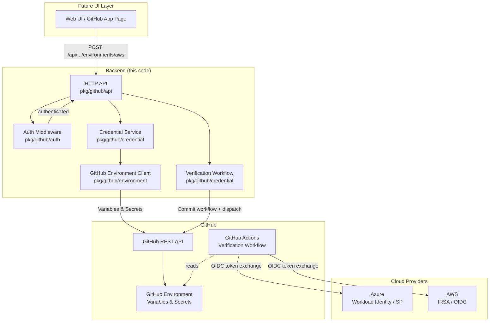
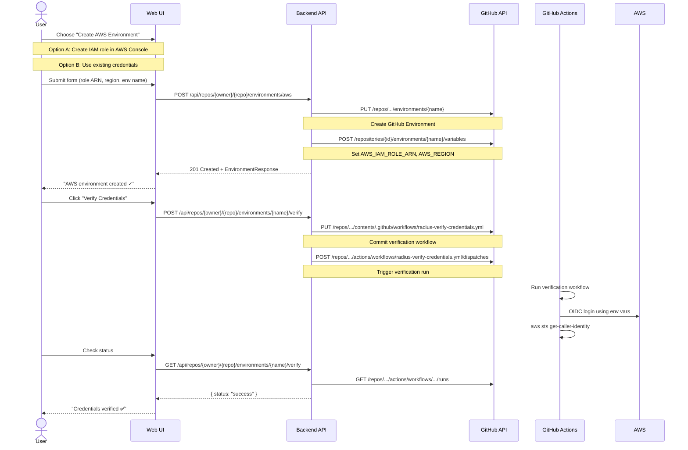

# GitHub OIDC Credential Backend for Radius

Backend service for integrating Radius deployments with GitHub. Manages cloud credentials (Azure/AWS) by saving configuration to GitHub Environment variables. Credentials are consumed by GitHub Actions workflows at deploy time — **Radius does not store credentials itself**; they come from the GitHub Environment.

Includes a credential verification workflow that tests cloud access after setup.

## Architecture



## Credential Flow



## Package Structure

```
pkg/github/
├── auth/           # GitHub App JWT, OAuth, session middleware
│   ├── app.go          - App JWT generation + installation token exchange
│   ├── oauth.go        - User OAuth (Authorization Code flow)
│   ├── middleware.go    - chi middleware (session validation)
│   └── auth_test.go
│
├── environment/    # GitHub Environment variables & secrets
│   ├── client.go       - CRUD for environments, variables, secrets
│   └── client_test.go
│
├── credential/     # Credential management + verification
│   ├── types.go        - AWSEnvironmentConfig, AzureEnvironmentConfig, etc.
│   ├── register.go     - Service: save credentials to GitHub Environment
│   ├── verify.go       - Verifier: commit + trigger verification workflow
│   └── register_test.go
│
├── api/            # HTTP routes + handlers
│   ├── types.go        - Request/response structs
│   ├── routes.go       - chi router registration
│   ├── handlers.go     - HTTP handlers
│   └── handlers_test.go
│
└── README.md       # This file

cmd/github-app/
└── main.go         # Server entry point
```

## API Reference

All `/api/` routes require authentication (Bearer token or session cookie).

### Create AWS Environment

```
POST /api/repos/{owner}/{repo}/environments/aws
```

**Request:**
```json
{
  "name": "dev",
  "roleARN": "arn:aws:iam::123456789:role/radius-deploy",
  "region": "us-east-1"
}
```

**Response (201):**
```json
{
  "name": "dev",
  "provider": "aws",
  "githubEnvironmentCreated": true,
  "variablesSet": ["AWS_IAM_ROLE_ARN", "AWS_REGION"],
  "credentialsVerified": false
}
```

### Create Azure Environment

```
POST /api/repos/{owner}/{repo}/environments/azure
```

**Request (Workload Identity):**
```json
{
  "name": "dev",
  "tenantID": "00000000-0000-0000-0000-000000000000",
  "clientID": "11111111-1111-1111-1111-111111111111",
  "subscriptionID": "22222222-2222-2222-2222-222222222222",
  "resourceGroup": "my-rg",
  "authType": "WorkloadIdentity"
}
```

**Request (Service Principal):**
```json
{
  "name": "dev",
  "tenantID": "...",
  "clientID": "...",
  "subscriptionID": "...",
  "authType": "ServicePrincipal",
  "clientSecret": "..."
}
```

### Verify Credentials

Commits a verification workflow to the repo and triggers it. The workflow uses
OIDC to authenticate with the cloud provider using credentials from the GitHub
Environment.

```
POST /api/repos/{owner}/{repo}/environments/{name}/verify
```

**Response (202):**
```json
{
  "provider": "aws",
  "status": "pending",
  "message": "Verification workflow triggered. Poll the status endpoint for results."
}
```

### Get Verification Status

```
GET /api/repos/{owner}/{repo}/environments/{name}/verify
```

**Response (200):**
```json
{
  "status": "success",
  "message": "Cloud credentials verified successfully.",
  "workflowRunURL": "https://github.com/owner/repo/actions/runs/123456"
}
```

Status values: `pending`, `in_progress`, `success`, `failure`

### Get Environment Status

```
GET /api/repos/{owner}/{repo}/environments/{name}
```

### Delete Environment

```
DELETE /api/repos/{owner}/{repo}/environments/{name}
```

### Health Check

```
GET /healthz
```

## Configuration

| Environment Variable | Required | Description |
|---|---|---|
| `PORT` | No | Server port (default: `8080`) |
| `GITHUB_APP_ID` | Yes* | GitHub App numeric ID |
| `GITHUB_PRIVATE_KEY_PATH` | Yes* | Path to GitHub App RSA private key PEM |
| `GITHUB_INSTALLATION_ID` | Yes* | GitHub App installation ID |
| `GITHUB_CLIENT_ID` | Yes | OAuth App client ID |
| `GITHUB_CLIENT_SECRET` | Yes | OAuth App client secret |
| `GITHUB_REDIRECT_URL` | No | OAuth callback URL (default: `http://localhost:{PORT}/auth/github/callback`) |
| `GITHUB_TOKEN` | No | Static token for development (used when App auth is not configured) |

\* Required for production. For development, set `GITHUB_TOKEN` instead.

## Design Decisions

### Credentials live in GitHub, not Radius

Credentials are stored as **GitHub Environment variables** (and secrets for SP client secrets). At deploy time, a GitHub Actions workflow reads these variables and authenticates with the cloud provider via OIDC. Radius does not register or store credentials — it receives them from the workflow environment.

This means:
- No Radius credential registration API calls from this backend
- No dependency on `pkg/cli/credential` or Radius UCP clients
- Credentials are managed entirely through GitHub's infrastructure
- OIDC (Azure WI / AWS IRSA) means no long-lived secrets for most configurations

### Verification workflow

After setting up credentials, users can trigger a verification workflow that:
1. Is auto-committed to the repo (`.github/workflows/radius-verify-credentials.yml`)
2. Uses OIDC to authenticate with Azure/AWS using the GitHub Environment variables
3. Runs a simple cloud access check (`az account show` or `aws sts get-caller-identity`)
4. Reports success/failure via the GitHub Actions API

## Security

- **OAuth CSRF protection**: State parameter verified on callback
- **GitHub secrets encryption**: SP client secrets encrypted with NaCl sealed box before GitHub API call
- **Session management**: In-memory session store (replace with persistent store for production)
- **No credential logging**: Sensitive fields never logged
- **OIDC by default**: Workload Identity (Azure) and IRSA (AWS) are recommended — no long-lived secrets needed

## Adding a UI

The backend is designed so that adding a UI requires only calling existing HTTP endpoints:

1. Build a React/Vue/etc. frontend
2. Implement the OAuth login flow (redirect to `/auth/github/login`)
3. Call `POST /api/repos/{owner}/{repo}/environments/aws` or `.../azure` on form submit
4. Call `POST /api/.../environments/{name}/verify` to test credentials
5. Poll `GET /api/.../environments/{name}/verify` for verification status
6. Embed the frontend via Go `embed` in `cmd/github-app/main.go`

No backend changes required.

## Testing

### Unit Tests

Run all unit tests (no external dependencies required):

```bash
go test -v ./pkg/github/...
```

### Integration Tests (GitHub API)

The integration test exercises the real GitHub API — creating environments, setting variables, reading them back, and cleaning up. Requires a GitHub token with repo access:

```bash
export GITHUB_TOKEN="ghp_..."
export TEST_GITHUB_OWNER="your-org"
export TEST_GITHUB_REPO="your-repo"
go test -v -tags=integration -run TestIntegration ./pkg/github/environment/...
```

The integration tests create temporary environments named `radius-test-{timestamp}` and clean them up automatically.

### CI Workflow

The workflow [.github/workflows/test-github-oidc-integration.yaml](../../.github/workflows/test-github-oidc-integration.yaml) runs automatically on PRs that change `pkg/github/` or `cmd/github-app/`. It includes:

| Job | What it tests |
|---|---|
| **Unit Tests** | `go test ./pkg/github/...` — all packages, race detector enabled |
| **Integration Test** | Real GitHub API: create env → set vars → read vars → delete env |
| **Credential Flow Test** | Builds + starts server binary, tests health endpoint, verifies auth middleware returns 401 for unauthenticated requests, runs verification workflow generation tests |
| **Summary** | Reports pass/fail across all jobs |

Trigger manually via **Actions → "Test: GitHub OIDC Integration" → Run workflow**.
